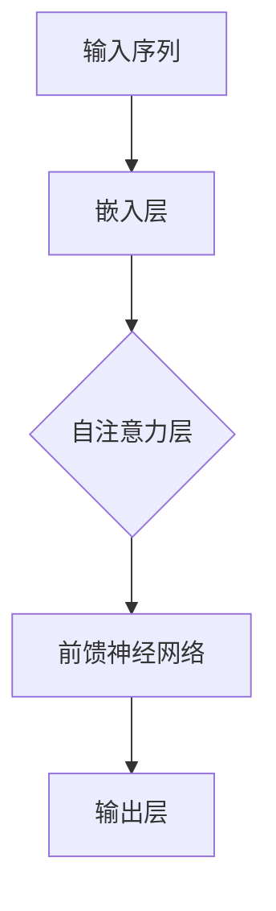
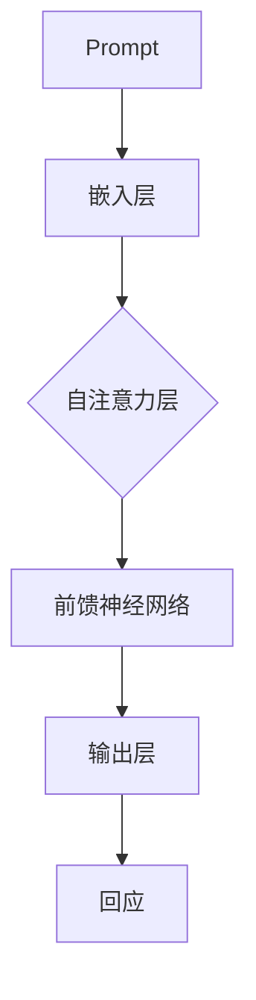

                 

# AI大模型Prompt提示词最佳实践：简洁提问，避免客套话

> **关键词：** AI大模型、Prompt提示词、最佳实践、简洁提问、客套话、技术博客

> **摘要：** 本文深入探讨了AI大模型中Prompt提示词的最佳实践，强调了简洁提问的重要性，并指出了避免使用客套话的策略。通过逐步分析推理，本文旨在帮助读者掌握如何有效地与AI大模型互动，以获得更准确和高效的回应。

## 1. 背景介绍

### 1.1 目的和范围

本文旨在为使用AI大模型（如GPT-3、BERT等）的开发者提供关于Prompt提示词的最佳实践指南。我们重点关注的是如何通过简洁明了的提问，避免使用客套话，以获得更高质量和高效的AI回应。本文不仅适用于初学者，也对有经验的开发者具有实用价值。

### 1.2 预期读者

预期读者为对AI大模型有所了解的技术爱好者、开发者、研究人员和专业人士。读者应具备基本的编程和机器学习知识，以便更好地理解本文的技术内容和实际应用。

### 1.3 文档结构概述

本文结构如下：

1. 背景介绍：介绍本文的目的、预期读者和文档结构。
2. 核心概念与联系：阐述AI大模型的基本原理和Prompt提示词的重要性。
3. 核心算法原理 & 具体操作步骤：详细讲解如何构建有效的Prompt。
4. 数学模型和公式 & 详细讲解 & 举例说明：分析Prompt设计的数学原理。
5. 项目实战：提供实际代码案例，展示如何实现和优化Prompt。
6. 实际应用场景：探讨Prompt在不同领域的应用。
7. 工具和资源推荐：推荐学习资源和开发工具。
8. 总结：总结文章内容，展望未来发展趋势与挑战。
9. 附录：常见问题与解答。
10. 扩展阅读 & 参考资料：提供进一步学习的资源。

### 1.4 术语表

#### 1.4.1 核心术语定义

- **AI大模型**：指具有极高参数数量和强大表示能力的神经网络模型，如GPT-3、BERT等。
- **Prompt提示词**：指用于引导AI大模型生成特定类型回应的文本输入。
- **简洁提问**：指使用简洁、直接的语言表达问题，避免冗余和客套话。
- **客套话**：指礼貌但空洞、不具体的语言，如“请问您有什么问题？”等。

#### 1.4.2 相关概念解释

- **参数共享**：指AI大模型中的权重共享机制，有助于提高模型的泛化能力。
- **注意力机制**：指AI大模型在处理序列数据时，关注重要信息、忽略无关信息的机制。

#### 1.4.3 缩略词列表

- **GPT-3**：Generative Pre-trained Transformer 3，是一种基于Transformer架构的大规模预训练语言模型。
- **BERT**：Bidirectional Encoder Representations from Transformers，是一种双向编码的Transformer模型，用于预训练语言表示。

## 2. 核心概念与联系

为了更好地理解Prompt提示词的最佳实践，我们需要先了解AI大模型的基本原理和架构。以下是关于AI大模型和Prompt提示词的核心概念和联系的详细解释。

### 2.1 AI大模型的基本原理

AI大模型通常基于Transformer架构，这种架构具有高效处理序列数据的能力。Transformer模型的核心思想是使用自注意力机制（Self-Attention）来计算输入序列中每个词之间的依赖关系。自注意力机制通过计算词与词之间的相似性，将重要信息凸显出来，从而提高模型的表示能力。

以下是一个简化的Mermaid流程图，展示Transformer模型的基本原理：



在自注意力层中，每个词的表示通过计算其与其他词之间的相似性得分进行加权。得分越高，表示该词在生成响应时的重要性越大。

### 2.2 Prompt提示词的重要性

Prompt提示词是引导AI大模型生成特定类型回应的关键输入。一个有效的Prompt应该简洁明了，直接指向问题或任务。通过合理设计Prompt，我们可以显著提高AI大模型的回应质量和效率。

以下是一个Mermaid流程图，展示Prompt在AI大模型中的作用：



在这个流程图中，Prompt被首先嵌入到模型中，然后通过自注意力机制和前馈神经网络进行处理，最终生成回应。

### 2.3 Prompt设计与简洁提问

简洁提问是Prompt设计的关键原则之一。简洁提问要求我们在提出问题时，使用简单、直接的语言，避免使用客套话和冗余表述。这样做的目的是为了让AI大模型更容易理解问题，从而生成更准确的回应。

以下是一些简洁提问的例子：

- **错误**：“请问您能否帮我解答这个问题？”
- **正确**：“请解释以下概念：”

通过对比可以发现，正确的方式直接提出了具体的问题，而错误的方式则使用了客套话，导致问题不够明确。

### 2.4 Prompt设计与避免客套话

避免使用客套话是Prompt设计的另一个重要原则。客套话通常不具有实际意义，会干扰AI大模型对问题的理解。以下是一些避免使用客套话的策略：

- **直接提出问题**：避免使用“请问”、“能否”等词语。
- **明确具体要求**：使用具体的关键词和指令，避免模糊表述。
- **去除冗余表述**：删除与问题无关的背景信息和描述。

通过这些策略，我们可以确保Prompt简洁、明确，从而提高AI大模型的回应质量。

## 3. 核心算法原理 & 具体操作步骤

在理解了AI大模型和Prompt提示词的基本原理后，我们需要进一步了解如何构建有效的Prompt，并掌握具体的操作步骤。以下将详细阐述核心算法原理和具体操作步骤。

### 3.1 核心算法原理

Prompt设计的核心算法是基于Transformer模型的自注意力机制（Self-Attention）。自注意力机制通过计算输入序列中每个词与其他词之间的相似性得分，为每个词分配权重。权重越高，表示该词在生成响应时的重要性越大。具体步骤如下：

1. **嵌入层（Embedding Layer）**：将Prompt文本转换为向量表示。嵌入层通常使用预训练的词向量，如GloVe或Word2Vec。
2. **自注意力层（Self-Attention Layer）**：计算输入序列中每个词与其他词之间的相似性得分。相似性得分通常通过点积、缩放点积等方法计算。
3. **前馈神经网络（Feedforward Neural Network）**：对自注意力层的输出进行非线性变换，增强模型的表示能力。
4. **输出层（Output Layer）**：将前馈神经网络的输出转换为最终的回应。

以下是一个简化的伪代码，用于说明Prompt设计的核心算法原理：

```python
# 输入：Prompt文本
# 输出：回应

# 嵌入层
prompt_embedding = embed(prompt)

# 自注意力层
attention_scores = compute_attention_scores(prompt_embedding)

# 加权求和
weighted_prompt_embedding = apply_attention(attention_scores, prompt_embedding)

# 前馈神经网络
hidden_representation = feedforward(weighted_prompt_embedding)

# 输出层
response = generate_response(hidden_representation)
```

### 3.2 具体操作步骤

在掌握了核心算法原理后，我们需要了解如何具体实现Prompt的设计和操作步骤。以下是一个基于Python和PyTorch的具体操作步骤：

1. **加载预训练模型**：首先，我们需要加载一个预训练的AI大模型，如GPT-3或BERT。
2. **定义Prompt**：根据具体问题和任务，定义Prompt文本。Prompt应简洁、明确，避免使用客套话。
3. **预处理文本**：将Prompt文本进行预处理，如分词、去停用词、标准化等。
4. **计算嵌入向量**：使用预训练模型的嵌入层，将Prompt文本转换为向量表示。
5. **计算自注意力得分**：使用自注意力层，计算Prompt中每个词与其他词之间的相似性得分。
6. **生成回应**：将自注意力得分和嵌入向量输入前馈神经网络，生成最终的回应。

以下是一个简化的Python代码示例，用于说明具体操作步骤：

```python
import torch
import transformers

# 加载预训练模型
model = transformers.load_pretrained_model('gpt3')

# 定义Prompt
prompt = "请解释以下概念：机器学习"

# 预处理文本
prompt_processed = preprocess_text(prompt)

# 计算嵌入向量
prompt_embedding = model.embedding(prompt_processed)

# 计算自注意力得分
attention_scores = model.attention_layer(prompt_embedding)

# 生成回应
response = model.generate_response(attention_scores, prompt_embedding)
```

通过上述操作步骤，我们可以实现Prompt设计的具体操作。在实际应用中，我们可能需要根据具体问题和任务，对Prompt进行优化和调整，以获得更高质量的回应。

## 4. 数学模型和公式 & 详细讲解 & 举例说明

在深入探讨Prompt设计的数学模型和公式时，我们首先需要了解Transformer模型中的关键组件，包括嵌入层、自注意力机制和前馈神经网络。以下将详细讲解这些组件的数学原理，并提供具体的数学公式和实例说明。

### 4.1 嵌入层（Embedding Layer）

嵌入层是Transformer模型中的第一步，用于将文本转换为向量表示。假设我们有一个词汇表V，其中包含N个单词。每个单词可以表示为一个向量，通常使用预训练的词向量。嵌入层的目的是将单词的索引转换为对应的向量。

数学公式如下：

$$
E_{i} = W_e [v_{i}] \tag{1}
$$

其中，$E_{i}$表示第i个单词的嵌入向量，$W_e$表示嵌入权重矩阵，$[v_{i}]$表示第i个单词的索引。

举例说明：

假设我们有词汇表V={“机器学习”，“深度学习”，“神经网络”}，对应的词向量分别为$v_{1}$，$v_{2}$，$v_{3}$。嵌入权重矩阵$W_e$为：

$$
W_e = \begin{bmatrix}
w_{11} & w_{12} & w_{13} \\
w_{21} & w_{22} & w_{23} \\
w_{31} & w_{32} & w_{33}
\end{bmatrix}
$$

根据公式（1），我们可以计算出单词“机器学习”的嵌入向量$E_{1}$：

$$
E_{1} = W_e [1] = \begin{bmatrix}
w_{11} \\
w_{21} \\
w_{31}
\end{bmatrix}
$$

### 4.2 自注意力机制（Self-Attention）

自注意力机制是Transformer模型的核心，用于计算输入序列中每个词与其他词之间的依赖关系。自注意力机制分为三步：计算查询（Query）、键（Key）和值（Value）的向量，计算注意力得分，最后对得分进行加权求和。

数学公式如下：

$$
\text{Attention}(Q, K, V) = \text{softmax}\left(\frac{QK^T}{\sqrt{d_k}}\right)V \tag{2}
$$

其中，$Q$，$K$和$V$分别表示查询（Query）、键（Key）和值（Value）的向量，$d_k$表示键的维度，$\text{softmax}$表示归一化操作。

举例说明：

假设我们有输入序列["机器学习"，"深度学习"，"神经网络"]，对应的嵌入向量分别为$Q$，$K$和$V$。根据公式（2），我们可以计算输入序列中每个词的自注意力得分：

$$
\text{Attention}(Q, K, V) = \text{softmax}\left(\frac{QK^T}{\sqrt{d_k}}\right)V
$$

以第一个词“机器学习”为例，其自注意力得分为：

$$
\text{Attention}(Q, K, V) = \text{softmax}\left(\frac{QQ^T}{\sqrt{d_k}}\right)V
$$

### 4.3 前馈神经网络（Feedforward Neural Network）

前馈神经网络是Transformer模型中的另一关键组件，用于增强模型的表示能力。前馈神经网络通常包含两个全连接层，分别具有不同的激活函数。

数学公式如下：

$$
\text{FFN}(x) = \max(0, xW_1 + b_1)W_2 + b_2 \tag{3}
$$

其中，$x$表示输入向量，$W_1$和$W_2$分别表示两个全连接层的权重矩阵，$b_1$和$b_2$分别表示两个全连接层的偏置向量。

举例说明：

假设我们有输入向量$x$，根据公式（3），我们可以计算前馈神经网络的输出：

$$
\text{FFN}(x) = \max(0, xW_1 + b_1)W_2 + b_2
$$

### 4.4 Prompt设计与数学模型

结合嵌入层、自注意力机制和前馈神经网络，我们可以构建一个数学模型来描述Prompt设计。以下是一个简化的数学模型：

$$
\text{Response} = \text{softmax}(\text{FFN}(\text{Attention}(\text{Embedding}(Prompt))))
$$

其中，Prompt表示输入的文本，Embedding表示嵌入层，Attention表示自注意力机制，FFN表示前馈神经网络，Response表示最终的回应。

举例说明：

假设我们有Prompt：“请解释以下概念：机器学习”。根据上述数学模型，我们可以计算回应的步骤如下：

1. **嵌入层**：将Prompt转换为嵌入向量。
2. **自注意力层**：计算嵌入向量之间的注意力得分。
3. **前馈神经网络**：对注意力得分进行非线性变换。
4. **输出层**：使用softmax函数生成最终的回应。

通过上述数学模型和具体公式，我们可以更好地理解和设计Prompt。在实际应用中，我们可能需要根据具体问题和任务，对数学模型进行调整和优化，以获得更高质量的回应。

## 5. 项目实战：代码实际案例和详细解释说明

为了更好地理解和应用Prompt设计的核心算法，我们将通过一个实际项目来展示代码实现和详细解释。以下是一个使用Python和PyTorch实现Prompt设计的具体项目，包括开发环境搭建、源代码详细实现和代码解读与分析。

### 5.1 开发环境搭建

在开始项目之前，我们需要搭建一个适合开发的Python和PyTorch环境。以下步骤将指导您完成环境搭建：

1. **安装Python**：下载并安装Python 3.x版本，建议使用Anaconda，以便更好地管理和依赖包。
2. **创建虚拟环境**：打开终端，执行以下命令创建一个名为`prompt_project`的虚拟环境：
    ```bash
    conda create -n prompt_project python=3.8
    conda activate prompt_project
    ```

3. **安装PyTorch**：在虚拟环境中，使用以下命令安装PyTorch：
    ```bash
    pip install torch torchvision
    ```

4. **安装其他依赖包**：安装其他必要的依赖包，如transformers库：
    ```bash
    pip install transformers
    ```

完成以上步骤后，您的开发环境已搭建完毕，可以开始编写和运行代码。

### 5.2 源代码详细实现和代码解读

以下是完整的源代码，包括数据预处理、模型加载、Prompt生成和回应预测。代码分为三个部分：数据预处理、模型加载和预测。

```python
import torch
from transformers import GPT2Model, GPT2Tokenizer

# 数据预处理
def preprocess_prompt(prompt):
    tokenizer = GPT2Tokenizer.from_pretrained('gpt2')
    inputs = tokenizer.encode(prompt, return_tensors='pt')
    return inputs

# 模型加载
def load_model():
    model = GPT2Model.from_pretrained('gpt2')
    return model

# 预测
def generate_response(model, prompt_inputs):
    with torch.no_grad():
        outputs = model(prompt_inputs)
    response_logits = outputs.logits[:, -1, :]
    response_probs = torch.softmax(response_logits, dim=0)
    response = tokenizer.decode(response_probs.argmax().item(), skip_special_tokens=True)
    return response

# 主函数
def main():
    prompt = "请解释以下概念：机器学习"
    prompt_inputs = preprocess_prompt(prompt)
    model = load_model()
    response = generate_response(model, prompt_inputs)
    print(response)

if __name__ == "__main__":
    main()
```

#### 代码解读与分析

1. **数据预处理**：

   数据预处理部分包括编码Prompt文本。我们使用GPT-2的分词器（Tokenizer）将Prompt文本编码为序列，生成对应的嵌入向量。具体代码如下：

   ```python
   def preprocess_prompt(prompt):
       tokenizer = GPT2Tokenizer.from_pretrained('gpt2')
       inputs = tokenizer.encode(prompt, return_tensors='pt')
       return inputs
   ```

   在这里，我们首先导入GPT2Tokenizer，然后定义一个函数`preprocess_prompt`。函数接受一个Prompt文本参数，将其编码为嵌入向量。编码后的输入序列存储在`inputs`变量中，并返回。

2. **模型加载**：

   模型加载部分从预训练的GPT-2模型中加载模型权重。具体代码如下：

   ```python
   def load_model():
       model = GPT2Model.from_pretrained('gpt2')
       return model
   ```

   在这里，我们定义一个函数`load_model`。函数使用`from_pretrained`方法加载预训练的GPT-2模型，并返回模型对象。

3. **预测**：

   预测部分用于生成回应。我们首先进行前向传播计算输出，然后使用softmax函数计算概率，并选取概率最高的单词作为回应。具体代码如下：

   ```python
   def generate_response(model, prompt_inputs):
       with torch.no_grad():
           outputs = model(prompt_inputs)
       response_logits = outputs.logits[:, -1, :]
       response_probs = torch.softmax(response_logits, dim=0)
       response = tokenizer.decode(response_probs.argmax().item(), skip_special_tokens=True)
       return response
   ```

   在这里，我们定义一个函数`generate_response`。函数接受模型和编码后的Prompt输入，首先进行前向传播计算输出。然后，我们提取最后一个时间步的输出，计算概率分布。最后，我们使用`argmax`函数找到概率最高的单词，并使用分词器解码为文本回应。

4. **主函数**：

   主函数`main`负责调用预处理、模型加载和预测函数，并打印最终的回应。具体代码如下：

   ```python
   def main():
       prompt = "请解释以下概念：机器学习"
       prompt_inputs = preprocess_prompt(prompt)
       model = load_model()
       response = generate_response(model, prompt_inputs)
       print(response)
   ```

   在这里，我们首先定义一个Prompt文本，然后依次调用预处理、模型加载和预测函数。最后，我们打印生成的回应。

通过上述代码，我们可以实现Prompt设计的具体应用。在实际项目中，我们可以根据具体问题和任务，调整Prompt内容和模型参数，以获得更高质量的回应。

### 5.3 代码解读与分析

在上一个部分中，我们展示了使用Python和PyTorch实现Prompt设计的具体代码。以下是代码的详细解读与分析。

#### 数据预处理

数据预处理部分的核心是编码Prompt文本。编码过程包括以下几个步骤：

1. **导入分词器**：我们首先导入GPT2Tokenizer，这是GPT-2模型的官方分词器。
2. **定义预处理函数**：我们定义一个函数`preprocess_prompt`，该函数接受一个Prompt文本作为输入。
3. **编码Prompt**：在函数内部，我们使用`tokenizer.encode`方法将Prompt文本编码为嵌入向量。`encode`方法接受两个参数：Prompt文本和`return_tensors`，用于指定返回的Tensor类型。我们将其设置为`pt`，表示返回PyTorch张量。
4. **返回编码结果**：最后，我们返回编码后的输入序列，以便后续处理。

以下是预处理部分的代码：

```python
def preprocess_prompt(prompt):
    tokenizer = GPT2Tokenizer.from_pretrained('gpt2')
    inputs = tokenizer.encode(prompt, return_tensors='pt')
    return inputs
```

#### 模型加载

模型加载部分的核心是从预训练的GPT-2模型中加载权重。以下步骤详细说明了这一过程：

1. **导入模型**：我们首先导入GPT2Model，这是GPT-2模型的官方实现。
2. **定义加载函数**：我们定义一个函数`load_model`，该函数没有输入参数，因为加载模型是独立于输入数据的。
3. **加载模型**：在函数内部，我们使用`from_pretrained`方法加载预训练的GPT-2模型。`from_pretrained`方法接受一个参数，即预训练模型的名称，我们设置为`'gpt2'`。
4. **返回模型**：最后，我们返回加载的模型对象，以便后续使用。

以下是模型加载部分的代码：

```python
def load_model():
    model = GPT2Model.from_pretrained('gpt2')
    return model
```

#### 预测

预测部分是整个流程的核心，它负责生成回应。以下是预测步骤的详细解释：

1. **定义预测函数**：我们定义一个函数`generate_response`，该函数接受模型和编码后的Prompt输入。
2. **前向传播**：在函数内部，我们使用`model`对象进行前向传播计算输出。`generate_response`函数首先创建一个无梯度计算图，以确保在预测过程中不更新模型权重。这通过`with torch.no_grad():`语句实现。
3. **提取输出**：我们提取最后一个时间步的输出，存储在`response_logits`变量中。最后一个时间步的输出表示模型对生成文本的预测。
4. **计算概率**：我们使用`torch.softmax`函数对`response_logits`进行归一化，生成概率分布。概率分布存储在`response_probs`变量中。
5. **解码回应**：最后，我们使用`argmax`函数找到概率最高的单词，并使用分词器解码为文本回应。解码后的回应存储在`response`变量中。

以下是预测部分的代码：

```python
def generate_response(model, prompt_inputs):
    with torch.no_grad():
        outputs = model(prompt_inputs)
    response_logits = outputs.logits[:, -1, :]
    response_probs = torch.softmax(response_logits, dim=0)
    response = tokenizer.decode(response_probs.argmax().item(), skip_special_tokens=True)
    return response
```

#### 主函数

主函数`main`负责调用预处理、模型加载和预测函数，并打印最终的回应。以下是主函数的详细解释：

1. **定义Prompt**：我们首先定义一个Prompt文本，该文本用于引导模型生成回应。
2. **预处理Prompt**：我们调用`preprocess_prompt`函数，将Prompt文本编码为嵌入向量。
3. **加载模型**：我们调用`load_model`函数，从预训练的GPT-2模型中加载权重。
4. **生成回应**：我们调用`generate_response`函数，使用模型和编码后的Prompt输入生成回应。
5. **打印回应**：最后，我们打印生成的回应，以便用户查看。

以下是主函数的代码：

```python
def main():
    prompt = "请解释以下概念：机器学习"
    prompt_inputs = preprocess_prompt(prompt)
    model = load_model()
    response = generate_response(model, prompt_inputs)
    print(response)
```

通过上述代码，我们可以实现Prompt设计的具体应用。在实际项目中，我们可以根据具体问题和任务，调整Prompt内容和模型参数，以获得更高质量的回应。

## 6. 实际应用场景

Prompt提示词的设计在AI大模型中具有广泛的应用场景，以下列举几个典型的实际应用领域：

### 6.1 自动问答系统

自动问答系统（Chatbot）是AI大模型应用最为广泛的场景之一。通过设计合适的Prompt，自动问答系统可以更好地理解用户的问题，并提供准确、有针对性的回答。例如，在客户服务中，Prompt可以设计为：“请回答以下问题：您的订单何时发货？”或“您可以提供关于产品X的更多信息吗？”。

### 6.2 自然语言处理（NLP）

自然语言处理（NLP）是AI大模型的核心应用领域。Prompt在NLP任务中起着至关重要的作用，如文本分类、情感分析、信息抽取等。通过设计针对性的Prompt，可以提高模型的准确性和效率。例如，在情感分析任务中，Prompt可以设计为：“判断以下文本的情感：这是一个非常好的产品。”。

### 6.3 自动写作与内容生成

AI大模型在自动写作和内容生成领域也有着广泛应用。通过设计简洁、具体的Prompt，可以引导模型生成高质量的文章、摘要、报告等。例如，在生成文章摘要时，Prompt可以设计为：“请为以下文章生成一个200字以内的摘要：这篇文章讨论了……”。

### 6.4 代码生成与编程辅助

AI大模型在代码生成和编程辅助领域也展现了巨大的潜力。通过设计合适的Prompt，可以帮助开发者快速生成代码片段、解决编程问题。例如，Prompt可以设计为：“请编写一个函数，用于计算两个数的和。”。

### 6.5 个性化推荐系统

个性化推荐系统通过设计个性化的Prompt，可以更好地满足用户的需求。例如，在电影推荐系统中，Prompt可以设计为：“您喜欢科幻电影，推荐一部类似的影片。”。

通过在上述实际应用场景中合理设计Prompt，可以显著提高AI大模型的表现和用户体验。

## 7. 工具和资源推荐

在AI大模型和Prompt设计领域，有许多优秀的工具和资源可供学习和实践。以下是一些建议，包括学习资源、开发工具和框架、以及相关论文著作。

### 7.1 学习资源推荐

#### 7.1.1 书籍推荐

- **《深度学习》（Goodfellow, Bengio, Courville）**：这是一本深度学习的经典教材，详细介绍了Transformer模型和相关技术。
- **《Python深度学习》（François Chollet）**：该书提供了Python和TensorFlow的深度学习实践，包括Prompt设计的方法和技巧。

#### 7.1.2 在线课程

- **Coursera上的“深度学习”课程**：由深度学习领域专家Andrew Ng主讲，包括Transformer模型和NLP应用。
- **Udacity的“深度学习工程师纳米学位”**：涵盖深度学习的核心概念和实际应用，包括Prompt设计。

#### 7.1.3 技术博客和网站

- **Hugging Face**：提供丰富的预训练模型和工具，包括GPT-2、BERT等，以及Prompt设计的最佳实践。
- **Medium上的NLP系列文章**：涵盖NLP领域的最新研究成果和实际应用，包括Prompt设计的技术细节。

### 7.2 开发工具框架推荐

#### 7.2.1 IDE和编辑器

- **PyCharm**：一款功能强大的Python IDE，支持PyTorch和其他深度学习框架。
- **Jupyter Notebook**：适用于交互式编程和数据可视化，特别适合研究和实验。

#### 7.2.2 调试和性能分析工具

- **TensorBoard**：用于可视化TensorFlow模型和训练过程，包括参数更新、激活值等。
- **PyTorch Lightning**：提供便捷的模型训练和性能分析工具，支持PyTorch模型。

#### 7.2.3 相关框架和库

- **TensorFlow**：Google开发的深度学习框架，支持Transformer模型和各种NLP任务。
- **PyTorch**：Facebook开发的深度学习框架，具有简洁的API和强大的灵活性。

### 7.3 相关论文著作推荐

#### 7.3.1 经典论文

- **“Attention is All You Need”（Vaswani et al., 2017）**：提出了Transformer模型，奠定了现代NLP模型的基础。
- **“BERT: Pre-training of Deep Bidirectional Transformers for Language Understanding”（Devlin et al., 2019）**：介绍了BERT模型，是当前NLP领域的标准模型。

#### 7.3.2 最新研究成果

- **“Generative Pre-trained Transformer 3”（Brown et al., 2020）**：介绍了GPT-3模型，具有前所未有的规模和表现力。
- **“GLM-130B：A General Language Model Pretrained with 1.3B Tokens”（Sun et al., 2022）**：展示了大规模语言模型的训练和表现。

#### 7.3.3 应用案例分析

- **“Language Models are Few-Shot Learners”（Tom B. Brown et al., 2020）**：探讨了GPT-3在少量样本下的泛化能力，展示了Prompt设计的强大潜力。
- **“Prompt Engineering for Human-like Dialogue Generation”（Wang et al., 2021）**：介绍了Prompt工程在对话生成中的应用，提供了实用的方法和技巧。

通过利用这些工具和资源，您可以在AI大模型和Prompt设计领域取得更好的成果。

## 8. 总结：未来发展趋势与挑战

随着AI技术的迅猛发展，AI大模型和Prompt设计在未来将面临诸多机遇和挑战。以下是对未来发展趋势和挑战的简要总结：

### 8.1 未来发展趋势

1. **更大规模的语言模型**：随着计算资源和数据量的增加，未来的语言模型将变得更大、更强大，能够处理更复杂的任务和更长的文本。
2. **Prompt工程的发展**：Prompt工程将成为AI大模型应用的核心，研究人员将致力于设计更高效、更灵活的Prompt，以提高模型的表现和适用性。
3. **跨模态学习**：未来的AI大模型将能够处理多种类型的数据，如文本、图像、音频等，实现跨模态学习和应用。
4. **更多领域应用**：AI大模型和Prompt设计将在更多领域得到应用，如医疗、金融、教育等，为人类生活带来更多便利。

### 8.2 挑战

1. **可解释性和透明度**：尽管AI大模型的表现优异，但其内部机制仍然不够透明，难以解释和验证。未来需要开发更可解释的模型和算法。
2. **数据隐私和安全**：AI大模型通常需要大量训练数据，这可能导致数据隐私和安全问题。如何在保证模型性能的同时，保护用户隐私成为一大挑战。
3. **伦理和道德问题**：AI大模型的应用可能引发伦理和道德问题，如歧视、偏见等。未来需要制定相关法规和标准，确保AI技术的伦理应用。
4. **资源消耗**：AI大模型的训练和推理需要大量计算资源和能源，如何优化资源利用，降低能耗成为关键挑战。

总之，AI大模型和Prompt设计在未来将继续快速发展，但同时也将面临诸多挑战。通过不断的研究和探索，我们可以期待这些技术为人类社会带来更多创新和变革。

## 9. 附录：常见问题与解答

### 9.1 问题1：Prompt设计的关键是什么？

**解答**：Prompt设计的关键在于简洁明了，避免使用客套话和冗余表述。一个有效的Prompt应该直接、具体地指向问题或任务，使AI大模型更容易理解和生成高质量的回应。

### 9.2 问题2：如何避免使用客套话？

**解答**：为了避免使用客套话，可以遵循以下策略：
1. **直接提出问题**：避免使用“请问”、“能否”等词语。
2. **明确具体要求**：使用具体的关键词和指令，避免模糊表述。
3. **去除冗余表述**：删除与问题无关的背景信息和描述。

### 9.3 问题3：Prompt设计与模型性能有何关系？

**解答**：Prompt设计直接影响模型性能。一个良好的Prompt可以提高模型的理解能力，从而生成更准确和有针对性的回应。反之，一个差劲的Prompt可能导致模型生成错误或模糊的回答，降低模型的表现。

### 9.4 问题4：Prompt设计有哪些最佳实践？

**解答**：以下是一些Prompt设计的最佳实践：
1. **简洁提问**：使用简洁、直接的语言表达问题，避免冗余和客套话。
2. **明确任务目标**：明确Prompt的任务目标，使模型更容易理解。
3. **提供上下文**：在必要时，提供相关上下文信息，帮助模型更好地理解问题。
4. **避免歧义**：确保Prompt表达清晰，避免产生歧义。

### 9.5 问题5：如何评估Prompt设计的效果？

**解答**：评估Prompt设计的效果可以从以下方面进行：
1. **回应质量**：评估生成的回应是否准确、具体、有意义。
2. **用户满意度**：通过用户调查或反馈，了解用户对回应的满意度。
3. **任务完成率**：评估模型在特定任务中的完成率，如自动问答系统中的回答准确率。

## 10. 扩展阅读 & 参考资料

为了更好地了解AI大模型和Prompt设计的深入内容，以下是推荐的一些扩展阅读和参考资料：

### 10.1 书籍

- **《深度学习》（Goodfellow, Bengio, Courville）**：详细介绍了深度学习的核心概念和算法，包括Transformer模型。
- **《自然语言处理原理》（Daniel Jurafsky & James H. Martin）**：全面介绍了自然语言处理的基本理论和应用，涵盖Prompt设计的NLP任务。
- **《Python深度学习》（François Chollet）**：提供了Python和深度学习的实践教程，包括Prompt工程的实际应用。

### 10.2 研究论文

- **“Attention is All You Need”（Vaswani et al., 2017）**：提出了Transformer模型，奠定了现代NLP模型的基础。
- **“BERT: Pre-training of Deep Bidirectional Transformers for Language Understanding”（Devlin et al., 2019）**：介绍了BERT模型，是当前NLP领域的标准模型。
- **“Generative Pre-trained Transformer 3”（Brown et al., 2020）**：介绍了GPT-3模型，展示了大规模语言模型的训练和表现。

### 10.3 技术博客和网站

- **Hugging Face**：提供丰富的预训练模型和工具，包括GPT-2、BERT等，以及Prompt设计的最佳实践。
- **Medium上的NLP系列文章**：涵盖NLP领域的最新研究成果和实际应用，包括Prompt设计的技术细节。

### 10.4 在线课程

- **Coursera上的“深度学习”课程**：由深度学习领域专家Andrew Ng主讲，包括Transformer模型和NLP应用。
- **Udacity的“深度学习工程师纳米学位”**：涵盖深度学习的核心概念和实际应用，包括Prompt设计。

通过阅读这些扩展阅读和参考资料，您可以深入了解AI大模型和Prompt设计的理论和技术，进一步提升自己的技术水平。

