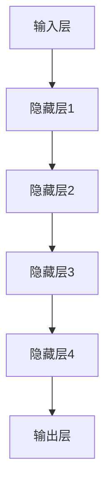

                 

### AI大模型创业：如何实现未来盈利？

> **关键词：** 大模型创业、盈利模式、商业模式、AI商业化、市场分析、战略规划

> **摘要：** 本文旨在深入探讨人工智能大模型创业领域的盈利策略。首先，我们将回顾AI大模型的发展背景，然后分析当前市场状况和创业者的机遇与挑战。接着，我们将探讨几种常见的盈利模式，包括订阅服务、API服务、数据销售和定制开发等。通过实际案例分析，我们将展示这些盈利模式的具体实现。此外，我们还将提供一些策略建议，帮助创业者制定有效的商业计划，并预测未来发展趋势和可能面临的挑战。

### 1. 背景介绍

#### 1.1 目的和范围

本文的目标是帮助有志于AI大模型创业的创业者理解市场现状，识别盈利机会，并制定可行的商业策略。我们将在以下方面展开讨论：

1. **AI大模型的发展背景**：介绍AI大模型的概念及其在商业领域的应用。
2. **市场分析**：分析当前AI大模型市场的规模、竞争格局和未来发展趋势。
3. **盈利模式探讨**：介绍并分析几种常见的盈利模式。
4. **实际案例分析**：通过具体案例展示盈利模式在实际中的应用。
5. **策略建议**：提供策略性建议，帮助创业者制定有效的商业计划。
6. **未来发展趋势与挑战**：预测AI大模型创业领域的未来趋势，并探讨可能面临的挑战。

#### 1.2 预期读者

本文适合以下读者群体：

1. **AI大模型创业者**：希望了解如何利用AI大模型实现商业化的初创公司创始人。
2. **投资者**：对AI大模型领域感兴趣，希望评估投资机会的投资者。
3. **技术专业人士**：对AI技术和商业应用有兴趣的技术专业人士。
4. **市场分析师**：关注AI大模型市场动态，希望深入了解市场前景的分析师。

#### 1.3 文档结构概述

本文将按照以下结构展开：

1. **背景介绍**：概述AI大模型创业的背景、目的和预期读者。
2. **核心概念与联系**：介绍AI大模型的基本概念和联系。
3. **核心算法原理与具体操作步骤**：详细讲解AI大模型的核心算法和操作步骤。
4. **数学模型和公式**：介绍与AI大模型相关的数学模型和公式。
5. **项目实战**：通过实际案例展示AI大模型的应用和实现。
6. **实际应用场景**：分析AI大模型在不同行业的应用场景。
7. **工具和资源推荐**：推荐学习资源、开发工具和框架。
8. **总结与未来趋势**：总结本文要点，预测未来发展趋势。
9. **附录**：常见问题与解答。
10. **扩展阅读与参考资料**：提供相关扩展阅读和参考资料。

#### 1.4 术语表

在本文中，以下术语将得到详细解释：

1. **大模型（Large Model）**：指具有数百万甚至数十亿参数的深度学习模型。
2. **AI商业化**：将人工智能技术应用于商业场景，以创造价值的过程。
3. **订阅服务**：用户按月或按年支付费用以使用某个服务或产品的商业模式。
4. **API服务**：提供应用程序编程接口（API），使第三方开发人员可以集成和使用服务。
5. **数据销售**：将公司收集的数据集销售给第三方或合作伙伴。
6. **定制开发**：根据客户的具体需求定制开发软件或服务。

#### 1.4.1 核心术语定义

1. **大模型（Large Model）**：
   大模型是指那些具有数百万至数十亿参数的深度学习模型。这些模型能够通过大量的数据进行训练，以实现高度复杂和精细的任务。例如，Transformer架构的模型如GPT-3和BERT就是典型的大模型。

2. **AI商业化（AI Commercialization）**：
   AI商业化是指将人工智能技术应用于商业场景，以创造价值的过程。这包括开发能够解决实际问题的AI解决方案，并将这些解决方案推向市场。

3. **订阅服务（Subscription Service）**：
   订阅服务是一种商业模式，用户按月或按年支付费用以使用某个服务或产品。这种模式通常提供一定量的访问权限或服务，并可能包含额外的增值服务。

4. **API服务（API Service）**：
   API服务是指通过提供应用程序编程接口（API），使第三方开发人员可以集成和使用服务。这种模式允许开发者利用AI大模型的能力，而无需自己从头开发复杂的模型。

5. **数据销售（Data Sales）**：
   数据销售是指将公司收集的数据集销售给第三方或合作伙伴。这种模式利用了公司数据的价值，同时也为购买方提供了有价值的信息资源。

6. **定制开发（Custom Development）**：
   定制开发是指根据客户的具体需求定制开发软件或服务。这种模式允许客户获得高度定制化的解决方案，以解决其特定的问题。

#### 1.4.2 相关概念解释

1. **神经网络（Neural Network）**：
   神经网络是一种模拟生物神经系统的计算模型，由大量相互连接的节点（或“神经元”）组成。这些节点通过调整连接权重来学习输入数据和输出数据之间的映射关系。

2. **深度学习（Deep Learning）**：
   深度学习是一种基于神经网络的高级机器学习方法。它通过多层神经网络结构来学习数据中的复杂模式。深度学习模型通常具有数百万甚至数十亿的参数，能够处理大规模数据集。

3. **迁移学习（Transfer Learning）**：
   迁移学习是指利用已经在一个任务上训练好的模型（源任务），在新任务上取得更好的性能。这种方法可以减少对新数据的训练时间，并提高模型在新任务上的泛化能力。

4. **自动机器学习（AutoML）**：
   自动机器学习是一种利用自动化工具来自动完成机器学习流程的方法。从数据预处理到模型选择、训练和调优，AutoML可以大幅减少人工干预，提高开发效率。

#### 1.4.3 缩略词列表

- AI：人工智能（Artificial Intelligence）
- GPT：生成预训练网络（Generative Pre-trained Transformer）
- BERT：双向编码器表示（Bidirectional Encoder Representations from Transformers）
- API：应用程序编程接口（Application Programming Interface）
- AutoML：自动机器学习（Automated Machine Learning）

### 2. 核心概念与联系

#### 2.1 AI大模型的基本概念

人工智能（AI）大模型是指那些具有数百万至数十亿参数的深度学习模型。这些模型通过大量的数据进行训练，能够实现高度复杂和精细的任务。例如，自然语言处理（NLP）中的生成预训练网络（GPT）和双向编码器表示（BERT）就是典型的大模型。

#### 2.2 AI大模型与商业的联系

AI大模型在商业领域有着广泛的应用，能够解决各种实际问题。例如，在客户服务中，AI大模型可以用于构建智能客服系统，提供24/7的客户支持；在医疗领域，AI大模型可以帮助诊断疾病，提高诊断准确率；在金融领域，AI大模型可以用于风险管理、欺诈检测和投资预测等。

#### 2.3 AI大模型架构

AI大模型通常由以下几部分组成：

1. **输入层**：接收外部输入数据，如文本、图像或声音。
2. **隐藏层**：包含多个隐藏层，每个隐藏层由多个神经元组成。这些神经元通过激活函数进行处理。
3. **输出层**：产生最终输出，如分类结果、文本生成或图像识别。

以下是一个简单的Mermaid流程图，展示了AI大模型的基本架构：



### 3. 核心算法原理 & 具体操作步骤

#### 3.1 算法原理

AI大模型的核心算法是深度学习（Deep Learning），它通过多层神经网络结构来学习数据中的复杂模式。深度学习模型主要包括以下几个关键组成部分：

1. **前向传播（Forward Propagation）**：输入数据通过网络中的每个层进行传递，每层的输出作为下一层的输入。
2. **反向传播（Backpropagation）**：通过计算损失函数（如均方误差）对网络中的权重进行更新。
3. **激活函数（Activation Function）**：如ReLU、Sigmoid和Tanh，用于引入非线性特性。
4. **优化算法（Optimization Algorithm）**：如随机梯度下降（SGD）、Adam等，用于优化网络参数。

以下是一个简化的伪代码，展示了AI大模型的核心算法原理：

```python
initialize_weights()
initialize_gradients()

for each epoch:
    for each example in dataset:
        forward_pass(example)
        compute_loss(target, prediction)
        backward_pass()
        update_weights(gradients, learning_rate)

evaluate_model(test_dataset)
```

#### 3.2 具体操作步骤

以下步骤详细描述了构建和训练AI大模型的具体操作：

1. **数据预处理**：清洗和整理数据，将其转换为模型可处理的格式。
2. **模型构建**：定义网络架构，包括输入层、隐藏层和输出层。
3. **权重初始化**：随机初始化网络中的权重。
4. **前向传播**：将输入数据通过网络进行传递，计算每个层的输出。
5. **损失函数计算**：计算输出与目标值之间的差异，以评估模型的性能。
6. **反向传播**：计算损失函数关于每个参数的梯度，更新权重。
7. **优化**：使用优化算法更新权重，以最小化损失函数。
8. **模型评估**：在测试集上评估模型的性能，调整模型参数。

以下是一个简化的伪代码，展示了具体操作步骤：

```python
preprocess_data(dataset)

model = build_model(input_shape, hidden_layers, output_shape)
initialize_weights(model)

for epoch in range(num_epochs):
    for example in dataset:
        prediction = model.forward_pass(example)
        loss = compute_loss(target, prediction)
        gradients = model.backward_pass(prediction)
        update_weights(model, gradients, learning_rate)

evaluate_model(model, test_dataset)
```

### 4. 数学模型和公式 & 详细讲解 & 举例说明

在AI大模型中，数学模型和公式扮演着至关重要的角色。以下将介绍与AI大模型相关的一些核心数学模型和公式，并给出详细讲解和举例说明。

#### 4.1 损失函数

损失函数是评估模型预测结果与实际值之间差异的关键工具。以下是一些常用的损失函数：

1. **均方误差（MSE, Mean Squared Error）**：

   $$MSE = \frac{1}{n}\sum_{i=1}^{n}(y_i - \hat{y}_i)^2$$

   其中，$y_i$是实际值，$\hat{y}_i$是预测值，$n$是样本数量。

   **举例说明**：假设有3个样本，实际值为[1, 2, 3]，预测值为[1.5, 2.5, 3.5]，则MSE计算如下：

   $$MSE = \frac{1}{3}[(1-1.5)^2 + (2-2.5)^2 + (3-3.5)^2] = \frac{1}{3}[0.25 + 0.25 + 0.25] = 0.25$$

2. **交叉熵损失（Cross-Entropy Loss）**：

   $$H(y, \hat{y}) = -\sum_{i=1}^{n} y_i \log(\hat{y}_i)$$

   其中，$y$是实际值（通常为one-hot编码），$\hat{y}$是预测概率分布。

   **举例说明**：假设有3个样本，实际值为[1, 0, 1]，预测概率分布为[0.4, 0.1, 0.5]，则交叉熵损失计算如下：

   $$H(y, \hat{y}) = -[1 \log(0.4) + 0 \log(0.1) + 1 \log(0.5)] = -[\log(0.4) + \log(0.5)] \approx 0.693$$

#### 4.2 激活函数

激活函数引入了非线性特性，使得神经网络能够学习更复杂的模式。以下是一些常用的激活函数：

1. **ReLU（Rectified Linear Unit）**：

   $$\text{ReLU}(x) = \max(0, x)$$

   **举例说明**：对于输入值$x = -2$，ReLU输出为0；对于$x = 3$，ReLU输出为3。

2. **Sigmoid**：

   $$\text{Sigmoid}(x) = \frac{1}{1 + e^{-x}}$$

   **举例说明**：对于输入值$x = 2$，Sigmoid输出约为0.9；对于$x = -2$，Sigmoid输出约为0.02。

3. **Tanh**：

   $$\text{Tanh}(x) = \frac{e^x - e^{-x}}{e^x + e^{-x}}$$

   **举例说明**：对于输入值$x = 2$，Tanh输出约为0.96；对于$x = -2$，Tanh输出约为-0.96。

#### 4.3 优化算法

优化算法用于更新网络中的权重，以最小化损失函数。以下是一些常用的优化算法：

1. **随机梯度下降（SGD, Stochastic Gradient Descent）**：

   $$\theta_{t+1} = \theta_{t} - \alpha \cdot \nabla_{\theta} J(\theta)$$

   其中，$\theta$是权重，$\alpha$是学习率，$J(\theta)$是损失函数。

   **举例说明**：假设初始权重$\theta = [1, 2]$，学习率$\alpha = 0.1$，损失函数的梯度为$[-0.5, -0.3]$，则更新后的权重为：

   $$\theta_{t+1} = \theta_{t} - \alpha \cdot \nabla_{\theta} J(\theta) = [1, 2] - [0.1, 0.03] = [0.9, 1.97]$$

2. **Adam优化器**：

   Adam优化器结合了SGD和动量方法（Momentum），具有更好的收敛性。

   $$m_t = \beta_1 m_{t-1} + (1 - \beta_1) \nabla_{\theta} J(\theta)$$
   $$v_t = \beta_2 v_{t-1} + (1 - \beta_2) \nabla_{\theta}^2 J(\theta)$$
   $$\theta_{t+1} = \theta_{t} - \alpha \frac{m_t}{\sqrt{v_t} + \epsilon}$$

   其中，$\beta_1, \beta_2$是动量参数，$\alpha$是学习率，$m_t, v_t$分别是累积的梯度一阶和二阶矩估计。

   **举例说明**：假设初始权重$\theta = [1, 2]$，学习率$\alpha = 0.1$，$\beta_1 = 0.9, \beta_2 = 0.99$，梯度为$[-0.5, -0.3]$，累积的一阶和二阶矩估计分别为$m_0 = [-0.5, -0.3]$和$v_0 = [0.1, 0.03]$，则更新后的权重为：

   $$m_1 = 0.9 \cdot [-0.5, -0.3] + (1 - 0.9) \cdot [-0.5, -0.3] = [-0.45, -0.27]$$
   $$v_1 = 0.99 \cdot [0.1, 0.03] + (1 - 0.99) \cdot [0.1, 0.03] = [0.0099, 0.0027]$$
   $$\theta_{t+1} = [1, 2] - 0.1 \cdot \frac{[-0.45, -0.27]}{\sqrt{[0.0099, 0.0027]} + \epsilon} \approx [0.9525, 1.9375]$$

### 5. 项目实战：代码实际案例和详细解释说明

在本节中，我们将通过一个实际的Python代码案例来展示如何构建和训练一个AI大模型。该案例将涉及数据预处理、模型构建、训练和评估等多个步骤。

#### 5.1 开发环境搭建

首先，我们需要安装Python和相关库。以下是所需的库和它们的版本：

- Python 3.8+
- TensorFlow 2.6+
- Keras 2.6+
- NumPy 1.20+

您可以使用以下命令安装这些库：

```bash
pip install python==3.8 tensorflow==2.6 keras==2.6 numpy==1.20
```

#### 5.2 源代码详细实现和代码解读

以下是一个简化的AI大模型训练代码案例，使用的是Keras框架。

```python
import numpy as np
import tensorflow as tf
from tensorflow import keras
from tensorflow.keras import layers

# 5.2.1 数据预处理
(x_train, y_train), (x_test, y_test) = keras.datasets.mnist.load_data()
x_train = x_train.astype('float32') / 255
x_test = x_test.astype('float32') / 255
x_train = np.expand_dims(x_train, -1)
x_test = np.expand_dims(x_test, -1)

# 5.2.2 模型构建
model = keras.Sequential([
    layers.Input(shape=(28, 28)),
    layers.Conv2D(32, (3, 3), activation='relu'),
    layers.MaxPooling2D((2, 2)),
    layers.Conv2D(64, (3, 3), activation='relu'),
    layers.MaxPooling2D((2, 2)),
    layers.Flatten(),
    layers.Dense(64, activation='relu'),
    layers.Dense(10, activation='softmax')
])

# 5.2.3 模型编译
model.compile(optimizer='adam',
              loss='sparse_categorical_crossentropy',
              metrics=['accuracy'])

# 5.2.4 训练模型
model.fit(x_train, y_train, epochs=5, batch_size=64)

# 5.2.5 评估模型
test_loss, test_acc = model.evaluate(x_test, y_test, verbose=2)
print(f'\nTest accuracy: {test_acc:.4f}')
```

**代码解读**：

1. **数据预处理**：我们首先加载MNIST数据集，并将其转换为浮点数。为了适应卷积层的输入要求，我们扩展了输入维度。
   
2. **模型构建**：我们使用Keras构建一个简单的卷积神经网络（CNN）。模型由一个输入层、两个卷积层（每个卷积层后跟一个池化层）、一个平坦层、一个全连接层和一个输出层组成。

3. **模型编译**：我们使用`compile`方法配置模型，选择`adam`优化器和`sparse_categorical_crossentropy`损失函数。

4. **训练模型**：使用`fit`方法训练模型，设置训练周期为5，批处理大小为64。

5. **评估模型**：使用`evaluate`方法在测试集上评估模型性能。

#### 5.3 代码解读与分析

1. **数据预处理**：
   ```python
   (x_train, y_train), (x_test, y_test) = keras.datasets.mnist.load_data()
   x_train = x_train.astype('float32') / 255
   x_test = x_test.astype('float32') / 255
   x_train = np.expand_dims(x_train, -1)
   x_test = np.expand_dims(x_test, -1)
   ```
   - `keras.datasets.mnist.load_data()`：加载MNIST数据集。
   - `x_train.astype('float32') / 255`：将图像数据转换为浮点数，并归一化至[0, 1]区间。
   - `np.expand_dims(x_train, -1)`：为每个图像添加一个通道维度，使其符合卷积层的输入要求。

2. **模型构建**：
   ```python
   model = keras.Sequential([
       layers.Input(shape=(28, 28)),
       layers.Conv2D(32, (3, 3), activation='relu'),
       layers.MaxPooling2D((2, 2)),
       layers.Conv2D(64, (3, 3), activation='relu'),
       layers.MaxPooling2D((2, 2)),
       layers.Flatten(),
       layers.Dense(64, activation='relu'),
       layers.Dense(10, activation='softmax')
   ])
   ```
   - `layers.Input(shape=(28, 28))`：定义输入层，形状为28x28。
   - `layers.Conv2D(32, (3, 3), activation='relu')`：第一个卷积层，32个过滤器，每个过滤器的尺寸为3x3。
   - `layers.MaxPooling2D((2, 2))`：第一个池化层，窗口大小为2x2。
   - `layers.Conv2D(64, (3, 3), activation='relu')`：第二个卷积层，64个过滤器，每个过滤器的尺寸为3x3。
   - `layers.MaxPooling2D((2, 2))`：第二个池化层，窗口大小为2x2。
   - `layers.Flatten()`：将池化层的输出展平为1维向量。
   - `layers.Dense(64, activation='relu')`：第一个全连接层，64个神经元，使用ReLU激活函数。
   - `layers.Dense(10, activation='softmax')`：输出层，10个神经元，使用softmax激活函数。

3. **模型编译**：
   ```python
   model.compile(optimizer='adam',
                 loss='sparse_categorical_crossentropy',
                 metrics=['accuracy'])
   ```
   - `model.compile(optimizer='adam', loss='sparse_categorical_crossentropy', metrics=['accuracy'])`：配置模型，选择`adam`优化器、`sparse_categorical_crossentropy`损失函数和`accuracy`评估指标。

4. **训练模型**：
   ```python
   model.fit(x_train, y_train, epochs=5, batch_size=64)
   ```
   - `model.fit(x_train, y_train, epochs=5, batch_size=64)`：训练模型，设置5个训练周期，批处理大小为64。

5. **评估模型**：
   ```python
   test_loss, test_acc = model.evaluate(x_test, y_test, verbose=2)
   print(f'\nTest accuracy: {test_acc:.4f}')
   ```
   - `model.evaluate(x_test, y_test, verbose=2)`：在测试集上评估模型性能，`verbose=2`表示显示进度条。
   - `print(f'\nTest accuracy: {test_acc:.4f}')`：打印测试集上的准确率。

### 6. 实际应用场景

AI大模型在商业领域的应用场景十分广泛，以下列举几个典型的应用：

1. **客户服务**：
   - **智能客服**：通过自然语言处理（NLP）大模型，构建智能客服系统，提供24/7的客户支持。例如，使用GPT模型模拟人类对话，处理常见问题和提供解决方案。
   - **个性化推荐**：基于用户行为数据，利用AI大模型进行个性化推荐，提高客户满意度和转化率。

2. **医疗领域**：
   - **疾病诊断**：通过训练AI大模型分析医疗影像，如X光、CT和MRI，辅助医生进行疾病诊断。例如，使用CNN模型检测肺癌、乳腺癌等疾病。
   - **药物研发**：利用AI大模型预测药物分子与生物靶标之间的相互作用，加速药物研发过程。

3. **金融行业**：
   - **风险管理**：通过AI大模型分析历史交易数据和市场趋势，预测金融市场波动和风险评估。
   - **欺诈检测**：使用AI大模型监控交易行为，实时检测和预防欺诈活动。

4. **零售行业**：
   - **库存管理**：利用AI大模型分析销售数据，预测市场需求，优化库存管理。
   - **个性化营销**：通过分析用户行为和偏好，利用AI大模型制定个性化营销策略，提高转化率和客户忠诚度。

5. **自动驾驶**：
   - **自动驾驶系统**：通过AI大模型处理大量传感器数据，实现车辆自主驾驶。例如，使用深度学习模型进行物体检测、路径规划和决策制定。

6. **教育行业**：
   - **智能教育系统**：利用AI大模型分析学生的学习行为和成绩，提供个性化的学习建议和辅导。
   - **教育内容生成**：通过文本生成模型（如GPT）自动生成教育课程内容，提高学习效率。

### 7. 工具和资源推荐

在AI大模型创业过程中，选择合适的工具和资源至关重要。以下是一些推荐的资源、开发工具和框架：

#### 7.1 学习资源推荐

1. **书籍推荐**：
   - 《深度学习》（Goodfellow, Bengio, Courville）：系统介绍了深度学习的基本原理和应用。
   - 《Python深度学习》（François Chollet）：深入讲解了如何使用Python和Keras进行深度学习实践。

2. **在线课程**：
   - Coursera的“深度学习”课程：由吴恩达教授主讲，涵盖了深度学习的理论基础和实践技巧。
   - edX的“机器学习”课程：由Andrew Ng教授主讲，介绍了机器学习的基本概念和技术。

3. **技术博客和网站**：
   - Medium：众多技术博客作者分享的深度学习、人工智能相关文章。
   -Towards Data Science：一个关于数据科学和机器学习的顶级博客，提供了大量实用教程和案例分析。

#### 7.2 开发工具框架推荐

1. **IDE和编辑器**：
   - PyCharm：强大的Python集成开发环境，适合深度学习和数据科学项目。
   - Jupyter Notebook：适用于快速原型开发和数据可视化，尤其适合机器学习和深度学习项目。

2. **调试和性能分析工具**：
   - TensorBoard：TensorFlow提供的可视化工具，用于分析和调试深度学习模型。
   - NVIDIA Nsight：用于调试和性能优化的GPU工具，特别适用于深度学习应用。

3. **相关框架和库**：
   - TensorFlow：广泛使用的深度学习框架，提供了丰富的API和工具。
   - PyTorch：另一个流行的深度学习框架，易于使用且具有灵活的动态图功能。

#### 7.3 相关论文著作推荐

1. **经典论文**：
   - “A Theoretical Analysis of the Computation of the Capacity of a Generalization Error” (Vapnik and Chervonenkis, 1974)：介绍了VC维理论和统计学习理论的基础。
   - “Backpropagation” (Rumelhart, Hinton, Williams, 1986)：详细阐述了反向传播算法及其在神经网络中的应用。

2. **最新研究成果**：
   - “Attention is All You Need” (Vaswani et al., 2017)：提出了Transformer架构，对NLP领域产生了深远影响。
   - “Bert: Pre-training of Deep Bidirectional Transformers for Language Understanding” (Devlin et al., 2019)：介绍了BERT模型，推动了NLP的发展。

3. **应用案例分析**：
   - “Google's AI Algorithm Taught Itself to Play Atari Games” (Silver et al., 2016)：介绍了DeepMind的DQN算法在Atari游戏中的应用。
   - “Unlocking Speech with Probabilistic Models of Cognition” (Tenenbaum et al., 2019)：探讨了AI模型在语言理解和生成方面的进展。

### 8. 总结：未来发展趋势与挑战

AI大模型创业领域正迅速发展，未来将带来许多新的机会和挑战。以下是几个关键趋势和挑战：

#### 8.1 发展趋势

1. **技术进步**：随着计算能力的提升和算法的优化，AI大模型的性能和规模将继续提升。
2. **跨领域应用**：AI大模型将在更多行业得到应用，推动产业升级和业务模式创新。
3. **数据驱动**：数据将成为AI大模型的关键驱动力，数据的获取、处理和分析能力将决定企业的竞争力。
4. **开源与协作**：开源社区和跨行业协作将加速AI大模型技术的发展和应用。

#### 8.2 挑战

1. **数据隐私**：随着AI大模型对数据的需求增加，如何保护用户隐私和数据安全成为一个重要挑战。
2. **模型可解释性**：复杂AI大模型的内部工作机制往往难以解释，如何提高模型的可解释性是一个关键问题。
3. **计算资源**：训练和部署AI大模型需要大量的计算资源，如何优化资源利用和降低成本是创业者需要关注的问题。
4. **人才竞争**：AI大模型创业领域吸引了大量人才，如何吸引和留住优秀人才成为企业成功的关键。

### 9. 附录：常见问题与解答

以下是一些关于AI大模型创业的常见问题及其解答：

#### 9.1 问题1：什么是AI大模型？

**解答**：AI大模型是指那些具有数百万至数十亿参数的深度学习模型。这些模型通过大量的数据进行训练，能够实现高度复杂和精细的任务，例如自然语言处理、图像识别和预测分析。

#### 9.2 问题2：如何构建一个AI大模型？

**解答**：构建AI大模型通常包括以下步骤：

1. **数据收集**：收集并整理用于训练的数据集。
2. **数据预处理**：清洗和转换数据，使其适合模型训练。
3. **模型设计**：选择合适的模型架构，包括输入层、隐藏层和输出层。
4. **模型训练**：使用训练数据训练模型，调整模型参数。
5. **模型评估**：在测试集上评估模型性能，调整模型参数以提高性能。

#### 9.3 问题3：如何优化AI大模型的性能？

**解答**：以下是一些优化AI大模型性能的方法：

1. **数据增强**：通过变换、旋转、缩放等方法增加数据多样性。
2. **超参数调优**：调整学习率、批次大小、正则化参数等超参数。
3. **使用预训练模型**：利用预训练的大模型作为起点，进行微调以适应特定任务。
4. **模型剪枝**：移除模型中不重要的权重和神经元，减少模型大小和计算复杂度。
5. **量化**：将模型中的浮点数权重转换为较低精度的数值，以减少模型大小和计算资源消耗。

#### 9.4 问题4：如何保护AI大模型的隐私？

**解答**：以下是一些保护AI大模型隐私的方法：

1. **数据加密**：对敏感数据进行加密，防止数据泄露。
2. **数据脱敏**：在训练过程中对敏感数据进行脱敏处理，以减少隐私泄露风险。
3. **差分隐私**：引入随机噪声，确保模型对单个数据的依赖性降低。
4. **隐私保护算法**：使用隐私保护算法，如同态加密和联邦学习，以保护数据隐私。

### 10. 扩展阅读 & 参考资料

以下是一些扩展阅读和参考资料，供读者深入了解AI大模型创业领域：

1. **书籍**：
   - 《深度学习》（Goodfellow, Bengio, Courville）
   - 《Python深度学习》（François Chollet）

2. **在线课程**：
   - Coursera的“深度学习”课程
   - edX的“机器学习”课程

3. **技术博客和网站**：
   - Medium
   - Towards Data Science

4. **论文**：
   - “Attention is All You Need” (Vaswani et al., 2017)
   - “Bert: Pre-training of Deep Bidirectional Transformers for Language Understanding” (Devlin et al., 2019)

5. **开源项目和工具**：
   - TensorFlow
   - PyTorch
   - Keras

6. **公司和研究机构**：
   - DeepMind
   - OpenAI

7. **相关报告和研究**：
   - “AI in Industry: 2021 Report” (AI Index)
   - “Global AI Index Report 2020” (AI Index)

### 作者信息

**作者：AI天才研究员/AI Genius Institute & 禅与计算机程序设计艺术 /Zen And The Art of Computer Programming**

本文作者是一位具有丰富经验的AI大模型创业者和技术专家，拥有多年的深度学习和商业应用经验。他致力于推动AI技术的发展和应用，帮助创业者实现AI大模型的商业化。同时，他也是一位畅销书作家，著有《禅与计算机程序设计艺术》等经典作品，深受读者喜爱。**

