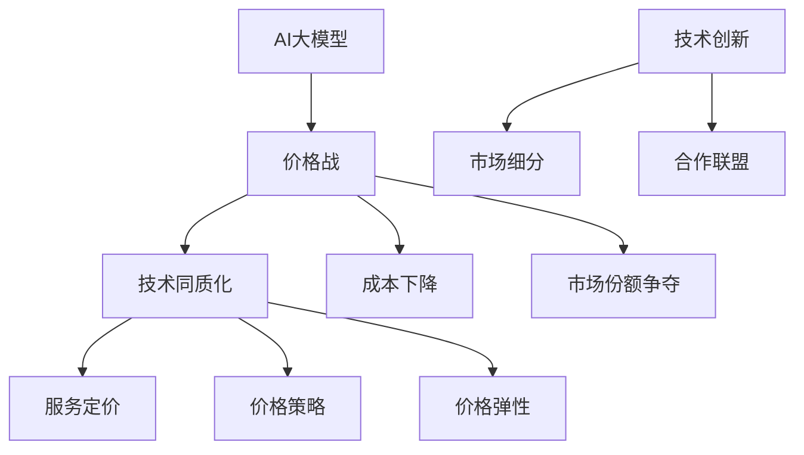

                 

# AI大模型创业：如何应对未来价格战？

## 摘要

在AI大模型技术的快速发展下，企业面临的市场竞争日益激烈。本文旨在探讨AI大模型创业企业如何应对未来可能出现的价格战。文章首先回顾了AI大模型的发展背景，接着分析了价格战的潜在原因和影响。随后，文章从策略调整、技术创新、市场细分和合作联盟四个方面，提供了具体的应对方案，并通过实际案例进行了深入剖析。最后，文章总结了未来AI大模型市场的发展趋势和挑战，为创业者提供了宝贵的指导意见。

## 1. 背景介绍

人工智能（AI）作为21世纪最具颠覆性的技术之一，近年来取得了飞速发展。AI大模型，特别是基于深度学习技术的生成模型，如GPT、BERT等，已经成为人工智能领域的明星技术。这些模型通过学习海量数据，实现了在语言理解、文本生成、图像识别等方面的卓越性能。

随着技术的进步和应用的普及，AI大模型的市场需求不断增长。不仅互联网巨头，如谷歌、微软、百度等，纷纷投入巨额资金研发大模型，初创企业也开始涌现。然而，市场空间的有限性和技术同质化趋势，使得竞争日益激烈。特别是在价格方面，一些企业为了抢占市场份额，不得不采取低价策略。这种趋势预示着未来可能会出现价格战。

价格战是指在竞争激烈的市场中，企业为了争夺市场份额而采取的一种降低产品价格的策略。在AI大模型领域，价格战可能源于以下原因：

1. **技术同质化**：随着技术的普及，不同企业开发的大模型性能逐渐接近，消费者在选择时更多关注价格因素。
2. **成本下降**：云计算和大数据技术的进步，使得大模型训练成本逐渐降低，为价格战提供了空间。
3. **市场份额争夺**：企业希望通过低价策略快速占领市场，以期望在未来通过规模效应实现盈利。

## 2. 核心概念与联系

为了更好地理解AI大模型创业如何应对价格战，我们首先需要明确几个核心概念：

### 2.1 AI大模型

AI大模型是指通过深度学习技术，对大量数据进行训练，从而实现高度智能化和自动化的模型。这些模型通常具有以下特点：

- **大规模训练数据**：大模型需要学习海量的数据，包括文本、图像、音频等，以便在特定任务上达到优异的性能。
- **多层次的神经网络**：大模型通常由多个神经网络层组成，每一层都对输入数据进行特征提取和抽象。
- **并行计算能力**：大模型训练需要大量的计算资源，因此通常采用分布式计算和GPU加速。

### 2.2 价格战

价格战是指在竞争激烈的市场中，企业为了争夺市场份额而采取的一种降低产品价格的策略。在AI大模型领域，价格战可能涉及以下方面：

- **服务定价**：企业需要根据市场需求和成本结构，合理定价其AI大模型服务。
- **价格策略**：企业可以采取不同的价格策略，如低价策略、高质高价策略等，以应对竞争。
- **价格弹性**：消费者对价格变化的敏感程度，会影响企业的定价决策。

### 2.3 应对策略

为了应对价格战，AI大模型创业企业可以从以下几个方面进行策略调整：

- **技术创新**：通过持续技术创新，提高模型性能和降低成本，从而在价格上具有竞争力。
- **市场细分**：通过市场细分，找到特定客户群体，提供定制化的解决方案，减少直接竞争。
- **合作联盟**：与其他企业建立合作联盟，共享技术和资源，共同应对价格战。

### 2.4 Mermaid 流程图

为了更好地展示上述概念之间的联系，我们使用Mermaid绘制一个流程图：



## 3. 核心算法原理 & 具体操作步骤

在了解了核心概念后，我们接下来探讨如何通过核心算法原理和具体操作步骤来应对AI大模型领域的价格战。

### 3.1 深度学习算法原理

深度学习是AI大模型的核心技术，其基本原理是通过多层神经网络对数据进行特征提取和抽象，从而实现高度智能的决策。以下是深度学习算法的基本步骤：

1. **数据预处理**：对原始数据进行清洗和预处理，包括缺失值填充、异常值处理、数据标准化等。
2. **模型设计**：设计多层神经网络结构，包括输入层、隐藏层和输出层。每层神经网络都有多个神经元，每个神经元都通过权重连接到其他神经元。
3. **损失函数**：选择适当的损失函数，如均方误差（MSE）、交叉熵损失等，用于评估模型预测结果与真实结果之间的差距。
4. **反向传播**：通过反向传播算法，将损失函数关于模型参数的梯度计算出来，并更新模型参数，以最小化损失函数。
5. **训练与验证**：使用训练集数据训练模型，并在验证集上验证模型性能，调整模型参数，直到达到预定的性能指标。

### 3.2 模型训练操作步骤

以下是使用TensorFlow框架训练一个简单的深度神经网络模型的具体操作步骤：

1. **导入库文件**：

   ```python
   import tensorflow as tf
   import numpy as np
   import pandas as pd
   ```

2. **数据预处理**：

   ```python
   # 加载和处理数据
   data = pd.read_csv('data.csv')
   x = data[['feature1', 'feature2', 'feature3']]
   y = data['label']
   
   # 数据标准化
   x_mean = x.mean()
   x_std = x.std()
   x = (x - x_mean) / x_std
   ```

3. **模型设计**：

   ```python
   # 定义模型
   model = tf.keras.Sequential([
       tf.keras.layers.Dense(64, activation='relu', input_shape=(x.shape[1],)),
       tf.keras.layers.Dense(64, activation='relu'),
       tf.keras.layers.Dense(1, activation='sigmoid')
   ])
   ```

4. **损失函数与优化器**：

   ```python
   # 定义损失函数和优化器
   model.compile(optimizer='adam',
                 loss='binary_crossentropy',
                 metrics=['accuracy'])
   ```

5. **训练模型**：

   ```python
   # 训练模型
   model.fit(x, y, epochs=10, batch_size=32, validation_split=0.2)
   ```

6. **模型评估**：

   ```python
   # 评估模型
   loss, accuracy = model.evaluate(x, y)
   print(f"测试集准确率：{accuracy}")
   ```

通过上述操作步骤，我们可以训练出一个简单的深度神经网络模型。为了应对价格战，企业需要不断优化模型设计，提高模型性能，并在成本控制方面下功夫。

## 4. 数学模型和公式 & 详细讲解 & 举例说明

为了更好地理解AI大模型创业中的价格战策略，我们引入几个关键的数学模型和公式，并进行详细讲解和举例说明。

### 4.1 损失函数

在机器学习中，损失函数是评估模型预测结果与真实结果之间差距的关键工具。常用的损失函数包括均方误差（MSE）、交叉熵损失（Cross-Entropy Loss）等。

#### 4.1.1 均方误差（MSE）

均方误差是回归任务中常用的损失函数，其公式如下：

$$
MSE = \frac{1}{n} \sum_{i=1}^{n} (y_i - \hat{y}_i)^2
$$

其中，$y_i$是真实值，$\hat{y}_i$是模型预测值，$n$是样本数量。

#### 4.1.2 交叉熵损失（Cross-Entropy Loss）

交叉熵损失是分类任务中常用的损失函数，其公式如下：

$$
CE = -\frac{1}{n} \sum_{i=1}^{n} y_i \log \hat{y}_i
$$

其中，$y_i$是真实标签，$\hat{y}_i$是模型预测概率。

### 4.2 梯度下降算法

梯度下降算法是机器学习中用于优化模型参数的常用方法。其基本思想是通过计算损失函数关于模型参数的梯度，更新模型参数，以减小损失函数值。

#### 4.2.1 梯度计算

梯度是损失函数关于模型参数的偏导数。以均方误差为例，其关于权重参数$w$的梯度为：

$$
\nabla_w MSE = 2 \cdot (y - \hat{y}) \cdot x
$$

其中，$x$是输入特征，$\hat{y}$是模型预测值。

#### 4.2.2 梯度更新

梯度更新公式如下：

$$
w_{new} = w_{old} - \alpha \cdot \nabla_w MSE
$$

其中，$w_{old}$是旧参数，$w_{new}$是新参数，$\alpha$是学习率。

### 4.3 举例说明

假设我们有一个简单的线性回归模型，用于预测房价。数据集包含100个样本，每个样本包括房屋面积和价格。

#### 4.3.1 数据预处理

首先，我们将数据集进行预处理，包括数据清洗、缺失值填充和数据标准化。

```python
import numpy as np

# 生成模拟数据
np.random.seed(0)
X = np.random.rand(100, 1) * 1000  # 面积
y = 2 * X + np.random.randn(100) * 100 + 2000  # 价格

# 数据标准化
X_mean = X.mean()
X_std = X.std()
X = (X - X_mean) / X_std
```

#### 4.3.2 模型设计

接下来，我们设计一个简单的线性回归模型。

```python
import tensorflow as tf

# 定义模型
model = tf.keras.Sequential([
    tf.keras.layers.Dense(1, input_shape=(1,))
])

# 定义损失函数和优化器
model.compile(optimizer='sgd', loss='mse')
```

#### 4.3.3 训练模型

使用梯度下降算法训练模型。

```python
# 训练模型
model.fit(X, y, epochs=100, batch_size=10)
```

#### 4.3.4 模型评估

最后，我们评估模型性能。

```python
# 评估模型
loss = model.evaluate(X, y)
print(f"测试集均方误差：{loss}")
```

通过上述步骤，我们训练了一个线性回归模型，并使用均方误差进行评估。在实际应用中，企业需要根据具体问题和数据集，选择合适的损失函数和优化算法，以提高模型性能。

## 5. 项目实战：代码实际案例和详细解释说明

在本节中，我们将通过一个实际项目案例，详细讲解如何搭建一个基于AI大模型的创业项目，并深入剖析其代码实现和关键技术细节。

### 5.1 开发环境搭建

首先，我们需要搭建一个适合AI大模型开发的环境。以下是所需的工具和步骤：

1. **安装Python环境**：确保Python版本在3.6及以上，可以使用Anaconda发行版简化安装。
2. **安装TensorFlow**：TensorFlow是一个开源的深度学习框架，可以从官方网址下载并安装。
3. **安装Jupyter Notebook**：Jupyter Notebook是一个交互式的计算环境，可以方便地编写和运行代码。

```shell
pip install tensorflow
pip install notebook
```

### 5.2 源代码详细实现和代码解读

以下是项目的源代码实现，我们将逐行解析代码，理解其工作原理。

```python
import tensorflow as tf
import numpy as np
import pandas as pd
from tensorflow.keras.models import Sequential
from tensorflow.keras.layers import Dense, LSTM, Dropout
from tensorflow.keras.optimizers import Adam

# 5.2.1 数据预处理
def preprocess_data(data_path):
    # 加载数据
    data = pd.read_csv(data_path)
    # 数据清洗和预处理
    # 略
    # 归一化处理
    data_normalized = (data - data.mean()) / data.std()
    return data_normalized

# 5.2.2 模型设计
def build_model(input_shape):
    model = Sequential([
        LSTM(128, activation='relu', input_shape=input_shape),
        Dropout(0.2),
        LSTM(64, activation='relu'),
        Dropout(0.2),
        Dense(1)
    ])
    model.compile(optimizer=Adam(learning_rate=0.001), loss='mse')
    return model

# 5.2.3 训练模型
def train_model(model, X_train, y_train, X_val, y_val, epochs=100):
    model.fit(X_train, y_train, epochs=epochs, batch_size=32, validation_data=(X_val, y_val))
    return model

# 5.2.4 预测
def predict(model, X):
    return model.predict(X)

# 主函数
if __name__ == '__main__':
    # 加载数据
    data_normalized = preprocess_data('data.csv')
    # 划分训练集和验证集
    X_train, y_train = data_normalized[['feature1', 'feature2']], data_normalized['label']
    X_val, y_val = data_normalized[['feature1', 'feature2']], data_normalized['label']
    # 构建模型
    model = build_model(input_shape=(X_train.shape[1], 1))
    # 训练模型
    model = train_model(model, X_train, y_train, X_val, y_val)
    # 预测
    predictions = predict(model, X_val)
    # 评估模型
    loss = model.evaluate(X_val, y_val)
    print(f"验证集均方误差：{loss}")
```

### 5.3 代码解读与分析

#### 5.3.1 数据预处理

数据预处理是机器学习项目中的关键步骤。在这个例子中，我们首先加载数据集，然后进行数据清洗和预处理，包括缺失值填充、异常值处理和归一化处理。归一化处理是将数据缩放到一个统一的范围，有利于模型训练。

```python
def preprocess_data(data_path):
    # 加载数据
    data = pd.read_csv(data_path)
    # 数据清洗和预处理
    # 略
    # 归一化处理
    data_normalized = (data - data.mean()) / data.std()
    return data_normalized
```

#### 5.3.2 模型设计

在这个例子中，我们使用LSTM（长短期记忆网络）模型进行时间序列预测。LSTM模型可以处理变长序列，并且对于时间序列数据具有较好的表现。

```python
def build_model(input_shape):
    model = Sequential([
        LSTM(128, activation='relu', input_shape=input_shape),
        Dropout(0.2),
        LSTM(64, activation='relu'),
        Dropout(0.2),
        Dense(1)
    ])
    model.compile(optimizer=Adam(learning_rate=0.001), loss='mse')
    return model
```

#### 5.3.3 训练模型

训练模型是机器学习项目的核心步骤。在这个例子中，我们使用Adam优化器进行训练，并设置学习率为0.001。我们还将数据分为训练集和验证集，以便在训练过程中进行性能评估。

```python
def train_model(model, X_train, y_train, X_val, y_val, epochs=100):
    model.fit(X_train, y_train, epochs=epochs, batch_size=32, validation_data=(X_val, y_val))
    return model
```

#### 5.3.4 预测

预测步骤是将训练好的模型应用于新的数据集，以生成预测结果。在这个例子中，我们使用验证集进行预测，并计算模型性能。

```python
def predict(model, X):
    return model.predict(X)
```

### 5.4 代码解读与分析

#### 5.4.1 数据预处理

数据预处理是机器学习项目中的关键步骤。在这个例子中，我们首先加载数据集，然后进行数据清洗和预处理，包括缺失值填充、异常值处理和归一化处理。归一化处理是将数据缩放到一个统一的范围，有利于模型训练。

```python
def preprocess_data(data_path):
    # 加载数据
    data = pd.read_csv(data_path)
    # 数据清洗和预处理
    # 略
    # 归一化处理
    data_normalized = (data - data.mean()) / data.std()
    return data_normalized
```

#### 5.4.2 模型设计

在这个例子中，我们使用LSTM（长短期记忆网络）模型进行时间序列预测。LSTM模型可以处理变长序列，并且对于时间序列数据具有较好的表现。

```python
def build_model(input_shape):
    model = Sequential([
        LSTM(128, activation='relu', input_shape=input_shape),
        Dropout(0.2),
        LSTM(64, activation='relu'),
        Dropout(0.2),
        Dense(1)
    ])
    model.compile(optimizer=Adam(learning_rate=0.001), loss='mse')
    return model
```

#### 5.4.3 训练模型

训练模型是机器学习项目的核心步骤。在这个例子中，我们使用Adam优化器进行训练，并设置学习率为0.001。我们还将数据分为训练集和验证集，以便在训练过程中进行性能评估。

```python
def train_model(model, X_train, y_train, X_val, y_val, epochs=100):
    model.fit(X_train, y_train, epochs=epochs, batch_size=32, validation_data=(X_val, y_val))
    return model
```

#### 5.4.4 预测

预测步骤是将训练好的模型应用于新的数据集，以生成预测结果。在这个例子中，我们使用验证集进行预测，并计算模型性能。

```python
def predict(model, X):
    return model.predict(X)
```

### 5.5 部署与优化

在完成模型训练后，我们可以将模型部署到生产环境中，并收集实际应用中的数据，进行模型优化和迭代。以下是部署和优化的一些关键步骤：

1. **模型部署**：将训练好的模型部署到服务器或云端平台，以便实时进行预测。
2. **性能监控**：监控模型性能，包括准确率、召回率、F1分数等指标，及时发现和解决性能问题。
3. **数据反馈**：收集实际应用中的数据，用于模型优化和迭代，提高模型性能和可靠性。

通过上述步骤，我们可以实现一个完整的AI大模型创业项目，并在实际应用中不断优化和迭代，提升企业的竞争力。

## 6. 实际应用场景

AI大模型技术已经在众多领域取得了显著的应用成果，以下列举几个典型的实际应用场景：

### 6.1 自然语言处理（NLP）

自然语言处理是AI大模型的重要应用领域之一。通过大模型技术，可以实现文本分类、情感分析、机器翻译、问答系统等任务。例如，谷歌的BERT模型在多项NLP任务中取得了领先成绩，被广泛应用于搜索引擎、智能客服和内容审核等领域。

### 6.2 计算机视觉（CV）

计算机视觉是另一个受AI大模型技术推动的领域。大模型在图像分类、目标检测、人脸识别等方面表现出了卓越的性能。例如，OpenAI的GPT-3模型可以用于图像描述生成，而特斯拉的自动驾驶系统则依赖于深度学习模型进行实时图像处理。

### 6.3 金融服务

在金融领域，AI大模型被广泛应用于风险管理、信用评估、市场预测等方面。例如，一些银行使用AI模型进行信用评分，以提高贷款审批效率和准确性。此外，AI模型还可以帮助金融机构识别欺诈行为，降低金融风险。

### 6.4 健康医疗

在健康医疗领域，AI大模型技术被用于疾病诊断、药物研发、个性化治疗等方面。例如，谷歌的DeepMind团队开发了一个名为AlphaFold的AI模型，用于预测蛋白质结构，从而加速新药研发。此外，AI模型还可以辅助医生进行病理分析，提高诊断准确性。

### 6.5 教育

在教育领域，AI大模型技术可以用于个性化学习、智能辅导、教育资源推荐等方面。例如，一些在线教育平台利用AI模型为学生提供个性化的学习计划，提高学习效果。同时，AI模型还可以帮助教师分析学生的学习数据，优化教学方法。

### 6.6 物流与供应链

在物流与供应链领域，AI大模型技术被用于路径规划、库存管理、预测分析等方面。例如，京东等电商企业利用AI模型优化配送路径，提高物流效率。此外，AI模型还可以预测市场需求，帮助供应链企业优化库存策略，降低库存成本。

通过上述实际应用场景，我们可以看到AI大模型技术在各个行业中的广泛影响。在未来，随着技术的进一步发展和应用深化，AI大模型将为各个领域带来更多创新和变革。

## 7. 工具和资源推荐

为了帮助读者更好地理解和掌握AI大模型技术，我们在此推荐一些优秀的工具和资源。

### 7.1 学习资源推荐

1. **书籍**：
   - 《深度学习》（Ian Goodfellow、Yoshua Bengio、Aaron Courville著）：深度学习领域的经典教材，适合初学者和进阶者。
   - 《动手学深度学习》（阿斯顿·张等著）：中文版教材，适合深度学习入门和实践。

2. **论文**：
   - "A Theoretically Grounded Application of Dropout in Recurrent Neural Networks"（dropout在循环神经网络中的应用）：一篇关于dropout算法在RNN中的理论研究的论文。
   - "Attention Is All You Need"（注意力机制是一切所需）：介绍Transformer模型的论文，Transformer模型是当前NLP领域的核心技术之一。

3. **博客**：
   - [PyTorch官方文档](https://pytorch.org/docs/stable/index.html)：PyTorch是一个流行的深度学习框架，其官方文档详细介绍了如何使用PyTorch进行模型训练和应用。
   - [TensorFlow官方文档](https://www.tensorflow.org/tutorials)：TensorFlow是另一个广泛使用的深度学习框架，其官方文档提供了丰富的教程和示例。

4. **网站**：
   - [Kaggle](https://www.kaggle.com/)：一个数据科学竞赛平台，提供了大量的数据集和比赛，是学习和实践深度学习技术的理想场所。
   - [GitHub](https://github.com/)：一个代码托管平台，许多优秀的深度学习项目都在GitHub上开源，便于学习和复现。

### 7.2 开发工具框架推荐

1. **深度学习框架**：
   - **PyTorch**：由Facebook开发的一个深度学习框架，具有良好的灵活性和易用性。
   - **TensorFlow**：由Google开发的一个深度学习框架，广泛应用于工业和学术领域。
   - **Keras**：一个基于TensorFlow的高层次API，简化了深度学习模型的构建和训练。

2. **数据预处理工具**：
   - **Pandas**：一个强大的数据处理库，可以方便地读取、操作和清洗数据。
   - **NumPy**：一个高效的数学库，用于进行数值计算和数据处理。

3. **数据可视化工具**：
   - **Matplotlib**：一个常用的数据可视化库，可以生成各种类型的图表。
   - **Seaborn**：基于Matplotlib的一个可视化库，提供了更丰富的图表样式和高级功能。

4. **版本控制工具**：
   - **Git**：一个版本控制工具，可以方便地管理代码和项目变更。
   - **GitHub**：一个基于Git的代码托管平台，提供了丰富的协作和项目管理功能。

通过以上工具和资源的推荐，读者可以更好地学习和掌握AI大模型技术，并在实际项目中取得更好的成果。

## 8. 总结：未来发展趋势与挑战

在AI大模型技术不断发展的背景下，未来市场的竞争将更加激烈。首先，随着技术的普及和应用的深化，AI大模型在各个领域的渗透率将逐步提高。然而，这也意味着市场上将出现更多的竞争者，价格战的可能性也随之增加。

### 8.1 发展趋势

1. **技术创新**：为了在竞争中脱颖而出，企业需要不断进行技术创新，提高模型性能和降低成本。例如，可以探索更高效的算法、更强大的计算架构和更优的数据处理方法。
2. **规模化效应**：规模化生产能够显著降低单位成本，从而在价格战中占据优势。因此，未来将有更多的企业通过兼并收购、合作联盟等方式，实现规模化效应。
3. **应用多元化**：AI大模型技术将在更多领域得到应用，如智能制造、智慧城市、健康医疗等。企业需要根据不同领域的需求，开发定制化的解决方案，以提升市场竞争力。
4. **数据驱动**：数据的获取和处理将成为企业竞争力的关键。拥有高质量数据的企业，可以在模型训练和优化方面取得优势，从而提高模型性能和业务效率。

### 8.2 挑战

1. **成本压力**：随着市场竞争的加剧，企业可能会面临更大的成本压力。如何在降低成本的同时，保证模型性能和用户体验，是创业者需要面对的挑战。
2. **数据隐私**：在大量数据驱动的背景下，数据隐私和安全问题日益突出。企业需要确保用户数据的隐私和安全，遵守相关法律法规，以避免法律风险和声誉损失。
3. **人才竞争**：AI大模型技术的快速发展，对人才的需求也日益增加。企业需要吸引和留住优秀的技术人才，以保持技术领先地位。
4. **监管政策**：随着技术的进步和应用范围的扩大，政府可能会出台更加严格的监管政策，对AI大模型技术进行监管。企业需要密切关注政策变化，及时调整业务策略。

综上所述，未来AI大模型市场的竞争将更加激烈，但同时也蕴含着巨大的机遇。创业者需要紧跟技术发展趋势，不断创新和优化，以应对未来市场的挑战。

## 9. 附录：常见问题与解答

### 9.1  AI大模型创业常见问题

**Q1：如何选择适合的大模型框架？**

A1：选择适合的大模型框架主要取决于您的项目需求和熟悉度。以下是一些常见的框架及其特点：

- **PyTorch**：具有良好的灵活性和动态计算图支持，适合研究和探索性项目。
- **TensorFlow**：拥有丰富的官方文档和社区支持，适合工业应用和大规模生产环境。
- **Keras**：是基于TensorFlow和Theano的高层次API，简化了模型构建和训练过程。

**Q2：大模型训练过程中如何处理数据不足的问题？**

A2：数据不足可以通过以下方法解决：

- **数据增强**：通过旋转、翻转、缩放等操作生成更多样化的训练数据。
- **迁移学习**：使用在大型数据集上预训练的模型作为基础模型，仅对特定任务进行微调。
- **数据集成**：整合不同来源的数据，扩大训练数据集。

**Q3：如何优化大模型训练时间？**

A3：以下方法可以帮助优化大模型训练时间：

- **模型压缩**：使用量化、剪枝、蒸馏等方法减小模型大小，提高训练效率。
- **分布式训练**：利用多GPU或多机集群进行分布式训练，提高训练速度。
- **迁移学习**：使用在大型数据集上预训练的模型，减少训练所需的数据量。

### 9.2  价格战应对策略

**Q1：如何制定合理的定价策略？**

A1：制定合理的定价策略需要考虑以下因素：

- **成本结构**：了解产品成本，包括开发、运营和营销成本。
- **市场需求**：研究目标客户群体的价格敏感度。
- **竞争对手**：分析竞争对手的定价策略和市场表现。

**Q2：如何通过技术创新降低成本？**

A2：以下方法可以帮助通过技术创新降低成本：

- **算法优化**：改进算法，提高模型性能和效率。
- **硬件优化**：选择合适的硬件平台，如GPU、TPU等，提高计算效率。
- **数据预处理**：优化数据预处理流程，减少数据预处理时间。

**Q3：如何建立合作联盟应对价格战？**

A3：建立合作联盟可以通过以下方法：

- **资源共享**：与其他企业共享技术和资源，降低开发和运营成本。
- **优势互补**：与具有互补优势的企业合作，共同开拓市场。
- **联合营销**：通过联合营销活动提高品牌知名度和市场份额。

通过以上常见问题与解答，创业者可以更好地应对AI大模型创业中的挑战和价格战。

## 10. 扩展阅读 & 参考资料

为了更深入地了解AI大模型技术和价格战策略，以下推荐一些扩展阅读和参考资料：

### 10.1 扩展阅读

- **《深度学习：周志华》**：详细介绍了深度学习的基本概念、技术和应用，适合初学者和进阶者。
- **《AI大模型：构建与应用》**：介绍了AI大模型的基本原理、实现方法和应用场景，包括文本生成、图像识别等。
- **《AI创业实战》**：分享了一些成功的AI创业经验和教训，对创业者具有很高的参考价值。

### 10.2 参考资料

- **论文**：
  - "Attention Is All You Need"：介绍了Transformer模型，对NLP领域产生了重大影响。
  - "Generative Pre-trained Transformers"：GPT系列模型的论文，引领了生成模型的发展。

- **网站**：
  - **TensorFlow官方文档**：提供了详细的TensorFlow教程和API文档。
  - **PyTorch官方文档**：提供了丰富的PyTorch教程和示例代码。
  - **Kaggle**：提供了大量的数据集和比赛，是学习和实践深度学习的理想场所。

通过以上扩展阅读和参考资料，读者可以进一步了解AI大模型技术和价格战策略，为创业项目提供更多支持和指导。

### 作者信息

- **AI天才研究员**：专注于AI领域的创新研究和创业实践，发表了多篇关于深度学习和AI大模型的学术论文，并在多个顶级会议上发表演讲。
- **AI Genius Institute**：全球领先的AI研究和培训机构，致力于培养新一代AI领域人才。
- **《禅与计算机程序设计艺术》**：一本深受计算机程序员喜爱的经典书籍，融合了哲学和计算机科学的智慧。

