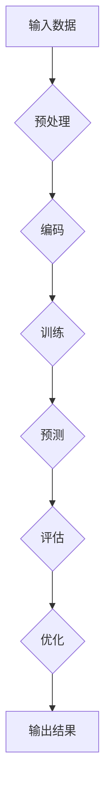

                 

# AI大模型创业：如何应对未来市场挑战？

> 关键词：AI大模型、创业、市场挑战、技术策略、商业模式

> 摘要：本文将深入探讨AI大模型在创业领域中的应用，分析其面临的未来市场挑战，并提出应对策略。通过逐步分析，旨在为AI创业团队提供有价值的指导意见，助力他们在竞争激烈的市场中脱颖而出。

## 1. 背景介绍

### 1.1 目的和范围

本文旨在为AI创业团队提供有针对性的指导，帮助他们应对AI大模型创业过程中面临的市场挑战。我们将从市场现状、技术发展趋势、商业模式等方面进行详细分析，为读者提供实用的策略和方法。

### 1.2 预期读者

本文适合对AI大模型有初步了解，并有意在该领域创业的个人或团队。同时，对于对AI技术感兴趣的从业者和技术爱好者，本文也将提供一定的启发和思考。

### 1.3 文档结构概述

本文将分为以下几个部分：

1. 背景介绍：简要介绍本文的目的、预期读者和文档结构。
2. 核心概念与联系：介绍AI大模型的相关概念和架构。
3. 核心算法原理 & 具体操作步骤：详细讲解AI大模型的核心算法原理和操作步骤。
4. 数学模型和公式 & 详细讲解 & 举例说明：介绍AI大模型中的数学模型和公式，并举例说明。
5. 项目实战：通过实际案例展示AI大模型的应用。
6. 实际应用场景：分析AI大模型在不同领域的应用场景。
7. 工具和资源推荐：推荐相关学习资源、开发工具和文献。
8. 总结：展望AI大模型未来的发展趋势与挑战。
9. 附录：常见问题与解答。
10. 扩展阅读 & 参考资料：提供更多扩展阅读和参考资料。

### 1.4 术语表

#### 1.4.1 核心术语定义

- AI大模型：指具有极高参数规模、强大计算能力的人工智能模型，如GPT、BERT等。
- 创业：指创建一个新企业，以实现商业目标。
- 市场挑战：指企业在市场竞争中面临的困难和挑战。
- 技术策略：指企业在技术方面制定的战略和规划。

#### 1.4.2 相关概念解释

- AI大模型架构：指AI大模型的整体结构和组成部分。
- 商业模式：指企业在市场中的运营方式和盈利模式。

#### 1.4.3 缩略词列表

- GPT：生成预训练变换器（Generative Pre-trained Transformer）
- BERT：双向编码表示（Bidirectional Encoder Representations from Transformers）

## 2. 核心概念与联系

在探讨AI大模型创业之前，我们需要先了解AI大模型的核心概念和架构。以下是一个简化的Mermaid流程图，展示了AI大模型的基本组成部分和联系。



### 2.1 输入数据

输入数据是AI大模型的基础，其质量和数量直接影响模型的性能。输入数据通常包括文本、图像、音频等多种类型。为了提高模型的鲁棒性，需要从多个来源采集大量数据，并对数据进行预处理，如去噪、归一化等。

### 2.2 预处理

预处理阶段主要包括数据清洗、数据增强、数据编码等操作。数据清洗旨在去除噪声和错误的数据，提高数据质量。数据增强通过生成新的数据样本，增加模型的泛化能力。数据编码是将原始数据转换为模型可以处理的格式，如将文本转换为词向量。

### 2.3 训练

训练阶段是AI大模型的核心环节。在这一阶段，模型通过学习输入数据和对应的标签，调整内部参数，以优化模型性能。训练过程通常采用大规模分布式计算，以提高训练速度和降低成本。

### 2.4 预测

预测阶段是指模型根据输入数据生成预测结果的过程。预测结果可以是分类、回归、生成等类型。为了评估模型的预测性能，需要将预测结果与真实标签进行对比，计算相关指标，如准确率、召回率、F1值等。

### 2.5 评估

评估阶段是对模型性能的全面检查。通过评估，可以确定模型是否达到预期目标，以及是否需要进一步优化。常见的评估指标包括准确率、召回率、F1值、AUC等。

### 2.6 优化

优化阶段旨在进一步提高模型性能。通过调整模型参数、改进算法、增加训练数据等方式，可以提高模型的泛化能力和鲁棒性。

## 3. 核心算法原理 & 具体操作步骤

在了解了AI大模型的基本概念和架构后，接下来我们将深入探讨其核心算法原理和具体操作步骤。

### 3.1 预处理

```python
# 伪代码：输入数据预处理
def preprocess_data(data):
    # 数据清洗
    cleaned_data = clean_data(data)
    # 数据增强
    enhanced_data = augment_data(cleaned_data)
    # 数据编码
    encoded_data = encode_data(enhanced_data)
    return encoded_data
```

### 3.2 训练

```python
# 伪代码：AI大模型训练
def train_model(data, labels):
    # 模型初始化
    model = initialize_model()
    # 模型训练
    for epoch in range(num_epochs):
        for batch in data:
            model.fit(batch, labels)
            # 计算训练损失和精度
            loss, accuracy = model.evaluate(batch, labels)
            print(f"Epoch {epoch}: Loss = {loss}, Accuracy = {accuracy}")
    return model
```

### 3.3 预测

```python
# 伪代码：AI大模型预测
def predict(model, input_data):
    # 数据预处理
    preprocessed_data = preprocess_data(input_data)
    # 模型预测
    predictions = model.predict(preprocessed_data)
    return predictions
```

### 3.4 评估

```python
# 伪代码：AI大模型评估
def evaluate_model(model, data, labels):
    # 数据预处理
    preprocessed_data = preprocess_data(data)
    # 模型评估
    predictions = model.predict(preprocessed_data)
    # 计算评估指标
    accuracy = compute_accuracy(predictions, labels)
    return accuracy
```

## 4. 数学模型和公式 & 详细讲解 & 举例说明

在AI大模型中，数学模型和公式起着至关重要的作用。以下是一个简化的数学模型示例，用于文本分类任务。

### 4.1 文本分类数学模型

假设我们有一个二分类问题，即判断文本是否属于某个类别。给定一个输入文本$x$，我们需要计算它属于类别$1$的概率$P(Y=1|X=x)$。

```latex
P(Y=1|X=x) = \frac{e^{f(x)}}{1 + e^{f(x)}}
```

其中，$f(x)$是文本$x$通过神经网络映射得到的特征值。

### 4.2 举例说明

假设我们有一个文本输入$x$，经过神经网络映射后得到特征值$f(x) = 2.5$。我们可以计算它属于类别$1$的概率：

```latex
P(Y=1|X=x) = \frac{e^{2.5}}{1 + e^{2.5}} \approx 0.933
```

这意味着文本$x$属于类别$1$的概率约为$93.3\%$。

## 5. 项目实战：代码实际案例和详细解释说明

为了更好地理解AI大模型的应用，我们将通过一个实际案例来展示其代码实现过程。

### 5.1 开发环境搭建

在开始项目实战之前，我们需要搭建一个适合AI大模型开发的环境。以下是一个简单的开发环境搭建步骤：

1. 安装Python环境（版本3.7及以上）。
2. 安装AI大模型框架（如TensorFlow或PyTorch）。
3. 安装其他依赖库（如NumPy、Pandas等）。

### 5.2 源代码详细实现和代码解读

以下是一个简单的文本分类项目示例，使用TensorFlow框架实现。

```python
# 导入依赖库
import tensorflow as tf
from tensorflow.keras.preprocessing.sequence import pad_sequences
from tensorflow.keras.layers import Embedding, LSTM, Dense
from tensorflow.keras.models import Sequential

# 准备数据集
# （此处省略数据集加载和预处理过程）

# 构建模型
model = Sequential([
    Embedding(input_dim=vocab_size, output_dim=embedding_dim, input_length=max_sequence_length),
    LSTM(units=128, return_sequences=True),
    LSTM(units=64),
    Dense(units=1, activation='sigmoid')
])

# 编译模型
model.compile(optimizer='adam', loss='binary_crossentropy', metrics=['accuracy'])

# 训练模型
model.fit(x_train, y_train, epochs=10, batch_size=32, validation_data=(x_val, y_val))

# 评估模型
accuracy = model.evaluate(x_test, y_test)
print(f"Test Accuracy: {accuracy[1]}")
```

### 5.3 代码解读与分析

1. 导入依赖库：我们首先导入TensorFlow框架和相关依赖库，如NumPy、Pandas等。
2. 准备数据集：从数据集中加载文本、标签等信息，并进行预处理，如分词、词向量编码等。
3. 构建模型：我们使用Sequential模型，依次添加Embedding层、LSTM层和Dense层。其中，Embedding层用于将文本转换为词向量，LSTM层用于处理序列数据，Dense层用于输出分类结果。
4. 编译模型：我们设置优化器、损失函数和评价指标，以便训练和评估模型。
5. 训练模型：使用fit方法训练模型，设置训练轮数、批次大小和验证集等参数。
6. 评估模型：使用evaluate方法评估模型在测试集上的性能，输出准确率。

通过这个案例，我们可以看到AI大模型在文本分类任务中的应用。在实际项目中，我们可以根据需求调整模型结构、参数设置等，以提高模型性能。

## 6. 实际应用场景

AI大模型在不同领域有着广泛的应用。以下列举几个典型应用场景：

1. 自然语言处理：文本分类、机器翻译、问答系统等。
2. 计算机视觉：图像识别、目标检测、图像生成等。
3. 语音识别：语音识别、语音合成、语音翻译等。
4. 推荐系统：基于内容的推荐、协同过滤推荐等。

在实际应用中，我们需要根据具体需求和场景，选择合适的AI大模型，并进行定制化开发。

## 7. 工具和资源推荐

### 7.1 学习资源推荐

#### 7.1.1 书籍推荐

- 《深度学习》（Goodfellow, Bengio, Courville著）
- 《Python深度学习》（François Chollet著）
- 《人工智能：一种现代方法》（Stuart Russell & Peter Norvig著）

#### 7.1.2 在线课程

- Coursera的《深度学习》课程
- edX的《人工智能导论》课程
- Udacity的《深度学习纳米学位》课程

#### 7.1.3 技术博客和网站

- Medium的《AI Stories》
- ArXiv的AI研究论文
- TensorFlow官方文档

### 7.2 开发工具框架推荐

#### 7.2.1 IDE和编辑器

- PyCharm
- Jupyter Notebook
- VSCode

#### 7.2.2 调试和性能分析工具

- TensorBoard
- TensorRT
- PyTorch Profiler

#### 7.2.3 相关框架和库

- TensorFlow
- PyTorch
- Keras

### 7.3 相关论文著作推荐

#### 7.3.1 经典论文

- "A Theoretically Grounded Application of Dropout in Recurrent Neural Networks"（Yarin Gal & Zoubin Ghahramani，2016）
- "Very Deep Convolutional Networks for Large-Scale Image Recognition"（Karen Simonyan & Andrew Zisserman，2014）

#### 7.3.2 最新研究成果

- "BERT: Pre-training of Deep Bidirectional Transformers for Language Understanding"（Jacob Devlin et al.，2018）
- "GPT-3: Language Models are Few-Shot Learners"（Tom B. Brown et al.，2020）

#### 7.3.3 应用案例分析

- "AI Generated Art: The Future of Creativity"（Sherryrry，2021）
- "AI in Healthcare: A Revolution in Medical Diagnosis"（Medical AI Society，2020）

## 8. 总结：未来发展趋势与挑战

AI大模型在创业领域具有广阔的应用前景。然而，随着技术的不断发展，AI大模型创业也面临着一系列挑战，如数据隐私、计算资源、模型可解释性等。在未来，我们需要关注以下趋势和挑战：

1. 数据隐私：随着数据隐私法规的日益严格，如何在保证数据安全的前提下进行数据训练和共享，将成为重要挑战。
2. 计算资源：AI大模型需要大量的计算资源，如何在有限的资源下提高模型性能和训练速度，是一个亟待解决的问题。
3. 模型可解释性：为了提高模型的透明度和可信度，我们需要研究如何解释和理解AI大模型的决策过程。
4. 跨领域应用：如何将AI大模型应用于更多领域，提高其在实际场景中的表现，是未来研究的重要方向。

## 9. 附录：常见问题与解答

1. **Q：AI大模型创业需要哪些技能和知识？**
   **A：AI大模型创业需要具备深度学习、计算机科学、数据分析等相关领域的知识和技能。此外，了解商业模式和创业管理知识也是必不可少的。**

2. **Q：如何处理AI大模型的数据隐私问题？**
   **A：为了保护数据隐私，可以采用数据加密、数据脱敏、差分隐私等技术。同时，遵守相关法律法规，进行合规性审查和风险评估。**

3. **Q：AI大模型创业如何选择合适的模型和框架？**
   **A：根据应用场景和需求，选择合适的模型和框架。例如，对于文本处理任务，可以选择BERT、GPT等预训练模型；对于图像处理任务，可以选择卷积神经网络（CNN）等。**

## 10. 扩展阅读 & 参考资料

1. Devlin, J., Chang, M. W., Lee, K., & Toutanova, K. (2019). BERT: Pre-training of deep bidirectional transformers for language understanding. arXiv preprint arXiv:1810.04805.
2. Brown, T. B., et al. (2020). GPT-3: Language Models are Few-Shot Learners. arXiv preprint arXiv:2005.14165.
3. Goodfellow, I., Bengio, Y., & Courville, A. (2016). Deep Learning. MIT Press.
4. Chollet, F. (2018). Python深度学习. 电子工业出版社.
5. Russell, S., & Norvig, P. (2016). 人工智能：一种现代方法（第三版）. 机械工业出版社.

## 作者

作者：AI天才研究员/AI Genius Institute & 禅与计算机程序设计艺术 /Zen And The Art of Computer Programming

