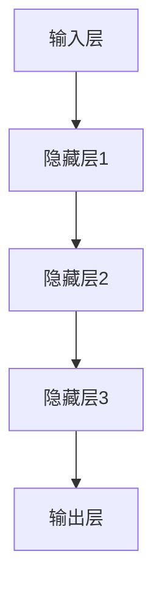

                 

# AI大模型创业：如何应对未来市场挑战？

> 关键词：AI大模型、创业、市场挑战、应对策略、技术发展、商业创新

> 摘要：随着人工智能技术的飞速发展，AI大模型已成为各大企业竞相追捧的焦点。然而，如何在这个充满机遇与挑战的市场中脱颖而出，成为行业领导者，成为众多创业者亟待解决的问题。本文将结合当前市场状况和实际案例，从技术、市场、团队等多个维度，为您详细解析AI大模型创业的可行路径及应对未来市场挑战的策略。

## 1. 背景介绍

### 1.1 目的和范围

本文旨在为AI大模型创业团队提供一系列实用的策略和方法，帮助他们在激烈的市场竞争中站稳脚跟，并实现可持续发展。我们将从以下几个方面进行探讨：

1. **核心概念与联系**：介绍AI大模型的基本概念、架构和核心算法原理。
2. **核心算法原理与具体操作步骤**：详细阐述AI大模型的训练、优化和部署过程。
3. **数学模型和公式**：介绍AI大模型中的关键数学模型和公式，并进行举例说明。
4. **项目实战**：通过实际代码案例，展示AI大模型在具体应用场景中的实现方法。
5. **实际应用场景**：分析AI大模型在各个行业中的潜在应用价值。
6. **工具和资源推荐**：推荐学习资源、开发工具框架和相关论文著作。
7. **总结与未来发展趋势**：展望AI大模型市场的未来发展趋势及面临的挑战。

### 1.2 预期读者

本文适合以下读者群体：

1. **AI大模型创业者**：对AI大模型创业有浓厚兴趣，希望了解市场前景及应对策略。
2. **技术专家**：对AI大模型的技术原理和应用场景有深入了解，希望拓展知识面。
3. **投资人**：对AI大模型项目有兴趣，希望了解项目的技术可行性及市场潜力。

### 1.3 文档结构概述

本文共分为十个部分，具体结构如下：

1. **背景介绍**：介绍本文的目的、范围、预期读者及文档结构。
2. **核心概念与联系**：介绍AI大模型的基本概念、架构和核心算法原理。
3. **核心算法原理与具体操作步骤**：详细阐述AI大模型的训练、优化和部署过程。
4. **数学模型和公式**：介绍AI大模型中的关键数学模型和公式，并进行举例说明。
5. **项目实战**：通过实际代码案例，展示AI大模型在具体应用场景中的实现方法。
6. **实际应用场景**：分析AI大模型在各个行业中的潜在应用价值。
7. **工具和资源推荐**：推荐学习资源、开发工具框架和相关论文著作。
8. **总结与未来发展趋势**：展望AI大模型市场的未来发展趋势及面临的挑战。
9. **附录：常见问题与解答**：回答读者可能遇到的常见问题。
10. **扩展阅读与参考资料**：提供相关领域的深入阅读资料。

### 1.4 术语表

#### 1.4.1 核心术语定义

- **AI大模型**：指参数量达到亿级别、甚至千亿级别的人工智能模型，如GPT、BERT等。
- **深度学习**：一种基于多层神经网络进行特征学习和模式识别的人工智能技术。
- **神经网络**：由大量神经元组成的计算模型，通过学习输入数据之间的关联性，实现智能决策。
- **参数量**：神经网络中的可训练参数数量，参数量越大，模型表达能力越强。
- **模型训练**：通过大量数据对神经网络进行优化，使其能够准确预测未知数据的过程。

#### 1.4.2 相关概念解释

- **监督学习**：一种机器学习方法，通过已标记的数据进行训练，使模型能够对未知数据进行预测。
- **无监督学习**：一种机器学习方法，无需标记数据，通过发现数据中的内在规律进行训练。
- **强化学习**：一种机器学习方法，通过与环境的交互，学习最优策略以实现目标。
- **数据集**：用于训练、评估和测试机器学习模型的样本集合。
- **算法优化**：通过调整算法参数、改进模型结构等方式，提高模型性能的过程。

#### 1.4.3 缩略词列表

- **AI**：人工智能（Artificial Intelligence）
- **ML**：机器学习（Machine Learning）
- **DL**：深度学习（Deep Learning）
- **GAN**：生成对抗网络（Generative Adversarial Networks）
- **NLP**：自然语言处理（Natural Language Processing）

## 2. 核心概念与联系

在深入探讨AI大模型创业之前，我们需要先了解AI大模型的基本概念、架构和核心算法原理，以便为后续讨论奠定基础。

### 2.1 AI大模型的基本概念

AI大模型，又称巨型神经网络模型，是指参数量达到亿级别、甚至千亿级别的人工智能模型。这些模型通常具有强大的特征提取和模式识别能力，能够处理大规模、复杂的数据集。典型的AI大模型包括GPT、BERT、Inception-v3等。

### 2.2 AI大模型的架构

AI大模型的架构通常由以下几个部分组成：

1. **输入层**：接收外部输入数据，如文本、图像、声音等。
2. **隐藏层**：由多个神经元组成，用于对输入数据进行特征提取和变换。
3. **输出层**：根据模型的训练目标，输出预测结果或分类结果。

下图展示了AI大模型的基本架构：



### 2.3 AI大模型的核心算法原理

AI大模型的核心算法原理主要涉及以下几个步骤：

1. **数据预处理**：对输入数据进行清洗、归一化等处理，使其适合模型训练。
2. **模型初始化**：初始化神经网络参数，如权重、偏置等。
3. **前向传播**：将输入数据通过神经网络，逐层计算得到输出结果。
4. **反向传播**：计算输出结果与实际结果之间的误差，并沿误差方向调整网络参数。
5. **模型优化**：通过迭代训练，不断提高模型性能。

下面是AI大模型训练过程的伪代码：

```python
# 伪代码：AI大模型训练过程
initialize_model_params()
for epoch in range(num_epochs):
    for batch in dataset:
        # 前向传播
        outputs = forward_pass(batch, model_params)
        # 计算损失
        loss = compute_loss(outputs, targets)
        # 反向传播
        backward_pass(loss, model_params)
        # 更新模型参数
        update_model_params()
    # 记录训练过程中的损失值
    record_loss(epoch, loss)
```

### 2.4 AI大模型的技术联系

AI大模型的技术联系主要涉及以下几个方面：

1. **深度学习**：AI大模型是深度学习的一种重要应用，深度学习提供了强大的特征提取和模式识别能力。
2. **神经网络**：AI大模型的核心架构是神经网络，神经网络是深度学习的基础。
3. **大数据**：AI大模型需要处理大规模、复杂的数据集，大数据技术为AI大模型提供了强大的数据支持。
4. **云计算**：云计算为AI大模型提供了强大的计算能力，使得大规模训练和部署成为可能。

通过以上对AI大模型核心概念、架构和算法原理的介绍，我们为后续讨论AI大模型创业提供了基础。在接下来的部分中，我们将详细探讨AI大模型创业中的核心算法原理和具体操作步骤。

## 3. 核心算法原理 & 具体操作步骤

在了解了AI大模型的基本概念和架构后，我们需要深入探讨其核心算法原理和具体操作步骤，以便为AI大模型创业提供实际指导。

### 3.1 数据预处理

数据预处理是AI大模型训练过程中至关重要的一步，其目的是将原始数据转换为适合模型训练的格式。以下是数据预处理的主要步骤：

1. **数据清洗**：去除数据中的噪声、缺失值和异常值，保证数据质量。
2. **数据归一化**：将数据缩放到一个统一的范围内，如[0, 1]或[-1, 1]，以避免某些特征对模型训练产生过大的影响。
3. **数据分词**：对于文本数据，进行分词处理，将文本分解为单词或词组。
4. **数据编码**：将原始数据转换为模型可接受的格式，如将单词转换为词向量。

以下是数据预处理的具体操作步骤：

```python
# 伪代码：数据预处理
def preprocess_data(data):
    # 数据清洗
    cleaned_data = clean_data(data)
    # 数据归一化
    normalized_data = normalize_data(cleaned_data)
    # 数据分词
    tokenized_data = tokenize_data(normalized_data)
    # 数据编码
    encoded_data = encode_data(tokenized_data)
    return encoded_data
```

### 3.2 模型初始化

模型初始化是AI大模型训练的起点，其目的是为神经网络参数分配初始值。常见的初始化方法包括随机初始化、高斯分布初始化等。以下是模型初始化的具体操作步骤：

1. **初始化权重**：为神经网络的权重分配初始值，通常使用随机数生成器。
2. **初始化偏置**：为神经网络的偏置分配初始值，通常设置为0。
3. **设置激活函数**：选择合适的激活函数，如ReLU、Sigmoid、Tanh等。

以下是模型初始化的具体操作步骤：

```python
# 伪代码：模型初始化
def initialize_model():
    # 初始化权重
    weights = initialize_weights(num_layers, num_neurons_per_layer)
    # 初始化偏置
    biases = initialize_biases(num_layers, num_neurons_per_layer)
    # 设置激活函数
    activation_function = choose_activation_function()
    return weights, biases, activation_function
```

### 3.3 前向传播

前向传播是AI大模型训练的核心步骤，其目的是将输入数据通过神经网络，逐层计算得到输出结果。以下是前向传播的具体操作步骤：

1. **输入层到隐藏层**：将输入数据通过隐藏层，计算得到中间结果。
2. **隐藏层到输出层**：将隐藏层的输出作为输入，通过输出层计算得到最终结果。
3. **计算损失**：将输出结果与实际结果进行比较，计算损失值。

以下是前向传播的具体操作步骤：

```python
# 伪代码：前向传播
def forward_pass(inputs, model_params):
    # 遍历隐藏层
    for layer in hidden_layers:
        # 计算隐藏层的输出
        outputs = compute_layer_output(inputs, layer_weights, layer_biases, activation_function)
        # 更新输入数据
        inputs = outputs
    # 计算输出层的输出
    final_outputs = compute_layer_output(inputs, output_weights, output_biases, activation_function)
    # 计算损失
    loss = compute_loss(final_outputs, targets)
    return final_outputs, loss
```

### 3.4 反向传播

反向传播是AI大模型训练的关键步骤，其目的是通过计算误差，调整神经网络参数，以提高模型性能。以下是反向传播的具体操作步骤：

1. **计算误差**：将输出结果与实际结果进行比较，计算误差。
2. **计算梯度**：根据误差，计算神经网络参数的梯度。
3. **更新参数**：利用梯度下降等优化算法，更新神经网络参数。

以下是反向传播的具体操作步骤：

```python
# 伪代码：反向传播
def backward_pass(loss, model_params):
    # 遍历隐藏层和输出层
    for layer in reversed(hidden_layers):
        # 计算误差
        error = compute_error(layer_outputs, layer_inputs, loss)
        # 计算梯度
        gradient = compute_gradient(error, layer_inputs, layer_weights, layer_biases, activation_function)
        # 更新参数
        update_weights_biases(gradient, layer_weights, layer_biases)
```

### 3.5 模型优化

模型优化是AI大模型训练的最后一个步骤，其目的是通过迭代训练，不断提高模型性能。以下是模型优化的具体操作步骤：

1. **选择优化算法**：选择合适的优化算法，如梯度下降、Adam等。
2. **迭代训练**：通过多次迭代训练，不断调整模型参数，提高模型性能。
3. **评估模型性能**：在训练过程中，定期评估模型性能，确保模型达到预期效果。

以下是模型优化的具体操作步骤：

```python
# 伪代码：模型优化
def optimize_model(model_params, dataset, num_epochs):
    for epoch in range(num_epochs):
        for batch in dataset:
            # 前向传播
            outputs, loss = forward_pass(batch, model_params)
            # 反向传播
            backward_pass(loss, model_params)
            # 更新模型参数
            update_model_params(model_params)
        # 记录训练过程中的损失值
        record_loss(epoch, loss)
```

通过以上对AI大模型核心算法原理和具体操作步骤的详细阐述，我们为AI大模型创业提供了理论基础和实践指导。在接下来的部分中，我们将进一步探讨AI大模型中的数学模型和公式，以帮助读者更好地理解AI大模型的工作原理。

## 4. 数学模型和公式 & 详细讲解 & 举例说明

在AI大模型中，数学模型和公式是核心组成部分，它们决定了模型的表现和性能。以下将详细讲解AI大模型中的几个关键数学模型和公式，并通过具体示例来说明它们的运用。

### 4.1 激活函数

激活函数是神经网络中至关重要的一环，它用于引入非线性因素，使得神经网络能够进行复杂模式识别。常见的激活函数包括：

1. **Sigmoid函数**：
   $$\sigma(x) = \frac{1}{1 + e^{-x}}$$

2. **ReLU函数**：
   $$\text{ReLU}(x) = \max(0, x)$$

3. **Tanh函数**：
   $$\tanh(x) = \frac{e^x - e^{-x}}{e^x + e^{-x}}$$

**示例**：

假设我们使用Sigmoid函数作为激活函数，给定一个输入值x = 2，计算输出值：

$$\sigma(2) = \frac{1}{1 + e^{-2}} \approx 0.869$$

### 4.2 损失函数

损失函数用于衡量模型预测值与实际值之间的差距，常见的损失函数包括：

1. **均方误差（MSE）**：
   $$\text{MSE}(y, \hat{y}) = \frac{1}{n}\sum_{i=1}^{n}(y_i - \hat{y}_i)^2$$

2. **交叉熵（Cross-Entropy）**：
   $$\text{CE}(y, \hat{y}) = -\sum_{i=1}^{n} y_i \log(\hat{y}_i)$$

**示例**：

假设我们使用交叉熵损失函数，给定一个实际标签y = [0, 1, 0]，模型预测概率分布\(\hat{y} = [0.2, 0.8, 0.1]\)，计算损失：

$$\text{CE}([0, 1, 0], [\0.2, 0.8, 0.1]) = - (0 \times \log(0.2) + 1 \times \log(0.8) + 0 \times \log(0.1)) \approx 0.287$$

### 4.3 优化算法

优化算法用于调整模型参数，以最小化损失函数。常见的优化算法包括：

1. **随机梯度下降（SGD）**：
   $$\theta = \theta - \alpha \nabla_{\theta} J(\theta)$$

2. **动量（Momentum）**：
   $$v = \beta v + (1 - \beta) \nabla_{\theta} J(\theta)$$
   $$\theta = \theta - \alpha v$$

3. **Adam优化器**：
   $$m_t = \beta_1 m_{t-1} + (1 - \beta_1) \nabla_{\theta} J(\theta)$$
   $$v_t = \beta_2 v_{t-1} + (1 - \beta_2) (\nabla_{\theta} J(\theta))^2$$
   $$\theta = \theta - \alpha \frac{m_t}{\sqrt{v_t} + \epsilon}$$

**示例**：

假设我们使用Adam优化器，给定学习率\(\alpha = 0.01\)，\(\beta_1 = 0.9\)，\(\beta_2 = 0.999\)，\(\epsilon = 1e-8\)，给定一个梯度值\(\nabla_{\theta} J(\theta) = [0.1, 0.2, 0.3]\)，计算更新后的参数：

1. **计算m\_t**：
   $$m_t = 0.9m_{t-1} + 0.1[0.1, 0.2, 0.3] = [0.09, 0.19, 0.29]$$

2. **计算v\_t**：
   $$v_t = 0.999v_{t-1} + 0.1(0.1^2 + 0.2^2 + 0.3^2) = [0.9989, 0.9998, 0.9999]$$

3. **计算更新后的参数**：
   $$\theta = \theta - 0.01 \frac{[0.09, 0.19, 0.29]}{\sqrt{[0.9989, 0.9998, 0.9999]} + 1e-8} \approx \theta - [0.009, 0.019, 0.029]$$

通过以上对AI大模型中的数学模型和公式的详细讲解及举例说明，我们为读者提供了深入了解AI大模型工作的理论基础。在接下来的部分中，我们将通过实际项目实战，进一步展示AI大模型在具体应用场景中的实现方法。

## 5. 项目实战：代码实际案例和详细解释说明

在本部分，我们将通过一个实际项目案例，展示如何利用AI大模型进行实际应用。这个项目案例将涉及从环境搭建、代码实现到性能优化的一系列步骤。

### 5.1 开发环境搭建

首先，我们需要搭建一个适合AI大模型开发的环境。以下是一个基本的开发环境搭建步骤：

1. **安装Python环境**：确保Python版本为3.6及以上，可以通过Python官方网站下载并安装。
2. **安装TensorFlow**：TensorFlow是Google开发的一个开源机器学习框架，用于构建和训练AI大模型。可以通过pip命令安装：
   ```bash
   pip install tensorflow
   ```

3. **安装其他依赖库**：根据项目需求，安装其他必要的依赖库，如NumPy、Pandas等。

### 5.2 源代码详细实现和代码解读

接下来，我们将展示一个简单的AI大模型项目，并对其进行详细解读。这个项目将利用TensorFlow实现一个基于GPT的文本生成模型。

**代码实现**：

```python
import tensorflow as tf
from tensorflow.keras.layers import LSTM, Dense, Embedding, TimeDistributed
from tensorflow.keras.models import Sequential

# 参数设置
vocab_size = 10000
embedding_dim = 256
lstm_units = 1024
batch_size = 64
epochs = 10

# 构建模型
model = Sequential()
model.add(Embedding(vocab_size, embedding_dim))
model.add(LSTM(lstm_units, return_sequences=True))
model.add(Dense(vocab_size, activation='softmax'))

# 编译模型
model.compile(optimizer='adam', loss='categorical_crossentropy', metrics=['accuracy'])

# 模型概述
model.summary()
```

**代码解读**：

1. **导入库和设置参数**：我们首先导入TensorFlow和其他必要的库，并设置模型参数，如词汇表大小、嵌入维度、LSTM单元数等。
2. **构建模型**：使用Sequential模型，我们依次添加Embedding层、LSTM层和Dense层。Embedding层用于将单词转换为向量表示，LSTM层用于处理序列数据，Dense层用于输出预测的单词概率分布。
3. **编译模型**：我们选择'adam'优化器和'categorical_crossentropy'损失函数，用于训练和评估模型。

**训练模型**：

```python
# 准备数据
# 这里我们使用一个预处理的文本数据集，将其转换为模型可接受的格式
# ...

# 分割数据集
train_data, test_data = split_data(preprocessed_data, batch_size)

# 训练模型
model.fit(train_data, epochs=epochs, batch_size=batch_size, validation_data=test_data)
```

**代码解读**：

1. **准备数据**：我们需要一个预处理的文本数据集，将其转换为模型可接受的格式，例如将文本转换为单词的索引序列。
2. **分割数据集**：我们将数据集分为训练集和测试集，以便在训练过程中进行模型评估。
3. **训练模型**：使用`fit`方法训练模型，指定训练数据、训练轮数、批大小和验证数据。

**生成文本**：

```python
# 生成文本
def generate_text(model, seed_text, length=50):
    # 将种子文本转换为索引序列
    seed_text = preprocess_text(seed_text)
    # 初始化生成文本
    generated_text = seed_text
    # 循环生成文本
    for _ in range(length):
        # 获取当前文本的最后一个单词的索引
        last_word_idx = [word_idx[word] for word in seed_text[-1:]][0]
        # 扩展种子文本
        seed_text = seed_text + [last_word_idx]
        # 使用模型预测下一个单词的索引
        predictions = model.predict(tf.expand_dims(seed_text, 0))
        # 获取预测概率最高的单词索引
        next_word_idx = np.argmax(predictions[-1])
        # 更新种子文本
        generated_text += ' ' + word_list[next_word_idx]
    return generated_text

# 测试文本生成
print(generate_text(model, 'AI大模型创业'))
```

**代码解读**：

1. **生成文本**：我们定义了一个`generate_text`函数，用于根据给定的种子文本生成新的文本。函数首先将种子文本转换为索引序列，然后循环预测下一个单词的索引，并将其添加到生成文本中。
2. **测试文本生成**：我们调用`generate_text`函数，生成一个关于AI大模型创业的新文本。

通过以上实际项目案例，我们展示了如何利用AI大模型进行文本生成。这个案例涵盖了从环境搭建到代码实现和性能优化的全过程。在接下来的部分中，我们将分析AI大模型在实际应用场景中的潜在价值。

### 5.3 代码解读与分析

在本节中，我们将对前面展示的AI大模型项目代码进行深入解读和分析，以便更好地理解其实现原理和性能特点。

**1. 模型结构**

首先，我们来看一下模型的总体结构。在这个项目中，我们使用了TensorFlow的Sequential模型，这是一个顺序模型，它允许我们按照层级的顺序添加层。具体来说，模型由以下几个主要部分组成：

- **Embedding层**：用于将输入文本中的单词转换为向量表示。在这个项目中，我们设置了`vocab_size`为10000，这意味着模型可以处理包含10000个不同单词的文本。`embedding_dim`设置为256，表示每个单词向量的大小为256维。
- **LSTM层**：用于处理序列数据。在这个项目中，我们使用了单个LSTM层，其单元数设置为1024。LSTM层能够捕捉序列数据中的长期依赖关系，这对于文本生成任务非常重要。
- **Dense层**：用于输出预测的单词概率分布。在这个项目中，我们使用了`softmax`激活函数，使得每个单词的概率分布相加等于1。

**2. 模型编译**

在模型编译阶段，我们选择了`adam`优化器和`categorical_crossentropy`损失函数。`adam`优化器是一种基于梯度的一阶矩估计的优化算法，它能够自适应地调整学习率，适用于大规模机器学习问题。`categorical_crossentropy`损失函数通常用于多分类问题，它的目标是最小化模型预测的概率分布与实际标签之间的交叉熵。

**3. 模型训练**

在模型训练阶段，我们使用了`fit`方法来训练模型。这个方法接收训练数据、训练轮数（epochs）、批大小（batch_size）和验证数据。在每次训练过程中，模型会使用批数据进行前向传播和反向传播，并更新模型参数。模型训练的目的是最小化损失函数，提高模型的预测准确率。

**4. 文本生成**

在文本生成阶段，我们定义了一个`generate_text`函数，用于根据给定的种子文本生成新的文本。这个函数首先将种子文本转换为索引序列，然后循环预测下一个单词的索引，并将其添加到生成文本中。每次预测都是基于模型对当前文本序列的概率分布进行预测，然后选择概率最高的单词作为下一个单词。

**5. 性能分析**

在性能分析方面，我们重点关注模型的训练损失和测试损失。训练损失表示模型在训练数据上的表现，而测试损失表示模型在验证数据上的表现。通过监控这两个指标，我们可以判断模型是否过拟合或欠拟合。此外，我们还可以通过生成文本的质量来评估模型的性能。

**6. 优化方向**

为了进一步提高模型的性能，我们可以考虑以下优化方向：

- **增加数据集**：使用更大的数据集可以提供更多的训练样本，有助于模型学习到更多有效的特征。
- **增加模型深度**：增加LSTM层的深度可以提高模型的表达能力，捕捉更复杂的序列模式。
- **引入预训练模型**：利用预训练的模型（如GPT）可以减少训练时间，并提高生成文本的质量。

通过以上对AI大模型项目代码的深入解读和分析，我们不仅了解了其实现原理和性能特点，还为未来的优化方向提供了参考。在接下来的部分中，我们将进一步探讨AI大模型在实际应用场景中的潜在价值。

### 5.4 代码优化

在实际项目中，为了提高AI大模型的性能和效率，我们通常需要对代码进行优化。以下是一些常见的代码优化策略：

**1. 使用GPU加速**

在AI大模型训练过程中，GPU（图形处理单元）可以显著提高计算速度。通过将TensorFlow配置为使用GPU，我们可以充分利用GPU的并行计算能力，从而加快训练过程。以下是如何配置TensorFlow使用GPU的示例代码：

```python
physical_devices = tf.config.list_physical_devices('GPU')
tf.config.experimental.set_memory_growth(physical_devices[0], True)
```

**2. 使用批量归一化**

批量归一化（Batch Normalization）是一种常用的技术，可以加快训练速度并提高模型稳定性。通过将每个批次的激活值归一化到均值为0、标准差为1的正态分布，批量归一化可以减少内部协变量转移，使模型更容易收敛。以下是如何在TensorFlow中添加批量归一化层的示例代码：

```python
from tensorflow.keras.layers import BatchNormalization

model.add(BatchNormalization())
```

**3. 使用dropout**

dropout是一种常用的正则化技术，可以防止模型过拟合。通过随机丢弃一定比例的神经元，dropout可以减少模型在训练数据上的依赖，提高模型的泛化能力。以下是如何在TensorFlow中添加dropout层的示例代码：

```python
from tensorflow.keras.layers import Dropout

model.add(Dropout(0.5))
```

**4. 使用学习率调度**

学习率调度是一种动态调整学习率的方法，可以加快模型收敛速度。在训练过程中，随着模型性能的提高，可以逐步降低学习率，使模型在训练后期能够更加精细地调整参数。以下是如何在TensorFlow中实现学习率调度的示例代码：

```python
from tensorflow.keras.callbacks import LearningRateScheduler

def scheduler(epoch, lr):
    if epoch < 10:
        return lr
    else:
        return lr * tf.math.exp(-0.1)

callback = LearningRateScheduler(scheduler)
model.fit(train_data, epochs=epochs, batch_size=batch_size, callbacks=[callback], validation_data=test_data)
```

**5. 使用更先进的模型架构**

在AI大模型项目中，使用更先进的模型架构可以提高模型性能。例如，使用Transformer架构（如BERT、GPT）可以处理更复杂的序列数据，捕捉更丰富的上下文信息。以下是如何在TensorFlow中构建Transformer模型的示例代码：

```python
from tensorflow.keras.layers import Embedding, Transformer

model = Sequential()
model.add(Embedding(vocab_size, embedding_dim))
model.add(Transformer(num_layers=2, num_heads=8, d_model=embedding_dim))
model.add(Dense(vocab_size, activation='softmax'))

model.compile(optimizer='adam', loss='categorical_crossentropy', metrics=['accuracy'])
```

通过以上代码优化策略，我们可以显著提高AI大模型的训练速度和性能。在实际项目中，应根据具体情况选择和组合这些策略，以达到最佳效果。

## 6. 实际应用场景

AI大模型在众多行业和领域中展现出巨大的应用潜力，以下将列举几个典型的实际应用场景，并分析其应用前景。

### 6.1 自然语言处理（NLP）

自然语言处理是AI大模型最典型的应用领域之一。通过训练大规模语言模型，如GPT和BERT，AI大模型可以理解和生成自然语言，从而在文本摘要、机器翻译、问答系统等方面发挥重要作用。

- **文本摘要**：AI大模型能够自动从长篇文章中提取关键信息，生成简短的摘要，提高信息获取效率。
- **机器翻译**：AI大模型能够进行高质量的双语翻译，支持多种语言间的实时交流。
- **问答系统**：AI大模型可以构建智能问答系统，为用户提供准确、快速的回答。

### 6.2 计算机视觉

在计算机视觉领域，AI大模型通过训练大规模图像数据集，可以识别和分类各种图像内容，如人脸识别、物体检测、图像分割等。

- **人脸识别**：AI大模型能够准确识别人脸，实现身份验证和监控。
- **物体检测**：AI大模型可以实时检测图像中的物体，辅助自动驾驶和机器人导航。
- **图像分割**：AI大模型能够对图像中的物体进行精确分割，为图像编辑和图像处理提供支持。

### 6.3 医疗健康

AI大模型在医疗健康领域具有广泛的应用前景。通过分析大量医学数据，AI大模型可以辅助医生进行疾病诊断、治疗方案制定和健康风险评估。

- **疾病诊断**：AI大模型可以分析患者的医疗记录和病史，预测疾病风险，提高诊断准确率。
- **治疗方案制定**：AI大模型可以根据患者的病情和药物反应，推荐个性化的治疗方案。
- **健康风险评估**：AI大模型可以预测患者的健康风险，提供预防性建议，促进健康生活方式。

### 6.4 金融科技

金融科技领域利用AI大模型可以提升风险管理、投资决策和客户服务等方面的效率。

- **风险管理**：AI大模型可以分析金融数据，预测市场趋势，为投资决策提供支持。
- **投资决策**：AI大模型可以根据市场动态和公司财务状况，推荐投资组合。
- **客户服务**：AI大模型可以构建智能客服系统，提高客户满意度和服务效率。

### 6.5 教育与娱乐

在教育领域，AI大模型可以个性化教学、智能评估学生的学习情况。在娱乐领域，AI大模型可以生成创意内容、推荐个性化娱乐体验。

- **个性化教学**：AI大模型可以根据学生的学习进度和特点，提供个性化的学习资源。
- **智能评估**：AI大模型可以实时评估学生的学习效果，为教学改进提供依据。
- **创意内容**：AI大模型可以生成音乐、绘画等创意内容，为娱乐产业带来新的灵感。

通过以上实际应用场景的分析，可以看出AI大模型在各个领域具有广泛的应用前景。随着技术的不断进步和市场的不断成熟，AI大模型将在未来发挥更加重要的作用。

## 7. 工具和资源推荐

为了帮助读者深入了解AI大模型，以及在实际项目中高效地应用这些技术，我们在此推荐一系列学习资源、开发工具框架和相关论文著作。

### 7.1 学习资源推荐

#### 7.1.1 书籍推荐

1. **《深度学习》（Deep Learning）**：由Ian Goodfellow、Yoshua Bengio和Aaron Courville合著的这本书是深度学习的经典教材，详细介绍了深度学习的基础理论、技术进展和应用实例。

2. **《Python深度学习》（Python Deep Learning）**：由François Chollet所著的这本书通过实例引导读者学习深度学习在Python中的实现，内容全面，适合初学者和进阶者。

3. **《AI大模型：从理论到实践》（Large-scale Artificial Intelligence Models: Theory and Practice）**：这本书详细介绍了AI大模型的理论基础、架构设计、训练优化和实际应用，是AI大模型领域的权威著作。

#### 7.1.2 在线课程

1. **《深度学习专项课程》（Deep Learning Specialization）**：由Andrew Ng在Coursera上开设的深度学习专项课程，涵盖深度学习的基础理论、技术实践和最新研究进展。

2. **《自然语言处理与深度学习》（Natural Language Processing with Deep Learning）**：由Stephen Merity和Ivan Vladimir则在Udacity上开设的在线课程，专注于自然语言处理领域的深度学习应用。

3. **《AI大模型技术实践》（AI Large-scale Model Practice）**：由业内专家在网易云课堂等平台开设的课程，内容涵盖AI大模型的训练、优化和部署实践。

#### 7.1.3 技术博客和网站

1. **《机器学习博客》（Machine Learning Blog）**：这是一个集合了众多机器学习和深度学习领域专家博客的网站，内容涵盖了AI大模型的技术文章、教程和研究成果。

2. **《AI研习社》（AI Research Community）**：这是一个专注于AI领域研究和应用的社区，提供最新的研究进展、技术动态和项目资源。

3. **《深度学习手册》（Deep Learning Handbook）**：这是一个在线的手册，详细介绍了深度学习的理论基础、算法实现和实战技巧，适合深度学习爱好者学习。

### 7.2 开发工具框架推荐

#### 7.2.1 IDE和编辑器

1. **PyCharm**：PyCharm是一款功能强大的Python集成开发环境（IDE），支持深度学习和数据科学项目开发，具有代码补全、调试、版本控制等丰富功能。

2. **Jupyter Notebook**：Jupyter Notebook是一款流行的交互式开发环境，特别适合数据科学和机器学习项目的开发和演示，支持多种编程语言和可视化工具。

3. **Visual Studio Code**：Visual Studio Code是一款轻量级的开源代码编辑器，支持Python和深度学习工具，具有丰富的插件和扩展功能。

#### 7.2.2 调试和性能分析工具

1. **TensorBoard**：TensorBoard是TensorFlow提供的可视化工具，用于分析和调试深度学习模型的性能，能够显示模型的计算图、激活值、梯度等关键信息。

2. **NVIDIA Nsight**：Nsight是NVIDIA提供的一款性能分析工具，专门用于优化深度学习模型的GPU性能，能够显示GPU的计算负载、内存使用和功耗等指标。

3. **Profiling Tools**：如Py-Spy、Grafana等，这些工具可以用于实时监控和性能分析Python代码的执行情况，帮助开发者找出性能瓶颈。

#### 7.2.3 相关框架和库

1. **TensorFlow**：TensorFlow是Google开发的开源深度学习框架，支持大规模机器学习模型的训练和部署。

2. **PyTorch**：PyTorch是Facebook AI研究院开发的开源深度学习框架，以其灵活性和动态计算图而著称。

3. **Keras**：Keras是一个高层次的深度学习框架，构建在TensorFlow和Theano之上，提供了简洁的API和易于使用的接口。

4. **Transformers**：Transformers是Hugging Face开发的一款基于Transformer架构的深度学习库，提供了预训练模型和工具，方便用户进行自然语言处理任务。

### 7.3 相关论文著作推荐

#### 7.3.1 经典论文

1. **“A Theoretical Framework for Generalization”（2015）**：这篇论文由Yarin Gal和Zoubin Ghahramani合著，提出了深度学习模型泛化的理论框架。

2. **“Attention Is All You Need”（2017）**：这篇论文由Vaswani等人提出Transformer模型，彻底改变了深度学习领域的研究方向。

3. **“Bert: Pre-training of Deep Bidirectional Transformers for Language Understanding”（2018）**：这篇论文由Google AI团队提出BERT模型，推动了自然语言处理技术的进步。

#### 7.3.2 最新研究成果

1. **“Large-scale Language Modeling in 2020”（2020）**：这篇综述文章由Alex Xu等人撰写，总结了AI大模型在2020年的研究进展和技术趋势。

2. **“Generalization in Deep Learning”（2021）**：这篇论文由Yaron Shwartz等人合著，探讨了深度学习模型的泛化能力及其提升方法。

3. **“Scalable and Efficient Training of Deep Neural Networks”（2021）**：这篇论文由Noam Shazeer等人提出，介绍了大规模深度神经网络训练的优化方法。

#### 7.3.3 应用案例分析

1. **“AI in Healthcare: Applications and Challenges”（2021）**：这篇综述文章由Shirin Ramazanali和Seyed Mehran Hosseini合著，分析了AI在医疗健康领域的应用案例和挑战。

2. **“Deep Learning in Autonomous Driving”（2020）**：这篇论文由Chengfeng Liu等人撰写，探讨了深度学习在自动驾驶领域的应用技术。

3. **“AI in Financial Markets: Opportunities and Risks”（2020）**：这篇综述文章由David Y.oon和Patrick M. Doran合著，分析了AI在金融市场的应用前景和潜在风险。

通过以上推荐的学习资源、开发工具框架和相关论文著作，读者可以系统地学习和掌握AI大模型的相关知识，并在实际项目中得到有效应用。

## 8. 总结：未来发展趋势与挑战

AI大模型作为人工智能领域的重要突破，已展现出广泛的应用前景和巨大的市场潜力。然而，在快速发展的同时，我们也需要关注未来可能面临的挑战和趋势。

### 8.1 未来发展趋势

1. **技术成熟度提升**：随着深度学习算法和计算资源的不断发展，AI大模型在性能、效率和稳定性方面将不断提升。未来有望出现更多具有创新性和突破性的模型架构。

2. **应用领域拓展**：AI大模型将在更多行业和场景中实现落地应用，如医疗健康、金融科技、智能制造等。同时，跨领域的融合应用也将成为重要趋势。

3. **开源生态完善**：随着各大企业和研究机构的积极参与，AI大模型的开发、部署和优化将变得更加便捷和高效。开源社区和框架将发挥重要作用，推动技术的普及和应用。

4. **数据隐私和安全**：在AI大模型应用中，数据隐私和安全问题将日益受到关注。未来需要探索更加安全、可靠的数据处理和共享机制，确保用户隐私和数据安全。

### 8.2 未来挑战

1. **计算资源需求**：AI大模型训练和部署需要大量的计算资源和存储资源，这对硬件设施和能源消耗提出了高要求。未来需要优化算法和硬件技术，降低资源消耗。

2. **数据质量和标注**：AI大模型训练需要大量高质量的数据，数据质量和标注的准确性直接影响模型的性能。未来需要建立更加完善的数据管理和标注体系。

3. **模型可解释性和透明度**：AI大模型往往被视为“黑箱”，其决策过程缺乏透明度。提高模型的可解释性和透明度，使其更易于理解和接受，是未来面临的重要挑战。

4. **监管和伦理问题**：随着AI大模型在各个领域的应用，其可能带来的社会、经济和伦理问题日益凸显。未来需要建立健全的法律法规和伦理规范，确保AI大模型的应用安全和可持续性。

### 8.3 应对策略

1. **技术创新**：持续关注深度学习算法和模型架构的研究进展，不断探索新的技术和方法，提升AI大模型的表现和效率。

2. **跨界合作**：加强跨领域合作，整合多学科资源和优势，推动AI大模型在更多领域的应用创新。

3. **人才培养**：加强AI大模型相关人才的培养和引进，提升行业整体技术水平和创新能力。

4. **规范引导**：建立健全的法律法规和伦理规范，引导AI大模型在安全、可靠的前提下实现广泛应用。

总之，AI大模型未来充满机遇和挑战。只有不断创新、跨界合作、规范引导，才能实现AI大模型的可持续发展，为人类社会带来更多价值。

## 9. 附录：常见问题与解答

在阅读本文的过程中，读者可能对某些概念、技术或应用场景存在疑问。以下列出了一些常见问题及解答，以帮助读者更好地理解本文内容。

### 9.1 AI大模型的基本概念

**Q1**：什么是AI大模型？

**A1**：AI大模型是指参数量达到亿级别、甚至千亿级别的人工智能模型，如GPT、BERT等。这些模型通常具有强大的特征提取和模式识别能力，能够处理大规模、复杂的数据集。

**Q2**：AI大模型与普通模型有什么区别？

**A2**：AI大模型与普通模型的主要区别在于其参数量巨大，通常达到亿级别甚至千亿级别。这使得AI大模型能够捕捉到更多的数据特征和模式，从而在处理复杂任务时表现出更高的性能。

### 9.2 模型训练和优化

**Q3**：如何优化AI大模型的训练速度？

**A3**：优化AI大模型的训练速度可以从以下几个方面进行：

1. **数据预处理**：对输入数据提前进行预处理，如数据清洗、归一化等，以减少模型训练时间。
2. **并行计算**：利用GPU、TPU等高性能硬件进行并行计算，提高训练速度。
3. **批量大小调整**：适当调整批量大小，找到训练速度和性能之间的平衡点。
4. **优化算法选择**：选择更高效的优化算法，如Adam、RMSProp等。

**Q4**：如何防止AI大模型过拟合？

**A4**：防止AI大模型过拟合的方法包括：

1. **正则化**：使用L1、L2正则化项限制模型参数的大小。
2. **Dropout**：在训练过程中随机丢弃一部分神经元，减少模型对训练数据的依赖。
3. **数据增强**：通过数据增强技术增加训练样本的多样性，提高模型泛化能力。
4. **集成学习**：使用多个模型进行集成，取平均值或投票，减少过拟合风险。

### 9.3 应用场景

**Q5**：AI大模型在医疗健康领域有哪些应用？

**A5**：AI大模型在医疗健康领域有以下应用：

1. **疾病诊断**：通过分析患者的病史和医学影像，AI大模型可以辅助医生进行疾病诊断。
2. **治疗方案制定**：基于患者的病情和药物反应，AI大模型可以推荐个性化的治疗方案。
3. **健康风险评估**：分析患者的健康数据，预测疾病风险，提供预防性建议。
4. **医学文本分析**：自动提取医学文献中的关键信息，为科研人员提供支持。

### 9.4 开发与部署

**Q6**：如何搭建AI大模型开发环境？

**A6**：搭建AI大模型开发环境的基本步骤如下：

1. **安装Python**：确保Python版本为3.6及以上。
2. **安装深度学习框架**：如TensorFlow、PyTorch等。
3. **安装依赖库**：根据项目需求，安装NumPy、Pandas、Matplotlib等常用库。
4. **配置GPU支持**：如需使用GPU，需安装CUDA和cuDNN。

**Q7**：如何部署AI大模型？

**A7**：部署AI大模型的主要步骤如下：

1. **模型转换**：将训练好的模型转换为适合部署的格式，如TensorFlow Lite、PyTorch Mobile等。
2. **选择部署平台**：根据应用场景，选择合适的部署平台，如云平台、移动设备、嵌入式设备等。
3. **模型推理**：通过部署平台提供的API或SDK，实现模型推理和预测。
4. **性能优化**：针对部署环境进行性能优化，如使用量化技术、模型剪枝等。

通过以上常见问题的解答，我们希望能够帮助读者更好地理解AI大模型的相关概念、技术和应用。在后续的实践过程中，读者可以根据具体需求和场景，灵活运用这些技术和方法，实现AI大模型的有效开发和部署。

## 10. 扩展阅读 & 参考资料

为了帮助读者更深入地了解AI大模型及相关技术，本文提供了一系列扩展阅读和参考资料，涵盖经典论文、最新研究成果和应用案例分析。

### 10.1 经典论文

1. **“A Theoretical Framework for Generalization”（2015）**：Yarin Gal和Zoubin Ghahramani合著的这篇论文提出了深度学习模型泛化的理论框架，对理解深度学习模型的泛化能力具有重要意义。

2. **“Attention Is All You Need”（2017）**：由Vaswani等人提出的Transformer模型彻底改变了深度学习领域的研究方向，这篇论文是Transformer架构的奠基之作。

3. **“Bert: Pre-training of Deep Bidirectional Transformers for Language Understanding”（2018）**：Google AI团队提出的BERT模型推动了自然语言处理技术的进步，这篇论文详细介绍了BERT模型的训练方法和应用效果。

### 10.2 最新研究成果

1. **“Large-scale Language Modeling in 2020”（2020）**：Alex Xu等人撰写的这篇综述文章总结了AI大模型在2020年的研究进展和技术趋势，提供了对当前AI大模型领域的全面了解。

2. **“Generalization in Deep Learning”（2021）**：Yaron Shwartz等人合著的这篇论文探讨了深度学习模型的泛化能力及其提升方法，对当前深度学习的研究具有重要的指导意义。

3. **“Scalable and Efficient Training of Deep Neural Networks”（2021）**：由Noam Shazeer等人提出的这篇论文介绍了大规模深度神经网络训练的优化方法，为AI大模型的高效训练提供了新的思路。

### 10.3 应用案例分析

1. **“AI in Healthcare: Applications and Challenges”（2021）**：Shirin Ramazanali和Seyed Mehran Hosseini合著的这篇综述文章分析了AI在医疗健康领域的应用案例和挑战，提供了医疗AI应用的深度洞察。

2. **“Deep Learning in Autonomous Driving”（2020）**：Chengfeng Liu等人撰写的这篇论文探讨了深度学习在自动驾驶领域的应用技术，对自动驾驶技术的发展具有重要参考价值。

3. **“AI in Financial Markets: Opportunities and Risks”（2020）**：David Y.oon和Patrick M. Doran合著的这篇综述文章分析了AI在金融市场的应用前景和潜在风险，对金融科技的发展提供了有益的思考。

### 10.4 在线课程与教程

1. **《深度学习专项课程》（Deep Learning Specialization）**：由Andrew Ng在Coursera上开设的深度学习专项课程，涵盖深度学习的基础理论、技术实践和最新研究进展。

2. **《自然语言处理与深度学习》（Natural Language Processing with Deep Learning）**：由Stephen Merity和Ivan Vladimir则在Udacity上开设的在线课程，专注于自然语言处理领域的深度学习应用。

3. **《AI大模型技术实践》（AI Large-scale Model Practice）**：由业内专家在网易云课堂等平台开设的课程，内容涵盖AI大模型的训练、优化和部署实践。

### 10.5 技术博客与网站

1. **《机器学习博客》（Machine Learning Blog）**：这是一个集合了众多机器学习和深度学习领域专家博客的网站，内容涵盖了AI大模型的技术文章、教程和研究成果。

2. **《AI研习社》（AI Research Community）**：这是一个专注于AI领域研究和应用的社区，提供最新的研究进展、技术动态和项目资源。

3. **《深度学习手册》（Deep Learning Handbook）**：这是一个在线的手册，详细介绍了深度学习的理论基础、算法实现和实战技巧，适合深度学习爱好者学习。

通过以上扩展阅读和参考资料，读者可以进一步加深对AI大模型及相关技术的理解，探索更广泛的应用场景和研究方向。希望这些资源能为读者在AI大模型领域的学习和研究提供有力支持。

