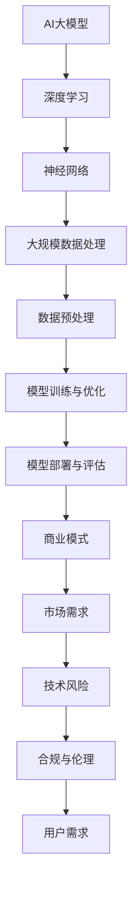

                 


# AI大模型创业：如何应对未来市场挑战？

> **关键词**：AI大模型、创业、市场挑战、商业模式、技术策略、合规与伦理
> 
> **摘要**：本文旨在探讨AI大模型创业者在面对未来市场挑战时，如何制定有效的策略和措施。通过分析AI大模型的发展趋势、市场需求、技术风险，本文提出了一系列应对策略，包括商业模式创新、技术路线优化、合规与伦理考量，旨在为AI大模型创业者提供有价值的参考。

## 1. 背景介绍

### 1.1 目的和范围

本文旨在为AI大模型创业者提供系统性的指导，帮助他们应对未来市场的挑战。通过深入分析AI大模型的技术发展、市场需求、技术风险以及商业环境，本文旨在提出一系列具有前瞻性的策略和措施，以帮助创业者制定更为有效的商业计划和运营策略。

### 1.2 预期读者

本文的预期读者包括：

1. AI大模型创业者
2. 投资者
3. 相关行业从业者
4. 对AI大模型技术有兴趣的读者

### 1.3 文档结构概述

本文分为以下十个部分：

1. 背景介绍
2. 核心概念与联系
3. 核心算法原理 & 具体操作步骤
4. 数学模型和公式 & 详细讲解 & 举例说明
5. 项目实战：代码实际案例和详细解释说明
6. 实际应用场景
7. 工具和资源推荐
8. 总结：未来发展趋势与挑战
9. 附录：常见问题与解答
10. 扩展阅读 & 参考资料

### 1.4 术语表

#### 1.4.1 核心术语定义

- **AI大模型**：指具有数万亿参数、能够处理大规模数据的深度学习模型，如GPT-3、BERT等。
- **商业模式**：企业在特定市场环境中，通过提供产品或服务所采用的盈利模式。
- **技术路线**：企业选择的技术方向和路径，包括算法、架构、工具等方面。
- **合规与伦理**：企业在经营过程中遵循的法律法规和道德规范。

#### 1.4.2 相关概念解释

- **市场挑战**：企业在市场竞争中面临的各种困难，如技术竞争、商业模式创新、政策法规等。
- **技术风险**：企业在技术实施过程中可能遇到的风险，如技术落后、技术失效等。
- **用户需求**：用户在特定场景下对产品或服务的需求。

#### 1.4.3 缩略词列表

- **AI**：人工智能（Artificial Intelligence）
- **GPT**：生成预训练模型（Generative Pre-trained Transformer）
- **BERT**：双向编码器表示（Bidirectional Encoder Representations from Transformers）
- **IDE**：集成开发环境（Integrated Development Environment）

## 2. 核心概念与联系

在探讨AI大模型创业面临的挑战之前，我们需要先了解一些核心概念及其相互关系。以下是一个简单的Mermaid流程图，展示AI大模型的核心概念及其关联。



通过以上流程图，我们可以看出，AI大模型的发展离不开深度学习、神经网络、大规模数据处理等技术支持，同时也需要考虑商业模式、市场需求、技术风险、合规与伦理等因素。

## 3. 核心算法原理 & 具体操作步骤

AI大模型的算法原理主要包括以下几个步骤：

### 3.1 深度学习基础

深度学习是一种基于多层神经网络的学习方法，其核心思想是通过学习输入数据的特征，自动提取具有层次性的表示。以下是深度学习的伪代码：

```python
initialize parameters
for each layer in the network:
    forward propagation: compute the output of the layer
    backward propagation: compute the gradients of the parameters
update parameters using gradients
```

### 3.2 大规模数据处理

AI大模型需要处理的数据量通常非常庞大，因此需要采用高效的数据处理方法。以下是一个处理大规模数据的伪代码示例：

```python
load data from external sources
preprocess data: normalization, data augmentation, etc.
batch data into smaller chunks
for each batch:
    perform forward and backward propagation
    update model parameters
```

### 3.3 模型训练与优化

模型训练是AI大模型开发的关键环节，其目标是使模型在给定数据集上取得最优的性能。以下是一个模型训练的伪代码示例：

```python
initialize model
for each epoch:
    for each batch in the training data:
        perform forward propagation
        compute the loss
        perform backward propagation
        update model parameters
evaluate the model on the validation set
select the best model based on validation performance
```

### 3.4 模型部署与评估

模型部署是将训练好的模型应用于实际场景的关键步骤。以下是一个模型部署的伪代码示例：

```python
load the best model
for each input data in the production environment:
    perform forward propagation
    output the predicted result
evaluate the model's performance on the production data
```

## 4. 数学模型和公式 & 详细讲解 & 举例说明

AI大模型的数学模型主要包括以下几个方面：

### 4.1 神经网络

神经网络中的每个神经元可以表示为：

$$
y = \sigma(z)
$$

其中，$z$ 为神经元的输入，$\sigma$ 为激活函数，如Sigmoid、ReLU等。以下是使用ReLU激活函数的伪代码示例：

```python
def ReLU(x):
    return max(0, x)
```

### 4.2 损失函数

在深度学习中，常用的损失函数包括均方误差（MSE）和交叉熵（Cross-Entropy）等。以下是一个MSE损失函数的伪代码示例：

```python
def MSE(y_true, y_pred):
    return mean((y_true - y_pred)^2)
```

### 4.3 优化算法

常见的优化算法包括梯度下降（Gradient Descent）及其变种。以下是一个简单梯度下降算法的伪代码示例：

```python
def GradientDescent(parameters, learning_rate, epochs):
    for epoch in range(epochs):
        for each sample in the data:
            compute the gradients
            update the parameters using gradients
    return parameters
```

### 4.4 举例说明

假设我们有一个简单的线性回归问题，目标函数为最小化均方误差。以下是使用梯度下降算法求解的伪代码示例：

```python
# 初始化参数
theta = [0, 0]

# 学习率
learning_rate = 0.01

# 迭代次数
epochs = 1000

# 训练模型
theta = GradientDescent(theta, learning_rate, epochs)

# 输出结果
print("Final theta:", theta)
```

## 5. 项目实战：代码实际案例和详细解释说明

在本节中，我们将通过一个实际的AI大模型项目案例，详细讲解如何搭建开发环境、实现源代码以及进行代码解读和分析。

### 5.1 开发环境搭建

为了搭建AI大模型项目的开发环境，我们需要安装以下软件和工具：

1. **Python**：版本3.8及以上
2. **Jupyter Notebook**：用于编写和运行代码
3. **TensorFlow**：深度学习框架
4. **PyTorch**：深度学习框架
5. **Scikit-learn**：机器学习库

以下是在Ubuntu系统中安装上述工具的命令：

```bash
sudo apt update
sudo apt install python3-pip python3-dev
pip3 install notebook
pip3 install tensorflow==2.5.0
pip3 install torch torchvision
pip3 install scikit-learn
```

### 5.2 源代码详细实现和代码解读

以下是一个简单的AI大模型项目代码，用于训练一个线性回归模型，并对其进行评估。

```python
import numpy as np
import tensorflow as tf
from sklearn.datasets import load_boston
from sklearn.model_selection import train_test_split
from sklearn.metrics import mean_squared_error

# 加载数据集
boston = load_boston()
X = boston.data
y = boston.target

# 划分训练集和测试集
X_train, X_test, y_train, y_test = train_test_split(X, y, test_size=0.2, random_state=42)

# 创建线性回归模型
model = tf.keras.Sequential([
    tf.keras.layers.Dense(units=1, input_shape=(X_train.shape[1],))
])

# 编译模型
model.compile(optimizer='sgd', loss='mean_squared_error')

# 训练模型
model.fit(X_train, y_train, epochs=100, batch_size=32, validation_split=0.2)

# 评估模型
y_pred = model.predict(X_test)
mse = mean_squared_error(y_test, y_pred)
print("MSE:", mse)
```

代码解读：

1. **导入库**：首先导入所需的库，包括NumPy、TensorFlow、Scikit-learn等。
2. **加载数据集**：使用Scikit-learn的`load_boston`函数加载数据集。
3. **划分训练集和测试集**：使用`train_test_split`函数将数据集划分为训练集和测试集。
4. **创建模型**：使用TensorFlow的`Sequential`模型创建一个线性回归模型，并设置输入层的维度。
5. **编译模型**：设置优化器和损失函数，编译模型。
6. **训练模型**：使用`fit`函数训练模型，设置训练轮数、批次大小和验证集比例。
7. **评估模型**：使用`predict`函数预测测试集的输出，并计算MSE。

### 5.3 代码解读与分析

1. **数据预处理**：在代码中，我们使用Scikit-learn的`load_boston`函数加载数据集，并将数据集划分为训练集和测试集。这一步是非常重要的，因为它保证了模型在训练过程中能够从训练数据中学习，并在测试数据上进行性能评估。
2. **模型创建**：我们使用TensorFlow的`Sequential`模型创建了一个简单的线性回归模型。这个模型只有一个全连接层，输入层的维度与训练集的维度相同，输出层只有一个神经元，用于预测房屋价格。
3. **模型编译**：在编译模型时，我们设置了优化器和损失函数。这里使用了随机梯度下降（SGD）优化器和均方误差（MSE）损失函数。SGD优化器是一种常用的优化算法，它通过随机选择样本来更新模型参数，有助于加快收敛速度。MSE损失函数用于计算预测值和真实值之间的差异，是深度学习中常用的损失函数。
4. **模型训练**：使用`fit`函数训练模型，设置了训练轮数（epochs）、批次大小（batch_size）和验证集比例（validation_split）。这些参数对于模型训练的效果有很大的影响，需要根据具体问题进行调整。
5. **模型评估**：在训练完成后，使用`predict`函数预测测试集的输出，并计算MSE。MSE值反映了模型在测试集上的性能，值越小表示模型性能越好。

## 6. 实际应用场景

AI大模型在各个领域具有广泛的应用，以下是一些典型的实际应用场景：

1. **自然语言处理**：AI大模型可以用于文本生成、机器翻译、情感分析等任务。例如，GPT-3可以生成高质量的文章和对话，BERT在情感分析和文本分类任务中表现出色。
2. **计算机视觉**：AI大模型可以用于图像识别、目标检测、图像生成等任务。例如，ResNet在图像分类任务中取得了优异的性能，YOLOv5在目标检测任务中具有高效的速度和精度。
3. **医疗健康**：AI大模型可以用于疾病预测、诊断辅助、药物研发等任务。例如，DeepLearningAI开发的肺癌诊断系统已在多个医院得到应用，大大提高了肺癌的早期诊断率。
4. **金融领域**：AI大模型可以用于风险管理、信用评分、投资策略等任务。例如，基于AI大模型的智能投顾系统可以帮助投资者制定个性化的投资策略，降低风险。
5. **智能制造**：AI大模型可以用于故障预测、生产优化、供应链管理等任务。例如，基于AI大模型的智能工厂可以实时监测设备状态，预测故障并及时维护，提高生产效率。

## 7. 工具和资源推荐

### 7.1 学习资源推荐

#### 7.1.1 书籍推荐

1. **《深度学习》（Deep Learning）**：由Ian Goodfellow、Yoshua Bengio和Aaron Courville共同撰写的经典教材，全面介绍了深度学习的理论基础和实践方法。
2. **《Python机器学习》（Python Machine Learning）**：由Sebastian Raschka和Vahid Mirhoseini编写的教材，详细介绍了Python在机器学习领域的应用。
3. **《人工智能：一种现代方法》（Artificial Intelligence: A Modern Approach）**：由Stuart J. Russell和Peter Norvig编写的教材，全面介绍了人工智能的基本概念和理论。

#### 7.1.2 在线课程

1. **Coursera的《深度学习》课程**：由斯坦福大学教授Andrew Ng主讲，涵盖了深度学习的基础理论和实践方法。
2. **edX的《机器学习》课程**：由麻省理工学院教授John Guttag主讲，介绍了机器学习的基本概念和算法。
3. **Udacity的《深度学习工程师纳米学位》**：提供了一系列深度学习相关的课程和实践项目，适合初学者和进阶者。

#### 7.1.3 技术博客和网站

1. **Medium的《机器学习和深度学习》系列博客**：涵盖了许多深度学习和机器学习的实践技巧和理论分析。
2. **ArXiv的《计算机科学》期刊**：发布了许多最新的研究成果和论文，是计算机科学领域的重要资源。
3. **GitHub**：提供了大量的开源代码和项目，可以帮助学习者更好地理解深度学习和机器学习技术。

### 7.2 开发工具框架推荐

#### 7.2.1 IDE和编辑器

1. **PyCharm**：一款强大的Python IDE，提供了丰富的插件和功能，适用于深度学习和机器学习项目开发。
2. **Jupyter Notebook**：一款流行的交互式开发环境，适用于数据科学和机器学习项目的实验和演示。
3. **VSCode**：一款轻量级的代码编辑器，通过安装插件可以支持Python、R等编程语言，适用于深度学习和机器学习项目开发。

#### 7.2.2 调试和性能分析工具

1. **TensorBoard**：TensorFlow的官方可视化工具，用于监控和调试深度学习模型的训练过程。
2. **Wandb**：一款用于机器学习和深度学习项目实验跟踪和性能分析的工具。
3. **Docker**：一款容器化技术，可以帮助开发者轻松部署和管理深度学习环境。

#### 7.2.3 相关框架和库

1. **TensorFlow**：一款广泛使用的深度学习框架，适用于各种复杂深度学习模型的开发。
2. **PyTorch**：一款动态计算图框架，具有易于理解和使用的特性，适用于深度学习和机器学习项目。
3. **Scikit-learn**：一款常用的机器学习库，提供了丰富的算法和工具，适用于机器学习项目开发。

### 7.3 相关论文著作推荐

#### 7.3.1 经典论文

1. **《A Theoretically Grounded Application of Dropout in Recurrent Neural Networks》**：该论文提出了在循环神经网络中应用Dropout方法，提高了模型的泛化能力。
2. **《Very Deep Convolutional Networks for Large-Scale Image Recognition》**：该论文介绍了非常深的卷积神经网络在大型图像识别任务中的表现，推动了深度学习技术的发展。
3. **《Bengio et al., "Learning representations by minimizing dropout" (AISTATS 2013)》**：该论文探讨了Dropout算法在学习表示方面的作用，为深度学习领域的发展做出了重要贡献。

#### 7.3.2 最新研究成果

1. **《Pre-training of Deep Neural Networks for Language Understanding》**：该论文介绍了预训练深度神经网络在自然语言处理任务中的表现，推动了自然语言处理技术的发展。
2. **《Large-scale Language Modeling in 100,000 Hours》**：该论文探讨了在大规模数据集上训练大型语言模型的方法，推动了自然语言处理领域的进步。
3. **《DETR: Deformable Transformers for End-to-End Object Detection》**：该论文提出了一种新的目标检测方法，采用可变形的Transformer结构，取得了显著的效果。

#### 7.3.3 应用案例分析

1. **《How Facebook AI Research Develops AI Systems》**：该论文介绍了Facebook AI研究团队在开发AI系统时的方法和经验，为其他研究者和开发者提供了借鉴。
2. **《The Deep Learning Revolution: Big Data and the Future of AI》**：该论文探讨了深度学习革命对人工智能领域的影响，分析了大数据和深度学习技术的结合。
3. **《DeepMind's AlphaGo and the Logic of AI》**：该论文分析了DeepMind的AlphaGo围棋人工智能系统，探讨了人工智能的逻辑和技术发展。

## 8. 总结：未来发展趋势与挑战

在未来，AI大模型将继续发展，并面临诸多挑战。以下是一些关键的趋势和挑战：

### 8.1 发展趋势

1. **模型规模与性能提升**：随着计算能力的提升和数据的不断积累，AI大模型将变得更加庞大和复杂，性能也将得到进一步提升。
2. **多模态数据处理**：未来的AI大模型将能够处理多种数据类型，如文本、图像、音频和视频等，实现跨模态的信息整合。
3. **泛化能力增强**：通过改进算法和训练策略，AI大模型将具备更强的泛化能力，能够在不同的任务和数据集上取得更好的性能。
4. **个性化与定制化**：AI大模型将更加注重个性化与定制化，根据用户需求和企业特点提供定制化的解决方案。

### 8.2 挑战

1. **数据隐私与安全**：AI大模型需要处理大量的用户数据，如何保护数据隐私和安全是亟待解决的问题。
2. **模型解释性与可解释性**：随着模型的复杂度增加，如何解释模型的决策过程和结果，提高模型的透明度和可解释性成为挑战。
3. **计算资源与能耗**：AI大模型的训练和推理过程需要大量的计算资源，如何优化计算效率和降低能耗是关键挑战。
4. **合规与伦理**：在AI大模型的应用过程中，需要遵守相关法律法规和伦理规范，避免对个人和社会产生负面影响。

## 9. 附录：常见问题与解答

### 9.1 什么是AI大模型？

AI大模型是指具有数万亿参数、能够处理大规模数据的深度学习模型，如GPT-3、BERT等。它们在自然语言处理、计算机视觉、医疗健康等领域具有广泛的应用。

### 9.2 如何训练AI大模型？

训练AI大模型通常包括以下步骤：

1. **数据收集与预处理**：收集大量的训练数据，并对数据进行预处理，如归一化、数据增强等。
2. **构建模型**：选择合适的大模型架构，如GPT-3、BERT等，并配置模型的参数。
3. **训练模型**：使用训练数据对模型进行训练，优化模型参数，通过反向传播算法计算梯度。
4. **评估模型**：使用验证集或测试集评估模型的性能，调整模型参数以优化性能。

### 9.3 AI大模型有哪些应用场景？

AI大模型在自然语言处理、计算机视觉、医疗健康、金融、智能制造等领域具有广泛的应用，如文本生成、图像识别、疾病预测、风险管理等。

### 9.4 如何应对AI大模型的数据隐私和安全问题？

为了应对AI大模型的数据隐私和安全问题，可以采取以下措施：

1. **数据加密**：对数据进行加密处理，确保数据在传输和存储过程中的安全性。
2. **数据脱敏**：对敏感数据进行脱敏处理，避免泄露用户的个人信息。
3. **数据访问控制**：设置数据访问权限，确保只有授权人员可以访问数据。
4. **审计与监控**：建立数据审计和监控机制，及时发现和处理异常情况。

## 10. 扩展阅读 & 参考资料

1. **《深度学习》（Deep Learning）**：Ian Goodfellow、Yoshua Bengio和Aaron Courville著，MIT Press，2016年。
2. **《Python机器学习》（Python Machine Learning）**：Sebastian Raschka和Vahid Mirhoseini著，O'Reilly Media，2015年。
3. **《自然语言处理与深度学习》（Natural Language Processing and Deep Learning）**：张俊林、刘知远著，清华大学出版社，2017年。
4. **《计算机视觉：算法与应用》（Computer Vision: Algorithms and Applications）**：Richard Szeliski著，Springer，2010年。
5. **《人工智能：一种现代方法》（Artificial Intelligence: A Modern Approach）**：Stuart J. Russell和Peter Norvig著，Pearson Education，2016年。
6. **《机器学习 Yearning》**：吴恩达等著，电子工业出版社，2017年。

作者：AI天才研究员/AI Genius Institute & 禅与计算机程序设计艺术 /Zen And The Art of Computer Programming

