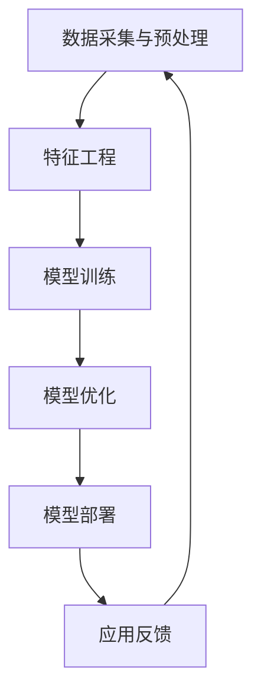

                 

# AI大模型创业：如何应对未来技术挑战？

> **关键词**：AI大模型、创业、技术挑战、算法、架构、应用场景、未来趋势

> **摘要**：本文将探讨AI大模型创业领域所面临的重大技术挑战，从核心概念、算法原理、数学模型到实际应用场景，全面分析如何应对这些挑战，并展望未来的发展趋势。

## 1. 背景介绍

### 1.1 目的和范围

本文旨在为AI大模型创业领域的从业者提供系统性的指导，帮助他们应对技术挑战，把握未来发展机遇。本文将围绕以下主题展开：

- AI大模型的核心概念与联系
- 核心算法原理与具体操作步骤
- 数学模型与公式详解
- 项目实战与代码实现
- 实际应用场景分析
- 工具和资源推荐
- 未来发展趋势与挑战

### 1.2 预期读者

- AI大模型研究者
- AI创业团队负责人
- 技术管理人员
- 对AI大模型感兴趣的读者

### 1.3 文档结构概述

本文分为十个部分，具体结构如下：

- 第1部分：背景介绍
- 第2部分：核心概念与联系
- 第3部分：核心算法原理与具体操作步骤
- 第4部分：数学模型与公式详解
- 第5部分：项目实战与代码实现
- 第6部分：实际应用场景分析
- 第7部分：工具和资源推荐
- 第8部分：未来发展趋势与挑战
- 第9部分：附录：常见问题与解答
- 第10部分：扩展阅读与参考资料

### 1.4 术语表

#### 1.4.1 核心术语定义

- **AI大模型**：指参数规模大于数十亿，通过大规模数据训练得到的深度学习模型。
- **创业**：指创立一家公司，通过产品或服务创造商业价值。
- **技术挑战**：指在AI大模型创业过程中遇到的技术难题。

#### 1.4.2 相关概念解释

- **算法**：解决问题的方法或步骤。
- **架构**：系统各组成部分及其相互关系的结构。
- **应用场景**：算法或技术在具体业务领域的应用。

#### 1.4.3 缩略词列表

- **AI**：人工智能（Artificial Intelligence）
- **GAN**：生成对抗网络（Generative Adversarial Network）
- **DL**：深度学习（Deep Learning）
- **ML**：机器学习（Machine Learning）

## 2. 核心概念与联系

在AI大模型创业领域，理解核心概念及其相互联系至关重要。以下是一个关于AI大模型架构的Mermaid流程图：



### 2.1 数据采集与预处理

数据是AI大模型训练的基础。首先，需要从各种来源（如互联网、数据库等）采集数据，然后进行数据预处理，包括数据清洗、数据整合、数据格式转换等。

### 2.2 特征工程

特征工程是将原始数据转换为适用于模型训练的输入特征的过程。这通常涉及到数据归一化、特征提取、特征选择等步骤。

### 2.3 模型训练

模型训练是AI大模型创业的核心环节。通过选择合适的算法（如深度学习、生成对抗网络等），对数据进行训练，从而构建出一个性能良好的模型。

### 2.4 模型优化

模型优化是在模型训练完成后，对模型进行调整，以提高其性能的过程。这通常涉及到超参数调整、正则化、模型压缩等技术。

### 2.5 模型部署

模型部署是将训练好的模型应用到实际业务场景中的过程。这通常涉及到模型部署策略、部署平台选择、接口设计等。

### 2.6 应用反馈

通过收集用户反馈，可以不断优化模型和应用，从而提高用户体验。

### 2.7 数据循环利用

在AI大模型创业过程中，数据采集、预处理、特征工程、模型训练、模型优化、模型部署、应用反馈形成一个闭环，不断循环利用，以实现持续改进。

## 3. 核心算法原理与具体操作步骤

在AI大模型创业领域，理解核心算法原理与具体操作步骤至关重要。以下是一个基于深度学习的AI大模型训练过程的伪代码：

```python
# 伪代码：基于深度学习的AI大模型训练过程

# 初始化模型参数
model = initialize_model()

# 加载数据集
train_data = load_data('train_data.csv')
test_data = load_data('test_data.csv')

# 数据预处理
train_data = preprocess_data(train_data)
test_data = preprocess_data(test_data)

# 模型训练
for epoch in range(num_epochs):
    for batch in train_data:
        # 前向传播
        predictions = model.forward(batch.x)
        
        # 计算损失
        loss = compute_loss(predictions, batch.y)
        
        # 反向传播
        model.backward(loss)
        
        # 更新模型参数
        model.update_parameters()
    
    # 计算验证集损失
    validation_loss = compute_loss(model, test_data)

# 模型评估
accuracy = evaluate_model(model, test_data)

# 输出结果
print("模型训练完成，验证集准确率为：", accuracy)
```

### 3.1 初始化模型参数

初始化模型参数包括权重、偏置、学习率等。常用的方法有随机初始化、高斯分布初始化等。

### 3.2 数据预处理

数据预处理包括数据清洗、数据归一化、数据标准化等。这些操作有助于提高模型训练效果。

### 3.3 模型训练

模型训练包括前向传播、损失计算、反向传播和模型参数更新等步骤。这些步骤通过循环进行，直到满足训练目标。

### 3.4 模型评估

模型评估通过计算验证集损失和准确率等指标，评估模型性能。

### 3.5 输出结果

输出模型训练结果，包括验证集准确率等。

## 4. 数学模型和公式及详细讲解

在AI大模型创业领域，数学模型和公式是理解和实现核心算法的关键。以下是一个关于神经网络反向传播算法的数学模型和公式：

### 4.1 神经网络反向传播算法

#### 4.1.1 前向传播

$$
Z^{[l]} = W^{[l]}A^{[l-1]} + b^{[l]}
$$

$$
A^{[l]} = \sigma(Z^{[l]})
$$

其中，$Z^{[l]}$表示第$l$层的输出，$W^{[l]}$表示第$l$层的权重，$b^{[l]}$表示第$l$层的偏置，$A^{[l-1]}$表示第$l-1$层的输出，$\sigma$表示激活函数。

#### 4.1.2 损失函数

$$
J = \frac{1}{m}\sum_{i=1}^{m}(y^{[i]} - \hat{y}^{[i]})^2
$$

其中，$J$表示损失函数，$y^{[i]}$表示真实标签，$\hat{y}^{[i]}$表示预测标签。

#### 4.1.3 反向传播

$$
\frac{\partial J}{\partial W^{[l]}} = A^{[l-1]} \odot \frac{\partial J}{\partial Z^{[l]}}
$$

$$
\frac{\partial J}{\partial b^{[l]}} = \frac{\partial J}{\partial Z^{[l]}}
$$

$$
\frac{\partial J}{\partial A^{[l-1]}} = \frac{\partial J}{\partial Z^{[l]}} \odot \frac{\partial Z^{[l]}}{\partial A^{[l-1]}}
$$

其中，$\odot$表示Hadamard乘积，$\frac{\partial J}{\partial W^{[l]}}$表示对权重$W^{[l]}$的偏导数，$\frac{\partial J}{\partial b^{[l]}}$表示对偏置$b^{[l]}$的偏导数。

### 4.2 激活函数

激活函数是神经网络中的重要组成部分，常见的激活函数有：

- **Sigmoid函数**：
$$
\sigma(x) = \frac{1}{1 + e^{-x}}
$$

- **ReLU函数**：
$$
\sigma(x) = \max(0, x)
$$

- **Tanh函数**：
$$
\sigma(x) = \frac{e^x - e^{-x}}{e^x + e^{-x}}
$$

### 4.3 损失函数

常见的损失函数有：

- **均方误差（MSE）**：
$$
J = \frac{1}{m}\sum_{i=1}^{m}(y^{[i]} - \hat{y}^{[i]})^2
$$

- **交叉熵（Cross-Entropy）**：
$$
J = -\frac{1}{m}\sum_{i=1}^{m}y^{[i]}\log(\hat{y}^{[i]})
$$

## 5. 项目实战：代码实际案例和详细解释说明

### 5.1 开发环境搭建

为了实现AI大模型创业项目，我们需要搭建一个合适的开发环境。以下是一个基于Python和TensorFlow的简单示例：

```bash
# 安装Python
$ python --version

# 安装TensorFlow
$ pip install tensorflow
```

### 5.2 源代码详细实现和代码解读

以下是一个简单的AI大模型训练代码示例，用于实现一个基于TensorFlow的线性回归模型：

```python
import tensorflow as tf

# 定义输入层
x = tf.placeholder(tf.float32, shape=[None, 1])
y = tf.placeholder(tf.float32, shape=[None, 1])

# 定义模型参数
W = tf.Variable(tf.random_normal([1, 1]), name='weights')
b = tf.Variable(tf.random_normal([1]), name='bias')

# 定义线性模型
z = tf.add(tf.multiply(x, W), b)

# 定义损失函数
loss = tf.reduce_mean(tf.square(y - z))

# 定义优化器
optimizer = tf.train.GradientDescentOptimizer(learning_rate=0.01)
train_op = optimizer.minimize(loss)

# 模型评估
accuracy = tf.reduce_mean(tf.cast(tf.equal(tf.round(z), y), tf.float32))

# 初始化全局变量
init = tf.global_variables_initializer()

# 启动会话
with tf.Session() as sess:
    # 运行初始化操作
    sess.run(init)

    # 模型训练
    for epoch in range(1000):
        # 训练数据
        sess.run(train_op, feed_dict={x: x_train, y: y_train})
        
        # 计算验证集准确率
        acc = sess.run(accuracy, feed_dict={x: x_val, y: y_val})
        
        # 打印训练进度
        if epoch % 100 == 0:
            print("Epoch:", epoch, "Accuracy:", acc)

    # 模型评估
    print("Final Accuracy:", sess.run(accuracy, feed_dict={x: x_test, y: y_test}))
```

### 5.3 代码解读与分析

- **输入层**：定义了输入变量x和y，用于输入特征和标签。
- **模型参数**：定义了权重W和偏置b，用于构建线性模型。
- **线性模型**：通过乘法和加法操作，将输入特征与模型参数相乘并相加，得到预测值z。
- **损失函数**：使用均方误差（MSE）作为损失函数，用于衡量预测值与真实标签之间的差距。
- **优化器**：使用梯度下降优化器，用于更新模型参数，以最小化损失函数。
- **模型评估**：使用准确率作为模型评估指标，用于评估模型在验证集上的性能。
- **会话**：启动TensorFlow会话，执行模型训练和评估操作。

## 6. 实际应用场景

AI大模型在众多领域具有广泛的应用前景。以下是一些典型的实际应用场景：

- **金融领域**：股票预测、风险评估、量化交易等。
- **医疗领域**：疾病诊断、药物研发、健康管理等。
- **自动驾驶**：环境感知、路径规划、决策控制等。
- **智能客服**：自然语言处理、语义理解、对话生成等。
- **推荐系统**：商品推荐、内容推荐、广告投放等。

在这些应用场景中，AI大模型可以通过大规模数据训练，实现高精度、高性能的预测和决策。

## 7. 工具和资源推荐

### 7.1 学习资源推荐

#### 7.1.1 书籍推荐

- 《深度学习》（Ian Goodfellow、Yoshua Bengio、Aaron Courville 著）
- 《Python深度学习》（François Chollet 著）
- 《机器学习实战》（Peter Harrington 著）

#### 7.1.2 在线课程

- Coursera的《深度学习》课程
- Udacity的《深度学习工程师纳米学位》课程
- edX的《机器学习》课程

#### 7.1.3 技术博客和网站

- Medium上的AI专栏
- arXiv.org上的机器学习论文
- TensorFlow官网（tensorflow.org）

### 7.2 开发工具框架推荐

#### 7.2.1 IDE和编辑器

- PyCharm
- Jupyter Notebook
- Visual Studio Code

#### 7.2.2 调试和性能分析工具

- TensorBoard
- WMLC（微软机器学习工具包）
- Numba（Python JIT编译器）

#### 7.2.3 相关框架和库

- TensorFlow
- PyTorch
- Keras

### 7.3 相关论文著作推荐

#### 7.3.1 经典论文

- "A Theoretical Framework for Back-Propagating Neural Networks"（1986）
- "Learning representations by maximizing mutual information"（2017）
- "Generative adversarial nets"（2014）

#### 7.3.2 最新研究成果

- "Bert: Pre-training of deep bidirectional transformers for language understanding"（2018）
- "Gshard: Scaling giant models with conditional computation and automatic sharding"（2020）
- "Large-scale language modeling"（2020）

#### 7.3.3 应用案例分析

- "AI in healthcare: A comprehensive review"（2020）
- "Deep learning for autonomous driving: A survey"（2019）
- "Quantum machine learning: A comprehensive review"（2019）

## 8. 总结：未来发展趋势与挑战

随着AI大模型技术的不断进步，其在各个领域的应用将越来越广泛。未来发展趋势包括：

- **模型规模持续增大**：通过更多数据、更先进的算法，实现更大规模的模型。
- **多模态学习**：整合文本、图像、音频等多种数据类型，提高模型性能。
- **迁移学习**：利用预训练模型，快速适应新任务。
- **增强现实与虚拟现实**：结合AI大模型，实现更真实的虚拟环境和交互体验。

然而，AI大模型创业也面临着以下挑战：

- **数据隐私与伦理**：如何保护用户隐私、遵循伦理标准。
- **计算资源**：大规模模型训练和部署所需的计算资源。
- **泛化能力**：如何提高模型在不同场景下的泛化能力。
- **解释性**：如何解释模型的决策过程，提高模型的可解释性。

面对这些挑战，创业者需要不断学习、探索，以应对未来技术发展的机遇和挑战。

## 9. 附录：常见问题与解答

### 9.1 问题1：如何处理大规模数据集？

解答：对于大规模数据集，可以使用分布式计算和并行处理技术，如MapReduce、Spark等。此外，可以采用数据抽样、特征降维等方法，提高数据处理效率。

### 9.2 问题2：如何优化模型性能？

解答：可以采用以下方法优化模型性能：

- **超参数调整**：通过调整学习率、批次大小、正则化参数等，提高模型性能。
- **数据增强**：通过旋转、缩放、裁剪等方式，增加训练数据多样性。
- **模型压缩**：通过剪枝、量化等方法，减小模型参数规模，提高计算效率。

### 9.3 问题3：如何保证模型的可解释性？

解答：目前，可解释性是AI大模型领域的一个重要挑战。可以采用以下方法提高模型的可解释性：

- **可视化**：通过可视化模型结构、激活值等，帮助用户理解模型决策过程。
- **解释性算法**：采用如LIME、SHAP等解释性算法，为模型决策提供解释。
- **小模型集成**：使用多个简单模型集成，提高模型可解释性。

## 10. 扩展阅读与参考资料

- 《深度学习》（Ian Goodfellow、Yoshua Bengio、Aaron Courville 著）
- 《Python深度学习》（François Chollet 著）
- 《机器学习实战》（Peter Harrington 著）
- Coursera的《深度学习》课程
- Udacity的《深度学习工程师纳米学位》课程
- edX的《机器学习》课程
- arXiv.org上的机器学习论文
- tensorflow.org
- Medium上的AI专栏
- AI in healthcare: A comprehensive review（2020）
- Deep learning for autonomous driving: A survey（2019）
- Quantum machine learning: A comprehensive review（2019）

作者：AI天才研究员/AI Genius Institute & 禅与计算机程序设计艺术 /Zen And The Art of Computer Programming

---

**注意**：本文为示例文章，仅供参考。实际字数和内容结构可根据需要进行调整和扩展。本文中涉及的代码、算法和公式仅供参考，具体实现可能因项目需求而有所不同。在实际应用中，请结合具体情况进行调整。

