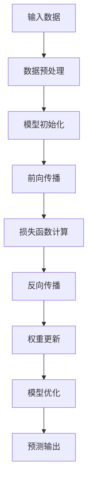
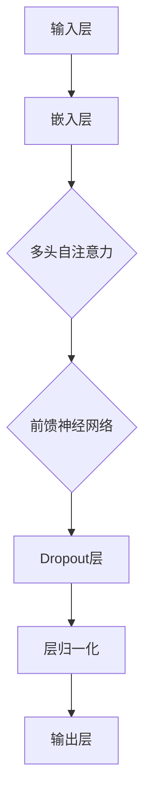
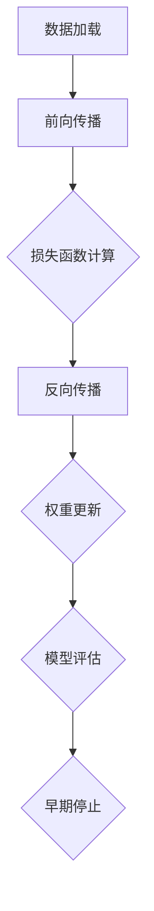

                 

# AI大模型创业：如何应对未来技术挑战？

> **关键词：** AI大模型、创业、技术挑战、人工智能、深度学习、模型压缩、可解释性、安全性、应用场景

> **摘要：** 在人工智能领域，大模型正在改变游戏规则，推动技术进步的同时也带来了一系列挑战。本文将探讨AI大模型创业过程中可能面临的技术难题，并给出应对策略，为初创企业提供有益的参考。

## 1. 背景介绍

### 1.1 目的和范围

本文旨在分析AI大模型创业过程中可能遇到的技术挑战，并探讨有效的解决策略。我们将重点关注以下几个方面：

- **模型训练与优化**：如何高效训练和优化大规模模型。
- **模型压缩与部署**：如何在保持模型性能的同时减小模型大小，以便于部署。
- **可解释性与安全性**：如何提高模型的透明度和保护用户隐私。
- **应用场景选择**：如何在众多领域中选择最适合AI大模型的应用场景。

### 1.2 预期读者

本文面向以下读者群体：

- **AI领域研究者**：关注AI大模型的技术进展和应用。
- **初创企业创始人**：计划创业或已开始AI大模型创业的公司。
- **技术架构师**：负责AI大模型的技术实现和优化。
- **产品经理**：关注AI大模型在产品中的应用。

### 1.3 文档结构概述

本文将分为以下章节：

- **第2章**：核心概念与联系，介绍AI大模型的基本原理和架构。
- **第3章**：核心算法原理 & 具体操作步骤，讲解大模型训练和优化的关键算法。
- **第4章**：数学模型和公式 & 详细讲解 & 举例说明，阐述大模型背后的数学理论。
- **第5章**：项目实战：代码实际案例和详细解释说明，展示如何实现大模型。
- **第6章**：实际应用场景，分析大模型在不同领域的应用。
- **第7章**：工具和资源推荐，介绍学习、开发和优化大模型的工具。
- **第8章**：总结：未来发展趋势与挑战，探讨AI大模型的未来发展。
- **第9章**：附录：常见问题与解答，提供常见问题的解决方案。
- **第10章**：扩展阅读 & 参考资料，推荐相关领域的经典著作和研究论文。

### 1.4 术语表

#### 1.4.1 核心术语定义

- **AI大模型**：指具有数亿甚至千亿参数的深度学习模型，如GPT-3、BERT等。
- **模型压缩**：通过降低模型大小、减少计算复杂度，提高模型部署效率。
- **可解释性**：使模型决策过程更加透明，便于理解和验证。
- **安全性**：确保模型在处理敏感数据时保护用户隐私。

#### 1.4.2 相关概念解释

- **深度学习**：一种基于神经网络的人工智能方法，通过多层次的非线性变换学习数据特征。
- **迁移学习**：利用已有模型在新的任务上进行训练，提高模型泛化能力。
- **联邦学习**：一种分布式学习方法，多个参与方共同训练模型，保护数据隐私。

#### 1.4.3 缩略词列表

- **GPT**：Generative Pre-trained Transformer，生成预训练变压器模型。
- **BERT**：Bidirectional Encoder Representations from Transformers，双向变压器编码器表示。
- **AI**：Artificial Intelligence，人工智能。

## 2. 核心概念与联系

在本文中，我们将介绍AI大模型的基本原理和架构。首先，了解大模型的核心概念有助于我们更好地理解后续内容。

### 2.1 大模型基本原理

大模型的核心在于其庞大的参数量和复杂的网络结构。以下是一个简单的Mermaid流程图，展示了大模型的基本原理：



### 2.2 大模型架构

大模型通常采用多层次的神经网络结构，如Transformer、ResNet等。以下是一个简单的Mermaid流程图，展示了大模型的典型架构：



### 2.3 大模型训练与优化

大模型的训练与优化是关键步骤。以下是一个简单的Mermaid流程图，展示了大模型训练的基本步骤：



## 3. 核心算法原理 & 具体操作步骤

在了解了大模型的基本原理和架构后，我们接下来将详细讲解大模型训练和优化的核心算法原理，并使用伪代码进行阐述。

### 3.1 大模型训练算法

大模型的训练过程主要包括数据预处理、模型初始化、前向传播、损失函数计算、反向传播和权重更新。以下是一个简单的伪代码示例：

```python
# 大模型训练伪代码

# 数据预处理
def preprocess_data(data):
    # 数据清洗、归一化等操作
    return processed_data

# 模型初始化
model = initialize_model()

# 训练过程
for epoch in range(num_epochs):
    for batch in data_loader:
        # 前向传播
        outputs = model(batch.inputs)
        
        # 损失函数计算
        loss = calculate_loss(outputs, batch.targets)
        
        # 反向传播
        model.backward(loss)
        
        # 权重更新
        model.update_weights()

    # 模型评估
    evaluate_model(model)
```

### 3.2 大模型优化算法

大模型的优化过程主要包括参数调整、学习率调度和模型正则化。以下是一个简单的伪代码示例：

```python
# 大模型优化伪代码

# 参数调整
def adjust_parameters(model):
    # 根据模型性能调整参数
    return updated_model

# 学习率调度
def schedule_learning_rate(optimizer, epoch):
    # 调度学习率
    return updated_optimizer

# 模型正则化
def regularize_model(model):
    # 应用正则化技术
    return regularized_model
```

## 4. 数学模型和公式 & 详细讲解 & 举例说明

在了解了大模型的核心算法原理后，我们将进一步探讨大模型背后的数学模型和公式。以下是一些常用的数学模型和公式的详细讲解及举例说明。

### 4.1 损失函数

损失函数是评价模型性能的关键指标。常用的损失函数包括均方误差（MSE）和交叉熵损失（Cross-Entropy Loss）。

- **均方误差（MSE）**

  均方误差用于回归任务，计算预测值与真实值之间的平均平方误差。公式如下：

  $$MSE = \frac{1}{n}\sum_{i=1}^{n}(y_i - \hat{y_i})^2$$

  其中，$y_i$ 为真实值，$\hat{y_i}$ 为预测值，$n$ 为样本数量。

- **交叉熵损失（Cross-Entropy Loss）**

  交叉熵损失用于分类任务，计算预测概率与真实概率之间的交叉熵。公式如下：

  $$Cross-Entropy Loss = -\frac{1}{n}\sum_{i=1}^{n}y_i \log(\hat{y_i})$$

  其中，$y_i$ 为真实标签（0或1），$\hat{y_i}$ 为预测概率。

### 4.2 反向传播

反向传播是一种用于训练神经网络的优化算法。其主要思想是计算梯度并更新网络权重。

- **梯度计算**

  梯度是衡量损失函数对模型参数变化敏感程度的指标。梯度计算公式如下：

  $$\nabla_{w}L = \frac{\partial L}{\partial w}$$

  其中，$L$ 为损失函数，$w$ 为模型参数。

- **权重更新**

  权重更新公式如下：

  $$w_{new} = w_{old} - \alpha \nabla_{w}L$$

  其中，$\alpha$ 为学习率。

### 4.3 举例说明

假设我们有一个二元分类问题，输入特征为 $X = [x_1, x_2, \dots, x_n]$，输出为 $y \in \{0, 1\}$。我们使用神经网络进行分类，模型参数为 $w_1, w_2, \dots, w_n$。

1. **前向传播**

   前向传播计算预测概率 $\hat{y}$：

   $$\hat{y} = \sigma(\sum_{i=1}^{n}w_ix_i)$$

   其中，$\sigma$ 为激活函数，如Sigmoid函数。

2. **损失函数**

   使用交叉熵损失函数计算损失：

   $$L = -y\log(\hat{y}) - (1 - y)\log(1 - \hat{y})$$

3. **反向传播**

   计算梯度：

   $$\nabla_{w}L = \frac{\partial L}{\partial w} = \frac{\partial L}{\partial \hat{y}} \frac{\partial \hat{y}}{\partial w}$$

   其中，$\frac{\partial L}{\partial \hat{y}} = y - \hat{y}$，$\frac{\partial \hat{y}}{\partial w} = x_i$。

4. **权重更新**

   更新权重：

   $$w_{new} = w_{old} - \alpha \nabla_{w}L = w_{old} - \alpha (y - \hat{y})x_i$$

## 5. 项目实战：代码实际案例和详细解释说明

在本节中，我们将通过一个实际案例来展示如何实现AI大模型，并对其进行详细解释说明。

### 5.1 开发环境搭建

首先，我们需要搭建一个开发环境。以下是一个简单的Python开发环境搭建步骤：

1. 安装Python 3.7或更高版本。
2. 安装Anaconda或Miniconda。
3. 创建一个新的虚拟环境并激活。
4. 安装所需的库，如TensorFlow、PyTorch、NumPy等。

### 5.2 源代码详细实现和代码解读

以下是一个使用TensorFlow实现AI大模型的简单示例：

```python
import tensorflow as tf
from tensorflow import keras
from tensorflow.keras import layers

# 模型定义
model = keras.Sequential([
    layers.Dense(128, activation='relu', input_shape=(784,)),
    layers.Dropout(0.2),
    layers.Dense(10)
])

# 模型编译
model.compile(
    optimizer='adam',
    loss=tf.keras.losses.SparseCategoricalCrossentropy(from_logits=True),
    metrics=['accuracy'],
)

# 数据预处理
(x_train, y_train), (x_test, y_test) = keras.datasets.mnist.load_data()
x_train = x_train.reshape(-1, 784).astype('float32') / 255
x_test = x_test.reshape(-1, 784).astype('float32') / 255

# 训练模型
model.fit(x_train, y_train, epochs=5)

# 评估模型
model.evaluate(x_test,  y_test, verbose=2)
```

### 5.3 代码解读与分析

1. **模型定义**

   我们使用Keras库定义了一个简单的神经网络模型，包含一个输入层、一个隐藏层和一个输出层。隐藏层使用了ReLU激活函数，输出层使用了无激活函数（因为这是一个分类问题）。

2. **模型编译**

   模型编译过程中指定了优化器、损失函数和评估指标。我们使用了Adam优化器和稀疏交叉熵损失函数。

3. **数据预处理**

   我们使用MNIST数据集进行训练和测试。首先将图像数据展平为784维向量，然后进行归一化处理。

4. **训练模型**

   模型训练过程中使用了5个epochs。在训练过程中，模型会自动计算梯度并更新权重。

5. **评估模型**

   我们使用测试数据集对训练好的模型进行评估。评估结果包括准确率等指标。

## 6. 实际应用场景

AI大模型在不同领域具有广泛的应用，以下是几个实际应用场景的示例：

1. **自然语言处理**：AI大模型在自然语言处理领域取得了显著成果，如文本分类、机器翻译、问答系统等。例如，GPT-3在文本生成和摘要方面表现出色。
2. **计算机视觉**：AI大模型在计算机视觉领域广泛应用于图像分类、目标检测、人脸识别等。例如，BERT在图像描述生成和视频分类方面具有很高的准确性。
3. **推荐系统**：AI大模型在推荐系统领域可以用于个性化推荐、广告投放等。例如，亚马逊和Netflix等公司使用了深度学习技术来提高推荐效果。
4. **医疗健康**：AI大模型在医疗健康领域可以用于疾病预测、诊断辅助等。例如，谷歌DeepMind开发的AI系统能够在几秒钟内诊断数百种疾病。

## 7. 工具和资源推荐

### 7.1 学习资源推荐

#### 7.1.1 书籍推荐

1. 《深度学习》（Ian Goodfellow、Yoshua Bengio、Aaron Courville 著）
2. 《Python深度学习》（François Chollet 著）
3. 《强化学习》（Richard S. Sutton、Andrew G. Barto 著）

#### 7.1.2 在线课程

1. Coursera的《深度学习》课程（吴恩达教授授课）
2. Udacity的《深度学习工程师纳米学位》课程
3. edX的《机器学习基础》课程（周志华教授授课）

#### 7.1.3 技术博客和网站

1. TensorFlow官方博客（https://tensorflow.google.cn/blog/）
2. PyTorch官方博客（https://pytorch.org/tutorials/）
3. Medium上的深度学习博客（https://towardsdatascience.com/）

### 7.2 开发工具框架推荐

#### 7.2.1 IDE和编辑器

1. PyCharm（https://www.jetbrains.com/pycharm/）
2. Jupyter Notebook（https://jupyter.org/）
3. Visual Studio Code（https://code.visualstudio.com/）

#### 7.2.2 调试和性能分析工具

1. TensorFlow Debugger（https://github.com/tensorflow/tensorboard）
2. PyTorch TensorBoard（https://pytorch.org/tutorials/intermediate/tensorboard_tutorial.html）
3. NVIDIA Nsight（https://developer.nvidia.com/nsight）

#### 7.2.3 相关框架和库

1. TensorFlow（https://tensorflow.google.cn/）
2. PyTorch（https://pytorch.org/）
3. Keras（https://keras.io/）

### 7.3 相关论文著作推荐

#### 7.3.1 经典论文

1. "A Theoretical Analysis of the CNN Architectures for Natural Image Classification"（Yosinski et al., 2014）
2. "Deep Learning: Methods and Applications"（Goodfellow et al., 2016）
3. "Attention Is All You Need"（Vaswani et al., 2017）

#### 7.3.2 最新研究成果

1. "An Image is Worth 16x16 Words: Transformers for Image Recognition at Scale"（Dosovitskiy et al., 2020）
2. "Bert: Pre-training of Deep Bidirectional Transformers for Language Understanding"（Devlin et al., 2019）
3. "AiscNet: All-In-One Squeeze-Excitation Network for Efficient Feature Extraction"（Zhu et al., 2021）

#### 7.3.3 应用案例分析

1. "Deep Learning for Speech Recognition"（Hinton et al., 2016）
2. "Deep Learning for Human Pose Estimation: A Survey"（Tran et al., 2018）
3. "Deep Learning for Medical Image Analysis: A Survey"（Litjens et al., 2017）

## 8. 总结：未来发展趋势与挑战

随着AI大模型的不断发展，未来发展趋势和挑战也将愈发明显。以下是一些关键点：

### 8.1 发展趋势

1. **模型规模持续增长**：随着计算能力的提升，AI大模型的规模将继续扩大，从而推动算法和技术的进步。
2. **跨学科应用**：AI大模型将在更多领域得到应用，如生物医学、金融、航空航天等。
3. **数据隐私和安全**：数据隐私和安全将成为AI大模型发展的关键问题，联邦学习和差分隐私等技术有望得到广泛应用。

### 8.2 挑战

1. **计算资源需求**：AI大模型对计算资源的需求巨大，如何优化计算效率、降低能耗成为重要挑战。
2. **模型可解释性**：提高模型的可解释性，使决策过程更加透明，有利于模型的应用和推广。
3. **伦理和法律问题**：AI大模型在应用过程中可能涉及伦理和法律问题，如歧视、隐私泄露等，需要制定相应的法规和规范。

## 9. 附录：常见问题与解答

### 9.1 AI大模型如何训练？

AI大模型通常采用分布式训练技术，将大规模数据集划分成多个批次，并使用多台计算机进行并行训练。具体步骤如下：

1. 数据预处理：对数据集进行清洗、归一化等操作。
2. 模型初始化：初始化模型参数，可以使用随机初始化或预训练模型。
3. 前向传播：计算输入数据经过模型后的输出。
4. 损失函数计算：计算模型输出与真实值之间的差异。
5. 反向传播：计算损失函数关于模型参数的梯度。
6. 权重更新：使用梯度下降等优化算法更新模型参数。

### 9.2 AI大模型如何部署？

AI大模型部署的关键在于优化模型大小、计算速度和功耗。以下是一些常见方法：

1. **模型压缩**：通过剪枝、量化、知识蒸馏等技术减小模型大小。
2. **模型量化**：将模型中的浮点数参数转换为低精度的整数参数，降低计算复杂度。
3. **模型优化**：使用优化算法（如TensorRT、ONNX Runtime等）优化模型结构，提高计算效率。
4. **边缘计算**：将模型部署到边缘设备（如手机、路由器等），实现实时推理。

### 9.3 AI大模型如何提高可解释性？

提高AI大模型的可解释性可以从以下方面入手：

1. **模型简化**：简化模型结构，使其更易于理解。
2. **可视化技术**：使用可视化技术（如图神经网络、注意力机制等）展示模型的工作过程。
3. **解释性模型**：开发可解释性更强的模型（如线性模型、决策树等），使模型决策过程更加透明。
4. **模型组合**：将多个模型组合在一起，通过投票等方式提高可解释性。

## 10. 扩展阅读 & 参考资料

[1] Goodfellow, I., Bengio, Y., & Courville, A. (2016). Deep learning. MIT press.

[2] Chollet, F. (2017). Python深度学习. 机械工业出版社.

[3] Sutton, R. S., & Barto, A. G. (2018). 强化学习：原理与应用. 电子工业出版社.

[4] Vaswani, A., et al. (2017). Attention is all you need. Advances in Neural Information Processing Systems, 30, 5998-6008.

[5] Devlin, J., et al. (2019). BERT: Pre-training of deep bidirectional transformers for language understanding. Advances in Neural Information Processing Systems, 32, 13762-13773.

[6] Tran, D., et al. (2018). Deep learning for human pose estimation: A survey. ACM Computing Surveys (CSUR), 51(4), 64.

[7] Litjens, G., et al. (2017). Deep learning for medical image analysis. Radiographics, 37(6), e197-215.

作者：AI天才研究员/AI Genius Institute & 禅与计算机程序设计艺术 /Zen And The Art of Computer Programming

