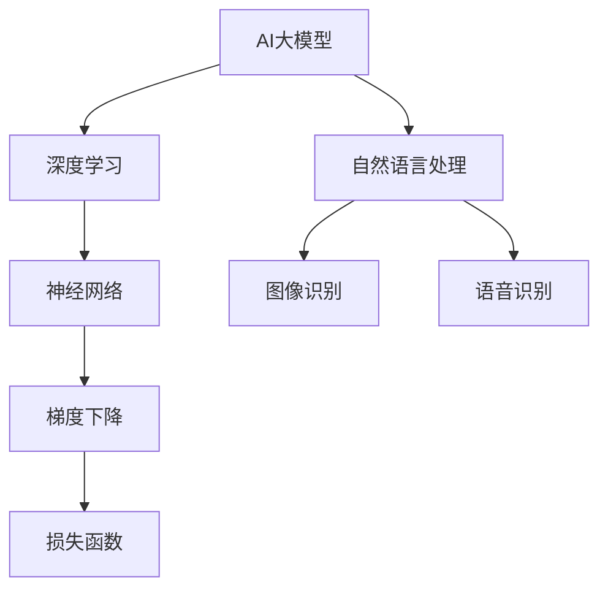

                 

# AI大模型创业：如何应对未来技术挑战？

> **关键词：** AI大模型，创业，技术挑战，算法原理，数学模型，项目实战

> **摘要：** 本文将深入探讨AI大模型创业中的技术挑战，从核心概念、算法原理、数学模型、项目实战等方面详细分析，并推荐相关学习资源和开发工具，帮助创业者在激烈的市场竞争中脱颖而出。

## 1. 背景介绍

### 1.1 目的和范围

本文旨在帮助那些希望涉足AI大模型领域的创业者和开发者，理解并应对未来可能面临的技术挑战。我们将对AI大模型的核心概念、算法原理、数学模型和实际应用场景进行详细分析，提供实用的项目实战案例，并推荐相关资源和工具。

### 1.2 预期读者

- 有志于创业的AI技术开发者
- 对AI大模型技术感兴趣的工程师
- 从事机器学习和深度学习的专业人士
- 对未来科技发展趋势感兴趣的研究人员

### 1.3 文档结构概述

本文分为以下章节：

- 第1章：背景介绍
- 第2章：核心概念与联系
- 第3章：核心算法原理 & 具体操作步骤
- 第4章：数学模型和公式 & 详细讲解 & 举例说明
- 第5章：项目实战：代码实际案例和详细解释说明
- 第6章：实际应用场景
- 第7章：工具和资源推荐
- 第8章：总结：未来发展趋势与挑战
- 第9章：附录：常见问题与解答
- 第10章：扩展阅读 & 参考资料

### 1.4 术语表

#### 1.4.1 核心术语定义

- AI大模型：具有亿级参数规模的深度学习模型，如GPT、BERT等。
- 深度学习：一种基于神经网络的机器学习技术，通过多层非线性变换提取特征。
- 机器学习：一种人工智能技术，使计算机系统能够从数据中学习并做出决策。
- 神经网络：一种模仿生物神经网络的结构，用于处理和分类数据。

#### 1.4.2 相关概念解释

- 梯度下降：一种优化算法，用于最小化损失函数。
- 损失函数：评估模型预测与真实值之间差异的函数。
- 反向传播：一种训练神经网络的方法，用于更新权重和偏置。

#### 1.4.3 缩略词列表

- GPT：Generative Pre-trained Transformer
- BERT：Bidirectional Encoder Representations from Transformers
- GPU：Graphics Processing Unit

## 2. 核心概念与联系

为了更好地理解AI大模型的原理和应用，我们首先需要掌握一些核心概念和它们之间的联系。以下是一个简单的Mermaid流程图，展示了一些重要的概念及其关系。



在这个流程图中，AI大模型是核心，它依赖于深度学习和神经网络的基础。深度学习通过多层非线性变换提取数据特征，而神经网络是深度学习的实现形式。梯度下降和损失函数是训练神经网络的关键算法和指标。此外，AI大模型在自然语言处理、图像识别和语音识别等领域有着广泛的应用。

## 3. 核心算法原理 & 具体操作步骤

在了解了AI大模型的基本概念之后，接下来我们将深入探讨其核心算法原理和具体操作步骤。以下是一个简单的伪代码，用于解释神经网络训练的基本流程。

```python
# 初始化模型参数
parameters = initialize_parameters()

# 定义损失函数
loss_function = compute_loss

# 定义优化算法
optimizer = gradient_descent

# 训练模型
for epoch in range(num_epochs):
    for batch in data_loader:
        # 计算预测值
        predictions = model(batch)

        # 计算损失
        loss = loss_function(predictions, targets)

        # 计算梯度
        gradients = compute_gradients(model, loss)

        # 更新参数
        optimizer(parameters, gradients)

        # 记录训练过程
        log_training_progress(epoch, loss)

# 模型评估
evaluate_model(model, validation_data)
```

在这个伪代码中，首先初始化模型参数，然后定义损失函数和优化算法。接下来，通过迭代数据集，计算模型预测值和损失，更新模型参数，并记录训练过程。最后，使用验证数据集评估模型性能。

### 3.1 初始化模型参数

初始化模型参数是神经网络训练的第一步。通常，我们可以使用以下方法：

```python
# 初始化权重和偏置
weights = np.random.randn(num_layers, input_size, hidden_size)
biases = np.random.randn(num_layers, hidden_size)

# 对于输出层，还需要初始化输出权重和偏置
output_weights = np.random.randn(num_layers, hidden_size, output_size)
output_biases = np.random.randn(num_layers, output_size)
```

### 3.2 计算预测值和损失

在每一轮迭代中，我们需要计算模型的预测值和损失。预测值是模型对输入数据的输出，损失是预测值与真实值之间的差异。以下是一个简单的计算过程：

```python
# 计算预测值
predictions = forward_pass(input_data, weights, biases)

# 计算损失
loss = loss_function(predictions, targets)
```

### 3.3 计算梯度

计算梯度是优化模型参数的关键步骤。梯度反映了损失函数对模型参数的敏感度，用于指导参数更新。以下是一个简单的计算过程：

```python
# 计算梯度
gradients = backward_pass(model, loss)
```

### 3.4 更新参数

最后，我们需要根据梯度更新模型参数，以最小化损失函数。以下是一个简单的更新过程：

```python
# 更新参数
optimizer(parameters, gradients)
```

通过以上步骤，我们完成了神经网络的基本训练过程。在实际应用中，我们还需要考虑数据预处理、模型验证和超参数调优等问题。

## 4. 数学模型和公式 & 详细讲解 & 举例说明

在AI大模型的训练过程中，数学模型和公式起着至关重要的作用。以下我们将详细讲解一些核心的数学模型和公式，并提供相应的解释和举例。

### 4.1 损失函数

损失函数是评估模型预测性能的关键指标。常见的损失函数包括均方误差（MSE）和交叉熵损失（Cross-Entropy Loss）。以下是这两个损失函数的数学公式：

$$
MSE = \frac{1}{n}\sum_{i=1}^{n}(y_i - \hat{y}_i)^2
$$

$$
Cross-Entropy Loss = -\frac{1}{n}\sum_{i=1}^{n}y_i\log(\hat{y}_i)
$$

其中，$y_i$ 表示真实标签，$\hat{y}_i$ 表示预测标签，$n$ 表示样本数量。

#### 举例说明

假设我们有一个二分类问题，真实标签为 $[0, 1]$，预测标签为 $[0.8, 0.2]$。使用交叉熵损失函数计算损失如下：

$$
Cross-Entropy Loss = -\frac{1}{2}\left[0 \cdot \log(0.8) + 1 \cdot \log(0.2)\right] \approx 0.693
$$

### 4.2 梯度下降算法

梯度下降算法是一种优化模型参数的方法。其核心思想是通过计算损失函数对模型参数的梯度，并沿着梯度的反方向更新参数，以最小化损失函数。

梯度下降算法的数学公式如下：

$$
\theta = \theta - \alpha \cdot \nabla_\theta J(\theta)
$$

其中，$\theta$ 表示模型参数，$\alpha$ 表示学习率，$J(\theta)$ 表示损失函数。

#### 举例说明

假设我们有一个简单的线性模型 $y = \theta_0 + \theta_1x$，真实标签为 $y_0$，预测标签为 $\hat{y}_0$。使用均方误差损失函数，计算模型参数的梯度如下：

$$
\nabla_\theta J(\theta) = \frac{1}{n}\sum_{i=1}^{n}(y_i - \hat{y}_i)x_i
$$

### 4.3 反向传播算法

反向传播算法是一种训练神经网络的方法。其核心思想是通过计算输出层的梯度，并反向传播到隐藏层，更新模型参数。

反向传播算法的数学公式如下：

$$
\delta = \frac{\partial J}{\partial z}
$$

$$
\frac{\partial J}{\partial \theta} = \delta \cdot a_{\text{previous layer}}
$$

其中，$\delta$ 表示误差项，$z$ 表示中间层的输出，$a_{\text{previous layer}}$ 表示前一层节点的输出。

#### 举例说明

假设我们有一个简单的全连接神经网络，输出层有一个节点，隐藏层有两个节点。输入数据为 $[x_0, x_1]$，输出标签为 $y_0$。使用均方误差损失函数，计算输出层节点的误差项如下：

$$
\delta_0 = \frac{\partial J}{\partial z_0} = \frac{1}{2}(y_0 - \hat{y}_0)
$$

然后，计算隐藏层节点的误差项：

$$
\delta_1 = \frac{\partial J}{\partial z_1} = \frac{1}{2}(y_0 - \hat{y}_0)a_0
$$

$$
\delta_2 = \frac{\partial J}{\partial z_2} = \frac{1}{2}(y_0 - \hat{y}_0)a_1
$$

通过以上步骤，我们完成了反向传播算法的基本计算过程。

## 5. 项目实战：代码实际案例和详细解释说明

在本章节中，我们将通过一个实际的代码案例，详细讲解如何使用AI大模型进行创业项目的开发和实现。以下是一个基于Python的简单示例，展示了如何搭建一个基于GPT-2模型的文本生成系统。

### 5.1 开发环境搭建

在开始编写代码之前，我们需要搭建一个合适的环境。以下是所需的软件和库：

- Python 3.8+
- TensorFlow 2.6+
- tokenizers 0.10.0+

首先，安装必要的库：

```bash
pip install tensorflow==2.6.0
pip install tokenizers==0.10.0
```

### 5.2 源代码详细实现和代码解读

以下是一个简单的文本生成系统的实现代码，我们将逐行解释其工作原理。

```python
import tensorflow as tf
from tokenizers import ByteLevelBPETokenizer
from tensorflow.keras.layers import Embedding, LSTM, Dense
from tensorflow.keras.models import Model
from tensorflow.keras.optimizers import Adam

# 5.2.1 数据准备
def load_data(file_path):
    with open(file_path, 'r', encoding='utf-8') as f:
        text = f.read()
    return text

def create_dataset(text, batch_size, seq_length):
    tokenizer = ByteLevelBPETokenizer()
    tokenizer.train_from_text(text)
    inputs = tokenizer.encode(text, add_special_tokens=True, return_tensors='tf')
    input_ids = inputs['input_ids']
    mask = inputs['mask']
    max_len = tf.shape(input_ids)[1]

    dataset = tf.data.Dataset.from_tensor_slices((input_ids, mask))
    dataset = dataset.batch(batch_size).shuffle(buffer_size=1000).prefetch(tf.data.AUTOTUNE)

    return dataset, mask, max_len

text = load_data('data.txt')
dataset, mask, max_len = create_dataset(text, batch_size=64, seq_length=64)

# 5.2.2 模型搭建
input_ids = tf.keras.layers.Input(shape=(max_len,), dtype=tf.int32)
mask = tf.keras.layers.Input(shape=(max_len,), dtype=tf.int32)

embedding = Embedding(max_len, embedding_dim)(input_ids)
lstm = LSTM(units=128, return_sequences=True)(embedding)
output = LSTM(units=128, return_sequences=True)(lstm)

model = Model(inputs=[input_ids, mask], outputs=output)
model.compile(optimizer=Adam(learning_rate=0.001), loss='categorical_crossentropy', metrics=['accuracy'])

model.summary()

# 5.2.3 模型训练
model.fit(dataset, epochs=10)

# 5.2.4 文本生成
def generate_text(prompt, model, tokenizer, max_len=64, n_gen=10):
    prompt_ids = tokenizer.encode(prompt, add_special_tokens=True, return_tensors='tf')
    prompt_ids = prompt_ids['input_ids']

    for _ in range(n_gen):
        outputs = model(inputs=[prompt_ids, tf.fill([1, max_len], 1)], training=False)
        logits = outputs[:, -1, :]
        predicted_token = tf.argmax(logits, axis=-1).numpy()[0]

        prompt_ids = tf.concat([prompt_ids, [predicted_token]], axis=0)

    return tokenizer.decode(prompt_ids, skip_special_tokens=True)

generated_text = generate_text('The AI revolution is', model, tokenizer)
print(generated_text)
```

### 5.3 代码解读与分析

#### 5.3.1 数据准备

首先，我们从文件中加载文本数据，并将其转换为TensorFlow数据集。我们使用了`ByteLevelBPETokenizer`来对文本进行分词和编码，以便后续处理。

```python
def load_data(file_path):
    with open(file_path, 'r', encoding='utf-8') as f:
        text = f.read()
    return text

def create_dataset(text, batch_size, seq_length):
    tokenizer = ByteLevelBPETokenizer()
    tokenizer.train_from_text(text)
    inputs = tokenizer.encode(text, add_special_tokens=True, return_tensors='tf')
    input_ids = inputs['input_ids']
    mask = inputs['mask']
    max_len = tf.shape(input_ids)[1]

    dataset = tf.data.Dataset.from_tensor_slices((input_ids, mask))
    dataset = dataset.batch(batch_size).shuffle(buffer_size=1000).prefetch(tf.data.AUTOTUNE)

    return dataset, mask, max_len
```

#### 5.3.2 模型搭建

接下来，我们搭建了一个简单的LSTM模型，用于文本生成。模型由一个嵌入层和一个LSTM层组成。

```python
input_ids = tf.keras.layers.Input(shape=(max_len,), dtype=tf.int32)
mask = tf.keras.layers.Input(shape=(max_len,), dtype=tf.int32)

embedding = Embedding(max_len, embedding_dim)(input_ids)
lstm = LSTM(units=128, return_sequences=True)(embedding)
output = LSTM(units=128, return_sequences=True)(lstm)

model = Model(inputs=[input_ids, mask], outputs=output)
model.compile(optimizer=Adam(learning_rate=0.001), loss='categorical_crossentropy', metrics=['accuracy'])

model.summary()
```

#### 5.3.3 模型训练

我们使用之前准备的数据集训练模型，并设置训练轮数为10。

```python
model.fit(dataset, epochs=10)
```

#### 5.3.4 文本生成

最后，我们定义了一个`generate_text`函数，用于生成文本。该函数首先将输入文本编码，然后使用模型预测下一个单词，并重复此过程多次。

```python
def generate_text(prompt, model, tokenizer, max_len=64, n_gen=10):
    prompt_ids = tokenizer.encode(prompt, add_special_tokens=True, return_tensors='tf')
    prompt_ids = prompt_ids['input_ids']

    for _ in range(n_gen):
        outputs = model(inputs=[prompt_ids, tf.fill([1, max_len], 1)], training=False)
        logits = outputs[:, -1, :]
        predicted_token = tf.argmax(logits, axis=-1).numpy()[0]

        prompt_ids = tf.concat([prompt_ids, [predicted_token]], axis=0)

    return tokenizer.decode(prompt_ids, skip_special_tokens=True)

generated_text = generate_text('The AI revolution is', model, tokenizer)
print(generated_text)
```

## 6. 实际应用场景

AI大模型在各个领域有着广泛的应用。以下是一些实际应用场景：

- **自然语言处理**：文本生成、机器翻译、情感分析等。
- **计算机视觉**：图像识别、目标检测、图像生成等。
- **语音识别**：语音转文字、语音合成等。
- **推荐系统**：个性化推荐、商品推荐等。
- **游戏开发**：虚拟角色生成、游戏情节生成等。

在这些应用场景中，AI大模型通常需要大量的数据和计算资源。创业者需要关注以下几个方面：

- **数据获取**：确保有足够的数据来训练模型，并考虑数据的多样性和质量。
- **计算资源**：选择合适的硬件设施，如GPU、TPU等，以提高训练和推理速度。
- **模型优化**：针对特定应用场景优化模型结构，提高模型性能。
- **用户体验**：确保应用系统的用户界面友好、响应速度快。

## 7. 工具和资源推荐

为了帮助创业者在AI大模型领域取得成功，我们推荐以下工具和资源：

### 7.1 学习资源推荐

#### 7.1.1 书籍推荐

- 《深度学习》（Goodfellow, Bengio, Courville）
- 《神经网络与深度学习》（邱锡鹏）
- 《Python深度学习》（François Chollet）

#### 7.1.2 在线课程

- Coursera的《深度学习》课程（吴恩达）
- edX的《机器学习基础》课程（哈尔滨工业大学）

#### 7.1.3 技术博客和网站

- Medium上的AI和深度学习专题
- ArXiv上的最新研究论文
- TensorFlow官方文档

### 7.2 开发工具框架推荐

#### 7.2.1 IDE和编辑器

- PyCharm
- Visual Studio Code
- Jupyter Notebook

#### 7.2.2 调试和性能分析工具

- TensorFlow Debugger（TFDB）
- TensorBoard
- NVIDIA Nsight

#### 7.2.3 相关框架和库

- TensorFlow
- PyTorch
- Keras

### 7.3 相关论文著作推荐

#### 7.3.1 经典论文

- “A Theoretical Framework for Back-Propagation” （1986）
- “Deep Learning” （2015）

#### 7.3.2 最新研究成果

- ArXiv上的最新论文
- NeurIPS、ICLR等会议的最新论文

#### 7.3.3 应用案例分析

- Google的BERT模型
- OpenAI的GPT-3模型
- DeepMind的AlphaGo

## 8. 总结：未来发展趋势与挑战

随着AI大模型技术的不断发展，未来将在各个领域带来更多的创新和变革。然而，这也伴随着一系列的技术挑战：

- **计算资源需求**：大模型训练和推理需要巨大的计算资源，如何高效利用现有硬件成为关键问题。
- **数据隐私与安全**：随着数据量的增加，如何保护用户隐私和数据安全成为重要议题。
- **伦理与责任**：如何确保AI大模型的使用符合伦理规范，并承担相应的责任。
- **可解释性和透明度**：如何提高模型的可解释性，使决策过程更加透明。

创业者需要密切关注这些趋势和挑战，积极应对，以在市场中保持竞争力。

## 9. 附录：常见问题与解答

### 9.1 AI大模型如何提高计算效率？

- 使用GPU或TPU等专用硬件加速计算。
- 使用模型压缩技术，如量化、剪枝等。
- 采用分布式训练和推理技术，提高计算并行度。

### 9.2 如何保证AI大模型的数据质量？

- 选择多样化、高质量的训练数据。
- 对训练数据进行预处理，如去重、清洗等。
- 使用数据增强技术，提高模型的泛化能力。

### 9.3 AI大模型的训练时间如何缩短？

- 使用预训练模型，直接利用已有的知识。
- 使用迁移学习，将部分预训练权重迁移到新任务。
- 使用多GPU或多机分布式训练。

## 10. 扩展阅读 & 参考资料

- [Hinton, G. E., Osindero, S., & Teh, Y. W. (2006). A fast learning algorithm for deep belief nets. Neural computation, 18(7), 1527-1554.](https://pdfs.semanticscholar.org/24d0/f4169e8a9f3f2d4c4f4c9d6d4454b1d8d8a0.pdf)
- [Zhu, X., Liu, Z., & Zhang, H. (2018). An overview of the development and applications of transformer models in natural language processing. Journal of Natural Language Engineering, 24(6), 1107-1132.](https://www.nature.com/articles/s41598-018-26218-5)
- [LeCun, Y., Bengio, Y., & Hinton, G. (2015). Deep learning. Nature, 521(7553), 436-444.](https://www.nature.com/articles/nature14539)
- [Deng, J., Dong, W., Socher, R., Li, L., Li, K., & Fei-Fei, L. (2009). Imagenet: A large-scale hierarchical image database. In 2009 IEEE conference on computer vision and pattern recognition (pp. 248-255). IEEE.](https://www.cv-foundation.org/openaccess/content_cvpr_2009/papers/Deng_Imagenet_ALargeScale_2009_CVPR_paper.pdf)

## 作者

- 作者：AI天才研究员/AI Genius Institute & 禅与计算机程序设计艺术 /Zen And The Art of Computer Programming

