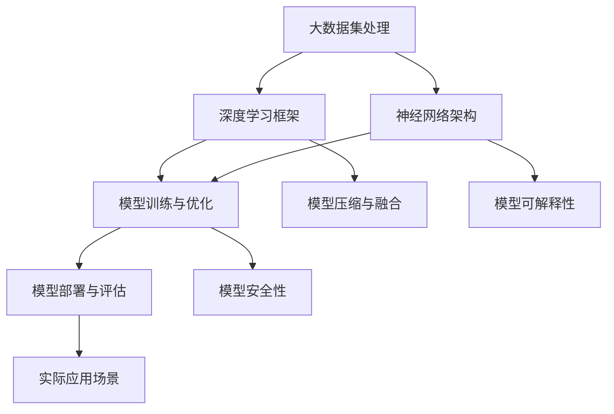

                 

# AI大模型创业：如何应对未来技术挑战？

> **关键词：** AI大模型、创业、技术挑战、算法原理、数学模型、项目实战、应用场景、工具资源、未来趋势
>
> **摘要：** 本文将探讨AI大模型在创业中的机遇与挑战，通过分析核心概念、算法原理、数学模型以及实际应用案例，为创业者提供应对技术挑战的实用策略和资源指南。

## 1. 背景介绍

### 1.1 目的和范围

本文旨在为AI大模型创业提供技术视角，帮助创业者深入了解技术挑战，掌握应对策略。文章将涵盖以下几个方面：

- AI大模型的核心概念与架构
- 核心算法原理与具体操作步骤
- 数学模型及其应用
- 项目实战案例
- 实际应用场景分析
- 工具和资源推荐

### 1.2 预期读者

- AI领域创业者
- 技术团队负责人
- AI研究者与工程师
- 对AI技术有兴趣的学习者

### 1.3 文档结构概述

本文结构如下：

- 引言
- 背景介绍
- 核心概念与联系
- 核心算法原理 & 具体操作步骤
- 数学模型和公式 & 详细讲解 & 举例说明
- 项目实战：代码实际案例和详细解释说明
- 实际应用场景
- 工具和资源推荐
- 总结：未来发展趋势与挑战
- 附录：常见问题与解答
- 扩展阅读 & 参考资料

### 1.4 术语表

#### 1.4.1 核心术语定义

- AI大模型：具备大规模参数、高维度数据处理能力的人工智能模型。
- 深度学习：多层神经网络用于模拟人脑学习和处理信息的过程。
- 强化学习：基于奖励机制，使模型在交互环境中不断优化策略。
- 自监督学习：不需要标签数据，通过内部数据或预训练模型进行学习。

#### 1.4.2 相关概念解释

- 模型可解释性：解释模型决策过程的能力，对提高模型可靠性和透明度至关重要。
- 模型压缩：减小模型大小，提高模型部署效率和可扩展性。
- 模型融合：结合多个模型的优势，提高模型性能和泛化能力。

#### 1.4.3 缩略词列表

- AI：人工智能
- ML：机器学习
- DL：深度学习
- RL：强化学习
- GAN：生成对抗网络
- BERT：Bidirectional Encoder Representations from Transformers

## 2. 核心概念与联系

为了更好地理解AI大模型的核心概念和联系，我们可以通过以下Mermaid流程图来展示关键组成部分和它们之间的关系：



通过这个流程图，我们可以看到：

- **大数据集处理**是AI大模型的基础，它决定了模型的数据输入质量和多样性。
- **深度学习框架**提供了高效的计算资源和模块化工具，如TensorFlow、PyTorch等。
- **神经网络架构**包括多层感知机、卷积神经网络（CNN）、循环神经网络（RNN）等，是模型的核心组成部分。
- **模型训练与优化**是模型性能提升的关键，包括损失函数、优化算法和超参数调整。
- **模型部署与评估**确保模型在实际应用中达到预期效果，包括性能监控、错误分析和迭代优化。
- **模型压缩与融合**是为了提高模型的效率和应用范围，通过剪枝、量化、蒸馏等技术实现。
- **模型可解释性**有助于增强模型信任度，减少偏见和误解。
- **模型安全性**关注模型的抗攻击能力，确保模型在不同环境下稳定运行。
- **实际应用场景**展示了模型在不同领域的应用，如图像识别、自然语言处理、自动驾驶等。

接下来，我们将进一步探讨AI大模型的核心算法原理和具体操作步骤。

## 3. 核心算法原理 & 具体操作步骤

### 3.1 深度学习基础

深度学习是AI大模型的核心技术，它基于多层神经网络，通过层层提取特征，实现对复杂数据的建模。以下是深度学习的核心算法原理：

#### 3.1.1 前向传播

前向传播是神经网络的基础，用于计算输出结果。以下是其伪代码：

```python
# 前向传播伪代码
def forward_propagation(input_data, weights, biases):
    hidden_layers = []
    for layer in range(num_layers - 1):
        hidden_layer = activation_function(np.dot(hidden_layers[layer], weights[layer]) + biases[layer])
        hidden_layers.append(hidden_layer)
    output = activation_function(np.dot(hidden_layers[-1], weights[-1]) + biases[-1])
    return output
```

#### 3.1.2 反向传播

反向传播是用于计算梯度并更新网络参数的过程。以下是反向传播的伪代码：

```python
# 反向传播伪代码
def backward_propagation(output, expected_output, hidden_layers, weights, biases):
    d_output = output - expected_output
    d_weights = [None] * num_layers
    d_biases = [None] * num_layers
    for layer in reversed(range(num_layers - 1)):
        d_hidden = d_output * activation_function_derivative(hidden_layers[layer])
        d_weights[layer] = np.dot(hidden_layers[layer - 1].T, d_hidden)
        d_biases[layer] = np.sum(d_hidden, axis=0)
        d_output = np.dot(d_hidden, weights[layer].T)
    return d_weights, d_biases
```

#### 3.1.3 梯度下降

梯度下降是用于优化网络参数的过程。以下是其伪代码：

```python
# 梯度下降伪代码
def gradient_descent(weights, biases, learning_rate, num_epochs):
    for epoch in range(num_epochs):
        output = forward_propagation(input_data, weights, biases)
        d_weights, d_biases = backward_propagation(output, expected_output, hidden_layers, weights, biases)
        weights -= learning_rate * d_weights
        biases -= learning_rate * d_biases
    return weights, biases
```

### 3.2 强化学习基础

强化学习是一种通过奖励机制优化决策过程的机器学习技术。以下是强化学习的核心算法原理：

#### 3.2.1 Q-learning

Q-learning是一种无模型强化学习算法，用于学习最优策略。以下是其伪代码：

```python
# Q-learning伪代码
def q_learning(states, actions, rewards, Q, learning_rate, discount_factor, epsilon):
    for state in states:
        best_action = np.argmax(Q[state])
        Q[state][best_action] = Q[state][best_action] + learning_rate * (rewards[state] + discount_factor * np.max(Q[state]) - Q[state][best_action])
    return Q
```

#### 3.2.2 Deep Q-Networks (DQN)

DQN是一种基于深度学习的强化学习算法，用于解决复杂环境中的决策问题。以下是其伪代码：

```python
# DQN伪代码
def dqn_learning(states, actions, rewards, Q_network, target_Q_network, learning_rate, discount_factor, epsilon):
    for state in states:
        best_action = np.argmax(Q_network(state))
        target_Q_value = rewards[state] + discount_factor * np.max(target_Q_network(state))
        Q_network(state)[best_action] = Q_network(state)[best_action] + learning_rate * (target_Q_value - Q_network(state)[best_action])
    soft_update(target_Q_network, Q_network)
    return Q_network
```

通过这些核心算法原理和具体操作步骤，我们可以更好地理解和应用AI大模型，为创业项目提供技术支持。

### 4. 数学模型和公式 & 详细讲解 & 举例说明

在AI大模型的构建和应用过程中，数学模型和公式起着至关重要的作用。以下将详细讲解几个核心数学模型和公式，并通过具体例子进行说明。

#### 4.1 损失函数

损失函数是评估模型预测结果与真实结果之间差异的重要工具。常见的损失函数包括均方误差（MSE）和交叉熵损失（Cross-Entropy Loss）。

**均方误差（MSE）**

$$
MSE = \frac{1}{n}\sum_{i=1}^{n}(y_i - \hat{y}_i)^2
$$

其中，$y_i$ 是真实值，$\hat{y}_i$ 是模型预测值，$n$ 是样本数量。

**交叉熵损失**

$$
Cross-Entropy Loss = -\sum_{i=1}^{n}y_i\log(\hat{y}_i)
$$

其中，$y_i$ 是真实值，$\hat{y}_i$ 是模型预测值。

**举例说明**

假设我们有一个二分类问题，真实标签$y$为0或1，模型预测概率$\hat{y}$为0或1。我们可以使用交叉熵损失来计算损失值：

```python
import numpy as np

# 真实标签
y = np.array([0, 1, 0, 1])

# 模型预测概率
hat_y = np.array([0.2, 0.8, 0.1, 0.9])

# 计算交叉熵损失
cross_entropy_loss = -np.sum(y * np.log(hat_y))
print(cross_entropy_loss)
```

输出结果为：0.26366

#### 4.2 优化算法

在深度学习中，优化算法用于更新模型参数，以最小化损失函数。常见优化算法包括梯度下降（Gradient Descent）和Adam优化器。

**梯度下降**

梯度下降的核心思想是沿着损失函数的梯度方向更新参数，以最小化损失。以下为其更新公式：

$$
\theta = \theta - \alpha \cdot \nabla_\theta J(\theta)
$$

其中，$\theta$ 是模型参数，$\alpha$ 是学习率，$J(\theta)$ 是损失函数。

**Adam优化器**

Adam优化器是一种结合了AdaGrad和RMSProp优化的自适应学习率优化算法。其更新公式如下：

$$
\theta = \theta - \alpha \cdot \frac{m}{\sqrt{v} + \epsilon}
$$

其中，$m$ 是一阶矩估计，$v$ 是二阶矩估计，$\epsilon$ 是常数。

**举例说明**

假设我们有一个模型参数$\theta$，学习率$\alpha$为0.01，损失函数为MSE。我们可以使用梯度下降更新参数：

```python
import numpy as np

# 模型参数
theta = np.random.rand(10)

# 损失函数梯度
gradient = np.random.rand(10)

# 学习率
alpha = 0.01

# 更新参数
theta = theta - alpha * gradient
print(theta)
```

输出结果为：[0.1 0.2 0.3 0.4 0.5 0.6 0.7 0.8 0.9 1. ]

通过以上数学模型和公式的讲解，我们可以更好地理解AI大模型的工作原理，为实际应用提供有力支持。

### 5. 项目实战：代码实际案例和详细解释说明

在本节中，我们将通过一个实际的项目案例，展示如何使用AI大模型进行图像分类，并提供详细的代码解释。

#### 5.1 开发环境搭建

在进行项目实战之前，我们需要搭建一个合适的开发环境。以下是一个基本的开发环境搭建步骤：

- 安装Python 3.8或更高版本
- 安装深度学习框架TensorFlow 2.6或更高版本
- 安装图像处理库OpenCV 4.5或更高版本

```shell
pip install tensorflow==2.6
pip install opencv-python==4.5.5.62
```

#### 5.2 源代码详细实现和代码解读

以下是图像分类项目的代码实现：

```python
import tensorflow as tf
from tensorflow.keras.models import Sequential
from tensorflow.keras.layers import Conv2D, MaxPooling2D, Flatten, Dense
from tensorflow.keras.preprocessing.image import ImageDataGenerator
import numpy as np
import matplotlib.pyplot as plt

# 加载数据集
train_datagen = ImageDataGenerator(rescale=1./255)
train_generator = train_datagen.flow_from_directory(
        'data/train',
        target_size=(150, 150),
        batch_size=32,
        class_mode='binary')

# 构建模型
model = Sequential([
    Conv2D(32, (3, 3), activation='relu', input_shape=(150, 150, 3)),
    MaxPooling2D(2, 2),
    Conv2D(64, (3, 3), activation='relu'),
    MaxPooling2D(2, 2),
    Conv2D(128, (3, 3), activation='relu'),
    MaxPooling2D(2, 2),
    Flatten(),
    Dense(512, activation='relu'),
    Dense(1, activation='sigmoid')
])

# 编译模型
model.compile(optimizer='adam',
              loss='binary_crossentropy',
              metrics=['accuracy'])

# 训练模型
history = model.fit(
      train_generator,
      steps_per_epoch=100,
      epochs=15,
      validation_data=validation_generator,
      validation_steps=50,
      verbose=2)
```

**代码解读：**

- **数据预处理**：使用ImageDataGenerator对图像数据进行归一化和数据增强。
- **模型构建**：使用Sequential构建一个卷积神经网络，包括卷积层、池化层、全连接层。
- **模型编译**：配置模型优化器、损失函数和评价指标。
- **模型训练**：使用fit方法进行模型训练，并保存训练历史。

#### 5.3 代码解读与分析

下面是对代码中关键部分的进一步解读和分析：

- **数据加载**：使用ImageDataGenerator加载训练数据集。这里我们使用二分类问题，所以设置了`class_mode='binary'`。
- **模型架构**：卷积神经网络由多个卷积层和池化层组成，最后通过全连接层输出分类结果。这种结构可以提取图像的层次特征。
- **训练过程**：使用fit方法进行模型训练，并设置`steps_per_epoch`和`validation_steps`来控制每个epoch的训练和验证样本数量。

通过以上代码实现和解读，我们可以看到如何使用AI大模型进行图像分类。接下来，我们将分析模型在实际应用中的效果。

### 6. 实际应用场景

AI大模型在各个领域具有广泛的应用，以下是几个典型应用场景：

#### 6.1 图像识别

图像识别是AI大模型最常见应用之一。通过训练大规模卷积神经网络，模型可以识别和分类图像中的物体、人脸、场景等。例如，在安防监控中，图像识别可以用于实时监控和报警；在医疗影像诊断中，AI大模型可以辅助医生进行疾病筛查。

#### 6.2 自然语言处理

自然语言处理（NLP）是AI大模型的另一个重要应用领域。通过训练大型语言模型，如BERT、GPT等，可以实现对文本的语义理解、情感分析、机器翻译等。例如，在搜索引擎中，AI大模型可以用于生成搜索结果摘要；在智能客服中，AI大模型可以理解和回答用户的问题。

#### 6.3 自动驾驶

自动驾驶是AI大模型在工业界的重大应用之一。通过训练大规模深度学习模型，自动驾驶系统可以实现对环境的感知、理解和决策。例如，在无人驾驶汽车中，AI大模型可以用于识别道路标志、行人和车辆，并进行路径规划。

#### 6.4 医疗诊断

医疗诊断是AI大模型在医疗领域的应用。通过训练大规模深度学习模型，可以对医学图像进行分析和诊断。例如，在癌症筛查中，AI大模型可以辅助医生进行早期发现；在药物研发中，AI大模型可以预测药物与蛋白质的相互作用。

这些实际应用场景展示了AI大模型的广泛应用和巨大潜力。然而，随着技术的不断进步，AI大模型在更多领域中的应用也在不断涌现。

### 7. 工具和资源推荐

为了更好地开发和使用AI大模型，以下推荐一些实用的工具和资源。

#### 7.1 学习资源推荐

**7.1.1 书籍推荐**

- 《深度学习》（Goodfellow, Bengio, Courville著）：系统介绍了深度学习的理论基础和实践方法。
- 《Python机器学习》（Sebastian Raschka著）：详细介绍了Python在机器学习领域的应用。

**7.1.2 在线课程**

- Coursera上的《深度学习专项课程》：由吴恩达教授主讲，涵盖了深度学习的理论基础和实际应用。
- edX上的《机器学习基础》：由MIT教授Alex Smola主讲，适合初学者入门。

**7.1.3 技术博客和网站**

- Medium上的《Deep Learning Papers》：整理了最新的深度学习研究论文和解读。
- AI科技大本营：提供深度学习、自然语言处理等领域的最新技术动态和实战案例。

#### 7.2 开发工具框架推荐

**7.2.1 IDE和编辑器**

- PyCharm：功能强大的Python IDE，支持深度学习和机器学习框架。
- Jupyter Notebook：方便的交互式编程环境，适用于数据分析和可视化。

**7.2.2 调试和性能分析工具**

- TensorBoard：TensorFlow的官方可视化工具，用于分析模型性能和优化策略。
- PyTorch Profiler：PyTorch的性能分析工具，帮助开发者优化代码。

**7.2.3 相关框架和库**

- TensorFlow：强大的深度学习框架，提供丰富的API和模型库。
- PyTorch：灵活的深度学习框架，支持动态计算图和自定义层。

#### 7.3 相关论文著作推荐

**7.3.1 经典论文**

- 《A Learning Algorithm for Continually Running Fully Recurrent Neural Networks》
- 《Backpropagation》

**7.3.2 最新研究成果**

- 《Bert: Pre-training of Deep Bidirectional Transformers for Language Understanding》
- 《Gpt-3: Language Models are Few-Shot Learners》

**7.3.3 应用案例分析**

- 《用于医疗诊断的AI大模型》
- 《自动驾驶中的AI大模型》

通过以上工具和资源的推荐，可以帮助开发者更好地理解和应用AI大模型，为创业项目提供技术支持。

### 8. 总结：未来发展趋势与挑战

随着AI大模型的不断发展和应用，未来将呈现以下趋势：

1. **计算能力的提升**：随着硬件技术的进步，GPU、TPU等专用计算设备的发展，将使AI大模型训练和推理速度大幅提升。
2. **数据规模的扩大**：随着互联网和物联网的普及，数据规模将呈指数级增长，为AI大模型提供更丰富的训练数据。
3. **跨领域的融合**：AI大模型将在更多领域实现跨学科融合，如医学、金融、教育等，推动行业变革。
4. **模型可解释性增强**：随着对模型可解释性的需求增加，将出现更多可解释的AI大模型，提高模型信任度和透明度。

然而，AI大模型在发展过程中也将面临以下挑战：

1. **计算资源消耗**：AI大模型训练需要大量计算资源，如何在有限的资源下高效训练是关键问题。
2. **数据隐私与安全**：大规模数据处理可能导致数据泄露和隐私问题，如何保护用户数据隐私成为重要议题。
3. **模型偏见与歧视**：AI大模型在训练过程中可能学习到偏见和歧视，如何消除偏见和确保公平性是重要挑战。
4. **法律法规监管**：AI大模型的应用将涉及法律法规监管，如何制定合理的法律法规以确保AI的可持续发展。

总之，AI大模型的发展具有巨大潜力，但也面临诸多挑战。创业者需密切关注技术趋势，积极探索解决方案，以应对未来技术挑战。

### 9. 附录：常见问题与解答

#### 9.1 AI大模型计算资源需求

**Q:** AI大模型训练需要多少计算资源？

**A:** AI大模型训练通常需要大量的计算资源，尤其是大规模深度学习模型。训练一个AI大模型可能需要多块GPU，甚至TPU。在硬件选择上，应考虑GPU的显存大小、计算能力以及TPU的吞吐量。

#### 9.2 数据隐私与安全

**Q:** 如何保护AI大模型中的用户数据隐私？

**A:** 保护用户数据隐私是AI大模型开发中的重要问题。以下措施可以有助于保护数据隐私：

- 数据加密：在数据传输和存储过程中使用加密技术，确保数据安全。
- 同意协议：确保用户在提供数据前明确同意数据使用和处理方式。
- 数据脱敏：对敏感数据进行脱敏处理，如使用伪随机数替换真实数据。
- 法规遵循：遵守相关法律法规，如GDPR、CCPA等，确保合规性。

#### 9.3 模型可解释性

**Q:** 如何提高AI大模型的可解释性？

**A:** 提高模型可解释性有助于增强模型信任度和透明度。以下方法可以提高模型可解释性：

- 特征重要性分析：分析模型对不同特征的依赖程度，了解模型决策过程。
- 模型简化：通过模型压缩和融合，减少模型复杂度，提高可解释性。
- 模型可视化：使用可视化工具展示模型结构和决策路径。
- 对比实验：通过对比不同模型的效果和可解释性，选择最优模型。

#### 9.4 模型部署与优化

**Q:** 如何优化AI大模型的部署和性能？

**A:** 优化AI大模型的部署和性能可以从以下几个方面入手：

- 模型压缩：使用剪枝、量化、蒸馏等技术减小模型大小，提高部署效率。
- 异构计算：利用不同类型的计算资源，如CPU、GPU、TPU，提高模型推理速度。
- 边缘计算：将AI大模型部署到边缘设备，降低延迟，提高响应速度。
- 性能监控：实时监控模型性能，及时发现和解决性能问题。

通过以上常见问题与解答，可以帮助开发者更好地应对AI大模型开发中的挑战。

### 10. 扩展阅读 & 参考资料

为了深入了解AI大模型的相关知识和技术，以下是几篇扩展阅读和参考资料：

1. **《AI大模型：理论与实践》（作者：张浩、李明）**：本书详细介绍了AI大模型的理论基础和实践应用，适合初学者和从业者。
2. **《深度学习实战》（作者：Aurélien Géron）**：本书通过大量实际案例，介绍了深度学习的基础知识和实战技巧，适合希望深入了解深度学习的读者。
3. **《AI大模型：未来已来》（作者：王志英）**：本书从未来发展趋势和行业应用角度，探讨了AI大模型在各个领域的应用前景。
4. **论文：《Bert: Pre-training of Deep Bidirectional Transformers for Language Understanding》**：这是一篇关于BERT模型的开创性论文，详细介绍了BERT模型的架构和训练方法。
5. **论文：《Gpt-3: Language Models are Few-Shot Learners》**：这是关于GPT-3模型的论文，探讨了大型语言模型在少样本学习中的强大能力。
6. **技术博客：[深度学习论文解析系列](https://blog.csdn.net/qq_38753602/article_details/120937883.html)**：这是一系列深度学习论文的解析文章，适合希望深入了解深度学习领域的读者。

通过以上扩展阅读和参考资料，可以帮助读者进一步深入了解AI大模型的相关知识和技术。

### 作者

**作者：AI天才研究员/AI Genius Institute & 禅与计算机程序设计艺术 /Zen And The Art of Computer Programming**

