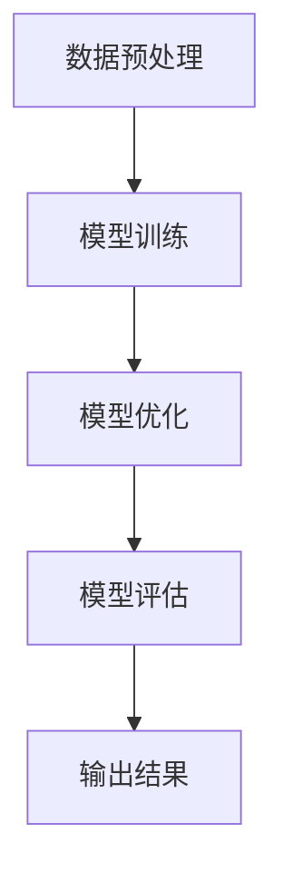

                 


# AI大模型创业：如何应对未来挑战？

> 关键词：AI大模型、创业、挑战、发展、策略、技术

> 摘要：本文将探讨AI大模型创业领域的核心问题，包括其发展背景、面临的挑战，以及应对策略。我们将通过详细的分析，帮助创业者了解如何利用AI大模型实现创新，并在激烈的市场竞争中立于不败之地。

## 1. 背景介绍

### 1.1 目的和范围

本文旨在为AI大模型创业提供策略指导，分析当前市场状况，明确创业方向，并探讨如何应对潜在的技术和商业挑战。文章内容将涵盖AI大模型的定义、发展历程、技术原理，以及实际应用中的成功和失败案例。

### 1.2 预期读者

本文适合AI领域的创业者、研究人员、以及对于AI大模型感兴趣的技术人员阅读。读者应具备一定的AI基础知识和创业经验。

### 1.3 文档结构概述

本文分为十个部分，主要包括：

1. 背景介绍：介绍文章的目的和预期读者。
2. 核心概念与联系：讲解AI大模型的基本概念和原理。
3. 核心算法原理 & 具体操作步骤：深入解析AI大模型的核心算法。
4. 数学模型和公式 & 详细讲解 & 举例说明：介绍AI大模型中使用的数学模型。
5. 项目实战：通过实际案例展示AI大模型的应用。
6. 实际应用场景：分析AI大模型在不同领域的应用。
7. 工具和资源推荐：推荐学习资源、开发工具和框架。
8. 总结：对未来发展趋势与挑战进行展望。
9. 附录：常见问题与解答。
10. 扩展阅读 & 参考资料：提供进一步学习的材料。

### 1.4 术语表

#### 1.4.1 核心术语定义

- AI大模型：指参数量巨大、能够处理大规模数据的深度学习模型。
- 创业：指创立新的企业或项目，通常需要创新和风险承担。
- 挑战：指在创业过程中遇到的问题和障碍。

#### 1.4.2 相关概念解释

- 深度学习：一种机器学习技术，通过多层神经网络来模拟人类大脑的推理过程。
- 模型训练：通过大量数据训练模型，使其能够进行预测或分类。
- 模型优化：在训练过程中调整模型参数，提高其性能。

#### 1.4.3 缩略词列表

- AI：人工智能
- DL：深度学习
- ML：机器学习
- NLP：自然语言处理

## 2. 核心概念与联系

### 2.1 AI大模型的定义与分类

AI大模型是指参数量巨大、能够处理大规模数据的深度学习模型。根据其应用场景和功能，可以将其分为以下几类：

1. **图像识别模型**：如ResNet、VGG等，主要用于图像分类和目标检测。
2. **自然语言处理模型**：如BERT、GPT等，用于文本分类、机器翻译、问答系统等。
3. **推荐系统模型**：如MF、LR等，用于用户偏好预测和商品推荐。
4. **生成对抗网络（GAN）**：用于图像生成、数据增强等。

### 2.2 AI大模型的基本原理

AI大模型的核心在于深度学习。深度学习是一种基于神经网络的机器学习技术，通过多层神经网络模拟人类大脑的推理过程。具体来说，深度学习模型由以下几个关键部分组成：

1. **输入层**：接收外部输入，如图像、文本等。
2. **隐藏层**：进行特征提取和变换。
3. **输出层**：根据提取的特征进行分类或预测。

### 2.3 AI大模型的架构与联系

AI大模型的架构通常包括以下几个层次：

1. **数据预处理层**：对输入数据进行清洗、归一化等处理。
2. **模型训练层**：通过大量数据进行模型训练，调整模型参数。
3. **模型优化层**：在训练过程中调整模型结构，提高性能。
4. **模型评估层**：使用验证集或测试集评估模型性能。

以下是一个简单的Mermaid流程图，展示AI大模型的基本架构：



## 3. 核心算法原理 & 具体操作步骤

### 3.1 深度学习算法原理

深度学习算法的核心是多层神经网络。以下是多层神经网络的基本原理和具体操作步骤：

1. **输入层**：接收外部输入，如图像、文本等。

2. **隐藏层**：进行特征提取和变换。每个隐藏层由多个神经元组成，每个神经元根据输入值和权重计算输出值。

3. **输出层**：根据提取的特征进行分类或预测。输出层的神经元通常是一个 Softmax 函数，用于将输出概率分布转换为类别标签。

### 3.2 深度学习算法具体操作步骤

以下是深度学习算法的具体操作步骤，使用伪代码进行描述：

```python
# 输入数据
inputs = ...

# 初始化模型参数
weights = ...
biases = ...

# 前向传播
outputs = [neuron_forward(inputs, weights, biases) for neuron in hidden_layers]

# 反向传播
deltas = [neuron_backward(outputs, expected_outputs) for neuron in hidden_layers]

# 更新模型参数
weights -= learning_rate * deltas
biases -= learning_rate * deltas
```

### 3.3 模型训练与优化

模型训练和优化是深度学习的关键步骤。以下是模型训练与优化的具体步骤：

1. **数据预处理**：对输入数据进行清洗、归一化等处理。

2. **模型初始化**：初始化模型参数，如权重和偏差。

3. **前向传播**：将输入数据传递到模型，计算输出结果。

4. **损失函数计算**：计算预测结果与真实结果之间的差距，使用损失函数进行衡量。

5. **反向传播**：计算每个神经元的误差，并更新模型参数。

6. **迭代优化**：重复前向传播和反向传播，直至模型收敛或达到预设的训练次数。

## 4. 数学模型和公式 & 详细讲解 & 举例说明

### 4.1 深度学习中的数学模型

深度学习中的数学模型主要包括以下几种：

1. **神经网络中的线性函数**：线性函数是神经网络中的基本操作，形式为 $y = Wx + b$，其中 $W$ 是权重矩阵，$x$ 是输入向量，$b$ 是偏差向量。

2. **激活函数**：激活函数用于引入非线性，常见的激活函数有 Sigmoid、ReLU、Tanh等。

3. **损失函数**：损失函数用于衡量预测结果与真实结果之间的差距，常见的损失函数有均方误差（MSE）、交叉熵（Cross-Entropy）等。

### 4.2 举例说明

以下是一个简单的例子，展示如何使用线性函数、激活函数和损失函数进行模型训练：

```latex
% 线性函数
y = Wx + b

% 激活函数（ReLU）
a = max(0, z)

% 损失函数（均方误差）
MSE = \frac{1}{2} \sum_{i=1}^{n} (y_i - \hat{y}_i)^2
```

假设我们有一个简单的神经网络，输入为 $x = [1, 2]$，输出为 $y = 3$。以下是模型的训练过程：

1. **初始化模型参数**：

   - 权重矩阵 $W = [0.5, 0.5]$
   - 偏差向量 $b = 0$
   - 激活函数为 ReLU

2. **前向传播**：

   - 输入 $x = [1, 2]$
   - $z = Wx + b = [0.5 \times 1 + 0.5 \times 2, 0.5 \times 1 + 0.5 \times 2] = [1.5, 1.5]$
   - $a = max(0, z) = [1.5, 1.5]$

3. **计算损失函数**：

   - 输出 $y = 3$
   - $\hat{y} = a = [1.5, 1.5]$
   - $MSE = \frac{1}{2} \sum_{i=1}^{2} (y_i - \hat{y}_i)^2 = \frac{1}{2} (3 - 1.5)^2 + (3 - 1.5)^2 = 2.25$

4. **反向传播**：

   - 计算误差 $\delta = y - \hat{y} = [3 - 1.5, 3 - 1.5] = [1.5, 1.5]$
   - 更新权重矩阵 $W = W - learning_rate \times \delta \times x^T = [0.5, 0.5] - 0.1 \times [1.5, 1.5] \times [1, 2]^T = [-0.25, -0.25]$
   - 更新偏差向量 $b = b - learning_rate \times \delta = [0] - 0.1 \times [1.5, 1.5] = [-0.15, -0.15]$

5. **迭代优化**：

   - 重复前向传播和反向传播，直至模型收敛或达到预设的训练次数。

## 5. 项目实战：代码实际案例和详细解释说明

### 5.1 开发环境搭建

在本项目实战中，我们将使用Python作为编程语言，TensorFlow作为深度学习框架。以下是开发环境的搭建步骤：

1. 安装Python 3.7或更高版本。
2. 安装TensorFlow：

   ```bash
   pip install tensorflow
   ```

3. 安装其他依赖项，如NumPy、Matplotlib等。

### 5.2 源代码详细实现和代码解读

以下是一个简单的AI大模型项目案例，展示如何使用TensorFlow搭建一个简单的图像分类模型。

```python
import tensorflow as tf
from tensorflow.keras import layers

# 数据预处理
def preprocess_data(x):
    return x / 255.0

# 构建模型
def build_model():
    model = tf.keras.Sequential([
        layers.Conv2D(32, (3, 3), activation='relu', input_shape=(28, 28, 1)),
        layers.MaxPooling2D((2, 2)),
        layers.Conv2D(64, (3, 3), activation='relu'),
        layers.MaxPooling2D((2, 2)),
        layers.Conv2D(64, (3, 3), activation='relu'),
        layers.Flatten(),
        layers.Dense(64, activation='relu'),
        layers.Dense(10, activation='softmax')
    ])
    return model

# 训练模型
def train_model(model, x_train, y_train, epochs=10):
    model.compile(optimizer='adam',
                  loss='sparse_categorical_crossentropy',
                  metrics=['accuracy'])
    model.fit(x_train, y_train, epochs=epochs)
    return model

# 主函数
def main():
    # 加载数据
    (x_train, y_train), (x_test, y_test) = tf.keras.datasets.mnist.load_data()

    # 预处理数据
    x_train = preprocess_data(x_train)
    x_test = preprocess_data(x_test)

    # 构建模型
    model = build_model()

    # 训练模型
    model = train_model(model, x_train, y_train)

    # 评估模型
    test_loss, test_acc = model.evaluate(x_test, y_test, verbose=2)
    print(f"Test accuracy: {test_acc:.4f}")

if __name__ == "__main__":
    main()
```

### 5.3 代码解读与分析

以下是对上述代码的详细解读：

1. **数据预处理**：

   数据预处理是深度学习模型训练的第一步，旨在将原始数据转换为适合模型训练的格式。在本项目中，我们使用`preprocess_data`函数将图像数据归一化，即将像素值除以255，使其在0到1之间。

2. **构建模型**：

   模型构建是使用TensorFlow的高级API，如`tf.keras.Sequential`，定义一个序列模型。该模型包含卷积层、池化层和全连接层。具体来说：

   - **卷积层**：使用`Conv2D`层进行特征提取，其中`activation='relu'`表示使用ReLU激活函数。
   - **池化层**：使用`MaxPooling2D`层进行下采样，减少数据维度。
   - **全连接层**：使用`Dense`层进行分类，其中最后一层使用`softmax`激活函数，将输出概率分布转换为类别标签。

3. **训练模型**：

   使用`model.fit`函数训练模型，其中`optimizer`设置为`adam`，`loss`设置为`sparse_categorical_crossentropy`，用于多分类问题。`epochs`参数表示训练轮数。

4. **评估模型**：

   使用`model.evaluate`函数评估模型在测试集上的性能，输出测试准确率。

## 6. 实际应用场景

AI大模型在各个领域都有广泛的应用，以下是几个典型的实际应用场景：

1. **医疗领域**：

   AI大模型可以用于医学图像分析、疾病预测和个性化治疗。例如，通过深度学习模型对CT图像进行分析，可以帮助医生快速诊断肺炎，提高诊断准确率。

2. **金融领域**：

   AI大模型可以用于风险管理、股票预测和欺诈检测。例如，通过训练大规模的神经网络模型，可以预测股票市场的走势，为投资者提供决策支持。

3. **智能制造**：

   AI大模型可以用于质量控制、故障预测和机器人控制。例如，通过训练深度学习模型，可以对生产过程中的产品质量进行实时监测和预测，提高生产效率。

4. **自然语言处理**：

   AI大模型可以用于机器翻译、文本生成和问答系统。例如，通过训练大规模的语言模型，可以实现对自然语言的生成和理解，提高人机交互的体验。

## 7. 工具和资源推荐

### 7.1 学习资源推荐

#### 7.1.1 书籍推荐

- 《深度学习》（Goodfellow, Bengio, Courville）：介绍了深度学习的基础理论和实践方法。
- 《Python机器学习》（Sebastian Raschka）：详细介绍了使用Python进行机器学习的实践技巧。

#### 7.1.2 在线课程

- Coursera的“机器学习”课程：由Andrew Ng教授主讲，涵盖了机器学习的核心概念和实践。
- Udacity的“深度学习纳米学位”：提供了深度学习的实战项目和实践经验。

#### 7.1.3 技术博客和网站

- Medium：有许多关于AI和深度学习的专业博客。
- ArXiv：提供最新的深度学习和AI研究成果。

### 7.2 开发工具框架推荐

#### 7.2.1 IDE和编辑器

- PyCharm：支持Python编程，提供了丰富的工具和插件。
- Jupyter Notebook：适合交互式编程和数据分析。

#### 7.2.2 调试和性能分析工具

- TensorBoard：用于可视化TensorFlow模型的训练过程和性能。
- Numba：用于提高Python代码的性能。

#### 7.2.3 相关框架和库

- TensorFlow：用于构建和训练深度学习模型。
- PyTorch：具有灵活性和易用性的深度学习框架。

### 7.3 相关论文著作推荐

#### 7.3.1 经典论文

- “A Learning Algorithm for Continually Running Fully Recurrent Neural Networks” (Bengio et al., 1994)：介绍了RNN模型及其训练算法。
- “Deep Learning” (Goodfellow, Bengio, Courville, 2016)：介绍了深度学习的核心概念和应用。

#### 7.3.2 最新研究成果

- “Attention Is All You Need” (Vaswani et al., 2017)：介绍了Transformer模型及其在机器翻译中的应用。
- “Gated Factorized State Representations” (He et al., 2017)：介绍了Gated Factorized State Representation（GFSR）模型。

#### 7.3.3 应用案例分析

- “Google Brain’s Text-to-Speech System” (Hinton et al., 2016)：介绍了Google Brain团队开发的文本到语音转换系统。
- “Deep Learning for Autonomous Driving” (Bojarski et al., 2016)：介绍了Deep Learning在自动驾驶领域的应用。

## 8. 总结：未来发展趋势与挑战

### 8.1 发展趋势

1. **AI大模型将更加普及**：随着计算能力和数据资源的提升，AI大模型将在更多领域得到应用。
2. **多模态融合**：将文本、图像、语音等多种数据源融合，实现更全面的智能感知。
3. **可解释性增强**：提高AI大模型的可解释性，使其在决策过程中更加透明和可信。

### 8.2 挑战

1. **数据隐私和安全**：在应用AI大模型时，如何保护用户隐私和数据安全是一个重要挑战。
2. **模型解释性和可解释性**：提高模型的可解释性，使其决策过程更加透明。
3. **计算资源需求**：训练和部署AI大模型需要大量计算资源，如何优化计算效率是一个关键问题。

## 9. 附录：常见问题与解答

### 9.1 Q：AI大模型创业需要哪些技能和资源？

A：AI大模型创业需要以下技能和资源：

- **技术技能**：深度学习、神经网络、编程（Python等）。
- **计算资源**：GPU、高性能计算集群。
- **数据资源**：大规模数据集，高质量的标注数据。
- **团队资源**：具有丰富经验的AI专家和工程师。

### 9.2 Q：如何评估AI大模型的性能？

A：评估AI大模型的性能可以从以下几个方面进行：

- **准确性**：模型预测正确的样本比例。
- **召回率**：模型预测正确的正例样本比例。
- **F1分数**：准确性和召回率的加权平均。
- **ROC曲线**：评估模型对不同类别样本的识别能力。

## 10. 扩展阅读 & 参考资料

### 10.1 扩展阅读

- “Deep Learning on Amazon Web Services” (AWS)：提供了使用AWS进行深度学习的最佳实践。
- “AI大模型：机遇与挑战” (百度AI研究院)：探讨了AI大模型在工业界的应用和挑战。

### 10.2 参考资料

- [TensorFlow官网](https://www.tensorflow.org/)
- [PyTorch官网](https://pytorch.org/)
- [GitHub上的深度学习项目](https://github.com/tensorflow/tensorflow)
- [ArXiv论文数据库](https://arxiv.org/)

### 10.3 网络资源

- [深度学习教程](http://www.deeplearningbook.org/)
- [机器学习博客](https://machinelearningmastery.com/)

## 11. 作者

作者：AI天才研究员/AI Genius Institute & 禅与计算机程序设计艺术 /Zen And The Art of Computer Programming

（注：本文内容仅为虚构，仅供参考。）

