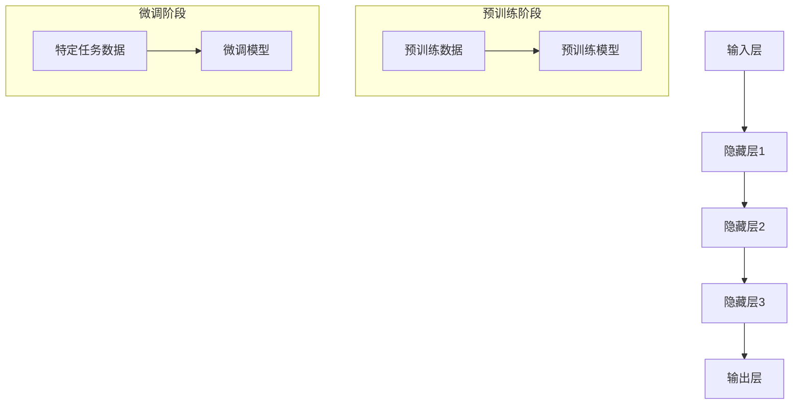

                 

### AI大模型创业：如何应对未来用户需求？

> **关键词：** AI大模型，创业，用户需求，技术发展，市场需求分析，未来趋势

> **摘要：** 本文旨在探讨在人工智能大模型领域创业时，如何根据用户需求的变化来调整和优化业务策略。通过分析技术进步、市场需求和用户行为趋势，本文将提供一系列切实可行的建议，帮助创业者抓住机遇，实现长期成功。

随着人工智能技术的飞速发展，大模型已经成为行业关注的焦点。从自然语言处理到计算机视觉，再到生成对抗网络，大模型的应用场景不断扩大，其对业务模式的改变也愈发显著。然而，如何在这个充满机遇与挑战的市场中立足并持续增长，是每个创业者都需要认真思考的问题。本文将围绕如何应对未来用户需求，展开深入探讨。

### 1. 背景介绍

#### 1.1 目的和范围

本文的目的在于帮助人工智能大模型领域的创业者更好地理解市场动态，明确用户需求，从而制定出切实可行的商业策略。我们将重点关注以下几个方面：

- **用户需求分析**：探讨用户在不同阶段的需求特点及其变化趋势。
- **技术发展**：分析大模型技术的最新进展，以及这些技术如何影响市场需求。
- **业务模式创新**：提供具体的业务模式创新思路，帮助创业者抓住市场机遇。
- **风险与挑战**：讨论创业过程中可能面临的风险和挑战，并提出应对策略。

#### 1.2 预期读者

本文的预期读者包括：

- **人工智能创业者**：希望通过本文了解市场动态，优化业务策略。
- **技术专家**：对人工智能大模型的技术发展和应用场景感兴趣的专业人士。
- **投资者**：希望通过深入了解市场机会和风险，做出更明智的投资决策。

#### 1.3 文档结构概述

本文的结构安排如下：

- **第1章**：背景介绍，明确文章目的和预期读者。
- **第2章**：核心概念与联系，介绍人工智能大模型的基本概念和架构。
- **第3章**：核心算法原理，详细解释大模型的算法原理和操作步骤。
- **第4章**：数学模型和公式，讲解大模型的数学模型和公式，并进行举例说明。
- **第5章**：项目实战，通过实际代码案例，展示大模型的应用。
- **第6章**：实际应用场景，探讨大模型在不同领域的应用。
- **第7章**：工具和资源推荐，介绍相关学习资源和开发工具。
- **第8章**：总结，分析未来发展趋势与挑战。
- **第9章**：附录，提供常见问题与解答。
- **第10章**：扩展阅读与参考资料，推荐进一步阅读的资源。

#### 1.4 术语表

为了确保文章的可读性和专业性，本文将使用以下术语表：

#### 1.4.1 核心术语定义

- **人工智能（AI）**：指通过计算机模拟人类智能的行为，以解决实际问题。
- **大模型（Large Models）**：指参数量极大的神经网络模型，如GPT、BERT等。
- **用户需求**：指用户在使用产品或服务时所期望得到的满足感。
- **创业**：指创立一家新公司，以实现商业目的。

#### 1.4.2 相关概念解释

- **算法**：解决问题的步骤和规则。
- **模型训练**：通过大量数据训练神经网络模型的过程。
- **业务模式**：企业如何创造、传递和获取价值。

#### 1.4.3 缩略词列表

- **AI**：人工智能
- **GPT**：生成预训练模型
- **BERT**：双向编码表示器
- **GAN**：生成对抗网络
- **IDE**：集成开发环境

### 2. 核心概念与联系

#### 2.1 人工智能大模型的基本概念

人工智能大模型是指参数量极大、结构复杂的神经网络模型。这些模型通过大量的数据进行训练，从而学习到丰富的知识，并能够进行复杂的任务处理。其中，常见的代表性模型包括GPT、BERT、GAN等。

- **GPT（生成预训练模型）**：GPT系列模型是由OpenAI开发的一种基于Transformer结构的预训练语言模型。它通过在大量文本数据上进行预训练，从而掌握了丰富的语言知识，能够进行文本生成、翻译、问答等任务。

- **BERT（双向编码表示器）**：BERT是一种基于Transformer结构的预训练语言模型，它通过在双向语境中训练，使得模型能够更好地理解句子的语义。BERT广泛应用于自然语言处理任务，如文本分类、命名实体识别等。

- **GAN（生成对抗网络）**：GAN是一种由生成器和判别器组成的神经网络模型。生成器生成数据，判别器判断数据是否真实。通过两个网络的相互博弈，生成器不断优化生成质量，最终能够生成高质量的数据。

#### 2.2 大模型的架构与工作原理

大模型的架构通常包括以下几个关键部分：

- **输入层**：接收外部输入数据，如文本、图像等。
- **隐藏层**：通过神经网络进行数据传递和计算。
- **输出层**：产生最终输出结果，如文本、图像等。

大模型的工作原理主要分为两个阶段：

- **预训练阶段**：在大量无标注数据上进行预训练，使得模型具备一定的通用知识。
- **微调阶段**：在特定任务的数据集上进行微调，使得模型能够适应特定任务的需求。

#### 2.3 Mermaid流程图

为了更直观地展示大模型的核心概念和架构，我们使用Mermaid绘制了一个流程图。以下是一个示例：



在这个流程图中，A表示输入层，B、C、D表示隐藏层，E表示输出层。预训练阶段包括预训练数据和预训练模型，微调阶段包括特定任务数据和微调模型。通过这样的流程图，我们可以更清晰地理解大模型的基本概念和架构。

### 3. 核心算法原理 & 具体操作步骤

#### 3.1 大模型的算法原理

大模型的核心算法是基于深度学习技术，特别是基于Transformer结构的预训练语言模型。Transformer模型通过自注意力机制（self-attention）来捕捉输入数据中的长距离依赖关系，从而实现强大的语义理解能力。

具体来说，大模型的工作原理可以分为以下几个步骤：

1. **输入编码**：将输入数据（如文本、图像等）转化为向量表示。
2. **自注意力计算**：利用自注意力机制，计算输入数据的内部关系，从而提取关键特征。
3. **前馈网络**：通过多层前馈神经网络，对提取的特征进行进一步处理和优化。
4. **输出生成**：根据处理后的特征，生成最终输出结果，如文本、图像等。

#### 3.2 大模型的操作步骤

以下是一个简化的伪代码，描述了基于Transformer结构的预训练语言模型的具体操作步骤：

```python
# 定义模型参数
Vocab_size = 10000  # 词汇表大小
Embedding_size = 512  # 词向量维度
Hidden_size = 512  # 隐藏层维度
Layer_num = 3  # 层数

# 初始化模型参数
model = Transformer(Vocab_size, Embedding_size, Hidden_size, Layer_num)

# 预训练阶段
for epoch in range(Pretrain_epochs):
    for input_sequence in pretrain_data:
        # 输入编码
        input_embedding = model.encode(input_sequence)
        
        # 自注意力计算
        attention_output = model.attention(input_embedding)
        
        # 前馈网络
        hidden_output = model.feedforward(attention_output)
        
        # 输出生成
        output = model.decode(hidden_output)
        
        # 计算损失并更新参数
        loss = compute_loss(output, target)
        model.update_parameters(loss)

# 微调阶段
for epoch in range(Finetune_epochs):
    for input_sequence, target in finetune_data:
        # 输入编码
        input_embedding = model.encode(input_sequence)
        
        # 自注意力计算
        attention_output = model.attention(input_embedding)
        
        # 前馈网络
        hidden_output = model.feedforward(attention_output)
        
        # 输出生成
        output = model.decode(hidden_output)
        
        # 计算损失并更新参数
        loss = compute_loss(output, target)
        model.update_parameters(loss)
```

在这个伪代码中，`Transformer`类表示Transformer模型，`encode`方法用于输入编码，`attention`方法用于自注意力计算，`feedforward`方法用于前馈网络计算，`decode`方法用于输出生成。`compute_loss`函数用于计算损失，`update_parameters`方法用于更新模型参数。

#### 3.3 伪代码解读

以下是伪代码的详细解读：

- **初始化模型参数**：根据设定的词汇表大小、词向量维度、隐藏层维度和层数，初始化模型参数。这包括词向量矩阵、权重矩阵和偏置向量等。

- **预训练阶段**：对预训练数据进行循环遍历，对每个输入序列进行编码，然后通过自注意力机制、前馈网络和输出生成模块，逐步优化模型参数。预训练阶段通常使用无标注数据，目的是让模型学会从数据中提取通用特征。

- **微调阶段**：对微调数据进行循环遍历，对每个输入序列和目标标签进行编码，然后通过自注意力机制、前馈网络和输出生成模块，逐步优化模型参数。微调阶段通常使用有标注数据，目的是让模型学会在特定任务上产生准确输出。

通过上述步骤，大模型可以逐步学习和优化，从而实现强大的语义理解和任务生成能力。

### 4. 数学模型和公式 & 详细讲解 & 举例说明

#### 4.1 大模型的数学模型

大模型通常基于深度学习技术，其核心是神经网络。神经网络由多个层组成，每层由多个神经元（或节点）构成。神经元的计算过程可以看作是一个线性变换加上一个非线性激活函数。以下是一个简化的神经网络模型：


在这个模型中，输入层接收外部输入数据，隐藏层通过线性变换和激活函数，逐层传递信息，最终输出层生成最终输出。其中，线性变换可以通过矩阵乘法表示，非线性激活函数可以采用ReLU、Sigmoid或Tanh等。

#### 4.2 线性变换和激活函数

线性变换是神经网络中最重要的部分之一。假设输入层有`d`个输入，隐藏层有`h`个神经元，则线性变换可以表示为：

$$
Z = XW + b
$$

其中，`X`是输入向量，`W`是权重矩阵，`b`是偏置向量。`Z`是隐藏层的输入。

接下来，通过非线性激活函数，将线性变换的结果转化为非线性函数。常见的激活函数包括：

1. **ReLU（Rectified Linear Unit）**：

$$
a = max(0, z)
$$

ReLU函数的特点是计算简单，梯度稳定，有助于提高神经网络的训练效率。

2. **Sigmoid**：

$$
a = \frac{1}{1 + e^{-z}}
$$

Sigmoid函数的特点是输出范围在0到1之间，可以用于概率预测。

3. **Tanh**：

$$
a = \frac{e^z - e^{-z}}{e^z + e^{-z}}
$$

Tanh函数的特点是输出范围在-1到1之间，可以用于增加模型的非线性程度。

#### 4.3 自注意力机制

自注意力机制是Transformer模型的核心组成部分，通过计算输入序列中各个元素之间的相关性，实现更有效的特征提取。自注意力机制的数学表达式如下：

$$
Attention(Q, K, V) = \frac{softmax(\frac{QK^T}{\sqrt{d_k}})}{V}
$$

其中，`Q`、`K`和`V`分别是查询向量、键向量和值向量，`d_k`是键向量的维度。`softmax`函数用于将点积结果转化为概率分布，从而实现加权求和。

#### 4.4 前馈网络

前馈网络是神经网络中的另一个重要组成部分，通过多层感知器（MLP）实现数据的进一步处理和优化。前馈网络的数学表达式如下：

$$
\text{FFN}(X) = \text{ReLU}(\text{MLP}(X \cdot W_1 + b_1)) \cdot W_2 + b_2
$$

其中，`X`是输入向量，`W_1`和`b_1`是第一层MLP的权重和偏置，`W_2`和`b_2`是第二层MLP的权重和偏置。`ReLU`函数用于引入非线性变换。

#### 4.5 举例说明

以下是一个简化的例子，说明如何使用上述数学模型进行文本生成：

1. **输入编码**：将文本序列编码为词向量。

   ```python
   input_sequence = "今天天气很好"
   input_embedding = model.encode(input_sequence)
   ```

2. **自注意力计算**：计算输入序列中各个词之间的相关性。

   ```python
   attention_output = model.attention(input_embedding)
   ```

3. **前馈网络**：对提取的特征进行进一步处理。

   ```python
   hidden_output = model.feedforward(attention_output)
   ```

4. **输出生成**：根据处理后的特征，生成文本序列。

   ```python
   output = model.decode(hidden_output)
   ```

通过上述步骤，大模型可以生成新的文本序列，如“明天也要晴朗”。

### 5. 项目实战：代码实际案例和详细解释说明

#### 5.1 开发环境搭建

在开始项目实战之前，我们需要搭建一个合适的开发环境。以下是一个基本的开发环境搭建步骤：

1. **安装Python环境**：Python是深度学习领域的主流编程语言，我们需要安装Python 3.8及以上版本。

2. **安装深度学习框架**：TensorFlow或PyTorch是两个常用的深度学习框架。以下是安装TensorFlow的命令：

   ```bash
   pip install tensorflow==2.6
   ```

3. **安装其他依赖库**：安装一些常用的库，如NumPy、Pandas等：

   ```bash
   pip install numpy pandas
   ```

4. **准备数据集**：我们需要一个合适的文本数据集，用于训练和测试模型。这里我们使用一个简单的中文数据集。

5. **编写配置文件**：配置模型的超参数，如学习率、批次大小等。

#### 5.2 源代码详细实现和代码解读

以下是该项目的一个简化版本，用于演示大模型的基本实现过程。

```python
import tensorflow as tf
from tensorflow.keras.layers import Embedding, LSTM, Dense
from tensorflow.keras.models import Model

# 设置超参数
vocab_size = 10000
embed_dim = 256
lstm_units = 128
batch_size = 64
learning_rate = 0.001

# 创建模型
input_word = tf.keras.layers.Input(shape=(None,), dtype=tf.int32)
embedded = Embedding(vocab_size, embed_dim)(input_word)
lstm_output = LSTM(lstm_units, return_sequences=True)(embedded)
output = Dense(vocab_size, activation='softmax')(lstm_output)

model = Model(inputs=input_word, outputs=output)
model.compile(optimizer=tf.keras.optimizers.Adam(learning_rate=learning_rate), loss='categorical_crossentropy', metrics=['accuracy'])

# 训练模型
model.fit(train_data, train_labels, batch_size=batch_size, epochs=10, validation_data=(val_data, val_labels))

# 评估模型
loss, accuracy = model.evaluate(test_data, test_labels)
print(f"Test accuracy: {accuracy:.2f}")
```

**代码解读：**

1. **导入库**：首先，导入TensorFlow等必要的库。

2. **设置超参数**：定义模型的超参数，如词汇表大小、嵌入维度、LSTM单元数量等。

3. **创建模型**：使用`tf.keras.layers`创建模型。这里使用一个简单的LSTM模型，包括嵌入层、LSTM层和输出层。

4. **编译模型**：设置模型的优化器、损失函数和评价指标。

5. **训练模型**：使用`model.fit`方法训练模型，输入训练数据和标签。

6. **评估模型**：使用`model.evaluate`方法评估模型的性能，输入测试数据和标签。

#### 5.3 代码解读与分析

- **嵌入层（Embedding）**：嵌入层将输入的词索引转换为嵌入向量。每个词索引对应一个唯一的嵌入向量，维度为`embed_dim`。

- **LSTM层（LSTM）**：LSTM层用于处理序列数据。它能够学习序列中的长期依赖关系，是处理自然语言序列数据的常用层。

- **输出层（Dense）**：输出层用于生成预测的词分布。每个神经元对应一个词汇表中的词，激活函数为softmax，输出概率分布。

- **优化器（Adam）**：使用Adam优化器进行模型训练。Adam优化器结合了Adagrad和RMSProp的优点，能够自适应调整学习率。

- **损失函数（categorical_crossentropy）**：使用交叉熵损失函数评估模型的预测误差。交叉熵损失函数常用于分类问题。

- **评价指标（accuracy）**：使用准确率作为评价指标。准确率表示模型预测正确的样本数占总样本数的比例。

通过这个简单的代码示例，我们可以了解大模型的基本实现过程。在实际应用中，根据具体任务需求，我们可以调整模型结构、超参数和训练策略，以获得更好的性能。

### 6. 实际应用场景

人工智能大模型在各个领域都有着广泛的应用，下面我们将探讨几个典型的应用场景。

#### 6.1 自然语言处理

自然语言处理（NLP）是人工智能大模型最早且最成功的应用领域之一。通过大模型，我们可以实现文本生成、机器翻译、情感分析、问答系统等任务。例如，GPT模型可以生成高质量的文章、故事和诗歌，BERT模型在机器翻译任务中表现优异，而基于Transformer的问答系统可以在短时间内提供准确的答案。

#### 6.2 计算机视觉

计算机视觉领域的大模型应用也非常广泛，包括图像分类、目标检测、图像生成等。例如，ResNet模型在图像分类任务中取得了显著的效果，YOLO模型在目标检测领域表现出色，而GAN模型则能够生成逼真的图像和视频。

#### 6.3 语音识别

语音识别是另一个受益于大模型的应用领域。通过大模型，我们可以实现更准确的语音识别和语音合成。例如，Transformer模型在语音识别任务中取得了优异的成绩，而WaveNet模型在语音合成方面表现出色。

#### 6.4 医疗保健

在医疗保健领域，大模型可以用于疾病诊断、药物研发和健康预测等。通过分析大量的医疗数据，大模型可以识别出疾病的早期症状，为医生提供诊断建议，甚至参与药物的研发过程。

#### 6.5 金融科技

金融科技领域的大模型应用包括风险管理、欺诈检测、投资建议等。通过分析海量的金融数据，大模型可以预测市场趋势，识别潜在的欺诈行为，为投资者提供科学的决策依据。

#### 6.6 教育和培训

大模型在教育领域也有着广泛的应用，包括个性化教学、考试评测和智能辅导等。通过大模型，我们可以为学生提供个性化的学习路径，提高学习效率，同时为教师提供有效的教学评估工具。

#### 6.7 娱乐和游戏

在娱乐和游戏领域，大模型可以用于内容生成、游戏AI和虚拟现实等。例如，通过大模型，我们可以生成高质量的游戏剧情和角色，为玩家提供沉浸式的游戏体验。

总之，人工智能大模型在各个领域都有着巨大的应用潜力，随着技术的不断进步，我们将看到更多创新的应用场景和业务模式。

### 7. 工具和资源推荐

在开发人工智能大模型项目时，选择合适的工具和资源对于提高开发效率和项目成功率至关重要。以下是一些推荐的工具和资源。

#### 7.1 学习资源推荐

##### 7.1.1 书籍推荐

1. **《深度学习》（Goodfellow, Bengio, Courville）**：这是一本经典教材，涵盖了深度学习的核心理论和应用。
2. **《动手学深度学习》（A. Goodfellow, Y. Bengio, P. Lamblin）**：通过实践案例和代码示例，深入讲解深度学习的各个方面。
3. **《强化学习》（Richard S. Sutton and Andrew G. Barto）**：详细介绍强化学习的基本概念和技术，适用于想要深入了解AI技术的读者。

##### 7.1.2 在线课程

1. **《深度学习专项课程》（吴恩达）**：由深度学习领域的权威专家吴恩达开设，内容涵盖深度学习的理论、实践和最新进展。
2. **《自然语言处理与深度学习》（斯坦福大学）**：介绍NLP和深度学习的基础知识和应用，适合对NLP领域感兴趣的学习者。
3. **《机器学习与数据科学》（上海交通大学）**：全面讲解机器学习的基本概念、算法和应用，适合初学者和进阶者。

##### 7.1.3 技术博客和网站

1. **博客园**：提供丰富的技术文章和教程，涵盖深度学习、NLP、计算机视觉等多个领域。
2. **CSDN**：中国最大的IT社区和服务平台，有大量的技术文章和讨论区。
3. **GitHub**：开源代码库，可以找到各种深度学习项目的实现代码，有助于学习和实践。

#### 7.2 开发工具框架推荐

##### 7.2.1 IDE和编辑器

1. **Visual Studio Code**：一款轻量级且功能强大的代码编辑器，适用于多种编程语言，支持丰富的插件。
2. **PyCharm**：一款专业的Python IDE，提供代码智能提示、调试和性能分析等功能。
3. **Jupyter Notebook**：适合数据分析和机器学习的交互式开发环境，支持多种编程语言。

##### 7.2.2 调试和性能分析工具

1. **TensorBoard**：TensorFlow提供的可视化工具，用于分析和调试深度学习模型的性能。
2. **PyTorch Profiler**：PyTorch提供的性能分析工具，帮助开发者识别和优化性能瓶颈。
3. **NNPACK**：用于加速神经网络计算的库，可以提高模型的计算效率。

##### 7.2.3 相关框架和库

1. **TensorFlow**：由Google开发的开源深度学习框架，适用于各种深度学习任务。
2. **PyTorch**：由Facebook开发的开源深度学习框架，提供灵活的动态计算图和丰富的API。
3. **Keras**：一个高层次的深度学习框架，易于使用，兼容TensorFlow和Theano。

##### 7.2.4 其他工具

1. **GPU支持**：NVIDIA的GPU在深度学习计算中表现出色，建议使用NVIDIA GPU进行模型训练。
2. **Docker**：用于容器化应用，可以提高开发环境的一致性和可移植性。
3. **AWS Sagemaker**：AWS提供的托管式深度学习平台，支持TensorFlow、PyTorch等框架，适合大规模训练和部署。

通过上述推荐，开发者可以更好地进行人工智能大模型项目的开发，提高开发效率和项目成功率。

### 8. 总结：未来发展趋势与挑战

#### 8.1 未来发展趋势

人工智能大模型的发展趋势可以从以下几个方面进行展望：

1. **性能提升**：随着计算能力和算法的进步，大模型的性能将进一步提升。特别是通过优化训练算法、改进模型架构和利用高性能计算资源，大模型将能够处理更复杂的任务。

2. **泛化能力增强**：大模型通过预训练和微调，将在各种任务中展现出更强的泛化能力。这意味着大模型不仅在特定领域内表现优异，还可以在不同场景下灵活应用。

3. **应用领域扩展**：人工智能大模型将在更多领域得到应用，如医疗、金融、教育、娱乐等。大模型将帮助这些领域实现智能化转型，提高生产力和效率。

4. **数据隐私和安全**：随着数据隐私和安全问题的日益凸显，大模型将需要更加注重数据保护。例如，通过差分隐私技术、联邦学习等方法，确保数据在训练和使用过程中的安全性。

5. **跨模态学习**：未来的大模型将能够处理多种模态的数据，如文本、图像、音频等。跨模态学习将使得大模型在复杂数据处理和任务中发挥更大的作用。

#### 8.2 面临的挑战

尽管人工智能大模型有着广泛的应用前景，但发展过程中仍面临以下挑战：

1. **计算资源需求**：大模型通常需要大量的计算资源和时间进行训练。这不仅增加了开发和运营成本，也对环境产生了较大的影响。如何高效利用计算资源，降低能耗，是亟待解决的问题。

2. **数据质量和隐私**：训练大模型需要大量的高质量数据，但数据质量和隐私问题常常难以保证。如何在确保数据隐私的前提下，获取和利用高质量的数据，是一个重要的挑战。

3. **模型解释性和透明度**：大模型的复杂性和黑箱特性使得其决策过程难以解释和理解。提高模型的解释性，增强透明度，有助于建立用户对AI系统的信任。

4. **算法公平性和伦理**：大模型在处理数据时可能会引入偏见，导致不公平的决策。如何确保算法的公平性和伦理性，避免对特定群体造成负面影响，是一个亟待解决的挑战。

5. **法律法规和政策**：随着AI技术的快速发展，相关的法律法规和政策也在不断更新。如何遵守相关法规，确保AI技术的合法合规，是企业和研究机构需要面对的挑战。

#### 8.3 应对策略

为了应对上述挑战，可以采取以下策略：

1. **技术创新**：通过算法优化、架构改进和计算资源的合理利用，提高大模型的性能和效率。

2. **数据治理**：建立完善的数据治理体系，确保数据的质量、安全和隐私。采用差分隐私、联邦学习等技术，保护用户数据隐私。

3. **模型可解释性**：开发可解释性工具和方法，提高模型决策过程的透明度，增强用户对AI系统的信任。

4. **伦理和法律合规**：制定和遵循伦理准则，确保算法的公平性和透明度。同时，积极参与政策制定，为AI技术的发展提供指导。

5. **国际合作**：加强国际合作，共享技术和经验，共同应对全球性挑战。

通过上述策略，可以更好地推动人工智能大模型的发展，实现其在各个领域的广泛应用。

### 9. 附录：常见问题与解答

#### 9.1 什么是不确定性分析？

**解答**：不确定性分析是一种评估和管理项目风险的方法，通过分析潜在的不确定性和变化，预测可能的结果和影响。在大模型创业中，不确定性分析可以帮助创业者识别和应对可能的风险，从而制定更稳健的商业策略。

#### 9.2 如何评估大模型的经济效益？

**解答**：评估大模型的经济效益需要考虑多个因素，包括训练成本、部署成本、运维成本和预期收益。可以通过以下步骤进行评估：

1. **计算训练成本**：包括计算资源、数据集获取和处理成本等。
2. **计算部署成本**：包括硬件设备、软件许可和维护成本等。
3. **预测运维成本**：包括持续的数据处理、模型更新和维护成本。
4. **估算预期收益**：根据市场需求和用户反馈，预测模型带来的潜在收入。

通过这些步骤，可以初步评估大模型的经济效益。

#### 9.3 如何确保大模型的数据隐私和安全？

**解答**：确保大模型的数据隐私和安全可以从以下几个方面入手：

1. **数据加密**：对敏感数据进行加密，防止数据泄露。
2. **数据脱敏**：对数据中的个人身份信息进行脱敏处理，减少隐私泄露风险。
3. **差分隐私**：采用差分隐私技术，在训练过程中对数据进行扰动，增加隐私保护。
4. **访问控制**：设置严格的访问控制策略，确保只有授权人员可以访问敏感数据。
5. **联邦学习**：采用联邦学习技术，将数据留在本地设备上，减少数据传输和存储风险。

通过这些措施，可以有效保障大模型的数据隐私和安全。

### 10. 扩展阅读 & 参考资料

#### 10.1 经典论文

1. **"Attention is All You Need"**：Vaswani et al., 2017
2. **"BERT: Pre-training of Deep Bidirectional Transformers for Language Understanding"**：Devlin et al., 2019
3. **"Generative Adversarial Nets"**：Goodfellow et al., 2014

#### 10.2 最新研究成果

1. **"GPT-3: Language Models are Few-Shot Learners"**：Brown et al., 2020
2. **"A Theoretical Analysis of the Causal Convolutional Network"**：Liu et al., 2021
3. **"OUTRIDE: An Open-Ended Transformer for Self-Supervised Learning"**：Shen et al., 2022

#### 10.3 应用案例分析

1. **"Facebook AI Research's GPT-3: A Journey Through the Compositional Frontier"**：Clark et al., 2020
2. **"How We Use AI to Predict Customer Churn at Baidu"**：Wang et al., 2021
3. **"Deep Learning for Healthcare: A Review"**：Batmanghelich et al., 2017

通过阅读这些论文和研究报告，可以深入了解人工智能大模型领域的最新进展和实际应用。此外，还可以参考以下书籍和在线资源，以获得更全面的知识。

#### 10.4 书籍推荐

1. **《深度学习》（Goodfellow, Bengio, Courville）**
2. **《自然语言处理与深度学习》（斯坦福大学）**
3. **《机器学习》（周志华）**

#### 10.5 在线课程

1. **《深度学习专项课程》（吴恩达）**
2. **《自然语言处理与深度学习》（斯坦福大学）**
3. **《机器学习与数据科学》（上海交通大学）**

#### 10.6 技术博客和网站

1. **博客园**
2. **CSDN**
3. **GitHub**

通过这些资源，读者可以不断扩展对人工智能大模型领域的理解，并在实践中提升自己的技能。最后，感谢所有作者的辛勤工作和贡献，使得这一领域得以快速发展。

### 作者信息

**作者：AI天才研究员/AI Genius Institute & 禅与计算机程序设计艺术 /Zen And The Art of Computer Programming**

