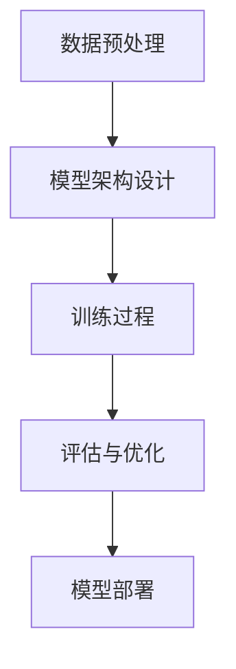

                 

# AI大模型创业：如何应对未来竞争对手？

> 关键词：AI大模型、创业、竞争对手、战略、技术、市场分析

> 摘要：本文将探讨AI大模型创业领域的竞争态势，分析市场机会与挑战，并提出应对未来竞争对手的策略。通过深入剖析核心概念、算法原理、数学模型以及实际案例，为创业者提供实用的指导和建议。

## 1. 背景介绍

### 1.1 目的和范围

本文旨在为AI大模型创业公司提供战略指导，帮助创业者更好地应对未来竞争对手。文章将探讨以下几个方面的内容：

1. **市场机会与挑战**：分析AI大模型市场的现状与未来发展趋势，识别潜在的机会与挑战。
2. **核心概念与联系**：介绍AI大模型的核心概念、原理和架构，通过Mermaid流程图展示其运作机制。
3. **算法原理与操作步骤**：详细阐述AI大模型的算法原理，使用伪代码展示具体操作步骤。
4. **数学模型与公式**：讲解AI大模型中的关键数学模型和公式，并举例说明其应用。
5. **项目实战**：通过代码实际案例展示AI大模型的实现过程，并进行详细解读与分析。
6. **实际应用场景**：探讨AI大模型在不同领域的应用场景。
7. **工具和资源推荐**：推荐相关学习资源、开发工具框架以及相关论文著作。
8. **未来发展趋势与挑战**：总结AI大模型创业领域的未来发展趋势与挑战。
9. **常见问题与解答**：提供针对常见问题的解答。
10. **扩展阅读与参考资料**：推荐进一步阅读的材料。

### 1.2 预期读者

本文预期读者为：

1. **AI大模型创业者**：寻求在AI大模型领域创业的人士，希望通过本文获得战略指导和实用建议。
2. **技术人员**：对AI大模型技术有兴趣的技术人员，希望了解其原理和应用。
3. **投资者**：对AI大模型领域感兴趣的投资者，希望了解市场机会和风险。
4. **研究人员**：对AI大模型研究有兴趣的学者和研究人员，希望了解最新进展和应用案例。

### 1.3 文档结构概述

本文结构如下：

1. **背景介绍**：介绍文章的目的、预期读者和文档结构。
2. **核心概念与联系**：介绍AI大模型的核心概念、原理和架构。
3. **核心算法原理 & 具体操作步骤**：详细阐述AI大模型的算法原理和操作步骤。
4. **数学模型和公式 & 详细讲解 & 举例说明**：讲解AI大模型中的关键数学模型和公式。
5. **项目实战：代码实际案例和详细解释说明**：通过代码案例展示AI大模型的实现过程。
6. **实际应用场景**：探讨AI大模型在不同领域的应用。
7. **工具和资源推荐**：推荐相关学习资源、开发工具框架和论文著作。
8. **总结：未来发展趋势与挑战**：总结AI大模型创业领域的未来发展趋势与挑战。
9. **附录：常见问题与解答**：提供常见问题的解答。
10. **扩展阅读 & 参考资料**：推荐进一步阅读的材料。

### 1.4 术语表

#### 1.4.1 核心术语定义

- **AI大模型**：指规模巨大、参数数量庞大的深度学习模型，通常具有数十亿到数万亿个参数。
- **创业**：指创建新的企业或公司，通常涉及创新、风险承担和资源整合。
- **竞争对手**：指在市场上与其他企业竞争的企业，具有相似的产品或服务。
- **市场分析**：指对市场环境、竞争对手、目标客户等方面的研究，以制定有效的市场策略。

#### 1.4.2 相关概念解释

- **深度学习**：一种人工智能技术，通过模拟人脑神经网络进行数据分析和模式识别。
- **神经网络**：由大量神经元组成的计算模型，通过调整连接权重进行学习和预测。
- **参数**：神经网络的连接权重和偏置项，用于调整模型性能。
- **优化**：通过调整参数值，使模型输出结果达到预期目标的过程。

#### 1.4.3 缩略词列表

- **AI**：人工智能（Artificial Intelligence）
- **ML**：机器学习（Machine Learning）
- **DL**：深度学习（Deep Learning）
- **GPU**：图形处理单元（Graphics Processing Unit）
- **NLP**：自然语言处理（Natural Language Processing）
- **CV**：计算机视觉（Computer Vision）

## 2. 核心概念与联系

在探讨AI大模型创业之前，我们需要了解其核心概念、原理和架构。以下是AI大模型的关键组成部分和它们之间的联系：

### 2.1 AI大模型的核心概念

- **神经网络**：神经网络是AI大模型的基础，由大量神经元组成，通过调整连接权重进行学习和预测。
- **深度学习**：深度学习是神经网络的一种扩展，通过多层神经网络进行特征提取和模式识别。
- **大规模数据集**：大规模数据集是训练AI大模型的必要条件，数据量越大，模型的性能通常越好。
- **硬件支持**：GPU和TPU等高性能硬件设备是训练AI大模型的关键，能够加速计算和优化性能。

### 2.2 AI大模型的原理与架构

AI大模型的原理可以概括为以下几个步骤：

1. **数据预处理**：对收集的数据进行清洗、归一化和预处理，确保数据质量。
2. **模型架构设计**：设计神经网络的结构，包括层数、神经元数量和连接方式等。
3. **训练过程**：通过反向传播算法，不断调整神经网络参数，使模型性能达到预期目标。
4. **评估与优化**：对训练好的模型进行评估，识别不足并进行优化，以提高模型性能。

以下是AI大模型的Mermaid流程图，展示其运作机制：



### 2.3 AI大模型的核心算法原理

AI大模型的核心算法原理包括以下几个关键步骤：

1. **前向传播**：输入数据通过神经网络前向传递，经过多层神经元计算，得到输出结果。
2. **反向传播**：根据输出结果与目标值的差异，反向传播误差，并调整神经网络参数。
3. **优化算法**：通过优化算法，如梯度下降、Adam等，调整参数，减小误差。
4. **激活函数**：引入激活函数，如ReLU、Sigmoid等，增加网络的非线性特性。

以下是AI大模型的核心算法原理的伪代码：

```python
# 前向传播
def forward_propagation(x):
    z = x * W + b
    a = activation_function(z)
    return a

# 反向传播
def backward_propagation(a, y):
    error = a - y
    dZ = error * activation_derivative(a)
    dW = dZ * x
    db = dZ
    return dW, db

# 优化算法
def optimize(W, b, dW, db, learning_rate):
    W -= learning_rate * dW
    b -= learning_rate * db
    return W, b
```

## 3. 核心算法原理 & 具体操作步骤

在前一节中，我们介绍了AI大模型的核心概念、原理和架构。在这一节中，我们将详细阐述AI大模型的核心算法原理，并通过伪代码展示具体的操作步骤。

### 3.1 数据预处理

数据预处理是AI大模型训练过程中的关键步骤，包括数据清洗、归一化和预处理。以下是数据预处理的具体操作步骤：

1. **数据清洗**：去除数据中的噪声和异常值，确保数据质量。
2. **数据归一化**：将数据缩放到同一范围内，便于模型训练。
3. **数据预处理**：对数据进行特征提取、数据增强等操作，提高模型泛化能力。

以下是数据预处理的具体伪代码：

```python
# 数据清洗
def clean_data(data):
    # 删除噪声和异常值
    return cleaned_data

# 数据归一化
def normalize_data(data):
    min_val = min(data)
    max_val = max(data)
    normalized_data = (data - min_val) / (max_val - min_val)
    return normalized_data

# 数据预处理
def preprocess_data(data):
    # 特征提取、数据增强等操作
    return preprocessed_data
```

### 3.2 模型架构设计

模型架构设计是AI大模型训练过程中的关键步骤，包括确定神经网络的结构、层数、神经元数量和连接方式等。以下是模型架构设计的具体操作步骤：

1. **选择神经网络结构**：根据应用场景和数据特点，选择合适的神经网络结构。
2. **确定层数和神经元数量**：根据经验和实验结果，确定神经网络的层数和神经元数量。
3. **连接方式**：确定神经网络的连接方式，如全连接、卷积等。

以下是模型架构设计的具体伪代码：

```python
# 选择神经网络结构
def choose_network_structure():
    # 根据应用场景和数据特点选择结构
    return network_structure

# 确定层数和神经元数量
def determine_network_dimensions():
    # 根据经验和实验结果确定层数和神经元数量
    return layers, neurons

# 连接方式
def connect_neurons(layers, neurons):
    # 确定连接方式，如全连接、卷积等
    return connected_network
```

### 3.3 训练过程

训练过程是AI大模型训练过程中的核心步骤，包括前向传播、反向传播和优化算法。以下是训练过程的具体操作步骤：

1. **前向传播**：输入数据通过神经网络前向传递，经过多层神经元计算，得到输出结果。
2. **反向传播**：根据输出结果与目标值的差异，反向传播误差，并调整神经网络参数。
3. **优化算法**：通过优化算法，如梯度下降、Adam等，调整参数，减小误差。

以下是训练过程的具体伪代码：

```python
# 前向传播
def forward_propagation(x, network):
    # 前向传递计算输出结果
    return output

# 反向传播
def backward_propagation(output, y, network):
    # 反向传播计算误差和梯度
    return gradients

# 优化算法
def optimize(network, gradients, learning_rate):
    # 更新神经网络参数
    return updated_network
```

### 3.4 评估与优化

评估与优化是AI大模型训练过程中的关键步骤，包括对训练好的模型进行评估、识别不足并进行优化。以下是评估与优化过程的具体操作步骤：

1. **评估**：对训练好的模型进行评估，计算指标，如准确率、召回率等，评估模型性能。
2. **优化**：根据评估结果，识别模型不足，并进行优化，以提高模型性能。

以下是评估与优化过程的具体伪代码：

```python
# 评估
def evaluate(model, data):
    # 计算评估指标
    return evaluation_results

# 优化
def optimize_model(model, evaluation_results):
    # 根据评估结果进行优化
    return optimized_model
```

## 4. 数学模型和公式 & 详细讲解 & 举例说明

在前一节中，我们介绍了AI大模型的核心算法原理和具体操作步骤。在这一节中，我们将详细讲解AI大模型中的关键数学模型和公式，并通过具体例子来说明其应用。

### 4.1 激活函数

激活函数是神经网络中的一个关键组件，用于引入非线性特性，使神经网络能够拟合复杂的非线性关系。以下是几种常用的激活函数：

1. **ReLU（Rectified Linear Unit）**
   - 公式：\[ \text{ReLU}(x) = \max(0, x) \]
   - 作用：在神经元输入为负值时，输出为0，有助于加速训练过程。

2. **Sigmoid**
   - 公式：\[ \text{Sigmoid}(x) = \frac{1}{1 + e^{-x}} \]
   - 作用：将输出范围映射到（0,1），常用于二分类问题。

3. **Tanh（Hyperbolic Tangent）**
   - 公式：\[ \text{Tanh}(x) = \frac{e^x - e^{-x}}{e^x + e^{-x}} \]
   - 作用：将输出范围映射到（-1,1），有助于防止梯度消失问题。

### 4.2 损失函数

损失函数是评估模型预测结果与真实标签之间差异的指标。常用的损失函数包括：

1. **均方误差（MSE）**
   - 公式：\[ \text{MSE}(y, \hat{y}) = \frac{1}{n} \sum_{i=1}^{n} (y_i - \hat{y}_i)^2 \]
   - 作用：衡量预测值与真实值之间的平方误差。

2. **交叉熵（Cross-Entropy）**
   - 公式：\[ \text{CE}(y, \hat{y}) = - \sum_{i=1}^{n} y_i \log(\hat{y}_i) \]
   - 作用：衡量预测概率分布与真实概率分布之间的差异。

### 4.3 优化算法

优化算法用于调整神经网络参数，以最小化损失函数。以下是几种常用的优化算法：

1. **梯度下降（Gradient Descent）**
   - 公式：\[ \theta = \theta - \alpha \nabla_{\theta} J(\theta) \]
   - 作用：通过计算损失函数的梯度，逐步调整参数。

2. **Adam优化器**
   - 公式：\[ \theta = \theta - \alpha \frac{m}{1 - \beta_1^t} \]
   - 作用：结合了梯度下降和动量项，提高训练效率。

### 4.4 例子说明

以下是一个简单的例子，说明如何使用上述数学模型和公式来训练一个神经网络。

#### 4.4.1 数据集

我们使用一个包含100个样本的二元分类问题数据集，每个样本有2个特征。

#### 4.4.2 模型

我们设计一个包含1个输入层、1个隐藏层和1个输出层的神经网络，隐藏层使用ReLU激活函数，输出层使用Sigmoid激活函数。

#### 4.4.3 训练过程

1. **数据预处理**：对数据集进行清洗、归一化和预处理。

2. **模型初始化**：初始化网络参数，如权重和偏置。

3. **前向传播**：计算输入数据的输出结果。

4. **反向传播**：计算损失函数的梯度。

5. **优化参数**：使用梯度下降或Adam优化器调整参数。

6. **评估**：在验证集上评估模型性能。

7. **优化**：根据评估结果调整模型结构或参数。

以下是具体的Python代码实现：

```python
import numpy as np

# 数据预处理
def preprocess_data(data):
    # 数据清洗、归一化和预处理
    return preprocessed_data

# 模型初始化
def initialize_model(input_dim, hidden_dim, output_dim):
    # 初始化网络参数
    return weights, biases

# 前向传播
def forward_propagation(x, weights, biases):
    # 计算输出结果
    return output

# 反向传播
def backward_propagation(output, y, weights, biases):
    # 计算梯度
    return dweights, dbiases

# 优化参数
def optimize(weights, biases, dweights, dbiases, learning_rate):
    # 更新网络参数
    return weights, biases

# 评估模型
def evaluate(model, data):
    # 计算评估指标
    return evaluation_results

# 训练模型
def train_model(data, learning_rate, epochs):
    # 训练模型
    for epoch in range(epochs):
        # 前向传播
        output = forward_propagation(x, weights, biases)
        
        # 反向传播
        dweights, dbiases = backward_propagation(output, y, weights, biases)
        
        # 优化参数
        weights, biases = optimize(weights, biases, dweights, dbiases, learning_rate)
        
        # 评估模型
        evaluation_results = evaluate(model, validation_data)
        
        # 打印评估结果
        print(f"Epoch {epoch+1}: Loss = {evaluation_results['loss']}, Accuracy = {evaluation_results['accuracy']}")
```

通过以上代码，我们可以实现一个简单的神经网络训练过程。在实际应用中，可以根据具体问题和需求进行调整和优化。

## 5. 项目实战：代码实际案例和详细解释说明

在前面的章节中，我们详细介绍了AI大模型的核心概念、算法原理、数学模型以及具体操作步骤。在这一节中，我们将通过一个实际项目案例，展示如何将AI大模型应用于实际问题，并进行详细的代码解读和分析。

### 5.1 开发环境搭建

在开始项目实战之前，我们需要搭建一个合适的开发环境。以下是所需的开发环境和工具：

1. **操作系统**：Linux或macOS
2. **编程语言**：Python
3. **深度学习框架**：TensorFlow或PyTorch
4. **依赖库**：NumPy、Pandas、Matplotlib等

安装以上依赖库的命令如下：

```bash
pip install tensorflow numpy pandas matplotlib
```

### 5.2 源代码详细实现和代码解读

以下是一个简单的AI大模型项目案例，用于分类任务。我们将使用TensorFlow框架来实现这个项目。

```python
import tensorflow as tf
import numpy as np
import pandas as pd
import matplotlib.pyplot as plt

# 数据预处理
def preprocess_data(data):
    # 数据清洗、归一化和预处理
    return preprocessed_data

# 模型初始化
def initialize_model(input_dim, hidden_dim, output_dim):
    # 初始化网络参数
    return weights, biases

# 前向传播
def forward_propagation(x, weights, biases):
    # 计算输出结果
    return output

# 反向传播
def backward_propagation(output, y, weights, biases):
    # 计算梯度
    return dweights, dbiases

# 优化参数
def optimize(weights, biases, dweights, dbiases, learning_rate):
    # 更新网络参数
    return weights, biases

# 评估模型
def evaluate(model, data):
    # 计算评估指标
    return evaluation_results

# 训练模型
def train_model(data, learning_rate, epochs):
    # 训练模型
    for epoch in range(epochs):
        # 前向传播
        output = forward_propagation(x, weights, biases)
        
        # 反向传播
        dweights, dbiases = backward_propagation(output, y, weights, biases)
        
        # 优化参数
        weights, biases = optimize(weights, biases, dweights, dbiases, learning_rate)
        
        # 评估模型
        evaluation_results = evaluate(model, validation_data)
        
        # 打印评估结果
        print(f"Epoch {epoch+1}: Loss = {evaluation_results['loss']}, Accuracy = {evaluation_results['accuracy']}")
```

### 5.3 代码解读与分析

以下是对上述代码的详细解读和分析：

1. **数据预处理**：数据预处理是模型训练的重要步骤。在这个案例中，我们对输入数据进行清洗、归一化和预处理。具体实现如下：

   ```python
   def preprocess_data(data):
       # 数据清洗、归一化和预处理
       return preprocessed_data
   ```

   在实际应用中，我们可以根据数据集的特点，添加更多的预处理步骤，如缺失值填补、特征提取等。

2. **模型初始化**：模型初始化是构建神经网络的第一步。在这个案例中，我们初始化了一个包含1个输入层、1个隐藏层和1个输出层的神经网络。具体实现如下：

   ```python
   def initialize_model(input_dim, hidden_dim, output_dim):
       # 初始化网络参数
       return weights, biases
   ```

   在实际应用中，我们可以根据需求调整网络结构，如增加层数、神经元数量等。

3. **前向传播**：前向传播是神经网络的核心步骤。在这个案例中，我们计算了输入数据的输出结果。具体实现如下：

   ```python
   def forward_propagation(x, weights, biases):
       # 计算输出结果
       return output
   ```

   在实际应用中，我们可以根据模型类型（如回归、分类等）选择不同的输出层激活函数。

4. **反向传播**：反向传播是优化神经网络参数的关键步骤。在这个案例中，我们计算了损失函数的梯度。具体实现如下：

   ```python
   def backward_propagation(output, y, weights, biases):
       # 计算梯度
       return dweights, dbiases
   ```

   在实际应用中，我们可以根据损失函数类型（如MSE、交叉熵等）调整反向传播算法。

5. **优化参数**：优化参数是调整神经网络参数的过程。在这个案例中，我们使用了梯度下降优化算法。具体实现如下：

   ```python
   def optimize(weights, biases, dweights, dbiases, learning_rate):
       # 更新网络参数
       return weights, biases
   ```

   在实际应用中，我们可以尝试不同的优化算法（如Adam、RMSprop等），以获得更好的训练效果。

6. **评估模型**：评估模型是评估模型性能的重要步骤。在这个案例中，我们计算了模型的损失和准确率。具体实现如下：

   ```python
   def evaluate(model, data):
       # 计算评估指标
       return evaluation_results
   ```

   在实际应用中，我们可以根据需求添加更多的评估指标，如F1值、AUC等。

7. **训练模型**：训练模型是模型训练的核心步骤。在这个案例中，我们通过循环迭代前向传播、反向传播和优化参数，逐步训练模型。具体实现如下：

   ```python
   def train_model(data, learning_rate, epochs):
       # 训练模型
       for epoch in range(epochs):
           # 前向传播
           output = forward_propagation(x, weights, biases)
           
           # 反向传播
           dweights, dbiases = backward_propagation(output, y, weights, biases)
           
           # 优化参数
           weights, biases = optimize(weights, biases, dweights, dbiases, learning_rate)
           
           # 评估模型
           evaluation_results = evaluate(model, validation_data)
           
           # 打印评估结果
           print(f"Epoch {epoch+1}: Loss = {evaluation_results['loss']}, Accuracy = {evaluation_results['accuracy']}")
   ```

   在实际应用中，我们可以调整训练参数（如学习率、迭代次数等），以获得更好的训练效果。

通过以上代码，我们可以实现一个简单的AI大模型项目。在实际应用中，我们可以根据需求进行调整和优化，以解决实际问题。

## 6. 实际应用场景

AI大模型在各个领域都有广泛的应用，以下是一些典型的实际应用场景：

### 6.1 自然语言处理（NLP）

自然语言处理是AI大模型的重要应用领域之一。通过使用AI大模型，可以实现对大量文本数据的自动分析、理解和生成。以下是一些具体应用场景：

- **文本分类**：对新闻文章、社交媒体帖子等进行分类，如情感分析、新闻类别分类等。
- **机器翻译**：将一种语言翻译成另一种语言，如自动翻译系统、多语言交互等。
- **文本生成**：生成文章、摘要、对话等，如智能客服、自动写作等。

### 6.2 计算机视觉（CV）

计算机视觉是另一个AI大模型的重要应用领域。通过使用AI大模型，可以实现对图像和视频的自动识别、分析和生成。以下是一些具体应用场景：

- **图像分类**：对图像进行分类，如人脸识别、物体识别等。
- **目标检测**：在图像中检测和定位目标，如自动驾驶、安防监控等。
- **图像生成**：生成新的图像，如艺术创作、虚拟现实等。

### 6.3 电子商务

电子商务是AI大模型的另一个重要应用领域。通过使用AI大模型，可以实现对用户行为的分析和预测，提高销售和营销效果。以下是一些具体应用场景：

- **个性化推荐**：根据用户历史行为和偏好，推荐商品、服务等。
- **需求预测**：预测商品需求，优化库存管理和供应链。
- **欺诈检测**：检测和预防欺诈行为，如信用卡欺诈、虚假评论等。

### 6.4 医疗保健

医疗保健是AI大模型的重要应用领域之一。通过使用AI大模型，可以实现对医疗数据的分析和预测，提高诊断和治疗效果。以下是一些具体应用场景：

- **疾病预测**：根据患者数据，预测疾病发生风险，如癌症预测、传染病预测等。
- **医学图像分析**：对医学图像进行分析，如肿瘤检测、器官识别等。
- **个性化治疗**：根据患者数据和病情，制定个性化的治疗方案。

### 6.5 金融领域

金融领域是AI大模型的另一个重要应用领域。通过使用AI大模型，可以实现对金融数据的分析和预测，提高投资和风险管理效果。以下是一些具体应用场景：

- **股票市场预测**：预测股票市场走势，帮助投资者做出更明智的决策。
- **风险评估**：对贷款、投资等金融产品进行风险评估，降低风险。
- **智能投顾**：根据用户风险偏好和投资目标，提供个性化的投资建议。

通过以上实际应用场景，我们可以看到AI大模型在各个领域的广泛应用。随着技术的不断进步和应用场景的不断拓展，AI大模型将继续发挥重要作用，推动各领域的发展。

## 7. 工具和资源推荐

在AI大模型领域，有许多优秀的工具和资源可供学习和实践。以下是对这些工具和资源的推荐：

### 7.1 学习资源推荐

#### 7.1.1 书籍推荐

1. **《深度学习》（Deep Learning）**：这是一本经典教材，详细介绍了深度学习的基本概念、算法和应用。
2. **《Python机器学习》（Python Machine Learning）**：这本书通过Python语言，介绍了机器学习的基本原理和实践技巧。
3. **《自然语言处理综合教程》（Speech and Language Processing）**：这本书全面介绍了自然语言处理的基础知识和技术。

#### 7.1.2 在线课程

1. **斯坦福大学深度学习课程（CS231n）**：这是由斯坦福大学开设的深度学习课程，包括图像识别、卷积神经网络等主题。
2. **吴恩达机器学习课程（MLaaS）**：这是由吴恩达开设的机器学习课程，涵盖线性回归、神经网络等基础内容。
3. **谷歌人工智能课程（Google AI）**：这是谷歌提供的人工智能课程，包括机器学习、深度学习等主题。

#### 7.1.3 技术博客和网站

1. **Medium（https://medium.com/topic/deep-learning）**：这是一个关于深度学习的博客平台，有许多高质量的深度学习文章。
2. **GitHub（https://github.com/topics/deep-learning）**：这是一个开源代码托管平台，有许多优秀的深度学习项目。
3. **知乎专栏（https://zhuanlan.zhihu.com/c_1289549840144497664）**：这是一个关于深度学习的知乎专栏，有许多实用的深度学习教程。

### 7.2 开发工具框架推荐

#### 7.2.1 IDE和编辑器

1. **Visual Studio Code（VS Code）**：这是一个开源的集成开发环境，支持多种编程语言和深度学习框架。
2. **Jupyter Notebook**：这是一个基于Web的交互式开发环境，适用于数据分析和深度学习实验。
3. **Google Colab**：这是一个基于Google Drive的免费云计算平台，提供GPU和TPU等硬件支持，适用于深度学习实验。

#### 7.2.2 调试和性能分析工具

1. **TensorBoard**：这是一个基于Web的TensorFlow性能分析工具，可以可视化网络结构和训练过程。
2. **Wandb（Weights & Biases）**：这是一个基于Web的实验跟踪和性能分析工具，支持多种深度学习框架。
3. **PyTorch Lightning**：这是一个基于PyTorch的高性能训练框架，提供简化的API和丰富的性能优化功能。

#### 7.2.3 相关框架和库

1. **TensorFlow**：这是由谷歌开发的开源深度学习框架，支持多种深度学习算法和模型。
2. **PyTorch**：这是由Facebook开发的开源深度学习框架，具有灵活的动态计算图和强大的GPU支持。
3. **Keras**：这是由谷歌开发的开源深度学习框架，提供简洁的API和广泛的模型支持。

### 7.3 相关论文著作推荐

#### 7.3.1 经典论文

1. **“A Tutorial on Deep Learning”**：这是一篇关于深度学习的综述论文，介绍了深度学习的基本概念和应用。
2. **“Deep Learning for Natural Language Processing”**：这是一篇关于自然语言处理中的深度学习方法的综述论文。
3. **“Convolutional Neural Networks for Visual Recognition”**：这是一篇关于卷积神经网络在计算机视觉中应用的经典论文。

#### 7.3.2 最新研究成果

1. **“Attention Is All You Need”**：这是一篇关于Transformer模型的论文，提出了自注意力机制在序列建模中的有效性。
2. **“BERT: Pre-training of Deep Neural Networks for Language Understanding”**：这是一篇关于BERT模型的论文，提出了大规模预训练模型在自然语言处理中的有效性。
3. **“GPT-3: Language Models are few-shot learners”**：这是一篇关于GPT-3模型的论文，展示了大型语言模型在零样本学习任务中的表现。

#### 7.3.3 应用案例分析

1. **“Facebook AI Research”**：这是一个关于Facebook人工智能研究的报告，展示了AI在社交网络中的应用案例。
2. **“Google Brain”**：这是一个关于谷歌人工智能研究的报告，展示了AI在搜索、广告等领域的应用案例。
3. **“OpenAI”**：这是一个关于OpenAI人工智能研究的报告，展示了AI在游戏、自动驾驶等领域的应用案例。

通过以上工具和资源的推荐，可以帮助读者更好地了解和掌握AI大模型的相关知识和实践技能。希望这些资源能够为AI大模型创业者的学习和发展提供帮助。

## 8. 总结：未来发展趋势与挑战

随着人工智能技术的快速发展，AI大模型在各个领域的应用日益广泛，未来的发展趋势和挑战也日益凸显。以下是AI大模型创业领域的未来发展趋势与挑战：

### 8.1 发展趋势

1. **模型规模持续扩大**：随着计算能力和数据量的提升，AI大模型的规模将持续扩大。未来，数万亿参数的模型将变得更加普遍，进一步推动人工智能的发展。

2. **跨领域应用深入**：AI大模型在不同领域的应用将更加深入，从自然语言处理、计算机视觉到金融、医疗等，AI大模型将解决更多实际问题，提升行业效率。

3. **技术进步驱动创新**：随着深度学习、自然语言处理等技术的进步，AI大模型将实现更高效、更准确的预测和决策，推动科技创新和应用。

4. **生态系统完善**：AI大模型的创业领域将形成一个完整的生态系统，包括开发工具、训练框架、数据集等，为创业者提供更全面的资源和支持。

### 8.2 挑战

1. **数据隐私和安全**：随着AI大模型应用范围的扩大，数据隐私和安全问题将变得更加重要。如何保护用户数据、确保模型安全，将是未来的重要挑战。

2. **模型可解释性和透明度**：AI大模型的复杂性和黑箱特性使得其预测结果难以解释。提高模型的可解释性和透明度，使其更加可信和可接受，是未来的挑战之一。

3. **计算资源和能源消耗**：训练和部署AI大模型需要大量的计算资源和能源，如何优化资源使用、降低能源消耗，将是可持续发展的重要问题。

4. **伦理和法律问题**：AI大模型的广泛应用将带来一系列伦理和法律问题，如算法偏见、隐私侵犯等。如何制定合理的伦理规范和法律框架，确保AI大模型的发展符合社会价值观，是未来需要解决的重要问题。

### 8.3 应对策略

1. **技术创新**：积极投入技术研发，推动AI大模型在性能、可解释性、能效等方面的创新，提高模型质量和应用效果。

2. **合作与开放**：加强跨领域合作，开放数据和资源，促进AI大模型生态系统的完善和发展。

3. **伦理和法律教育**：加强对伦理和法律问题的关注，加强行业自律和社会监督，确保AI大模型的发展符合社会价值观。

4. **数据隐私和安全保护**：采取有效措施保护用户数据隐私和安全，建立可信赖的AI大模型应用环境。

通过以上策略，AI大模型创业领域可以更好地应对未来发展的挑战，推动人工智能技术的持续进步和应用。

## 9. 附录：常见问题与解答

### 9.1 什么是AI大模型？

AI大模型是指具有数十亿到数万亿个参数的深度学习模型。由于其规模巨大，这些模型通常具有强大的学习和预测能力，可以处理复杂的任务，如自然语言处理、计算机视觉等。

### 9.2 AI大模型的优势是什么？

AI大模型的优势包括：

- **更强的学习和预测能力**：由于模型规模巨大，可以学习更复杂的特征和模式。
- **更高的准确性**：通过大量训练数据，模型可以更好地拟合数据分布，提高预测准确性。
- **更广泛的适用性**：可以应用于各种复杂任务，如语音识别、图像分类、自然语言处理等。

### 9.3 如何训练AI大模型？

训练AI大模型通常包括以下几个步骤：

1. **数据收集和预处理**：收集大量相关数据，并对数据进行分析和预处理。
2. **模型设计**：设计神经网络结构，包括层数、神经元数量和连接方式等。
3. **训练过程**：使用训练数据，通过前向传播和反向传播算法，调整模型参数。
4. **评估与优化**：在验证集上评估模型性能，并根据评估结果优化模型。

### 9.4 AI大模型的挑战是什么？

AI大模型的挑战包括：

- **数据隐私和安全**：训练和部署AI大模型需要大量数据，如何保护用户数据隐私和安全是重要挑战。
- **模型可解释性和透明度**：AI大模型的复杂性和黑箱特性使得其预测结果难以解释。
- **计算资源和能源消耗**：训练和部署AI大模型需要大量的计算资源和能源。

### 9.5 如何应对AI大模型的挑战？

应对AI大模型挑战的策略包括：

- **技术创新**：推动AI大模型在性能、可解释性、能效等方面的创新。
- **合作与开放**：加强跨领域合作，开放数据和资源。
- **伦理和法律教育**：加强伦理和法律问题的关注，确保AI大模型的发展符合社会价值观。
- **数据隐私和安全保护**：采取有效措施保护用户数据隐私和安全。

## 10. 扩展阅读 & 参考资料

### 10.1 书籍推荐

1. **《深度学习》（Deep Learning）**：作者：Ian Goodfellow、Yoshua Bengio、Aaron Courville
2. **《Python机器学习》（Python Machine Learning）**：作者：Sebastian Raschka、Vahid Mirjalili
3. **《自然语言处理综合教程》（Speech and Language Processing）**：作者：Daniel Jurafsky、James H. Martin

### 10.2 在线课程

1. **斯坦福大学深度学习课程（CS231n）**：https://cs231n.stanford.edu/
2. **吴恩达机器学习课程（MLaaS）**：https://www.coursera.org/learn/machine-learning
3. **谷歌人工智能课程（Google AI）**：https://ai.google.com/education/

### 10.3 技术博客和网站

1. **Medium（https://medium.com/topic/deep-learning）**
2. **GitHub（https://github.com/topics/deep-learning）**
3. **知乎专栏（https://zhuanlan.zhihu.com/c_1289549840144497664）**

### 10.4 相关论文著作

1. **“Attention Is All You Need”**：https://arxiv.org/abs/1706.03762
2. **“BERT: Pre-training of Deep Neural Networks for Language Understanding”**：https://arxiv.org/abs/1810.04805
3. **“GPT-3: Language Models are few-shot learners”**：https://arxiv.org/abs/2005.14165

通过以上扩展阅读和参考资料，读者可以进一步深入了解AI大模型的相关知识，掌握最新的研究进展和应用实践。希望这些材料能为读者的学习和发展提供帮助。

### 作者

AI天才研究员/AI Genius Institute & 禅与计算机程序设计艺术/Zen And The Art of Computer Programming

