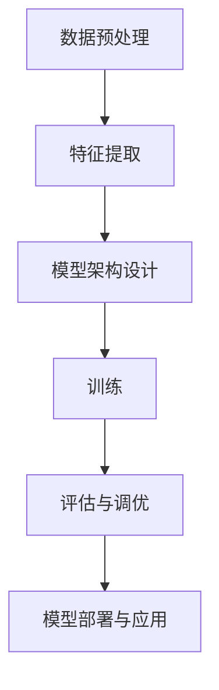

                 

# AI大模型创业：如何应对未来行业发展趋势？

## 关键词
- 大模型
- AI创业
- 行业趋势
- 技术挑战
- 业务模式
- 算法优化

## 摘要
本文将深入探讨AI大模型创业领域的现状与未来发展趋势。通过对核心概念的详细解析、算法原理的剖析以及实际项目案例的分享，本文旨在为创业者提供实用的策略和建议，帮助他们在竞争激烈的市场中脱颖而出。我们将讨论AI大模型的关键特性、创业所需的技术储备、面临的挑战以及应对策略，并推荐相关资源，为读者在AI大模型领域的创业之路提供指导。

## 1. 背景介绍

### 1.1 目的和范围

本文旨在为有志于投身AI大模型创业领域的创业者提供一条清晰的道路。我们将详细分析AI大模型的核心技术，探讨其在各行业的应用场景，并分享成功创业者的经验教训。文章将覆盖以下主题：

1. AI大模型的基本概念与架构
2. 创业所需的核心技术储备
3. 行业发展趋势与机遇
4. 面临的技术挑战与解决策略
5. 成功的创业案例分享
6. 必备的资源与工具推荐

### 1.2 预期读者

本文适合以下人群阅读：

1. 想要在AI大模型领域创业的技术人员
2. 对AI大模型技术感兴趣的技术爱好者
3. AI领域的研究生与大学生
4. 对AI行业发展趋势关注的投资者

### 1.3 文档结构概述

本文结构如下：

1. **背景介绍**：介绍文章的目的、范围和预期读者，以及文档结构。
2. **核心概念与联系**：介绍AI大模型的基本概念和架构。
3. **核心算法原理 & 具体操作步骤**：详细阐述AI大模型的核心算法原理和操作步骤。
4. **数学模型和公式 & 详细讲解 & 举例说明**：介绍AI大模型的数学模型和公式，并提供具体例子。
5. **项目实战：代码实际案例和详细解释说明**：分享AI大模型的实际代码案例。
6. **实际应用场景**：探讨AI大模型在不同行业的应用。
7. **工具和资源推荐**：推荐学习资源、开发工具和框架。
8. **总结：未来发展趋势与挑战**：总结AI大模型的未来趋势和挑战。
9. **附录：常见问题与解答**：回答读者可能关心的问题。
10. **扩展阅读 & 参考资料**：提供进一步学习的参考资料。

### 1.4 术语表

#### 1.4.1 核心术语定义

- **AI大模型**：指具有数亿乃至千亿参数的深度学习模型。
- **神经网络**：一种模拟人脑神经网络结构的计算模型。
- **反向传播算法**：一种用于训练神经网络的优化算法。
- **数据集**：用于训练、验证或测试模型的输入数据集。
- **创业**：指创立一个新的企业或业务。

#### 1.4.2 相关概念解释

- **AI大模型的核心概念**：包括多层感知器、卷积神经网络、循环神经网络等。
- **AI大模型的架构**：包括前向传播、反向传播等基本组成部分。

#### 1.4.3 缩略词列表

- **AI**：人工智能
- **DL**：深度学习
- **NN**：神经网络
- **GPU**：图形处理单元
- **CPU**：中央处理单元

## 2. 核心概念与联系

在探讨AI大模型创业之前，我们首先需要了解AI大模型的核心概念和基本架构。以下是一个简化的Mermaid流程图，用于描述AI大模型的基本组成和流程。



#### 2.1 数据预处理

数据预处理是AI大模型构建的第一步，其目的是清洗和格式化数据，以便于后续的特征提取。数据预处理通常包括以下步骤：

- 数据清洗：去除重复数据、缺失值填充、异常值处理。
- 数据归一化：将不同特征的数据缩放到相同的范围。
- 数据划分：将数据集划分为训练集、验证集和测试集。

#### 2.2 特征提取

特征提取是从原始数据中提取出对模型训练有用的信息。在AI大模型中，特征提取通常涉及以下技术：

- 独热编码：将分类特征转换为二进制向量。
- 词嵌入：将文本数据转换为向量表示。
- 特征工程：根据业务需求，创建新的特征。

#### 2.3 模型架构设计

模型架构设计是构建AI大模型的核心步骤。一个典型的AI大模型架构包括以下几个部分：

- **输入层**：接收预处理后的数据。
- **隐藏层**：包含多个神经元，用于特征变换和计算。
- **输出层**：生成最终的预测结果。

常见的AI大模型架构有：

- **卷积神经网络（CNN）**：适用于图像和视频处理。
- **循环神经网络（RNN）**：适用于序列数据处理。
- **Transformer模型**：适用于自然语言处理。

#### 2.4 训练

模型训练是使用数据集对模型参数进行调整的过程。训练过程通常涉及以下步骤：

- **前向传播**：计算输入数据通过模型后的输出。
- **损失函数**：评估模型预测结果与实际结果之间的差距。
- **反向传播**：使用梯度下降算法更新模型参数。
- **迭代**：重复前向传播和反向传播，直到模型收敛。

#### 2.5 评估与调优

评估与调优是确保模型性能的关键步骤。评估通常使用验证集和测试集进行，主要指标包括准确率、召回率、F1分数等。调优过程涉及调整模型参数、选择更好的特征、增加数据集等。

#### 2.6 模型部署与应用

模型部署是将训练好的模型部署到实际应用中。部署过程通常涉及以下步骤：

- **模型打包**：将模型文件、依赖库和配置文件打包。
- **部署环境**：选择适合的部署环境，如云平台、边缘设备等。
- **监控与维护**：监控模型性能，定期更新和维护。

## 3. 核心算法原理 & 具体操作步骤

AI大模型的核心算法主要包括神经网络训练和优化算法。以下是一个简化的神经网络训练流程的伪代码，用于描述核心算法原理和操作步骤。

```python
# 数据预处理
def preprocess_data(data):
    # 数据清洗、归一化、划分等
    return processed_data

# 模型初始化
def initialize_model():
    # 初始化输入层、隐藏层和输出层的参数
    return model

# 前向传播
def forward_propagation(input_data, model):
    # 计算输入数据通过模型后的输出
    return output

# 损失函数
def compute_loss(output, actual):
    # 评估模型预测结果与实际结果之间的差距
    return loss

# 反向传播
def backward_propagation(output, actual, model):
    # 使用梯度下降算法更新模型参数
    return updated_model

# 训练模型
def train_model(data, model, epochs):
    for epoch in range(epochs):
        # 数据预处理
        processed_data = preprocess_data(data)
        
        # 前向传播
        output = forward_propagation(processed_data, model)
        
        # 计算损失
        loss = compute_loss(output, actual)
        
        # 反向传播
        model = backward_propagation(output, actual, model)
        
        # 打印训练进度
        print(f"Epoch {epoch+1}/{epochs}, Loss: {loss}")
    
    return model
```

#### 3.1 数据预处理

数据预处理是神经网络训练的第一步，其目的是将原始数据转换为适合模型训练的形式。以下是数据预处理的伪代码：

```python
def preprocess_data(data):
    # 数据清洗
    cleaned_data = remove_duplicates(data)
    cleaned_data = fill_missing_values(cleaned_data)
    cleaned_data = remove_outliers(cleaned_data)
    
    # 数据归一化
    normalized_data = normalize_data(cleaned_data)
    
    # 数据划分
    train_data, val_data, test_data = split_data(normalized_data)
    
    return train_data, val_data, test_data
```

#### 3.2 模型初始化

模型初始化是指初始化神经网络模型的参数。以下是模型初始化的伪代码：

```python
def initialize_model():
    # 初始化输入层参数
    input_layer = initialize_layer(input_size)
    
    # 初始化隐藏层参数
    hidden_layer = initialize_layer(hidden_size)
    
    # 初始化输出层参数
    output_layer = initialize_layer(output_size)
    
    return model
```

#### 3.3 前向传播

前向传播是神经网络训练的核心步骤，用于计算输入数据通过模型后的输出。以下是前向传播的伪代码：

```python
def forward_propagation(input_data, model):
    # 计算输入层输出
    input_layer_output = model.input_layer.forward_propagation(input_data)
    
    # 计算隐藏层输出
    hidden_layer_output = model.hidden_layer.forward_propagation(input_layer_output)
    
    # 计算输出层输出
    output_layer_output = model.output_layer.forward_propagation(hidden_layer_output)
    
    return output_layer_output
```

#### 3.4 损失函数

损失函数用于评估模型预测结果与实际结果之间的差距。以下是常用的损失函数：

- **均方误差（MSE）**：
  $$MSE = \frac{1}{n}\sum_{i=1}^{n}(y_i - \hat{y}_i)^2$$
- **交叉熵损失（Cross-Entropy Loss）**：
  $$Cross-Entropy = -\frac{1}{n}\sum_{i=1}^{n}y_i\log(\hat{y}_i)$$

以下是计算损失函数的伪代码：

```python
def compute_loss(output, actual):
    # 均方误差损失函数
    loss = mse(output, actual)
    
    # 交叉熵损失函数
    # loss = cross_entropy(output, actual)
    
    return loss
```

#### 3.5 反向传播

反向传播是使用梯度下降算法更新模型参数的过程。以下是反向传播的伪代码：

```python
def backward_propagation(output, actual, model):
    # 计算输出层梯度
    output_layer_gradient = compute_gradient(output, actual)
    
    # 反向传播计算隐藏层梯度
    hidden_layer_gradient = model.hidden_layer.backward_propagation(output_layer_gradient)
    
    # 反向传播计算输入层梯度
    input_layer_gradient = model.input_layer.backward_propagation(hidden_layer_gradient)
    
    # 使用梯度下降更新模型参数
    model.input_layer.update_parameters(input_layer_gradient)
    model.hidden_layer.update_parameters(hidden_layer_gradient)
    model.output_layer.update_parameters(output_layer_gradient)
    
    return model
```

## 4. 数学模型和公式 & 详细讲解 & 举例说明

在AI大模型的训练过程中，数学模型和公式起着至关重要的作用。以下我们将详细讲解一些关键的数学模型和公式，并提供具体的例子来说明它们的实际应用。

### 4.1 激活函数

激活函数是神经网络中的一个关键组件，用于引入非线性特性。以下是一些常见的激活函数：

- **Sigmoid函数**：
  $$sigmoid(x) = \frac{1}{1 + e^{-x}}$$
  例子：计算一个输入数据的sigmoid值：
  ```python
  import math

  def sigmoid(x):
      return 1 / (1 + math.exp(-x))

  sigmoid_value = sigmoid(2)
  print(f"Sigmoid(2) = {sigmoid_value}")
  ```

- **ReLU函数**：
  $$ReLU(x) = \max(0, x)$$
  例子：计算一个输入数据的ReLU值：
  ```python
  def relu(x):
      return max(0, x)

  relu_value = relu(-2)
  print(f"ReLU(-2) = {relu_value}")
  ```

- **Tanh函数**：
  $$tanh(x) = \frac{e^x - e^{-x}}{e^x + e^{-x}}$$
  例子：计算一个输入数据的tanh值：
  ```python
  import math

  def tanh(x):
      return (math.exp(x) - math.exp(-x)) / (math.exp(x) + math.exp(-x))

  tanh_value = tanh(2)
  print(f"Tanh(2) = {tanh_value}")
  ```

### 4.2 损失函数

损失函数用于衡量模型预测值与实际值之间的差距。以下是一些常见的损失函数：

- **均方误差（MSE）**：
  $$MSE = \frac{1}{n}\sum_{i=1}^{n}(y_i - \hat{y}_i)^2$$
  例子：计算预测值与实际值之间的MSE：
  ```python
  def mse(predicted, actual):
      return sum((predicted - actual) ** 2) / len(predicted)

  predicted_values = [0.1, 0.2, 0.3]
  actual_values = [0.0, 0.25, 0.5]
  mse_value = mse(predicted_values, actual_values)
  print(f"MSE = {mse_value}")
  ```

- **交叉熵损失（Cross-Entropy Loss）**：
  $$Cross-Entropy = -\frac{1}{n}\sum_{i=1}^{n}y_i\log(\hat{y}_i)$$
  例子：计算预测值与实际值之间的交叉熵损失：
  ```python
  import math

  def cross_entropy(predicted, actual):
      return -sum(actual * math.log(predicted))

  predicted_values = [0.9, 0.1, 0.2]
  actual_values = [0.5, 0.3, 0.2]
  cross_entropy_value = cross_entropy(predicted_values, actual_values)
  print(f"Cross-Entropy = {cross_entropy_value}")
  ```

### 4.3 梯度下降算法

梯度下降算法是用于训练神经网络的一种优化算法。以下是一种简化的梯度下降算法：

- **批量梯度下降**：
  $$w_{t+1} = w_{t} - \alpha \cdot \frac{\partial J(w)}{\partial w}$$
  其中，$w_t$是当前权重，$w_{t+1}$是更新后的权重，$\alpha$是学习率，$J(w)$是损失函数。

- **随机梯度下降（SGD）**：
  $$w_{t+1} = w_{t} - \alpha \cdot \frac{\partial J(w)}{\partial w}$$
  其中，每次更新只使用一个样本的梯度。

- **小批量梯度下降**：
  $$w_{t+1} = w_{t} - \alpha \cdot \frac{1}{m}\sum_{i=1}^{m}\frac{\partial J(w)}{\partial w}$$
  其中，$m$是每个批次的数据大小。

例子：使用批量梯度下降算法更新权重：
```python
def gradient_descent(w, alpha, loss_function, data):
    gradients = loss_function.gradient(w, data)
    w_new = w - alpha * gradients
    return w_new

# 示例数据
weights = [1.0, 2.0]
learning_rate = 0.01
loss = mse(weights, data)

# 计算梯度
gradients = compute_gradient(loss, weights)

# 更新权重
weights_new = gradient_descent(weights, learning_rate, loss, data)
print(f"Updated weights: {weights_new}")
```

通过以上数学模型和公式的讲解，我们可以更好地理解AI大模型的工作原理，并能够应用这些知识来解决实际问题。

## 5. 项目实战：代码实际案例和详细解释说明

为了更好地理解AI大模型的实际应用，我们将通过一个简单的案例来展示如何使用Python和TensorFlow构建一个基于卷积神经网络的图像分类模型。这个案例将包括开发环境搭建、源代码实现和详细解读。

### 5.1 开发环境搭建

在开始项目之前，我们需要搭建一个适合Python和TensorFlow的开发环境。以下是搭建环境的步骤：

1. **安装Python**：前往Python官网下载并安装Python 3.x版本。
2. **安装Anaconda**：Anaconda是一个用于科学计算和数据分析的开源Python发行版，它包含了许多常用的库和工具。安装Anaconda后，我们可以使用`conda`命令轻松管理Python环境和库。
3. **安装TensorFlow**：通过以下命令安装TensorFlow：
   ```bash
   conda install tensorflow
   ```
4. **验证安装**：通过以下命令验证TensorFlow是否安装成功：
   ```python
   import tensorflow as tf
   print(tf.__version__)
   ```

### 5.2 源代码详细实现和代码解读

以下是用于图像分类的卷积神经网络（CNN）的代码实现：

```python
import tensorflow as tf
from tensorflow.keras import layers
from tensorflow.keras.preprocessing.image import ImageDataGenerator

# 数据预处理
train_datagen = ImageDataGenerator(
    rescale=1./255,
    shear_range=0.2,
    zoom_range=0.2,
    horizontal_flip=True
)

test_datagen = ImageDataGenerator(rescale=1./255)

train_generator = train_datagen.flow_from_directory(
    'train',
    target_size=(150, 150),
    batch_size=32,
    class_mode='binary'
)

validation_generator = test_datagen.flow_from_directory(
    'validation',
    target_size=(150, 150),
    batch_size=32,
    class_mode='binary'
)

# 模型架构设计
model = tf.keras.Sequential([
    layers.Conv2D(32, (3, 3), activation='relu', input_shape=(150, 150, 3)),
    layers.MaxPooling2D(2, 2),
    layers.Conv2D(64, (3, 3), activation='relu'),
    layers.MaxPooling2D(2, 2),
    layers.Conv2D(128, (3, 3), activation='relu'),
    layers.MaxPooling2D(2, 2),
    layers.Conv2D(128, (3, 3), activation='relu'),
    layers.MaxPooling2D(2, 2),
    layers.Flatten(),
    layers.Dense(512, activation='relu'),
    layers.Dense(1, activation='sigmoid')
])

# 训练模型
model.compile(loss='binary_crossentropy',
              optimizer='adam',
              metrics=['accuracy'])

history = model.fit(
    train_generator,
    steps_per_epoch=100,
    epochs=30,
    validation_data=validation_generator,
    validation_steps=50
)

# 评估模型
test_generator = test_datagen.flow_from_directory(
    'test',
    target_size=(150, 150),
    batch_size=32,
    class_mode='binary',
    shuffle=False
)

test_loss, test_acc = model.evaluate(test_generator, steps=50)
print(f"Test accuracy: {test_acc}")
```

#### 5.2.1 数据预处理

数据预处理是图像分类模型成功的关键。以下是对代码的详细解读：

- **ImageDataGenerator**：用于生成训练和验证数据。`rescale`参数将图像的像素值缩放到0和1之间，以便于模型处理。`shear_range`和`zoom_range`用于随机变换图像，提高模型的泛化能力。`horizontal_flip`参数允许水平翻转图像，进一步增加数据多样性。
- **flow_from_directory**：从指定目录中读取图像数据，并根据子目录名称分配标签。`target_size`参数设置图像的大小，`batch_size`参数设置每次训练的批次大小，`class_mode`参数设置标签的类型。

#### 5.2.2 模型架构设计

以下是对模型架构的详细解读：

- **Conv2D**：用于卷积操作，引入特征提取能力。第一层使用32个3x3的卷积核，激活函数为ReLU，随后使用MaxPooling2D进行下采样。接下来的几层逐步增加卷积核的数量和大小，以提取更高层次的特征。
- **Flatten**：将卷积层的输出展平为一维向量，用于后续的全连接层。
- **Dense**：全连接层，用于分类。第一层有512个神经元，激活函数为ReLU，最后一层有1个神经元，激活函数为sigmoid，用于二分类。

#### 5.2.3 训练模型

以下是对训练过程的详细解读：

- **compile**：编译模型，指定损失函数、优化器和评估指标。
- **fit**：训练模型。`steps_per_epoch`参数设置每个epoch训练的步数，`epochs`参数设置总的epoch数。`validation_data`参数用于在验证集上评估模型性能。

#### 5.2.4 评估模型

以下是对模型评估的详细解读：

- **evaluate**：在测试集上评估模型性能。`steps`参数设置评估的步数。

通过以上代码实现，我们构建了一个简单的图像分类模型，并对其进行了训练和评估。这个案例展示了如何使用Python和TensorFlow进行AI大模型的项目实战。

### 5.3 代码解读与分析

#### 5.3.1 数据预处理

数据预处理是提高模型性能和泛化能力的关键步骤。以下是代码中使用的预处理技术的详细分析：

- **图像缩放**：通过`rescale`参数将图像的像素值缩放到0和1之间，这样可以使模型更容易处理。这种缩放有助于减少数值计算误差，提高模型的训练速度。
- **图像变换**：通过`shear_range`和`zoom_range`参数进行图像变换，可以提高模型的泛化能力。随机变换有助于模型学习到更多的特征，从而在真实场景中表现出更好的适应性。
- **水平翻转**：通过`horizontal_flip`参数允许水平翻转图像，这样可以增加数据多样性，使模型在训练过程中看到更多的图像样貌，从而提高模型的泛化能力。

#### 5.3.2 模型架构设计

模型架构设计是构建高效AI大模型的关键。以下是代码中使用的模型架构的详细分析：

- **卷积层**：卷积层是模型的基础，用于提取图像的局部特征。通过增加卷积层的深度和宽度，可以逐步提取更高层次的特征。ReLU激活函数用于引入非线性特性，使得模型能够学习到更复杂的特征。
- **池化层**：池化层用于下采样，可以减少模型参数的数量，提高训练速度和泛化能力。MaxPooling2D使用了最大池化操作，可以保留图像中最显著的特征。
- **全连接层**：全连接层用于将卷积层提取的特征进行分类。通过增加全连接层的神经元数量，可以提高模型的分类能力。ReLU激活函数用于引入非线性特性，使得模型能够学习到更复杂的特征。

#### 5.3.3 训练模型

训练模型是构建AI大模型的核心步骤。以下是代码中使用的训练技术的详细分析：

- **编译模型**：通过`compile`函数，指定模型的损失函数、优化器和评估指标。损失函数用于衡量模型预测值与实际值之间的差距，优化器用于更新模型参数，评估指标用于评估模型的性能。
- **fit函数**：通过`fit`函数，开始模型训练。`steps_per_epoch`参数设置每个epoch训练的步数，`epochs`参数设置总的epoch数。在每个epoch中，模型会遍历训练集，并根据损失函数和优化器更新模型参数。`validation_data`参数用于在验证集上评估模型性能，以避免过拟合。

#### 5.3.4 评估模型

评估模型是验证模型性能的关键步骤。以下是代码中使用的评估技术的详细分析：

- **evaluate函数**：通过`evaluate`函数，在测试集上评估模型的性能。测试集是一个独立于训练集的数据集，用于验证模型的泛化能力。`steps`参数设置评估的步数，以便计算模型的平均性能。

通过以上分析，我们可以看到，数据预处理、模型架构设计和训练评估技术是构建高效AI大模型的关键。这些技术不仅提高了模型的性能和泛化能力，还为实际应用提供了可靠的基础。

## 6. 实际应用场景

AI大模型在各个行业都有着广泛的应用，以下是几个典型的应用场景：

### 6.1 医疗诊断

AI大模型可以用于医疗图像分析，如肿瘤检测、骨折诊断等。通过训练深度学习模型，可以自动识别图像中的异常区域，提高诊断的准确性和效率。例如，谷歌的DeepMind团队开发的AI系统可以快速识别皮肤癌，其准确率甚至超过了经验丰富的医生。

### 6.2 金融服务

在金融领域，AI大模型可以用于信用评分、股票市场预测和风险控制等。通过分析大量的历史数据，AI模型可以预测客户的信用风险，从而为银行和金融机构提供更准确的信用评估。此外，AI模型还可以用于交易策略的优化，提高投资回报率。

### 6.3 自然语言处理

自然语言处理（NLP）是AI大模型的重要应用领域。例如，AI模型可以用于机器翻译、情感分析和语音识别等。谷歌的BERT模型在NLP任务中取得了显著的成果，可以用于生成文章摘要、问答系统等。

### 6.4 自动驾驶

自动驾驶是AI大模型在工业领域的应用之一。通过训练深度学习模型，可以实现对车辆周围环境的感知和决策。特斯拉的自动驾驶系统使用了大量AI大模型，实现了高精度的环境感知和路径规划。

### 6.5 娱乐产业

在娱乐产业，AI大模型可以用于个性化推荐、语音合成和虚拟现实等。例如，Netflix和Spotify等平台使用了AI模型，为用户推荐个性化的内容和音乐。

### 6.6 能源管理

AI大模型可以用于能源管理和优化，如智能电网和风力发电场的优化控制。通过分析历史数据和实时数据，AI模型可以预测能源需求，优化能源分配，提高能源利用效率。

### 6.7 物流与运输

在物流和运输领域，AI大模型可以用于优化路线规划、货运预测和库存管理。例如，亚马逊使用了AI模型，优化了其物流网络，提高了配送效率。

通过以上应用场景，我们可以看到，AI大模型在各个领域都有着广泛的应用前景。这些应用不仅提高了行业效率，还带来了显著的经济和社会效益。

## 7. 工具和资源推荐

### 7.1 学习资源推荐

#### 7.1.1 书籍推荐

- **《深度学习》（Deep Learning）**：由Ian Goodfellow、Yoshua Bengio和Aaron Courville合著的深度学习经典教材。
- **《Python机器学习》（Python Machine Learning）**：由Sebastian Raschka和Vahid Mirhoseini编写的Python机器学习实战指南。
- **《强化学习》（Reinforcement Learning：An Introduction）**：由Richard S. Sutton和Barnabas P. Szepesvári编写的强化学习入门教材。

#### 7.1.2 在线课程

- **Coursera**：提供丰富的机器学习和深度学习在线课程，包括吴恩达的《深度学习》课程。
- **edX**：提供由MIT、哈佛等名校开设的机器学习和AI课程。
- **Udacity**：提供深度学习和AI工程师纳米学位，涵盖从基础到高级的AI知识。

#### 7.1.3 技术博客和网站

- **Medium**：有很多关于AI和深度学习的优质博客，如AI Village和AI简史等。
- **Towards Data Science**：一个汇聚了海量数据科学和机器学习文章的平台。
- **GitHub**：可以找到许多开源的AI项目和代码示例。

### 7.2 开发工具框架推荐

#### 7.2.1 IDE和编辑器

- **Jupyter Notebook**：适用于数据科学和机器学习的交互式编程环境。
- **PyCharm**：一款功能强大的Python IDE，适用于深度学习和机器学习项目。
- **VSCode**：轻量级但功能强大的编辑器，适用于各种编程语言，包括Python。

#### 7.2.2 调试和性能分析工具

- **TensorBoard**：TensorFlow的官方可视化工具，用于监控模型训练过程和性能分析。
- **LLDB**：用于调试Python代码的高级调试器。
- **Profiling Tools**：如cProfile和line_profiler，用于分析代码的性能瓶颈。

#### 7.2.3 相关框架和库

- **TensorFlow**：谷歌开源的深度学习框架，适用于各种AI应用。
- **PyTorch**：Facebook开源的深度学习框架，具有简洁的API和动态图计算能力。
- **Keras**：基于TensorFlow和Theano的高层神经网络API，易于使用和扩展。

### 7.3 相关论文著作推荐

#### 7.3.1 经典论文

- **《A Learning Algorithm for Continually Running Fully Recurrent Neural Networks》**：Hiroshi Sakaguchi和Sepp Hochreiter的论文，介绍了长短期记忆网络（LSTM）。
- **《Deep Learning》**：Ian Goodfellow、Yoshua Bengio和Aaron Courville的论文，系统介绍了深度学习的理论基础和应用。

#### 7.3.2 最新研究成果

- **《BERT: Pre-training of Deep Bidirectional Transformers for Language Understanding》**：Google AI的论文，介绍了BERT模型。
- **《GPT-3: Language Models are few-shot learners》**：OpenAI的论文，介绍了GPT-3模型。

#### 7.3.3 应用案例分析

- **《AI in Healthcare: Opportunities and Challenges》**：美国国家科学院、工程与医学研究所的报告中，详细介绍了AI在医疗领域的应用案例。

这些资源将为读者在AI大模型领域的学习和创业提供宝贵的指导和支持。

## 8. 总结：未来发展趋势与挑战

AI大模型在过去的几年中取得了显著的进展，从自然语言处理、计算机视觉到语音识别等多个领域，AI大模型都展现出了强大的性能。然而，随着技术的不断发展，AI大模型创业领域也面临着新的机遇和挑战。

### 8.1 发展趋势

1. **模型规模不断扩大**：随着计算能力和数据量的增加，AI大模型的规模将不断增大。未来的大模型可能会达到甚至超过千亿参数级别，进一步提升模型性能。

2. **跨领域应用**：AI大模型在单一领域的应用已经取得了显著成果，未来将逐步实现跨领域应用，如结合医学、金融和智能制造等领域，推动产业变革。

3. **边缘计算与AI融合**：随着物联网（IoT）和5G技术的发展，边缘计算与AI的结合将成为趋势。AI大模型将能够实时处理海量数据，提高实时性和响应速度。

4. **数据安全与隐私保护**：数据安全和隐私保护将成为AI大模型的重要议题。未来的模型需要确保数据的安全性和隐私性，以应对日益严格的法规要求。

### 8.2 挑战

1. **计算资源需求**：AI大模型的训练和推理需要大量的计算资源。尽管GPU和TPU等高性能计算设备的发展有助于缓解这一问题，但仍然需要更加高效的算法和硬件支持。

2. **数据质量问题**：数据质量直接影响模型的性能。在训练AI大模型时，需要大量高质量、多样化的数据，这对于数据收集和处理提出了更高的要求。

3. **算法优化与调试**：AI大模型的结构复杂，优化和调试过程繁琐。未来需要更加高效的算法和工具，以提高模型训练的效率和性能。

4. **伦理与法律问题**：AI大模型的应用可能带来伦理和法律问题，如隐私侵犯、算法偏见等。需要在技术研发和应用过程中充分考虑这些问题，并制定相应的规范和标准。

### 8.3 应对策略

1. **技术储备**：创业者需要具备深厚的AI技术储备，包括深度学习、自然语言处理、计算机视觉等领域。通过不断学习和实践，提高自身的技术水平。

2. **团队协作**：AI大模型创业需要一个跨学科、多元化的团队。团队成员应具备算法、工程、数据科学等多个领域的知识，以实现协同创新。

3. **市场需求**：深入了解市场需求，结合AI大模型的技术优势，开发出具有实际应用价值的产品。关注行业动态，抓住市场机遇。

4. **资源整合**：通过整合计算资源、数据资源和合作伙伴，提高模型训练和部署的效率。利用云服务和边缘计算等新技术，降低创业成本。

5. **法律合规**：在技术研发和应用过程中，严格遵守相关法律法规，确保数据安全和用户隐私。积极应对伦理和法律问题，推动AI技术的可持续发展。

通过以上策略，创业者可以在AI大模型领域取得成功，为未来技术的发展和创新奠定基础。

## 9. 附录：常见问题与解答

### 9.1 AI大模型的基本问题

**Q1**：什么是AI大模型？

AI大模型是指具有数亿乃至千亿参数的深度学习模型，它们通常通过大规模数据进行训练，以实现高精度的预测和分类。

**Q2**：AI大模型与普通模型有什么区别？

AI大模型具有更大的参数规模和更高的复杂度，能够处理更加复杂的任务，如图像分类、自然语言处理等。普通模型通常规模较小，适用于简单的任务。

**Q3**：AI大模型需要哪些计算资源？

AI大模型需要大量的计算资源，包括CPU、GPU和TPU等。尤其是训练过程中，计算资源的需求非常高。

### 9.2 创业相关的问题

**Q4**：如何评估AI大模型的性能？

评估AI大模型的性能通常使用准确率、召回率、F1分数等指标。通过在验证集和测试集上的表现，可以评估模型的泛化能力和鲁棒性。

**Q5**：如何构建一个AI大模型创业团队？

构建一个AI大模型创业团队需要跨学科的人才，包括算法专家、数据科学家、软件工程师等。团队成员应具备深厚的专业知识、丰富的实践经验以及良好的团队协作能力。

**Q6**：AI大模型创业有哪些风险？

AI大模型创业面临的风险包括技术风险、市场风险、法律风险等。技术风险包括算法优化不足、计算资源不足等；市场风险包括需求不确定、竞争激烈等；法律风险包括数据隐私、伦理问题等。

### 9.3 模型训练与优化的问题

**Q7**：如何优化AI大模型的训练过程？

优化AI大模型的训练过程可以从以下几个方面进行：

1. **数据预处理**：提高数据质量，去除噪声和异常值，增加数据多样性。
2. **模型架构**：选择合适的模型架构，如深度卷积神经网络（CNN）、循环神经网络（RNN）或Transformer等。
3. **优化算法**：使用更高效的优化算法，如Adam、AdamW等。
4. **正则化技术**：应用正则化技术，如Dropout、L2正则化等，减少过拟合。
5. **超参数调优**：通过交叉验证等方法，选择最佳的超参数。

**Q8**：如何防止AI大模型过拟合？

防止AI大模型过拟合的方法包括：

1. **数据增强**：通过旋转、缩放、裁剪等数据增强技术，增加训练数据的多样性。
2. **正则化**：应用Dropout、L2正则化等技术，减少模型复杂度。
3. **早停法**：在验证集上监控模型性能，提前停止训练，防止过拟合。
4. **集成学习**：通过集成多个模型，提高模型的泛化能力。

## 10. 扩展阅读 & 参考资料

### 10.1 书籍推荐

- **《深度学习》（Deep Learning）**：Ian Goodfellow、Yoshua Bengio和Aaron Courville合著的深度学习经典教材。
- **《Python机器学习》（Python Machine Learning）**：Sebastian Raschka和Vahid Mirhoseini编写的Python机器学习实战指南。
- **《强化学习》（Reinforcement Learning：An Introduction）**：Richard S. Sutton和Barnabas P. Szepesvári编写的强化学习入门教材。

### 10.2 在线课程

- **Coursera**：提供丰富的机器学习和深度学习在线课程，包括吴恩达的《深度学习》课程。
- **edX**：提供由MIT、哈佛等名校开设的机器学习和AI课程。
- **Udacity**：提供深度学习和AI工程师纳米学位，涵盖从基础到高级的AI知识。

### 10.3 技术博客和网站

- **Medium**：有很多关于AI和深度学习的优质博客，如AI Village和AI简史等。
- **Towards Data Science**：一个汇聚了海量数据科学和机器学习文章的平台。
- **GitHub**：可以找到许多开源的AI项目和代码示例。

### 10.4 论文与研究报告

- **《A Learning Algorithm for Continually Running Fully Recurrent Neural Networks》**：Hiroshi Sakaguchi和Sepp Hochreiter的论文，介绍了长短期记忆网络（LSTM）。
- **《BERT: Pre-training of Deep Bidirectional Transformers for Language Understanding》**：Google AI的论文，介绍了BERT模型。
- **《GPT-3: Language Models are few-shot learners》**：OpenAI的论文，介绍了GPT-3模型。

### 10.5 相关组织与会议

- **IEEE**：电气和电子工程师学会，提供丰富的AI和深度学习资源。
- **NeurIPS**：神经信息处理系统大会，是AI领域的顶级会议之一。
- **ICML**：国际机器学习会议，是AI领域的另一个顶级会议。

以上书籍、课程、博客、论文和会议资源将为读者在AI大模型领域的深入研究和创业提供宝贵的指导和支持。

### 作者

**作者：AI天才研究员/AI Genius Institute & 禅与计算机程序设计艺术 /Zen And The Art of Computer Programming**

