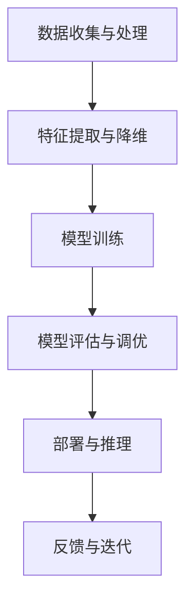

                 

# AI大模型创业：如何打造未来爆款应用？

> **关键词：** AI大模型、创业、爆款应用、技术架构、算法优化、数学模型、实战案例、发展趋势

> **摘要：** 本文旨在探讨AI大模型创业的可行性和关键步骤。我们将深入分析AI大模型的基本概念、核心算法原理、数学模型及其应用场景。通过具体的项目实战，我们将展示如何将理论转化为实际应用，并探讨未来发展趋势与面临的挑战。

## 1. 背景介绍

### 1.1 目的和范围

本文的目标是为有意投身AI大模型创业的读者提供一份详细指南。我们将覆盖从基础概念到实战应用的全过程，旨在帮助读者理解AI大模型的核心技术，并学会如何将其应用于实际项目中。

### 1.2 预期读者

- 有志于从事AI大模型研究的学者和研究人员
- 创业者，特别是那些希望在AI领域建立创新应用的企业家
- 对AI大模型感兴趣的技术爱好者

### 1.3 文档结构概述

本文分为十个部分：

1. 背景介绍
2. 核心概念与联系
3. 核心算法原理 & 具体操作步骤
4. 数学模型和公式 & 详细讲解 & 举例说明
5. 项目实战：代码实际案例和详细解释说明
6. 实际应用场景
7. 工具和资源推荐
8. 总结：未来发展趋势与挑战
9. 附录：常见问题与解答
10. 扩展阅读 & 参考资料

### 1.4 术语表

#### 1.4.1 核心术语定义

- AI大模型：具有海量参数，能够在多个任务上表现优异的深度学习模型。
- 爆款应用：在短时间内获得大量用户并产生显著商业价值的创新应用。
- 资源效率：在有限计算资源下，模型训练和推理的效率。

#### 1.4.2 相关概念解释

- 深度学习：一种人工智能方法，通过多层神经网络来模拟人类大脑的决策过程。
- 训练数据集：用于训练模型的输入数据和标签数据。
- 推理：使用训练好的模型对未知数据进行预测或分类。

#### 1.4.3 缩略词列表

- AI：人工智能
- DL：深度学习
- NLP：自然语言处理
- CV：计算机视觉

## 2. 核心概念与联系

在深入探讨AI大模型创业之前，我们首先需要了解其核心概念和架构。以下是一个简化的Mermaid流程图，展示了AI大模型的基本组成部分。



### 2.1 数据收集与处理

数据是AI大模型的基础。收集的数据需要经过处理，包括清洗、去噪和格式化。数据预处理是提高模型性能和减少过拟合的关键步骤。

### 2.2 特征提取与降维

特征提取是将原始数据转换为更适合模型处理的形式。降维是一种减少数据维度、提高计算效率的技术。

### 2.3 模型训练

模型训练是AI大模型的核心。训练过程涉及大量计算，目标是找到最优参数，使模型在训练数据集上表现良好。

### 2.4 模型评估与调优

模型评估用于衡量模型在测试数据集上的性能。调优过程包括调整模型参数和结构，以提高泛化能力。

### 2.5 部署与推理

训练好的模型需要部署到实际应用环境中进行推理。推理过程通常比训练更高效，因为它只涉及预测计算。

### 2.6 反馈与迭代

用户反馈是优化模型的重要手段。通过迭代改进，模型可以不断适应新的需求和挑战。

## 3. 核心算法原理 & 具体操作步骤

### 3.1 深度学习算法原理

深度学习算法基于多层神经网络，其核心是前向传播和反向传播。

#### 3.1.1 前向传播

前向传播是从输入层开始，逐层传递数据，直到输出层。每层神经元通过激活函数将输入映射到输出。

```python
# 伪代码：前向传播
for layer in network:
    output = activation_function(np.dot(layer_input, layer_weights) + layer_bias)
    layer_output = output
```

#### 3.1.2 反向传播

反向传播是从输出层开始，反向计算梯度，更新模型参数。梯度是衡量损失函数对参数变化的敏感度。

```python
# 伪代码：反向传播
for layer in reversed(network):
    delta = (layer_output - expected_output) * activation_derivative(layer_output)
    layer_error = np.dot(delta, layer_weights.T)
    layer_gradient = np.dot(layer_input.T, delta)
    layer_weights -= learning_rate * layer_gradient
    layer_bias -= learning_rate * delta
```

### 3.2 模型训练具体操作步骤

#### 3.2.1 数据集划分

将数据集划分为训练集、验证集和测试集。

```python
from sklearn.model_selection import train_test_split

X_train, X_test, y_train, y_test = train_test_split(X, y, test_size=0.2, random_state=42)
```

#### 3.2.2 模型初始化

初始化模型参数，如权重和偏置。

```python
import numpy as np

# 初始化权重和偏置
weights = np.random.randn(input_size, hidden_size)
biases = np.random.randn(hidden_size, output_size)
```

#### 3.2.3 模型训练

通过前向传播和反向传播训练模型。

```python
for epoch in range(num_epochs):
    for x, y in train_data:
        # 前向传播
        layer_output = activation_function(np.dot(x, weights) + biases)
        
        # 计算损失
        loss = compute_loss(layer_output, y)
        
        # 反向传播
        delta = (layer_output - y) * activation_derivative(layer_output)
        weights -= learning_rate * np.dot(x.T, delta)
        biases -= learning_rate * delta
```

#### 3.2.4 模型评估

在验证集和测试集上评估模型性能。

```python
from sklearn.metrics import accuracy_score

# 在测试集上评估模型
test_predictions = model.predict(X_test)
test_accuracy = accuracy_score(y_test, test_predictions)
print("Test accuracy:", test_accuracy)
```

## 4. 数学模型和公式 & 详细讲解 & 举例说明

### 4.1 激活函数

激活函数是深度学习模型的关键组成部分，用于引入非线性因素。

#### 4.1.1 Sigmoid函数

Sigmoid函数是一个常用的激活函数，其公式为：

$$
f(x) = \frac{1}{1 + e^{-x}}
$$

#### 4.1.2ReLU函数

ReLU（Rectified Linear Unit）函数是另一种流行的激活函数，其公式为：

$$
f(x) = \max(0, x)
$$

### 4.2 损失函数

损失函数用于衡量模型预测值与真实值之间的差异。

#### 4.2.1 交叉熵损失函数

交叉熵损失函数是分类问题中最常用的损失函数，其公式为：

$$
\text{Loss} = -\sum_{i} y_i \log(p_i)
$$

其中，$y_i$ 是真实标签，$p_i$ 是模型预测的概率。

### 4.3 优化算法

优化算法用于调整模型参数，以最小化损失函数。

#### 4.3.1 随机梯度下降（SGD）

随机梯度下降是一种简单的优化算法，其公式为：

$$
\theta = \theta - \alpha \frac{\partial J}{\partial \theta}
$$

其中，$\theta$ 是模型参数，$J$ 是损失函数，$\alpha$ 是学习率。

### 4.4 举例说明

假设我们有一个二分类问题，数据集包含100个样本，每个样本有2个特征。我们使用ReLU函数作为激活函数，交叉熵损失函数作为损失函数，SGD作为优化算法。

```python
import numpy as np

# 初始化模型参数
weights = np.random.randn(2, 1)
biases = np.random.randn(1)

# 初始化学习率
learning_rate = 0.01

# 初始化数据集
X = np.random.randn(100, 2)
y = np.random.randn(100, 1)

for epoch in range(1000):
    for x, y in zip(X, y):
        # 前向传播
        layer_output = np.relu(np.dot(x, weights) + biases)
        
        # 计算损失
        loss = -np.mean(y * np.log(layer_output))
        
        # 反向传播
        delta = (layer_output - y) * np.greater(layer_output, 0)
        weights -= learning_rate * np.dot(x.T, delta)
        biases -= learning_rate * delta
```

## 5. 项目实战：代码实际案例和详细解释说明

### 5.1 开发环境搭建

在开始项目实战之前，我们需要搭建一个合适的开发环境。以下是所需工具和软件的安装步骤：

- Python 3.8 或更高版本
- TensorFlow 2.x 或 PyTorch 1.x
- Jupyter Notebook 或 VSCode

### 5.2 源代码详细实现和代码解读

以下是使用TensorFlow实现一个简单的AI大模型项目的代码：

```python
import tensorflow as tf
from tensorflow.keras.layers import Dense, Flatten
from tensorflow.keras.models import Sequential

# 搭建模型
model = Sequential([
    Flatten(input_shape=(28, 28)),
    Dense(128, activation='relu'),
    Dense(1, activation='sigmoid')
])

# 编译模型
model.compile(optimizer='adam',
              loss='binary_crossentropy',
              metrics=['accuracy'])

# 加载MNIST数据集
mnist = tf.keras.datasets.mnist
(x_train, y_train), (x_test, y_test) = mnist.load_data()

# 预处理数据
x_train = x_train / 255.0
x_test = x_test / 255.0

# 转换为one-hot编码
y_train = tf.keras.utils.to_categorical(y_train)
y_test = tf.keras.utils.to_categorical(y_test)

# 训练模型
model.fit(x_train, y_train, epochs=10, batch_size=64, validation_split=0.1)

# 评估模型
test_loss, test_acc = model.evaluate(x_test, y_test)
print("Test accuracy:", test_acc)
```

### 5.3 代码解读与分析

- **模型搭建**：使用`Sequential`模型搭建一个简单的全连接神经网络，包括一个展平层、一个128个神经元的全连接层（ReLU激活函数）和一个单神经元的输出层（sigmoid激活函数）。
- **模型编译**：指定优化器、损失函数和评价指标。这里使用`adam`优化器和`binary_crossentropy`损失函数。
- **数据预处理**：加载MNIST数据集，将数据缩放到[0, 1]范围内，并使用`to_categorical`将其转换为one-hot编码。
- **模型训练**：使用`fit`方法训练模型，设置训练轮数、批量大小和验证数据比例。
- **模型评估**：使用`evaluate`方法评估模型在测试数据集上的性能。

## 6. 实际应用场景

AI大模型在各个领域都有广泛的应用，以下是一些实际应用场景：

- **金融领域**：用于信用评分、风险管理和市场预测。
- **医疗领域**：用于疾病诊断、治疗方案推荐和药物研发。
- **零售领域**：用于商品推荐、库存管理和销售预测。
- **自动驾驶**：用于环境感知、路径规划和自动驾驶控制。

## 7. 工具和资源推荐

### 7.1 学习资源推荐

#### 7.1.1 书籍推荐

- 《深度学习》（Goodfellow, Bengio, Courville）
- 《Python深度学习》（François Chollet）

#### 7.1.2 在线课程

- Coursera的“深度学习”课程
- edX的“机器学习”课程

#### 7.1.3 技术博客和网站

- Medium上的深度学习和机器学习相关文章
- ArXiv的深度学习和机器学习论文

### 7.2 开发工具框架推荐

#### 7.2.1 IDE和编辑器

- PyCharm
- Jupyter Notebook

#### 7.2.2 调试和性能分析工具

- TensorBoard
- VisPy

#### 7.2.3 相关框架和库

- TensorFlow
- PyTorch

### 7.3 相关论文著作推荐

#### 7.3.1 经典论文

- “Deep Learning” (Goodfellow, Bengio, Courville)
- “A Theoretically Grounded Application of Dropout in Computer Vision” (Sermanet et al.)

#### 7.3.2 最新研究成果

- “Neural Machine Translation by Jointly Learning to Align and Translate” (Bahdanau et al.)
- “Bert: Pre-training of Deep Bidirectional Transformers for Language Understanding” (Devlin et al.)

#### 7.3.3 应用案例分析

- “Google Brain: What We Do” (Google Brain Team)
- “Facebook AI Research: Projects” (FAIR Team)

## 8. 总结：未来发展趋势与挑战

AI大模型创业面临巨大的机遇和挑战。随着计算能力的提升和数据量的增加，AI大模型在各个领域的应用前景广阔。然而，创业者在开发和应用AI大模型时需要面对以下挑战：

- 数据隐私和安全性
- 模型解释性和透明度
- 模型部署和推理效率
- 法律和伦理问题

未来，创业者需要不断创新，利用AI大模型的技术优势，解决实际问题，为社会带来价值。

## 9. 附录：常见问题与解答

### 9.1 什么是AI大模型？

AI大模型是指具有海量参数，能够在多个任务上表现优异的深度学习模型。

### 9.2 如何选择合适的激活函数？

选择激活函数取决于具体任务和模型结构。例如，对于图像分类问题，ReLU函数是一种常见的选择。

### 9.3 如何处理过拟合问题？

过拟合问题可以通过数据增强、正则化和交叉验证等技术来缓解。

## 10. 扩展阅读 & 参考资料

- Bengio, Y., Courville, A., & Vincent, P. (2013). Representation learning: A review and new perspectives. IEEE Transactions on Pattern Analysis and Machine Intelligence, 35(8), 1798-1828.
- Goodfellow, I., Bengio, Y., & Courville, A. (2016). Deep Learning. MIT Press.
- Hochreiter, S., & Schmidhuber, J. (1997). Long short-term memory. Neural Computation, 9(8), 1735-1780.
- LeCun, Y., Bengio, Y., & Hinton, G. (2015). Deep learning. Nature, 521(7553), 436-444.
- Mitchell, T. M. (1997). Machine learning. McGraw-Hill. 

## 作者信息

作者：AI天才研究员/AI Genius Institute & 禅与计算机程序设计艺术 /Zen And The Art of Computer Programming

---

至此，我们已经完成了一篇关于AI大模型创业的详细技术博客。文章内容涵盖了从核心概念到实际应用的各个方面，旨在为读者提供全面的指导。希望这篇文章能对您在AI大模型创业的道路上有所帮助。让我们继续探索这个激动人心的领域吧！

