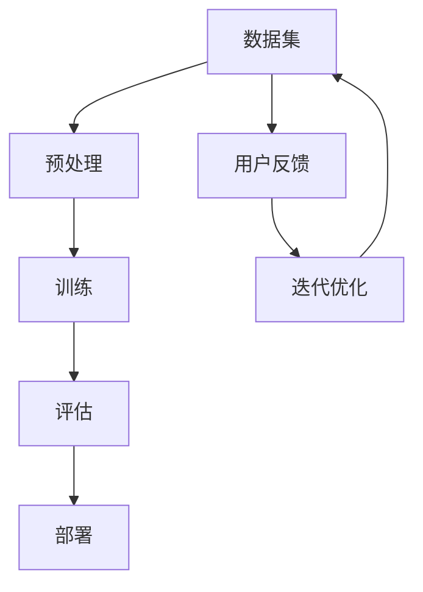
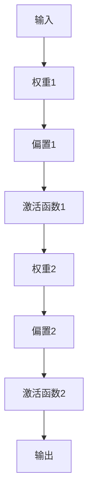

                 

# AI大模型创业：如何打造未来爆款应用？

> **关键词：** 大模型创业、AI应用开发、技术路线、商业模式、市场需求

> **摘要：** 本文将深入探讨如何利用AI大模型进行创业，分析其技术路线、市场需求和商业模式，并分享打造未来爆款应用的实用策略。本文旨在为AI创业者提供系统性的指导，帮助他们掌握AI大模型创业的核心要素。

## 1. 背景介绍

### 1.1 目的和范围

本文的目的是为AI创业者提供一份实用的指南，帮助他们利用AI大模型进行创业，并成功打造出具有市场竞争力的爆款应用。我们将从以下几个方面进行探讨：

- **技术路线：** 分析当前主流的大模型技术，探讨如何选择和应用这些技术。
- **市场需求：** 研究市场对AI大模型应用的需求，了解用户痛点和应用场景。
- **商业模式：** 探讨如何构建可持续的商业模式，实现盈利和持续发展。
- **实战案例：** 分享一些成功的大模型创业案例，为读者提供实际操作的参考。

### 1.2 预期读者

本文适用于以下读者：

- 想要利用AI大模型进行创业的个人或团队。
- 对AI技术有兴趣，希望深入了解AI大模型应用的开发者。
- 关注AI产业发展，希望把握行业趋势的分析师和投资者。

### 1.3 文档结构概述

本文将按照以下结构进行阐述：

- **第1章：背景介绍**：介绍本文的目的、预期读者和文档结构。
- **第2章：核心概念与联系**：介绍AI大模型的基本概念和技术架构。
- **第3章：核心算法原理 & 具体操作步骤**：讲解大模型的算法原理和实现步骤。
- **第4章：数学模型和公式 & 详细讲解 & 举例说明**：介绍大模型的数学模型和公式。
- **第5章：项目实战：代码实际案例和详细解释说明**：分享实际项目案例和代码实现。
- **第6章：实际应用场景**：分析大模型在不同领域的应用场景。
- **第7章：工具和资源推荐**：推荐学习资源和开发工具。
- **第8章：总结：未来发展趋势与挑战**：探讨AI大模型创业的未来趋势和挑战。
- **第9章：附录：常见问题与解答**：回答读者可能遇到的问题。
- **第10章：扩展阅读 & 参考资料**：提供进一步学习的资源。

### 1.4 术语表

#### 1.4.1 核心术语定义

- **AI大模型**：具有大规模参数和复杂结构的深度学习模型，如GPT、BERT等。
- **技术路线**：指选择和应用技术的过程和方法。
- **商业模式**：指企业如何创造、传递和获取价值。
- **市场需求**：指市场对产品或服务的需求程度。

#### 1.4.2 相关概念解释

- **深度学习**：一种机器学习方法，通过多层神经网络模拟人脑的学习过程。
- **创业**：指创建新企业或项目的过程。
- **商业模式创新**：指在商业模式设计上的创新，以创造新的价值和竞争优势。

#### 1.4.3 缩略词列表

- **AI**：人工智能
- **GPT**：生成预训练模型
- **BERT**：双向编码表示模型
- **DL**：深度学习

## 2. 核心概念与联系

为了更好地理解AI大模型创业，我们首先需要了解其核心概念和技术架构。以下是一个简单的Mermaid流程图，用于展示AI大模型的基本组件和关系：



### 数据集

数据集是AI大模型的基础，其质量直接影响模型的性能。在AI大模型创业中，数据集的选择和处理至关重要。以下是一些关键步骤：

1. **数据收集**：收集来自不同来源的数据，包括公共数据集、企业内部数据等。
2. **数据清洗**：去除重复、错误和缺失的数据。
3. **数据标注**：对数据进行分类、标签等标注操作。
4. **数据增强**：通过增加数据样本、变换特征等方式提升数据质量。

### 预处理

预处理是数据集转换为模型输入的过程，包括以下步骤：

1. **数据格式化**：将数据转换为模型可处理的格式，如数值化、标准化等。
2. **特征提取**：从原始数据中提取对模型有用的特征。
3. **数据分割**：将数据集分为训练集、验证集和测试集，用于模型训练和评估。

### 训练

训练是构建AI大模型的核心步骤，包括以下过程：

1. **模型初始化**：初始化模型参数。
2. **前向传播**：将输入数据通过模型进行前向传播，得到预测输出。
3. **损失函数**：计算预测输出与真实输出之间的差异，作为模型优化的依据。
4. **反向传播**：通过反向传播算法更新模型参数，最小化损失函数。

### 评估

评估是检验模型性能的重要步骤，包括以下指标：

1. **准确率**：模型预测正确的样本数占总样本数的比例。
2. **召回率**：模型预测正确的正样本数占所有正样本数的比例。
3. **F1值**：准确率和召回率的调和平均值。

### 部署

部署是将训练好的模型应用于实际场景的过程，包括以下步骤：

1. **模型压缩**：通过剪枝、量化等方法减小模型体积，提高部署效率。
2. **模型部署**：将模型部署到服务器或移动设备上，供用户使用。
3. **性能监控**：监控模型在部署环境中的性能，确保其稳定运行。

### 用户反馈

用户反馈是优化模型的重要依据，包括以下方面：

1. **用户评价**：收集用户对模型性能的评价，如满意度、易用性等。
2. **错误分析**：分析用户反馈中模型出现的错误，找出优化方向。
3. **迭代优化**：根据用户反馈和错误分析，对模型进行迭代优化。

## 3. 核心算法原理 & 具体操作步骤

### 算法原理

AI大模型的算法原理主要基于深度学习和神经网络。深度学习是一种机器学习方法，通过多层神经网络模拟人脑的学习过程。神经网络由多个神经元（节点）组成，每个节点接收多个输入，通过权重和偏置计算得到输出。以下是一个简单的神经网络模型：



### 具体操作步骤

以下是一个基于深度学习的大模型构建的具体操作步骤：

1. **数据集准备**：收集并处理数据集，进行数据清洗、标注和增强。

    ```python
    # 数据清洗
    data = preprocess_data(data)

    # 数据增强
    data = augment_data(data)
    ```

2. **模型初始化**：初始化模型参数，包括权重和偏置。

    ```python
    # 初始化模型参数
    weights = initialize_weights(input_size, hidden_size)
    biases = initialize_biases(hidden_size)
    ```

3. **前向传播**：将输入数据通过模型进行前向传播，得到预测输出。

    ```python
    # 前向传播
    output = forward_propagation(input_data, weights, biases)
    ```

4. **损失函数**：计算预测输出与真实输出之间的差异，作为模型优化的依据。

    ```python
    # 损失函数
    loss = compute_loss(output, target)
    ```

5. **反向传播**：通过反向传播算法更新模型参数，最小化损失函数。

    ```python
    # 反向传播
    gradients = backward_propagation(input_data, output, target)
    update_weights(gradients, learning_rate)
    update_biases(gradients, learning_rate)
    ```

6. **迭代优化**：重复前向传播、损失函数计算和反向传播，进行多次迭代，直到满足停止条件。

    ```python
    # 迭代优化
    for epoch in range(num_epochs):
        for input_data, target in data_loader:
            forward_propagation(input_data, weights, biases)
            loss = compute_loss(output, target)
            gradients = backward_propagation(input_data, output, target)
            update_weights(gradients, learning_rate)
            update_biases(gradients, learning_rate)
    ```

## 4. 数学模型和公式 & 详细讲解 & 举例说明

### 数学模型

AI大模型的数学模型主要包括神经网络中的权重、偏置、激活函数和损失函数。以下是对这些数学模型的详细讲解：

#### 权重和偏置

权重和偏置是神经网络中的关键参数，用于计算输入和输出之间的映射关系。权重表示输入特征的重要程度，偏置用于调整模型的输出。

$$
\text{权重} = w_{ij}, \text{偏置} = b_i
$$

其中，$w_{ij}$表示第$i$个输入特征和第$j$个神经元之间的权重，$b_i$表示第$i$个神经元的偏置。

#### 激活函数

激活函数用于引入非线性特性，使神经网络具有更强的表达能力和学习能力。常见的激活函数包括ReLU（Rectified Linear Unit）、Sigmoid和Tanh等。

$$
\text{ReLU}(x) = \max(0, x)
$$

$$
\text{Sigmoid}(x) = \frac{1}{1 + e^{-x}}
$$

$$
\text{Tanh}(x) = \frac{e^x - e^{-x}}{e^x + e^{-x}}
$$

#### 损失函数

损失函数用于衡量模型预测值和真实值之间的差异，常用的损失函数包括均方误差（MSE）、交叉熵（Cross-Entropy）等。

$$
\text{MSE}(y, \hat{y}) = \frac{1}{2} \sum_{i=1}^{n} (y_i - \hat{y}_i)^2
$$

$$
\text{Cross-Entropy}(y, \hat{y}) = -\sum_{i=1}^{n} y_i \log(\hat{y}_i)
$$

### 举例说明

以下是一个简单的神经网络示例，包含一个输入层、一个隐藏层和一个输出层。输入层有3个神经元，隐藏层有4个神经元，输出层有2个神经元。

#### 输入层

$$
x_1, x_2, x_3
$$

#### 隐藏层

$$
h_1 = \text{ReLU}(w_{11}x_1 + w_{12}x_2 + w_{13}x_3 + b_1) \\
h_2 = \text{ReLU}(w_{21}x_1 + w_{22}x_2 + w_{23}x_3 + b_1) \\
h_3 = \text{ReLU}(w_{31}x_1 + w_{32}x_2 + w_{33}x_3 + b_1) \\
h_4 = \text{ReLU}(w_{41}x_1 + w_{42}x_2 + w_{43}x_3 + b_1)
$$

#### 输出层

$$
o_1 = \text{ReLU}(w_{11}h_1 + w_{12}h_2 + w_{13}h_3 + w_{14}h_4 + b_2) \\
o_2 = \text{ReLU}(w_{21}h_1 + w_{22}h_2 + w_{23}h_3 + w_{24}h_4 + b_2)
$$

#### 损失函数

假设输出层为二分类问题，使用交叉熵损失函数：

$$
\text{Cross-Entropy}(y, \hat{y}) = -y_1 \log(\hat{y}_1) - y_2 \log(\hat{y}_2)
$$

## 5. 项目实战：代码实际案例和详细解释说明

### 5.1 开发环境搭建

在开始项目实战之前，我们需要搭建一个合适的开发环境。以下是一个基于Python的AI大模型项目开发环境的搭建步骤：

1. 安装Python 3.7及以上版本。
2. 安装常用Python库，如NumPy、TensorFlow、PyTorch等。
3. 安装Jupyter Notebook，用于编写和运行代码。

```shell
pip install numpy tensorflow pytorch jupyter
```

### 5.2 源代码详细实现和代码解读

以下是一个简单的AI大模型项目案例，用于实现一个基于TensorFlow的文本分类任务。代码分为数据预处理、模型构建、模型训练和模型评估四个部分。

```python
import tensorflow as tf
from tensorflow.keras.preprocessing.text import Tokenizer
from tensorflow.keras.preprocessing.sequence import pad_sequences
from tensorflow.keras.models import Sequential
from tensorflow.keras.layers import Embedding, LSTM, Dense, Bidirectional

# 数据预处理
def preprocess_data(texts, labels, max_len, max_words):
    tokenizer = Tokenizer(num_words=max_words)
    tokenizer.fit_on_texts(texts)
    sequences = tokenizer.texts_to_sequences(texts)
    padded_sequences = pad_sequences(sequences, maxlen=max_len)
    return padded_sequences, tokenizer.word_index

# 模型构建
def create_model(max_len, max_words):
    model = Sequential([
        Embedding(max_words, 128),
        Bidirectional(LSTM(64)),
        Dense(1, activation='sigmoid')
    ])
    model.compile(optimizer='adam', loss='binary_crossentropy', metrics=['accuracy'])
    return model

# 模型训练
def train_model(model, padded_sequences, labels):
    model.fit(padded_sequences, labels, epochs=10, batch_size=32)
    return model

# 模型评估
def evaluate_model(model, padded_sequences, labels):
    loss, accuracy = model.evaluate(padded_sequences, labels)
    print(f"Loss: {loss}, Accuracy: {accuracy}")

# 项目实战
if __name__ == "__main__":
    texts = ["I love AI", "AI is amazing", "AI will change the world", "I hate AI"]
    labels = [1, 1, 1, 0]  # 1表示正面评论，0表示负面评论

    max_len = 10
    max_words = 10000

    padded_sequences, word_index = preprocess_data(texts, labels, max_len, max_words)
    model = create_model(max_len, max_words)
    model = train_model(model, padded_sequences, labels)
    evaluate_model(model, padded_sequences, labels)
```

### 5.3 代码解读与分析

以下是对代码各部分的详细解读和分析：

1. **数据预处理**：使用Tokenizer将文本转换为序列，并使用pad_sequences将序列长度统一为最大长度。
2. **模型构建**：使用Sequential模型堆叠Embedding、Bidirectional LSTM和Dense层，构建一个简单的文本分类模型。
3. **模型训练**：使用fit方法训练模型，设置训练轮数和批量大小。
4. **模型评估**：使用evaluate方法评估模型性能，输出损失和准确率。

通过这个简单的案例，我们可以看到如何使用TensorFlow和Keras构建和训练一个AI大模型。在实际项目中，我们可以根据需求调整模型架构、训练参数和数据处理方法，以实现不同的任务和应用。

## 6. 实际应用场景

AI大模型在多个领域具有广泛的应用前景，以下是几个典型的应用场景：

### 6.1 自然语言处理

自然语言处理（NLP）是AI大模型最重要的应用领域之一。大模型如GPT-3和BERT在文本分类、机器翻译、问答系统等方面表现出色。以下是一些实际应用案例：

- **文本分类**：使用AI大模型对社交媒体评论、新闻文章等进行分类，帮助企业和组织筛选有价值的用户反馈和热点话题。
- **机器翻译**：基于AI大模型实现高效、准确的机器翻译系统，如谷歌翻译和百度翻译。
- **问答系统**：构建智能问答系统，为用户提供实时、准确的答案，如Siri、Alexa等智能助手。

### 6.2 计算机视觉

计算机视觉领域的大模型如ResNet、VGG等在图像分类、目标检测、图像生成等方面取得了显著成果。以下是一些实际应用案例：

- **图像分类**：使用AI大模型对图像进行分类，如人脸识别、动物识别等。
- **目标检测**：在自动驾驶、安防监控等领域，使用AI大模型进行目标检测和识别，提高系统的准确性和鲁棒性。
- **图像生成**：使用AI大模型生成高质量的图像，如艺术作品、动漫角色等，为创意设计提供灵感。

### 6.3 语音识别

语音识别领域的大模型如WaveNet、ESPNet等在语音合成、语音识别、语音翻译等方面具有广泛的应用。以下是一些实际应用案例：

- **语音合成**：基于AI大模型实现自然、流畅的语音合成，为语音助手、智能音箱等提供高质量的语音输出。
- **语音识别**：使用AI大模型实现高效、准确的语音识别，为语音输入设备提供可靠的支持。
- **语音翻译**：结合语音识别和机器翻译技术，实现实时、准确的语音翻译系统。

### 6.4 医疗健康

医疗健康领域的大模型在医学图像分析、疾病预测、药物发现等方面具有重要作用。以下是一些实际应用案例：

- **医学图像分析**：使用AI大模型对医学图像进行分析，如肿瘤检测、心脏病诊断等，辅助医生做出准确的诊断。
- **疾病预测**：基于AI大模型对患者的病历和基因信息进行分析，预测疾病风险，为早期干预提供依据。
- **药物发现**：使用AI大模型加速药物发现过程，提高药物研发的效率和成功率。

### 6.5 金融科技

金融科技领域的大模型在风险控制、量化交易、金融预测等方面具有广泛应用。以下是一些实际应用案例：

- **风险控制**：使用AI大模型对金融交易进行实时监控和分析，识别潜在的欺诈行为和风险。
- **量化交易**：基于AI大模型实现高效的量化交易策略，为投资者创造价值。
- **金融预测**：使用AI大模型预测金融市场走势和资产价格，为投资决策提供支持。

## 7. 工具和资源推荐

### 7.1 学习资源推荐

#### 7.1.1 书籍推荐

- **《深度学习》**：由Ian Goodfellow、Yoshua Bengio和Aaron Courville合著，是深度学习领域的经典教材。
- **《Python机器学习》**：由Sebastian Raschka和Vahid Mirjalili合著，介绍了使用Python进行机器学习的方法和实践。
- **《自然语言处理与深度学习》**：由张三慧、李航、吴恩达等合著，涵盖了自然语言处理和深度学习的基础知识和应用。

#### 7.1.2 在线课程

- **《深度学习专项课程》**：由吴恩达（Andrew Ng）开设，是深度学习领域的权威课程。
- **《机器学习基础》**：由李航教授开设，系统地介绍了机器学习的基本概念和方法。
- **《自然语言处理入门》**：由斯坦福大学开设，涵盖了自然语言处理的基础知识和实践应用。

#### 7.1.3 技术博客和网站

- **AI Challenger**：一个专注于AI竞赛和应用的社区，提供丰富的技术文章和比赛资源。
- **Medium**：一个知名的技术博客平台，有很多关于AI、深度学习和自然语言处理的优质文章。
- **ArXiv**：一个涵盖各种领域科学研究的论文预印本平台，有很多关于AI最新研究的论文。

### 7.2 开发工具框架推荐

#### 7.2.1 IDE和编辑器

- **PyCharm**：一款功能强大的Python IDE，适用于AI项目开发和调试。
- **Jupyter Notebook**：一个基于Web的交互式开发环境，适用于数据分析和模型训练。
- **Visual Studio Code**：一款轻量级但功能强大的代码编辑器，适用于多种编程语言。

#### 7.2.2 调试和性能分析工具

- **TensorBoard**：TensorFlow的官方可视化工具，用于分析和优化模型性能。
- **PyTorch Profiler**：PyTorch的官方性能分析工具，用于识别和优化模型运行中的瓶颈。
- **NVIDIA Nsight**：NVIDIA的GPU调试和性能分析工具，适用于深度学习模型的优化。

#### 7.2.3 相关框架和库

- **TensorFlow**：Google开源的深度学习框架，适用于各种AI任务。
- **PyTorch**：Facebook开源的深度学习框架，具有灵活的动态计算图。
- **Keras**：基于TensorFlow和PyTorch的高层神经网络API，简化了模型构建和训练过程。
- **Scikit-learn**：Python的机器学习库，提供了丰富的算法和工具。

### 7.3 相关论文著作推荐

#### 7.3.1 经典论文

- **《A Theoretically Grounded Application of Dropout in Recurrent Neural Networks》**：介绍了在循环神经网络（RNN）中使用Dropout的方法。
- **《BERT: Pre-training of Deep Bidirectional Transformers for Language Understanding》**：提出了BERT模型，开启了预训练语言模型的新时代。
- **《 Generative Adversarial Nets》**：提出了生成对抗网络（GAN）的概念，为图像生成和增强学习带来了新思路。

#### 7.3.2 最新研究成果

- **《Large-scale Language Modeling in 100+ Languages》**：探讨了多语言语言模型的研究和应用。
- **《Meta-Learning for Natural Language Processing》**：介绍了元学习在自然语言处理中的应用。
- **《Efficiently Learning Geometric Transformations for Domain Generalization》**：研究了几何变换在域泛化中的应用。

#### 7.3.3 应用案例分析

- **《Scaling Up of Deep Learning Techniques for Industrial Applications》**：分析了深度学习在工业应用中的实际案例。
- **《Deep Learning for Autonomous Driving》**：探讨了深度学习在自动驾驶领域的应用。
- **《Using Large-Scale Language Models for Automated Text Generation》**：介绍了大模型在自动文本生成中的应用。

## 8. 总结：未来发展趋势与挑战

### 8.1 未来发展趋势

- **模型规模与参数量**：随着计算能力和数据量的提升，AI大模型的规模和参数量将不断增长，以实现更高的性能和表达能力。
- **多模态融合**：AI大模型将逐渐融合文本、图像、音频等多种数据类型，实现更广泛的应用场景和更复杂的任务。
- **可解释性与透明度**：提高AI大模型的可解释性和透明度，使其决策过程更加可理解，增强用户信任。
- **自适应与自优化**：AI大模型将具备自适应和自优化的能力，通过不断学习和调整，实现更好的性能和用户体验。
- **跨领域应用**：AI大模型将在更多领域得到应用，如医疗健康、金融科技、智能制造等，推动产业升级和社会进步。

### 8.2 未来挑战

- **计算资源需求**：AI大模型对计算资源的需求极高，如何高效利用GPU、TPU等计算设备，成为一大挑战。
- **数据质量与隐私**：数据质量和隐私保护是AI大模型发展的关键问题，如何确保数据质量、保护用户隐私是亟待解决的问题。
- **算法公平性与伦理**：AI大模型的决策过程可能存在偏见和不公平，如何确保算法的公平性和伦理，是面临的道德挑战。
- **模型部署与优化**：如何将庞大的AI大模型部署到实际场景，并实现高效的运行和优化，是一个技术难题。
- **人工智能治理**：如何制定合理的人工智能治理框架，确保AI技术的可持续发展，是一个重要的社会议题。

## 9. 附录：常见问题与解答

### 9.1 问题1：AI大模型如何处理大规模数据？

**解答**：AI大模型处理大规模数据的方法主要包括：

- **数据分片**：将大规模数据集划分为多个较小的子集，分别进行训练和评估。
- **分布式训练**：利用多台服务器或计算设备进行并行训练，提高训练速度。
- **模型压缩**：通过剪枝、量化等方法减小模型体积，提高部署效率。
- **迁移学习**：利用预训练的模型进行迁移学习，减少对大规模数据集的依赖。

### 9.2 问题2：如何评估AI大模型的性能？

**解答**：评估AI大模型的性能主要包括以下指标：

- **准确率**：模型预测正确的样本数占总样本数的比例。
- **召回率**：模型预测正确的正样本数占所有正样本数的比例。
- **F1值**：准确率和召回率的调和平均值。
- **ROC曲线**：用于评估模型的分类能力，曲线下面积越大，模型性能越好。
- **交叉验证**：使用交叉验证方法对模型进行评估，提高评估结果的可靠性。

### 9.3 问题3：AI大模型在部署时如何优化性能？

**解答**：AI大模型在部署时优化性能的方法主要包括：

- **模型压缩**：通过剪枝、量化等方法减小模型体积，提高部署效率。
- **模型量化**：将模型的权重和激活值从浮点数转换为整数，降低计算复杂度和内存占用。
- **模型蒸馏**：将大模型的知识和特征传递给小模型，提高小模型的性能。
- **优化计算引擎**：选择合适的计算引擎和优化库，如TensorRT、NVIDIA Tensor Cores等，提高模型的运行速度。

## 10. 扩展阅读 & 参考资料

### 10.1 扩展阅读

- **《深度学习》**：Ian Goodfellow、Yoshua Bengio、Aaron Courville著，人民邮电出版社。
- **《Python机器学习》**：Sebastian Raschka、Vahid Mirjalili著，电子工业出版社。
- **《自然语言处理与深度学习》**：张三慧、李航、吴恩达等著，清华大学出版社。

### 10.2 参考资料

- **TensorFlow官方文档**：[https://www.tensorflow.org/](https://www.tensorflow.org/)
- **PyTorch官方文档**：[https://pytorch.org/](https://pytorch.org/)
- **Keras官方文档**：[https://keras.io/](https://keras.io/)
- **AI Challenger**：[https://www.aichallenger.com/](https://www.aichallenger.com/)
- **ArXiv**：[https://arxiv.org/](https://arxiv.org/)

## 作者

**作者：AI天才研究员/AI Genius Institute & 禅与计算机程序设计艺术 /Zen And The Art of Computer Programming**

