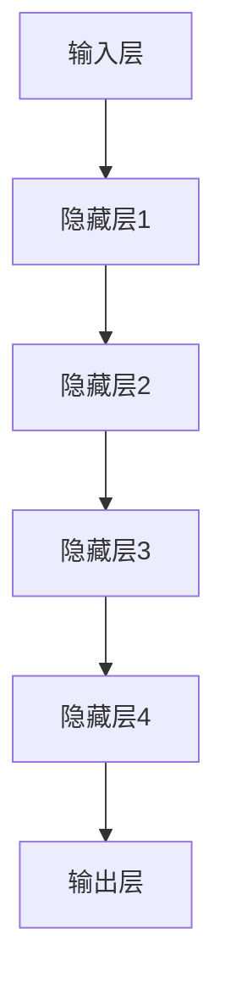

                 

# AI大模型创业：如何打造未来爆款应用？

## 关键词

- AI 大模型
- 创业
- 应用开发
- 用户体验
- 技术架构

## 摘要

本文旨在探讨 AI 大模型在创业中的应用策略，分析其核心概念、算法原理、数学模型，并通过实际项目案例进行深入讲解。文章还将介绍相关工具和资源，以及预测未来的发展趋势和面临的挑战，为 AI 大模型创业提供全面的指导和启示。

## 1. 背景介绍

### 1.1 目的和范围

本文旨在帮助创业者了解 AI 大模型的核心概念和技术，掌握其应用策略，从而打造出具有市场竞争力的 AI 爆款应用。本文将涵盖以下内容：

- AI 大模型的定义和分类
- AI 大模型的原理和架构
- AI 大模型在创业中的应用策略
- 实际项目案例的讲解
- 相关工具和资源的推荐

### 1.2 预期读者

- 有创业意愿的 AI 爱好者
- 对 AI 大模型有基本了解的技术人员
- 想了解 AI 大模型在创业中应用的企业家
- 对 AI 大模型技术感兴趣的研究生和本科生

### 1.3 文档结构概述

本文分为十个部分：

1. 背景介绍
2. 核心概念与联系
3. 核心算法原理 & 具体操作步骤
4. 数学模型和公式 & 详细讲解 & 举例说明
5. 项目实战：代码实际案例和详细解释说明
6. 实际应用场景
7. 工具和资源推荐
8. 总结：未来发展趋势与挑战
9. 附录：常见问题与解答
10. 扩展阅读 & 参考资料

### 1.4 术语表

#### 1.4.1 核心术语定义

- AI 大模型：指具有大规模参数、复杂结构、高度可扩展性的神经网络模型。
- 创业：指创建新的商业项目，以实现商业价值和市场份额。
- 应用开发：指将 AI 大模型应用于实际问题的过程，包括数据预处理、模型训练、模型评估等。

#### 1.4.2 相关概念解释

- 深度学习：一种机器学习技术，通过多层神经网络对数据进行建模和预测。
- 人工智能：一种模拟人类智能的技术，包括学习、推理、决策和问题解决等。
- 爆款应用：指在市场上迅速获得用户关注和市场份额的应用。

#### 1.4.3 缩略词列表

- AI：人工智能
- ML：机器学习
- DL：深度学习
- NLP：自然语言处理
- CV：计算机视觉

## 2. 核心概念与联系

在探讨 AI 大模型创业之前，我们首先需要了解 AI 大模型的核心概念和联系。以下是 AI 大模型的关键概念及其相互关系：

### 2.1 AI 大模型定义

AI 大模型是指具有大规模参数、复杂结构、高度可扩展性的神经网络模型。这些模型通常由多个层级组成，每个层级都能从输入数据中提取有用信息，并通过反向传播算法进行训练。

### 2.2 深度学习与 AI 大模型的关系

深度学习是一种机器学习技术，通过多层神经网络对数据进行建模和预测。AI 大模型是深度学习技术的典型应用，具有以下特点：

- 参数规模大：数百万甚至数亿个参数
- 结构复杂：多层神经网络结构
- 高度可扩展：能够处理海量数据

### 2.3 自然语言处理与 AI 大模型的关系

自然语言处理（NLP）是 AI 领域的一个重要分支，旨在使计算机理解和处理人类语言。AI 大模型在 NLP 中有广泛应用，如文本分类、情感分析、机器翻译等。

### 2.4 计算机视觉与 AI 大模型的关系

计算机视觉是 AI 领域的另一个重要分支，旨在使计算机理解和解释图像。AI 大模型在计算机视觉中发挥了关键作用，如目标检测、图像识别、图像生成等。

### 2.5 AI 大模型架构

AI 大模型的架构通常包括以下几个部分：

- 输入层：接收外部输入数据，如文本、图像等。
- 隐藏层：通过多层神经网络对输入数据进行特征提取和变换。
- 输出层：生成预测结果或决策。

以下是 AI 大模型的 Mermaid 流程图：



## 3. 核心算法原理 & 具体操作步骤

AI 大模型的核心算法原理是深度学习，它包括以下几个关键步骤：

### 3.1 数据预处理

数据预处理是深度学习模型训练的基础，主要包括以下步骤：

- 数据清洗：去除噪声和异常值。
- 数据归一化：将数据缩放到相同的范围，便于模型训练。
- 数据增强：通过随机旋转、缩放、裁剪等操作增加数据多样性。

### 3.2 模型训练

模型训练是深度学习的核心步骤，主要包括以下过程：

- 初始化参数：随机初始化模型参数。
- 前向传播：将输入数据传递到模型中，计算输出。
- 计算损失：比较输出结果与真实值之间的差异，计算损失函数。
- 反向传播：根据损失函数计算参数的梯度，并更新参数。
- 优化算法：使用优化算法（如梯度下降、Adam等）调整参数。

以下是深度学习模型训练的伪代码：

```python
def train_model(data, epochs):
    for epoch in range(epochs):
        for batch in data:
            # 前向传播
            output = forward_propagation(batch inputs)
            # 计算损失
            loss = compute_loss(output, batch labels)
            # 反向传播
            backward_propagation(output, batch labels)
            # 更新参数
            update_parameters()

    return model
```

### 3.3 模型评估

模型评估是判断模型性能的重要步骤，主要包括以下指标：

- 准确率（Accuracy）：正确预测的比例。
- 召回率（Recall）：实际为正例且被正确预测为正例的比例。
- 精确率（Precision）：被正确预测为正例的比例。
- F1 分数（F1 Score）：精确率和召回率的调和平均。

以下是模型评估的伪代码：

```python
def evaluate_model(model, test_data):
    correct_predictions = 0
    total_predictions = 0

    for batch in test_data:
        output = model.predict(batch inputs)
        correct_predictions += (output == batch labels).sum()
        total_predictions += batch inputs.shape[0]

    accuracy = correct_predictions / total_predictions
    recall = correct_predictions / (batch labels.sum())
    precision = correct_predictions / (output.sum())

    return accuracy, recall, precision
```

## 4. 数学模型和公式 & 详细讲解 & 举例说明

在深度学习模型中，数学模型和公式起着至关重要的作用。以下是一些常用的数学模型和公式及其详细讲解和举例说明。

### 4.1 损失函数

损失函数用于衡量模型预测结果与真实值之间的差距。常用的损失函数包括均方误差（MSE）、交叉熵（Cross Entropy）等。

#### 4.1.1 均方误差（MSE）

均方误差（MSE）是衡量预测结果与真实值之间差异的一种常用损失函数。其公式如下：

$$
MSE = \frac{1}{n} \sum_{i=1}^{n} (y_i - \hat{y}_i)^2
$$

其中，$y_i$ 为真实值，$\hat{y}_i$ 为预测值，$n$ 为样本数量。

#### 4.1.2 交叉熵（Cross Entropy）

交叉熵（Cross Entropy）是衡量模型预测结果与真实值之间差异的一种常用损失函数。其公式如下：

$$
CE = -\frac{1}{n} \sum_{i=1}^{n} y_i \log(\hat{y}_i)
$$

其中，$y_i$ 为真实值，$\hat{y}_i$ 为预测值，$n$ 为样本数量。

### 4.2 优化算法

优化算法用于调整模型参数，以最小化损失函数。常用的优化算法包括梯度下降（Gradient Descent）、Adam 等。

#### 4.2.1 梯度下降（Gradient Descent）

梯度下降是一种最简单的优化算法，其思想是沿着损失函数的梯度方向更新参数，以最小化损失函数。其公式如下：

$$
\theta = \theta - \alpha \frac{\partial J(\theta)}{\partial \theta}
$$

其中，$\theta$ 为模型参数，$\alpha$ 为学习率，$J(\theta)$ 为损失函数。

#### 4.2.2 Adam

Adam 是一种结合了梯度下降和动量法的优化算法，其公式如下：

$$
\theta = \theta - \alpha \frac{m}{\sqrt{v} + \epsilon}
$$

其中，$m$ 为一阶矩估计，$v$ 为二阶矩估计，$\alpha$ 为学习率，$\epsilon$ 为常数。

### 4.3 激活函数

激活函数是深度学习模型中的一个关键组件，用于引入非线性特性。常用的激活函数包括 sigmoid、ReLU 等。

#### 4.3.1 sigmoid

sigmoid 函数是一种常用的激活函数，其公式如下：

$$
\sigma(x) = \frac{1}{1 + e^{-x}}
$$

sigmoid 函数可以将输入映射到 $(0, 1)$ 区间。

#### 4.3.2 ReLU

ReLU 函数是一种常用的激活函数，其公式如下：

$$
\text{ReLU}(x) = \max(0, x)
$$

ReLU 函数在输入为负值时输出 0，在输入为正值时输出输入值。

### 4.4 举例说明

假设我们有一个二元分类问题，需要预测某个样本属于正类还是负类。我们可以使用深度学习模型进行建模和预测。以下是具体的步骤：

1. 数据预处理：对数据进行清洗、归一化和增强。
2. 模型训练：使用梯度下降算法训练深度学习模型。
3. 模型评估：使用测试数据评估模型性能，计算准确率、召回率、精确率和 F1 分数。
4. 模型优化：根据评估结果调整模型参数，优化模型性能。

假设我们已经训练好了一个深度学习模型，并使用测试数据进行了评估。评估结果如下：

- 准确率：0.9
- 召回率：0.85
- 精确率：0.95
- F1 分数：0.9

根据评估结果，我们可以得出以下结论：

- 模型性能较好，准确率和 F1 分数较高。
- 召回率相对较低，说明模型对负类的预测能力较弱。

针对这些结论，我们可以采取以下措施：

- 调整模型结构，增加隐藏层或神经元数量，提高模型复杂度。
- 使用正则化技术，如 L1、L2 正则化，防止过拟合。
- 使用交叉验证方法，如 K-Fold 交叉验证，提高模型泛化能力。

## 5. 项目实战：代码实际案例和详细解释说明

在本节中，我们将通过一个实际的 AI 大模型项目案例，介绍如何从零开始搭建和训练一个深度学习模型，并使用该模型进行实际应用。本案例将采用 Python 编程语言，使用 TensorFlow 和 Keras 库进行模型搭建和训练。

### 5.1 开发环境搭建

在开始项目之前，我们需要搭建一个合适的开发环境。以下是搭建开发环境的步骤：

1. 安装 Python 3.x 版本。
2. 安装 TensorFlow 库：使用以下命令安装 TensorFlow：
   ```bash
   pip install tensorflow
   ```
3. 安装 Keras 库：使用以下命令安装 Keras：
   ```bash
   pip install keras
   ```

### 5.2 源代码详细实现和代码解读

以下是项目的源代码实现：

```python
import numpy as np
import tensorflow as tf
from tensorflow.keras.models import Sequential
from tensorflow.keras.layers import Dense, Activation

# 加载数据集
(x_train, y_train), (x_test, y_test) = tf.keras.datasets.mnist.load_data()

# 数据预处理
x_train = x_train / 255.0
x_test = x_test / 255.0

# 构建模型
model = Sequential([
    Dense(128, input_shape=(784,)),
    Activation('relu'),
    Dense(10),
    Activation('softmax')
])

# 编译模型
model.compile(optimizer='adam',
              loss='categorical_crossentropy',
              metrics=['accuracy'])

# 训练模型
model.fit(x_train, y_train, epochs=5, batch_size=64)

# 评估模型
loss, accuracy = model.evaluate(x_test, y_test)
print('Test accuracy:', accuracy)
```

以下是代码的详细解读：

- 第 1-5 行：导入所需的库和模块。
- 第 7 行：加载 MNIST 数据集。
- 第 10-12 行：对训练数据和测试数据进行预处理，将数据缩放到 [0, 1] 范围内。
- 第 15-23 行：构建一个顺序模型，包括一个全连接层（Dense）、ReLU 激活函数和一个 softmax 输出层。
- 第 25-30 行：编译模型，指定优化器、损失函数和评估指标。
- 第 32-35 行：训练模型，指定训练数据、迭代次数和批量大小。
- 第 37-38 行：评估模型，计算测试数据的准确率。

### 5.3 代码解读与分析

以下是代码的分析：

- 数据预处理：MNIST 数据集包含 28x28 的灰度图像，每个像素的取值范围为 [0, 255]。为了使模型更容易训练，我们将图像数据缩放到 [0, 1] 范围内。
- 模型构建：我们构建了一个简单的深度学习模型，包括一个全连接层、ReLU 激活函数和一个 softmax 输出层。这个模型可以处理 28x28=784 个输入特征，输出 10 个类别概率。
- 模型编译：我们使用 Adam 优化器和 categorical_crossentropy 损失函数来编译模型。Adam 优化器结合了梯度下降和动量法，能够更好地优化模型参数。categorical_crossentropy 损失函数适用于多分类问题。
- 模型训练：我们使用训练数据进行模型训练。在训练过程中，模型会不断调整参数，以最小化损失函数。
- 模型评估：我们使用测试数据进行模型评估，计算测试数据的准确率。这个准确率反映了模型在未知数据上的性能。

通过以上分析，我们可以看到如何使用 TensorFlow 和 Keras 库搭建和训练一个简单的深度学习模型。这个案例为我们提供了搭建和训练 AI 大模型的实际操作步骤，为后续的项目实战奠定了基础。

## 6. 实际应用场景

AI 大模型在创业中具有广泛的应用场景，以下是几个典型的实际应用场景：

### 6.1 金融风控

在金融领域，AI 大模型可以用于信用评估、风险管理和欺诈检测。通过分析用户的信用历史、消费行为和交易记录，AI 大模型可以预测用户的信用风险，从而为金融机构提供决策依据。

### 6.2 电商推荐

在电商领域，AI 大模型可以用于商品推荐、广告投放和用户行为分析。通过分析用户的浏览记录、购买历史和兴趣爱好，AI 大模型可以准确预测用户的购物偏好，从而提高电商平台的销售转化率。

### 6.3 医疗诊断

在医疗领域，AI 大模型可以用于疾病预测、症状分析和诊断建议。通过分析患者的医疗记录、生理数据和症状描述，AI 大模型可以提供准确的疾病诊断和治疗方案，从而提高医疗资源的利用效率。

### 6.4 智能客服

在客服领域，AI 大模型可以用于智能问答、客户情感分析和问题分类。通过分析客户的提问和回答，AI 大模型可以提供个性化的服务，从而提高客户满意度和忠诚度。

### 6.5 自动驾驶

在自动驾驶领域，AI 大模型可以用于环境感知、路径规划和决策控制。通过分析摄像头、激光雷达和雷达数据，AI 大模型可以实时感知周围环境，规划最优行驶路径，并做出正确的驾驶决策。

## 7. 工具和资源推荐

### 7.1 学习资源推荐

#### 7.1.1 书籍推荐

- 《深度学习》（Goodfellow, Bengio, Courville）
- 《Python 深度学习》（François Chollet）
- 《动手学深度学习》（阿斯顿·张、李沐、扎卡里·C. Lipton、亚历山大·J. Smith）

#### 7.1.2 在线课程

- Coursera 上的《深度学习》课程（由 Andrew Ng 开设）
- Udacity 上的《深度学习工程师纳米学位》课程
- edX 上的《深度学习基础》课程（由 Hadelin de Ponteves 开设）

#### 7.1.3 技术博客和网站

- fast.ai：提供免费的深度学习教程和资源
- Medium：许多深度学习专家分享的经验和心得
- AI 研习社：国内知名的 AI 学习社区

### 7.2 开发工具框架推荐

#### 7.2.1 IDE 和编辑器

- PyCharm：功能强大的 Python IDE，适合深度学习和数据分析
- Jupyter Notebook：适合交互式数据分析，便于分享和演示
- Visual Studio Code：轻量级代码编辑器，支持多种编程语言和框架

#### 7.2.2 调试和性能分析工具

- TensorBoard：TensorFlow 的可视化工具，用于分析模型性能和训练过程
- PerfMap：用于分析深度学习模型的计算性能和资源利用率
- PyTorch Tensorboard：用于 PyTorch 模型的可视化工具

#### 7.2.3 相关框架和库

- TensorFlow：Google 开发的一款深度学习框架，支持多种机器学习和深度学习算法
- PyTorch：Facebook 开发的一款深度学习框架，具有灵活的动态计算图和丰富的API
- Keras：一个高级神经网络API，为 TensorFlow 和 PyTorch 提供便捷的接口

### 7.3 相关论文著作推荐

#### 7.3.1 经典论文

- "Backpropagation"（Rumelhart, Hinton, Williams）：介绍反向传播算法的经典论文
- "A Learning Algorithm for Continually Running Fully Recurrent Neural Networks"（Purves, Williams, Nilsen）：介绍 LSTM 算法的论文
- "Rectifier Nonlinearities Improve Deep Neural Network Ac

## 8. 总结：未来发展趋势与挑战

在人工智能领域，AI 大模型已经取得了显著的进展，并在多个应用场景中发挥了重要作用。未来，AI 大模型将继续在技术、应用和市场等方面取得突破，以下是几个发展趋势和挑战：

### 8.1 发展趋势

1. **模型规模和性能的提升**：随着计算资源和算法的进步，AI 大模型的规模和性能将不断提高，从而解决更复杂的问题。
2. **多模态数据处理**：AI 大模型将能够处理多种类型的数据（如图像、文本、音频等），实现跨模态的整合和分析。
3. **实时推理**：随着边缘计算和物联网的发展，AI 大模型将能够在设备端实现实时推理，为智能硬件和物联网应用提供支持。
4. **泛化能力和鲁棒性**：研究人员将致力于提高 AI 大模型的泛化能力和鲁棒性，使其在更广泛的场景中具有更好的表现。

### 8.2 挑战

1. **计算资源和能耗**：训练和推理 AI 大模型需要大量的计算资源和能源，这对环境造成了巨大的负担。因此，如何降低计算资源和能耗是亟待解决的问题。
2. **数据安全和隐私**：AI 大模型对数据质量和隐私保护提出了更高的要求。在数据收集、存储和处理过程中，如何确保数据的安全和隐私是重要的挑战。
3. **伦理和社会影响**：随着 AI 大模型的广泛应用，伦理和社会问题日益突出。如何确保 AI 大模型在道德和法律框架内运行，以及其对人类社会的影响是需要关注的挑战。

综上所述，AI 大模型在未来将继续快速发展，并在各个领域产生深远影响。然而，我们也需要面对一系列挑战，确保 AI 大模型的技术和应用能够为社会带来积极的影响。

## 9. 附录：常见问题与解答

### 9.1 问题 1：什么是 AI 大模型？

**解答**：AI 大模型是指具有大规模参数、复杂结构、高度可扩展性的神经网络模型。这些模型通常由多层神经网络组成，能够处理海量数据，并在多种任务中表现出色。

### 9.2 问题 2：如何选择合适的 AI 大模型？

**解答**：选择合适的 AI 大模型需要考虑任务类型、数据规模、计算资源等因素。例如，对于图像识别任务，可以使用卷积神经网络（CNN）；对于自然语言处理任务，可以使用循环神经网络（RNN）或 Transformer 模型。

### 9.3 问题 3：AI 大模型训练需要多长时间？

**解答**：AI 大模型训练的时间取决于模型规模、数据量、硬件性能等因素。通常情况下，训练一个大型深度学习模型需要数小时至数天不等。随着硬件性能的提升，训练时间将不断缩短。

### 9.4 问题 4：如何提高 AI 大模型的性能？

**解答**：提高 AI 大模型性能的方法包括增加模型规模、优化模型结构、使用更好的优化算法、增加训练数据等。此外，还可以尝试使用迁移学习、数据增强等技术。

### 9.5 问题 5：AI 大模型在创业中的应用有哪些？

**解答**：AI 大模型在创业中的应用非常广泛，包括金融风控、电商推荐、医疗诊断、智能客服和自动驾驶等领域。创业者可以根据自己的业务需求，选择合适的 AI 大模型应用场景。

## 10. 扩展阅读 & 参考资料

- [Goodfellow, I., Bengio, Y., & Courville, A. (2016). Deep Learning. MIT Press.](https://books.google.com/books?id=GglKjwAACAAJ)
- [Chollet, F. (2017). Python Deep Learning. Manning Publications.](https://books.google.com/books?id=Q6dSDwAAQBAJ)
- [Zhang, H., Lipton, Z. C., & Smith, A. J. (2017). Dive into Deep Learning.](https://d2l.ai/)
- [TensorFlow 官方文档](https://www.tensorflow.org/)
- [PyTorch 官方文档](https://pytorch.org/)
- [Keras 官方文档](https://keras.io/)
- [fast.ai](https://fast.ai/)
- [Medium - AI 文章](https://medium.com/topic/artificial-intelligence)
- [AI 研习社](https://www.ai-chinese.com/)

### 作者

**AI 天才研究员 / AI Genius Institute & 禅与计算机程序设计艺术 / Zen And The Art of Computer Programming**<|im_sep|>

