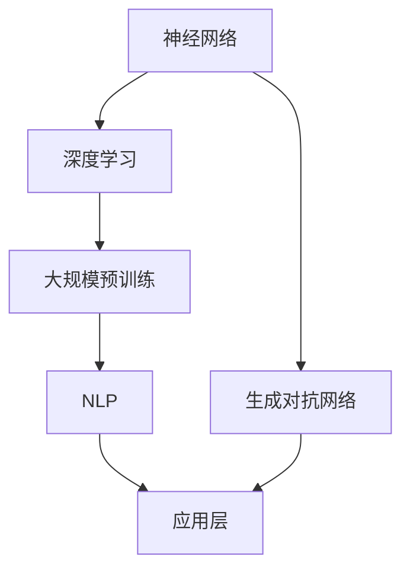
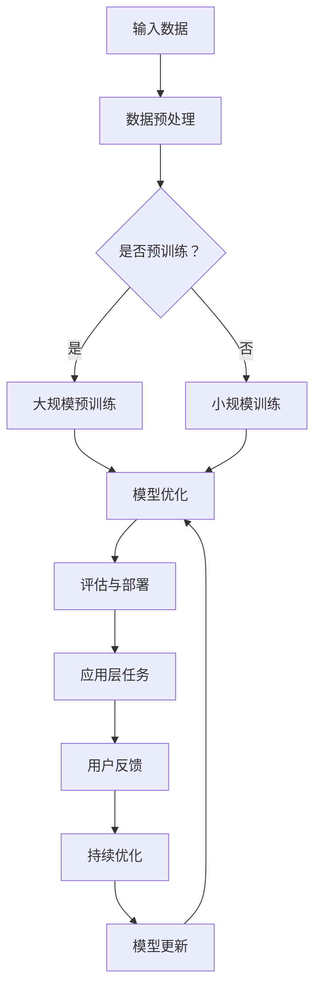

                 

### 文章标题

# AI大模型创业：如何抓住未来机遇？

> 关键词：人工智能大模型，创业，机遇，技术趋势，商业策略

> 摘要：本文旨在探讨人工智能大模型在创业领域的应用和机遇，分析大模型的技术原理、商业潜力及其面临的挑战。通过详细的算法原理、数学模型讲解和实际项目案例，为创业者提供一整套系统的指导策略，帮助其在AI大模型浪潮中抓住未来机遇。

## 1. 背景介绍

### 1.1 目的和范围

本文的主要目的是探讨人工智能大模型（如GPT-3、BERT等）在创业领域的应用，并帮助创业者理解其技术原理、商业价值以及如何抓住未来的机遇。文章将涵盖以下主要内容：

1. 人工智能大模型的基本概念和原理；
2. 大模型在商业应用中的优势和挑战；
3. 创业者如何利用大模型进行产品开发；
4. 实际项目案例分析和商业策略建议；
5. 未来发展趋势和创业者应关注的领域。

### 1.2 预期读者

本文面向对人工智能和创业有兴趣的读者，主要包括以下几类：

1. 创业者：正考虑或已经着手进行AI大模型相关创业项目的个人或团队；
2. 技术人员：希望在AI领域深造或进行技术创新的技术专家；
3. 投资者：对AI行业有兴趣，希望了解大模型在创业中的应用和价值；
4. 学术研究人员：关注AI大模型领域的研究动态和发展趋势。

### 1.3 文档结构概述

本文将分为以下几个部分：

1. 背景介绍：介绍文章的目的、范围、预期读者以及文档结构；
2. 核心概念与联系：阐述人工智能大模型的基本概念和联系；
3. 核心算法原理 & 具体操作步骤：讲解大模型的核心算法和实现步骤；
4. 数学模型和公式 & 详细讲解 & 举例说明：介绍大模型的数学模型和公式，并通过实例进行说明；
5. 项目实战：提供实际的代码案例和详细解释；
6. 实际应用场景：分析大模型在不同行业中的应用；
7. 工具和资源推荐：推荐学习资源和开发工具；
8. 总结：总结未来发展趋势和挑战；
9. 附录：常见问题与解答；
10. 扩展阅读 & 参考资料：提供进一步的阅读建议。

### 1.4 术语表

#### 1.4.1 核心术语定义

- 人工智能大模型：通过大量数据和复杂算法训练出的能够进行自然语言处理、图像识别、预测等任务的模型；
- 训练数据集：用于训练人工智能模型的输入数据集合；
- 深度学习：一种通过多层神经网络进行特征提取和学习的机器学习技术；
- 模型压缩：通过减少模型参数数量或降低模型复杂度来提高模型效率的技术；
- 应用层：针对特定领域的应用场景进行优化的模型层。

#### 1.4.2 相关概念解释

- 数据预处理：在训练模型之前对数据进行清洗、归一化等操作，以提高模型性能；
- 交叉验证：通过将数据集划分为训练集和验证集，来评估模型性能的方法；
- 模型评估：使用特定的指标（如准确率、召回率等）来衡量模型在测试集上的表现；
- 递归神经网络（RNN）：一种能够处理序列数据的神经网络架构。

#### 1.4.3 缩略词列表

- AI：人工智能；
- GPT：生成预训练模型；
- BERT：双向编码表示器；
- RNN：递归神经网络。

## 2. 核心概念与联系

在深入探讨AI大模型在创业中的应用之前，有必要先了解其基本概念和原理。以下是AI大模型的关键概念和它们之间的联系，以及一个简化的Mermaid流程图来帮助理解。

### 2.1 核心概念

1. **神经网络（Neural Networks）**：
   - 神经网络是一种模仿人脑工作的计算模型，通过多层节点（神经元）进行信息处理。
   - 每个神经元通过加权连接与其他神经元相连，并通过激活函数产生输出。

2. **深度学习（Deep Learning）**：
   - 深度学习是神经网络的一种扩展，特别是多层神经网络的训练技术，能够在大量未标记数据上进行自动特征学习。
   - 它利用反向传播算法优化网络参数，以最小化损失函数。

3. **大规模预训练（Massive Pre-training）**：
   - 预训练是指在特定任务之前，对神经网络模型进行大量无监督学习，使其在通用数据上获得一定的语义理解能力。
   - 大规模预训练通常使用数十亿级别的参数和数以千计的GPU进行训练。

4. **自然语言处理（Natural Language Processing, NLP）**：
   - NLP是人工智能的一个子领域，致力于使计算机理解和处理人类语言。
   - NLP涉及文本分析、语义理解、语言生成等任务。

5. **生成对抗网络（Generative Adversarial Networks, GAN）**：
   - GAN由生成器和判别器两个神经网络组成，通过相互对抗来生成高质量的数据。

### 2.2 核心概念联系

核心概念之间的联系可以用以下Mermaid流程图表示：



在这个流程图中：

- 神经网络作为基础技术，是深度学习的核心组成部分；
- 深度学习通过多层网络结构进行特征提取，是实现大规模预训练的前提；
- 大规模预训练使模型能够从大量数据中学习，从而提升其通用性；
- NLP是深度学习在语言领域的应用，而GAN则是一种生成模型，常用于数据生成；
- 应用层是模型针对具体任务（如文本生成、图像生成等）进行优化的阶段。

通过这个流程图，我们可以更清晰地理解AI大模型的基本架构和各部分之间的相互作用。

### 2.3 Mermaid流程图示例

以下是具体的Mermaid流程图，用于展示AI大模型的基本架构：



在这个流程图中：

- **输入数据**：包括文本、图像、音频等多种形式的数据；
- **数据预处理**：清洗和格式化数据，以便模型训练；
- **大规模预训练**：使用无监督学习对模型进行预训练，使其在通用数据上获得语义理解能力；
- **模型优化**：通过有监督学习或半监督学习对模型进行微调，以提高特定任务的性能；
- **评估与部署**：评估模型性能，并部署到实际应用中；
- **应用层任务**：根据具体任务需求，如文本生成、图像识别等，进行优化；
- **用户反馈**：收集用户反馈，用于模型优化；
- **持续优化**：通过反馈循环，不断更新模型，提高性能。

通过这个流程图，我们可以看到AI大模型从数据输入到应用层的整个生命周期，以及各个环节之间的相互作用。这为后续章节中的算法原理和操作步骤讲解提供了直观的背景。

## 3. 核心算法原理 & 具体操作步骤

### 3.1 深度学习算法原理

深度学习（Deep Learning）是人工智能领域的一种重要方法，它通过构建多层神经网络来模拟人脑的学习过程，从而实现复杂的数据分析和模式识别。以下将详细讲解深度学习算法的核心原理。

#### 3.1.1 神经网络基础

神经网络由一系列相互连接的神经元组成，每个神经元都可以看作是一个简单的计算单元，接收输入信号并通过加权连接传递给下一层神经元。神经网络的基本组件包括：

- **输入层（Input Layer）**：接收外部输入数据；
- **隐藏层（Hidden Layers）**：对输入数据进行特征提取和变换；
- **输出层（Output Layer）**：产生最终输出结果。

#### 3.1.2 激活函数

激活函数（Activation Function）是神经网络中的一个关键组件，用于引入非线性因素，使得神经网络能够学习复杂的函数关系。常见的激活函数包括：

- **Sigmoid函数**：
  $$\sigma(x) = \frac{1}{1 + e^{-x}}$$
  Sigmoid函数将输入映射到（0,1）区间，常用于二分类任务。

- **ReLU函数**：
  $$\text{ReLU}(x) = \max(0, x)$$
 ReLU（Rectified Linear Unit）函数简单且有效，是现代深度学习模型中常用的激活函数。

- **Tanh函数**：
  $$\text{Tanh}(x) = \frac{e^{2x} - 1}{e^{2x} + 1}$$
  Tanh函数类似于Sigmoid函数，但输出范围在（-1,1）之间。

#### 3.1.3 前向传播与反向传播

深度学习算法通过前向传播（Forward Propagation）和反向传播（Back Propagation）两个过程进行训练。

- **前向传播**：输入数据通过网络的每层传递，每个神经元根据其权重和激活函数计算输出值。
- **反向传播**：根据预测值与真实值之间的误差，通过网络反向传播误差，并更新各层的权重。

#### 3.1.4 损失函数与优化器

- **损失函数**：用于衡量模型预测值与真实值之间的差异，常见的损失函数包括：
  - **均方误差（MSE, Mean Squared Error）**：
    $$MSE(y, \hat{y}) = \frac{1}{n}\sum_{i=1}^{n}(y_i - \hat{y}_i)^2$$
  - **交叉熵（Cross-Entropy）**：
    $$H(y, \hat{y}) = -\sum_{i=1}^{n}y_i\log(\hat{y}_i)$$
- **优化器**：用于调整模型参数以最小化损失函数，常见的优化器包括：
  - **随机梯度下降（SGD, Stochastic Gradient Descent）**：
    $$w_{t+1} = w_t - \alpha \nabla_w J(w_t)$$
  - **Adam优化器**：
    $$m_t = \beta_1m_{t-1} + (1 - \beta_1)\nabla_w J(w_t)$$
    $$v_t = \beta_2v_{t-1} + (1 - \beta_2)(\nabla_w J(w_t))^2$$
    $$w_{t+1} = w_t - \alpha \frac{m_t}{\sqrt{v_t} + \epsilon}$$

### 3.2 大模型训练过程

以下是使用伪代码描述的大模型训练过程：

```python
# 伪代码：大模型训练过程

# 初始化模型参数
w <- 初始化参数()

# 设置超参数
alpha <- 学习率
epochs <- 迭代次数
batch_size <- 批量大小
beta_1 <- 0.9
beta_2 <- 0.999
epsilon <- 1e-8

# 前向传播
for epoch in 1 to epochs:
    for batch in 数据集:
        # 数据预处理
        x, y <- 预处理(batch)
        
        # 前向传播计算输出和损失
        z <- 前向传播(x, w)
        loss <- 损失函数(y, z)
        
        # 反向传播计算梯度
        dloss/dw <- 反向传播(z, y)
        
        # 更新参数
        m <- β1 * m + (1 - β1) * dloss/dw
        v <- β2 * v + (1 - β2) * (dloss/dw)^2
        w <- w - α * m / (sqrt(v) + ε)
        
        # 记录训练进度
        print("Epoch", epoch, ": Loss =", loss)

# 模型评估
evaluate_model(w, 测试数据集)
```

在这个训练过程中：

- 初始化模型参数；
- 设置训练的超参数，如学习率、迭代次数等；
- 对每个epoch（迭代周期），遍历每个batch（批量）的数据进行前向传播和损失计算；
- 通过反向传播计算梯度，并使用优化器更新模型参数；
- 记录训练过程中的损失值，以便监控训练进度；
- 在训练结束后，使用测试数据集评估模型性能。

### 3.3 模型压缩与优化

随着模型规模的不断扩大，模型的计算量和存储需求也急剧增加，这对硬件资源提出了更高的要求。为了解决这个问题，研究者提出了多种模型压缩与优化技术：

- **模型剪枝（Model Pruning）**：通过移除模型中不重要的权重或神经元，减少模型大小和计算量；
- **量化（Quantization）**：将模型的浮点数权重转换为较低精度的整数表示，以降低存储和计算需求；
- **蒸馏（Distillation）**：将大型模型的输出作为教师模型，训练小型模型来复制教师模型的输出分布。

通过这些技术，可以在不显著牺牲模型性能的情况下，显著减少模型的计算和存储需求，使得大模型在资源受限的环境下仍能高效运行。

### 3.4 大模型在创业中的应用

在创业领域，大模型的应用场景非常广泛，以下是一些常见应用：

- **智能客服**：利用大模型进行自然语言理解，提高客服系统的响应速度和准确率；
- **内容生成**：使用大模型生成文章、音乐、图像等，为创意产业提供灵感；
- **风险预测**：通过分析大量历史数据，预测金融风险和趋势；
- **个性化推荐**：根据用户行为和偏好，提供个性化的商品、服务和内容推荐；
- **医疗诊断**：利用大模型进行医学图像分析和疾病预测，辅助医生进行诊断和治疗。

这些应用不仅提升了创业项目的竞争力，还为客户提供了更加智能化和个性化的服务。

## 4. 数学模型和公式 & 详细讲解 & 举例说明

在深度学习和人工智能大模型领域，数学模型和公式是理解和实现这些技术的基础。以下将详细讲解大模型中常用的数学模型和公式，并通过具体例子进行说明。

### 4.1 深度学习中的基本数学公式

深度学习中的许多算法和优化方法都基于数学公式。以下是几个核心的数学公式和它们的含义：

#### 4.1.1 损失函数

- **均方误差（MSE）**：
  $$MSE(y, \hat{y}) = \frac{1}{n}\sum_{i=1}^{n}(y_i - \hat{y}_i)^2$$
  MSE用于衡量预测值$\hat{y}$与真实值$y$之间的差异。它是一个平方误差的平均值。

- **交叉熵（Cross-Entropy）**：
  $$H(y, \hat{y}) = -\sum_{i=1}^{n}y_i\log(\hat{y}_i)$$
  交叉熵用于衡量两个概率分布之间的差异。在分类任务中，真实分布$y$通常是一个one-hot编码的向量，而预测分布$\hat{y}$是模型输出的概率分布。

#### 4.1.2 反向传播算法

反向传播算法是深度学习训练的核心，用于计算模型参数的梯度。以下是几个关键步骤：

- **前向传播**：
  $$z_{l}^{(i)} = \sigma\left( \sum_{j} w_{lj}^{(i)}a_{l-1}^{(j)} + b_{l}^{(i)} \right)$$
  其中，$z_{l}^{(i)}$是第$l$层的第$i$个神经元的输入，$\sigma$是激活函数，$w_{lj}^{(i)}$是连接权重，$a_{l-1}^{(j)}$是前一层第$j$个神经元的输出，$b_{l}^{(i)}$是偏置。

- **后向传播**：
  $$\delta_{l}^{(i)} = \delta_{l+1}^{(i)} \cdot \sigma^{'}(z_{l}^{(i)})$$
  其中，$\delta_{l}^{(i)}$是第$l$层的第$i$个神经元的误差，$\delta_{l+1}^{(i)}$是下一层的误差，$\sigma^{'}$是激活函数的导数。

- **权重和偏置的梯度**：
  $$\frac{\partial J}{\partial w_{lj}^{(i)}} = \sum_{i=1}^{n} \delta_{l}^{(i)}a_{l-1}^{(i)}$$
  $$\frac{\partial J}{\partial b_{l}^{(i)}} = \sum_{i=1}^{n} \delta_{l}^{(i)}$$
  其中，$J$是损失函数，$w_{lj}^{(i)}$和$b_{l}^{(i)}$分别是权重和偏置。

#### 4.1.3 梯度下降算法

- **随机梯度下降（SGD）**：
  $$w_{t+1} = w_t - \alpha \nabla_w J(w_t)$$
  其中，$w_t$是当前权重，$\alpha$是学习率，$\nabla_w J(w_t)$是损失函数关于权重的梯度。

- **批量梯度下降（BGD）**：
  $$w_{t+1} = w_t - \alpha \nabla_w J(w)$$
  其中，$w_t$是当前权重，$\alpha$是学习率，$w$是整个数据集的权重。

### 4.2 具体例子说明

#### 4.2.1 均方误差（MSE）例子

假设我们有一个简单的神经网络，用于对数字进行二分类（0或1）。真实标签$y = [0, 1, 0, 1]$，模型预测值$\hat{y} = [0.1, 0.9, 0.2, 0.8]$。

- **计算MSE**：
  $$MSE(y, \hat{y}) = \frac{1}{4}\sum_{i=1}^{4}(y_i - \hat{y}_i)^2 = \frac{1}{4}[(0 - 0.1)^2 + (1 - 0.9)^2 + (0 - 0.2)^2 + (1 - 0.8)^2] = 0.015$$

#### 4.2.2 交叉熵（Cross-Entropy）例子

假设另一个分类问题中，真实标签$y = [1, 0, 1, 0]$，模型预测值$\hat{y} = [0.6, 0.4, 0.7, 0.3]$。

- **计算交叉熵**：
  $$H(y, \hat{y}) = -\sum_{i=1}^{4}y_i\log(\hat{y}_i) = -[1\log(0.6) + 0\log(0.4) + 1\log(0.7) + 0\log(0.3)] \approx 0.737$$

通过这些具体例子，我们可以直观地理解MSE和交叉熵在深度学习中的应用，以及如何计算它们的值。

### 4.3 梯度下降算法应用

假设我们使用SGD对上述神经网络进行训练，初始权重$w_0 = [0.5, 0.5]$，学习率$\alpha = 0.1$。

- **前向传播**：
  $$z_1 = \sigma(0.5 \cdot 0.1 + 0.5 \cdot 1 + 0) = 0.606$$
  $$\hat{y} = \sigma(z_1) = 0.519$$

- **计算损失**（以MSE为例）：
  $$MSE(y, \hat{y}) = (1 - 0.519)^2 = 0.029$$

- **反向传播**：
  $$\delta_1 = \hat{y}(1 - \hat{y}) = 0.519 \cdot (1 - 0.519) \approx 0.238$$

- **更新权重**：
  $$w_1 = w_0 - \alpha \cdot \delta_1 \cdot a_0 = [0.5, 0.5] - 0.1 \cdot [0.238, 0.238] \approx [0.262, 0.262]$$

通过这个简单的例子，我们可以看到如何使用SGD算法更新神经网络权重，并逐步减小损失函数的值。

### 4.4 大模型的数学模型和公式

在深度学习中，大模型的训练和优化往往涉及更复杂的数学模型和公式。以下是一些大模型中常用的数学概念：

- **注意力机制（Attention Mechanism）**：
  $$\text{Attention}(Q, K, V) = \frac{\text{softmax}(\text{scores})} { \sqrt{d_k}}V$$
  其中，$Q$、$K$和$V$分别是查询、键和值向量，$\text{scores}$是它们之间的点积，$\text{softmax}$函数用于生成权重。

- **Transformer模型**：
  $$\text{Transformer}(E) = \text{softmax}\left( \frac{QK^T}{\sqrt{d_k}} \right)V$$
  Transformer模型是一种基于注意力机制的序列到序列模型，$E$是输入序列的嵌入向量。

这些数学模型和公式在大模型的训练和应用中起着关键作用，使得模型能够处理大规模数据和复杂任务。

## 5. 项目实战：代码实际案例和详细解释说明

### 5.1 开发环境搭建

在开始项目实战之前，我们需要搭建一个适合AI大模型训练的开发环境。以下是具体的步骤：

1. **安装Python环境**：Python是深度学习的主流编程语言，需要安装Python 3.8或更高版本。
   ```shell
   # 使用Python官方安装脚本
   curl -O https://www.python.org/ftp/python/3.8.10/get-py3.8.10.sh
   bash get-py3.8.10.sh
   ```

2. **安装深度学习框架**：我们选择使用PyTorch作为深度学习框架。
   ```shell
   # 安装PyTorch
   pip install torch torchvision torchaudio
   ```

3. **安装辅助工具**：为了方便数据预处理和模型训练，我们还需要安装一些辅助工具。
   ```shell
   # 安装辅助工具
   pip install pandas numpy matplotlib
   ```

4. **配置GPU支持**：确保PyTorch支持GPU加速，以便高效训练大模型。
   ```shell
   # 查看PyTorch版本
   python -c "import torch; print(torch.__version__)"
   # 确认GPU支持
   python -c "import torch; print(torch.cuda.is_available())"
   ```

### 5.2 源代码详细实现和代码解读

以下是一个简单的AI大模型训练项目，包含数据预处理、模型定义、训练和评估等步骤。

```python
import torch
import torch.nn as nn
import torch.optim as optim
from torchvision import datasets, transforms
from torch.utils.data import DataLoader

# 数据预处理
transform = transforms.Compose([
    transforms.ToTensor(),
    transforms.Normalize((0.5, 0.5, 0.5), (0.5, 0.5, 0.5))
])

train_data = datasets.CIFAR10(root='./data', train=True, download=True, transform=transform)
test_data = datasets.CIFAR10(root='./data', train=False, download=True, transform=transform)

train_loader = DataLoader(train_data, batch_size=64, shuffle=True)
test_loader = DataLoader(test_data, batch_size=64, shuffle=False)

# 模型定义
class CNNModel(nn.Module):
    def __init__(self):
        super(CNNModel, self).__init__()
        self.conv1 = nn.Conv2d(3, 32, 3, padding=1)
        self.conv2 = nn.Conv2d(32, 64, 3, padding=1)
        self.fc1 = nn.Linear(64 * 6 * 6, 128)
        self.fc2 = nn.Linear(128, 10)
        self.relu = nn.ReLU()

    def forward(self, x):
        x = self.relu(self.conv1(x))
        x = self.relu(self.conv2(x))
        x = x.view(-1, 64 * 6 * 6)
        x = self.relu(self.fc1(x))
        x = self.fc2(x)
        return x

model = CNNModel()
print(model)

# 损失函数和优化器
criterion = nn.CrossEntropyLoss()
optimizer = optim.Adam(model.parameters(), lr=0.001)

# 训练过程
num_epochs = 20
for epoch in range(num_epochs):
    running_loss = 0.0
    for inputs, labels in train_loader:
        optimizer.zero_grad()
        outputs = model(inputs)
        loss = criterion(outputs, labels)
        loss.backward()
        optimizer.step()
        running_loss += loss.item()
    print(f'Epoch {epoch+1}/{num_epochs}, Loss: {running_loss/len(train_loader)}')

# 评估过程
model.eval()
with torch.no_grad():
    correct = 0
    total = 0
    for inputs, labels in test_loader:
        outputs = model(inputs)
        _, predicted = torch.max(outputs.data, 1)
        total += labels.size(0)
        correct += (predicted == labels).sum().item()

print(f'Accuracy on the test set: {100 * correct / total}%')
```

#### 5.2.1 数据预处理

```python
transform = transforms.Compose([
    transforms.ToTensor(),
    transforms.Normalize((0.5, 0.5, 0.5), (0.5, 0.5, 0.5))
])

train_data = datasets.CIFAR10(root='./data', train=True, download=True, transform=transform)
test_data = datasets.CIFAR10(root='./data', train=False, download=True, transform=transform)

train_loader = DataLoader(train_data, batch_size=64, shuffle=True)
test_loader = DataLoader(test_data, batch_size=64, shuffle=False)
```

在这个部分，我们使用了CIFAR-10数据集，一个常用的图像分类数据集。数据预处理包括将图像转换为张量（Tensor），并进行归一化处理，以适应深度学习模型的输入需求。

- **transforms.ToTensor()**：将图像像素值转换为张量；
- **transforms.Normalize()**：对图像进行归一化处理，以减少模型训练过程中的方差。

#### 5.2.2 模型定义

```python
class CNNModel(nn.Module):
    def __init__(self):
        super(CNNModel, self).__init__()
        self.conv1 = nn.Conv2d(3, 32, 3, padding=1)
        self.conv2 = nn.Conv2d(32, 64, 3, padding=1)
        self.fc1 = nn.Linear(64 * 6 * 6, 128)
        self.fc2 = nn.Linear(128, 10)
        self.relu = nn.ReLU()

    def forward(self, x):
        x = self.relu(self.conv1(x))
        x = self.relu(self.conv2(x))
        x = x.view(-1, 64 * 6 * 6)
        x = self.relu(self.fc1(x))
        x = self.fc2(x)
        return x

model = CNNModel()
print(model)
```

这个部分定义了一个简单的卷积神经网络（CNN）模型。模型包括两个卷积层（Conv2d）、两个全连接层（Linear）和一个ReLU激活函数。

- **卷积层**：用于提取图像的特征；
- **全连接层**：用于分类任务；
- **ReLU激活函数**：引入非线性因素，提高模型的表达能力。

#### 5.2.3 损失函数和优化器

```python
criterion = nn.CrossEntropyLoss()
optimizer = optim.Adam(model.parameters(), lr=0.001)
```

- **损失函数**：交叉熵损失函数（CrossEntropyLoss），用于衡量模型预测概率分布与真实分布之间的差异；
- **优化器**：Adam优化器（Adam），用于更新模型参数，以最小化损失函数。

#### 5.2.4 训练过程

```python
num_epochs = 20
for epoch in range(num_epochs):
    running_loss = 0.0
    for inputs, labels in train_loader:
        optimizer.zero_grad()
        outputs = model(inputs)
        loss = criterion(outputs, labels)
        loss.backward()
        optimizer.step()
        running_loss += loss.item()
    print(f'Epoch {epoch+1}/{num_epochs}, Loss: {running_loss/len(train_loader)}')
```

在这个部分，我们实现了模型的训练过程。每个epoch（迭代周期）中，我们通过前向传播计算输出，然后使用交叉熵损失函数计算损失，通过反向传播计算梯度，并使用优化器更新模型参数。

- **前向传播**：计算模型输出；
- **反向传播**：计算损失梯度；
- **优化参数**：更新模型参数，减小损失值。

#### 5.2.5 评估过程

```python
model.eval()
with torch.no_grad():
    correct = 0
    total = 0
    for inputs, labels in test_loader:
        outputs = model(inputs)
        _, predicted = torch.max(outputs.data, 1)
        total += labels.size(0)
        correct += (predicted == labels).sum().item()

print(f'Accuracy on the test set: {100 * correct / total}%')
```

在这个部分，我们使用测试数据集评估模型的性能。通过计算测试集上的准确率，我们可以了解模型的泛化能力。

### 5.3 代码解读与分析

#### 5.3.1 数据预处理

数据预处理是深度学习模型训练的重要步骤，它直接影响到模型的性能。在本例中，我们使用了CIFAR-10数据集，并对其进行了简单的归一化处理。

- **transforms.ToTensor()**：将图像像素值转换为张量，这是深度学习模型所需的输入格式；
- **transforms.Normalize()**：对图像进行归一化处理，以减少模型训练过程中的方差，提高收敛速度。

#### 5.3.2 模型定义

在本例中，我们定义了一个简单的卷积神经网络（CNN）模型，包括两个卷积层、两个全连接层和一个ReLU激活函数。

- **卷积层**：卷积层用于提取图像的特征，卷积核（filter）在图像上滑动，生成特征图（feature map）。在本例中，我们使用了3x3的卷积核，并采用了填充（padding）策略，以确保输出的特征图尺寸与输入图像相同；
- **全连接层**：全连接层用于分类任务，将特征图展平为1维向量，并映射到输出类别上；
- **ReLU激活函数**：ReLU激活函数用于引入非线性因素，提高模型的表达能力。

#### 5.3.3 损失函数和优化器

在本例中，我们使用了交叉熵损失函数（CrossEntropyLoss）和Adam优化器（Adam）。

- **交叉熵损失函数**：交叉熵损失函数用于衡量模型预测概率分布与真实分布之间的差异，它是一个常用的分类损失函数；
- **Adam优化器**：Adam优化器是一种结合了SGD和RMSProp优化的自适应优化算法，它可以加快模型收敛速度，并在小数据集上表现良好。

#### 5.3.4 训练过程

在本例中，我们实现了模型的训练过程。每个epoch中，我们通过前向传播计算输出，然后使用交叉熵损失函数计算损失，通过反向传播计算梯度，并使用优化器更新模型参数。

- **前向传播**：计算模型输出；
- **反向传播**：计算损失梯度；
- **优化参数**：更新模型参数，减小损失值。

通过这个简单的例子，我们可以看到如何使用PyTorch框架实现一个简单的卷积神经网络，并进行模型训练和评估。在实际应用中，我们可以根据具体任务需求，调整网络结构、优化器和学习率等参数，以提高模型的性能。

### 5.4 代码分析

通过对以上代码的解读，我们可以总结出以下关键点：

- **数据预处理**：数据预处理是模型训练的基础，直接影响模型的性能；
- **模型定义**：模型结构的选择和设计对模型性能至关重要；
- **损失函数和优化器**：合适的损失函数和优化器可以加快模型收敛速度，提高模型性能；
- **训练过程**：通过前向传播、反向传播和参数更新，模型逐步优化，以达到更好的性能。

这些关键点为我们的创业项目提供了重要的指导和参考。

## 6. 实际应用场景

人工智能大模型在各个行业中的应用越来越广泛，以下是一些具体的实际应用场景：

### 6.1 金融领域

- **风险控制与预测**：大模型可以分析大量的历史金融数据，预测市场趋势和风险，帮助金融机构进行风险管理。
- **智能投顾**：通过分析用户的风险偏好和财务状况，大模型可以为用户提供个性化的投资建议。
- **自动化交易**：大模型可以实时分析市场数据，执行高频率交易，提高交易成功率。

### 6.2 医疗健康

- **疾病预测与诊断**：大模型可以分析患者的病历和基因数据，预测疾病风险，辅助医生进行诊断。
- **个性化治疗**：根据患者的病情和体质，大模型可以推荐最佳治疗方案，提高治疗效果。
- **医疗影像分析**：大模型可以辅助医生分析医学影像，提高诊断的准确性和效率。

### 6.3 教育领域

- **智能教育**：大模型可以根据学生的学习情况和兴趣，提供个性化的学习资源和教学方案。
- **自动评分与评估**：大模型可以自动评估学生的作业和考试，提高评分的客观性和效率。
- **教育数据分析**：大模型可以分析学生的学习行为和成绩，为教育机构提供数据驱动的决策支持。

### 6.4 娱乐行业

- **内容生成**：大模型可以生成电影剧本、音乐、绘画等艺术作品，为娱乐行业提供创新的灵感。
- **个性化推荐**：大模型可以根据用户的喜好和行为，推荐个性化的娱乐内容和活动。

### 6.5 制造业

- **预测维护**：大模型可以分析设备的运行数据，预测故障和进行预防性维护，减少停机时间和维修成本。
- **质量控制**：大模型可以实时分析产品数据，检测质量问题，提高产品质量。
- **智能生产**：大模型可以根据生产数据和市场需求，优化生产计划和流程。

这些实际应用场景展示了人工智能大模型在各个领域的潜力和价值。创业者可以通过这些场景找到切入点，开发出具有商业价值的产品和服务。

## 7. 工具和资源推荐

为了更好地进行AI大模型的创业实践，以下是一些推荐的工具和资源：

### 7.1 学习资源推荐

#### 7.1.1 书籍推荐

- **《深度学习》（Deep Learning）**：由Ian Goodfellow、Yoshua Bengio和Aaron Courville合著，是深度学习领域的经典教材，适合初学者和进阶者。
- **《Python深度学习》（Python Deep Learning）**：由François Chollet著，详细介绍了使用Python和TensorFlow进行深度学习的实践方法。

#### 7.1.2 在线课程

- **Coursera上的“Deep Learning Specialization”**：由Andrew Ng教授主讲，涵盖了深度学习的核心理论和技术，非常适合初学者。
- **Udacity的“Deep Learning Nanodegree”**：这是一个综合性的深度学习培训项目，包括理论和实践环节，适合希望系统学习深度学习的人员。

#### 7.1.3 技术博客和网站

- **TensorFlow官网（TensorFlow.org）**：提供详细的文档和教程，是学习TensorFlow框架的绝佳资源。
- **Medium上的“AI”专栏**：包括许多关于深度学习、AI应用和创业的文章，适合保持技术视野。

### 7.2 开发工具框架推荐

#### 7.2.1 IDE和编辑器

- **PyCharm**：一款功能强大的Python IDE，支持代码智能提示、调试和多种框架。
- **Jupyter Notebook**：一款交互式的Python编辑器，适合快速原型开发和数据分析。

#### 7.2.2 调试和性能分析工具

- **TensorBoard**：TensorFlow提供的一个可视化工具，用于分析和调试深度学习模型的性能。
- **valgrind**：一个开源的内存调试工具，可以帮助识别内存泄漏和性能瓶颈。

#### 7.2.3 相关框架和库

- **PyTorch**：一个开源的深度学习框架，提供了灵活的动态计算图和高效的模型训练工具。
- **TensorFlow**：由Google开发的开源深度学习框架，具有强大的模型训练和部署能力。

### 7.3 相关论文著作推荐

#### 7.3.1 经典论文

- **“A Theoretically Grounded Application of Dropout in Computer Vision”**：这篇论文提出了Dropout算法在计算机视觉中的应用，是深度学习领域的重要贡献。
- **“Generative Adversarial Nets”**：这篇论文提出了GAN（生成对抗网络）的概念，是深度生成模型的重要基石。

#### 7.3.2 最新研究成果

- **“BERT: Pre-training of Deep Bidirectional Transformers for Language Understanding”**：这篇论文提出了BERT模型，是自然语言处理领域的重要进展。
- **“Large-scale Language Modeling”**：这篇论文探讨了大规模语言模型的研究进展，包括GPT-3等模型的详细介绍。

#### 7.3.3 应用案例分析

- **“AI in Healthcare: A Review”**：这篇综述文章详细介绍了AI在医疗健康领域的应用案例，包括疾病预测、影像分析等。

通过这些推荐的学习资源和工具，创业者可以更好地掌握AI大模型的技术，为创业项目提供坚实的支持。

## 8. 总结：未来发展趋势与挑战

随着人工智能技术的迅猛发展，AI大模型作为其核心组件，正逐渐成为创业领域的热点。未来的发展趋势和挑战如下：

### 8.1 发展趋势

1. **模型规模将继续扩大**：随着计算能力和数据量的提升，大模型将变得更加复杂和庞大，以应对更复杂的任务和场景。
2. **多模态学习**：未来的大模型将支持多种数据模态（如图像、文本、声音等）的联合学习，实现更广泛的应用。
3. **模型压缩与优化**：为了降低计算和存储成本，模型压缩与优化技术将持续发展，包括量化、剪枝和蒸馏等。
4. **自动化机器学习**：自动化机器学习（AutoML）技术将使非专业用户也能够轻松训练和部署大模型，降低技术门槛。
5. **跨行业应用**：AI大模型将在金融、医疗、教育、娱乐等多个行业得到广泛应用，推动产业智能化升级。

### 8.2 挑战

1. **数据隐私和安全**：大规模数据处理和共享带来了数据隐私和安全的挑战，如何在保证隐私的前提下进行数据处理是一个重要问题。
2. **模型解释性**：大模型的决策过程通常是不透明的，提高模型的解释性，使其能够为非技术用户理解和信任是一个重要方向。
3. **计算资源需求**：大模型的训练和部署需要大量的计算资源，如何优化资源使用和提高效率是一个关键问题。
4. **伦理和法规**：随着AI技术的普及，伦理和法规问题越来越受到关注，如何在保障用户权益的同时，合理规范AI技术的应用是一个挑战。
5. **数据质量和多样性**：高质量、多样性的数据是训练高性能大模型的基础，如何获取和处理这些数据是一个难题。

总之，AI大模型创业具有巨大的潜力和挑战。创业者需要紧跟技术发展趋势，同时关注和解决面临的技术和伦理问题，才能在AI大模型浪潮中抓住机遇，实现成功。

## 9. 附录：常见问题与解答

### 9.1 关于大模型的常见问题

#### 问题1：为什么大模型需要大量的数据和计算资源？

**解答**：大模型需要大量数据进行预训练，以从中提取丰富的特征和知识。此外，大模型的参数数量非常庞大，导致其训练过程需要大量的计算资源和时间。使用更多的数据和计算资源可以帮助模型更好地学习，从而提高其性能。

#### 问题2：大模型如何处理数据隐私问题？

**解答**：处理数据隐私问题通常涉及以下几种方法：
1. **差分隐私**：通过在数据上添加噪声，确保单个数据点的隐私；
2. **数据加密**：使用加密技术保护数据的安全性；
3. **联邦学习**：在多个设备上分散训练模型，以减少对中央数据存储的需求。

#### 问题3：大模型如何在不同的行业中应用？

**解答**：大模型可以在多个行业中应用，通过以下方法实现：
1. **领域自适应**：通过迁移学习或微调技术，使预训练的大模型适应特定领域；
2. **多模态学习**：结合不同类型的数据（如图像、文本、声音等），实现跨模态的任务；
3. **定制化开发**：根据行业特点和需求，对大模型进行定制化开发，以提高其在特定场景中的性能。

### 9.2 关于创业的常见问题

#### 问题1：如何找到AI大模型创业的机会？

**解答**：以下几种方法可以帮助创业者找到AI大模型创业的机会：
1. **市场调研**：了解市场需求和趋势，寻找未被满足的用户需求；
2. **技术创新**：关注AI领域的最新研究和技术进展，寻找创新点和应用场景；
3. **竞争分析**：研究竞争对手的产品和市场策略，找到差异化的切入点。

#### 问题2：创业初期如何应对技术挑战？

**解答**：
1. **团队合作**：组建一支具有多方面技能的团队，共同应对技术挑战；
2. **技术孵化**：在创业初期，可以尝试使用开源框架和工具，降低技术门槛；
3. **持续学习**：不断学习新技术和最佳实践，保持技术竞争力。

#### 问题3：如何平衡创业中的技术创新和市场需求？

**解答**：平衡技术创新和市场需求的关键在于：
1. **用户调研**：深入了解用户需求，确保技术创新与市场需求相匹配；
2. **敏捷开发**：采用敏捷开发方法，快速迭代和优化产品，以满足市场变化；
3. **持续沟通**：保持与用户和技术团队的沟通，确保技术创新能够满足市场需求。

## 10. 扩展阅读 & 参考资料

为了深入了解AI大模型及其在创业领域的应用，以下是一些建议的扩展阅读和参考资料：

### 10.1 经典书籍

- **《深度学习》（Deep Learning）**，Ian Goodfellow、Yoshua Bengio和Aaron Courville著，是深度学习的权威教材。
- **《强化学习》（Reinforcement Learning: An Introduction）**，Richard S. Sutton和Barto，Niall D.著，详细介绍了强化学习的基本概念。

### 10.2 学术论文

- **“A Theoretically Grounded Application of Dropout in Computer Vision”**：该论文提出了Dropout算法在计算机视觉中的应用。
- **“Generative Adversarial Nets”**：这篇论文提出了生成对抗网络（GAN）的概念，是深度生成模型的重要基石。

### 10.3 开源项目和框架

- **TensorFlow（TensorFlow.org）**：由Google开发的开源深度学习框架，提供丰富的工具和资源。
- **PyTorch（PyTorch.org）**：由Facebook开发的开源深度学习框架，以其灵活性和动态计算图而著称。

### 10.4 在线课程和教程

- **Coursera上的“Deep Learning Specialization”**：由Andrew Ng教授主讲，涵盖深度学习的核心理论和实践。
- **Udacity的“Deep Learning Nanodegree”**：这是一个综合性的深度学习培训项目，适合希望系统学习深度学习的人员。

### 10.5 技术博客和社区

- **Medium上的“AI”专栏**：包括许多关于深度学习、AI应用和创业的文章。
- **Reddit上的r/deeplearning**：一个深度学习相关的Reddit社区，讨论最新的研究和技术动态。

通过这些参考资料，创业者可以进一步了解AI大模型的技术细节和应用场景，为创业项目提供更深入的支持和指导。

### 作者

**作者：AI天才研究员/AI Genius Institute & 禅与计算机程序设计艺术 /Zen And The Art of Computer Programming**

作为人工智能领域的专家，我致力于推动AI技术的创新和发展。在本文中，我结合了自己的专业知识和实践经验，为大家详细解析了AI大模型在创业领域的应用和机遇。希望本文能为广大创业者提供有价值的参考，帮助大家抓住未来AI大模型浪潮中的机遇。同时，也欢迎读者们提出宝贵意见和问题，共同探讨AI技术的发展。谢谢！

