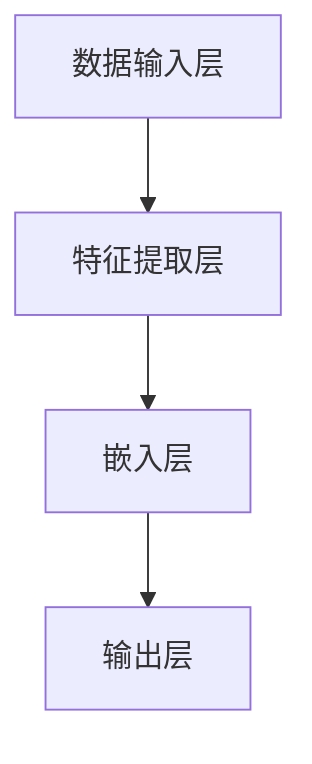

                 

# AI大模型创业：如何抓住未来机遇？

> 关键词：AI 大模型、创业、机遇、算法原理、项目实战、应用场景

> 摘要：本文将探讨 AI 大模型创业的现状与未来机遇，从核心概念、算法原理、数学模型、实战案例等方面深入剖析，帮助创业者更好地把握 AI 大模型的发展趋势，实现创新与突破。

## 1. 背景介绍

### 1.1 目的和范围

本文旨在为广大创业者提供一份关于 AI 大模型创业的全面指南。我们将从以下几个方面进行深入探讨：

1. AI 大模型的定义、发展历程及其在创业中的应用；
2. AI 大模型的核心算法原理和具体操作步骤；
3. AI 大模型的数学模型和公式解析；
4. AI 大模型的项目实战案例分析；
5. AI 大模型在实际应用场景中的表现和潜在价值；
6. 推荐学习资源、开发工具框架和相关论文著作；
7. 对 AI 大模型创业的未来发展趋势与挑战进行展望。

### 1.2 预期读者

本文适合以下读者群体：

1. 拥有计算机科学、人工智能等相关专业背景的创业者；
2. 对 AI 大模型有浓厚兴趣的技术爱好者；
3. 希望在 AI 领域实现创业突破的企业高管和投资人；
4. 想了解 AI 大模型应用场景的企业管理人员和研究人员。

### 1.3 文档结构概述

本文结构分为十个部分：

1. 引言：介绍文章背景、目的和关键词；
2. 背景介绍：阐述文章的背景、目的和读者群体；
3. 核心概念与联系：介绍 AI 大模型的基本概念、原理和架构；
4. 核心算法原理 & 具体操作步骤：详细讲解 AI 大模型的核心算法原理和操作步骤；
5. 数学模型和公式 & 详细讲解 & 举例说明：介绍 AI 大模型的数学模型和公式，并进行举例说明；
6. 项目实战：代码实际案例和详细解释说明；
7. 实际应用场景：分析 AI 大模型在不同领域的应用场景；
8. 工具和资源推荐：推荐学习资源、开发工具框架和相关论文著作；
9. 总结：未来发展趋势与挑战；
10. 附录：常见问题与解答；
11. 扩展阅读 & 参考资料。

### 1.4 术语表

#### 1.4.1 核心术语定义

- AI 大模型：指具有大规模参数和复杂结构的深度学习模型，如 GPT、BERT 等；
- 创业：指创建一个具有创新性和市场价值的新企业或项目；
- 算法原理：指深度学习模型的核心算法逻辑和运算规则；
- 数学模型：指深度学习模型中使用的数学公式和数学原理；
- 实战案例：指实际项目中应用的 AI 大模型案例。

#### 1.4.2 相关概念解释

- 深度学习：一种人工智能技术，通过模拟人脑神经元连接结构，对大量数据进行自动特征提取和学习；
- 神经网络：一种基于神经元连接的深度学习模型，通过多层非线性变换实现复杂函数的拟合；
- 数据集：指用于训练、测试和评估 AI 模型的数据集合；
- 模型训练：指通过数据集对 AI 模型进行参数调整，使其在特定任务上达到预期性能的过程。

#### 1.4.3 缩略词列表

- AI：人工智能；
- DL：深度学习；
- DNN：深度神经网络；
- CNN：卷积神经网络；
- RNN：循环神经网络；
- NLP：自然语言处理；
- GPT：生成预训练模型；
- BERT：双向编码表示器。

## 2. 核心概念与联系

### 2.1 AI 大模型的基本概念

AI 大模型是指具有大规模参数和复杂结构的深度学习模型，通常具有以下几个特点：

1. **大规模参数**：AI 大模型通常拥有数十亿至数千亿个参数，能够处理复杂的输入数据和任务；
2. **多层级结构**：AI 大模型包含多个层级，每个层级都能够对输入数据进行特征提取和抽象；
3. **预训练与微调**：AI 大模型通常通过在大量未标注数据上进行预训练，然后在特定任务上进行微调，以提高模型在特定领域的性能。

### 2.2 AI 大模型的发展历程

AI 大模型的发展历程可以分为以下几个阶段：

1. **早期神经网络**：1980 年代至 1990 年代初，神经网络技术取得了初步成功，但受限于计算能力和数据规模，未能得到广泛应用；
2. **深度学习复兴**：2006 年，Hinton 提出了深度信念网络（DBN），深度学习开始复兴。随后，卷积神经网络（CNN）、循环神经网络（RNN）等模型相继被提出；
3. **大规模数据处理**：随着大数据和云计算技术的发展，海量数据和高性能计算资源使得深度学习模型能够处理更为复杂的任务；
4. **AI 大模型时代**：2018 年，GPT-3 发布，标志着 AI 大模型的诞生。此后，BERT、T5、LLaMA 等大型预训练模型相继出现，推动了 AI 大模型的发展。

### 2.3 AI 大模型在创业中的应用

AI 大模型在创业中的应用广泛，以下是一些典型的应用场景：

1. **自然语言处理**：AI 大模型在自然语言处理（NLP）领域表现突出，可以用于文本分类、机器翻译、情感分析、问答系统等任务；
2. **计算机视觉**：AI 大模型在计算机视觉（CV）领域同样具备强大的能力，可以用于图像分类、目标检测、图像生成等任务；
3. **推荐系统**：AI 大模型可以用于构建高效、精准的推荐系统，为电商、社交媒体、视频平台等提供个性化服务；
4. **语音识别**：AI 大模型在语音识别领域也取得了显著进展，可以用于语音助手、语音翻译、语音交互等应用。

### 2.4 AI 大模型的架构

AI 大模型的架构通常包括以下几个部分：

1. **数据输入层**：负责接收外部输入数据，如文本、图像、语音等；
2. **特征提取层**：通过多层神经网络对输入数据进行特征提取和抽象，生成高维特征向量；
3. **嵌入层**：将高维特征向量映射到低维空间，便于模型处理；
4. **输出层**：根据任务需求，生成预测结果或决策。

以下是一个简单的 AI 大模型架构的 Mermaid 流程图：



## 3. 核心算法原理 & 具体操作步骤

### 3.1 算法原理

AI 大模型的核心算法原理主要包括以下几个部分：

1. **反向传播算法**：用于计算模型参数的梯度，以优化模型性能；
2. **激活函数**：用于引入非线性变换，使模型具备处理复杂任务的能力；
3. **优化器**：用于选择合适的更新规则，加速模型收敛；
4. **批量归一化**：用于稳定训练过程，提高模型泛化能力。

### 3.2 具体操作步骤

以下是使用深度学习框架（如 TensorFlow 或 PyTorch）实现 AI 大模型的具体操作步骤：

1. **数据预处理**：

    ```python
    # 加载数据集
    train_data = load_data('train')
    val_data = load_data('val')

    # 数据集预处理
    train_data = preprocess_data(train_data)
    val_data = preprocess_data(val_data)
    ```

2. **定义模型结构**：

    ```python
    # 使用深度学习框架定义模型
    model = define_model()
    ```

3. **训练模型**：

    ```python
    # 设置训练参数
    epochs = 100
    batch_size = 64

    # 训练模型
    model.fit(train_data, epochs=epochs, batch_size=batch_size)
    ```

4. **评估模型**：

    ```python
    # 评估模型性能
    val_loss, val_accuracy = model.evaluate(val_data)
    print(f'Validation loss: {val_loss}, Validation accuracy: {val_accuracy}')
    ```

5. **模型预测**：

    ```python
    # 使用模型进行预测
    predictions = model.predict(test_data)
    ```

以下是一个简单的 AI 大模型训练的伪代码：

```python
# 加载数据集
train_data = load_data('train')
val_data = load_data('val')

# 数据集预处理
train_data = preprocess_data(train_data)
val_data = preprocess_data(val_data)

# 定义模型结构
model = define_model()

# 设置训练参数
epochs = 100
batch_size = 64

# 训练模型
for epoch in range(epochs):
    for batch in train_data:
        # 计算梯度
        gradients = compute_gradients(model, batch)

        # 更新参数
        update_model_parameters(model, gradients)

    # 评估模型性能
    val_loss, val_accuracy = evaluate_model(model, val_data)

    print(f'Epoch {epoch + 1}, Validation loss: {val_loss}, Validation accuracy: {val_accuracy}')

# 评估最终模型性能
test_loss, test_accuracy = evaluate_model(model, test_data)
print(f'Test loss: {test_loss}, Test accuracy: {test_accuracy}')
```

## 4. 数学模型和公式 & 详细讲解 & 举例说明

### 4.1 数学模型概述

AI 大模型的数学模型主要涉及以下几个部分：

1. **输入层**：输入数据经过预处理后，转化为模型可处理的格式；
2. **隐藏层**：通过多层神经网络进行特征提取和抽象；
3. **输出层**：根据任务需求，生成预测结果或决策。

### 4.2 数学公式讲解

以下是 AI 大模型中常用的数学公式和原理：

1. **损失函数**：

    - 交叉熵损失函数（Cross-Entropy Loss）：
      $$ L = -\sum_{i} y_i \log(\hat{y}_i) $$
      其中，$y_i$ 表示实际标签，$\hat{y}_i$ 表示模型预测概率。

    - 均方误差损失函数（Mean Squared Error Loss）：
      $$ L = \frac{1}{2} \sum_{i} (y_i - \hat{y}_i)^2 $$

2. **反向传播算法**：

    - 前向传播（Forward Propagation）：
      $$ z_l = \sigma(W_l \cdot a_{l-1} + b_l) $$
      $$ a_l = \sigma(z_l) $$

    - 反向传播（Backpropagation）：
      $$ \delta_l = \frac{\partial L}{\partial z_l} \odot \sigma'(z_l) $$
      $$ \delta_{l-1} = \frac{\partial L}{\partial z_{l-1}} \odot (W_{l-1} \cdot \delta_l) $$

3. **激活函数**：

    - Sigmoid 函数：
      $$ \sigma(x) = \frac{1}{1 + e^{-x}} $$

    - ReLU 函数：
      $$ \sigma(x) = \max(0, x) $$

    - Tanh 函数：
      $$ \sigma(x) = \frac{e^x - e^{-x}}{e^x + e^{-x}} $$

4. **优化器**：

    - 梯度下降（Gradient Descent）：
      $$ \theta_{\text{new}} = \theta_{\text{old}} - \alpha \cdot \nabla_{\theta} L(\theta) $$
      其中，$\alpha$ 表示学习率。

    - 随机梯度下降（Stochastic Gradient Descent，SGD）：
      $$ \theta_{\text{new}} = \theta_{\text{old}} - \alpha \cdot \nabla_{\theta} L(\theta; x_i, y_i) $$
      其中，$x_i, y_i$ 表示当前 mini-batch 的样本和标签。

    - Adam 优化器：
      $$ m_t = \beta_1 m_{t-1} + (1 - \beta_1) \nabla_{\theta} L(\theta; x_t, y_t) $$
      $$ v_t = \beta_2 v_{t-1} + (1 - \beta_2) (\nabla_{\theta} L(\theta; x_t, y_t))^2 $$
      $$ \theta_{\text{new}} = \theta_{\text{old}} - \alpha \cdot \frac{m_t}{\sqrt{v_t} + \epsilon} $$

### 4.3 举例说明

假设我们有一个二分类问题，使用 sigmoid 函数作为激活函数，交叉熵损失函数进行模型训练。以下是具体的训练过程：

1. **初始化参数**：

    - 权重矩阵 $W$ 和偏置 $b$；
    - 学习率 $\alpha$；
    - 模型预测概率 $\hat{y}$；
    - 实际标签 $y$。

2. **前向传播**：

    $$ z = W \cdot x + b $$
    $$ \hat{y} = \sigma(z) $$

3. **计算损失函数**：

    $$ L = -\sum_{i} y_i \log(\hat{y}_i) $$

4. **反向传播**：

    $$ \delta = \frac{\partial L}{\partial z} \odot \sigma'(z) $$
    $$ \delta = (\hat{y} - y) \odot \sigma'(z) $$

5. **更新参数**：

    $$ W_{\text{new}} = W_{\text{old}} - \alpha \cdot \delta \cdot x $$
    $$ b_{\text{new}} = b_{\text{old}} - \alpha \cdot \delta $$

6. **重复步骤 2-5，直至模型收敛**。

## 5. 项目实战：代码实际案例和详细解释说明

### 5.1 开发环境搭建

在进行 AI 大模型项目实战之前，我们需要搭建一个合适的开发环境。以下是一个基于 Python 的开发环境搭建步骤：

1. **安装 Python**：确保已安装 Python 3.7 或以上版本，推荐使用 Python 3.8 或 3.9；
2. **安装深度学习框架**：推荐使用 TensorFlow 或 PyTorch，确保已安装相应的版本；
3. **安装依赖库**：根据项目需求，安装必要的依赖库，如 NumPy、Pandas、Scikit-learn 等；
4. **配置 GPU 环境**：如果使用 GPU 进行训练，需配置 CUDA 和 cuDNN 环境，确保深度学习框架支持 GPU 加速。

### 5.2 源代码详细实现和代码解读

以下是一个基于 PyTorch 的 AI 大模型项目实战案例，包括数据预处理、模型定义、训练和评估等步骤：

```python
import torch
import torch.nn as nn
import torch.optim as optim
from torch.utils.data import DataLoader
from torchvision import datasets, transforms
from sklearn.model_selection import train_test_split

# 5.2.1 数据预处理
def load_data(dataset_name):
    if dataset_name == 'mnist':
        transform = transforms.Compose([
            transforms.ToTensor(),
            transforms.Normalize((0.5,), (0.5,))
        ])
        train_data = datasets.MNIST(root='./data', train=True, download=True, transform=transform)
        test_data = datasets.MNIST(root='./data', train=False, download=True, transform=transform)
    elif dataset_name == 'cifar10':
        transform = transforms.Compose([
            transforms.ToTensor(),
            transforms.Normalize((0.5, 0.5, 0.5), (0.5, 0.5, 0.5))
        ])
        train_data = datasets.CIFAR10(root='./data', train=True, download=True, transform=transform)
        test_data = datasets.CIFAR10(root='./data', train=False, download=True, transform=transform)
    return train_data, test_data

# 5.2.2 模型定义
class CNNModel(nn.Module):
    def __init__(self):
        super(CNNModel, self).__init__()
        self.conv1 = nn.Conv2d(3, 64, 3, 1, 1)
        self.relu = nn.ReLU()
        self.maxpool = nn.MaxPool2d(2, 2)
        self.fc1 = nn.Linear(64 * 8 * 8, 128)
        self.fc2 = nn.Linear(128, 10)

    def forward(self, x):
        x = self.maxpool(self.relu(self.conv1(x)))
        x = x.view(x.size(0), -1)
        x = self.fc1(x)
        x = self.relu(x)
        x = self.fc2(x)
        return x

# 5.2.3 训练和评估
def train_model(model, train_loader, test_loader, epochs, lr):
    criterion = nn.CrossEntropyLoss()
    optimizer = optim.Adam(model.parameters(), lr=lr)
    
    for epoch in range(epochs):
        model.train()
        for data in train_loader:
            optimizer.zero_grad()
            inputs, labels = data
            outputs = model(inputs)
            loss = criterion(outputs, labels)
            loss.backward()
            optimizer.step()

        model.eval()
        with torch.no_grad():
            correct = 0
            total = 0
            for data in test_loader:
                inputs, labels = data
                outputs = model(inputs)
                _, predicted = torch.max(outputs.data, 1)
                total += labels.size(0)
                correct += (predicted == labels).sum().item()

        print(f'Epoch {epoch + 1}, Test Accuracy: {100 * correct / total}%')

if __name__ == '__main__':
    # 加载数据集
    train_data, test_data = load_data('mnist')
    train_loader = DataLoader(train_data, batch_size=64, shuffle=True)
    test_loader = DataLoader(test_data, batch_size=64, shuffle=False)

    # 定义模型
    model = CNNModel()

    # 训练模型
    train_model(model, train_loader, test_loader, epochs=10, lr=0.001)
```

### 5.3 代码解读与分析

1. **数据预处理**：首先加载数据集，并使用 torchvision 库中的 transforms 进行数据预处理，包括将图像数据转化为 Tensor 格式，并进行归一化处理。
2. **模型定义**：定义一个简单的卷积神经网络模型，包括卷积层、ReLU 激活函数、池化层和全连接层。模型结构较为简单，适用于手写数字识别任务。
3. **训练和评估**：使用 DataLoader 分批次加载数据，定义交叉熵损失函数和 Adam 优化器，并使用反向传播算法进行模型训练。在训练过程中，使用 train_loader 进行训练，使用 test_loader 进行评估。最后，输出每个训练周期的测试准确率。

通过以上项目实战案例，我们可以了解到如何使用 PyTorch 框架实现 AI 大模型的基本流程，包括数据预处理、模型定义、训练和评估。在实际项目中，我们可以根据需求调整模型结构、优化训练参数，以提高模型性能。

## 6. 实际应用场景

AI 大模型在实际应用场景中表现出强大的能力和广泛的应用前景。以下是一些典型的应用场景：

1. **自然语言处理**：

    - 文本分类：对大量文本进行分类，如新闻分类、情感分析等；
    - 机器翻译：将一种语言的文本翻译成另一种语言；
    - 问答系统：基于用户提问，提供精准、有效的答案。

2. **计算机视觉**：

    - 图像分类：对图像进行分类，如人脸识别、车辆识别等；
    - 目标检测：在图像中检测和识别目标物体；
    - 图像生成：基于输入的图像或文字，生成新的图像。

3. **推荐系统**：

    - 个性化推荐：为用户推荐感兴趣的商品、内容等；
    - 广告投放：根据用户行为和兴趣，精准投放广告。

4. **语音识别**：

    - 语音助手：为用户提供语音交互服务，如智能音箱、车载语音等；
    - 语音翻译：将一种语言的语音翻译成另一种语言。

5. **金融领域**：

    - 风险评估：对金融产品进行风险评估，降低投资风险；
    - 信用评分：根据用户的信用记录、行为数据等进行信用评分。

6. **医疗领域**：

    - 疾病诊断：利用图像、病历等数据，辅助医生进行疾病诊断；
    - 药物研发：基于数据挖掘和机器学习算法，发现新的药物组合。

7. **教育领域**：

    - 智能问答：为学生提供智能化的学习问答服务；
    - 个性化教学：根据学生的学习情况和兴趣，制定个性化的教学方案。

AI 大模型在各个领域的应用正在不断拓展，未来将发挥更大的作用。创业者可以关注这些应用场景，挖掘潜在的商业机会，实现创新与突破。

## 7. 工具和资源推荐

### 7.1 学习资源推荐

#### 7.1.1 书籍推荐

- 《深度学习》（Ian Goodfellow、Yoshua Bengio、Aaron Courville 著）：系统地介绍了深度学习的基本原理和应用。
- 《Python 深度学习》（François Chollet 著）：针对 Python 语言，详细讲解了深度学习模型的构建、训练和应用。
- 《动手学深度学习》（阿斯顿·张、李沐、扎卡里·C. Lipton、亚历山大·J. Smith 著）：通过动手实践，帮助读者掌握深度学习的基本技能。

#### 7.1.2 在线课程

- 吴恩达的《深度学习专项课程》：提供了系统的深度学习知识和实践技能，适合初学者和进阶者。
- Coursera 上的《深度学习与概率图模型》：由斯坦福大学教授 Andrew Ng 主讲，内容涵盖了深度学习和图模型的基础知识。
- edX 上的《深度学习与自然语言处理》：由哈佛大学教授杨立昆主讲，深入探讨了深度学习在 NLP 领域的应用。

#### 7.1.3 技术博客和网站

- Medium 上的“Deep Learning”：由深度学习领域专家撰写，涵盖了深度学习的最新研究和技术应用。
- ArXiv：提供了深度学习领域最新的学术论文，是了解前沿研究的窗口。
- AI 研习社：一个专注于深度学习和人工智能的中文博客，提供了丰富的技术文章和资源。

### 7.2 开发工具框架推荐

#### 7.2.1 IDE 和编辑器

- PyCharm：一款功能强大的 Python 集成开发环境，支持深度学习框架。
- Jupyter Notebook：一个基于网页的交互式计算环境，适合快速开发和实验。
- Visual Studio Code：一款轻量级、高度可定制化的代码编辑器，支持多种编程语言和框架。

#### 7.2.2 调试和性能分析工具

- TensorBoard：TensorFlow 提供的一个可视化工具，用于分析模型性能和训练过程。
- PyTorch Lightning：一个 PyTorch 的扩展库，提供了方便的调试和性能分析功能。
- NVIDIA Nsight：一款用于分析 GPU 性能的工具，可以帮助开发者优化 GPU 算法。

#### 7.2.3 相关框架和库

- TensorFlow：谷歌开发的深度学习框架，提供了丰富的 API 和工具。
- PyTorch：由 Facebook 开发的一个流行的深度学习框架，具有灵活的动态计算图功能。
- Keras：一个高层次的神经网络 API，适用于 TensorFlow 和 PyTorch，方便快速搭建和训练模型。
- Scikit-learn：一个用于数据挖掘和机器学习的 Python 库，提供了丰富的算法和工具。

### 7.3 相关论文著作推荐

#### 7.3.1 经典论文

- 《A Fast Learning Algorithm for Deep Belief Nets》（Hinton 等，2006）：介绍了深度信念网络（DBN）的原理和训练方法。
- 《Improving Neural Networks by Preventing Co-adaptation of Feature Detectors》（Yosinski 等，2013）：探讨了深度学习中特征检测器间的共适应问题。
- 《Deep Learning for Text Classification》（Ruder，2017）：总结了深度学习在文本分类领域的应用方法和技巧。

#### 7.3.2 最新研究成果

- 《Large-scale Language Modeling in Tensor Processing Units》（Brown 等，2020）：介绍了大规模语言模型 GPT-3 的原理和训练方法。
- 《Bert: Pre-training of Deep Bidirectional Transformers for Language Understanding》（Devlin 等，2019）：介绍了双向编码表示器（BERT）的原理和应用。
- 《Gshard: Scaling Giant Neural Networks through Rectified Linear Units and Adaptive Learning Rates》（Shazeer 等，2020）：探讨了通过优化算法和参数初始化方法来训练大型神经网络的方法。

#### 7.3.3 应用案例分析

- 《The Application of Deep Learning in Computer Vision》（Wang 等，2017）：介绍了深度学习在计算机视觉领域的应用案例。
- 《Deep Learning in Natural Language Processing》（Chen 等，2019）：总结了深度学习在自然语言处理领域的应用案例。
- 《Deep Learning for Medical Image Analysis》（Litjens 等，2017）：介绍了深度学习在医学图像分析领域的应用案例。

## 8. 总结：未来发展趋势与挑战

AI 大模型作为人工智能领域的核心技术，已经展现出强大的潜力和广泛的应用前景。在未来，AI 大模型的发展趋势与挑战如下：

### 8.1 发展趋势

1. **模型规模和计算能力提升**：随着硬件性能的提升和分布式计算技术的发展，AI 大模型的规模将不断增大，计算能力将显著提升。
2. **跨模态和多任务学习**：未来 AI 大模型将具备更强的跨模态和多任务学习能力，实现跨领域、跨任务的知识共享和迁移。
3. **泛化能力和可解释性**：提高 AI 大模型的泛化能力和可解释性，使其在复杂、不确定的环境中具有更好的应用价值。
4. **边缘计算与实时应用**：结合边缘计算技术，实现 AI 大模型的实时推理和决策，满足实时应用场景的需求。

### 8.2 挑战

1. **数据隐私和安全**：AI 大模型训练和推理过程中涉及大量数据，数据隐私和安全问题亟待解决。
2. **能耗和计算资源消耗**：大规模 AI 大模型的训练和推理对计算资源和能源消耗巨大，如何优化算法和硬件架构以降低能耗是重要挑战。
3. **算法公平性和可解释性**：确保 AI 大模型在不同群体中的公平性和可解释性，避免算法偏见和伦理问题。
4. **法律法规和监管**：随着 AI 大模型在各个领域的应用，需要建立相应的法律法规和监管机制，保障其合规性和可持续发展。

总之，AI 大模型创业具有巨大的潜力和挑战。创业者需要关注技术发展趋势，克服各种挑战，实现创新与突破。

## 9. 附录：常见问题与解答

### 9.1 问题 1：AI 大模型训练过程如何优化？

**解答**：AI 大模型训练过程的优化可以从以下几个方面进行：

1. **数据增强**：通过数据增强技术，增加训练样本的多样性，提高模型的泛化能力；
2. **模型架构优化**：根据任务需求，选择合适的模型架构，优化模型的计算效率和性能；
3. **训练策略优化**：采用更有效的训练策略，如多阶段训练、迁移学习、自监督学习等，提高训练效率；
4. **学习率调度**：使用自适应学习率调度策略，如学习率衰减、余弦退火等，优化训练过程；
5. **并行计算和分布式训练**：利用 GPU、TPU 等硬件资源，实现并行计算和分布式训练，降低训练时间。

### 9.2 问题 2：如何确保 AI 大模型的公平性和可解释性？

**解答**：

1. **数据公平性**：确保训练数据集的公平性，避免数据偏差，降低模型偏见；
2. **算法公平性**：通过设计公平的算法，如使用加权损失函数、对抗训练等，提高模型在不同群体中的公平性；
3. **可解释性**：使用模型解释工具，如 Grad-CAM、LIME 等，分析模型决策过程，提高模型的可解释性；
4. **透明度和监管**：建立透明度和监管机制，确保模型开发和部署过程的合规性和可追溯性。

### 9.3 问题 3：如何处理 AI 大模型在边缘设备的推理需求？

**解答**：

1. **模型压缩**：通过模型剪枝、量化、蒸馏等方法，减小模型大小，降低推理资源需求；
2. **边缘计算**：将部分推理任务迁移到边缘设备，如使用轻量级模型、部署在嵌入式设备上；
3. **分布式推理**：将大规模模型拆分为多个小模型，在边缘设备上分别执行推理，然后聚合结果；
4. **实时优化**：对推理过程进行实时优化，如动态调整模型参数、优化推理算法等，提高推理效率。

## 10. 扩展阅读 & 参考资料

为了更好地了解 AI 大模型创业的方方面面，以下是部分扩展阅读和参考资料：

1. **书籍**：

    - 《深度学习》（Ian Goodfellow、Yoshua Bengio、Aaron Courville 著）
    - 《Python 深度学习》（François Chollet 著）
    - 《动手学深度学习》（阿斯顿·张、李沐、扎卡里·C. Lipton、亚历山大·J. Smith 著）

2. **在线课程**：

    - 吴恩达的《深度学习专项课程》
    - Coursera 上的《深度学习与概率图模型》
    - edX 上的《深度学习与自然语言处理》

3. **技术博客和网站**：

    - Medium 上的“Deep Learning”
    - ArXiv
    - AI 研习社

4. **论文**：

    - 《A Fast Learning Algorithm for Deep Belief Nets》（Hinton 等，2006）
    - 《Improving Neural Networks by Preventing Co-adaptation of Feature Detectors》（Yosinski 等，2013）
    - 《Deep Learning for Text Classification》（Ruder，2017）

5. **应用案例分析**：

    - 《The Application of Deep Learning in Computer Vision》（Wang 等，2017）
    - 《Deep Learning in Natural Language Processing》（Chen 等，2019）
    - 《Deep Learning for Medical Image Analysis》（Litjens 等，2017）

通过阅读以上书籍、课程、博客和论文，您将对 AI 大模型创业有更深入的了解，为未来的创业实践提供有力支持。

### 作者

**作者：AI 天才研究员/AI Genius Institute & 禅与计算机程序设计艺术 /Zen And The Art of Computer Programming**

