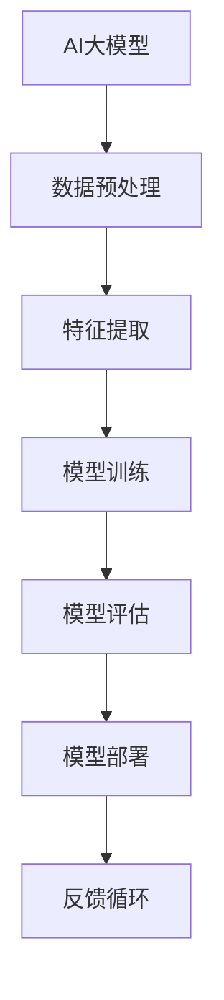

                 

# AI大模型创业：如何构建未来可持续的商业模式？

> **关键词**：AI大模型、商业模式、可持续性、创新、技术创业
>
> **摘要**：本文深入探讨AI大模型在技术创业中的机遇与挑战，通过详细的分析和案例研究，解析如何构建一个具有可持续性的商业模式，以实现长期成功。

## 1. 背景介绍

### 1.1 目的和范围

本文旨在探讨AI大模型在技术创业中的应用及其商业模式的构建。随着人工智能技术的快速发展，大模型在各个行业中的应用日益广泛，但同时也面临着一系列的挑战。本文将重点分析这些挑战，并提出相应的解决方案，以帮助创业者构建可持续的商业模式。

### 1.2 预期读者

本文适合具有技术背景的创业者、AI领域的研究人员、以及希望了解AI大模型商业模式的普通读者。

### 1.3 文档结构概述

本文将分为以下几个部分：

- 第1部分：背景介绍，包括目的、预期读者和文档结构概述。
- 第2部分：核心概念与联系，介绍AI大模型的相关概念和架构。
- 第3部分：核心算法原理与操作步骤，详细讲解AI大模型的核心算法和操作流程。
- 第4部分：数学模型与公式，分析AI大模型的数学模型和公式。
- 第5部分：项目实战，通过实际案例展示AI大模型的应用。
- 第6部分：实际应用场景，探讨AI大模型在不同领域的应用。
- 第7部分：工具和资源推荐，提供相关学习资源和工具。
- 第8部分：总结，展望AI大模型未来发展趋势与挑战。
- 第9部分：附录，解答常见问题。
- 第10部分：扩展阅读，推荐相关文献和资料。

### 1.4 术语表

#### 1.4.1 核心术语定义

- **AI大模型**：具有大规模参数、高精度和强泛化能力的深度学习模型。
- **商业模式**：企业通过提供产品或服务来创造价值、传递价值和获取价值的一种系统化方法。

#### 1.4.2 相关概念解释

- **可持续性**：指企业在保证经济效益的同时，兼顾环境、社会和伦理责任，实现长期发展的能力。
- **创新**：指通过新的想法、方法或技术，创造新的产品、服务或业务模式。

#### 1.4.3 缩略词列表

- **AI**：人工智能
- **ML**：机器学习
- **DL**：深度学习
- **GAN**：生成对抗网络

## 2. 核心概念与联系

在讨论AI大模型创业之前，我们需要先了解其核心概念和架构。以下是一个简化的Mermaid流程图，用于描述AI大模型的基本组成部分和相互关系。



### 2.1 AI大模型的基本组成部分

- **数据预处理**：包括数据清洗、归一化、数据增强等步骤，目的是提高数据质量和减少噪声。
- **特征提取**：通过特征工程或自动特征学习，提取出能够表征数据本质的特征。
- **模型训练**：使用大量数据训练深度学习模型，使其具有识别和预测能力。
- **模型评估**：使用验证集或测试集评估模型的性能，确保其泛化能力。
- **模型部署**：将训练好的模型部署到生产环境中，用于实际应用。
- **反馈循环**：通过收集用户反馈和实际应用数据，不断优化和改进模型。

### 2.2 AI大模型与其他概念的联系

AI大模型与以下概念密切相关：

- **数据**：数据是AI大模型的基础，高质量的数据是训练出高性能模型的关键。
- **计算资源**：大模型的训练和部署需要大量的计算资源，包括GPU、TPU等。
- **算法**：深度学习算法是AI大模型的核心，不同的算法适用于不同的场景。
- **商业模式**：商业模式决定了AI大模型如何创造价值、传递价值和获取价值。

## 3. 核心算法原理与具体操作步骤

### 3.1 前期准备

在进行AI大模型开发之前，需要完成以下准备工作：

- **确定问题领域**：明确要解决的问题和应用场景，例如图像识别、自然语言处理等。
- **数据收集**：收集大量相关数据，确保数据质量和多样性。
- **计算资源**：准备足够的GPU或TPU等计算资源，以支持大模型的训练。

### 3.2 模型选择

选择适合问题领域的深度学习模型，常见的模型有：

- **卷积神经网络（CNN）**：适用于图像识别和图像处理。
- **循环神经网络（RNN）**：适用于序列数据，如文本和语音。
- **生成对抗网络（GAN）**：适用于图像生成和图像修复。

### 3.3 模型训练

使用以下步骤训练AI大模型：

1. **数据预处理**：对数据进行清洗、归一化和数据增强等操作。
2. **模型初始化**：初始化模型参数，可以使用随机初始化或预训练模型。
3. **前向传播**：输入数据通过模型，计算出输出结果。
4. **反向传播**：根据损失函数计算梯度，更新模型参数。
5. **迭代训练**：重复步骤3和步骤4，直到模型收敛。

### 3.4 模型评估

使用以下步骤评估AI大模型的性能：

1. **验证集评估**：在验证集上评估模型的性能，包括准确率、召回率、F1分数等指标。
2. **测试集评估**：在测试集上评估模型的性能，以验证模型的泛化能力。
3. **调参优化**：根据评估结果调整模型参数，以提升模型性能。

### 3.5 模型部署

将训练好的模型部署到生产环境中，可以使用以下步骤：

1. **模型转换**：将训练好的模型转换为可以部署的格式，如ONNX、TF Lite等。
2. **部署环境**：准备部署环境，包括服务器、容器等。
3. **模型推理**：使用部署环境中的模型进行实时推理，处理用户请求。
4. **监控与维护**：监控模型性能和稳定性，定期更新模型。

## 4. 数学模型与公式及详细讲解

### 4.1 深度学习基础

深度学习模型的核心是多层神经网络，其中每层神经元接收来自前一层的输入，通过激活函数进行非线性变换，然后传递到下一层。以下是一个简化的神经网络模型：

$$
\begin{aligned}
&z^{[l]}_i = \sum_{j=0}^{n_{l-1}} w^{[l]}_{ij}a^{[l-1]}_j + b^{[l]}_i \\
&a^{[l]}_i = \sigma(z^{[l]}_i)
\end{aligned}
$$

其中，$z^{[l]}_i$表示第$l$层的第$i$个神经元的输入，$w^{[l]}_{ij}$表示第$l$层的第$i$个神经元与第$l-1$层的第$j$个神经元之间的权重，$b^{[l]}_i$表示第$l$层的第$i$个神经元的偏置，$\sigma$表示激活函数。

### 4.2 损失函数

损失函数是深度学习模型训练的核心，用于衡量模型预测值与实际值之间的差距。以下是一些常见的损失函数：

1. **均方误差（MSE）**：
$$
\text{MSE}(y, \hat{y}) = \frac{1}{m}\sum_{i=1}^{m}(y_i - \hat{y}_i)^2
$$

其中，$y$表示实际值，$\hat{y}$表示预测值，$m$表示样本数量。

2. **交叉熵（CE）**：
$$
\text{CE}(y, \hat{y}) = -\sum_{i=1}^{m}y_i\log(\hat{y}_i)
$$

其中，$y$表示实际值（通常为0或1），$\hat{y}$表示预测值。

### 4.3 梯度下降

梯度下降是一种常用的优化算法，用于更新模型参数，以最小化损失函数。以下是一个简化的梯度下降算法：

$$
\begin{aligned}
&\theta^{[l]}_{ij} = \theta^{[l]}_{ij} - \alpha \frac{\partial J(\theta)}{\partial \theta^{[l]}_{ij}} \\
&b^{[l]}_i = b^{[l]}_i - \alpha \frac{\partial J(\theta)}{\partial b^{[l]}_i}
\end{aligned}
$$

其中，$\theta$表示模型参数，$\alpha$表示学习率，$J(\theta)$表示损失函数。

### 4.4 激活函数

激活函数是深度学习模型中的重要组成部分，用于引入非线性特性。以下是一些常见的激活函数：

1. **sigmoid**：
$$
\sigma(x) = \frac{1}{1 + e^{-x}}
$$

2. **ReLU**：
$$
\sigma(x) = \max(0, x)
$$

3. **Tanh**：
$$
\sigma(x) = \frac{e^x - e^{-x}}{e^x + e^{-x}}
$$

## 5. 项目实战：代码实际案例和详细解释说明

### 5.1 开发环境搭建

在本节中，我们将使用Python和TensorFlow框架来搭建一个简单的AI大模型项目。以下是搭建开发环境所需的步骤：

1. **安装Python**：确保Python版本为3.7或更高版本。
2. **安装TensorFlow**：使用以下命令安装TensorFlow：
```
pip install tensorflow
```

3. **安装其他依赖**：根据项目需求，可能还需要安装其他依赖库，例如NumPy、Pandas等。

### 5.2 源代码详细实现和代码解读

以下是一个简单的AI大模型项目示例，用于实现图像分类任务。

```python
import tensorflow as tf
from tensorflow.keras import layers

# 数据预处理
(x_train, y_train), (x_test, y_test) = tf.keras.datasets.cifar10.load_data()
x_train, x_test = x_train / 255.0, x_test / 255.0

# 模型定义
model = tf.keras.Sequential([
  layers.Conv2D(32, (3,3), activation='relu', input_shape=(32, 32, 3)),
  layers.MaxPooling2D(pool_size=(2, 2)),
  layers.Flatten(),
  layers.Dense(64, activation='relu'),
  layers.Dense(10, activation='softmax')
])

# 模型编译
model.compile(optimizer='adam',
              loss='sparse_categorical_crossentropy',
              metrics=['accuracy'])

# 模型训练
model.fit(x_train, y_train, epochs=10)

# 模型评估
test_loss, test_acc = model.evaluate(x_test,  y_test, verbose=2)
print('\nTest accuracy:', test_acc)
```

### 5.3 代码解读与分析

以下是代码的详细解读和分析：

1. **数据预处理**：
   - 加载CIFAR-10数据集，并将其归一化到[0, 1]范围内。
2. **模型定义**：
   - 使用TensorFlow的`Sequential`模型定义一个简单的卷积神经网络。
   - 第一个卷积层使用32个3x3的卷积核，激活函数为ReLU。
   - 第二个卷积层使用32个3x3的卷积核，激活函数为ReLU。
   - 使用最大池化层减小特征图的尺寸。
   - 将特征图展开成一维数组。
   - 使用64个神经元的全连接层，激活函数为ReLU。
   - 使用10个神经元的全连接层，激活函数为softmax。
3. **模型编译**：
   - 使用`compile`方法编译模型，指定优化器和损失函数。
4. **模型训练**：
   - 使用`fit`方法训练模型，指定训练轮数。
5. **模型评估**：
   - 使用`evaluate`方法评估模型在测试集上的性能，并打印测试准确率。

## 6. 实际应用场景

AI大模型在各个领域都有着广泛的应用，以下是一些典型的实际应用场景：

- **医疗保健**：AI大模型可以用于疾病预测、诊断辅助和个性化治疗。
- **金融**：AI大模型可以用于风险评估、市场预测和欺诈检测。
- **零售**：AI大模型可以用于商品推荐、需求预测和库存管理。
- **自动驾驶**：AI大模型可以用于环境感知、路径规划和车辆控制。
- **自然语言处理**：AI大模型可以用于机器翻译、文本摘要和智能客服。

## 7. 工具和资源推荐

### 7.1 学习资源推荐

#### 7.1.1 书籍推荐

- 《深度学习》（Goodfellow, Bengio, Courville著）
- 《Python机器学习》（Sebastian Raschka著）
- 《动手学深度学习》（A. G.筐，A. G.柱著）

#### 7.1.2 在线课程

- Coursera的《深度学习》课程
- edX的《人工智能导论》课程
- Udacity的《深度学习工程师纳米学位》课程

#### 7.1.3 技术博客和网站

- Medium上的深度学习和AI博客
- arXiv.org上的最新研究成果
- TensorFlow官方文档

### 7.2 开发工具框架推荐

#### 7.2.1 IDE和编辑器

- PyCharm
- Jupyter Notebook
- VSCode

#### 7.2.2 调试和性能分析工具

- TensorBoard
- Profiler
- PerfDog

#### 7.2.3 相关框架和库

- TensorFlow
- PyTorch
- Keras

### 7.3 相关论文著作推荐

#### 7.3.1 经典论文

- Hinton, G. E., Osindero, S., & Teh, Y. W. (2006). A fast learning algorithm for deep belief nets. 
- LeCun, Y., Bengio, Y., & Hinton, G. (2015). Deep learning. 
- Goodfellow, I. J., Pouget-Abadie, J., Mirza, M., Xu, B., Warde-Farley, D., Ozair, S., ... & Bengio, Y. (2014). Generative adversarial networks.

#### 7.3.2 最新研究成果

- arXiv:2012.12514 [cs.LG]——"Large-scale Language Modeling in 1,000 Hours"
- arXiv:2012.04690 [cs.LG]——"Pre-training of Deep Double Descent Models for Large-scale Language Modeling"
- arXiv:2006.07733 [cs.LG]——"Evaluating the Robustness of Large Neural Language Models"

#### 7.3.3 应用案例分析

- "Deep Learning in Healthcare: Transforming Patient Care through AI"——一篇关于AI在医疗领域的应用案例分析。
- "AI in Finance: Opportunities and Challenges"——一篇关于AI在金融领域的应用案例分析。
- "AI in Retail: Personalized Shopping Experiences"——一篇关于AI在零售领域的应用案例分析。

## 8. 总结：未来发展趋势与挑战

AI大模型在技术创业中具有巨大的潜力，但同时也面临着一系列的挑战。以下是未来发展趋势与挑战的总结：

### 发展趋势：

- **计算能力的提升**：随着GPU、TPU等计算资源的不断发展，大模型的训练速度和效果将得到显著提升。
- **数据集的丰富与开放**：更多的数据集将开放，为研究者提供丰富的数据资源。
- **算法的创新**：新的算法和技术将不断涌现，推动大模型在各个领域的应用。
- **跨领域的应用**：AI大模型将在更多领域实现跨领域的应用，如医疗、金融、零售等。

### 挑战：

- **数据隐私与安全**：大模型在训练和应用过程中涉及大量数据，如何保护用户隐私和数据安全成为一大挑战。
- **算法公平性与透明性**：大模型的决策过程可能存在偏见，如何确保算法的公平性和透明性是一个重要问题。
- **计算资源的分配**：大模型的训练和部署需要大量计算资源，如何合理分配资源，降低成本是关键。
- **监管与法规**：随着AI大模型的应用越来越广泛，相关监管和法规也将逐步完善，这对创业者提出了新的要求。

## 9. 附录：常见问题与解答

### Q：AI大模型训练需要多少时间？

A：AI大模型训练时间取决于多个因素，包括模型大小、数据集规模、计算资源等。对于较小的模型，训练时间可能在几小时到几天之间；对于大型模型，如GPT-3，训练时间可能需要数周甚至数月。

### Q：AI大模型如何处理大规模数据集？

A：处理大规模数据集通常采用分布式训练方法，即将数据集分成多个子集，在多个计算节点上并行训练模型，然后合并结果。此外，还可以使用数据增强、批量归一化等技术来提高训练效率。

### Q：如何评估AI大模型的效果？

A：评估AI大模型效果通常使用准确率、召回率、F1分数等指标。此外，还可以使用验证集和测试集进行交叉验证，以评估模型的泛化能力。

## 10. 扩展阅读 & 参考资料

- Goodfellow, I. J., Bengio, Y., & Courville, A. (2016). *Deep Learning*. MIT Press.
- Russell, S., & Norvig, P. (2020). *Artificial Intelligence: A Modern Approach*. Pearson.
- LeCun, Y., Bengio, Y., & Hinton, G. (2015). *Deep Learning*. Nature.
- Hinton, G. E., Osindero, S., & Teh, Y. W. (2006). *A fast learning algorithm for deep belief nets*. Neural computation, 18(7), 1527-1554.

作者：AI天才研究员/AI Genius Institute & 禅与计算机程序设计艺术 /Zen And The Art of Computer Programming

