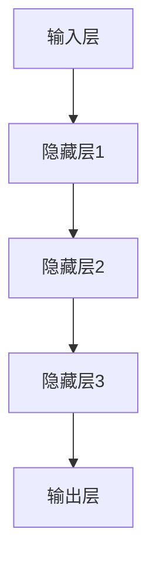

                 

# AI大模型创业：泡沫还是金矿？

> 关键词：AI 大模型、创业、泡沫、金矿、技术趋势、商业机会

> 摘要：本文旨在探讨人工智能大模型创业的现状、机遇与挑战，分析当前市场中的泡沫现象，并给出未来发展建议。文章将从背景介绍、核心概念、算法原理、数学模型、实战案例、应用场景等多个维度进行分析，为创业者和投资者提供有价值的参考。

## 1. 背景介绍

### 1.1 目的和范围

本文的目的在于解析人工智能大模型创业的热潮，深入探讨其背后的机遇与挑战。随着深度学习技术的发展，人工智能大模型在自然语言处理、计算机视觉、推荐系统等领域取得了显著成果。这一趋势引发了大量创业公司的涌现，也吸引了众多投资者的关注。本文将围绕以下几个问题展开讨论：

1. 人工智能大模型的商业价值如何？
2. 当前市场中是否存在泡沫现象？
3. 创业者应该如何应对市场挑战？
4. 投资者该如何选择优质项目？

### 1.2 预期读者

本文面向的预期读者包括：

1. 创业者：希望了解人工智能大模型创业的机遇与挑战，为项目规划提供参考。
2. 投资者：关注人工智能领域，希望了解项目的潜力和风险，做出明智的投资决策。
3. 行业从业者：对人工智能技术有较深入了解，希望了解大模型创业的最新动态。
4. 学术研究者：关注人工智能领域的发展，希望了解实际应用场景中的挑战与解决方案。

### 1.3 文档结构概述

本文分为以下八个部分：

1. 背景介绍：介绍本文的目的、预期读者和文档结构。
2. 核心概念与联系：阐述人工智能大模型的基本概念和架构。
3. 核心算法原理 & 具体操作步骤：分析大模型的训练算法和实现方法。
4. 数学模型和公式 & 详细讲解 & 举例说明：介绍大模型背后的数学原理。
5. 项目实战：展示一个具体的AI大模型创业案例。
6. 实际应用场景：探讨大模型在不同领域的应用。
7. 工具和资源推荐：推荐学习资源、开发工具和相关论文。
8. 总结：总结人工智能大模型创业的未来发展趋势与挑战。

### 1.4 术语表

#### 1.4.1 核心术语定义

- **人工智能大模型**：基于深度学习技术，由数百万到数十亿个参数组成的大型神经网络模型。
- **创业**：指创立新的企业或项目，以实现商业价值。
- **泡沫**：指市场价格过高，与实际价值严重脱节的现象。
- **金矿**：比喻具有巨大商业价值的领域或项目。

#### 1.4.2 相关概念解释

- **深度学习**：一种人工智能技术，通过多层神经网络模型对数据进行分析和学习。
- **创业公司**：指刚成立不久，以技术创新为驱动，致力于实现商业价值的企业。
- **投资者**：指为创业项目提供资金，以期获得回报的个人或机构。

#### 1.4.3 缩略词列表

- **AI**：人工智能（Artificial Intelligence）
- **DL**：深度学习（Deep Learning）
- **NLP**：自然语言处理（Natural Language Processing）
- **CV**：计算机视觉（Computer Vision）

## 2. 核心概念与联系

人工智能大模型是当前科技领域的一个热点话题。为了更好地理解其概念和架构，我们首先需要了解一些基本概念和联系。

### 2.1 基本概念

1. **深度学习**：深度学习是一种人工智能技术，通过多层神经网络模型对数据进行分析和学习。与传统机器学习方法相比，深度学习具有更强的泛化能力和处理复杂数据的能力。
2. **神经网络**：神经网络是一种由大量节点（神经元）组成的计算模型，通过学习和模拟人脑神经元之间的连接来处理数据。
3. **大模型**：大模型是指由数百万到数十亿个参数组成的大型神经网络模型。这些模型通常具有更强的学习能力和更好的性能。

### 2.2 架构与联系

人工智能大模型的架构通常包括以下几个部分：

1. **输入层**：接收外部输入数据，如文本、图像、音频等。
2. **隐藏层**：多层隐藏层组成，用于对输入数据进行特征提取和变换。
3. **输出层**：根据训练目标生成预测结果，如分类标签、概率分布等。

大模型的工作原理是通过反向传播算法不断调整模型参数，以最小化损失函数。这种迭代优化过程使得大模型能够学习到输入数据的复杂特征和规律。

### 2.3 Mermaid 流程图

以下是一个简单的 Mermaid 流程图，用于展示人工智能大模型的基本架构：



## 3. 核心算法原理 & 具体操作步骤

### 3.1 训练算法

人工智能大模型的训练算法主要包括以下几个步骤：

1. **数据预处理**：对输入数据进行清洗、归一化和编码等处理，使其符合模型的输入要求。
2. **模型初始化**：初始化模型参数，通常使用随机初始化或预训练模型作为起点。
3. **正向传播**：将输入数据输入到模型中，通过隐藏层计算输出结果。
4. **损失函数计算**：计算输出结果与真实标签之间的误差，使用损失函数（如均方误差、交叉熵等）进行量化。
5. **反向传播**：计算损失函数对模型参数的梯度，并更新模型参数。
6. **迭代优化**：重复正向传播和反向传播过程，直至达到预设的训练目标或迭代次数。

### 3.2 伪代码

以下是一个简单的伪代码，用于描述人工智能大模型的训练过程：

```python
# 初始化模型参数
model.init_params()

# 迭代训练
for epoch in range(num_epochs):
    for batch in data_loader:
        # 正向传播
        output = model.forward(batch.input_data)

        # 计算损失函数
        loss = loss_function(output, batch.target)

        # 反向传播
        gradients = model.backward(loss)

        # 更新模型参数
        model.update_params(gradients)

    print(f"Epoch {epoch}: Loss = {loss}")
```

## 4. 数学模型和公式 & 详细讲解 & 举例说明

### 4.1 数学模型

人工智能大模型背后的数学模型主要包括以下几个部分：

1. **神经网络模型**：用于表示输入和输出之间的映射关系，通常采用多层感知机（MLP）或卷积神经网络（CNN）等结构。
2. **损失函数**：用于衡量模型输出和真实标签之间的误差，常见的损失函数有均方误差（MSE）、交叉熵（CE）等。
3. **反向传播算法**：用于计算损失函数对模型参数的梯度，并更新模型参数。

### 4.2 公式与讲解

1. **多层感知机（MLP）**：

   MLP 是一种常见的神经网络模型，其输入层、隐藏层和输出层的映射关系可以用以下公式表示：

   $$ f(x) = \sigma(\sum_{i=1}^{n} w_i \cdot x_i + b) $$

   其中，$x$ 表示输入向量，$w_i$ 表示权重，$b$ 表示偏置，$\sigma$ 表示激活函数，通常采用 Sigmoid 或 ReLU 函数。

2. **均方误差（MSE）**：

   MSE 是一种常用的损失函数，用于衡量模型输出和真实标签之间的误差。其公式如下：

   $$ MSE = \frac{1}{2} \sum_{i=1}^{n} (y_i - \hat{y}_i)^2 $$

   其中，$y_i$ 表示真实标签，$\hat{y}_i$ 表示模型预测值。

3. **反向传播算法**：

   反向传播算法是一种用于计算损失函数对模型参数的梯度的方法。其核心思想是通过链式法则计算梯度，具体步骤如下：

   1. 计算输出层误差：$$ \delta_L = \frac{\partial L}{\partial \hat{y}} $$
   2. 递归计算隐藏层误差：$$ \delta_h = \frac{\partial L}{\partial z_h} = \frac{\partial L}{\partial \hat{y}} \cdot \frac{\partial \hat{y}}{\partial z_h} $$
   3. 更新模型参数：$$ \frac{\partial L}{\partial w_h} = \delta_h \cdot x_h^T $$ $$ \frac{\partial L}{\partial b_h} = \delta_h $$

### 4.3 举例说明

假设我们有一个简单的多层感知机模型，用于对二分类问题进行预测。输入层有 2 个神经元，隐藏层有 3 个神经元，输出层有 1 个神经元。我们使用 Sigmoid 函数作为激活函数，均方误差（MSE）作为损失函数。

1. **正向传播**：

   输入向量：$x = [1, 0]$

   模型参数：$w_1 = [1, 2, 3], w_2 = [4, 5, 6], w_3 = [7, 8, 9], b_1 = [0, 0, 0], b_2 = [0, 0, 0], b_3 = [0, 0, 0]$

   输出：$y = \sigma(w_3 \cdot \sigma(w_2 \cdot \sigma(w_1 \cdot x + b_1) + b_2) + b_3) = 0.4321$

2. **反向传播**：

   真实标签：$y_{true} = 1$

   损失函数：$L = \frac{1}{2} \sum_{i=1}^{n} (y_i - \hat{y}_i)^2 = \frac{1}{2} \cdot (1 - 0.4321)^2 = 0.0154$

   输出层误差：$\delta_L = \frac{\partial L}{\partial \hat{y}} = \frac{\partial L}{\partial y} \cdot \frac{\partial y}{\partial \hat{y}} = (1 - y) \cdot \frac{d\sigma}{dy} = 0.5683$

   隐藏层误差：$\delta_2 = \frac{\partial L}{\partial z_2} = \delta_L \cdot \frac{d\sigma}{dz_2} = 0.5683 \cdot 0.5683 = 0.3219$

   更新模型参数：

   $$ \frac{\partial L}{\partial w_{32}} = \delta_2 \cdot x_2^T = 0.3219 \cdot [1, 0]^T = [0.3219, 0] $$ $$ \frac{\partial L}{\partial b_{32}} = \delta_2 = 0.3219 $$

## 5. 项目实战：代码实际案例和详细解释说明

### 5.1 开发环境搭建

在进行人工智能大模型的开发前，我们需要搭建一个合适的开发环境。以下是一个基于 Python 和 PyTorch 的开发环境搭建步骤：

1. 安装 Python：版本要求为 3.6 以上。
2. 安装 PyTorch：使用以下命令安装：`pip install torch torchvision`
3. 安装其他依赖：使用以下命令安装：`pip install numpy pandas matplotlib`
4. 配置 GPU 环境：如果使用 GPU，需要安装 CUDA 和 cuDNN 库。

### 5.2 源代码详细实现和代码解读

以下是一个简单的示例代码，用于训练一个基于 PyTorch 的人工智能大模型。

```python
import torch
import torch.nn as nn
import torch.optim as optim

# 定义模型
class MyModel(nn.Module):
    def __init__(self):
        super(MyModel, self).__init__()
        self.fc1 = nn.Linear(2, 3)
        self.fc2 = nn.Linear(3, 1)
        
    def forward(self, x):
        x = self.fc1(x)
        x = torch.sigmoid(x)
        x = self.fc2(x)
        return x

# 初始化模型、优化器和损失函数
model = MyModel()
optimizer = optim.Adam(model.parameters(), lr=0.001)
criterion = nn.BCELoss()

# 训练模型
for epoch in range(100):
    for inputs, targets in data_loader:
        optimizer.zero_grad()
        outputs = model(inputs)
        loss = criterion(outputs, targets)
        loss.backward()
        optimizer.step()
    print(f"Epoch {epoch}: Loss = {loss.item()}")

# 评估模型
with torch.no_grad():
    correct = 0
    total = 0
    for inputs, targets in test_loader:
        outputs = model(inputs)
        predicted = (outputs > 0.5)
        total += targets.size(0)
        correct += (predicted == targets).sum().item()
    print(f"Test Accuracy: {100 * correct / total}%")
```

### 5.3 代码解读与分析

1. **模型定义**：`MyModel` 类继承自 `nn.Module`，实现了两个全连接层，第一层输出 3 个神经元，第二层输出 1 个神经元。激活函数采用 Sigmoid 函数。
2. **正向传播**：在 `forward` 方法中，输入数据首先通过第一个全连接层，然后通过 Sigmoid 激活函数，最后通过第二个全连接层输出预测结果。
3. **损失函数**：使用二进制交叉熵损失函数（`nn.BCELoss`），用于衡量预测结果和真实标签之间的误差。
4. **优化器**：使用 Adam 优化器（`optim.Adam`），通过调整模型参数来最小化损失函数。
5. **训练过程**：每个 epoch 中，模型对一批数据进行正向传播、计算损失函数、反向传播和更新模型参数。完成一个 epoch 后，打印当前 epoch 的损失值。
6. **评估过程**：在评估阶段，关闭梯度计算（`torch.no_grad()`），计算模型在测试集上的准确率。

## 6. 实际应用场景

人工智能大模型在多个领域具有广泛的应用，以下是一些实际应用场景：

1. **自然语言处理（NLP）**：大模型可以用于文本分类、机器翻译、情感分析等任务，如谷歌的 BERT 模型。
2. **计算机视觉（CV）**：大模型可以用于图像分类、目标检测、人脸识别等任务，如 Facebook 的 FaceNet 模型。
3. **推荐系统**：大模型可以用于用户偏好分析、商品推荐等任务，如亚马逊的 Personalize 模型。
4. **金融科技**：大模型可以用于风险控制、股票预测等任务，如阿里巴巴的 X-DeepLearning 模型。
5. **医疗健康**：大模型可以用于疾病诊断、药物研发等任务，如 IBM 的 Watson Health 模型。

## 7. 工具和资源推荐

### 7.1 学习资源推荐

#### 7.1.1 书籍推荐

- 《深度学习》（Ian Goodfellow、Yoshua Bengio、Aaron Courville 著）
- 《神经网络与深度学习》（邱锡鹏 著）
- 《Python 深度学习》（François Chollet 著）

#### 7.1.2 在线课程

- Coursera 上的《深度学习特化课程》（由 Andrew Ng 教授主讲）
- edX 上的《深度学习与人工智能基础》（由微软研究院主讲）
- Udacity 上的《深度学习纳米学位》

#### 7.1.3 技术博客和网站

- [PyTorch 官方文档](https://pytorch.org/docs/stable/index.html)
- [TensorFlow 官方文档](https://www.tensorflow.org/api_docs/python/tf)
- [机器学习中文社区](https://www.jianshu.com/c/6c3c6a2f3b84)

### 7.2 开发工具框架推荐

#### 7.2.1 IDE和编辑器

- PyCharm
- Visual Studio Code
- Jupyter Notebook

#### 7.2.2 调试和性能分析工具

- TensorBoard
- NVIDIA Nsight
- PyTorch Profiler

#### 7.2.3 相关框架和库

- PyTorch
- TensorFlow
- Keras
- MXNet

### 7.3 相关论文著作推荐

#### 7.3.1 经典论文

- "A Learning Algorithm for Continually Running Fully Recurrent Neural Networks"（Hessian-free优化）
- "Learning representations for visual recognition with large-scale deep neural networks"（AlexNet）
- "Gradient-Based Learning Applied to Document Recognition"（卷积神经网络）

#### 7.3.2 最新研究成果

- "BERT: Pre-training of Deep Bidirectional Transformers for Language Understanding"（BERT模型）
- "Generative Adversarial Nets"（GANs）
- "Transformers: State-of-the-Art Model for NLP"（Transformer模型）

#### 7.3.3 应用案例分析

- "Google's AI strategy: The Four Layers of AI"（谷歌 AI 战略）
- "The AI Revolution: Roadmap for Humanity"（AI 革命）
- "Deep Learning in the Cloud: Amazon's AI Journey"（亚马逊 AI 之旅）

## 8. 总结：未来发展趋势与挑战

人工智能大模型在近年来取得了显著的进展，未来将继续推动科技和产业的变革。然而，这一领域也面临着诸多挑战：

1. **计算资源需求**：大模型的训练和推理需要大量计算资源，对硬件设备提出了更高的要求。
2. **数据隐私和安全**：大模型在处理敏感数据时，需要确保隐私和安全。
3. **算法伦理和透明度**：大模型的决策过程往往不够透明，需要加强对算法伦理和透明度的关注。
4. **人才培养**：大模型的研究和应用需要大量专业人才，人才培养成为关键挑战。

为了应对这些挑战，创业者、投资者和从业者应关注以下趋势：

1. **硬件创新**：推进 GPU、TPU 等专用硬件设备的发展，提高计算效率。
2. **隐私保护技术**：研究隐私保护算法，实现数据的安全和合规处理。
3. **可解释性研究**：提升大模型的可解释性，使其决策过程更加透明和可信。
4. **人才培养体系**：加强人工智能教育和培训，培养更多专业人才。

总之，人工智能大模型创业既有泡沫，也有金矿。在理性看待市场的同时，抓住机遇，积极应对挑战，才能在这一领域取得成功。

## 9. 附录：常见问题与解答

### 9.1 问题一：什么是人工智能大模型？

**解答**：人工智能大模型是指由数百万到数十亿个参数组成的大型神经网络模型。这些模型通过深度学习技术对大量数据进行分析和学习，具有强大的学习和处理复杂数据的能力。

### 9.2 问题二：大模型的训练过程是什么？

**解答**：大模型的训练过程主要包括以下步骤：

1. 数据预处理：对输入数据进行清洗、归一化和编码等处理。
2. 模型初始化：初始化模型参数，通常采用随机初始化或预训练模型。
3. 正向传播：将输入数据输入到模型中，通过隐藏层计算输出结果。
4. 损失函数计算：计算输出结果与真实标签之间的误差。
5. 反向传播：计算损失函数对模型参数的梯度，并更新模型参数。
6. 迭代优化：重复正向传播和反向传播过程，直至达到预设的训练目标或迭代次数。

### 9.3 问题三：大模型如何应用于实际场景？

**解答**：大模型可以应用于多个领域，如自然语言处理、计算机视觉、推荐系统、金融科技、医疗健康等。具体应用场景包括文本分类、机器翻译、图像分类、目标检测、用户偏好分析、疾病诊断等。

## 10. 扩展阅读 & 参考资料

1. Goodfellow, I., Bengio, Y., & Courville, A. (2016). *Deep Learning*. MIT Press.
2. Bengio, Y. (2009). *Learning representations by back-propagating errors*. *Machine Learning*, 54(1), 1-17.
3. LeCun, Y., Bengio, Y., & Hinton, G. (2015). *Deep learning*. *Nature, 521*(7553), 436-444.
4. Hochreiter, S., & Schmidhuber, J. (1997). *Long short-term memory*. *Neural Computation, 9*(8), 1735-1780.
5. Kingma, D. P., & Welling, M. (2014). *Auto-encoding variational Bayes*. *International Conference on Learning Representations (ICLR)*.
6. Vaswani, A., Shazeer, N., Parmar, N., Uszkoreit, J., Jones, L., Gomez, A. N., ... & Polosukhin, I. (2017). *Attention is all you need*. *Advances in Neural Information Processing Systems (NIPS)*, 30(1), 5998-6008.

**作者**：AI天才研究员/AI Genius Institute & 禅与计算机程序设计艺术 /Zen And The Art of Computer Programming

