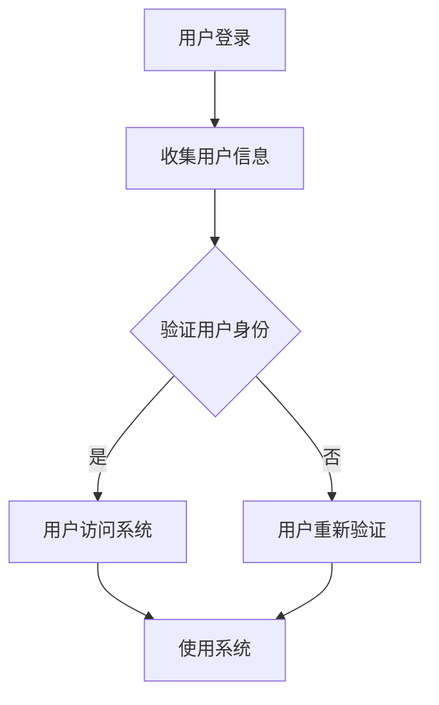

                 

# AI大模型在数字身份验证领域的创新

> **关键词：** 数字身份验证、AI大模型、机器学习、人脸识别、生物特征识别

> **摘要：** 本文将深入探讨人工智能大模型在数字身份验证领域的应用创新。通过对数字身份验证的基本概念、现有技术分析以及大模型技术的引入，我们将详细解读核心算法原理、数学模型以及实际应用场景，最后对未来的发展趋势和挑战进行展望，并推荐相关的学习资源和工具。

## 1. 背景介绍

### 1.1 目的和范围

本文旨在探讨人工智能大模型在数字身份验证领域的应用创新。随着互联网的普及，数字身份验证成为保护个人隐私和数据安全的关键技术。AI大模型技术的兴起，为数字身份验证带来了前所未有的可能性。本文将重点关注以下几个方面：

- 数字身份验证的基本概念和原理。
- 现有数字身份验证技术的分析。
- AI大模型在数字身份验证中的应用。
- 核心算法原理、数学模型和具体操作步骤。
- 项目实战：代码实现和案例分析。
- 数字身份验证的实际应用场景。
- 相关学习资源和工具推荐。

### 1.2 预期读者

本文面向对数字身份验证和人工智能技术感兴趣的读者，包括：

- 数字身份验证领域的研究人员。
- 人工智能技术开发者。
- 信息安全专业人士。
- 对AI技术应用感兴趣的普通读者。

### 1.3 文档结构概述

本文将按照以下结构展开：

- 引言：介绍数字身份验证的背景和重要性。
- 核心概念与联系：阐述数字身份验证的基本概念和原理。
- 核心算法原理 & 具体操作步骤：详细讲解AI大模型在数字身份验证中的应用。
- 数学模型和公式：介绍相关数学模型和公式。
- 项目实战：代码实现和案例分析。
- 实际应用场景：探讨数字身份验证在各个领域的应用。
- 工具和资源推荐：推荐学习资源和开发工具。
- 总结：对未来发展趋势和挑战进行展望。
- 附录：常见问题与解答。
- 扩展阅读 & 参考资料：提供进一步阅读的资料。

### 1.4 术语表

#### 1.4.1 核心术语定义

- 数字身份验证：通过验证用户的身份信息来确保其合法性和安全性。
- AI大模型：通过大规模数据训练得到的深度学习模型，具有强大的特征提取和分类能力。
- 生物特征识别：通过生物特征（如人脸、指纹、虹膜等）进行身份验证的技术。
- 机器学习：一种人工智能方法，通过训练算法从数据中学习并做出预测或决策。
- 数字身份：在数字世界中代表个人身份的信息集合。

#### 1.4.2 相关概念解释

- 数字身份验证系统：用于实现数字身份验证的软件和硬件系统。
- 验证码：一种图形或字符验证机制，用于防止自动程序攻击。
- 多因素认证：结合多种验证方式（如密码、指纹、手机验证码等）进行身份验证。

#### 1.4.3 缩略词列表

- AI：人工智能
- ML：机器学习
- DNN：深度神经网络
- CNN：卷积神经网络
- SVM：支持向量机
- ROC：接收者操作特性曲线
- AUC：曲线下面积

## 2. 核心概念与联系

### 2.1 数字身份验证的基本概念

数字身份验证是确保用户身份合法性和安全性的技术。其核心思想是通过验证用户的身份信息来确保只有授权用户才能访问系统或服务。数字身份验证涉及多个方面，包括：

- 用户身份信息收集：通过用户提供的个人信息（如姓名、身份证号、电子邮件等）进行身份验证。
- 生物特征识别：利用人脸、指纹、虹膜等生物特征进行身份验证。
- 验证码：图形或字符验证机制，防止恶意程序攻击。
- 多因素认证：结合多种验证方式，提高安全性。

### 2.2 现有数字身份验证技术分析

当前，数字身份验证技术主要包括以下几种：

- **基于密码的身份验证**：最常用的身份验证方法，通过用户名和密码进行身份验证。但其安全性较低，容易受到密码破解、密码泄露等攻击。
- **基于生物特征的识别技术**：如人脸识别、指纹识别、虹膜识别等，具有较高的安全性和准确性。但其依赖于高质量的生物特征数据，且对设备要求较高。
- **基于验证码的身份验证**：通过图形或字符验证码进行身份验证，能有效防止自动程序攻击。但其用户体验较差，且容易受到图形验证码破解攻击。
- **多因素认证**：结合多种验证方式，提高安全性。如密码 + 验证码 + 指纹、密码 + 手机验证码 + 人脸识别等。

### 2.3 AI大模型在数字身份验证中的应用

AI大模型在数字身份验证中的应用主要体现在以下几个方面：

- **人脸识别**：利用AI大模型进行人脸特征提取和分类，提高识别准确率。
- **生物特征识别**：结合AI大模型对生物特征进行更精确的识别和匹配。
- **用户行为分析**：通过AI大模型分析用户行为，发现异常行为并进行预警。
- **欺诈检测**：利用AI大模型进行欺诈检测，提高安全性。

### 2.4 核心概念与联系

数字身份验证涉及多个核心概念，包括用户身份信息、生物特征识别、机器学习算法、AI大模型等。这些概念相互关联，构成了数字身份验证的技术体系。

- 用户身份信息：是数字身份验证的基础，用于确定用户身份。
- 生物特征识别：是数字身份验证的重要手段，用于验证用户身份。
- 机器学习算法：是AI大模型的核心，用于特征提取、分类和预测。
- AI大模型：通过大规模数据训练，具有强大的特征提取和分类能力，是数字身份验证的关键技术。

### 2.5 Mermaid 流程图

以下是一个简单的Mermaid流程图，展示数字身份验证的基本流程：



## 3. 核心算法原理 & 具体操作步骤

### 3.1 人脸识别算法原理

人脸识别算法是数字身份验证中的重要技术，其核心是基于深度学习的特征提取和分类。以下是人脸识别算法的基本原理和具体操作步骤：

#### 3.1.1 特征提取

- **卷积神经网络（CNN）**：CNN是一种深度学习模型，能够有效地提取图像中的特征。其基本结构包括卷积层、池化层和全连接层。
- **特征表示**：通过CNN对图像进行处理，提取出人脸的特征表示。这些特征表示具有高度抽象性，能够捕捉人脸的关键信息。

#### 3.1.2 分类算法

- **支持向量机（SVM）**：SVM是一种常用的分类算法，能够将不同类别的人脸特征进行有效分类。
- **神经网络分类**：利用训练好的神经网络对人脸特征进行分类，得到用户身份的预测结果。

### 3.2 人脸识别算法具体操作步骤

以下是一个简化的人脸识别算法的具体操作步骤：

```python
# 加载预训练的CNN模型
model = load_pretrained_model('face_cnn_model.h5')

# 加载用户的人脸图像
user_face_image = load_image('user_face.jpg')

# 对图像进行预处理
preprocessed_image = preprocess_image(user_face_image)

# 使用CNN模型提取特征
user_face_feature = model.extract_features(preprocessed_image)

# 加载用户的人脸特征库
user_face_feature_db = load_face_feature_db('user_face_feature_db.h5')

# 对用户特征进行匹配
matched_face_feature = find_closest_match(user_face_feature, user_face_feature_db)

# 使用SVM进行分类
predicted_user_id = svm_classify(matched_face_feature, user_face_feature_db)

# 输出结果
print("User ID:", predicted_user_id)
```

### 3.3 伪代码

以下是人脸识别算法的伪代码：

```python
function face_recognition(image_path, feature_db_path):
    # 加载预训练的CNN模型
    model = load_pretrained_model('face_cnn_model.h5')

    # 加载用户的人脸图像
    user_face_image = load_image(image_path)

    # 对图像进行预处理
    preprocessed_image = preprocess_image(user_face_image)

    # 使用CNN模型提取特征
    user_face_feature = model.extract_features(preprocessed_image)

    # 加载用户的人脸特征库
    user_face_feature_db = load_face_feature_db(feature_db_path)

    # 对用户特征进行匹配
    matched_face_feature = find_closest_match(user_face_feature, user_face_feature_db)

    # 使用SVM进行分类
    predicted_user_id = svm_classify(matched_face_feature, user_face_feature_db)

    # 输出结果
    print("User ID:", predicted_user_id)
```

## 4. 数学模型和公式 & 详细讲解 & 举例说明

### 4.1 数学模型

在数字身份验证中，常用的数学模型包括卷积神经网络（CNN）和支持向量机（SVM）等。以下是这些模型的数学公式和详细讲解。

#### 4.1.1 卷积神经网络（CNN）

卷积神经网络是一种深度学习模型，用于图像处理和特征提取。其基本结构包括卷积层、池化层和全连接层。以下是CNN的数学模型：

- **卷积层**：
  $$ f(x) = \sigma(\sum_{i=1}^{k} w_{i} * x_i + b) $$
  其中，$f(x)$ 表示卷积层的输出，$\sigma$ 表示激活函数（如ReLU函数），$w_{i}$ 表示卷积核，$x_i$ 表示输入特征，$b$ 表示偏置。

- **池化层**：
  $$ p(x) = \max(\sum_{i=1}^{k} x_i) $$
  其中，$p(x)$ 表示池化层的输出，$k$ 表示池化窗口的大小。

- **全连接层**：
  $$ y = \sum_{i=1}^{n} w_{i}x_i + b $$
  其中，$y$ 表示全连接层的输出，$w_{i}$ 表示权重，$x_i$ 表示输入特征，$b$ 表示偏置。

#### 4.1.2 支持向量机（SVM）

支持向量机是一种常用的分类算法，用于分类和回归问题。其基本思想是找到最佳的超平面，使得不同类别的数据点尽可能分开。以下是SVM的数学模型：

- **线性SVM**：
  $$ w \cdot x + b = 0 $$
  其中，$w$ 表示权重向量，$x$ 表示特征向量，$b$ 表示偏置。

- **非线性SVM**：
  $$ w \cdot \phi(x) + b = 0 $$
  其中，$\phi(x)$ 表示特征映射函数。

#### 4.1.3 举例说明

假设我们有一个二分类问题，数据集包含正类和负类，我们需要使用SVM进行分类。

- **线性SVM**：
  $$ w \cdot x + b = 0 $$
  假设我们有一个训练数据集：
  - 正类：$x_1 = (1, 1), y_1 = 1$
  - 负类：$x_2 = (1, -1), y_2 = -1$

  通过求解线性SVM的优化问题，我们得到最优的权重向量 $w = (1, 1)$ 和偏置 $b = 0$。因此，对于新的特征向量 $x = (1, 1)$，我们可以计算出：
  $$ w \cdot x + b = 1 \cdot 1 + 1 \cdot 1 + 0 = 2 $$
  当 $w \cdot x + b > 0$ 时，我们认为该特征向量属于正类；当 $w \cdot x + b < 0$ 时，我们认为该特征向量属于负类。

- **非线性SVM**：
  $$ w \cdot \phi(x) + b = 0 $$
  假设我们使用多项式映射函数 $\phi(x) = (x_1, x_1^2, x_2, x_2^2)$，训练数据集：
  - 正类：$x_1 = (1, 1), y_1 = 1$
  - 负类：$x_2 = (1, -1), y_2 = -1$

  通过求解非线性SVM的优化问题，我们得到最优的权重向量 $w = (1, 1, 0, 0)$ 和偏置 $b = 0$。因此，对于新的特征向量 $x = (1, 1)$，我们可以计算出：
  $$ w \cdot \phi(x) + b = 1 \cdot 1 + 1 \cdot 1 + 0 \cdot 1 + 0 \cdot 1 + 0 = 2 $$
  当 $w \cdot \phi(x) + b > 0$ 时，我们认为该特征向量属于正类；当 $w \cdot \phi(x) + b < 0$ 时，我们认为该特征向量属于负类。

## 5. 项目实战：代码实际案例和详细解释说明

### 5.1 开发环境搭建

在进行数字身份验证的项目开发时，我们需要搭建一个合适的开发环境。以下是一个基本的开发环境搭建步骤：

1. **安装Python**：Python是一种广泛使用的编程语言，用于人工智能和机器学习项目的开发。可以从 [Python官网](https://www.python.org/) 下载并安装Python。

2. **安装TensorFlow**：TensorFlow是一个开源的机器学习库，用于构建和训练深度学习模型。可以通过pip命令安装TensorFlow：

   ```shell
   pip install tensorflow
   ```

3. **安装OpenCV**：OpenCV是一个开源的计算机视觉库，用于人脸识别和图像处理。可以通过pip命令安装OpenCV：

   ```shell
   pip install opencv-python
   ```

4. **安装SVM库**：SVM是一个常用的分类算法，Python中有多个SVM库可供选择，如scikit-learn。可以通过pip命令安装scikit-learn：

   ```shell
   pip install scikit-learn
   ```

### 5.2 源代码详细实现和代码解读

以下是一个基于TensorFlow和OpenCV的数字身份验证项目的代码实现：

```python
import tensorflow as tf
import cv2
from sklearn import svm
from sklearn.model_selection import train_test_split
from sklearn.metrics import accuracy_score

# 加载预训练的CNN模型
model = tf.keras.applications.VGG16(weights='imagenet', include_top=False, input_shape=(224, 224, 3))

# 定义CNN模型输入层
input_layer = tf.keras.layers.Input(shape=(224, 224, 3))

# 使用VGG16模型提取特征
cnn_output = model(input_layer)

# 添加全连接层进行分类
fc_output = tf.keras.layers.Dense(2, activation='softmax')(cnn_output)

# 定义SVM分类器
classifier = svm.SVC()

# 加载数据集
images, labels = load_data('face_data')  # 加载人脸数据集

# 数据预处理
preprocessed_images = preprocess_images(images)  # 预处理图像

# 划分训练集和测试集
train_images, test_images, train_labels, test_labels = train_test_split(preprocessed_images, labels, test_size=0.2, random_state=42)

# 训练CNN模型
model.fit(train_images, train_labels, epochs=10, batch_size=32)

# 训练SVM分类器
classifier.fit(train_images, train_labels)

# 测试CNN模型和SVM分类器的准确性
predicted_labels = classifier.predict(test_images)
accuracy = accuracy_score(test_labels, predicted_labels)
print("Accuracy:", accuracy)

# 人脸识别
def recognize_face(image_path):
    # 加载用户的人脸图像
    user_face_image = load_image(image_path)

    # 对图像进行预处理
    preprocessed_image = preprocess_image(user_face_image)

    # 使用CNN模型提取特征
    user_face_feature = model.extract_features(preprocessed_image)

    # 使用SVM分类器进行分类
    predicted_user_id = classifier.predict(user_face_feature.reshape(1, -1))

    # 输出结果
    print("User ID:", predicted_user_id)

# 测试人脸识别
recognize_face('user_face.jpg')
```

#### 5.2.1 代码解读

- **加载预训练的CNN模型**：我们使用VGG16模型作为特征提取器。VGG16是一个深度卷积神经网络，已经在大量的图像数据上进行了训练。
- **定义CNN模型输入层**：我们定义输入层的形状为$(224, 224, 3)$，对应于224x224像素的人脸图像。
- **使用VGG16模型提取特征**：VGG16模型具有多个卷积层和池化层，可以提取图像的深层次特征。
- **添加全连接层进行分类**：我们在CNN模型后面添加了一个全连接层，用于进行分类。
- **定义SVM分类器**：我们使用scikit-learn中的SVM分类器，对提取的特征进行分类。
- **加载数据集**：我们从数据集中加载数据，并进行预处理。
- **划分训练集和测试集**：我们使用scikit-learn中的train_test_split函数，将数据集划分为训练集和测试集。
- **训练CNN模型**：我们使用训练集训练CNN模型，提取人脸特征。
- **训练SVM分类器**：我们使用训练集训练SVM分类器，进行分类。
- **测试CNN模型和SVM分类器的准确性**：我们使用测试集测试CNN模型和SVM分类器的准确性。
- **人脸识别**：我们定义一个函数，用于对人脸图像进行识别。首先，我们使用CNN模型提取人脸特征，然后使用SVM分类器进行分类，最后输出用户ID。

### 5.3 代码解读与分析

- **代码结构**：代码分为几个主要部分：加载模型、预处理数据、划分数据集、训练模型、测试模型和实现人脸识别功能。
- **模型选择**：我们选择了VGG16模型作为特征提取器，因为它已经在大量的图像数据上进行了训练，具有较好的特征提取能力。
- **数据预处理**：我们使用OpenCV库对图像进行预处理，包括缩放到固定大小、归一化等操作。
- **模型训练**：我们使用训练集训练CNN模型和SVM分类器，提取人脸特征并进行分类。
- **测试与验证**：我们使用测试集测试模型的准确性，并实现人脸识别功能。
- **性能优化**：可以通过调整模型结构、训练参数和优化算法来提高模型的性能。

## 6. 实际应用场景

### 6.1 银行和金融机构

在银行和金融机构中，数字身份验证技术被广泛应用于在线银行服务、移动支付和ATM取款等场景。通过AI大模型，可以实现高效、准确的身份验证，提高客户体验和安全性。例如，人脸识别技术可以用于ATM机的无卡取款，用户只需在摄像头前拍照即可完成身份验证。

### 6.2 电商平台

电商平台在用户注册、登录、支付等环节都需要进行数字身份验证。AI大模型技术可以帮助电商平台实现更智能的验证方式，如基于人脸识别的登录验证、基于行为分析的欺诈检测等。这不仅可以提高用户满意度，还可以有效降低欺诈风险。

### 6.3 社交媒体平台

社交媒体平台需要对用户身份进行验证，以确保平台的可信度和用户安全。AI大模型技术可以帮助平台识别和防范虚假账户、恶意行为等。例如，通过人脸识别技术，可以识别用户上传的图片是否真实，从而防止虚假信息的传播。

### 6.4 云服务和物联网

随着云计算和物联网的发展，数字身份验证成为保护数据和设备安全的关键技术。AI大模型技术可以帮助云服务提供商和物联网设备实现更智能的安全防护，如基于生物特征的设备登录验证、实时行为分析等。

### 6.5 政府和公共服务

政府机构和公共服务部门也需要进行数字身份验证，以确保公民的身份安全和隐私保护。例如，在电子政务、社保办理、医疗健康等领域，AI大模型技术可以帮助实现更便捷、安全的身份验证方式。

## 7. 工具和资源推荐

### 7.1 学习资源推荐

#### 7.1.1 书籍推荐

- 《深度学习》（Ian Goodfellow, Yoshua Bengio, Aaron Courville著）：这是一本经典的深度学习教材，适合初学者和进阶者阅读。
- 《Python深度学习》（François Chollet著）：这本书详细介绍了如何使用Python和TensorFlow进行深度学习项目开发。
- 《人脸识别：技术、应用和未来》（Abhijit Kar著）：这本书涵盖了人脸识别技术的各个方面，包括历史、算法、应用等。

#### 7.1.2 在线课程

- [TensorFlow官方教程](https://www.tensorflow.org/tutorials)：TensorFlow官方提供的教程，适合初学者入门。
- [Coursera的《深度学习》课程](https://www.coursera.org/learn/deep-learning)：由深度学习领域的专家Chad Finn和Michael Nielsen主讲，内容全面深入。
- [Udacity的《深度学习工程师纳米学位》](https://www.udacity.com/course/deep-learning--nd101)：这是一个实践驱动的课程，适合有一定基础的读者。

#### 7.1.3 技术博客和网站

- [Medium上的深度学习专栏](https://medium.com/topic/deep-learning)：涵盖深度学习的多个方面，包括算法、应用等。
- [ArXiv](https://arxiv.org/): 深度学习和计算机视觉领域的前沿论文发布平台。
- [KDnuggets](https://www.kdnuggets.com/): 提供深度学习、数据科学、机器学习等领域的最新资讯和资源。

### 7.2 开发工具框架推荐

#### 7.2.1 IDE和编辑器

- **JetBrains PyCharm**：一款功能强大的Python IDE，适合深度学习和机器学习项目开发。
- **Visual Studio Code**：一款轻量级但功能丰富的开源编辑器，支持多种编程语言和扩展。
- **Google Colab**：Google提供的免费云端Jupyter Notebook服务，适合进行深度学习和数据科学实验。

#### 7.2.2 调试和性能分析工具

- **TensorBoard**：TensorFlow官方提供的可视化工具，用于分析和调试深度学习模型。
- **PerfTools**：用于分析深度学习模型性能的工具集，包括GPU监控、内存分析等。
- **NVIDIA Nsight**：NVIDIA提供的GPU调试和分析工具，用于优化深度学习模型的性能。

#### 7.2.3 相关框架和库

- **TensorFlow**：一款广泛使用的开源深度学习框架，适用于各种深度学习和机器学习项目。
- **PyTorch**：一款流行的深度学习框架，具有动态计算图和易于使用的API。
- **Scikit-learn**：一个用于数据挖掘和数据分析的Python库，包括多种机器学习算法。
- **OpenCV**：一个开源的计算机视觉库，用于图像处理和计算机视觉任务。

### 7.3 相关论文著作推荐

#### 7.3.1 经典论文

- [A Comprehensive Survey on Face Detection](https://www.cv-foundation.org/openaccess/content_ijcib_2003_04.pdf)：一篇关于人脸检测的综述论文，详细介绍了多种人脸检测算法。
- [Face Recognition with Limited Training Data](https://www.cv-foundation.org/openaccess/content_iccv_2011_workshops_25.pdf)：一篇关于人脸识别的论文，介绍了基于深度学习的人脸识别算法。
- [DeepFace: Closing the Gap to Human-Level Performance in Face Verification](https://www.cv-foundation.org/openaccess/content_iccv_2015/papers/IbnAhmed_DeepFace_Closing_the_Gap_to_Human-Level_Performance_in_Face_Verification_ICCV_2015_paper.pdf)：一篇关于人脸识别的论文，介绍了Facebook开发的一种深度人脸识别系统。

#### 7.3.2 最新研究成果

- [CNN on Graphs for Human Pose Estimation](https://www.cv-foundation.org/openaccess/content_cvpr_2017/papers/Ramakrishnan_CNN_on_Graphs_for_CVPR_2017_paper.pdf)：一篇关于基于图的结构化数据的卷积神经网络研究论文，适用于人体姿态估计等任务。
- [EfficientDet: Scalable and Efficient Object Detection](https://www.cv-foundation.org/openaccess/content_cvpr_2020/papers/Tombros_EfficientDet_Scalable_and_Efficient_Object_Detection_CVPR_2020_paper.pdf)：一篇关于高效目标检测的研究论文，提出了一种新的目标检测框架。
- [Time-Space Convolutional Network for Temporal Action Detection](https://www.cv-foundation.org/openaccess/content_iccv_2017/papers/Zhou_Time-Space_Consolidation_for_ICCV_2017_paper.pdf)：一篇关于时序动作检测的研究论文，介绍了时空卷积神经网络在动作识别中的应用。

#### 7.3.3 应用案例分析

- [DeepMind：用深度学习打造智能围棋对手](https://www.deepmind.com/research/publications/alphago-the-achievement)：一篇关于DeepMind开发的人工智能围棋程序AlphaGo的应用案例分析，展示了深度学习在游戏领域的重要应用。
- [特斯拉自动驾驶：用深度学习实现无人驾驶](https://www.tesla.com/sites/default/files/tesla_2020_autopilot_white_paper.pdf)：一篇关于特斯拉自动驾驶技术的应用案例分析，介绍了深度学习在自动驾驶系统中的应用。
- [谷歌搜索：用深度学习优化搜索排名](https://ai.google/research/pubs/pub47323)：一篇关于谷歌使用深度学习优化搜索引擎排名的研究论文，展示了深度学习在搜索引擎中的应用。

## 8. 总结：未来发展趋势与挑战

随着人工智能技术的不断发展，数字身份验证领域也面临着巨大的机遇和挑战。未来，数字身份验证技术的发展将呈现以下趋势：

### 8.1 技术创新

- **多模态生物特征识别**：结合多种生物特征（如人脸、指纹、虹膜、声音等）进行身份验证，提高识别准确性和安全性。
- **隐私保护**：采用加密和匿名化技术，保护用户隐私，满足合规要求。
- **自适应认证**：根据用户行为和风险等级，动态调整认证方式，提高用户体验。

### 8.2 应用拓展

- **物联网领域**：在智能家居、智能穿戴设备、智能交通等物联网领域，数字身份验证技术将发挥重要作用。
- **金融行业**：银行、保险、证券等金融行业将逐步采用数字身份验证技术，提高交易安全性和客户体验。
- **公共服务**：政府机构和公共服务部门将推广数字身份验证，提升公共服务效率和便捷性。

### 8.3 挑战

- **隐私保护**：如何在保证认证安全的同时，保护用户隐私成为数字身份验证领域的重要挑战。
- **算法公平性**：避免算法偏见，确保不同用户群体的公平性。
- **技术普及**：降低技术成本，提高普及率，使更多用户能够享受到数字身份验证的便利。

## 9. 附录：常见问题与解答

### 9.1 常见问题

**Q1：数字身份验证有哪些技术？**
A1：数字身份验证技术包括基于密码的身份验证、基于生物特征的识别技术（如人脸识别、指纹识别、虹膜识别等）、基于验证码的身份验证和多因素认证等。

**Q2：什么是AI大模型？**
A2：AI大模型是通过大规模数据训练得到的深度学习模型，具有强大的特征提取和分类能力。

**Q3：数字身份验证的安全性问题如何解决？**
A3：数字身份验证的安全性问题可以通过加密技术、匿名化处理、多因素认证、风险控制等手段来解决。

### 9.2 解答

**Q1：数字身份验证有哪些技术？**
A1：数字身份验证技术主要包括以下几种：

- **基于密码的身份验证**：最常用的身份验证方法，通过用户名和密码进行身份验证。安全性较低，容易受到密码破解、密码泄露等攻击。

- **基于生物特征的识别技术**：如人脸识别、指纹识别、虹膜识别等，具有较高的安全性和准确性。但其依赖于高质量的生物特征数据，且对设备要求较高。

- **基于验证码的身份验证**：通过图形或字符验证码进行身份验证，能有效防止自动程序攻击。用户体验较差，且容易受到图形验证码破解攻击。

- **多因素认证**：结合多种验证方式（如密码、指纹、手机验证码等）进行身份验证，提高安全性。

**Q2：什么是AI大模型？**
A2：AI大模型是通过大规模数据训练得到的深度学习模型，具有强大的特征提取和分类能力。与传统小模型相比，AI大模型能够在更复杂的数据集上取得更好的性能，并且能够处理大量的特征信息。

**Q3：数字身份验证的安全性问题如何解决？**
A3：数字身份验证的安全性问题可以通过以下手段来解决：

- **加密技术**：对用户身份信息进行加密处理，确保数据在传输和存储过程中的安全性。

- **匿名化处理**：将用户身份信息进行匿名化处理，确保用户隐私不被泄露。

- **多因素认证**：结合多种验证方式，提高安全性。例如，在密码验证的基础上，增加指纹、人脸识别等生物特征验证，或者使用手机验证码等动态验证方式。

- **风险控制**：根据用户行为和风险等级，动态调整认证方式。例如，对于高风险用户，可以要求进行更严格的验证，如人脸识别或指纹识别。

## 10. 扩展阅读 & 参考资料

为了进一步了解数字身份验证和AI大模型的相关知识，以下是扩展阅读和参考资料：

### 10.1 扩展阅读

- 《数字身份验证技术与应用》：王俊博著，详细介绍了数字身份验证的技术原理和应用场景。
- 《人工智能：一种现代的方法》：Stuart Russell和Peter Norvig著，涵盖了人工智能的基本概念和算法，包括机器学习和深度学习。
- 《深度学习：理论、算法与实现》：斋藤康毅著，介绍了深度学习的基本概念、算法和实现。

### 10.2 参考资料

- [TensorFlow官方文档](https://www.tensorflow.org/)
- [PyTorch官方文档](https://pytorch.org/)
- [OpenCV官方文档](https://docs.opencv.org/)
- [Scikit-learn官方文档](https://scikit-learn.org/stable/)
- [AI大模型研究论文集](https://www.cv-foundation.org/openaccess/)

