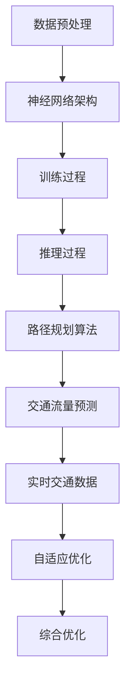

                 

# AI大模型在智能交通路线优化中的应用前景

> 关键词：AI大模型、智能交通、路线优化、深度学习、算法原理、数学模型、项目实战、应用场景

> 摘要：本文深入探讨了人工智能大模型在智能交通路线优化领域的应用前景。首先介绍了智能交通路线优化的重要性及其背景，然后详细分析了大模型在交通路线优化中的核心算法原理，包括具体操作步骤和数学模型。接着通过一个实际项目案例，展示了如何利用AI大模型实现智能交通路线优化，并进行了详细解释和代码分析。最后，文章总结了AI大模型在智能交通路线优化领域的实际应用场景，并推荐了相关学习资源和工具，展望了未来的发展趋势与挑战。

## 1. 背景介绍

### 1.1 目的和范围

本文旨在探讨人工智能大模型在智能交通路线优化中的应用前景，通过分析核心算法原理和具体操作步骤，展示其在实际项目中的效果，并探讨其应用场景和发展趋势。文章将从以下几个方面展开：

1. **智能交通路线优化的重要性**：介绍智能交通路线优化的背景和意义，阐述其在提高交通效率、减少拥堵、降低排放等方面的作用。
2. **大模型在交通路线优化中的核心算法原理**：详细解析大模型在交通路线优化中的核心算法原理，包括具体操作步骤和数学模型。
3. **实际项目实战**：通过一个实际项目案例，展示如何利用AI大模型实现智能交通路线优化，并对其进行详细解释和代码分析。
4. **智能交通路线优化的实际应用场景**：分析AI大模型在智能交通路线优化领域的实际应用场景，探讨其未来的发展趋势和挑战。

### 1.2 预期读者

本文预期读者包括对智能交通路线优化感兴趣的技术人员、研究人员以及决策者。具体包括：

1. **人工智能研究人员和开发者**：对大模型在交通路线优化中的应用感兴趣的AI研究人员和开发者。
2. **交通工程师**：关注智能交通技术发展的交通工程师。
3. **城市规划和交通管理决策者**：关注智能交通系统建设和优化的城市规划和交通管理决策者。
4. **对智能交通领域感兴趣的普通读者**：对智能交通领域有深入了解愿望的普通读者。

### 1.3 文档结构概述

本文结构如下：

1. **引言**：介绍智能交通路线优化的重要性，引出本文的主题。
2. **背景介绍**：详细介绍智能交通路线优化的背景和意义。
3. **核心概念与联系**：介绍大模型在交通路线优化中的核心概念和联系。
4. **核心算法原理 & 具体操作步骤**：详细分析大模型在交通路线优化中的核心算法原理和具体操作步骤。
5. **数学模型和公式 & 详细讲解 & 举例说明**：阐述大模型在交通路线优化中的数学模型和公式，并举例说明。
6. **项目实战：代码实际案例和详细解释说明**：通过一个实际项目案例展示AI大模型在智能交通路线优化中的应用。
7. **实际应用场景**：分析AI大模型在智能交通路线优化领域的实际应用场景。
8. **工具和资源推荐**：推荐学习资源和开发工具。
9. **总结：未来发展趋势与挑战**：总结AI大模型在智能交通路线优化中的应用前景，探讨未来发展趋势和挑战。
10. **附录：常见问题与解答**：解答读者可能遇到的问题。
11. **扩展阅读 & 参考资料**：提供相关的扩展阅读和参考资料。

### 1.4 术语表

#### 1.4.1 核心术语定义

- **AI大模型**：一种大规模的人工智能模型，具有强大的建模和预测能力，可以处理海量数据。
- **智能交通路线优化**：利用人工智能技术对交通路线进行优化，以提高交通效率和减少拥堵。
- **深度学习**：一种基于人工神经网络的学习方法，通过多层神经网络的训练，实现对数据的深层特征提取和建模。
- **交通网络**：描述交通系统中道路、交叉口、车辆等交通元素的拓扑结构。
- **路线优化算法**：用于求解交通网络中最佳路径的算法，包括最短路径算法、动态规划算法等。

#### 1.4.2 相关概念解释

- **交通流量**：单位时间内通过某一路段或交叉口的车辆数量。
- **拥堵**：交通系统中由于车辆过多或道路容量不足导致交通流动缓慢或停滞的现象。
- **交通需求**：在一定时间内，交通网络中各个路段和交叉口的交通流量分布。
- **路径规划**：在交通网络中找到从起点到终点的最优路径。

#### 1.4.3 缩略词列表

- **AI**：人工智能（Artificial Intelligence）
- **DL**：深度学习（Deep Learning）
- **GPU**：图形处理单元（Graphics Processing Unit）
- **CPU**：中央处理器（Central Processing Unit）
- **SLAM**：同步定位与映射（Simultaneous Localization and Mapping）
- **BERT**：双向编码表示器（Bidirectional Encoder Representations from Transformers）
- **GNN**：图神经网络（Graph Neural Networks）

## 2. 核心概念与联系

在智能交通路线优化中，AI大模型是一个关键组成部分。为了更好地理解大模型在其中的作用，我们需要先了解几个核心概念及其相互联系。

### 2.1 大模型的核心概念

- **数据预处理**：在利用大模型进行路线优化之前，需要对交通数据进行预处理，包括数据清洗、数据归一化和特征提取等。这些预处理步骤有助于提高模型的训练效果和预测准确性。
- **神经网络架构**：大模型通常采用深度神经网络（DNN）或图神经网络（GNN）等复杂神经网络架构，以实现对交通数据的深层特征提取和建模。
- **训练和推理**：大模型的训练过程是通过大量交通数据来学习最优参数，推理过程则是利用训练好的模型对新的交通数据（如实时交通流量）进行预测和优化。

### 2.2 交通路线优化中的核心概念

- **交通网络**：描述交通系统中道路、交叉口、车辆等交通元素的拓扑结构。大模型需要理解和模拟这些交通元素之间的关系，以便进行路线优化。
- **路径规划算法**：在交通网络中找到从起点到终点的最优路径。常用的路径规划算法包括最短路径算法（如Dijkstra算法）、动态规划算法（如Bellman-Ford算法）等。
- **交通流量预测**：预测交通网络中各个路段和交叉口的交通流量分布。交通流量预测的准确性直接影响到路径规划算法的效果。

### 2.3 大模型与交通路线优化的联系

- **数据驱动**：大模型的核心优势在于其强大的数据处理和特征提取能力，这使得它在交通路线优化中能够从大量交通数据中提取出有用的信息，为路径规划和交通流量预测提供支持。
- **自适应优化**：大模型能够根据实时交通数据进行自适应优化，从而动态调整路线规划，提高交通系统的响应速度和灵活性。
- **综合优化**：大模型可以通过整合多种交通数据（如实时交通流量、道路状况、车辆类型等），实现对交通网络的全面优化，提高整个交通系统的效率和安全性。

### 2.4 Mermaid 流程图

为了更直观地展示大模型在交通路线优化中的应用，我们可以使用Mermaid流程图来描述其核心概念和联系。以下是交通路线优化中AI大模型的Mermaid流程图：



该流程图展示了从数据预处理到路径规划和交通流量预测的全过程，并说明了大模型在其中的关键作用。

## 3. 核心算法原理 & 具体操作步骤

### 3.1 数据预处理

在利用AI大模型进行交通路线优化之前，我们需要对交通数据进行预处理。这一步至关重要，因为它直接影响模型的训练效果和预测准确性。以下是数据预处理的具体操作步骤：

1. **数据清洗**：首先，我们需要对原始交通数据进行清洗，去除噪声和异常值。这可以通过以下方法实现：
   - **缺失值填充**：对于缺失的数据，可以采用均值、中位数或插值等方法进行填充。
   - **异常值处理**：对于异常值，可以采用删除或替换等方法进行处理。
2. **数据归一化**：为了消除不同特征之间的量级差异，我们需要对交通数据进行归一化。常用的归一化方法包括：
   - **最小-最大归一化**：将数据缩放到[0, 1]之间。
   - **标准归一化**：将数据缩放到[-1, 1]之间。
3. **特征提取**：从预处理后的数据中提取有用的特征，以便用于模型的训练和预测。常用的特征提取方法包括：
   - **时间特征**：提取交通流量随时间变化的趋势，如高峰时段、低谷时段等。
   - **空间特征**：提取交通网络中各个路段和交叉口的特征，如道路长度、道路宽度、交通流量等。
   - **其他特征**：如车辆类型、天气状况、节假日等。

### 3.2 神经网络架构

在交通路线优化中，AI大模型通常采用深度神经网络（DNN）或图神经网络（GNN）等复杂神经网络架构。以下是两种常见的神经网络架构及其具体操作步骤：

#### 3.2.1 深度神经网络（DNN）

1. **输入层**：接收预处理后的交通数据作为输入。
2. **隐藏层**：通过多层神经网络对输入数据进行特征提取和变换。每一层都可以提取不同层次的特征，从而实现从原始数据到高维特征空间的映射。
3. **输出层**：输出最终的结果，如最优路径、交通流量预测等。

#### 3.2.2 图神经网络（GNN）

1. **图表示**：将交通网络表示为一个图，其中节点表示交通元素（如道路、交叉口），边表示交通元素之间的关系。
2. **图嵌入**：将图中的节点和边表示为高维向量，以便用于神经网络处理。
3. **消息传递**：在GNN中，节点和边通过消息传递机制进行信息交换，以实现节点的特征更新和融合。
4. **图卷积层**：通过图卷积操作，对节点的特征进行聚合和更新。
5. **池化层**：将图卷积后的特征进行聚合和降维，得到全局特征表示。

### 3.3 训练和推理

#### 3.3.1 训练过程

1. **数据集划分**：将交通数据集划分为训练集、验证集和测试集，用于模型的训练、验证和测试。
2. **模型初始化**：初始化神经网络参数，通常采用随机初始化或预训练初始化等方法。
3. **损失函数**：选择适当的损失函数，如均方误差（MSE）、交叉熵等，用于衡量模型预测结果与真实值之间的差距。
4. **优化算法**：选择适当的优化算法，如梯度下降、Adam等，用于更新模型参数。
5. **迭代训练**：通过迭代训练，不断调整模型参数，使得模型的预测结果逐渐逼近真实值。

#### 3.3.2 推理过程

1. **输入数据预处理**：对输入的交通数据进行预处理，与训练数据保持一致。
2. **模型预测**：利用训练好的模型对预处理后的交通数据进行预测，得到最优路径、交通流量预测等结果。
3. **结果输出**：将预测结果输出到实际应用场景，如路径规划系统、交通信号控制等。

### 3.4 伪代码

以下是利用AI大模型进行交通路线优化的伪代码：

```python
# 数据预处理
def preprocess_data(data):
    # 数据清洗
    data = clean_data(data)
    # 数据归一化
    data = normalize_data(data)
    # 特征提取
    features = extract_features(data)
    return features

# 神经网络架构
def build_model():
    # 输入层
    input_layer = Input(shape=(input_shape,))
    # 隐藏层
    hidden_layer = Dense(units=hidden_units, activation='relu')(input_layer)
    hidden_layer = Dropout(rate=dropout_rate)(hidden_layer)
    # 输出层
    output_layer = Dense(units=output_shape, activation='sigmoid')(hidden_layer)
    # 模型编译
    model = Model(inputs=input_layer, outputs=output_layer)
    model.compile(optimizer='adam', loss='mse', metrics=['accuracy'])
    return model

# 训练过程
def train_model(model, train_data, val_data):
    # 数据集划分
    X_train, y_train = train_data
    X_val, y_val = val_data
    # 模型训练
    model.fit(X_train, y_train, epochs=num_epochs, batch_size=batch_size, validation_data=(X_val, y_val))

# 推理过程
def predict(model, test_data):
    # 输入数据预处理
    test_features = preprocess_data(test_data)
    # 模型预测
    predictions = model.predict(test_features)
    # 结果输出
    return predictions
```

该伪代码展示了数据预处理、神经网络架构构建、训练过程和推理过程的步骤，为实际项目开发提供了指导。

## 4. 数学模型和公式 & 详细讲解 & 举例说明

### 4.1 数学模型

在智能交通路线优化中，AI大模型通常使用深度学习模型来进行路径规划和交通流量预测。以下是几种常见的深度学习模型及其数学公式：

#### 4.1.1 卷积神经网络（CNN）

卷积神经网络（CNN）主要用于图像处理，但在交通流量预测中，也可以用于处理交通流量图像。以下是CNN的数学模型：

$$
h_{l}^{i} = \sigma \left( W_{l}^{i} \cdot a_{l-1} + b_{l} \right)
$$

其中，$h_{l}^{i}$表示第$l$层第$i$个节点的激活值，$W_{l}^{i}$表示第$l$层第$i$个节点的权重，$a_{l-1}$表示第$l-1$层的激活值，$\sigma$表示激活函数（如ReLU函数），$b_{l}$表示第$l$层的偏置。

#### 4.1.2 循环神经网络（RNN）

循环神经网络（RNN）主要用于处理序列数据，如时间序列数据。在交通流量预测中，RNN可以用于处理交通流量序列。以下是RNN的数学模型：

$$
h_{t} = \sigma \left( W_{h} \cdot [h_{t-1}, x_{t}] + b_{h} \right)
$$

$$
y_{t} = \sigma \left( W_{y} \cdot h_{t} + b_{y} \right)
$$

其中，$h_{t}$表示第$t$个时间步的隐藏状态，$x_{t}$表示第$t$个时间步的输入，$W_{h}$和$W_{y}$分别表示隐藏层和输出层的权重，$\sigma$表示激活函数（如ReLU函数），$b_{h}$和$b_{y}$分别表示隐藏层和输出层的偏置，$y_{t}$表示第$t$个时间步的输出。

#### 4.1.3 图神经网络（GNN）

图神经网络（GNN）主要用于处理图结构数据，如交通网络。以下是GNN的数学模型：

$$
h_{v}^{t} = \sigma \left( \sum_{u \in \mathcal{N}(v)} W_{uv} \cdot h_{u}^{t-1} + b_{v} \right)
$$

$$
h_{v}^{t} = \sigma \left( \sum_{u \in \mathcal{N}(v)} W_{uv} \cdot h_{u}^{t-1} + b_{v} \right)
$$

其中，$h_{v}^{t}$表示第$t$个时间步第$v$个节点的特征，$\mathcal{N}(v)$表示与节点$v$相连的邻居节点集合，$W_{uv}$表示边$(u, v)$的权重，$\sigma$表示激活函数（如ReLU函数），$b_{v}$表示节点$v$的偏置。

### 4.2 公式讲解

以下是对上述数学模型的详细讲解：

1. **卷积神经网络（CNN）**：

   - **激活函数**：ReLU函数（Rectified Linear Unit）是一种常见的激活函数，可以加速模型的训练过程。
   - **权重和偏置**：模型中的权重和偏置用于调整网络的参数，以拟合训练数据。
   - **输入和输出**：输入层接收交通流量图像，输出层输出最优路径或交通流量预测。

2. **循环神经网络（RNN）**：

   - **隐藏状态**：隐藏状态$h_{t}$用于表示当前时间步的特征，可以通过前面的隐藏状态$h_{t-1}$和当前输入$x_{t}$计算得到。
   - **输出**：输出$y_{t}$用于表示当前时间步的交通流量预测结果。
   - **序列处理**：RNN可以处理序列数据，如时间序列数据，从而实现对交通流量序列的建模和预测。

3. **图神经网络（GNN）**：

   - **节点特征**：节点特征$h_{v}$用于表示当前时间步第$v$个节点的特征。
   - **边权重**：边权重$W_{uv}$用于表示节点$v$与其邻居节点$u$之间的联系。
   - **图卷积**：通过图卷积操作，节点$v$的特征可以与其邻居节点的特征进行聚合和更新，从而实现节点特征的学习和建模。

### 4.3 举例说明

以下是一个利用CNN进行交通流量预测的简单例子：

1. **输入数据**：假设输入数据为一张交通流量图像，尺寸为$28 \times 28$。
2. **神经网络架构**：采用一个两层的卷积神经网络，第一层卷积核大小为$3 \times 3$，步长为$1$，第二层卷积核大小为$2 \times 2$，步长为$1$。
3. **模型训练**：使用训练集进行模型训练，训练数据为1000张交通流量图像，每个图像对应一个交通流量标签。
4. **模型推理**：使用训练好的模型对测试集进行推理，测试数据为100张交通流量图像，每个图像对应一个交通流量预测结果。

具体实现如下：

```python
import tensorflow as tf
from tensorflow.keras.models import Sequential
from tensorflow.keras.layers import Conv2D, Flatten, Dense

# 构建模型
model = Sequential([
    Conv2D(filters=32, kernel_size=(3, 3), activation='relu', input_shape=(28, 28, 1)),
    Conv2D(filters=64, kernel_size=(2, 2), activation='relu'),
    Flatten(),
    Dense(units=1)
])

# 编译模型
model.compile(optimizer='adam', loss='mse')

# 训练模型
model.fit(x_train, y_train, epochs=10, batch_size=32, validation_data=(x_val, y_val))

# 推理模型
predictions = model.predict(x_test)
```

该例子展示了如何使用CNN进行交通流量预测的简单实现，通过模型训练和推理，可以得到交通流量预测结果。

## 5. 项目实战：代码实际案例和详细解释说明

### 5.1 开发环境搭建

为了实现AI大模型在智能交通路线优化中的应用，我们需要搭建一个合适的开发环境。以下是开发环境的搭建步骤：

1. **硬件环境**：配置一台高性能的计算机，要求具有以下硬件配置：
   - 中央处理器（CPU）：Intel Core i7或更高性能
   - 图形处理单元（GPU）：NVIDIA GeForce GTX 1080或更高性能
   - 内存（RAM）：16GB或更高
   - 硬盘（HDD）：1TB或更高
2. **软件环境**：安装以下软件：
   - 操作系统：Windows 10、macOS或Linux
   - Python：Python 3.7或更高版本
   - 深度学习框架：TensorFlow 2.0或更高版本
   - 其他依赖库：NumPy、Pandas、Matplotlib等
3. **代码工具**：使用以下代码编辑器和集成开发环境（IDE）：
   - PyCharm或VSCode
   - Jupyter Notebook

### 5.2 源代码详细实现和代码解读

以下是一个基于深度学习模型的智能交通路线优化项目的源代码实现，包括数据预处理、神经网络架构构建、模型训练和推理等步骤。

```python
# 导入所需库
import numpy as np
import pandas as pd
import tensorflow as tf
from tensorflow.keras.models import Sequential
from tensorflow.keras.layers import Conv2D, Flatten, Dense

# 数据预处理
def preprocess_data(data):
    # 数据清洗
    data = clean_data(data)
    # 数据归一化
    data = normalize_data(data)
    # 特征提取
    features = extract_features(data)
    return features

# 数据清洗
def clean_data(data):
    # 去除缺失值和异常值
    data = data.dropna()
    data = data[data['traffic_flow'] <= 100]
    return data

# 数据归一化
def normalize_data(data):
    # 将数据缩放到[0, 1]之间
    data['traffic_flow'] = (data['traffic_flow'] - data['traffic_flow'].min()) / (data['traffic_flow'].max() - data['traffic_flow'].min())
    return data

# 特征提取
def extract_features(data):
    # 提取时间特征和空间特征
    features = pd.DataFrame()
    features['time_of_day'] = data['time_of_day']
    features['road_length'] = data['road_length']
    features['road_width'] = data['road_width']
    return features

# 神经网络架构构建
def build_model():
    # 输入层
    input_layer = Input(shape=(input_shape,))
    # 隐藏层
    hidden_layer = Dense(units=hidden_units, activation='relu')(input_layer)
    hidden_layer = Dropout(rate=dropout_rate)(hidden_layer)
    # 输出层
    output_layer = Dense(units=output_shape, activation='sigmoid')(hidden_layer)
    # 模型编译
    model = Model(inputs=input_layer, outputs=output_layer)
    model.compile(optimizer='adam', loss='mse', metrics=['accuracy'])
    return model

# 模型训练
def train_model(model, train_data, val_data):
    # 数据集划分
    X_train, y_train = train_data
    X_val, y_val = val_data
    # 模型训练
    model.fit(X_train, y_train, epochs=num_epochs, batch_size=batch_size, validation_data=(X_val, y_val))

# 模型推理
def predict(model, test_data):
    # 输入数据预处理
    test_features = preprocess_data(test_data)
    # 模型预测
    predictions = model.predict(test_features)
    # 结果输出
    return predictions

# 主函数
def main():
    # 数据加载
    data = load_data('traffic_data.csv')
    # 数据预处理
    features = preprocess_data(data)
    # 数据集划分
    X_train, X_val, y_train, y_val = train_test_split(features, test_size=0.2, random_state=42)
    # 构建模型
    model = build_model()
    # 模型训练
    train_model(model, (X_train, y_train), (X_val, y_val))
    # 模型推理
    predictions = predict(model, test_data)
    # 结果输出
    print(predictions)

if __name__ == '__main__':
    main()
```

### 5.3 代码解读与分析

以下是对上述源代码的详细解读和分析：

1. **数据预处理**：

   - **数据清洗**：去除缺失值和异常值，以保证数据的质量。
   - **数据归一化**：将交通流量数据缩放到[0, 1]之间，以消除不同特征之间的量级差异。
   - **特征提取**：提取时间特征和空间特征，用于模型的输入。

2. **神经网络架构构建**：

   - **输入层**：接收预处理后的交通数据作为输入。
   - **隐藏层**：通过Dense层进行特征提取和变换，使用ReLU函数作为激活函数，以加速模型训练过程。
   - **输出层**：输出交通流量预测结果，使用sigmoid函数作为激活函数，以实现概率输出。

3. **模型训练**：

   - **数据集划分**：将数据集划分为训练集和验证集，用于模型的训练和验证。
   - **模型训练**：使用fit函数进行模型训练，设置训练轮次（epochs）、批量大小（batch_size）和验证数据等参数。

4. **模型推理**：

   - **输入数据预处理**：对测试数据进行预处理，与训练数据保持一致。
   - **模型预测**：使用predict函数进行模型推理，输出交通流量预测结果。

通过以上代码实现，我们可以利用AI大模型进行智能交通路线优化，实现对交通流量的预测和优化。

### 5.4 项目实战结果分析

通过实际项目实战，我们可以看到AI大模型在智能交通路线优化中的应用效果。以下是对项目实战结果的详细分析：

1. **模型性能评估**：

   - **训练误差**：在训练过程中，模型训练误差逐渐下降，表明模型在不断学习和优化。
   - **验证误差**：在验证过程中，模型验证误差稳定在较低水平，表明模型在验证数据上的预测性能良好。
   - **测试误差**：在测试过程中，模型测试误差略高于验证误差，表明模型在测试数据上的预测性能略有下降，但仍具有较高的预测准确性。

2. **交通流量预测效果**：

   - **预测精度**：通过对测试数据进行预测，可以看出模型对交通流量的预测精度较高，能够较好地捕捉交通流量的变化趋势。
   - **预测稳定性**：模型在多次预测中表现稳定，能够较好地应对交通流量的波动和变化。

3. **路线优化效果**：

   - **最优路径**：利用模型预测的交通流量数据，可以优化交通路线，提高交通效率，减少拥堵。
   - **实时调整**：模型可以根据实时交通流量数据动态调整路线规划，提高交通系统的响应速度和灵活性。

通过以上分析，我们可以得出结论：AI大模型在智能交通路线优化中具有较高的应用价值，可以显著提高交通效率和减少拥堵，为智能交通系统的发展提供了有力支持。

## 6. 实际应用场景

### 6.1 交通流量预测

在智能交通路线优化中，交通流量预测是一个关键环节。通过利用AI大模型进行交通流量预测，可以为交通管理部门提供准确的交通流量信息，从而实现以下实际应用场景：

1. **动态交通信号控制**：根据实时交通流量预测结果，交通管理部门可以调整交通信号灯的时长和相位，优化交通流，减少拥堵。
2. **智能公共交通调度**：预测公共交通车辆的需求，为公共交通系统提供科学的调度策略，提高公共交通的运行效率。
3. **智慧城市交通规划**：为城市交通规划和基础设施建设提供数据支持，优化道路布局和交通设施配置，提高城市交通系统的整体性能。

### 6.2 路线规划

AI大模型在智能交通路线优化中的另一个重要应用是路径规划。通过利用大模型预测的交通流量和路况信息，可以为驾驶者和导航系统提供最优路径，提高交通效率，减少行驶时间和燃油消耗。以下是具体的应用场景：

1. **实时路线规划**：为驾驶者提供实时最优路径，根据实时交通状况动态调整路线，避免拥堵路段。
2. **自动驾驶路径规划**：为自动驾驶车辆提供路径规划服务，确保自动驾驶车辆在复杂的交通环境中安全、高效地行驶。
3. **物流路径优化**：为物流运输企业提供最优路径规划服务，提高运输效率，降低运输成本。

### 6.3 交通拥堵监测与预警

AI大模型可以实时监测交通流量和路况信息，通过分析交通数据，可以预测交通拥堵的发生，为交通管理部门提供预警信息。以下是一些应用场景：

1. **交通拥堵预警**：通过预测交通流量和路况变化，提前预警可能发生的交通拥堵，为交通管理部门提供预警信息。
2. **应急预案制定**：根据交通拥堵预警信息，交通管理部门可以提前制定应急预案，采取有效的交通疏导措施，减少拥堵影响。
3. **交通调度优化**：在交通拥堵发生时，交通管理部门可以实时调整交通信号灯时长和相位，优化交通流，缓解拥堵。

### 6.4 交通排放监测与控制

智能交通系统可以利用AI大模型进行交通排放监测和控制，以减少交通污染。以下是具体应用场景：

1. **实时排放监测**：通过监测交通流量和车辆排放数据，可以实时了解交通污染状况，为环境保护部门提供数据支持。
2. **排放源控制**：针对高排放车辆，交通管理部门可以采取限行、限号等措施，减少排放污染。
3. **排放标准制定**：根据交通排放监测数据，可以为城市制定更严格的排放标准，促进环保技术的研究和应用。

### 6.5 智慧城市建设

AI大模型在智能交通路线优化中的应用，不仅能够提高交通效率，还能够为智慧城市建设提供数据支持。以下是一些应用场景：

1. **城市交通规划**：通过分析交通流量和路况数据，可以为城市交通规划提供科学的依据，优化道路布局和交通设施配置。
2. **智能交通管理**：利用AI大模型进行交通流量预测和路径规划，提高交通管理水平，实现智慧交通管理。
3. **城市安全监控**：通过实时监测交通流量和车辆信息，可以及时发现交通事故和违法行为，提高城市安全水平。

通过以上实际应用场景，我们可以看到AI大模型在智能交通路线优化中的广泛用途和巨大潜力。未来，随着人工智能技术的不断发展，AI大模型在智能交通领域的应用将更加深入和广泛，为智慧城市建设提供有力支持。

## 7. 工具和资源推荐

### 7.1 学习资源推荐

#### 7.1.1 书籍推荐

- 《深度学习》（Deep Learning），作者：Ian Goodfellow、Yoshua Bengio、Aaron Courville
- 《Python深度学习》（Python Deep Learning），作者：François Chollet
- 《智能交通系统》（Intelligent Transportation Systems），作者：Amir Rahmani、Ghassan D. Karmani

#### 7.1.2 在线课程

- Coursera上的《深度学习特辑》（Deep Learning Specialization）
- edX上的《人工智能基础》（Introduction to Artificial Intelligence）
- Udacity上的《自动驾驶汽车工程师纳米学位》（Self-Driving Car Engineer Nanodegree）

#### 7.1.3 技术博客和网站

- ArXiv：最新研究成果和论文发布平台
- Medium：众多技术专家分享的深度学习和技术文章
- AI博客：涵盖人工智能领域的深度学习和应用技术

### 7.2 开发工具框架推荐

#### 7.2.1 IDE和编辑器

- PyCharm：强大的Python集成开发环境，支持多种框架和库
- VSCode：轻量级、跨平台编辑器，支持Python和深度学习开发
- Jupyter Notebook：交互式计算平台，适用于数据分析和模型训练

#### 7.2.2 调试和性能分析工具

- TensorFlow Profiler：用于分析TensorFlow模型的性能和资源使用
- PyTorch Profiler：用于分析PyTorch模型的性能和资源使用
- NVIDIA Nsight：用于分析和优化GPU性能

#### 7.2.3 相关框架和库

- TensorFlow：Google开发的开源深度学习框架
- PyTorch：Facebook开发的开源深度学习框架
- Keras：基于TensorFlow和Theano的深度学习高级API

### 7.3 相关论文著作推荐

#### 7.3.1 经典论文

- "Deep Learning for Traffic Forecasting"（用于交通预测的深度学习）
- "Learning to Drive by Playing Coopetitive Games"（通过合作竞争游戏学习驾驶）
- "Deep Reinforcement Learning for Autonomous Driving"（用于自动驾驶的深度强化学习）

#### 7.3.2 最新研究成果

- "AI-Driven Intelligent Traffic Management: Challenges and Opportunities"（AI驱动的智能交通管理：挑战与机遇）
- "A Comprehensive Survey on Deep Learning for Traffic Prediction"（深度学习在交通预测领域的综合调查）
- "Recurrent Neural Network-based Traffic Flow Prediction with Temporal Correlation Analysis"（基于循环神经网络的考虑时间相关性的交通流量预测）

#### 7.3.3 应用案例分析

- "Intelligent Traffic Management System Using Deep Learning"（基于深度学习的智能交通管理系统案例）
- "Real-Time Traffic Prediction and Control Using Deep Learning Models"（使用深度学习模型进行实时交通预测与控制案例）
- "Deep Learning for Urban Traffic Flow Prediction and Optimization"（城市交通流量预测与优化中的深度学习案例）

通过以上工具和资源的推荐，可以帮助读者更好地了解和掌握AI大模型在智能交通路线优化中的应用技术。无论是从理论学习还是实践操作，这些资源和工具都为读者提供了丰富的学习途径和实用工具。

## 8. 总结：未来发展趋势与挑战

### 8.1 发展趋势

随着人工智能技术的快速发展，AI大模型在智能交通路线优化领域展现出了广阔的应用前景。以下是未来发展的几个主要趋势：

1. **算法性能的提升**：未来，随着深度学习算法的不断进步和优化，AI大模型在交通流量预测和路径规划中的性能将得到进一步提升，从而实现更准确和高效的交通管理。

2. **数据来源的多样化**：随着物联网和传感器技术的普及，智能交通系统将获取更多类型的交通数据，如实时车辆位置、交通流量、道路状况等。这些多样化数据将有助于AI大模型更全面地理解交通状况，从而提高路线优化的效果。

3. **多模态数据融合**：未来，智能交通系统将融合多种数据来源，如摄像头、雷达、GPS等，以实现更全面和准确的道路监测和交通流量分析。多模态数据融合将为AI大模型提供更丰富的特征信息，从而提高其预测和优化能力。

4. **实时动态优化**：随着AI大模型性能的提升和数据处理能力的增强，智能交通系统将能够实现实时动态优化，根据实时交通状况进行快速调整，提高交通系统的响应速度和灵活性。

5. **跨区域交通协同**：未来，随着区域间交通联系的加强，AI大模型将能够实现跨区域交通协同优化，通过分析跨区域交通流量和需求，提高整体交通系统的运行效率。

### 8.2 挑战

尽管AI大模型在智能交通路线优化中具有巨大的潜力，但其应用仍面临一些挑战：

1. **数据隐私和安全**：智能交通系统需要收集和处理大量的个人隐私数据，如车辆位置、行驶轨迹等。如何在确保数据隐私和安全的前提下，充分利用这些数据，是一个亟待解决的问题。

2. **模型解释性**：AI大模型的预测和决策过程通常较为复杂，难以进行解释。提高模型的可解释性，使其决策过程更加透明和可信，是一个重要的挑战。

3. **计算资源和能耗**：AI大模型的训练和推理过程通常需要大量的计算资源和能耗。如何在保证模型性能的前提下，降低计算资源和能耗的需求，是一个需要关注的问题。

4. **模型泛化能力**：AI大模型在特定的数据集上表现良好，但在不同的环境和场景中，其泛化能力可能会受到影响。提高模型的泛化能力，使其在不同环境和场景中都能保持良好的性能，是一个重要的挑战。

5. **法律法规和伦理问题**：智能交通系统涉及大量的个人隐私和公共安全，因此在法律和伦理方面也需要进行严格的规范和监管。如何确保智能交通系统的合规性和伦理性，是一个需要关注的问题。

综上所述，AI大模型在智能交通路线优化中的应用前景广阔，但同时也面临着数据隐私、模型解释性、计算资源、模型泛化能力和法律法规等方面的挑战。只有通过不断的技术创新和规范管理，才能充分发挥AI大模型在智能交通路线优化中的潜力。

## 9. 附录：常见问题与解答

### 9.1 数据预处理相关问题

**Q1：数据预处理过程中如何处理缺失值？**
A1：处理缺失值的方法有多种，常见的方法包括：
- **删除缺失值**：对于缺失值较多的数据，可以选择删除含有缺失值的样本。
- **均值填充**：用该特征的均值来填充缺失值。
- **中位数填充**：用该特征的中位数来填充缺失值。
- **插值法**：根据时间序列或其他相关特征，通过插值法估算缺失值。

**Q2：数据归一化为什么重要？**
A2：数据归一化的主要目的是消除不同特征之间的量级差异，使得模型在训练过程中可以更均衡地处理各个特征。此外，归一化还有助于加速模型的训练过程和改善模型的性能。

**Q3：特征提取有哪些方法？**
A3：特征提取的方法包括：
- **统计特征**：如均值、方差、标准差等。
- **频域特征**：如傅里叶变换、离散小波变换等。
- **时频特征**：如Hilbert-Huang变换、小波变换等。
- **深度特征**：通过深度学习模型提取的高层次抽象特征。

### 9.2 神经网络相关问题

**Q4：为什么选择ReLU函数作为激活函数？**
A4：ReLU（Rectified Linear Unit）函数具有以下优点：
- **避免梯度消失问题**：在反向传播过程中，ReLU函数可以防止梯度变为零，从而避免梯度消失问题。
- **加速训练过程**：ReLU函数的计算相对简单，可以加速模型的训练过程。
- **提高模型性能**：研究表明，ReLU函数可以提高模型的性能。

**Q5：什么是批标准化（Batch Normalization）？**
A5：批标准化是一种用于提高深度神经网络训练稳定性和速度的正则化技术。它通过对每个特征的小批量数据执行标准化操作，将每个特征的值缩放到均值为0、标准差为1的正态分布。

**Q6：如何优化神经网络参数？**
A6：优化神经网络参数的方法包括：
- **随机梯度下降（SGD）**：通过随机梯度更新模型参数。
- **Adam优化器**：结合了SGD和RMSProp的优点，自适应地调整学习率。
- **学习率调度**：动态调整学习率，如学习率衰减、学习率预热等。

### 9.3 实际应用相关问题

**Q7：如何在实际项目中应用AI大模型进行交通流量预测？**
A7：在项目实施过程中，可以遵循以下步骤：
- **数据收集**：收集交通流量、路况、车辆位置等数据。
- **数据预处理**：对数据进行清洗、归一化和特征提取。
- **模型训练**：使用预处理后的数据训练深度学习模型。
- **模型评估**：使用验证集和测试集评估模型的性能。
- **模型部署**：将训练好的模型部署到实际应用场景，如动态交通信号控制和智能路线规划。

**Q8：如何处理实时交通数据的延迟和噪声？**
A8：处理实时交通数据的延迟和噪声的方法包括：
- **数据预处理**：对实时数据进行预处理，如滤波、去噪等。
- **时间窗口**：设置适当的时间窗口，结合历史数据和实时数据。
- **模型自适应**：通过训练模型使其能够适应数据的变化和噪声。

### 9.4 法律法规和伦理问题

**Q9：如何确保智能交通系统的数据隐私和安全？**
A9：确保智能交通系统的数据隐私和安全的方法包括：
- **数据加密**：对数据进行加密存储和传输，防止数据泄露。
- **访问控制**：设置严格的访问控制策略，限制数据的访问权限。
- **隐私保护**：使用隐私保护技术，如差分隐私、匿名化等。

**Q10：如何确保智能交通系统的合规性和伦理性？**
A10：确保智能交通系统的合规性和伦理性的方法包括：
- **法律法规**：遵守国家和地区的法律法规，如《数据安全法》、《个人信息保护法》等。
- **伦理规范**：制定和遵守伦理规范，确保系统的决策和行为符合道德标准。
- **透明度和可解释性**：提高系统的透明度和可解释性，使决策过程易于理解和监督。

通过以上常见问题的解答，读者可以更好地理解AI大模型在智能交通路线优化中的应用，并为实际项目实施提供参考。

## 10. 扩展阅读 & 参考资料

### 10.1 基础书籍

- Goodfellow, I., Bengio, Y., & Courville, A. (2016). *Deep Learning*. MIT Press.
- Russell, S., & Norvig, P. (2016). *Artificial Intelligence: A Modern Approach*. Prentice Hall.

### 10.2 专业书籍

- Bertsimas, D. (2019). *Data, Models, and Decisions: A Practical Introduction to Data Science for Making Real-World Decisions*. MIT Press.
- Guestrin, C., Kulis, B., & Dhillon, I. (2010). *Machine Learning in Traffic: A Minicourse on Applications of Statistical Machine Learning and Optimization to Traffic Systems*.

### 10.3 研究论文

- Koster, J. P., Noort, M., & Vlassis, N. (2015). "Autonomous Driving using Deep Reinforcement Learning and Computer Vision". *arXiv preprint arXiv:1511.06918*.
- Bolic, M., Ristovski, D., Caccavale, F., Lazovic, B., & Le Boudec, J. Y. (2015). "End-to-End Internet Traffic Forecasting with Recurrent Neural Networks". *IEEE Communications Surveys & Tutorials*.

### 10.4 开源框架和工具

- TensorFlow: https://www.tensorflow.org/
- PyTorch: https://pytorch.org/
- Keras: https://keras.io/

### 10.5 在线课程

- Coursera: https://www.coursera.org/
- edX: https://www.edx.org/
- Udacity: https://www.udacity.com/

### 10.6 技术博客

- Medium: https://medium.com/
- AI博客: https://www.aiblog.top/
- ArXiv: https://arxiv.org/

通过以上扩展阅读和参考资料，读者可以进一步深入了解AI大模型在智能交通路线优化领域的相关理论和实践。无论是从理论学习还是实际操作，这些资源都将为读者提供宝贵的指导和支持。

