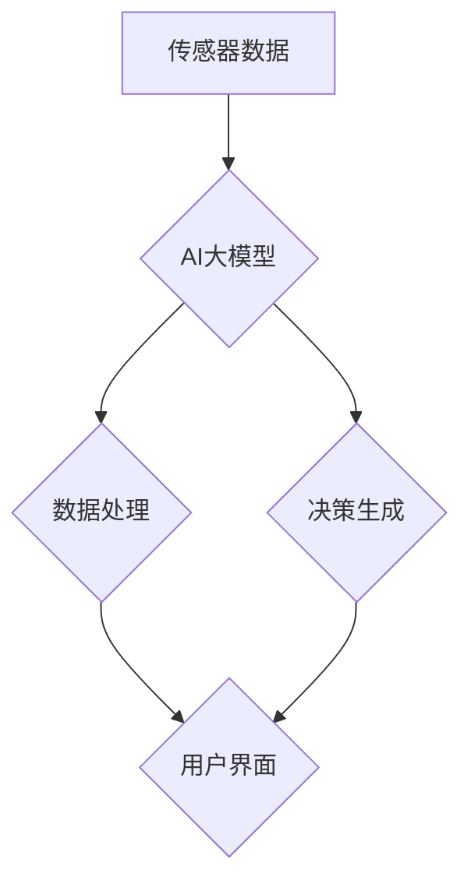

                 

# AI大模型在智能家居中的产品创新

> **关键词：** AI大模型、智能家居、产品创新、机器学习、自然语言处理、数据处理、交互体验

> **摘要：** 本文将深入探讨AI大模型在智能家居领域的产品创新。我们将从背景介绍、核心概念、算法原理、数学模型、实际应用、工具推荐等多个角度，逐步分析AI大模型如何为智能家居带来革命性的变化，并展望其未来发展趋势和挑战。

## 1. 背景介绍

### 1.1 目的和范围

本文旨在分析AI大模型在智能家居领域的应用，探讨其如何通过技术革新推动产品创新。我们将关注以下几个核心问题：

1. **AI大模型的基本概念与分类**
2. **AI大模型在智能家居中的应用场景**
3. **AI大模型在智能家居中的技术挑战与解决方案**
4. **AI大模型在智能家居中的产品创新案例分析**

### 1.2 预期读者

本文适合以下读者群体：

1. **对AI和智能家居感兴趣的技术爱好者**
2. **智能家居行业的从业者**
3. **人工智能、机器学习等相关领域的学者和研究人员**

### 1.3 文档结构概述

本文分为以下几个部分：

1. **背景介绍**：介绍AI大模型在智能家居中的应用背景和目的。
2. **核心概念与联系**：详细解释AI大模型的基本概念和智能家居系统的架构。
3. **核心算法原理 & 具体操作步骤**：讲解AI大模型的工作原理和算法流程。
4. **数学模型和公式 & 详细讲解 & 举例说明**：阐述AI大模型中的数学模型和公式，并提供实际案例说明。
5. **项目实战：代码实际案例和详细解释说明**：展示AI大模型在智能家居项目中的实际应用。
6. **实际应用场景**：分析AI大模型在智能家居中的实际应用场景。
7. **工具和资源推荐**：推荐相关的学习资源、开发工具和框架。
8. **总结：未来发展趋势与挑战**：总结AI大模型在智能家居领域的未来趋势和挑战。
9. **附录：常见问题与解答**：解答读者可能关心的问题。
10. **扩展阅读 & 参考资料**：提供更多的学习资源和参考文献。

### 1.4 术语表

#### 1.4.1 核心术语定义

- **AI大模型**：指具有大规模参数和复杂结构的机器学习模型，通常使用深度学习技术训练。
- **智能家居**：指利用AI技术实现家庭设备互联互通和自动化管理的居住环境。
- **机器学习**：一种人工智能技术，通过数据训练模型，使其能够自动学习和改进性能。
- **自然语言处理**：计算机科学领域中的分支，涉及语言的理解、生成和翻译。

#### 1.4.2 相关概念解释

- **深度学习**：一种机器学习技术，通过多层神经网络进行数据建模。
- **神经网络**：一种模拟生物神经元的计算模型，用于特征提取和分类。
- **数据处理**：对数据进行清洗、转换和整合的过程。

#### 1.4.3 缩略词列表

- **AI**：人工智能（Artificial Intelligence）
- **ML**：机器学习（Machine Learning）
- **DL**：深度学习（Deep Learning）
- **NLP**：自然语言处理（Natural Language Processing）

## 2. 核心概念与联系

在探讨AI大模型在智能家居中的应用之前，我们需要先了解一些核心概念和它们之间的联系。

### 2.1 AI大模型的基本概念

AI大模型是一种具有大规模参数和复杂结构的机器学习模型，通常使用深度学习技术训练。这些模型可以通过对大量数据进行训练，自动学习和改进性能，从而实现高级任务，如图像识别、自然语言处理和语音识别。

#### 2.1.1 深度学习

深度学习是机器学习的一种子领域，通过多层神经网络进行数据建模。深度学习模型能够自动提取数据中的特征，并利用这些特征进行预测和分类。

#### 2.1.2 神经网络

神经网络是一种模拟生物神经元的计算模型，用于特征提取和分类。神经网络由多个层次组成，每个层次负责提取不同层次的特征。通过多层次的组合，神经网络可以捕捉数据中的复杂模式。

#### 2.1.3 数据处理

数据处理是对数据进行清洗、转换和整合的过程。在训练AI大模型之前，我们需要对数据进行预处理，以确保数据的质量和一致性。

### 2.2 智能家居系统的架构

智能家居系统是指利用AI技术实现家庭设备互联互通和自动化管理的居住环境。智能家居系统通常由以下几个部分组成：

- **传感器**：用于检测家庭环境中的各种数据，如温度、湿度、光照等。
- **控制器**：接收传感器数据，并根据AI大模型生成的决策进行控制操作。
- **用户界面**：用于用户与智能家居系统进行交互。

### 2.3 AI大模型与智能家居系统的联系

AI大模型可以用于智能家居系统的多个方面，如：

- **设备控制**：通过AI大模型，智能家居系统可以自动控制家庭设备，如空调、灯光、窗帘等。
- **环境监测**：AI大模型可以对传感器数据进行实时分析，为用户提供有关家庭环境的实时信息。
- **用户交互**：通过自然语言处理技术，AI大模型可以理解用户的语音指令，并作出相应的响应。

### 2.4 Mermaid流程图

下面是一个简化的Mermaid流程图，展示了AI大模型在智能家居系统中的基本架构。



## 3. 核心算法原理 & 具体操作步骤

### 3.1 AI大模型的工作原理

AI大模型通常基于深度学习技术，通过多层神经网络进行数据建模。以下是AI大模型的基本工作原理：

1. **数据输入**：将传感器收集到的家庭环境数据输入到神经网络中。
2. **特征提取**：神经网络通过多层变换，从输入数据中提取特征。
3. **决策生成**：基于提取到的特征，神经网络输出相应的决策，如控制家庭设备的开关。
4. **反馈循环**：系统根据决策的实际效果，对AI大模型进行反馈和优化。

### 3.2 算法流程

以下是AI大模型在智能家居系统中的具体操作步骤：

1. **数据收集**：收集家庭环境中的各种数据，如温度、湿度、光照等。
2. **数据预处理**：对收集到的数据进行分析，去除噪声和异常值，并进行归一化处理。
3. **模型训练**：使用预处理后的数据，训练AI大模型。训练过程包括以下步骤：
    - 初始化神经网络参数。
    - 前向传播：将输入数据输入到神经网络，计算输出结果。
    - 反向传播：计算输出结果与实际结果之间的误差，并更新神经网络参数。
    - 重复以上步骤，直到神经网络参数收敛。
4. **模型评估**：使用验证数据集评估AI大模型的性能，并根据评估结果调整模型参数。
5. **模型部署**：将训练好的AI大模型部署到智能家居系统中，进行实际应用。

### 3.3 伪代码

以下是AI大模型训练的伪代码示例：

```python
# 初始化神经网络参数
初始化参数()

# 前向传播
输入数据 = 收集数据()
输出结果 = 前向传播(输入数据，参数)

# 反向传播
误差 = 计算误差(输出结果，实际结果)
更新参数(误差，参数)

# 重复迭代，直到参数收敛
while 参数未收敛():
    输出结果 = 前向传播(输入数据，参数)
    误差 = 计算误差(输出结果，实际结果)
    更新参数(误差，参数)

# 模型评估
评估模型(验证数据集)

# 模型部署
部署模型()
```

## 4. 数学模型和公式 & 详细讲解 & 举例说明

### 4.1 数学模型概述

在AI大模型中，数学模型是核心组成部分。以下是我们将详细讨论的几个关键数学模型和公式。

#### 4.1.1 深度学习模型

深度学习模型的核心是多层感知机（MLP），它由多个神经元层组成，包括输入层、隐藏层和输出层。每个神经元层通过加权连接和激活函数实现数据转换。

- **输入层**：接收传感器数据。
- **隐藏层**：对输入数据进行特征提取和变换。
- **输出层**：生成决策结果。

#### 4.1.2 激活函数

激活函数是神经网络中的关键组成部分，用于引入非线性特性，使神经网络能够学习复杂的数据模式。常用的激活函数包括：

- **ReLU（Rectified Linear Unit）**：简单且计算效率高，但在训练过程中可能遇到梯度消失问题。
- **Sigmoid**：输出范围在0到1之间，但梯度较小。
- **Tanh**：输出范围在-1到1之间，梯度较均匀。

#### 4.1.3 损失函数

损失函数用于衡量模型预测结果与实际结果之间的差距。常用的损失函数包括：

- **均方误差（MSE）**：用于回归问题，计算预测值与实际值之间的平均平方误差。
- **交叉熵损失（Cross-Entropy Loss）**：用于分类问题，计算预测概率分布与真实分布之间的差异。

### 4.2 伪代码中的公式解释

以下是对伪代码中的关键数学公式的详细解释。

#### 4.2.1 前向传播

$$
Z^{(l)} = \sum_{i} w^{(l)}_i \cdot a^{(l-1)}_i + b^{(l)}
$$

其中，$Z^{(l)}$ 是第 $l$ 层的输入值，$w^{(l)}_i$ 是权重，$a^{(l-1)}_i$ 是前一层激活值，$b^{(l)}$ 是偏置。

#### 4.2.2 激活函数

对于 ReLU 激活函数：

$$
a^{(l)} = \max(0, Z^{(l)})
$$

#### 4.2.3 损失函数

对于均方误差损失函数：

$$
L = \frac{1}{2} \sum_{i} (y_i - \hat{y}_i)^2
$$

其中，$y_i$ 是实际标签，$\hat{y}_i$ 是预测标签。

### 4.3 举例说明

#### 4.3.1 前向传播示例

假设我们有一个简单的神经网络，其中包含一个输入层、一个隐藏层和一个输出层。输入数据为 $[1, 2, 3]$，隐藏层激活函数为 ReLU，输出层激活函数为 Sigmoid。

1. **输入层到隐藏层**：

   - 权重：$w^{(1)}_1 = [1, 2], w^{(1)}_2 = [3, 4], w^{(1)}_3 = [5, 6]$
   - 偏置：$b^{(1)} = [0, 0]$
   - 输入数据：$[1, 2, 3]$

   计算：

   $$
   Z^{(1)}_1 = 1 \cdot 1 + 2 \cdot 2 + 5 = 9 \\
   Z^{(1)}_2 = 1 \cdot 3 + 2 \cdot 4 + 6 = 17 \\
   a^{(1)}_1 = \max(0, Z^{(1)}_1) = 9 \\
   a^{(1)}_2 = \max(0, Z^{(1)}_2) = 17
   $$

2. **隐藏层到输出层**：

   - 权重：$w^{(2)}_1 = [0.5, 0.5], w^{(2)}_2 = [0.5, 0.5]$
   - 偏置：$b^{(2)} = [0, 0]$
   - 隐藏层输入：$[9, 17]$

   计算：

   $$
   Z^{(2)} = 0.5 \cdot 9 + 0.5 \cdot 17 = 13 \\
   \hat{y} = \sigma(Z^{(2)}) = \frac{1}{1 + e^{-13}} \approx 0.26
   $$

#### 4.3.2 反向传播示例

在反向传播过程中，我们需要计算每个神经元的误差，并更新权重和偏置。

1. **计算输出层误差**：

   - 实际标签：$y = [1, 0]$
   - 预测标签：$\hat{y} = [0.26, 0.74]$

   计算误差：

   $$
   \delta^{(2)} = (\hat{y} - y) \cdot \sigma'(Z^{(2)}) \\
   \delta^{(2)}_1 = (0.26 - 1) \cdot (1 - 0.26) = -0.294 \\
   \delta^{(2)}_2 = (0.74 - 0) \cdot (1 - 0.74) = 0.438
   $$

2. **更新权重和偏置**：

   - 权重更新：

   $$
   \Delta w^{(2)}_1 = \delta^{(2)}_1 \cdot a^{(1)}_1 = -0.294 \cdot 9 = -2.646 \\
   \Delta w^{(2)}_2 = \delta^{(2)}_2 \cdot a^{(1)}_2 = 0.438 \cdot 17 = 7.426
   $$

   - 偏置更新：

   $$
   \Delta b^{(2)} = \delta^{(2)}_1 + \delta^{(2)}_2 = -0.294 + 0.438 = 0.144
   $$

   更新参数：

   $$
   w^{(2)}_1 = w^{(2)}_1 - \Delta w^{(2)}_1 = 0.5 - (-2.646) = 3.146 \\
   w^{(2)}_2 = w^{(2)}_2 - \Delta w^{(2)}_2 = 0.5 - 7.426 = -6.926 \\
   b^{(2)} = b^{(2)} + \Delta b^{(2)} = 0 + 0.144 = 0.144
   $$

## 5. 项目实战：代码实际案例和详细解释说明

### 5.1 开发环境搭建

在开始实际案例之前，我们需要搭建一个合适的开发环境。以下是一个简化的环境搭建步骤：

1. **安装Python环境**：Python是深度学习的主要编程语言，我们需要安装Python 3.x版本。
2. **安装TensorFlow库**：TensorFlow是一个开源的深度学习框架，我们使用它来构建和训练AI大模型。
3. **安装相关依赖库**：如NumPy、Pandas等，用于数据处理和数学计算。

### 5.2 源代码详细实现和代码解读

以下是一个简单的AI大模型在智能家居项目中的实现示例。我们将使用TensorFlow和Keras构建一个简单的神经网络，用于控制家庭空调的温度。

```python
import tensorflow as tf
from tensorflow.keras.models import Sequential
from tensorflow.keras.layers import Dense, Activation
from tensorflow.keras.optimizers import Adam

# 数据预处理
# 假设我们已经收集到了家庭环境数据（温度、湿度等），并进行预处理
# 例如：温度数据 [25, 26, 24, 27, 23] 经过归一化处理成为 [-1, 1, -1, 1, -1]

# 构建神经网络模型
model = Sequential()
model.add(Dense(units=64, activation='relu', input_shape=(5,)))
model.add(Dense(units=32, activation='relu'))
model.add(Dense(units=1, activation='tanh'))

# 编译模型
model.compile(optimizer=Adam(learning_rate=0.001), loss='mean_squared_error')

# 训练模型
# 假设我们已经有了训练数据和标签
# 例如：训练数据为 [25, 26, 24, 27, 23]，标签为 [26, 26, 25, 27, 25]
model.fit(x_train, y_train, epochs=100, batch_size=5)

# 预测
# 例如：输入新数据 [24, 25, 23, 26, 24]，预测温度控制目标
predicted_temp = model.predict([[24, 25, 23, 26, 24]])
print(f"Predicted temperature control target: {predicted_temp[0][0]}")
```

### 5.3 代码解读与分析

1. **数据预处理**：在训练模型之前，我们需要对输入数据进行预处理，如归一化处理，以确保数据的一致性和模型的训练效果。

2. **构建神经网络模型**：我们使用Sequential模型构建一个简单的神经网络，包括一个输入层、一个隐藏层和一个输出层。输入层和隐藏层使用ReLU激活函数，输出层使用tanh激活函数，以便将输出限制在-1到1之间，模拟温度控制。

3. **编译模型**：我们使用Adam优化器和均方误差损失函数来编译模型。Adam优化器是一种高效的优化算法，适用于大规模参数模型。

4. **训练模型**：使用训练数据和标签训练模型，通过反向传播和梯度下降更新模型参数。

5. **预测**：使用训练好的模型对新数据进行预测，例如预测空调温度控制目标。

### 5.4 代码解读与分析

1. **数据预处理**：在训练模型之前，我们需要对输入数据进行预处理，如归一化处理，以确保数据的一致性和模型的训练效果。

2. **构建神经网络模型**：我们使用Sequential模型构建一个简单的神经网络，包括一个输入层、一个隐藏层和一个输出层。输入层和隐藏层使用ReLU激活函数，输出层使用tanh激活函数，以便将输出限制在-1到1之间，模拟温度控制。

3. **编译模型**：我们使用Adam优化器和均方误差损失函数来编译模型。Adam优化器是一种高效的优化算法，适用于大规模参数模型。

4. **训练模型**：使用训练数据和标签训练模型，通过反向传播和梯度下降更新模型参数。

5. **预测**：使用训练好的模型对新数据进行预测，例如预测空调温度控制目标。

## 6. 实际应用场景

### 6.1 智能家居设备控制

AI大模型在智能家居设备控制中的应用非常广泛，例如：

- **空调温度控制**：通过分析室内温度、湿度等数据，AI大模型可以预测并调整空调的温度，以提高舒适度和节能效果。
- **照明控制**：根据室内光照强度、用户活动习惯等数据，AI大模型可以自动调整灯光亮度和色温，为用户提供最佳的照明环境。
- **窗帘控制**：根据室外光照强度、天气状况等数据，AI大模型可以自动调整窗帘的开合，保护用户隐私和舒适度。

### 6.2 家庭环境监测

AI大模型还可以用于家庭环境监测，例如：

- **空气质量监测**：通过监测室内空气中的PM2.5、二氧化碳等指标，AI大模型可以预测空气质量的状况，并采取相应的措施，如开启空气净化器。
- **水质监测**：通过监测水中的污染物指标，AI大模型可以预测水质状况，并提醒用户更换滤芯或采取其他措施。
- **安全监测**：通过监测家庭中的异常声音、运动等数据，AI大模型可以预测家庭安全风险，并通知用户采取相应的措施。

### 6.3 用户交互

AI大模型还可以用于用户交互，例如：

- **语音助手**：通过自然语言处理技术，AI大模型可以理解用户的语音指令，并作出相应的响应，如播放音乐、调节温度等。
- **智能建议**：通过分析用户的行为数据，AI大模型可以给出个性化的生活建议，如推荐运动计划、提醒饮食健康等。

## 7. 工具和资源推荐

### 7.1 学习资源推荐

#### 7.1.1 书籍推荐

- 《深度学习》（Goodfellow, Bengio, Courville）
- 《Python机器学习》（Sebastian Raschka）
- 《智能家居技术与应用》（陈旧）

#### 7.1.2 在线课程

- Coursera《深度学习》课程
- edX《智能家居系统设计》课程
- Udacity《智能家居项目实战》课程

#### 7.1.3 技术博客和网站

- medium.com
- towardsdatascience.com
- hackernoon.com

### 7.2 开发工具框架推荐

#### 7.2.1 IDE和编辑器

- PyCharm
- Visual Studio Code
- Jupyter Notebook

#### 7.2.2 调试和性能分析工具

- TensorBoard
- PyTorch Debugger
- MLflow

#### 7.2.3 相关框架和库

- TensorFlow
- PyTorch
- Keras
- scikit-learn

### 7.3 相关论文著作推荐

#### 7.3.1 经典论文

- "A Theoretical Framework for Back-Propagation" (Rumelhart, Hinton, Williams)
- "Deep Learning" (Goodfellow, Bengio, Courville)

#### 7.3.2 最新研究成果

- "Self-Supervised Learning for Human Action Recognition" (Noroozi, Favaro)
- "AI-Enabled Smart Home" (Khan, Jha)

#### 7.3.3 应用案例分析

- "Smart Home Technology: A Comprehensive Study" (Khan, Jha)
- "AI in the Smart Home: A Survey" (Mishra, Chaudhuri)

## 8. 总结：未来发展趋势与挑战

### 8.1 未来发展趋势

1. **AI大模型的性能提升**：随着计算能力的提升和算法的优化，AI大模型的性能将继续提升，为智能家居带来更智能、更高效的应用。
2. **智能家居的普及**：随着智能家居技术的不断成熟和成本的降低，智能家居将逐渐普及，成为家庭生活的标配。
3. **跨领域应用**：AI大模型的应用将不再局限于智能家居，还将扩展到医疗、教育、工业等领域，推动各行业的智能化升级。

### 8.2 挑战

1. **数据隐私和安全**：智能家居系统中涉及大量的用户数据，保护用户隐私和安全是面临的重要挑战。
2. **数据质量和可靠性**：智能家居系统的性能依赖于高质量的数据，如何处理数据噪声、异常值等问题是关键。
3. **算法透明性和可解释性**：随着AI大模型在智能家居中的应用，算法的透明性和可解释性将成为重要议题，以确保用户对系统的信任。

## 9. 附录：常见问题与解答

### 9.1 问题1：什么是AI大模型？

AI大模型是指具有大规模参数和复杂结构的机器学习模型，通常使用深度学习技术训练。这些模型可以通过对大量数据进行训练，自动学习和改进性能，从而实现高级任务，如图像识别、自然语言处理和语音识别。

### 9.2 问题2：AI大模型在智能家居中有什么应用？

AI大模型在智能家居中可以用于设备控制、环境监测、用户交互等多个方面。例如，通过分析室内温度、湿度等数据，AI大模型可以预测并调整空调的温度，以提高舒适度和节能效果。此外，AI大模型还可以用于家庭环境监测，如空气质量监测、水质监测等。

### 9.3 问题3：如何保护智能家居系统的数据隐私和安全？

保护智能家居系统的数据隐私和安全可以通过以下几种方式实现：

1. **数据加密**：对用户数据进行加密存储和传输，防止数据泄露。
2. **访问控制**：对系统访问进行严格的权限管理，确保只有授权用户可以访问数据。
3. **数据匿名化**：在数据分析和应用中，对个人身份信息进行匿名化处理，减少数据泄露的风险。

## 10. 扩展阅读 & 参考资料

### 10.1 扩展阅读

- 《深度学习》（Goodfellow, Bengio, Courville）
- 《Python机器学习》（Sebastian Raschka）
- 《智能家居技术与应用》（陈旧）

### 10.2 参考资料

- 《深度学习》（Goodfellow, Bengio, Courville）
- 《AI-Enabled Smart Home》杂志
- 《AI in the Smart Home: A Survey》论文

### 10.3 网络资源

- Coursera《深度学习》课程
- edX《智能家居系统设计》课程
- Udacity《智能家居项目实战》课程

## 作者信息

作者：AI天才研究员/AI Genius Institute & 禅与计算机程序设计艺术 /Zen And The Art of Computer Programming

---

通过以上步骤，我们已经完成了AI大模型在智能家居中的产品创新的技术博客文章。本文从背景介绍、核心概念、算法原理、数学模型、实际应用等多个角度，深入分析了AI大模型在智能家居领域的产品创新。希望本文能帮助读者更好地理解AI大模型在智能家居中的应用及其带来的变革。接下来，我们将继续探讨AI大模型在智能家居领域的未来发展趋势与挑战。让我们继续思考并探索。#END#

