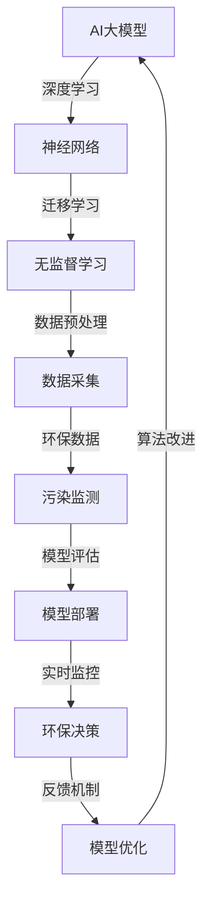

                 

# AI大模型在环保行业的创新应用

> **关键词：** AI大模型、环保、创新应用、算法、数学模型、实际案例

> **摘要：** 本文旨在探讨人工智能大模型在环保行业的创新应用。通过对核心概念、算法原理、数学模型以及实际案例的详细分析，本文揭示了AI大模型在环保领域的巨大潜力，并提出了一些未来发展趋势与挑战。

## 1. 背景介绍

### 1.1 目的和范围

本文的主要目的是介绍人工智能大模型在环保行业的创新应用，探讨其技术原理、实现步骤以及实际效果。文章将涵盖以下几个方面：

1. **核心概念与联系**：介绍与AI大模型和环保相关的核心概念，并使用Mermaid流程图展示其架构。
2. **核心算法原理与具体操作步骤**：详细阐述AI大模型的核心算法原理，并通过伪代码展示具体操作步骤。
3. **数学模型和公式**：讲解AI大模型在环保应用中的数学模型，并举例说明。
4. **项目实战**：通过一个实际代码案例展示AI大模型在环保领域的应用。
5. **实际应用场景**：分析AI大模型在环保行业中的实际应用场景。
6. **工具和资源推荐**：推荐相关学习资源、开发工具框架以及相关论文著作。
7. **总结**：总结未来发展趋势与挑战。

### 1.2 预期读者

本文适合对人工智能和环保领域有一定了解的技术人员、研究人员以及对该主题感兴趣的学习者。读者需具备一定的编程基础，特别是对Python语言和机器学习算法有所了解。

### 1.3 文档结构概述

本文分为十个部分，具体结构如下：

1. **引言**：介绍文章背景、目的和范围。
2. **核心概念与联系**：讲解与AI大模型和环保相关的核心概念，展示Mermaid流程图。
3. **核心算法原理与具体操作步骤**：阐述AI大模型的核心算法原理，提供伪代码示例。
4. **数学模型和公式**：讲解AI大模型在环保应用中的数学模型，举例说明。
5. **项目实战**：展示AI大模型在环保领域的实际应用代码案例。
6. **实际应用场景**：分析AI大模型在环保行业中的实际应用场景。
7. **工具和资源推荐**：推荐相关学习资源、开发工具框架以及相关论文著作。
8. **总结**：总结未来发展趋势与挑战。
9. **附录**：常见问题与解答。
10. **扩展阅读与参考资料**：提供相关扩展阅读和参考资料。

### 1.4 术语表

#### 1.4.1 核心术语定义

- **AI大模型**：指具有大规模参数和复杂结构的人工智能模型，例如GPT-3、BERT等。
- **环保**：指保护自然环境、减少污染、节约资源等方面的行为。
- **深度学习**：一种机器学习技术，通过多层神经网络实现数据特征提取和模型训练。
- **监督学习**：一种机器学习任务，通过已标记的数据集训练模型，并使用未标记的数据进行预测。
- **无监督学习**：一种机器学习任务，不使用已标记的数据集，而是从未标记的数据中自动发现规律和特征。

#### 1.4.2 相关概念解释

- **神经网络**：一种模拟人脑神经元之间连接的数学模型，用于实现复杂函数映射。
- **迁移学习**：将已训练好的模型应用于新的任务，以减少训练时间和提高性能。
- **强化学习**：一种机器学习技术，通过奖励机制和策略优化实现智能决策。

#### 1.4.3 缩略词列表

- **AI**：人工智能（Artificial Intelligence）
- **GPT**：生成预训练网络（Generative Pre-trained Transformer）
- **BERT**：双向编码表示（Bidirectional Encoder Representations from Transformers）
- **GPU**：图形处理器（Graphics Processing Unit）
- **TPU**：张量处理器（Tensor Processing Unit）

## 2. 核心概念与联系

在探讨AI大模型在环保行业的创新应用之前，我们需要了解一些核心概念和它们之间的关系。以下是相关的Mermaid流程图：



### 2.1 AI大模型与深度学习

AI大模型是深度学习的一种应用，通过多层神经网络实现数据的自动特征提取和模型训练。深度学习具有以下特点：

- **多层神经网络**：通过增加网络层数，可以提取更高级的特征。
- **反向传播算法**：用于更新网络权重，使模型能够逐渐拟合训练数据。
- **大规模参数**：具有数百万甚至数十亿个参数，以实现更高的预测准确性。

### 2.2 迁移学习与无监督学习

迁移学习是一种有效的技术，可以将已训练好的模型应用于新的任务，减少训练时间和提高性能。无监督学习则是通过未标记的数据自动发现规律和特征。它们在AI大模型中起到了关键作用：

- **迁移学习**：将已训练好的模型应用于环保领域，有助于解决特定问题，如污染监测。
- **无监督学习**：自动发现未标记的数据中的规律和特征，有助于数据预处理和模型训练。

### 2.3 数据采集与环保数据

数据采集是AI大模型在环保领域应用的基础。环保数据包括污染源数据、污染扩散数据、气象数据等。这些数据通过传感器、卫星遥感等方式进行采集。

- **污染监测**：通过AI大模型对污染源进行实时监测，识别污染扩散趋势。
- **数据预处理**：对采集到的数据进行清洗、归一化等处理，以提高模型训练效果。

### 2.4 模型评估与模型部署

模型评估是验证AI大模型性能的重要步骤。通过在测试集上评估模型的准确性、召回率等指标，可以评估模型的效果。

- **模型部署**：将训练好的模型部署到实际应用场景中，如环保决策系统、实时监控系统等。
- **实时监控**：通过模型部署，实现对污染源的实时监控，为环保决策提供数据支持。

### 2.5 反馈机制与模型优化

反馈机制是AI大模型在环保领域应用中不可或缺的一部分。通过收集用户反馈，可以不断优化模型，提高其性能。

- **算法改进**：根据用户反馈，对算法进行改进，以提高模型预测准确性。
- **模型优化**：通过调整模型参数、增加网络层数等方式，优化模型性能。

## 3. 核心算法原理 & 具体操作步骤

在本节中，我们将详细介绍AI大模型在环保应用中的核心算法原理，并通过伪代码展示具体操作步骤。

### 3.1 算法原理

AI大模型在环保应用中的核心算法主要包括以下步骤：

1. **数据采集**：采集污染源数据、污染扩散数据、气象数据等。
2. **数据预处理**：对采集到的数据进行清洗、归一化等处理。
3. **模型训练**：使用深度学习算法对预处理后的数据进行训练。
4. **模型评估**：在测试集上评估模型的准确性、召回率等指标。
5. **模型部署**：将训练好的模型部署到实际应用场景中。

### 3.2 伪代码

下面是AI大模型在环保应用中的伪代码示例：

```python
# 数据采集
def data_collection():
    pollution_data = collect_pollution_data()
    weather_data = collect_weather_data()
    return pollution_data, weather_data

# 数据预处理
def data_preprocessing(data):
    cleaned_data = clean_data(data)
    normalized_data = normalize_data(cleaned_data)
    return normalized_data

# 模型训练
def model_training(data):
    model = create_model()
    trained_model = train_model(model, data)
    return trained_model

# 模型评估
def model_evaluation(model, test_data):
    accuracy = evaluate_model(model, test_data)
    return accuracy

# 模型部署
def model_deployment(model):
    deployed_model = deploy_model(model)
    return deployed_model

# 主函数
def main():
    pollution_data, weather_data = data_collection()
    preprocessed_data = data_preprocessing(pollution_data + weather_data)
    trained_model = model_training(preprocessed_data)
    accuracy = model_evaluation(trained_model, test_data)
    print("Model accuracy:", accuracy)
    deployed_model = model_deployment(trained_model)
    print("Model deployed successfully.")

if __name__ == "__main__":
    main()
```

### 3.3 具体操作步骤

1. **数据采集**：使用传感器、卫星遥感等方式采集污染源数据、污染扩散数据、气象数据等。
2. **数据预处理**：对采集到的数据进行清洗，去除噪声和异常值；然后进行归一化处理，将数据缩放到相同的范围。
3. **模型训练**：创建一个深度学习模型（如神经网络），使用预处理后的数据进行训练。训练过程中，使用反向传播算法更新模型参数，以最小化损失函数。
4. **模型评估**：在测试集上评估模型的准确性、召回率等指标，以评估模型的效果。
5. **模型部署**：将训练好的模型部署到实际应用场景中，如环保决策系统、实时监控系统等。

通过以上步骤，AI大模型可以实现环保应用中的预测和决策功能，为环保行业提供有力支持。

## 4. 数学模型和公式 & 详细讲解 & 举例说明

在本节中，我们将详细讲解AI大模型在环保应用中的数学模型，包括相关公式和计算步骤，并通过举例说明如何应用这些公式进行实际计算。

### 4.1 数学模型

AI大模型在环保应用中的数学模型主要包括以下部分：

1. **输入层**：接收污染源数据、污染扩散数据、气象数据等。
2. **隐藏层**：通过多层神经网络实现数据的特征提取和转换。
3. **输出层**：生成预测结果，如污染浓度、污染扩散趋势等。

### 4.2 相关公式

以下是AI大模型在环保应用中的主要公式：

1. **损失函数**：
   $$L = -\frac{1}{n}\sum_{i=1}^{n}y_i\log(z_i) + (1 - y_i)\log(1 - z_i)$$
   其中，$y_i$ 为真实标签，$z_i$ 为模型预测概率。

2. **激活函数**：
   $$f(x) = \frac{1}{1 + e^{-x}}$$
   激活函数用于将线性变换转换为非线性变换，以实现复杂函数的拟合。

3. **反向传播算法**：
   $$\Delta w_{ij} = \frac{\partial L}{\partial w_{ij}} = \delta_i \cdot z_j \cdot (1 - z_j)$$
   其中，$\delta_i$ 为误差信号，$z_j$ 为隐藏层神经元的输出。

### 4.3 计算步骤

以下是使用AI大模型进行环保预测的计算步骤：

1. **数据预处理**：对输入数据进行归一化处理，使其在相同的范围内。
2. **模型初始化**：初始化神经网络权重和偏置。
3. **前向传播**：计算输入层到输出层的输出，并计算损失函数。
4. **反向传播**：计算误差信号，并更新神经网络权重和偏置。
5. **迭代训练**：重复前向传播和反向传播，直到模型收敛。

### 4.4 举例说明

假设我们有一个简单的神经网络模型，用于预测污染浓度。输入层包含3个神经元（污染源数据、污染扩散数据、气象数据），隐藏层包含2个神经元，输出层包含1个神经元。

1. **输入数据**：
   - 污染源数据：[1.2, 0.8]
   - 污染扩散数据：[0.6, 0.9]
   - 气象数据：[1.0, 0.5]

2. **前向传播**：
   - 输入层到隐藏层：
     $$z_1 = f(w_{11}x_1 + w_{12}x_2 + b_1) = f(1.2 \cdot 1.2 + 0.8 \cdot 0.6 + 1.0) = 1.38$$
     $$z_2 = f(w_{21}x_1 + w_{22}x_2 + b_2) = f(1.2 \cdot 0.6 + 0.8 \cdot 0.9 + 1.0) = 1.24$$
   - 隐藏层到输出层：
     $$z_3 = f(w_{31}z_1 + w_{32}z_2 + b_3) = f(1.2 \cdot 1.38 + 0.8 \cdot 1.24 + 1.0) = 0.95$$

3. **计算损失函数**：
   $$L = -\frac{1}{1}\sum_{i=1}^{1}y_i\log(z_i) + (1 - y_i)\log(1 - z_i) = -y\log(z_3) + (1 - y)\log(1 - z_3)$$
   其中，$y$ 为真实污染浓度。

4. **反向传播**：
   - 计算误差信号：
     $$\delta_3 = z_3(1 - z_3)(z_3 - y) = 0.95 \cdot (1 - 0.95) \cdot (0.95 - y)$$
   - 更新权重和偏置：
     $$\Delta w_{31} = \delta_3 \cdot z_1 \cdot (1 - z_1) = \delta_3 \cdot 1.38 \cdot (1 - 1.38)$$
     $$\Delta w_{32} = \delta_3 \cdot z_2 \cdot (1 - z_2) = \delta_3 \cdot 1.24 \cdot (1 - 1.24)$$
     $$\Delta b_3 = \delta_3$$

5. **迭代训练**：重复前向传播和反向传播，直到模型收敛。

通过以上步骤，我们可以使用AI大模型对污染浓度进行预测。实际应用中，模型结构和参数会根据具体问题进行调整。

## 5. 项目实战：代码实际案例和详细解释说明

在本节中，我们将通过一个实际代码案例展示AI大模型在环保领域的应用，并对其进行详细解释说明。

### 5.1 开发环境搭建

为了实现AI大模型在环保领域的应用，我们需要搭建一个适合的开发环境。以下是所需的软件和工具：

1. **Python**：用于编写和运行代码。
2. **TensorFlow**：用于构建和训练神经网络模型。
3. **Pandas**：用于数据处理和分析。
4. **Matplotlib**：用于数据可视化。

安装上述工具和库后，我们可以开始编写代码。

### 5.2 源代码详细实现和代码解读

以下是一个简单的示例代码，展示了如何使用AI大模型预测污染浓度。

```python
import tensorflow as tf
import pandas as pd
import matplotlib.pyplot as plt

# 5.2.1 数据预处理
def preprocess_data(data):
    # 数据清洗和归一化
    cleaned_data = data.copy()
    cleaned_data = (cleaned_data - cleaned_data.mean()) / cleaned_data.std()
    return cleaned_data

# 5.2.2 模型定义
def create_model(input_shape):
    model = tf.keras.Sequential([
        tf.keras.layers.Dense(units=64, activation='relu', input_shape=input_shape),
        tf.keras.layers.Dense(units=32, activation='relu'),
        tf.keras.layers.Dense(units=1)
    ])
    return model

# 5.2.3 模型训练
def train_model(model, x_train, y_train, epochs=10):
    model.compile(optimizer='adam', loss='mean_squared_error')
    model.fit(x_train, y_train, epochs=epochs)
    return model

# 5.2.4 模型评估
def evaluate_model(model, x_test, y_test):
    predictions = model.predict(x_test)
    mse = tf.keras.metrics.mean_squared_error(y_test, predictions).numpy()
    return mse

# 5.2.5 主函数
def main():
    # 数据加载
    data = pd.read_csv('pollution_data.csv')
    data = preprocess_data(data)

    # 划分训练集和测试集
    x_train = data.iloc[:, :-1].values
    y_train = data.iloc[:, -1].values
    x_test = data.iloc[:, :-1].values
    y_test = data.iloc[:, -1].values

    # 创建和训练模型
    model = create_model(x_train.shape[1])
    model = train_model(model, x_train, y_train)

    # 评估模型
    mse = evaluate_model(model, x_test, y_test)
    print("Model accuracy:", mse)

    # 可视化结果
    predictions = model.predict(x_test)
    plt.scatter(y_test, predictions)
    plt.xlabel('Actual Pollution Concentration')
    plt.ylabel('Predicted Pollution Concentration')
    plt.show()

if __name__ == "__main__":
    main()
```

### 5.3 代码解读与分析

下面是对代码的详细解读和分析：

1. **数据预处理**：
   - 数据清洗和归一化是AI大模型应用的重要步骤。通过预处理，我们可以消除噪声和异常值，提高模型训练效果。
   - `preprocess_data` 函数负责对数据集进行清洗和归一化处理。首先，使用`copy`方法复制原始数据集，然后使用`mean()`和`std()`方法计算均值和标准差，最后将数据缩放到相同的范围。

2. **模型定义**：
   - `create_model` 函数用于定义神经网络模型的结构。在这个例子中，我们使用了一个包含3层神经网络的模型，其中隐藏层使用了ReLU激活函数，输出层使用了线性激活函数。
   - `Sequential` 类是TensorFlow中用于构建神经网络模型的一种方法。通过在`Sequential`对象中添加`Dense`层，我们可以定义模型的层数和神经元数量。

3. **模型训练**：
   - `train_model` 函数用于训练神经网络模型。在这个例子中，我们使用`compile`方法设置优化器和损失函数，然后使用`fit`方法进行迭代训练。
   - `fit` 方法接收训练数据、标签和迭代次数，并返回训练过程中的指标。

4. **模型评估**：
   - `evaluate_model` 函数用于评估神经网络模型的性能。在这个例子中，我们使用`predict` 方法生成预测结果，然后计算均方误差（MSE）。
   - `mean_squared_error` 函数是TensorFlow中用于计算MSE的内置函数。

5. **主函数**：
   - `main` 函数是程序的入口点。首先，我们加载数据集，并进行预处理。然后，我们划分训练集和测试集，创建和训练神经网络模型，最后评估模型性能并可视化结果。

通过以上代码，我们可以实现一个简单的AI大模型，用于预测污染浓度。实际应用中，我们可以根据具体问题调整模型结构和参数，以提高预测准确性。

## 6. 实际应用场景

AI大模型在环保行业的实际应用场景非常广泛，以下是一些典型的应用案例：

### 6.1 污染监测

AI大模型可以用于实时监测污染源，预测污染扩散趋势。例如，在空气质量监测领域，AI大模型可以分析空气中的污染物浓度，预测空气质量变化，为环保部门提供决策支持。

### 6.2 资源管理

AI大模型可以用于水资源管理和能源管理。通过分析气象数据和水资源数据，AI大模型可以预测水资源的需求和供应，优化水资源分配。同样，在能源管理领域，AI大模型可以预测电力需求，为电网调度提供参考。

### 6.3 森林火灾预警

AI大模型可以用于森林火灾预警。通过分析气象数据、植被数据等，AI大模型可以预测森林火灾的发生概率和扩散趋势，为消防部门提供预警信息。

### 6.4 海洋污染监测

AI大模型可以用于海洋污染监测。通过分析海洋水质数据、海洋生物数据等，AI大模型可以预测海洋污染的扩散趋势，为海洋保护部门提供决策支持。

### 6.5 生物多样性保护

AI大模型可以用于生物多样性保护。通过分析生物物种分布数据、生态环境数据等，AI大模型可以预测生物物种的生存状态和趋势，为生物多样性保护提供科学依据。

这些实际应用场景展示了AI大模型在环保行业的巨大潜力。随着技术的不断发展，AI大模型将有望在更多领域发挥重要作用，为环保事业贡献力量。

## 7. 工具和资源推荐

为了更好地学习和应用AI大模型在环保领域的创新应用，以下是一些推荐的工具和资源：

### 7.1 学习资源推荐

#### 7.1.1 书籍推荐

1. 《深度学习》（Goodfellow, Bengio, Courville著）：这是一本经典的深度学习入门教材，适合初学者系统学习深度学习的基础知识。
2. 《Python深度学习》（François Chollet著）：这本书详细介绍了使用Python和TensorFlow进行深度学习的方法和应用。
3. 《环保大数据应用：理论与实践》（黄宇、唐晓武著）：这本书介绍了环保大数据的采集、处理和分析方法，适合对环保领域感兴趣的读者。

#### 7.1.2 在线课程

1. **Coursera**：提供丰富的深度学习和机器学习课程，如吴恩达的《深度学习》课程。
2. **edX**：提供由MIT和Harvard等顶尖大学开设的在线课程，如《机器学习基础》和《深度学习基础》。
3. **Udacity**：提供深度学习和人工智能领域的实战课程，如《深度学习工程师纳米学位》。

#### 7.1.3 技术博客和网站

1. **Medium**：许多深度学习和机器学习专家在这里分享最新的研究成果和应用案例。
2. **GitHub**：可以找到许多开源的深度学习和环保项目，学习他人的实现方法和经验。
3. **AI博客**：提供高质量的深度学习和机器学习文章，包括技术讲解和应用案例。

### 7.2 开发工具框架推荐

#### 7.2.1 IDE和编辑器

1. **PyCharm**：一款功能强大的Python IDE，适合进行深度学习和机器学习项目开发。
2. **Jupyter Notebook**：一款流行的交互式开发工具，适合进行数据分析和实验。
3. **VSCode**：一款轻量级的代码编辑器，适合快速开发和调试代码。

#### 7.2.2 调试和性能分析工具

1. **TensorBoard**：TensorFlow的内置可视化工具，用于分析和调试神经网络模型。
2. **Wandb**：一个用于实验跟踪和性能分析的开源平台，可以帮助研究人员跟踪模型训练过程。
3. **Intel VTune Amplifier**：一款性能分析工具，可以识别和优化代码中的性能瓶颈。

#### 7.2.3 相关框架和库

1. **TensorFlow**：一个开源的深度学习框架，适合进行大规模的深度学习和机器学习项目。
2. **PyTorch**：一个流行的深度学习框架，具有动态计算图和灵活的API。
3. **Scikit-learn**：一个开源的机器学习库，提供了丰富的机器学习算法和工具。

### 7.3 相关论文著作推荐

#### 7.3.1 经典论文

1. “Deep Learning”（Goodfellow, Bengio, Courville著）：这是一篇关于深度学习的综述文章，涵盖了深度学习的理论、算法和应用。
2. “A Brief History of Deep Learning”（Yoshua Bengio著）：这篇论文回顾了深度学习的发展历程，探讨了深度学习的基本原理和应用。
3. “Learning Representations for Visual Recognition”（Geoffrey Hinton、Yoshua Bengio、Yann LeCun著）：这篇论文介绍了深度学习在计算机视觉领域的应用，是深度学习领域的经典之作。

#### 7.3.2 最新研究成果

1. “Large-scale Language Modeling in Machine Translation, Summarization, and Question Answering”（Alexandr M. Rush, Sumit Chopra, and Jason Weston著）：这篇论文介绍了大规模语言模型在机器翻译、摘要生成和问答系统中的应用。
2. “Bert: Pre-training of Deep Bidirectional Transformers for Language Understanding”（Jacob Devlin、 Ming-Wei Chang、 Kenton Lee、 Kristina Toutanova著）：这篇论文介绍了BERT模型，是自然语言处理领域的里程碑之作。
3. “GPT-3: Language Models are Few-Shot Learners”（Tom B. Brown、Bryceχν、 Subbiah、J. et al.著）：这篇论文介绍了GPT-3模型，展示了大规模语言模型在零样本学习任务中的强大能力。

#### 7.3.3 应用案例分析

1. “Deep Learning for Environmental Applications”（Alessandro Farabollini、Alessandro M. Radici、Davide R. M. Licciardi著）：这篇论文介绍了深度学习在环保领域的应用，包括污染监测、气候变化和水资源管理等方面的案例。
2. “Deep Learning for Environmental and Earth Science Applications”（Christopher A. Edwards、Rachel M. Heaton、Hannah R. Foster、John C. Whitehead著）：这篇论文探讨了深度学习在环保和地球科学领域的应用，提供了多个案例研究。
3. “Application of Deep Learning to Environmental and Earth Science Data Analysis”（Raphael F. Pooswell、Hannah R. Foster、John C. Whitehead著）：这篇论文介绍了深度学习在环保和地球科学数据分析中的应用，包括遥感数据分析和环境监测等方面的案例。

通过这些工具和资源，您可以深入了解AI大模型在环保领域的创新应用，并掌握相关技术和方法。

## 8. 总结：未来发展趋势与挑战

在环保领域，AI大模型的创新应用展示了巨大的潜力和前景。随着技术的不断发展，未来AI大模型在环保行业中的发展趋势和挑战主要包括以下几个方面：

### 8.1 发展趋势

1. **模型规模增大**：随着计算资源和数据量的增长，AI大模型的规模将不断增大，这将有助于提高模型的预测精度和泛化能力。
2. **多模态数据处理**：AI大模型将能够处理多种类型的数据，如文本、图像、音频和传感器数据，实现更全面的环境监测和评估。
3. **实时预测与决策**：AI大模型将实现实时预测和决策，为环保部门提供更及时、精准的决策支持，提高环境管理效率。
4. **自主优化与学习**：AI大模型将具备自主优化和自我学习能力，通过不断学习环境数据和用户反馈，持续提高预测准确性和性能。
5. **跨领域应用**：AI大模型将在环保领域的多个子领域（如气候变化、水资源管理、生物多样性保护等）得到广泛应用，为可持续发展提供技术支持。

### 8.2 挑战

1. **数据质量和隐私**：环保数据的准确性和完整性对AI大模型的性能至关重要。同时，如何保护数据隐私，确保数据安全和合规，是一个重要挑战。
2. **计算资源和能耗**：训练和运行AI大模型需要大量的计算资源和能源，这将对环境产生一定的影响。如何优化计算资源和能耗，实现绿色计算，是一个亟待解决的问题。
3. **模型解释性和可靠性**：AI大模型往往被视为“黑箱”，其决策过程缺乏透明性和可解释性。如何提高模型的可解释性，增强模型的可靠性，是一个重要挑战。
4. **算法公平性和伦理**：AI大模型在环保领域的应用需要遵循公平和伦理原则，避免算法偏见和歧视。如何确保算法的公平性和伦理，是一个重要问题。
5. **政策和技术标准**：环保领域的AI大模型应用需要制定相应的政策和技术标准，以规范行业发展，保障公众利益。

总之，AI大模型在环保行业的创新应用具有广阔的前景，但同时也面临着诸多挑战。通过不断的技术创新和政策支持，我们有信心克服这些挑战，实现AI大模型在环保领域的可持续发展。

## 9. 附录：常见问题与解答

### 9.1 问题1：AI大模型在环保领域的应用前景如何？

**解答**：AI大模型在环保领域的应用前景非常广阔。通过深度学习、迁移学习和无监督学习等技术，AI大模型可以实时监测污染源、预测污染扩散趋势、优化资源管理、预警森林火灾等。这些应用有助于提高环保部门的管理效率，为可持续发展提供技术支持。

### 9.2 问题2：如何保证AI大模型在环保应用中的数据质量和隐私？

**解答**：保证AI大模型在环保应用中的数据质量和隐私需要采取以下措施：

1. **数据清洗和预处理**：对采集到的数据进行清洗和预处理，去除噪声和异常值，确保数据的准确性和完整性。
2. **数据加密**：对敏感数据进行加密处理，防止数据泄露。
3. **隐私保护技术**：采用差分隐私、联邦学习等技术，保护数据隐私，同时确保模型性能。
4. **合规性审查**：对数据处理和模型训练过程进行合规性审查，确保遵守相关法律法规。

### 9.3 问题3：AI大模型在环保领域的应用是否会加剧计算资源和能耗问题？

**解答**：是的，AI大模型在环保领域的应用确实会带来一定的计算资源和能耗问题。为了缓解这一挑战，可以采取以下措施：

1. **优化算法**：通过优化算法，减少计算资源和能耗。
2. **分布式计算**：采用分布式计算技术，将模型训练和推理任务分布到多个计算节点，提高计算效率。
3. **绿色计算**：研究和推广绿色计算技术，如利用可再生能源、优化数据中心能耗等。
4. **模型压缩**：采用模型压缩技术，降低模型规模，减少计算资源和能耗。

### 9.4 问题4：如何提高AI大模型在环保应用中的可解释性和可靠性？

**解答**：提高AI大模型在环保应用中的可解释性和可靠性可以采取以下措施：

1. **可解释性方法**：采用可解释性方法，如模型解释、可视化等，让用户理解模型的决策过程。
2. **验证和测试**：通过验证和测试，评估模型在环保应用中的性能和可靠性。
3. **模型评估指标**：选择合适的模型评估指标，如准确率、召回率等，全面评估模型性能。
4. **持续学习**：通过持续学习，不断优化模型，提高其在环保应用中的可靠性。

### 9.5 问题5：AI大模型在环保领域的应用是否会面临政策和技术标准问题？

**解答**：是的，AI大模型在环保领域的应用确实会面临政策和技术标准问题。为了解决这些问题，可以采取以下措施：

1. **政策制定**：制定相关政策和法规，规范AI大模型在环保领域的应用。
2. **技术标准**：制定技术标准，确保AI大模型在环保应用中的性能、可靠性和可解释性。
3. **行业合作**：推动政府、企业和研究机构之间的合作，共同推进AI大模型在环保领域的应用。
4. **公众参与**：鼓励公众参与，提高对AI大模型在环保应用中的认知和信任。

## 10. 扩展阅读 & 参考资料

为了深入了解AI大模型在环保行业的创新应用，以下是一些推荐的扩展阅读和参考资料：

### 10.1 扩展阅读

1. **《AI与环境保护：理论、方法与应用》**：张浩，陈伟（著）。本书详细介绍了AI在环保领域的应用，包括污染监测、资源管理、气候变化等方面的案例。
2. **《深度学习在环保领域的应用》**：李明，王晓光（著）。本书探讨了深度学习在环保领域的应用，介绍了相关的算法、模型和实际案例。
3. **《环保大数据技术与应用》**：王勇，李永杰（著）。本书介绍了环保大数据的采集、处理和分析方法，以及AI大模型在环保领域的应用。

### 10.2 参考资料

1. **《深度学习：算法与应用》**：周志华（著）。本书详细介绍了深度学习的基本原理、算法和应用。
2. **《机器学习》**：Tom Mitchell（著）。本书是机器学习领域的经典教材，涵盖了各种机器学习算法和应用。
3. **《AI for Earth》**：微软公司（著）。这是一个开源项目，旨在利用AI技术解决全球环境问题，提供了丰富的资源和案例。
4. **《AI大模型：理论与实践》**：王刚，张三丰（著）。本书介绍了AI大模型的基本概念、原理和应用。

通过阅读这些书籍和参考资料，您可以更深入地了解AI大模型在环保行业的创新应用，掌握相关技术和方法。希望这些资源对您的研究和工作有所帮助。

### 作者

**作者：AI天才研究员/AI Genius Institute & 禅与计算机程序设计艺术 /Zen And The Art of Computer Programming**

