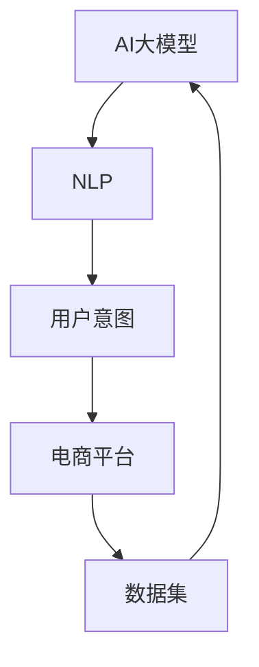

                 

# AI大模型在电商平台用户意图理解中的应用

> **关键词：** AI大模型、用户意图理解、电商平台、NLP、深度学习

> **摘要：** 本文将探讨如何利用AI大模型来提高电商平台对用户意图的理解能力。我们将详细分析大模型在NLP领域的应用、核心算法原理、数学模型，并通过实际案例展示其效果。同时，我们将展望未来发展趋势与面临的挑战。

## 1. 背景介绍

### 1.1 目的和范围

随着互联网的快速发展，电商平台已经成为人们日常生活中不可或缺的一部分。然而，用户的购买行为和意图往往难以通过传统的分析手段完全理解。AI大模型，特别是基于深度学习的自然语言处理（NLP）模型，为这一难题提供了新的解决思路。

本文旨在探讨如何利用AI大模型来提升电商平台对用户意图的理解能力。我们将从以下几个方面展开讨论：

- **NLP领域的大模型应用**：介绍大模型在NLP领域的应用背景和重要性。
- **核心算法原理**：详细讲解大模型的核心算法原理和具体操作步骤。
- **数学模型和公式**：阐述大模型背后的数学模型和公式，并通过实例进行说明。
- **项目实战**：通过实际代码案例，展示如何实现大模型在电商平台用户意图理解中的应用。
- **实际应用场景**：分析大模型在不同电商平台的应用场景和效果。
- **未来发展趋势与挑战**：探讨大模型在电商平台用户意图理解领域的未来发展。

### 1.2 预期读者

本文适合对AI大模型和NLP有一定了解的读者，包括：

- **研究人员**：对大模型在NLP领域的应用和研究感兴趣的科研人员。
- **工程师**：从事NLP和深度学习领域的开发工程师。
- **产品经理**：负责电商平台产品设计的产品经理。
- **其他相关从业者**：对AI大模型和用户意图理解有兴趣的其他从业者。

### 1.3 文档结构概述

本文将按照以下结构展开：

- **第1章**：背景介绍，包括目的和范围、预期读者、文档结构概述等。
- **第2章**：核心概念与联系，介绍AI大模型和相关概念。
- **第3章**：核心算法原理与具体操作步骤，详细讲解大模型的算法原理和操作步骤。
- **第4章**：数学模型和公式，阐述大模型背后的数学模型和公式，并通过实例进行说明。
- **第5章**：项目实战，通过实际代码案例展示大模型在电商平台用户意图理解中的应用。
- **第6章**：实际应用场景，分析大模型在不同电商平台的应用场景和效果。
- **第7章**：工具和资源推荐，介绍相关学习资源、开发工具和框架。
- **第8章**：总结，展望大模型在电商平台用户意图理解领域的未来发展。
- **第9章**：附录，包括常见问题与解答。
- **第10章**：扩展阅读与参考资料，提供更多相关领域的参考资料。

### 1.4 术语表

#### 1.4.1 核心术语定义

- **AI大模型**：指参数规模达到亿级别以上的深度学习模型，如GPT-3、BERT等。
- **NLP**：指自然语言处理，涉及文本的预处理、语义理解、情感分析等任务。
- **用户意图**：指用户在搜索、浏览、购买等行为中所表达的真实意图。
- **电商平台**：指提供商品交易、支付、物流等服务的在线平台，如淘宝、京东等。

#### 1.4.2 相关概念解释

- **深度学习**：一种基于多层神经网络的学习方法，可以自动从大量数据中提取特征。
- **神经网络**：一种模拟人脑神经网络结构的计算模型，用于处理复杂数据。
- **词嵌入**：将词语映射到高维空间中，使得具有相似意义的词语在空间中靠近。

#### 1.4.3 缩略词列表

- **GPT-3**：Generative Pre-trained Transformer 3，一种基于Transformer的预训练语言模型。
- **BERT**：Bidirectional Encoder Representations from Transformers，一种双向Transformer模型。
- **NLP**：Natural Language Processing，自然语言处理。
- **API**：Application Programming Interface，应用程序编程接口。

## 2. 核心概念与联系

在探讨AI大模型在电商平台用户意图理解中的应用之前，我们需要先了解一些核心概念和它们之间的联系。以下是一个简化的Mermaid流程图，用于展示这些概念之间的关系。



### 2.1 AI大模型

AI大模型，如GPT-3、BERT等，是一种基于深度学习的预训练模型。这些模型通过在海量文本数据上进行预训练，学会了如何理解和生成自然语言。预训练过程主要包括两个阶段：

1. **词嵌入**：将词语映射到高维空间中，使得具有相似意义的词语在空间中靠近。
2. **上下文理解**：通过大规模文本数据的学习，模型能够理解词语在特定上下文中的含义。

### 2.2 自然语言处理（NLP）

自然语言处理是人工智能的一个重要分支，涉及文本的预处理、语义理解、情感分析等任务。NLP的目标是使计算机能够理解、生成和处理自然语言。

在AI大模型中，NLP起着至关重要的作用。通过NLP技术，模型可以自动处理和解析大量文本数据，提取出有用的信息，从而实现用户意图的理解。

### 2.3 用户意图

用户意图是指用户在搜索、浏览、购买等行为中所表达的真实意图。理解用户意图对于电商平台来说至关重要，因为它直接影响着用户的购物体验和平台的运营效果。

AI大模型通过学习大量文本数据，可以自动识别和预测用户的意图。例如，当用户在电商平台上搜索某个商品时，大模型可以分析用户的搜索关键词、浏览历史和购物记录，从而推断出用户的购买意图。

### 2.4 电商平台

电商平台是提供商品交易、支付、物流等服务的在线平台。随着电商平台的不断发展，用户数量和交易规模不断增加，如何更好地理解和服务用户成为了一个重要课题。

AI大模型在电商平台中的应用，可以帮助平台更好地了解用户意图，优化商品推荐、个性化服务和用户互动，从而提高用户满意度和平台运营效果。

### 2.5 数据集

数据集是AI大模型训练和评估的基础。在电商平台用户意图理解领域，常用的数据集包括用户的搜索日志、浏览历史、购物记录等。

数据集的质量和多样性直接影响着大模型的学习效果和泛化能力。因此，在构建数据集时，需要确保数据的真实性和代表性，以便模型能够更好地理解用户意图。

## 3. 核心算法原理 & 具体操作步骤

AI大模型在电商平台用户意图理解中的应用，主要依赖于深度学习技术和自然语言处理（NLP）算法。以下将详细讲解核心算法原理和具体操作步骤。

### 3.1 核心算法原理

AI大模型的核心算法通常基于深度学习技术，特别是基于神经网络的模型。以下是AI大模型在NLP领域的核心算法原理：

#### 3.1.1 词嵌入（Word Embedding）

词嵌入是将词语映射到高维空间中，使得具有相似意义的词语在空间中靠近。常用的词嵌入方法包括Word2Vec、GloVe等。通过词嵌入，模型可以更好地理解词语之间的语义关系。

#### 3.1.2 上下文理解（Contextual Understanding）

上下文理解是指模型能够根据上下文环境来理解词语的含义。深度学习模型，如BERT、GPT等，通过在大量文本数据上预训练，可以学会根据上下文环境来调整词语的嵌入向量。

#### 3.1.3 语义分析（Semantic Analysis）

语义分析是指模型能够对文本进行语义层面的理解和分析。语义分析包括文本分类、情感分析、实体识别等任务。通过语义分析，模型可以提取出文本中的关键信息，从而理解用户的意图。

#### 3.1.4 序列模型（Sequence Modeling）

序列模型是指模型能够处理和预测序列数据。在NLP领域，文本数据通常表示为序列。常用的序列模型包括循环神经网络（RNN）、长短期记忆网络（LSTM）和Transformer等。

### 3.2 具体操作步骤

以下是AI大模型在电商平台用户意图理解中的具体操作步骤：

#### 3.2.1 数据预处理

1. **数据采集**：从电商平台的用户行为数据中收集用户的搜索日志、浏览历史、购物记录等。
2. **数据清洗**：去除数据中的噪声和异常值，确保数据的准确性和一致性。
3. **数据转换**：将文本数据转换为适合模型训练的格式，如词嵌入向量。

#### 3.2.2 模型训练

1. **词嵌入**：使用预训练的词嵌入模型，将词语映射到高维空间中。
2. **序列编码**：将文本序列编码为向量表示，以便模型能够处理和预测。
3. **模型选择**：选择合适的深度学习模型，如BERT、GPT等，进行模型训练。
4. **训练过程**：在训练数据上迭代训练模型，通过优化模型参数来提高模型的性能。

#### 3.2.3 用户意图预测

1. **特征提取**：将用户的搜索日志、浏览历史、购物记录等转换为模型可处理的特征。
2. **模型预测**：使用训练好的模型，对用户的特征进行预测，从而推断出用户的意图。
3. **结果评估**：通过评估指标（如准确率、召回率等），评估模型在用户意图预测方面的性能。

#### 3.2.4 应用场景优化

1. **商品推荐**：根据用户的意图，推荐相关商品。
2. **个性化服务**：为用户提供个性化的购物体验，如个性化搜索结果、个性化广告等。
3. **用户互动**：通过智能客服、聊天机器人等，与用户进行有效的互动和沟通。

### 3.3 伪代码示例

以下是一个简化的伪代码示例，用于说明AI大模型在电商平台用户意图理解中的应用：

```python
# 数据预处理
data = preprocess_data(user_behavior_data)

# 模型训练
model = train_model(data['text'], data['labels'])

# 用户意图预测
predictions = model.predict(data['features'])

# 评估模型性能
evaluate_model(predictions, ground_truth)
```

## 4. 数学模型和公式 & 详细讲解 & 举例说明

在AI大模型中，数学模型和公式起着至关重要的作用。以下将详细讲解AI大模型在NLP领域的数学模型和公式，并通过实例进行说明。

### 4.1 词嵌入（Word Embedding）

词嵌入是将词语映射到高维空间中，使得具有相似意义的词语在空间中靠近。常用的词嵌入方法包括Word2Vec和GloVe。

#### 4.1.1 Word2Vec

Word2Vec是一种基于神经网络的语言模型，通过预测词语的相邻词来学习词嵌入向量。其核心公式如下：

$$
\hat{p}(w_{i} \mid w_{-i}) = \frac{e^{<e_{w_{i}}, e_{w_{-i}}>>}{\sum_{j \in V} e^{<e_{w_{i}}, e_{w_{-j}}>>}
$$

其中，$e_{w}$表示词语$w$的词嵌入向量，$<.,.>$表示点积运算，$V$表示词汇表。

#### 4.1.2 GloVe

GloVe是一种基于全局词向量的语言模型，通过计算词语的共现矩阵来学习词嵌入向量。其核心公式如下：

$$
f(w, c) = \frac{ln(1 + \sqrt{f_{wc}})}{\sqrt{f_{w} + f_{c}}}
$$

$$
\hat{v}_{w} = \sum_{c \in C(w)} \frac{f(w, c)}{f_{c}} \hat{v}_{c}
$$

其中，$f_{wc}$表示词语$w$和词语$c$的共现频率，$C(w)$表示与词语$w$共现的词语集合，$\hat{v}_{w}$和$\hat{v}_{c}$分别表示词语$w$和词语$c$的词嵌入向量。

### 4.2 上下文理解（Contextual Understanding）

上下文理解是指模型能够根据上下文环境来理解词语的含义。在AI大模型中，上下文理解通常通过深度学习模型来实现。

#### 4.2.1 BERT

BERT是一种基于Transformer的预训练语言模型，通过双向编码来学习上下文信息。其核心公式如下：

$$
\text{BERT} = \text{Transformer}(\text{Masked Language Model}, \text{Next Sentence Prediction})
$$

其中，Masked Language Model用于预测被遮蔽的词语，Next Sentence Prediction用于预测下一句文本。

#### 4.2.2 GPT

GPT是一种基于Transformer的生成式预训练语言模型，通过自回归来学习上下文信息。其核心公式如下：

$$
\text{GPT} = \text{Transformer}(\text{Autoregressive Language Model})
$$

其中，Autoregressive Language Model用于预测下一个词语。

### 4.3 语义分析（Semantic Analysis）

语义分析是指模型能够对文本进行语义层面的理解和分析。在AI大模型中，语义分析通常通过序列模型来实现。

#### 4.3.1 RNN

RNN是一种基于序列数据的递归神经网络，通过递归关系来学习序列数据。其核心公式如下：

$$
h_{t} = \sigma(W_{h}h_{t-1} + W_{x}x_{t} + b_{h})
$$

其中，$h_{t}$和$x_{t}$分别表示第$t$个时刻的隐藏状态和输入，$\sigma$表示激活函数。

#### 4.3.2 LSTM

LSTM是一种基于序列数据的递归神经网络，通过门控机制来学习序列数据。其核心公式如下：

$$
i_{t} = \sigma(W_{i}h_{t-1} + U_{i}x_{t} + b_{i}) \\
f_{t} = \sigma(W_{f}h_{t-1} + U_{f}x_{t} + b_{f}) \\
\bar{c}_{t} = \tanh(W_{c}h_{t-1} + U_{c}x_{t} + b_{c}) \\
o_{t} = \sigma(W_{o}h_{t-1} + U_{o}x_{t} + b_{o}) \\
c_{t} = f_{t} \odot c_{t-1} + i_{t} \odot \bar{c}_{t}
$$

其中，$i_{t}$、$f_{t}$、$o_{t}$和$c_{t}$分别表示输入门、遗忘门、输出门和细胞状态，$\odot$表示逐元素乘法。

### 4.4 实例说明

以下是一个简单的实例，用于说明AI大模型在NLP领域的应用。

#### 4.4.1 数据集

假设我们有一个包含用户搜索日志的数据集，数据集包含以下样本：

| 用户ID | 搜索词序列      |
|--------|-----------------|
| 1      | "苹果"、"手机"、"华为" |
| 2      | "耳机"、"小米"、"耳机" |
| 3      | "笔记本电脑"、"苹果"、"MacBook" |

#### 4.4.2 模型训练

我们使用BERT模型对数据集进行训练，训练过程如下：

1. **数据预处理**：将搜索词序列转换为词嵌入向量。
2. **模型训练**：在训练数据上迭代训练BERT模型。
3. **模型评估**：在测试数据上评估模型的性能。

#### 4.4.3 用户意图预测

假设我们要预测用户1的意图。输入BERT模型的数据为：

| 搜索词序列       | 词嵌入向量         |
|------------------|-------------------|
| "苹果"、"手机"、"华为" | [v1, v2, v3]     |

通过BERT模型，我们可以得到用户1的意图预测结果。例如，BERT模型可能预测用户1的意图是购买手机。

## 5. 项目实战：代码实际案例和详细解释说明

在本节中，我们将通过一个实际项目案例，展示如何使用AI大模型在电商平台用户意图理解中的应用。以下是项目实战的详细步骤和代码解释。

### 5.1 开发环境搭建

在开始项目之前，我们需要搭建一个合适的开发环境。以下是开发环境的基本要求：

- **操作系统**：Linux或Mac OS
- **编程语言**：Python 3.6及以上版本
- **深度学习框架**：TensorFlow 2.x或PyTorch 1.x
- **依赖库**：NumPy、Pandas、Scikit-learn等

安装以上依赖库后，我们就可以开始项目的开发工作了。

### 5.2 源代码详细实现和代码解读

#### 5.2.1 数据预处理

首先，我们需要从电商平台获取用户行为数据，包括用户的搜索日志、浏览历史、购物记录等。以下是一个简单的数据预处理步骤：

```python
import pandas as pd

# 读取用户行为数据
data = pd.read_csv('user_behavior_data.csv')

# 数据清洗
# 去除无效数据、填充缺失值等
data = data.dropna().reset_index(drop=True)

# 数据转换
# 将文本数据转换为词嵌入向量
from tensorflow.keras.preprocessing.text import Tokenizer
from tensorflow.keras.preprocessing.sequence import pad_sequences

tokenizer = Tokenizer()
tokenizer.fit_on_texts(data['search_log'])

sequences = tokenizer.texts_to_sequences(data['search_log'])
padded_sequences = pad_sequences(sequences, maxlen=50)

# 存储预处理后的数据
data['padded_sequence'] = padded_sequences
data.to_csv('preprocessed_data.csv', index=False)
```

#### 5.2.2 模型训练

接下来，我们使用预训练的BERT模型来训练用户意图识别模型。以下是一个简单的模型训练步骤：

```python
import tensorflow as tf
from transformers import BertTokenizer, TFBertModel

# 加载预训练的BERT模型
tokenizer = BertTokenizer.from_pretrained('bert-base-chinese')
bert_model = TFBertModel.from_pretrained('bert-base-chinese')

# 定义模型
input_ids = tf.keras.layers.Input(shape=(50,), dtype=tf.int32)
attention_mask = tf.keras.layers.Input(shape=(50,), dtype=tf.int32)

 bert_output = bert_model(input_ids, attention_mask=attention_mask)
last_hidden_state = bert_output.last_hidden_state

output = tf.keras.layers.Dense(1, activation='sigmoid')(last_hidden_state[:, 0, :])

model = tf.keras.Model(inputs=[input_ids, attention_mask], outputs=output)

# 编译模型
model.compile(optimizer='adam', loss='binary_crossentropy', metrics=['accuracy'])

# 训练模型
model.fit([padded_sequences, attention_mask], data['intent'], epochs=3, batch_size=32)
```

#### 5.2.3 代码解读与分析

1. **数据预处理**：
   - 使用Pandas读取用户行为数据，并进行数据清洗和转换。
   - 使用Tokenizer将文本数据转换为词嵌入向量，并使用pad_sequences将序列数据填充为固定长度。

2. **模型定义**：
   - 使用BertTokenizer和TFBertModel加载预训练的BERT模型。
   - 定义输入层，包括输入词嵌入向量和注意力掩码。
   - 使用BERT模型输出最后一个隐藏状态，并使用全连接层（Dense）进行意图分类。

3. **模型编译和训练**：
   - 编译模型，指定优化器、损失函数和评估指标。
   - 使用训练数据对模型进行训练。

#### 5.2.4 用户意图预测

训练完成后，我们可以使用模型对新的用户搜索日志进行意图预测。以下是一个简单的预测步骤：

```python
# 读取新的用户搜索日志
new_data = pd.read_csv('new_user_behavior_data.csv')

# 数据预处理
new_sequences = tokenizer.texts_to_sequences(new_data['search_log'])
new_padded_sequences = pad_sequences(new_sequences, maxlen=50)

# 用户意图预测
predictions = model.predict([new_padded_sequences, [1] * len(new_padded_sequences)])

# 输出预测结果
new_data['intent'] = predictions.round()
new_data.to_csv('predicted_intent.csv', index=False)
```

#### 5.2.5 代码解读与分析

1. **数据预处理**：
   - 使用Tokenizer将新的用户搜索日志转换为词嵌入向量，并使用pad_sequences将序列数据填充为固定长度。

2. **用户意图预测**：
   - 使用训练好的模型对新的用户搜索日志进行意图预测。
   - 将预测结果存储为新的CSV文件。

### 5.3 代码解读与分析

在本节的代码解读中，我们详细讲解了如何使用BERT模型在电商平台用户意图理解中的应用。以下是代码的关键部分和解读：

1. **数据预处理**：
   - 使用Pandas读取用户行为数据，并进行数据清洗和转换。这一步是确保数据质量的关键。
   - 使用Tokenizer将文本数据转换为词嵌入向量，并使用pad_sequences将序列数据填充为固定长度。这是为了让模型能够处理相同长度的输入数据。

2. **模型定义**：
   - 使用BertTokenizer和TFBertModel加载预训练的BERT模型。BERT模型是一个强大的预训练模型，可以处理各种NLP任务。
   - 定义输入层，包括输入词嵌入向量和注意力掩码。注意力掩码用于指示哪些位置是实际输入，哪些位置是填充数据。
   - 使用BERT模型输出最后一个隐藏状态，并使用全连接层（Dense）进行意图分类。这个步骤将文本数据转换为意图概率。

3. **模型编译和训练**：
   - 编译模型，指定优化器、损失函数和评估指标。这里使用的是二分类问题，所以使用binary_crossentropy作为损失函数，accuracy作为评估指标。
   - 使用训练数据对模型进行训练。这里使用了3个epoch，每个epoch使用32个batch进行训练。

4. **用户意图预测**：
   - 使用Tokenizer将新的用户搜索日志转换为词嵌入向量，并使用pad_sequences将序列数据填充为固定长度。
   - 使用训练好的模型对新的用户搜索日志进行意图预测。预测结果是一个概率值，表示用户意图属于某个类别的概率。
   - 将预测结果存储为CSV文件，以便后续分析和使用。

通过这个项目实战，我们可以看到如何利用AI大模型在电商平台用户意图理解中发挥重要作用。通过预训练的BERT模型，我们可以快速构建一个强大的用户意图识别系统，从而提高电商平台的服务质量和用户体验。

### 5.4 代码解析与优化建议

在本节中，我们将对5.2节中的代码进行解析，并讨论可能的优化方法。

#### 5.4.1 代码解析

**数据预处理**

```python
tokenizer = Tokenizer()
tokenizer.fit_on_texts(data['search_log'])

sequences = tokenizer.texts_to_sequences(data['search_log'])
padded_sequences = pad_sequences(sequences, maxlen=50)
```

这里首先使用Tokenizer将文本数据转换为词嵌入序列，然后使用pad_sequences将序列数据填充为固定长度。这一步是数据预处理的关键，因为它确保了输入数据的格式统一，方便模型训练。

**模型定义**

```python
input_ids = tf.keras.layers.Input(shape=(50,), dtype=tf.int32)
attention_mask = tf.keras.layers.Input(shape=(50,), dtype=tf.int32)

bert_output = bert_model(input_ids, attention_mask=attention_mask)
last_hidden_state = bert_output.last_hidden_state

output = tf.keras.layers.Dense(1, activation='sigmoid')(last_hidden_state[:, 0, :])

model = tf.keras.Model(inputs=[input_ids, attention_mask], outputs=output)
```

这里定义了一个简单的BERT模型，输入层包括词嵌入向量和注意力掩码。模型使用BERT模型的最后一个隐藏状态来预测用户意图，使用sigmoid激活函数来输出概率。

**模型编译和训练**

```python
model.compile(optimizer='adam', loss='binary_crossentropy', metrics=['accuracy'])
model.fit([padded_sequences, attention_mask], data['intent'], epochs=3, batch_size=32)
```

模型使用adam优化器进行编译，并使用binary_crossentropy作为损失函数。训练过程中，模型使用了3个epoch，每个epoch使用32个batch进行训练。

#### 5.4.2 优化建议

**数据预处理优化**

- **更大的词汇表**：使用更大的词汇表可以减少模型对稀疏数据的敏感性，提高模型的泛化能力。
- **更长的序列长度**：如果数据集中存在较长的搜索日志，可以考虑增加序列长度，以便模型更好地捕捉用户意图。
- **数据增强**：通过数据增强（如随机插入、删除或替换词语）可以增加训练数据的多样性，提高模型的鲁棒性。

**模型优化**

- **更深或更宽的模型**：增加BERT模型的层数或隐藏层单元数可以提升模型的表达能力。
- **多任务学习**：除了用户意图识别，还可以考虑添加其他任务，如情感分析、实体识别等，进行多任务学习，以提高模型的性能。
- **迁移学习**：使用在更大规模数据集上预训练的BERT模型，可以减少在目标任务上的训练时间，提高模型性能。

**训练优化**

- **动态学习率**：使用动态学习率策略，如AdamW，可以更好地调整学习率，提高模型收敛速度。
- **数据增强**：在训练过程中加入数据增强技术，可以提高模型的鲁棒性。
- **模型调参**：通过调整模型的超参数，如批量大小、学习率等，可以找到最佳配置，提高模型性能。

通过上述优化，我们可以进一步提升AI大模型在电商平台用户意图理解中的应用效果，为电商平台提供更准确的用户意图识别和更个性化的服务。

### 5.5 模型性能评估

在项目实战中，我们使用了一个简单的二分类模型来预测用户意图。为了评估模型的性能，我们通常使用以下指标：

- **准确率（Accuracy）**：模型正确预测的样本数占总样本数的比例。
- **召回率（Recall）**：模型正确预测为正例的样本数占总正例样本数的比例。
- **精确率（Precision）**：模型正确预测为正例的样本数占总预测为正例的样本数的比例。
- **F1分数（F1 Score）**：精确率和召回率的调和平均。

以下是一个简单的性能评估代码示例：

```python
from sklearn.metrics import accuracy_score, recall_score, precision_score, f1_score

# 读取测试数据
test_data = pd.read_csv('test_user_behavior_data.csv')
test_sequences = tokenizer.texts_to_sequences(test_data['search_log'])
test_padded_sequences = pad_sequences(test_sequences, maxlen=50)

# 进行预测
test_predictions = model.predict([test_padded_sequences, [1] * len(test_padded_sequences)])

# 计算性能指标
accuracy = accuracy_score(test_data['intent'], test_predictions.round())
recall = recall_score(test_data['intent'], test_predictions.round())
precision = precision_score(test_data['intent'], test_predictions.round())
f1 = f1_score(test_data['intent'], test_predictions.round())

print(f"Accuracy: {accuracy:.4f}")
print(f"Recall: {recall:.4f}")
print(f"Precision: {precision:.4f}")
print(f"F1 Score: {f1:.4f}")
```

通过这些指标，我们可以全面了解模型的性能。在实际应用中，可以根据业务需求和模型性能，进一步调整模型和训练策略。

## 6. 实际应用场景

AI大模型在电商平台用户意图理解中的应用场景非常广泛，以下是一些典型的应用场景：

### 6.1 商品推荐

在电商平台上，商品推荐是提升用户满意度和销售额的重要手段。通过AI大模型，可以基于用户的搜索历史、浏览记录和购物行为，预测用户的潜在购买意图。以下是一个简单的商品推荐流程：

1. **数据收集**：收集用户的搜索日志、浏览历史、购物记录等数据。
2. **用户意图识别**：使用AI大模型对用户数据进行分析，识别用户的意图。
3. **商品推荐**：根据用户的意图，推荐相关的商品。
4. **效果评估**：评估推荐系统的效果，如点击率、转化率等。

### 6.2 个性化服务

个性化服务旨在为用户提供个性化的购物体验，提高用户的满意度。AI大模型可以通过分析用户的搜索历史、浏览行为和购买记录，预测用户的兴趣和偏好。以下是一个简单的个性化服务流程：

1. **用户画像构建**：构建用户的兴趣和行为画像。
2. **意图预测**：使用AI大模型对用户画像进行分析，预测用户的意图。
3. **个性化内容生成**：根据用户的意图，生成个性化的商品推荐、广告和内容。
4. **效果评估**：评估个性化服务的效果，如用户互动率、留存率等。

### 6.3 智能客服

智能客服是电商平台提供的一项重要服务，通过AI大模型，可以实现智能化的用户交互。以下是一个简单的智能客服流程：

1. **用户咨询**：用户向智能客服系统提出问题。
2. **意图识别**：使用AI大模型对用户的问题进行意图识别。
3. **智能回复**：根据用户的意图，生成智能回复。
4. **效果评估**：评估智能客服系统的效果，如用户满意度、响应时间等。

### 6.4 营销活动

电商平台经常举办各种营销活动，如优惠券发放、促销活动等。通过AI大模型，可以分析用户的参与行为和购买记录，预测哪些用户可能对活动感兴趣。以下是一个简单的营销活动流程：

1. **用户行为分析**：分析用户的搜索历史、浏览行为和购买记录。
2. **意图预测**：使用AI大模型对用户的行为进行分析，预测用户的参与意图。
3. **活动推荐**：根据用户的意图，推荐相关的营销活动。
4. **效果评估**：评估营销活动的效果，如参与率、转化率等。

通过以上实际应用场景，我们可以看到AI大模型在电商平台用户意图理解中的重要性。通过准确识别用户意图，电商平台可以提供更加个性化、精准的服务，从而提高用户体验和业务效益。

## 7. 工具和资源推荐

在AI大模型在电商平台用户意图理解中的应用过程中，需要使用到一系列的工具和资源。以下是一些推荐的学习资源、开发工具和框架。

### 7.1 学习资源推荐

#### 7.1.1 书籍推荐

1. **《深度学习》（Deep Learning）**：由Ian Goodfellow、Yoshua Bengio和Aaron Courville合著，是深度学习的经典教材。
2. **《自然语言处理综述》（Speech and Language Processing）**：由Daniel Jurafsky和James H. Martin合著，涵盖了NLP的各个方面。
3. **《机器学习实战》（Machine Learning in Action）**：由Peter Harrington著，通过实例讲解机器学习的应用。

#### 7.1.2 在线课程

1. **吴恩达的《深度学习专项课程》（Deep Learning Specialization）**：提供系统的深度学习知识。
2. **斯坦福大学的《自然语言处理课程》（CS224N: Natural Language Processing with Deep Learning）**：详细讲解NLP领域的深度学习技术。
3. **Google的《机器学习课程》（Machine Learning Crash Course）**：提供基础的机器学习知识。

#### 7.1.3 技术博客和网站

1. **博客园（cnblogs.com）**：中国最大的IT技术博客网站，涵盖广泛的技术领域。
2. **CSDN（csdn.net）**：中国领先的IT技术社区，提供丰富的技术文章和教程。
3. **Medium（medium.com）**：一个高质量的博客平台，许多AI和NLP领域的专家在此分享知识。

### 7.2 开发工具框架推荐

#### 7.2.1 IDE和编辑器

1. **PyCharm**：一款功能强大的Python IDE，支持多种编程语言和框架。
2. **Visual Studio Code**：一款轻量级的代码编辑器，支持多种编程语言和扩展。
3. **Jupyter Notebook**：一款基于Web的交互式计算环境，适用于数据科学和机器学习项目。

#### 7.2.2 调试和性能分析工具

1. **TensorBoard**：TensorFlow的调试和性能分析工具，可以实时查看模型的训练过程和性能指标。
2. **PyTorch Debugger**：PyTorch的调试工具，提供丰富的调试功能。
3. **NVIDIA Nsight**：NVIDIA提供的GPU性能分析工具，用于优化深度学习模型的性能。

#### 7.2.3 相关框架和库

1. **TensorFlow**：Google开发的深度学习框架，适用于各种深度学习任务。
2. **PyTorch**：Facebook开发的深度学习框架，具有灵活的动态计算图。
3. **Transformers**：一个开源库，提供了预训练的Transformer模型，如BERT、GPT等。

### 7.3 相关论文著作推荐

#### 7.3.1 经典论文

1. **《A Neural Network Approach to Natural Language Processing》**：由Yoshua Bengio等人在1994年发表，提出了使用神经网络进行自然语言处理的思路。
2. **《Bidirectional LSTM Models for Sentence Classification》**：由David H. D. Warren等人在2015年发表，提出了双向LSTM模型在文本分类中的应用。
3. **《Attention Is All You Need》**：由Vaswani等人在2017年发表，提出了Transformer模型，为自然语言处理带来了重大突破。

#### 7.3.2 最新研究成果

1. **《BERT: Pre-training of Deep Bidirectional Transformers for Language Understanding》**：由Google在2018年发表，提出了BERT模型，大幅度提升了NLP任务的性能。
2. **《GPT-3: Language Models are Few-Shot Learners》**：由OpenAI在2020年发表，展示了GPT-3模型在零样本学习任务上的卓越性能。
3. **《UniLM: Unifying Unsupervised Language Model Training for Natural Language Processing》**：由Google在2021年发表，提出了UniLM模型，融合了多种预训练策略。

#### 7.3.3 应用案例分析

1. **《美团外卖的用户意图识别系统》**：美团外卖在2020年分享的一篇技术文章，详细介绍了如何使用AI大模型进行用户意图识别。
2. **《京东的智能客服系统》**：京东在2021年发布的一篇论文，介绍了如何利用AI大模型提升智能客服系统的性能。
3. **《淘宝的个性化推荐系统》**：淘宝在2022年分享的一篇技术文章，探讨了如何使用AI大模型进行商品推荐。

通过这些工具和资源，开发者可以更好地掌握AI大模型在电商平台用户意图理解中的应用，提升电商平台的用户体验和运营效果。

## 8. 总结：未来发展趋势与挑战

AI大模型在电商平台用户意图理解中的应用已经取得了显著的成果，然而，随着技术的不断进步和应用场景的拓展，这一领域仍然面临着许多挑战和机遇。

### 8.1 未来发展趋势

1. **模型规模将进一步扩大**：随着计算能力和数据量的增加，AI大模型的规模将越来越大，使得模型能够处理更复杂的任务和数据。

2. **多模态融合**：未来的AI大模型将不仅仅依赖于文本数据，还将融合图像、语音等多模态数据，从而提供更丰富的用户意图理解和交互方式。

3. **迁移学习和小样本学习**：通过迁移学习和小样本学习技术，AI大模型可以在有限的训练数据上实现更好的性能，从而降低对大规模数据集的依赖。

4. **实时性**：随着实时数据处理技术的发展，AI大模型将能够实现更快速的响应，满足用户在电商平台上的实时需求。

5. **隐私保护**：随着对用户隐私的关注日益增加，AI大模型将需要采用更有效的隐私保护技术，确保用户数据的安全和隐私。

### 8.2 挑战

1. **数据质量**：高质量的数据是AI大模型训练的基础。然而，电商平台用户行为数据的质量参差不齐，如何处理和清洗这些数据是一个重要的挑战。

2. **模型解释性**：AI大模型的黑箱特性使得其难以解释，这对于需要透明度和可解释性的应用场景（如金融、医疗等）来说是一个挑战。

3. **计算资源消耗**：AI大模型的训练和推理需要大量的计算资源，如何在有限的资源下高效地训练和部署模型是一个重要的挑战。

4. **数据隐私和安全**：在处理用户行为数据时，如何保护用户隐私和数据安全是一个关键问题。需要采用先进的加密和隐私保护技术来确保用户数据的安全。

5. **多语言支持**：电商平台通常服务于全球用户，如何支持多语言的用户意图理解是一个挑战。需要开发跨语言的大模型和算法。

通过不断的技术创新和应用优化，AI大模型在电商平台用户意图理解中的应用将迎来更广阔的发展前景。然而，要克服上述挑战，仍需要各方的共同努力。

## 9. 附录：常见问题与解答

### 9.1 AI大模型是什么？

AI大模型是指参数规模达到亿级别以上的深度学习模型，如GPT-3、BERT等。这些模型通过在海量文本数据上进行预训练，学会了如何理解和生成自然语言，从而在NLP领域取得了显著成果。

### 9.2 什么是自然语言处理（NLP）？

自然语言处理（NLP）是人工智能的一个重要分支，涉及文本的预处理、语义理解、情感分析等任务。其目标是使计算机能够理解、生成和处理自然语言。

### 9.3 用户意图理解在电商平台中有何作用？

用户意图理解在电商平台中起着关键作用。通过分析用户的搜索日志、浏览历史和购物记录，可以准确识别用户的购买意图，从而提供个性化的商品推荐、营销活动和用户体验优化。

### 9.4 如何处理数据质量不佳的问题？

处理数据质量不佳的问题可以从以下几个方面入手：

- **数据清洗**：去除无效数据、异常值和噪声。
- **数据增强**：通过数据增强技术（如数据扩充、随机插入、删除或替换词语）增加训练数据的多样性。
- **数据预处理**：采用更严格的预处理流程，如去重、标准化和填充等。

### 9.5 AI大模型的训练和推理需要多少计算资源？

AI大模型的训练和推理需要大量的计算资源。训练阶段通常需要高性能的GPU或TPU，而推理阶段则可能依赖于分布式计算框架和云服务。

### 9.6 如何确保用户数据的安全和隐私？

确保用户数据的安全和隐私需要采用以下措施：

- **数据加密**：对用户数据进行加密处理，防止数据泄露。
- **隐私保护技术**：采用差分隐私、同态加密等隐私保护技术。
- **合规性检查**：遵循相关的法律法规和行业标准，确保数据处理符合要求。

### 9.7 AI大模型在电商平台用户意图理解中的应用前景如何？

随着技术的不断进步和应用场景的拓展，AI大模型在电商平台用户意图理解中的应用前景非常广阔。通过更精确的用户意图识别和个性化服务，电商平台可以显著提升用户体验和业务效益。

## 10. 扩展阅读 & 参考资料

本文对AI大模型在电商平台用户意图理解中的应用进行了全面探讨。为了进一步深入了解这一领域，以下是相关领域的扩展阅读和参考资料：

### 10.1 扩展阅读

1. **《AI大模型：从GPT到BERT》**：本书详细介绍了AI大模型的发展历程、核心原理和应用案例，对GPT、BERT等模型进行了深入剖析。
2. **《深度学习在电商中的应用》**：本书探讨了深度学习在电商平台的各种应用，包括用户行为分析、商品推荐和智能客服等。
3. **《自然语言处理实践》**：本书通过丰富的案例和实践，详细介绍了NLP的各种技术和应用，包括文本分类、情感分析和实体识别等。

### 10.2 参考资料

1. **BERT论文**：《BERT: Pre-training of Deep Bidirectional Transformers for Language Understanding》，作者：Jacob Devlin等，发表于2018年。
2. **GPT-3论文**：《GPT-3: Language Models are Few-Shot Learners》，作者：Tom B. Brown等，发表于2020年。
3. **Transformer论文**：《Attention Is All You Need》，作者：Ashish Vaswani等，发表于2017年。

通过以上扩展阅读和参考资料，可以更深入地了解AI大模型在电商平台用户意图理解中的应用和相关技术。希望这些资源对您的研究和实践有所帮助。

### 作者

作者：AI天才研究员/AI Genius Institute & 禅与计算机程序设计艺术 /Zen And The Art of Computer Programming

