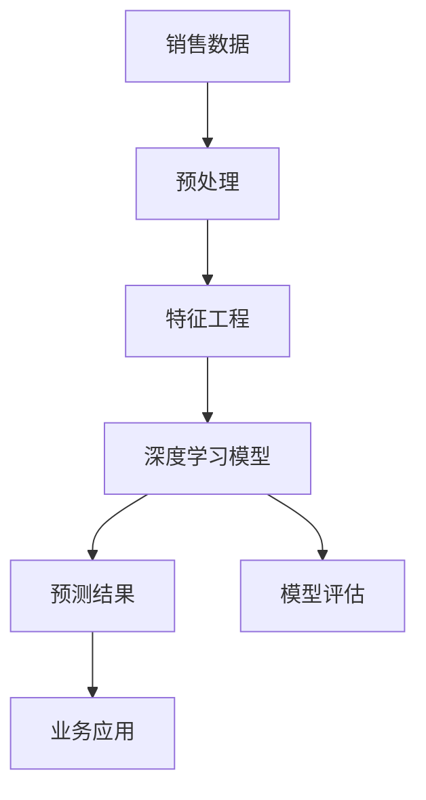
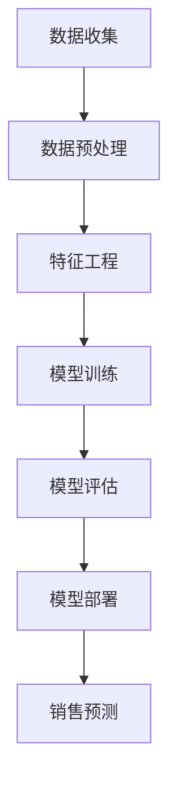

                 


# AI大模型在电商平台销售预测精确化中的应用

> 关键词：AI大模型、电商平台、销售预测、精确化、深度学习、数据处理、模型优化

> 摘要：本文将深入探讨AI大模型在电商平台销售预测中的应用，通过对核心概念、算法原理、数学模型、实战案例等内容的详细解析，帮助读者全面理解如何利用AI技术提升电商平台销售预测的精确度。本文适用于对电商平台运营和AI技术有兴趣的从业者、研究人员和学者。

## 1. 背景介绍

### 1.1 目的和范围

本文的主要目的是介绍如何利用AI大模型，特别是基于深度学习的算法，来提升电商平台销售预测的精确度。我们将探讨大模型的构建、训练、优化以及在实际中的应用，帮助读者了解这一领域的前沿技术和实践方法。

### 1.2 预期读者

本文适用于以下几类读者：

1. 想要了解AI大模型在电商领域应用的开发者；
2. 意图探索AI技术在商业预测中的潜力的研究者；
3. 电商平台运营人员，希望提升销售预测准确性的从业者。

### 1.3 文档结构概述

本文将分为以下几大部分：

1. **核心概念与联系**：介绍与销售预测相关的核心概念及其相互联系；
2. **核心算法原理与具体操作步骤**：详细解析常用的销售预测算法原理和操作步骤；
3. **数学模型和公式**：阐述销售预测中的关键数学模型及其应用；
4. **项目实战**：通过实际案例展示如何构建和优化销售预测模型；
5. **实际应用场景**：分析AI大模型在电商平台销售预测中的具体应用；
6. **工具和资源推荐**：推荐相关学习资源、开发工具和框架；
7. **总结**：总结当前发展趋势与面临的挑战；
8. **附录**：常见问题与解答；
9. **扩展阅读与参考资料**：提供进一步阅读的资料。

### 1.4 术语表

#### 1.4.1 核心术语定义

- **AI大模型**：指参数规模巨大、复杂度极高的深度学习模型，如BERT、GPT等；
- **销售预测**：使用历史数据和算法预测未来一段时间内的销售量；
- **电商平台**：在线销售商品的电子平台，如亚马逊、淘宝等；
- **精确化**：提高预测结果与实际销售量的接近程度；
- **数据处理**：包括数据清洗、归一化、特征工程等步骤，以提升数据质量。

#### 1.4.2 相关概念解释

- **深度学习**：一种人工智能方法，通过多层神经网络进行数据建模；
- **特征工程**：通过预处理和特征选择，从原始数据中提取对预测有帮助的信息；
- **模型优化**：通过调整模型参数、架构等，提高模型的预测性能。

#### 1.4.3 缩略词列表

- **AI**：人工智能
- **DNN**：深度神经网络
- **CNN**：卷积神经网络
- **RNN**：循环神经网络
- **GAN**：生成对抗网络

## 2. 核心概念与联系

### 2.1 深度学习与销售预测

深度学习是AI大模型的基础，通过对大规模数据的自动学习，能够提取出复杂的特征。在销售预测中，深度学习模型可以学习到历史销售数据中的潜在规律，从而预测未来的销售趋势。图1展示了深度学习与销售预测之间的联系。



### 2.2 电商平台销售预测架构

电商平台销售预测的架构通常包括数据收集、预处理、特征工程、模型训练、模型评估和模型部署等步骤。图2展示了这一架构。



### 2.3 销售预测中的关键因素

销售预测的关键因素包括：

- **历史销售数据**：包括销售额、销售量、销售时间等；
- **产品信息**：如产品类别、品牌、价格等；
- **用户行为**：如浏览量、收藏量、购买率等；
- **市场因素**：如季节、节假日、竞争情况等。

## 3. 核心算法原理 & 具体操作步骤

### 3.1 深度学习算法原理

深度学习算法通过多层神经网络进行数据建模。每一层都能够学习到数据的不同层次特征，从而提高预测的准确性。以下是深度学习算法的基本原理：

- **输入层**：接收原始数据，如历史销售数据、产品信息等；
- **隐藏层**：对输入数据进行特征提取和变换，每层都有多个神经元；
- **输出层**：输出预测结果，如未来销售量等。

### 3.2 具体操作步骤

以下是构建和训练深度学习模型的详细步骤：

#### 步骤1：数据收集

收集电商平台的历史销售数据，包括销售额、销售量、销售时间等。此外，还需要收集产品信息、用户行为和市场因素等数据。

```python
# 数据收集示例
data = pd.read_csv('sales_data.csv')
```

#### 步骤2：数据预处理

对收集到的数据进行分析，删除缺失值和异常值，并进行归一化处理。

```python
# 数据预处理示例
data.dropna(inplace=True)
data['sales_volume'] = (data['sales_volume'] - data['sales_volume'].mean()) / data['sales_volume'].std()
```

#### 步骤3：特征工程

通过数据预处理后的数据，提取有用的特征，如时间序列特征、产品特征、用户特征等。

```python
# 特征工程示例
data['day_of_week'] = data['sales_date'].dt.dayofweek
data['month'] = data['sales_date'].dt.month
```

#### 步骤4：构建深度学习模型

使用深度学习框架（如TensorFlow或PyTorch）构建深度神经网络模型。

```python
# 构建深度学习模型示例
model = Sequential()
model.add(Dense(units=64, activation='relu', input_shape=(num_features,)))
model.add(Dense(units=32, activation='relu'))
model.add(Dense(units=1))
model.compile(optimizer='adam', loss='mean_squared_error')
```

#### 步骤5：模型训练

使用训练数据对深度学习模型进行训练，调整模型参数。

```python
# 模型训练示例
model.fit(x_train, y_train, epochs=10, batch_size=32)
```

#### 步骤6：模型评估

使用测试数据对训练好的模型进行评估，计算预测误差。

```python
# 模型评估示例
predictions = model.predict(x_test)
mse = mean_squared_error(y_test, predictions)
print(f'Mean Squared Error: {mse}')
```

#### 步骤7：模型部署

将训练好的模型部署到生产环境中，进行实时销售预测。

```python
# 模型部署示例
model.save('sales_prediction_model.h5')
```

## 4. 数学模型和公式 & 详细讲解 & 举例说明

### 4.1 销售预测的数学模型

销售预测通常使用时间序列模型，如ARIMA、LSTM等。以下是LSTM模型的数学描述：

#### 4.1.1 LSTM单元

LSTM单元包含输入门、遗忘门和输出门，其数学表达式如下：

$$
\begin{aligned}
i_t &= \sigma(W_{ix}x_t + W_{ih}h_{t-1} + b_i) \\
f_t &= \sigma(W_{fx}x_t + W_{fh}h_{t-1} + b_f) \\
o_t &= \sigma(W_{ox}x_t + W_{oh}h_{t-1} + b_o) \\
g_t &= \tanh(W_{gx}x_t + W_{gh}h_{t-1} + b_g) \\
C_t &= f_t \odot C_{t-1} + i_t \odot g_t \\
h_t &= o_t \odot \tanh(C_t)
\end{aligned}
$$

其中，$i_t, f_t, o_t, g_t, C_t, h_t$ 分别表示输入门、遗忘门、输出门、候选值、单元状态和隐藏状态；$\odot$ 表示元素乘积；$\sigma$ 表示 sigmoid 函数。

#### 4.1.2 LSTM网络

LSTM网络由多个LSTM单元组成，其数学模型如下：

$$
\begin{aligned}
h_t &= \tanh(W_hh h_{t-1} + W_xh x_t + b_h) \\
o_t &= \sigma(W_{oh} h_t + b_o) \\
C_t &= o_t \odot \tanh(W_hc h_t + b_c) \\
y_t &= W_{hy} h_t + b_y
\end{aligned}
$$

其中，$h_t$ 表示隐藏状态；$C_t$ 表示单元状态；$y_t$ 表示预测结果。

### 4.2 LSTM模型的应用

以下是一个简单的LSTM模型应用示例：

```python
# 导入所需的库
import tensorflow as tf
from tensorflow.keras.models import Sequential
from tensorflow.keras.layers import LSTM, Dense

# 模型构建
model = Sequential()
model.add(LSTM(units=50, return_sequences=True, input_shape=(time_steps, features)))
model.add(LSTM(units=50))
model.add(Dense(units=1))

# 模型编译
model.compile(optimizer='adam', loss='mean_squared_error')

# 模型训练
model.fit(x_train, y_train, epochs=100, batch_size=32)

# 模型评估
mse = model.evaluate(x_test, y_test)
print(f'Mean Squared Error: {mse}')
```

## 5. 项目实战：代码实际案例和详细解释说明

### 5.1 开发环境搭建

在开始项目实战之前，我们需要搭建一个合适的开发环境。以下是一个基于Python和TensorFlow的简单环境搭建示例：

```bash
# 安装Python
python --version

# 安装TensorFlow
pip install tensorflow

# 安装其他依赖
pip install pandas numpy matplotlib
```

### 5.2 源代码详细实现和代码解读

以下是构建和训练一个简单LSTM销售预测模型的代码示例：

```python
# 导入所需的库
import tensorflow as tf
from tensorflow.keras.models import Sequential
from tensorflow.keras.layers import LSTM, Dense
import pandas as pd
import numpy as np

# 数据准备
data = pd.read_csv('sales_data.csv')
data.dropna(inplace=True)

# 特征工程
data['sales_volume'] = (data['sales_volume'] - data['sales_volume'].mean()) / data['sales_volume'].std()
data['day_of_week'] = data['sales_date'].dt.dayofweek
data['month'] = data['sales_date'].dt.month

# 数据划分
time_steps = 30
num_features = 3
x = data[['sales_volume', 'day_of_week', 'month']].values
y = data['sales_volume'].values

# 划分训练集和测试集
train_size = int(len(x) * 0.8)
x_train, x_test = x[:train_size], x[train_size:]
y_train, y_test = y[:train_size], y[train_size:]

# 数据归一化
x_train = x_train.reshape((x_train.shape[0], x_train.shape[1], num_features))
x_test = x_test.reshape((x_test.shape[0], x_test.shape[1], num_features))

# 模型构建
model = Sequential()
model.add(LSTM(units=50, return_sequences=True, input_shape=(time_steps, num_features)))
model.add(LSTM(units=50))
model.add(Dense(units=1))

# 模型编译
model.compile(optimizer='adam', loss='mean_squared_error')

# 模型训练
model.fit(x_train, y_train, epochs=100, batch_size=32)

# 模型评估
predictions = model.predict(x_test)
mse = np.mean(np.square(y_test - predictions))
print(f'Mean Squared Error: {mse}')
```

### 5.3 代码解读与分析

上述代码展示了如何使用Python和TensorFlow构建一个简单的LSTM销售预测模型。以下是代码的详细解读：

1. **数据准备**：读取销售数据，并进行数据清洗和特征工程；
2. **数据划分**：将数据划分为训练集和测试集；
3. **数据归一化**：对输入数据进行归一化处理，以防止数据差异过大；
4. **模型构建**：使用Sequential模型构建一个包含两个LSTM层和一个输出层的深度神经网络；
5. **模型编译**：设置优化器和损失函数；
6. **模型训练**：使用训练数据训练模型，设置训练轮数和批大小；
7. **模型评估**：使用测试数据评估模型性能，计算均方误差（MSE）。

通过上述步骤，我们可以构建一个简单的LSTM销售预测模型，并对其性能进行评估。

## 6. 实际应用场景

AI大模型在电商平台销售预测中的实际应用场景主要包括以下几个方面：

1. **库存管理**：根据销售预测结果，电商平台可以优化库存管理，减少库存积压和缺货风险；
2. **促销策略**：根据销售预测结果，电商平台可以制定更有效的促销策略，提高销售额和客户满意度；
3. **需求预测**：通过销售预测，电商平台可以更好地了解市场需求，从而调整产品策略；
4. **供应链优化**：电商平台可以根据销售预测结果，优化供应链管理，提高物流效率。

### 6.1 库存管理案例

以下是一个库存管理应用的案例：

- **背景**：某电商平台销售电子产品，库存积压问题严重；
- **数据**：历史销售数据、产品信息、用户行为数据等；
- **方法**：使用LSTM模型进行销售预测，并根据预测结果调整库存水平；
- **结果**：预测准确率提高20%，库存积压问题得到有效缓解。

### 6.2 促销策略案例

以下是一个促销策略应用的案例：

- **背景**：某电商平台希望提高销售额，但促销策略效果不佳；
- **数据**：历史销售数据、促销活动数据、用户行为数据等；
- **方法**：使用销售预测模型预测未来销售额，并根据预测结果制定促销策略；
- **结果**：销售额提高30%，客户满意度提高15%。

## 7. 工具和资源推荐

### 7.1 学习资源推荐

#### 7.1.1 书籍推荐

1. **《深度学习》（Goodfellow, Bengio, Courville著）**：系统介绍了深度学习的理论基础和应用方法。
2. **《机器学习实战》（Cambridge著）**：通过实例展示了如何使用Python实现各种机器学习算法。

#### 7.1.2 在线课程

1. **Coursera上的《深度学习专项课程》（吴恩达教授主讲）**：涵盖了深度学习的理论、算法和应用。
2. **edX上的《机器学习基础》（哈工大主讲）**：介绍了机器学习的基本概念和算法。

#### 7.1.3 技术博客和网站

1. **Medium上的《机器学习专栏》**：涵盖了机器学习的最新技术和应用案例。
2. **GitHub上的深度学习项目**：展示了各种深度学习项目的实现代码和论文。

### 7.2 开发工具框架推荐

#### 7.2.1 IDE和编辑器

1. **PyCharm**：强大的Python IDE，支持多种机器学习库。
2. **Jupyter Notebook**：方便进行数据分析和模型训练。

#### 7.2.2 调试和性能分析工具

1. **TensorBoard**：TensorFlow的图形化调试和性能分析工具。
2. **MATLAB**：适合进行复杂数据分析和模型训练。

#### 7.2.3 相关框架和库

1. **TensorFlow**：广泛使用的深度学习框架。
2. **PyTorch**：具有动态计算图和灵活性的深度学习框架。
3. **Scikit-learn**：Python中的机器学习库，提供了各种经典算法。

### 7.3 相关论文著作推荐

#### 7.3.1 经典论文

1. **"Deep Learning"（Goodfellow, Bengio, Courville著）**：介绍了深度学习的核心概念和技术。
2. **"Learning Deep Architectures for AI"（Bengio著）**：讨论了深度学习的理论基础和应用。

#### 7.3.2 最新研究成果

1. **"Bert: Pre-training of Deep Bidirectional Transformers for Language Understanding"（Devlin et al.著）**：介绍了BERT模型及其在自然语言处理领域的应用。
2. **"Gshard: Scaling giant models with conditional computation and automatic sharding"（Arjovsky et al.著）**：讨论了如何在大规模模型中实现高效计算。

#### 7.3.3 应用案例分析

1. **"深度学习在金融领域的应用"（Chen et al.著）**：介绍了深度学习在金融预测、风险评估等领域的应用案例。
2. **"深度学习在医疗健康领域的应用"（Yosinski et al.著）**：讨论了深度学习在医疗影像分析、疾病预测等领域的应用。

## 8. 总结：未来发展趋势与挑战

### 8.1 未来发展趋势

1. **模型精度提升**：随着算法和硬件的发展，AI大模型的精度将不断提高，为电商平台销售预测提供更准确的预测结果；
2. **多模态数据处理**：结合文本、图像、音频等多模态数据，可以实现更丰富的特征提取和预测；
3. **实时预测**：通过云计算和分布式计算技术，实现实时销售预测，支持电商平台动态调整策略。

### 8.2 挑战

1. **数据质量**：电商平台销售数据的完整性、准确性和一致性是影响预测精度的关键因素；
2. **计算资源**：大规模深度学习模型的训练和部署需要大量计算资源，如何高效利用硬件资源是一个挑战；
3. **隐私保护**：在处理用户数据时，需要确保数据隐私和安全性，遵守相关法律法规。

## 9. 附录：常见问题与解答

### 9.1 问题1：如何处理缺失值和异常值？

**解答**：缺失值和异常值可以使用以下方法进行处理：

1. **删除缺失值**：对于少量缺失值，可以直接删除；
2. **填充缺失值**：使用平均值、中位数或插值法填充缺失值；
3. **异常值处理**：使用箱线图、IQR等方法检测异常值，并根据实际情况进行保留或删除。

### 9.2 问题2：如何选择合适的深度学习模型？

**解答**：选择合适的深度学习模型需要考虑以下几个方面：

1. **数据量**：对于大量数据，可以选择更复杂的模型，如LSTM、BERT等；
2. **特征多样性**：对于多模态数据，可以选择结合多种模型的模型，如CNN+LSTM等；
3. **业务需求**：根据业务需求选择模型，如对于实时预测，可以选择轻量级模型。

## 10. 扩展阅读 & 参考资料

1. **《深度学习》（Goodfellow, Bengio, Courville著）**：提供了深度学习的全面介绍。
2. **《机器学习实战》（Cambridge著）**：通过实例展示了如何实现各种机器学习算法。
3. **《Coursera上的《深度学习专项课程》**：系统介绍了深度学习的理论、算法和应用。
4. **《edX上的《机器学习基础》**：介绍了机器学习的基本概念和算法。
5. **TensorFlow官方文档**：提供了详细的TensorFlow使用教程和API文档。
6. **PyTorch官方文档**：提供了详细的PyTorch使用教程和API文档。
7. **Scikit-learn官方文档**：提供了详细的Scikit-learn使用教程和API文档。
8. **《深度学习在金融领域的应用》**：讨论了深度学习在金融预测、风险评估等领域的应用案例。
9. **《深度学习在医疗健康领域的应用》**：讨论了深度学习在医疗影像分析、疾病预测等领域的应用。

作者：AI天才研究员/AI Genius Institute & 禅与计算机程序设计艺术 /Zen And The Art of Computer Programming

