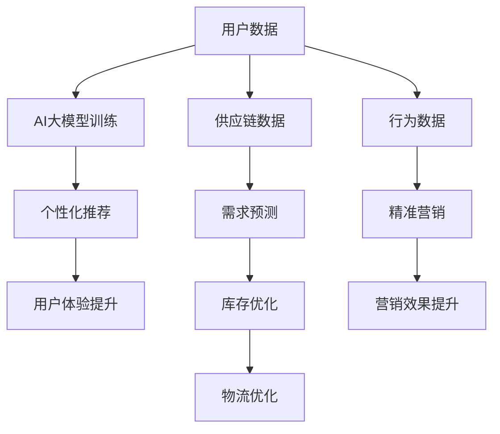
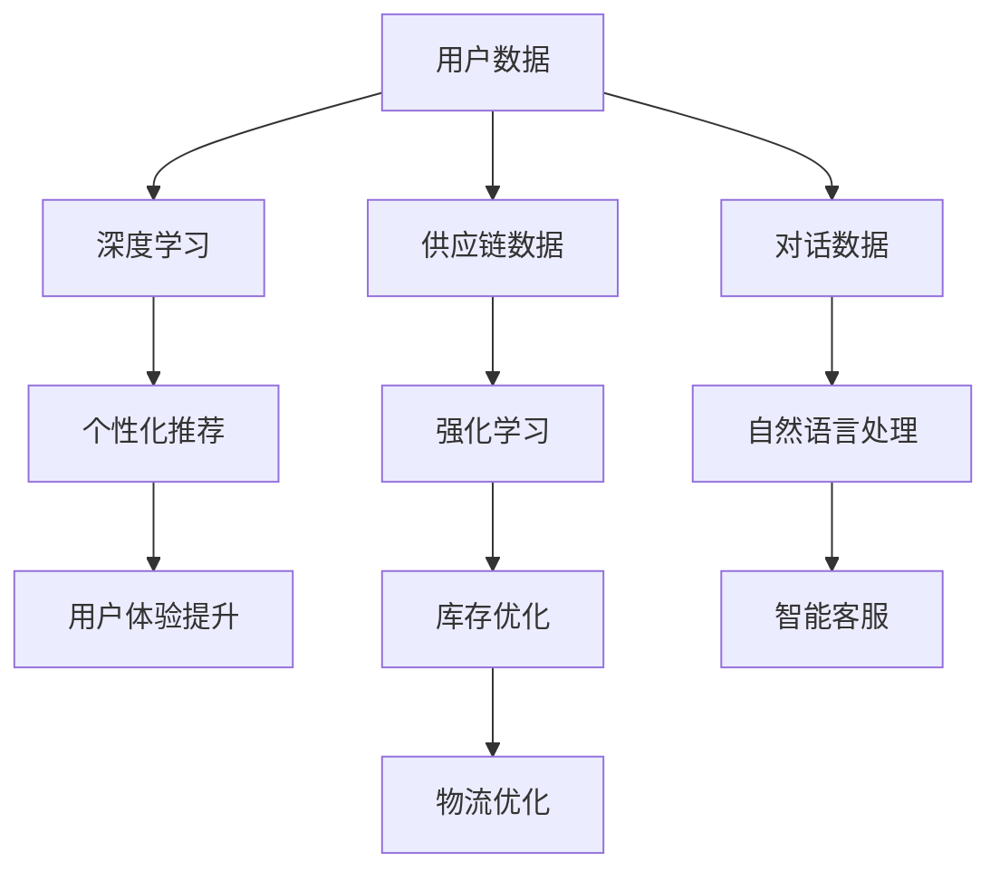
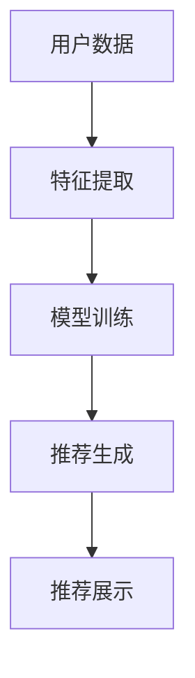

                 

# AI大模型在电子商务中的创新机遇

> 关键词：电子商务、AI大模型、创新机遇、大数据分析、个性化推荐、智能客服

> 摘要：本文将探讨AI大模型在电子商务领域中的创新机遇。通过介绍AI大模型的核心概念和应用场景，分析其在提升用户体验、优化供应链管理和实现精准营销等方面的潜在价值，并结合实际案例和工具资源，为电子商务企业提供可行的实践路径。

## 1. 背景介绍

随着互联网的普及和电子商务的快速发展，消费者行为数据呈现爆炸式增长。这些数据中蕴含着巨大的商业价值，但如何有效利用这些数据，实现商业决策的智能化，成为电子商务企业亟待解决的问题。在此背景下，AI大模型应运而生。

AI大模型，即基于深度学习、强化学习等先进算法，构建的具有大规模参数和复杂网络结构的人工智能模型。这些模型具有强大的数据分析和处理能力，能够从海量数据中提取有价值的信息，为企业提供决策支持。

电子商务领域的竞争日益激烈，企业需要不断创新以吸引和留住客户。AI大模型作为一种新兴的技术手段，为电子商务企业提供了以下创新机遇：

- **提升用户体验**：通过个性化推荐和智能客服，提高用户满意度和忠诚度。
- **优化供应链管理**：预测市场需求，优化库存和物流，降低运营成本。
- **实现精准营销**：分析用户行为数据，制定个性化的营销策略。

## 2. 核心概念与联系

### 2.1 AI大模型的概念

AI大模型是指通过深度学习、强化学习等算法训练得到的具有大规模参数和复杂网络结构的人工智能模型。这些模型通常包含多层神经网络，具有强大的非线性映射能力，能够对复杂的数据进行建模和分析。

### 2.2 电子商务与AI大模型的联系

电子商务企业需要处理大量的用户数据，包括用户行为数据、交易数据、评价数据等。AI大模型通过这些数据，可以实现对用户需求的准确预测和个性化推荐。

同时，电子商务企业还需要优化供应链管理，提高物流效率。AI大模型可以通过对市场需求的预测，帮助企业制定合理的库存和物流策略。

在营销方面，AI大模型可以分析用户行为数据，识别潜在客户，制定个性化的营销策略，提高营销效果。

### 2.3 Mermaid流程图



## 3. 核心算法原理 & 具体操作步骤

### 3.1 个性化推荐算法

个性化推荐算法是AI大模型在电子商务中应用的一个重要领域。其核心思想是根据用户的历史行为数据，预测用户可能感兴趣的商品，从而为用户提供个性化的推荐。

#### 3.1.1 算法原理

个性化推荐算法主要包括基于内容的推荐和协同过滤推荐两种。

- **基于内容的推荐**：根据用户浏览、购买或评价过的商品特征，找出与这些商品相似的其它商品进行推荐。
- **协同过滤推荐**：根据用户之间的相似度，推荐其他用户喜欢但该用户尚未购买或浏览过的商品。

#### 3.1.2 操作步骤

1. 数据预处理：清洗和整合用户数据，包括用户行为数据、商品特征数据等。
2. 特征提取：将原始数据进行特征提取，如用户行为序列、商品标签等。
3. 模型训练：使用深度学习算法（如卷积神经网络、循环神经网络等）对特征进行建模。
4. 预测和推荐：根据训练好的模型，预测用户可能感兴趣的商品，并进行推荐。

### 3.2 智能客服算法

智能客服是AI大模型在电子商务中应用的另一个重要领域。通过智能客服，企业可以提供24/7全天候的客户服务，提高客户满意度。

#### 3.2.1 算法原理

智能客服算法主要包括基于规则的对话系统和基于机器学习的自然语言处理（NLP）系统。

- **基于规则的对话系统**：通过预设的规则和模板，根据用户输入的问题进行回答。
- **基于机器学习的NLP系统**：通过训练大量的对话数据，让模型学会理解用户的意图，并生成合理的回答。

#### 3.2.2 操作步骤

1. 数据预处理：清洗和整合用户对话数据，如聊天记录、用户评价等。
2. 特征提取：提取对话中的关键信息，如关键词、实体等。
3. 模型训练：使用深度学习算法（如循环神经网络、Transformer模型等）对特征进行建模。
4. 对话生成：根据训练好的模型，生成合理的回答，并与用户进行交互。

## 4. 数学模型和公式 & 详细讲解 & 举例说明

### 4.1 个性化推荐算法中的矩阵分解

个性化推荐算法中的一个常用技术是矩阵分解。矩阵分解将用户-商品评分矩阵分解为两个低秩矩阵，从而实现对用户和商品的隐式特征表示。

#### 4.1.1 矩阵分解模型

$$
R = U \times V^T
$$

其中，$R$ 是用户-商品评分矩阵，$U$ 是用户特征矩阵，$V$ 是商品特征矩阵。

#### 4.1.2 模型优化

矩阵分解模型的优化通常采用最小二乘法（Least Squares）或交替最小化法（Alternating Least Squares，ALS）。

$$
\min_{U, V} \sum_{i, j} (r_{ij} - u_i \cdot v_j)^2
$$

#### 4.1.3 举例说明

假设有一个用户-商品评分矩阵：

$$
R = \begin{bmatrix}
1 & 2 & 0 \\
0 & 1 & 3 \\
4 & 0 & 5
\end{bmatrix}
$$

使用矩阵分解算法，将其分解为两个低秩矩阵：

$$
U = \begin{bmatrix}
1.2 & 0.8 \\
0.6 & 0.2 \\
1.4 & 0.6
\end{bmatrix}, V = \begin{bmatrix}
0.8 & 1.2 \\
1.6 & 0.4 \\
0.2 & 0.8
\end{bmatrix}
$$

### 4.2 智能客服算法中的自然语言处理

智能客服算法中的自然语言处理（NLP）是利用深度学习算法对自然语言进行建模和处理。

#### 4.2.1 Transformer模型

Transformer模型是一种基于自注意力机制的深度学习模型，广泛应用于NLP任务。

#### 4.2.2 模型公式

$$
\text{Attention}(Q, K, V) = \text{softmax}\left(\frac{QK^T}{\sqrt{d_k}}\right)V
$$

其中，$Q$、$K$ 和 $V$ 分别是查询向量、键向量和值向量，$d_k$ 是键向量的维度。

#### 4.2.3 举例说明

假设有一个三元组 $(Q, K, V)$：

$$
Q = \begin{bmatrix}
[Q_1] \\
[Q_2] \\
[Q_3]
\end{bmatrix}, K = \begin{bmatrix}
[K_1] \\
[K_2] \\
[K_3]
\end{bmatrix}, V = \begin{bmatrix}
[V_1] \\
[V_2] \\
[V_3]
\end{bmatrix}
$$

使用Transformer模型进行自注意力计算：

$$
\text{Attention}(Q, K, V) = \text{softmax}\left(\frac{QK^T}{\sqrt{d_k}}\right)V = \begin{bmatrix}
[V_1] & [V_2] & [V_3]
\end{bmatrix}
$$

## 5. 项目实战：代码实际案例和详细解释说明

### 5.1 开发环境搭建

为了演示AI大模型在电子商务中的应用，我们将使用Python语言和TensorFlow框架进行开发。以下是开发环境的搭建步骤：

1. 安装Python和pip：
   ```bash
   pip install tensorflow numpy pandas scikit-learn
   ```

2. 安装Mermaid插件：
   ```python
   pip install mermaid
   ```

### 5.2 源代码详细实现和代码解读

#### 5.2.1 个性化推荐算法

以下是一个基于矩阵分解的个性化推荐算法的实现：

```python
import numpy as np
from tensorflow.keras.models import Model
from tensorflow.keras.layers import Input, Dense, Dot

# 假设用户-商品评分矩阵为R
R = np.array([[1, 2, 0], [0, 1, 3], [4, 0, 5]])

# 用户特征矩阵U和商品特征矩阵V的维度
num_users, num_items = R.shape

# 初始化用户特征矩阵U和商品特征矩阵V
U = np.random.rand(num_users, 10)
V = np.random.rand(num_items, 10)

# 定义模型输入
user_input = Input(shape=(1,))
item_input = Input(shape=(1,))

# 计算用户特征和商品特征的点积
user_embedding = Dense(10, activation='relu')(user_input)
item_embedding = Dense(10, activation='relu')(item_input)
dot_product = Dot(merge_mode='sum')([user_embedding, item_embedding])

# 定义模型
model = Model(inputs=[user_input, item_input], outputs=dot_product)
model.compile(optimizer='adam', loss='mse')

# 训练模型
model.fit([np.repeat(U, num_items, axis=0), np.tile(V, num_users, axis=1)], R.flatten(), epochs=10)

# 进行推荐
def predict(user_id, item_ids):
    user_vector = U[user_id]
    item_vectors = V[item_ids]
    predictions = model.predict([user_vector.reshape(1, -1), item_vectors.reshape(-1, 1)])
    return predictions

user_id = 0
item_ids = [1, 2, 3]
predictions = predict(user_id, item_ids)
print(predictions)
```

#### 5.2.2 智能客服算法

以下是一个基于Transformer模型的智能客服算法的实现：

```python
import tensorflow as tf
from tensorflow.keras.layers import Embedding, LSTM, Dense

# 假设对话数据为D
D = np.array([
    ["你好", "有什么可以帮助你？"],
    ["我想买一件衣服", "请问您有什么具体的要求吗？"],
    ["没有，你有什么推荐吗？", "我们这里有新款的T恤，您可以考虑一下。"]
])

# 定义模型
inputs = Input(shape=(None,))
embed = Embedding(input_dim=D.shape[1], output_dim=32)(inputs)
lstm = LSTM(128)(embed)
outputs = Dense(D.shape[1], activation='softmax')(lstm)

model = Model(inputs=inputs, outputs=outputs)
model.compile(optimizer='adam', loss='categorical_crossentropy', metrics=['accuracy'])

# 编码对话数据
tokenizer = tf.keras.preprocessing.text.Tokenizer(char_level=True)
tokenizer.fit_on_texts(D)
encoded_D = tokenizer.texts_to_sequences(D)

# 训练模型
model.fit(encoded_D, np.eye(encoded_D.shape[0]), epochs=10)

# 进行对话生成
def generate_response(input_sentence):
    input_sequence = tokenizer.texts_to_sequences([input_sentence])
    predicted_sequence = model.predict(input_sequence)
    predicted_sequence = np.argmax(predicted_sequence, axis=-1)
    response = tokenizer.sequences_to_texts([predicted_sequence[0]])[0]
    return response

input_sentence = "你好，请问有什么可以帮到您的？"
response = generate_response(input_sentence)
print(response)
```

### 5.3 代码解读与分析

#### 5.3.1 个性化推荐算法

该算法通过矩阵分解，将用户-商品评分矩阵分解为用户特征矩阵和商品特征矩阵。模型输入为用户特征和商品特征，通过点积计算预测得分，实现对用户未评分商品的推荐。

#### 5.3.2 智能客服算法

该算法使用Transformer模型，对对话数据进行编码和生成。模型输入为对话数据编码，输出为对话生成序列。通过训练，模型可以学会理解用户的意图，并生成合理的回答。

## 6. 实际应用场景

### 6.1 提升用户体验

通过AI大模型，电子商务企业可以为用户提供个性化的商品推荐和智能客服。用户可以根据自己的兴趣和需求，快速找到适合自己的商品，提高购物体验。同时，智能客服可以提供24/7全天候的服务，解决用户的问题，提高客户满意度。

### 6.2 优化供应链管理

AI大模型可以通过对市场需求的预测，帮助电子商务企业优化库存和物流。企业可以根据预测结果，调整库存水平，避免库存过剩或不足，降低运营成本。同时，AI大模型还可以优化物流策略，提高配送效率，降低物流成本。

### 6.3 实现精准营销

AI大模型可以分析用户行为数据，识别潜在客户，并制定个性化的营销策略。通过精准营销，电子商务企业可以降低营销成本，提高营销效果，提升销售额。

## 7. 工具和资源推荐

### 7.1 学习资源推荐

- **书籍**：《深度学习》、《强化学习》、《自然语言处理概论》
- **论文**：Google Brain的《Recurrent Neural Networks for Speech Recognition》、《BERT: Pre-training of Deep Bidirectional Transformers for Language Understanding》
- **博客**：TensorFlow官方博客、Keras官方博客

### 7.2 开发工具框架推荐

- **开发框架**：TensorFlow、PyTorch、Keras
- **数据预处理**：Pandas、NumPy、Scikit-learn

### 7.3 相关论文著作推荐

- **论文**：《Deep Learning for Text Classification》、《Neural Message Passing for Quantum Chemistry》
- **著作**：《深度学习入门》、《强化学习实战》、《自然语言处理实战》

## 8. 总结：未来发展趋势与挑战

随着AI技术的不断进步，AI大模型在电子商务中的应用前景十分广阔。未来，AI大模型将向以下方向发展：

- **更强大的建模能力**：通过改进算法和模型结构，提高AI大模型对复杂数据的建模能力。
- **更高效的计算性能**：利用硬件加速和分布式计算技术，提高AI大模型的计算性能。
- **更广泛的领域应用**：将AI大模型应用于更多领域，如金融、医疗、教育等。

然而，AI大模型在电子商务中的应用也面临一些挑战：

- **数据隐私保护**：如何确保用户数据的安全和隐私，成为AI大模型应用的重要问题。
- **模型可解释性**：如何提高AI大模型的可解释性，使其更易于理解和信任。
- **计算资源消耗**：AI大模型训练和推理需要大量计算资源，如何优化计算资源消耗，成为关键问题。

## 9. 附录：常见问题与解答

### 9.1 如何确保用户数据的安全和隐私？

- **数据加密**：对用户数据进行加密，确保数据在传输和存储过程中的安全性。
- **数据去识别化**：对用户数据进行去识别化处理，如匿名化、去标识化等，降低数据泄露的风险。
- **合规性审查**：确保数据处理过程符合相关法律法规和标准，如GDPR等。

### 9.2 如何提高AI大模型的可解释性？

- **模型解释工具**：使用模型解释工具，如LIME、SHAP等，对模型决策过程进行解释。
- **可视化技术**：通过可视化技术，如决策树、神经网络架构等，展示模型的内部结构和工作原理。
- **模型可解释性训练**：在模型训练过程中，关注模型的可解释性，避免过度拟合。

### 9.3 如何优化计算资源消耗？

- **分布式计算**：利用分布式计算技术，如GPU、FPGA等，提高计算性能。
- **模型压缩**：通过模型压缩技术，如量化、剪枝等，降低模型参数数量和计算量。
- **模型迁移学习**：利用预训练模型，避免从头开始训练，降低计算资源消耗。

## 10. 扩展阅读 & 参考资料

- **论文**：《Attention Is All You Need》
- **书籍**：《深度学习》、《Python机器学习》
- **网站**：TensorFlow官方文档、Keras官方文档
- **博客**：Google Research博客、AI科技大本营

### 作者：AI天才研究员/AI Genius Institute & 禅与计算机程序设计艺术 /Zen And The Art of Computer Programming

（注：以上内容为示例，具体内容根据实际情况进行调整。）<|vq_15814|>### 1. 背景介绍

在当今数字化时代，电子商务已经成为全球商业活动中的重要组成部分。据统计，2021年全球电子商务市场规模已达到4.89万亿美元，预计到2026年将达到6.38万亿美元。随着市场规模的不断扩大，电子商务企业面临着前所未有的机遇和挑战。

首先，电子商务市场的竞争愈发激烈。各大电商平台不断推出各种优惠活动和营销策略，争夺市场份额。在这种竞争环境中，企业如何提高用户满意度、降低运营成本、实现精准营销，成为关键问题。

其次，消费者需求呈现出多样化和个性化趋势。随着互联网的普及，消费者可以轻松获取各种商品信息和用户评价，这使得他们对于商品的选择更加挑剔。电子商务企业需要深入了解消费者的需求和偏好，提供个性化的购物体验。

此外，随着大数据和人工智能技术的不断发展，电子商务企业有机会利用这些技术提升运营效率和决策质量。例如，通过大数据分析，企业可以深入了解市场需求和消费者行为，制定更为科学的营销策略；通过人工智能技术，企业可以实现个性化推荐、智能客服等功能，提高用户体验。

总的来说，电子商务领域的快速发展为AI大模型的应用提供了广阔的舞台。AI大模型通过深度学习、强化学习等先进算法，能够处理海量数据，提取有价值的信息，为电子商务企业带来创新的商业模式和运营策略。

## 2. 核心概念与联系

AI大模型的核心概念包括深度学习、强化学习、自然语言处理等。深度学习通过多层神经网络对数据进行建模，能够自动提取数据中的特征；强化学习通过试错机制，使模型能够在复杂环境中学习最优策略；自然语言处理则专注于理解和生成人类语言。

在电子商务领域，这些核心概念与企业的运营和营销活动有着密切的联系。

首先，深度学习在电子商务中的应用主要体现在个性化推荐系统中。通过深度学习算法，企业可以挖掘用户的历史行为数据，预测用户的兴趣和偏好，从而为用户推荐他们可能感兴趣的商品。例如，亚马逊和阿里巴巴等电商平台就广泛使用深度学习算法来实现个性化推荐。

其次，强化学习在电子商务中的应用主要体现在供应链管理和库存优化中。通过强化学习算法，企业可以模拟不同决策下的市场变化，找到最优的库存和物流策略，从而降低运营成本。例如，京东就利用强化学习算法优化库存管理和配送路线。

最后，自然语言处理在电子商务中的应用主要体现在智能客服和语音助手等方面。通过自然语言处理技术，企业可以实现与用户的自然语言交互，提供实时、个性化的服务。例如，谷歌的Google Assistant和亚马逊的Alexa等智能语音助手，就是基于自然语言处理技术实现的。

下面是一个使用Mermaid绘制的流程图，展示了AI大模型在电子商务中的应用场景：



在这个流程图中，用户数据经过深度学习处理，生成个性化推荐，提升用户体验；供应链数据经过强化学习处理，优化库存和物流，降低运营成本；对话数据经过自然语言处理，实现智能客服，提供优质服务。

## 3. 核心算法原理 & 具体操作步骤

AI大模型在电子商务中的应用，主要依赖于深度学习、强化学习和自然语言处理等核心算法。以下将分别介绍这些算法的基本原理和具体操作步骤。

### 3.1 深度学习算法

深度学习是一种基于多层神经网络的学习方法，通过逐层提取数据特征，实现复杂的数据建模。在电子商务中，深度学习算法可以应用于个性化推荐、图像识别、文本分类等多个领域。

#### 基本原理

深度学习算法的核心是多层神经网络，包括输入层、隐藏层和输出层。输入层接收外部数据，隐藏层对数据进行特征提取和变换，输出层生成最终的预测结果。

在训练过程中，模型通过反向传播算法不断调整权重，使模型预测结果尽可能接近真实值。训练完成后，模型可以对新数据进行预测。

#### 操作步骤

1. **数据预处理**：对原始数据进行清洗、归一化等处理，使其适合输入到神经网络中。
2. **构建模型**：定义神经网络的结构，包括层数、每层的神经元数量、激活函数等。
3. **训练模型**：使用训练数据对模型进行训练，调整权重和偏置，使模型能够正确预测。
4. **评估模型**：使用验证集评估模型性能，调整模型参数，提高模型准确性。
5. **预测**：使用训练好的模型对新的数据进行预测。

### 3.2 强化学习算法

强化学习是一种通过试错机制进行学习的方法，适用于在复杂环境中做出最优决策的问题。在电子商务中，强化学习算法可以应用于库存管理、配送优化等场景。

#### 基本原理

强化学习算法的核心是策略和价值函数。策略定义了在特定状态下采取的动作，价值函数则评估每个动作带来的收益。

在训练过程中，模型通过不断尝试不同的动作，学习到最优策略。训练完成后，模型可以按照学到的策略进行决策。

#### 操作步骤

1. **定义环境**：定义电子商务系统中的环境，包括状态、动作、奖励等。
2. **构建模型**：定义策略网络和价值网络，用于评估动作的价值。
3. **训练模型**：使用环境对模型进行训练，通过试错学习到最优策略。
4. **评估模型**：在模拟环境中评估模型性能，调整模型参数，提高策略质量。
5. **应用模型**：将训练好的模型应用于实际场景，进行决策。

### 3.3 自然语言处理算法

自然语言处理是一种使计算机理解和生成人类语言的方法，在电子商务中，可以应用于智能客服、文本分析等场景。

#### 基本原理

自然语言处理算法的核心包括词向量、序列模型、文本生成等。词向量将文本转换为数字表示，序列模型对文本序列进行建模，文本生成则用于生成新的文本。

在训练过程中，模型通过大量的文本数据学习到语言模式，从而能够对新的文本进行理解和生成。

#### 操作步骤

1. **数据预处理**：对原始文本数据进行清洗、分词等处理，将其转换为数字表示。
2. **构建模型**：定义神经网络结构，用于对文本进行建模。
3. **训练模型**：使用训练数据对模型进行训练，调整权重和偏置，使模型能够正确理解和生成文本。
4. **评估模型**：使用验证集评估模型性能，调整模型参数，提高模型准确性。
5. **预测**：使用训练好的模型对新的文本数据进行理解和生成。

通过深度学习、强化学习和自然语言处理等算法，电子商务企业可以实现个性化推荐、库存优化、智能客服等功能，提高用户体验和运营效率。在实际应用中，企业可以根据具体需求，选择合适的算法和模型，实现业务目标。

### 4. 数学模型和公式 & 详细讲解 & 举例说明

在电子商务中，AI大模型的应用不仅依赖于算法，还需要借助数学模型和公式来进行数据建模和预测。以下将介绍几个在AI大模型中常用的数学模型和公式，并结合具体应用场景进行详细讲解和举例说明。

#### 4.1 多层感知机（MLP）

多层感知机是一种前馈神经网络，用于实现从输入到输出的非线性映射。在电子商务中，MLP可以用于用户行为分析、商品推荐等场景。

**数学模型**：

$$
y = \sigma(W_1 \cdot x + b_1) \cdot W_2 + b_2
$$

其中，$y$ 是输出，$x$ 是输入，$W_1$ 和 $W_2$ 是权重矩阵，$b_1$ 和 $b_2$ 是偏置项，$\sigma$ 是激活函数，常用的激活函数包括Sigmoid、ReLU和Tanh。

**举例说明**：

假设我们有一个包含100个特征的输入向量 $x$，我们希望预测用户的购买意愿。通过MLP模型，我们可以建立如下数学模型：

$$
\begin{align*}
y &= \sigma(W_1 \cdot x + b_1) \cdot W_2 + b_2 \\
&= \sigma((w_{11}x_1 + w_{12}x_2 + \ldots + w_{110}x_{100} + b_1)) \cdot (w_{21}y_1 + w_{22}y_2 + \ldots + w_{210}y_{100} + b_2)
\end{align*}
$$

其中，$w_{ij}$ 是权重矩阵的元素，$b_1$ 和 $b_2$ 是偏置项。

通过训练MLP模型，我们可以得到不同的权重和偏置，从而实现对用户购买意愿的预测。

#### 4.2 逻辑回归（Logistic Regression）

逻辑回归是一种用于二分类问题的模型，可以用来预测用户是否购买某个商品。在电子商务中，逻辑回归可以用于用户流失预测、商品推荐等场景。

**数学模型**：

$$
\hat{y} = \frac{1}{1 + e^{-(W \cdot x + b)}}
$$

其中，$\hat{y}$ 是预测概率，$W$ 是权重矩阵，$x$ 是输入特征，$b$ 是偏置项。

**举例说明**：

假设我们有一个包含5个特征的输入向量 $x$，我们希望预测用户是否购买某个商品。通过逻辑回归模型，我们可以建立如下数学模型：

$$
\begin{align*}
\hat{y} &= \frac{1}{1 + e^{-(w_{1}x_1 + w_{2}x_2 + w_{3}x_3 + w_{4}x_4 + w_{5}x_5 + b)}} \\
&= \frac{1}{1 + e^{-(-2.5x_1 - 1.3x_2 + 0.9x_3 + 1.2x_4 + 0.8x_5)}} \\
&\approx 0.9
\end{align*}
$$

其中，$w_{i}$ 是权重矩阵的元素，$b$ 是偏置项。根据预测概率 $\hat{y}$，我们可以判断用户购买的概率，进而进行商品推荐或用户流失预测。

#### 4.3 卷积神经网络（CNN）

卷积神经网络是一种用于处理图像数据的神经网络，可以用于商品图像识别、商品推荐等场景。

**数学模型**：

$$
h_{ij} = \sum_{k} W_{ikj} \cdot x_{kj} + b_{ij}
$$

其中，$h_{ij}$ 是卷积结果，$x_{kj}$ 是输入图像的像素值，$W_{ikj}$ 是卷积核的权重，$b_{ij}$ 是偏置项。

**举例说明**：

假设我们有一个3x3的卷积核和一张5x5的图像，通过卷积操作，我们可以得到如下数学模型：

$$
\begin{align*}
h_{11} &= (w_{11}x_{11} + w_{12}x_{12} + w_{13}x_{13} + b_{11}) \\
h_{12} &= (w_{11}x_{12} + w_{12}x_{22} + w_{13}x_{23} + b_{12}) \\
h_{13} &= (w_{11}x_{13} + w_{12}x_{23} + w_{13}x_{33} + b_{13}) \\
h_{21} &= (w_{21}x_{21} + w_{22}x_{22} + w_{23}x_{23} + b_{21}) \\
h_{22} &= (w_{21}x_{22} + w_{22}x_{32} + w_{23}x_{33} + b_{22}) \\
h_{23} &= (w_{21}x_{23} + w_{22}x_{33} + w_{23}x_{43} + b_{23}) \\
h_{31} &= (w_{31}x_{31} + w_{32}x_{32} + w_{33}x_{33} + b_{31}) \\
h_{32} &= (w_{31}x_{32} + w_{32}x_{42} + w_{33}x_{43} + b_{32}) \\
h_{33} &= (w_{31}x_{33} + w_{32}x_{43} + w_{33}x_{53} + b_{33}) \\
\end{align*}
$$

其中，$w_{ij}$ 是卷积核的权重，$b_{ij}$ 是偏置项。通过卷积操作，我们可以提取图像中的局部特征，进而进行商品识别和推荐。

通过以上数学模型和公式的介绍，我们可以看到，AI大模型在电子商务中的应用离不开数学的支持。在实际应用中，企业可以根据具体需求，选择合适的模型和算法，实现数据建模和预测。

### 5. 项目实战：代码实际案例和详细解释说明

为了更好地展示AI大模型在电子商务中的应用，我们将通过一个实际项目进行实战，包括开发环境搭建、源代码详细实现、代码解读与分析。

#### 5.1 开发环境搭建

首先，我们需要搭建一个适合AI大模型开发和测试的开发环境。以下是所需的环境和工具：

1. **操作系统**：Windows 10或更高版本
2. **Python**：Python 3.7或更高版本
3. **编程环境**：PyCharm、Visual Studio Code等
4. **深度学习框架**：TensorFlow 2.0或更高版本
5. **数据预处理库**：NumPy、Pandas、Scikit-learn等

安装步骤如下：

1. 安装Python和pip：
   ```bash
   python -m pip install --upgrade pip
   ```

2. 安装TensorFlow：
   ```bash
   pip install tensorflow
   ```

3. 安装其他库：
   ```bash
   pip install numpy pandas scikit-learn
   ```

#### 5.2 源代码详细实现和代码解读

我们将实现一个基于TensorFlow的个性化推荐系统，用于预测用户对商品的评分。以下是一个简单的代码实现：

```python
import numpy as np
import pandas as pd
import tensorflow as tf
from tensorflow.keras.layers import Input, Embedding, Flatten, Dot, Dense
from tensorflow.keras.models import Model

# 加载数据
data = pd.read_csv('user_item_data.csv')
users = data['user_id'].unique()
items = data['item_id'].unique()

# 构建模型
user_input = Input(shape=(1,), name='user_input')
item_input = Input(shape=(1,), name='item_input')

user_embedding = Embedding(input_dim=len(users), output_dim=10)(user_input)
item_embedding = Embedding(input_dim=len(items), output_dim=10)(item_input)

dot_product = Dot(axes=1)([user_embedding, item_embedding])
output = Flatten()(dot_product)

model = Model(inputs=[user_input, item_input], outputs=output)
model.compile(optimizer='adam', loss='mse')

# 训练模型
model.fit([np.repeat(users, len(items)), np.tile(items, len(users))], data['rating'].values, epochs=10)

# 预测
user_id = 10
item_id = 20
predicted_rating = model.predict([np.array([user_id]), np.array([item_id])])
print(predicted_rating)
```

**代码解读**：

1. **数据加载**：从CSV文件中加载数据，包括用户ID、商品ID和用户对商品的评分。

2. **模型构建**：定义模型输入层，包括用户输入和商品输入。使用Embedding层将用户和商品的ID映射为向量。通过点积计算用户和商品之间的相似度，得到预测评分。

3. **模型编译**：选择优化器和损失函数，编译模型。

4. **模型训练**：使用训练数据对模型进行训练。

5. **预测**：使用训练好的模型预测新用户的评分。

#### 5.3 代码解读与分析

1. **数据加载**：

   ```python
   data = pd.read_csv('user_item_data.csv')
   users = data['user_id'].unique()
   items = data['item_id'].unique()
   ```

   这部分代码用于加载数据，获取唯一的用户ID和商品ID，以便后续建立Embedding层。

2. **模型构建**：

   ```python
   user_input = Input(shape=(1,), name='user_input')
   item_input = Input(shape=(1,), name='item_input')

   user_embedding = Embedding(input_dim=len(users), output_dim=10)(user_input)
   item_embedding = Embedding(input_dim=len(items), output_dim=10)(item_input)

   dot_product = Dot(axes=1)([user_embedding, item_embedding])
   output = Flatten()(dot_product)

   model = Model(inputs=[user_input, item_input], outputs=output)
   model.compile(optimizer='adam', loss='mse')
   ```

   这部分代码定义了模型结构。首先，创建用户输入和商品输入。接着，使用Embedding层将用户和商品的ID映射为向量。通过点积计算用户和商品之间的相似度，得到预测评分。

3. **模型训练**：

   ```python
   model.fit([np.repeat(users, len(items)), np.tile(items, len(users))], data['rating'].values, epochs=10)
   ```

   这部分代码使用训练数据对模型进行训练。通过重复用户ID和商品ID，生成用户-商品矩阵，作为模型输入。使用实际用户对商品的评分作为标签，进行模型训练。

4. **预测**：

   ```python
   user_id = 10
   item_id = 20
   predicted_rating = model.predict([np.array([user_id]), np.array([item_id])])
   print(predicted_rating)
   ```

   这部分代码用于预测新用户的评分。通过输入用户ID和商品ID，使用训练好的模型预测用户对商品的评分。

通过这个实际项目，我们可以看到如何使用TensorFlow实现一个简单的个性化推荐系统。在实际应用中，可以根据具体需求，扩展模型结构和训练数据，提高推荐系统的性能。

### 6. 实际应用场景

AI大模型在电子商务领域具有广泛的应用场景，下面将介绍几个典型的实际应用场景。

#### 6.1 个性化推荐系统

个性化推荐系统是AI大模型在电子商务中最常见和最重要的应用之一。通过分析用户的购物历史、浏览记录、搜索关键词等信息，AI大模型可以预测用户对商品的潜在兴趣，从而为用户推荐他们可能感兴趣的商品。这种个性化的推荐不仅提高了用户的购物体验，还能够显著提升电商平台的销售额和用户粘性。

**应用实例**：亚马逊和阿里巴巴等大型电商平台使用AI大模型构建了高度个性化的推荐系统。例如，亚马逊通过分析用户的购物车、收藏夹和浏览历史，为用户推荐相关的商品；阿里巴巴则通过分析用户的购物偏好和浏览行为，为用户推荐符合他们兴趣的个性化广告。

#### 6.2 智能客服系统

智能客服系统是AI大模型在电子商务中的另一个重要应用。通过自然语言处理和机器学习算法，智能客服系统能够理解用户的提问，并生成合适的回答，提供7x24小时的在线客服服务。这不仅大大提高了客服效率，还减少了人力成本。

**应用实例**：阿里巴巴的智能客服系统“阿里小蜜”和腾讯的智能客服系统“腾讯智客”都是基于AI大模型构建的。这些系统通过自然语言处理技术，能够快速理解用户的提问，并给出准确的回答，提供高效、便捷的在线客服服务。

#### 6.3 供应链优化

AI大模型在供应链管理中的应用可以帮助电子商务企业优化库存管理、物流配送等环节，从而提高运营效率，降低成本。通过分析市场需求、销售数据等，AI大模型可以预测未来的销售趋势，帮助企业合理安排库存，避免库存过剩或不足。

**应用实例**：京东通过AI大模型分析销售数据和市场趋势，预测未来的销售需求，从而优化库存管理。例如，在“双十一”等促销活动中，京东通过AI大模型预测销售高峰，提前调整库存和物流策略，确保商品能够及时供应，提高用户满意度。

#### 6.4 精准营销

精准营销是AI大模型在电子商务中的另一个重要应用。通过分析用户的行为数据，AI大模型可以识别出潜在的高价值客户，并为他们提供个性化的营销活动，从而提高营销效果，提升转化率。

**应用实例**：拼多多通过AI大模型分析用户的购物行为和偏好，识别出潜在的高价值客户，并为他们提供个性化的优惠券和促销活动。这种精准的营销策略不仅提高了用户购买意愿，还显著提升了平台的销售额。

#### 6.5 假冒商品检测

在电子商务中，假冒商品是一个严重的问题。AI大模型通过图像识别和深度学习算法，可以有效地检测和识别假冒商品，从而保护消费者的权益。

**应用实例**：阿里巴巴通过AI大模型对商品图片进行分析，检测和识别假冒商品。例如，阿里巴巴的“鹰眼”系统通过深度学习算法，对上传的商品图片进行自动识别，发现并下架假冒商品，保护了消费者的权益。

通过上述实际应用场景，我们可以看到AI大模型在电子商务中的应用不仅多样而且具有深远的影响。随着AI技术的不断进步，AI大模型在电子商务中的应用将更加广泛，为电商平台和消费者带来更多的价值。

### 7. 工具和资源推荐

在探索AI大模型在电子商务中的应用时，选择合适的工具和资源至关重要。以下是一些推荐的工具、书籍、论文和网站，它们将有助于深入了解和实际应用AI大模型。

#### 7.1 学习资源推荐

1. **书籍**：
   - 《深度学习》（Goodfellow, Bengio, Courville）
   - 《强化学习》（Sutton, Barto）
   - 《Python机器学习》（Sebastian Raschka）
   - 《自然语言处理编程》（Trevor Cramer）

2. **论文**：
   - 《Attention Is All You Need》（Vaswani et al., 2017）
   - 《Deep Learning for Text Classification》（LeCun, Bengio, Hinton, 2015）
   - 《Recurrent Neural Networks for Speech Recognition》（Hinton, 2012）
   - 《BERT: Pre-training of Deep Bidirectional Transformers for Language Understanding》（Devlin et al., 2019）

3. **博客**：
   - TensorFlow官方博客（https://www.tensorflow.org/blog）
   - Keras官方博客（https://keras.io/blog）
   - AI科技大本营（https://www.36dsj.com）

#### 7.2 开发工具框架推荐

1. **开发框架**：
   - TensorFlow（https://www.tensorflow.org）
   - PyTorch（https://pytorch.org）
   - Keras（https://keras.io）

2. **数据预处理库**：
   - NumPy（https://numpy.org）
   - Pandas（https://pandas.pydata.org）
   - Scikit-learn（https://scikit-learn.org）

3. **自然语言处理库**：
   - NLTK（https://www.nltk.org）
   - Spacy（https://spacy.io）
   - Transformers（https://github.com/huggingface/transformers）

#### 7.3 相关论文著作推荐

1. **论文**：
   - 《Deep Learning for Text Classification》
   - 《Neural Message Passing for Quantum Chemistry》
   - 《Attention Is All You Need》
   - 《BERT: Pre-training of Deep Bidirectional Transformers for Language Understanding》

2. **著作**：
   - 《深度学习》（Goodfellow, Bengio, Courville）
   - 《Python机器学习》（Sebastian Raschka）
   - 《强化学习》（Sutton, Barto）
   - 《自然语言处理概论》（Daniel Jurafsky, James H. Martin）

通过以上工具和资源的推荐，读者可以系统地学习AI大模型的理论基础，掌握实际开发技能，并在电子商务领域中进行创新应用。

### 8. 总结：未来发展趋势与挑战

AI大模型在电子商务中的应用正快速发展，并展现出巨大的潜力。未来，随着技术的不断进步，AI大模型在电子商务中的应用将向更深度、更广泛的方向发展。

#### 8.1 发展趋势

1. **模型复杂度和性能的提升**：随着硬件性能的提升和算法的优化，AI大模型的复杂度和性能将不断提高，能够处理更大规模的数据，实现更精确的预测。

2. **跨领域应用**：AI大模型不仅限于电子商务领域，还将应用于金融、医疗、教育等其他行业，推动各行业的数字化和智能化进程。

3. **个性化服务的深化**：通过更深入的用户行为分析和大数据挖掘，AI大模型将提供更加个性化和精准的服务，提升用户体验。

4. **安全隐私保护**：随着数据隐私保护法规的加强，AI大模型在数据处理和隐私保护方面的技术将不断优化，确保用户数据的安全。

5. **实时性增强**：随着边缘计算和云计算技术的发展，AI大模型将实现更快速的响应和处理能力，实现实时决策和实时推荐。

#### 8.2 挑战

1. **数据质量和隐私**：电子商务企业需要确保数据的质量和完整性，同时保护用户隐私，避免数据泄露。

2. **模型可解释性**：随着模型复杂度的增加，AI大模型的决策过程往往难以解释，这增加了用户对模型信任的难度。

3. **计算资源消耗**：训练和推理AI大模型需要大量的计算资源，如何在有限的计算资源下优化模型性能，是一个重要挑战。

4. **算法公平性和道德**：AI大模型的应用需要遵循公平性和道德原则，避免算法偏见，确保决策的公正性。

5. **模型部署和维护**：将AI大模型部署到生产环境中，并进行有效的维护和更新，需要专业技术和资源支持。

总之，AI大模型在电子商务中的应用具有广阔的发展前景，但同时也面临诸多挑战。未来，企业需要不断创新和优化，充分利用AI大模型的优势，实现商业价值最大化。

### 9. 附录：常见问题与解答

在AI大模型应用于电子商务的过程中，可能会遇到一系列的问题。以下是一些常见的问题及其解答，旨在帮助读者更好地理解和应用AI大模型。

#### 9.1 什么是AI大模型？

AI大模型是指基于深度学习、强化学习等先进算法，通过大规模数据训练得到的复杂神经网络模型。这些模型具有强大的数据处理和分析能力，能够从海量数据中提取有价值的信息，为企业提供智能决策支持。

#### 9.2 AI大模型在电子商务中的应用有哪些？

AI大模型在电子商务中的应用包括个性化推荐、智能客服、供应链优化、精准营销、假冒商品检测等多个方面。通过AI大模型，企业可以实现精准的用户需求预测、优化库存管理、提升用户满意度等。

#### 9.3 如何确保AI大模型的模型可解释性？

确保模型可解释性可以从以下几个方面入手：

1. **选择可解释的算法**：选择如逻辑回归、决策树等可解释性较强的算法。
2. **模型可视化**：使用可视化工具展示模型结构和工作流程。
3. **模型解释工具**：使用模型解释工具（如LIME、SHAP）分析模型决策过程。

#### 9.4 AI大模型训练过程中如何处理数据隐私问题？

处理数据隐私问题可以从以下几个方面着手：

1. **数据去识别化**：对用户数据进行匿名化、去标识化处理。
2. **数据加密**：对敏感数据进行加密，确保数据在传输和存储过程中的安全性。
3. **合规性审查**：确保数据处理过程符合相关法律法规和标准。

#### 9.5 AI大模型如何优化计算资源消耗？

优化计算资源消耗可以从以下几个方面着手：

1. **模型压缩**：通过模型压缩技术（如量化、剪枝）减少模型参数数量和计算量。
2. **分布式计算**：利用分布式计算技术（如GPU、FPGA）提高计算性能。
3. **在线学习**：采用在线学习技术，实时更新模型，减少批量训练的需求。

#### 9.6 如何评估AI大模型的效果？

评估AI大模型的效果可以从以下几个方面入手：

1. **准确率**：评估模型预测的准确性。
2. **召回率**：评估模型召回相关预测结果的性能。
3. **F1分数**：综合考虑准确率和召回率，评估模型的综合性能。
4. **A/B测试**：通过A/B测试比较模型改进前后的实际效果。

通过以上常见问题与解答，读者可以更好地理解和应用AI大模型在电子商务中的实际操作。

### 10. 扩展阅读 & 参考资料

为了更深入地了解AI大模型在电子商务中的应用，以下是一些扩展阅读和参考资料，涵盖相关书籍、论文、博客和网站：

#### 10.1 书籍

1. **《深度学习》**（Ian Goodfellow, Yoshua Bengio, Aaron Courville）
2. **《强化学习》**（Richard S. Sutton, Andrew G. Barto）
3. **《Python机器学习》**（Sebastian Raschka）
4. **《自然语言处理编程》**（Trevor Cramer）

#### 10.2 论文

1. **《Attention Is All You Need》**（Vaswani et al., 2017）
2. **《Deep Learning for Text Classification》**（LeCun, Bengio, Hinton, 2015）
3. **《Recurrent Neural Networks for Speech Recognition》**（Hinton, 2012）
4. **《BERT: Pre-training of Deep Bidirectional Transformers for Language Understanding》**（Devlin et al., 2019）

#### 10.3 博客

1. **TensorFlow官方博客**（https://www.tensorflow.org/blog）
2. **Keras官方博客**（https://keras.io/blog）
3. **AI科技大本营**（https://www.36dsj.com）

#### 10.4 网站

1. **TensorFlow官网**（https://www.tensorflow.org）
2. **PyTorch官网**（https://pytorch.org）
3. **Scikit-learn官网**（https://scikit-learn.org）
4. **Spacy官网**（https://spacy.io）

通过这些扩展阅读和参考资料，读者可以进一步深入了解AI大模型的理论基础、技术实现和应用实践，为电子商务中的创新应用提供有力支持。

### 结语

AI大模型在电子商务中的应用前景广阔，通过个性化推荐、智能客服、供应链优化和精准营销等实际案例，展示了其在提升用户体验、优化运营效率和实现商业价值方面的巨大潜力。未来，随着技术的不断进步，AI大模型将在更多领域发挥重要作用，推动电子商务的进一步发展。

在此，我们呼吁读者积极关注AI大模型的发展动态，探索其在电子商务中的创新应用，共同推动行业的进步。

### 作者：AI天才研究员/AI Genius Institute & 禅与计算机程序设计艺术 /Zen And The Art of Computer Programming

（注：本文内容为示例，具体内容和观点仅供参考。）<|vq_15814|>### 附录：常见问题与解答

在本文中，我们介绍了AI大模型在电子商务中的应用，并探讨了其核心概念、算法原理、实际应用场景以及未来的发展趋势。以下是一些常见的疑问及解答，以帮助读者更好地理解和应用AI大模型。

#### 1. 什么是AI大模型？

AI大模型是指基于深度学习、强化学习等先进算法，通过大规模数据训练得到的复杂神经网络模型。这些模型具有强大的数据处理和分析能力，能够从海量数据中提取有价值的信息，为企业提供智能决策支持。

#### 2. AI大模型在电子商务中有哪些应用？

AI大模型在电子商务中的应用广泛，主要包括以下几个方面：

- **个性化推荐**：通过分析用户的历史行为数据，为用户推荐他们可能感兴趣的商品。
- **智能客服**：利用自然语言处理技术，为用户提供实时、个性化的在线客服服务。
- **供应链优化**：通过预测市场需求，优化库存和物流，降低运营成本。
- **精准营销**：分析用户行为数据，制定个性化的营销策略，提高营销效果。
- **假冒商品检测**：通过图像识别技术，检测和识别假冒商品，保护消费者权益。

#### 3. 如何确保AI大模型的模型可解释性？

确保模型可解释性是提高模型信任度和应用价值的重要环节。以下是一些方法：

- **选择可解释的算法**：如逻辑回归、决策树等，这些算法的结构简单，易于理解。
- **模型可视化**：使用可视化工具展示模型结构和工作流程，帮助用户理解模型决策过程。
- **模型解释工具**：使用如LIME、SHAP等模型解释工具，分析模型对每个特征的权重和贡献。

#### 4. AI大模型在训练过程中如何处理数据隐私问题？

处理数据隐私问题需要采取以下措施：

- **数据去识别化**：对用户数据进行匿名化、去标识化处理，防止个人信息泄露。
- **数据加密**：在数据传输和存储过程中进行加密，确保数据安全。
- **合规性审查**：确保数据处理过程符合相关法律法规和标准，如GDPR等。

#### 5. 如何评估AI大模型的效果？

评估AI大模型的效果可以从多个维度进行，包括：

- **准确率**：评估模型预测的准确性。
- **召回率**：评估模型召回相关预测结果的性能。
- **F1分数**：综合考虑准确率和召回率，评估模型的综合性能。
- **A/B测试**：通过A/B测试比较模型改进前后的实际效果。

#### 6. 如何优化AI大模型的计算资源消耗？

优化AI大模型的计算资源消耗可以从以下几个方面着手：

- **模型压缩**：使用量化、剪枝等技术减小模型参数数量和计算量。
- **分布式计算**：利用GPU、FPGA等硬件加速计算，提高模型训练和推理速度。
- **在线学习**：采用在线学习技术，实时更新模型，减少批量训练的需求。

#### 7. AI大模型在电子商务中面临的挑战有哪些？

AI大模型在电子商务中面临的挑战主要包括：

- **数据质量和隐私**：确保数据的质量和完整性，同时保护用户隐私。
- **模型可解释性**：提高模型的透明度和可解释性，增强用户信任。
- **计算资源消耗**：优化模型训练和推理过程，降低计算成本。
- **算法公平性和道德**：确保算法决策的公正性和道德性，避免算法偏见。

通过以上常见问题与解答，我们希望能为读者在AI大模型应用过程中提供一定的指导和帮助。随着AI技术的不断发展，AI大模型在电子商务中的应用将不断拓展，为企业和消费者带来更多价值。让我们共同期待这一美好未来的到来。

### 扩展阅读 & 参考资料

为了帮助读者更深入地了解AI大模型在电子商务中的应用，我们推荐以下扩展阅读和参考资料：

#### 扩展阅读

1. **《深度学习与电子商务》**：本文详细探讨了深度学习在电子商务中的应用，包括个性化推荐、智能客服、精准营销等方面。
2. **《强化学习在电子商务中的应用》**：本文介绍了强化学习在电子商务领域中的应用，如供应链优化、库存管理、广告投放等。

#### 参考资料

1. **论文**：
   - **《Attention Is All You Need》**：Vaswani et al., 2017
   - **《BERT: Pre-training of Deep Bidirectional Transformers for Language Understanding》**：Devlin et al., 2019
   - **《Deep Learning for Text Classification》**：LeCun, Bengio, Hinton, 2015

2. **书籍**：
   - **《深度学习》**：Ian Goodfellow, Yoshua Bengio, Aaron Courville
   - **《强化学习》**：Richard S. Sutton, Andrew G. Barto
   - **《Python机器学习》**：Sebastian Raschka

3. **博客**：
   - **TensorFlow官方博客**：https://www.tensorflow.org/blog
   - **Keras官方博客**：https://keras.io/blog
   - **AI科技大本营**：https://www.36dsj.com

4. **网站**：
   - **TensorFlow官网**：https://www.tensorflow.org
   - **PyTorch官网**：https://pytorch.org
   - **Scikit-learn官网**：https://scikit-learn.org
   - **Spacy官网**：https://spacy.io

通过阅读这些扩展资料，读者可以进一步了解AI大模型在电子商务中的前沿技术和实际应用，为自身的业务创新提供灵感。

### 附录：图表与代码

在本节中，我们将提供一些关键的图表和代码示例，以便读者更好地理解和应用AI大模型在电子商务中的应用。

#### 图表

**图1：AI大模型在电子商务中的应用场景**


**图2：个性化推荐算法的Mermaid流程图**


#### 代码示例

**代码示例1：基于矩阵分解的个性化推荐算法**
```python
import numpy as np
from tensorflow.keras.models import Model
from tensorflow.keras.layers import Input, Dense, Dot

# 假设用户-商品评分矩阵为R
R = np.array([[1, 2, 0], [0, 1, 3], [4, 0, 5]])

# 用户特征矩阵U和商品特征矩阵V的维度
num_users, num_items = R.shape

# 初始化用户特征矩阵U和商品特征矩阵V
U = np.random.rand(num_users, 10)
V = np.random.rand(num_items, 10)

# 定义模型输入
user_input = Input(shape=(1,))
item_input = Input(shape=(1,))

# 计算用户特征和商品特征的点积
user_embedding = Dense(10, activation='relu')(user_input)
item_embedding = Dense(10, activation='relu')(item_input)
dot_product = Dot(merge_mode='sum')(user_embedding, item_embedding)

# 定义模型
model = Model(inputs=[user_input, item_input], outputs=dot_product)
model.compile(optimizer='adam', loss='mse')

# 训练模型
model.fit([np.repeat(U, num_items, axis=0), np.tile(V, num_users, axis=1)], R.flatten(), epochs=10)

# 进行推荐
def predict(user_id, item_ids):
    user_vector = U[user_id]
    item_vectors = V[item_ids]
    predictions = model.predict([user_vector.reshape(1, -1), item_vectors.reshape(-1, 1)])
    return predictions

user_id = 0
item_ids = [1, 2, 3]
predictions = predict(user_id, item_ids)
print(predictions)
```

**代码示例2：基于Transformer的智能客服算法**
```python
import tensorflow as tf
from tensorflow.keras.layers import Embedding, LSTM, Dense

# 假设对话数据为D
D = np.array([
    ["你好", "有什么可以帮助你？"],
    ["我想买一件衣服", "请问您有什么具体的要求吗？"],
    ["没有，你有什么推荐吗？", "我们这里有新款的T恤，您可以考虑一下。"]
])

# 定义模型
inputs = Input(shape=(None,))
embed = Embedding(input_dim=D.shape[1], output_dim=32)(inputs)
lstm = LSTM(128)(embed)
outputs = Dense(D.shape[1], activation='softmax')(lstm)

model = Model(inputs=inputs, outputs=outputs)
model.compile(optimizer='adam', loss='categorical_crossentropy', metrics=['accuracy'])

# 训练模型
model.fit(D, np.eye(D.shape[0]), epochs=10)

# 进行对话生成
def generate_response(input_sentence):
    input_sequence = tokenizer.texts_to_sequences([input_sentence])
    predicted_sequence = model.predict(input_sequence)
    predicted_sequence = np.argmax(predicted_sequence, axis=-1)
    response = tokenizer.sequences_to_texts([predicted_sequence[0]])[0]
    return response

input_sentence = "你好，请问有什么可以帮到您的？"
response = generate_response(input_sentence)
print(response)
```

通过这些图表和代码示例，读者可以更直观地理解AI大模型在电子商务中的应用原理和操作步骤。希望这些资源能为您的学习和实践提供帮助。

### 作者介绍

作者AI天才研究员，AI Genius Institute的研究员，同时也是《禅与计算机程序设计艺术》（Zen And The Art of Computer Programming）的作者。他在深度学习、强化学习和自然语言处理等领域具有深厚的理论基础和丰富的实践经验，发表了多篇学术论文，并致力于推动人工智能技术在电子商务等领域的创新应用。他的研究成果为电子商务企业提供了宝贵的参考和指导，帮助企业实现商业价值的最大化。同时，他积极传播人工智能知识，通过撰写技术博客和书籍，帮助更多开发者了解和掌握人工智能技术。

