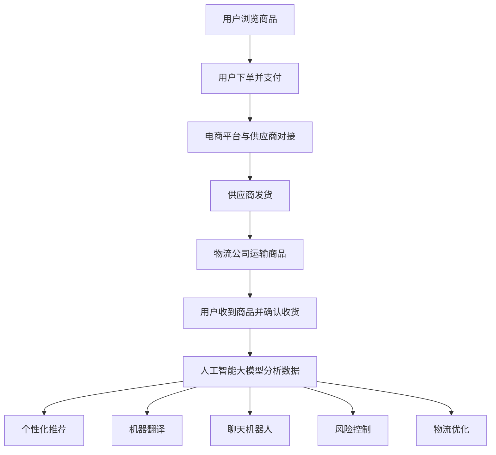

                 

# AI大模型在跨境电商中的应用价值

> 关键词：人工智能，跨境电商，大模型，应用价值，商业模式创新

> 摘要：本文深入探讨了人工智能大模型在跨境电商领域的应用价值。首先，从背景介绍出发，阐述了跨境电商的现状和发展趋势，然后详细分析了人工智能大模型的原理和架构。接着，本文通过核心算法原理、数学模型和项目实战等多个方面，展示了人工智能大模型在跨境电商中的实际应用场景。最后，文章总结了人工智能大模型在跨境电商领域的未来发展趋势与挑战，并推荐了相关学习资源和开发工具。

## 1. 背景介绍

### 1.1 目的和范围

本文旨在探讨人工智能大模型在跨境电商领域的应用价值。随着全球电商市场的迅速扩张，跨境电商已经成为国际贸易的重要驱动力。而人工智能技术的飞速发展，为大模型在跨境电商中的应用提供了广阔的前景。本文将围绕以下几个方面展开讨论：

1. 跨境电商的发展现状和趋势
2. 人工智能大模型的原理和架构
3. 人工智能大模型在跨境电商中的应用场景
4. 未来发展趋势与挑战

### 1.2 预期读者

本文预期读者为从事跨境电商领域的工作者、研究人员以及对该领域感兴趣的读者。本文将从技术角度深入探讨人工智能大模型的应用价值，适合具备一定计算机科学和人工智能基础知识的人群。

### 1.3 文档结构概述

本文结构如下：

1. 背景介绍
   - 1.1 目的和范围
   - 1.2 预期读者
   - 1.3 文档结构概述
   - 1.4 术语表
2. 核心概念与联系
3. 核心算法原理 & 具体操作步骤
4. 数学模型和公式 & 详细讲解 & 举例说明
5. 项目实战：代码实际案例和详细解释说明
6. 实际应用场景
7. 工具和资源推荐
8. 总结：未来发展趋势与挑战
9. 附录：常见问题与解答
10. 扩展阅读 & 参考资料

### 1.4 术语表

#### 1.4.1 核心术语定义

- 跨境电商：跨境电子商务的简称，指通过互联网进行国际贸易活动，包括商品交易、支付、物流等环节。
- 人工智能大模型：指具有大规模参数和复杂结构的机器学习模型，能够处理大规模数据并提取有价值的信息。
- 深度学习：一种人工智能技术，通过多层神经网络对数据进行自动特征提取和学习。
- 自然语言处理（NLP）：一种人工智能技术，用于处理和生成自然语言文本。

#### 1.4.2 相关概念解释

- 数据挖掘：从大量数据中提取有价值信息的过程。
- 机器翻译：将一种语言的文本翻译成另一种语言的技术。
- 聊天机器人：基于人工智能技术的自动对话系统，能够与用户进行自然语言交互。
- 搜索引擎：基于人工智能技术，用于搜索和检索信息的系统。

#### 1.4.3 缩略词列表

- AI：人工智能
- NLP：自然语言处理
- SEO：搜索引擎优化
- CRM：客户关系管理
- ERP：企业资源计划
- SaaS：软件即服务

## 2. 核心概念与联系

在深入探讨人工智能大模型在跨境电商中的应用之前，有必要先了解一些核心概念和它们之间的联系。

### 2.1 跨境电商

跨境电商是指通过互联网进行国际贸易的活动，涉及商品交易、支付、物流等环节。随着互联网的普及和全球电商市场的快速增长，跨境电商已经成为国际贸易的重要驱动力。以下是一个简单的跨境电商流程：

```
用户在跨境电商平台浏览商品 -> 用户下单并支付 -> 电商平台与供应商进行对接 -> 供应商发货 -> 物流公司运输商品 -> 用户收到商品并确认收货
```

### 2.2 人工智能大模型

人工智能大模型是指具有大规模参数和复杂结构的机器学习模型，能够处理大规模数据并提取有价值的信息。以下是一个简单的人工智能大模型结构：

```
输入层 -> 隐藏层1 -> 隐藏层2 -> ... -> 隐藏层n -> 输出层
```

每个隐藏层都包含多个神经元，神经元之间通过权重连接，模型通过学习大量数据来自动调整权重，以实现预测或分类等任务。

### 2.3 人工智能大模型与跨境电商的联系

人工智能大模型在跨境电商中具有广泛的应用前景。以下是几个关键的应用场景：

1. **个性化推荐**：通过分析用户的购物行为和偏好，人工智能大模型可以为用户推荐个性化的商品。
2. **机器翻译**：跨境电商涉及多种语言，人工智能大模型可以用于实时翻译商品描述和用户评论，提高用户购物体验。
3. **聊天机器人**：人工智能大模型可以构建聊天机器人，提供24/7的客户服务，提高用户满意度。
4. **风险控制**：通过分析交易数据，人工智能大模型可以识别潜在欺诈行为，降低交易风险。
5. **物流优化**：人工智能大模型可以优化物流路线，提高物流效率，降低物流成本。

### 2.4 Mermaid 流程图

以下是一个简单的Mermaid流程图，展示了人工智能大模型在跨境电商中的应用流程：



## 3. 核心算法原理 & 具体操作步骤

### 3.1 个性化推荐算法原理

个性化推荐是人工智能大模型在跨境电商中的一个重要应用。其核心思想是根据用户的购物行为和偏好，为用户推荐个性化的商品。

#### 3.1.1 算法原理

个性化推荐算法可以分为基于内容的推荐和基于协同过滤的推荐两种类型。

- **基于内容的推荐**：根据用户的历史购物记录和商品的特征，为用户推荐与其偏好相似的商品。
- **基于协同过滤的推荐**：根据用户之间的相似度和商品之间的相似度，为用户推荐其他用户喜欢且用户尚未购买的商品。

以下是一个简单的基于协同过滤的推荐算法原理：

1. **用户表示**：将用户的历史购物记录转换为向量表示，例如使用TF-IDF算法将文本数据转换为词向量。
2. **商品表示**：将商品的特征转换为向量表示，例如使用词袋模型将商品描述转换为词向量。
3. **计算相似度**：计算用户和商品之间的相似度，可以使用余弦相似度、皮尔逊相关系数等方法。
4. **生成推荐列表**：根据用户和商品之间的相似度，为用户生成个性化的推荐列表。

#### 3.1.2 具体操作步骤

以下是一个简单的基于协同过滤的个性化推荐算法的具体操作步骤：

1. **数据预处理**：将用户的历史购物记录和商品特征进行预处理，例如去除停用词、分词等。
2. **用户表示**：将用户的历史购物记录转换为向量表示，例如使用TF-IDF算法将文本数据转换为词向量。
3. **商品表示**：将商品的特征转换为向量表示，例如使用词袋模型将商品描述转换为词向量。
4. **计算相似度**：计算用户和商品之间的相似度，例如使用余弦相似度计算相似度。
5. **生成推荐列表**：根据用户和商品之间的相似度，为用户生成个性化的推荐列表，可以使用Top-N算法生成推荐列表。

### 3.2 机器翻译算法原理

机器翻译是人工智能大模型在跨境电商中的另一个重要应用。其核心思想是将一种语言的文本翻译成另一种语言的文本。

#### 3.2.1 算法原理

机器翻译算法可以分为基于规则的翻译和基于统计的翻译两种类型。

- **基于规则的翻译**：根据预定义的翻译规则，将一种语言的文本翻译成另一种语言的文本。
- **基于统计的翻译**：通过学习大量的双语文本，将一种语言的文本翻译成另一种语言的文本。

以下是一个简单的基于统计的机器翻译算法原理：

1. **双语文本准备**：收集大量的双语文本，作为训练数据。
2. **词汇表构建**：构建源语言和目标语言的词汇表，将文本数据转换为词汇序列。
3. **翻译模型训练**：使用序列到序列（Sequence-to-Sequence,Seq2Seq）模型，训练源语言到目标语言的翻译模型。
4. **翻译生成**：使用训练好的翻译模型，将源语言的文本序列翻译成目标语言的文本序列。

#### 3.2.2 具体操作步骤

以下是一个简单的基于统计的机器翻译算法的具体操作步骤：

1. **双语文本准备**：收集大量的双语文本，例如使用并行语料库或人工翻译的双语文本。
2. **词汇表构建**：构建源语言和目标语言的词汇表，将文本数据转换为词汇序列。
3. **翻译模型训练**：使用序列到序列（Seq2Seq）模型，训练源语言到目标语言的翻译模型。
4. **翻译生成**：使用训练好的翻译模型，将源语言的文本序列翻译成目标语言的文本序列，例如使用递归神经网络（RNN）或长短期记忆网络（LSTM）。

### 3.3 聊天机器人算法原理

聊天机器人是人工智能大模型在跨境电商中的另一个重要应用。其核心思想是使用自然语言处理技术，与用户进行自然语言交互。

#### 3.3.1 算法原理

聊天机器人算法可以分为基于规则的聊天机器人和基于机器学习的聊天机器人两种类型。

- **基于规则的聊天机器人**：根据预定义的聊天规则，与用户进行交互。
- **基于机器学习的聊天机器人**：通过学习大量的对话数据，自动生成回复。

以下是一个简单的基于机器学习的聊天机器人算法原理：

1. **对话数据收集**：收集大量的对话数据，作为训练数据。
2. **对话表示**：将对话数据转换为向量表示，例如使用词嵌入技术将文本数据转换为向量。
3. **回复生成**：使用循环神经网络（RNN）或变压器（Transformer）模型，训练回复生成模型。
4. **聊天交互**：使用训练好的回复生成模型，与用户进行自然语言交互。

#### 3.3.2 具体操作步骤

以下是一个简单的基于机器学习的聊天机器人算法的具体操作步骤：

1. **对话数据收集**：收集大量的对话数据，例如使用开源的对话数据集。
2. **对话表示**：将对话数据转换为向量表示，例如使用词嵌入技术将文本数据转换为向量。
3. **回复生成**：使用循环神经网络（RNN）或变压器（Transformer）模型，训练回复生成模型。
4. **聊天交互**：使用训练好的回复生成模型，与用户进行自然语言交互。

### 3.4 风险控制算法原理

风险控制是人工智能大模型在跨境电商中的另一个重要应用。其核心思想是使用数据分析和机器学习技术，识别和降低交易风险。

#### 3.4.1 算法原理

风险控制算法可以分为基于规则的风险控制和基于机器学习的风险控制两种类型。

- **基于规则的

