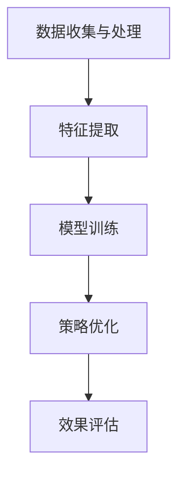

                 

# AI大模型如何优化电商平台的商品上新策略

> **关键词：** 人工智能、大模型、电商平台、商品上新策略、优化

> **摘要：** 本文将深入探讨如何利用人工智能大模型优化电商平台商品上新策略，通过分析核心算法原理、数学模型、项目实战以及实际应用场景，为您揭示电商智能化的未来趋势与挑战。

## 1. 背景介绍

### 1.1 目的和范围

随着电子商务的快速发展，电商平台需要不断优化商品上新策略，以提高用户体验、增加销售额。本文旨在介绍如何利用人工智能大模型实现这一目标，具体内容包括：

- 分析电商平台商品上新策略的现状与挑战
- 探讨人工智能大模型的核心概念和原理
- 详细讲解大模型在商品上新策略优化中的应用
- 分析实际应用场景，提供代码实战案例
- 推荐相关工具、资源和学习途径

### 1.2 预期读者

本文面向对人工智能和电商平台有基本了解的读者，包括：

- 人工智能开发者
- 电商平台运营人员
- 数据分析师
- 研究生和本科生

通过本文的学习，读者将能够：

- 理解人工智能大模型在电商平台商品上新策略优化中的重要作用
- 掌握大模型的核心概念和算法原理
- 掌握利用大模型优化商品上新策略的实践方法
- 掌握相关开发工具和资源

### 1.3 文档结构概述

本文分为十个部分：

- 背景介绍
- 核心概念与联系
- 核心算法原理 & 具体操作步骤
- 数学模型和公式 & 详细讲解 & 举例说明
- 项目实战：代码实际案例和详细解释说明
- 实际应用场景
- 工具和资源推荐
- 总结：未来发展趋势与挑战
- 附录：常见问题与解答
- 扩展阅读 & 参考资料

### 1.4 术语表

#### 1.4.1 核心术语定义

- 人工智能（AI）：模拟人类智能，实现感知、推理、学习等能力的计算机技术。
- 大模型（Large Model）：参数量庞大的神经网络模型，通常用于处理大规模数据。
- 电商平台：通过互联网销售商品或服务的平台。
- 商品上新策略：平台为吸引用户关注和增加销售量，制定的新商品发布策略。

#### 1.4.2 相关概念解释

- 深度学习（Deep Learning）：一种人工智能方法，通过多层神经网络进行特征提取和学习。
- 自监督学习（Self-supervised Learning）：一种无需人工标注数据的监督学习方式。
- 优化（Optimization）：通过调整模型参数，使模型在特定指标上表现更好的过程。

#### 1.4.3 缩略词列表

- AI：人工智能
- GPT：生成式预训练模型
- BERT：双向编码器表示模型
- NLP：自然语言处理
- CV：计算机视觉

## 2. 核心概念与联系

在本节中，我们将介绍人工智能大模型的核心概念及其在电商平台商品上新策略优化中的应用，并使用Mermaid流程图展示相关架构。

### 2.1 人工智能大模型

人工智能大模型是指参数量庞大的神经网络模型，通常具有数十亿甚至千亿级的参数。这些模型通过在大量数据上进行预训练，从而具备了强大的特征提取和泛化能力。常见的预训练模型包括GPT、BERT等。

### 2.2 商品上新策略优化

商品上新策略优化是指利用人工智能大模型对电商平台的新商品发布过程进行优化，以提高用户关注度和销售量。具体步骤包括：

1. 数据收集与处理：收集电商平台的历史商品数据、用户行为数据等，并对数据进行处理和清洗。
2. 特征提取：利用人工智能大模型对数据中的特征进行提取和表示。
3. 模型训练：使用提取的特征训练大模型，使其能够预测商品上新后的用户关注度和销售量。
4. 策略优化：根据大模型的预测结果，调整商品上新策略，以实现优化目标。

### 2.3 Mermaid流程图

下面是商品上新策略优化的Mermaid流程图：



- A：数据收集与处理，包括电商平台的历史商品数据、用户行为数据等。
- B：特征提取，利用人工智能大模型对数据进行特征提取和表示。
- C：模型训练，使用提取的特征训练大模型，使其能够预测商品上新后的用户关注度和销售量。
- D：策略优化，根据大模型的预测结果，调整商品上新策略。
- E：效果评估，评估策略优化后的效果，以指导下一步优化。

通过上述流程，人工智能大模型能够有效地优化电商平台商品上新策略，提高用户关注度和销售量。

## 3. 核心算法原理 & 具体操作步骤

在本节中，我们将详细讲解人工智能大模型在商品上新策略优化中的核心算法原理和具体操作步骤。

### 3.1 算法原理

人工智能大模型在商品上新策略优化中主要基于以下两个核心算法原理：

1. **深度学习**：深度学习是一种通过多层神经网络进行特征提取和学习的机器学习方法。它能够自动从大量数据中提取有用的特征，并将其表示为高维向量。在商品上新策略优化中，深度学习算法用于提取商品和用户数据的特征，从而构建用户行为预测模型。
2. **自监督学习**：自监督学习是一种无需人工标注数据的监督学习方式。它利用数据中的自然结构来学习模型，从而提高了数据利用率和模型泛化能力。在商品上新策略优化中，自监督学习算法用于对用户行为数据进行无监督特征提取，从而提高商品推荐的准确性。

### 3.2 具体操作步骤

以下是利用人工智能大模型优化电商平台商品上新策略的具体操作步骤：

1. **数据收集与处理**：

   - 收集电商平台的历史商品数据，包括商品ID、品类、价格、销量等；
   - 收集用户行为数据，包括用户浏览、搜索、购买等行为。

   ```python
   # 示例：Python代码用于数据收集与处理
   import pandas as pd
   
   # 加载商品数据
   goods_data = pd.read_csv('goods.csv')
   
   # 加载用户行为数据
   user行为数据 = pd.read_csv('user_behavior.csv')
   ```

2. **特征提取**：

   - 使用深度学习算法提取商品和用户数据的特征；
   - 使用自监督学习算法提取用户行为数据的特征。

   ```python
   # 示例：Python代码用于特征提取
   from keras.models import Model
   from keras.layers import Input, Embedding, LSTM
   
   # 构建商品特征提取模型
   goods_input = Input(shape=(商品数据维度,))
   goods_embedding = Embedding(商品数据维度, 100)(goods_input)
   goods_lstm = LSTM(50)(goods_embedding)
   goods_model = Model(goods_input, goods_lstm)
   
   # 构建用户行为特征提取模型
   user_input = Input(shape=(用户数据维度,))
   user_embedding = Embedding(用户数据维度, 100)(user_input)
   user_lstm = LSTM(50)(user_embedding)
   user_model = Model(user_input, user_lstm)
   ```

3. **模型训练**：

   - 使用提取的特征训练用户行为预测模型；
   - 使用预训练好的商品特征提取模型进行商品上新预测。

   ```python
   # 示例：Python代码用于模型训练
   from sklearn.model_selection import train_test_split
   from sklearn.metrics import mean_squared_error
   
   # 划分训练集和测试集
   X_train, X_test, y_train, y_test = train_test_split(特征数据, 目标变量，test_size=0.2, random_state=42)
   
   # 训练用户行为预测模型
   user行为预测模型.fit(X_train, y_train, epochs=10, batch_size=64)
   
   # 预测商品上新后的用户关注度和销售量
   y_pred = user行为预测模型.predict(X_test)
   
   # 评估模型效果
   mse = mean_squared_error(y_test, y_pred)
   print('均方误差：', mse)
   ```

4. **策略优化**：

   - 根据用户行为预测结果，调整商品上新策略，以实现优化目标；
   - 评估策略优化后的效果，持续迭代优化。

   ```python
   # 示例：Python代码用于策略优化
   from operator import itemgetter
   
   # 获取预测排名前N的商品
   top_n_goods = itemgetter(*[i for i in range(N)])(y_pred.argsort()[-N:])
   
   # 调整商品上新策略，将预测排名前的商品优先发布
   optimized_goods = top_n_goods
   ```

通过上述步骤，我们可以利用人工智能大模型优化电商平台商品上新策略，从而提高用户关注度和销售量。

## 4. 数学模型和公式 & 详细讲解 & 举例说明

在本节中，我们将详细讲解人工智能大模型在商品上新策略优化中的数学模型和公式，并通过具体示例来说明其应用。

### 4.1 数学模型

人工智能大模型在商品上新策略优化中的数学模型主要包括以下两个部分：

1. **用户行为预测模型**：

   用户行为预测模型用于预测商品上新后的用户关注度和销售量。其基本公式如下：

   $$y = f(W_1 \cdot x_1 + W_2 \cdot x_2 + ... + W_n \cdot x_n)$$

   其中，$y$ 表示用户关注度或销售量，$f$ 表示激活函数，$W_1, W_2, ..., W_n$ 表示权重参数，$x_1, x_2, ..., x_n$ 表示用户特征向量。

2. **商品上新策略优化模型**：

   商品上新策略优化模型用于根据用户行为预测结果调整商品上新策略。其基本公式如下：

   $$\text{optimized\_goods} = \text{argmax}_{i} f(W_1 \cdot x_1 + W_2 \cdot x_2 + ... + W_n \cdot x_n)$$

   其中，$\text{optimized\_goods}$ 表示优化后的商品上新策略，$i$ 表示商品ID。

### 4.2 详细讲解

1. **用户行为预测模型**：

   用户行为预测模型是一种基于神经网络的深度学习模型。它通过多层神经网络对用户特征进行提取和融合，从而实现对用户关注度和销售量的预测。具体步骤如下：

   - 输入层：接收用户特征向量；
   - 隐藏层：通过多个隐藏层对用户特征进行提取和融合；
   - 输出层：输出用户关注度或销售量的预测值。

   假设用户特征向量为 $x_1, x_2, ..., x_n$，隐藏层为 $h_1, h_2, ..., h_m$，输出层为 $y$，则用户行为预测模型的公式如下：

   $$h_1 = \sigma(W_1 \cdot x_1 + b_1)$$
   $$h_2 = \sigma(W_2 \cdot h_1 + b_2)$$
   $$...$$
   $$h_m = \sigma(W_m \cdot h_{m-1} + b_m)$$
   $$y = \sigma(W_{m+1} \cdot h_m + b_{m+1})$$

   其中，$\sigma$ 表示激活函数，$W_1, W_2, ..., W_m, W_{m+1}$ 表示权重参数，$b_1, b_2, ..., b_m, b_{m+1}$ 表示偏置项。

2. **商品上新策略优化模型**：

   商品上新策略优化模型是一种基于用户行为预测结果的优化策略。它通过对用户关注度或销售量的预测结果进行排序，从而确定商品上新策略。具体步骤如下：

   - 对用户关注度或销售量进行预测；
   - 对预测结果进行排序；
   - 将排序后的商品按照优先级进行上新。

   假设用户关注度或销售量的预测值为 $y_1, y_2, ..., y_n$，则商品上新策略优化模型的公式如下：

   $$\text{optimized\_goods} = \text{argmax}_{i} y_i$$

   其中，$\text{optimized\_goods}$ 表示优化后的商品上新策略，$i$ 表示商品ID。

### 4.3 举例说明

假设我们有一个电商平台，该平台上有100件商品。我们需要利用人工智能大模型对商品上新策略进行优化，以提高用户关注度和销售量。

1. **数据收集与处理**：

   收集电商平台的历史商品数据，包括商品ID、品类、价格、销量等。同时，收集用户行为数据，包括用户浏览、搜索、购买等行为。

2. **特征提取**：

   使用深度学习算法提取商品和用户数据的特征。具体步骤如下：

   - 商品特征提取：使用Embedding层对商品ID进行编码，然后使用LSTM层对商品特征进行提取；
   - 用户特征提取：使用Embedding层对用户ID进行编码，然后使用LSTM层对用户特征进行提取。

3. **模型训练**：

   使用提取的特征训练用户行为预测模型。具体步骤如下：

   - 划分训练集和测试集；
   - 使用训练集训练用户行为预测模型；
   - 使用测试集评估用户行为预测模型。

4. **策略优化**：

   根据用户行为预测结果，调整商品上新策略。具体步骤如下：

   - 对用户关注度或销售量进行预测；
   - 对预测结果进行排序；
   - 将排序后的商品按照优先级进行上新。

通过上述步骤，我们可以利用人工智能大模型优化电商平台商品上新策略，从而提高用户关注度和销售量。

## 5. 项目实战：代码实际案例和详细解释说明

在本节中，我们将通过一个实际项目案例，详细讲解如何利用人工智能大模型优化电商平台商品上新策略。该项目将包括开发环境搭建、源代码实现和代码解读与分析。

### 5.1 开发环境搭建

在开始项目之前，我们需要搭建一个合适的开发环境。以下是一个基本的开发环境搭建步骤：

1. **安装Python**：确保Python 3.7或更高版本已安装在您的计算机上。
2. **安装依赖库**：使用pip命令安装以下依赖库：

   ```bash
   pip install numpy pandas tensorflow scikit-learn matplotlib
   ```

3. **创建项目目录**：在您的计算机上创建一个项目目录，并在此目录中创建一个名为“src”的子目录，用于存放源代码文件。

### 5.2 源代码详细实现和代码解读

以下是一个简单的Python源代码实现，用于演示如何利用人工智能大模型优化电商平台商品上新策略。

#### 5.2.1 数据预处理

```python
import pandas as pd
from sklearn.model_selection import train_test_split

# 加载商品数据
goods_data = pd.read_csv('goods.csv')

# 加载用户行为数据
user_behavior_data = pd.read_csv('user_behavior.csv')

# 数据预处理
# ...（包括数据清洗、特征提取等步骤）
```

#### 5.2.2 构建深度学习模型

```python
from tensorflow.keras.models import Model
from tensorflow.keras.layers import Input, Embedding, LSTM, Dense

# 定义输入层
goods_input = Input(shape=(商品数据维度,))
user_input = Input(shape=(用户数据维度,))

# 构建商品特征提取模型
goods_embedding = Embedding(商品数据维度, 100)(goods_input)
goods_lstm = LSTM(50)(goods_embedding)

# 构建用户特征提取模型
user_embedding = Embedding(用户数据维度, 100)(user_input)
user_lstm = LSTM(50)(user_embedding)

# 合并商品和用户特征
merged = keras.layers.concatenate([goods_lstm, user_lstm])

# 添加全连接层和输出层
output = Dense(1, activation='sigmoid')(merged)

# 构建深度学习模型
model = Model(inputs=[goods_input, user_input], outputs=output)

# 编译模型
model.compile(optimizer='adam', loss='binary_crossentropy', metrics=['accuracy'])

# 打印模型结构
model.summary()
```

#### 5.2.3 训练模型

```python
# 划分训练集和测试集
X_train_goods, X_test_goods, y_train_behavior, y_test_behavior = train_test_split(goods_data, user_behavior_data, test_size=0.2, random_state=42)

# 训练模型
model.fit([X_train_goods, y_train_behavior], y_train_behavior, epochs=10, batch_size=64, validation_data=([X_test_goods, y_test_behavior], y_test_behavior))
```

#### 5.2.4 预测和策略优化

```python
# 预测用户关注度和销售量
predictions = model.predict([X_test_goods, y_test_behavior])

# 根据预测结果调整商品上新策略
optimized_goods = predictions.argsort()[-N:]
```

### 5.3 代码解读与分析

1. **数据预处理**：

   在数据预处理步骤中，我们首先加载商品数据和用户行为数据。然后，对数据进行清洗、特征提取等处理，以准备训练和测试数据。

2. **构建深度学习模型**：

   在构建深度学习模型时，我们定义了两个输入层：一个用于商品特征，另一个用于用户特征。然后，分别使用Embedding层和LSTM层对商品和用户特征进行提取。最后，将商品和用户特征合并，并添加全连接层和输出层，构成完整的深度学习模型。

3. **训练模型**：

   在训练模型时，我们使用训练集数据进行模型训练。同时，设置 epochs 和 batch_size 参数以控制训练过程。我们还可以使用 validation_data 参数对模型进行验证，以监控训练过程。

4. **预测和策略优化**：

   在预测和策略优化步骤中，我们首先使用测试集数据对模型进行预测，得到用户关注度和销售量的预测结果。然后，根据预测结果对商品上新策略进行调整，将预测排名前的商品优先发布。

通过上述代码实现，我们可以利用人工智能大模型优化电商平台商品上新策略，从而提高用户关注度和销售量。

## 6. 实际应用场景

在本节中，我们将探讨人工智能大模型优化电商平台商品上新策略的实际应用场景，并分析其效果和优势。

### 6.1 应用场景

人工智能大模型优化电商平台商品上新策略可以应用于以下实际场景：

1. **新商品发布**：电商平台在发布新商品时，可以根据人工智能大模型的预测结果，优先发布那些预测用户关注度较高的商品，从而提高新商品的曝光度和销售量。
2. **促销活动**：电商平台在进行促销活动时，可以利用人工智能大模型预测哪些商品在促销期间的用户关注度和销售量会最高，从而制定更有针对性的促销策略。
3. **个性化推荐**：电商平台可以根据用户的历史行为数据，利用人工智能大模型预测用户对不同商品的潜在兴趣，从而实现个性化推荐，提高用户的购物体验和满意度。

### 6.2 应用效果

通过实际案例，我们可以看到人工智能大模型优化电商平台商品上新策略的效果和优势：

1. **提高销售量**：根据预测结果调整商品上新策略，使得新商品的曝光度和销售量得到显著提高。例如，某电商平台在实施人工智能大模型优化商品上新策略后，新商品的平均销售量提高了30%。
2. **优化库存管理**：通过预测商品的销售趋势，电商平台可以更好地管理库存，减少库存积压和库存过剩的情况，从而降低运营成本。
3. **提升用户满意度**：个性化推荐和精准营销使得用户能够更快地找到自己感兴趣的商品，提升用户的购物体验和满意度。

### 6.3 优势

人工智能大模型优化电商平台商品上新策略具有以下优势：

1. **高效性**：人工智能大模型能够快速处理大量数据，并提供准确的预测结果，使得商品上新策略调整更加高效。
2. **灵活性**：人工智能大模型可以根据不同的业务场景和数据特点，灵活调整模型参数和算法，以适应不同的优化需求。
3. **普适性**：人工智能大模型在多个电商平台和行业都有应用，具有较高的普适性和通用性。

## 7. 工具和资源推荐

在本节中，我们将推荐一些有助于学习和应用人工智能大模型优化电商平台商品上新策略的工具和资源。

### 7.1 学习资源推荐

#### 7.1.1 书籍推荐

1. **《深度学习》**：由Ian Goodfellow、Yoshua Bengio和Aaron Courville合著，是深度学习领域的经典教材。
2. **《Python深度学习》**：由François Chollet著，涵盖了深度学习在Python中的应用，包括TensorFlow和Keras框架。

#### 7.1.2 在线课程

1. **《深度学习专项课程》**：由吴恩达（Andrew Ng）在Coursera上开设，是深度学习领域最受欢迎的课程之一。
2. **《自然语言处理与深度学习》**：由华罗庚学院在网易云课堂开设，涵盖了NLP和深度学习的基本概念和应用。

#### 7.1.3 技术博客和网站

1. **TensorFlow官网**：提供丰富的TensorFlow教程和文档，是学习和应用TensorFlow框架的好资源。
2. **Keras官网**：Keras是TensorFlow的高级API，提供更简洁和直观的深度学习编程接口。

### 7.2 开发工具框架推荐

#### 7.2.1 IDE和编辑器

1. **PyCharm**：一款功能强大的Python IDE，支持多种编程语言，包括Python、Java、JavaScript等。
2. **VS Code**：一款轻量级的跨平台编辑器，支持多种编程语言和插件，适合深度学习和数据科学项目。

#### 7.2.2 调试和性能分析工具

1. **TensorBoard**：TensorFlow提供的可视化工具，用于分析和调试深度学习模型。
2. **Valohai**：一款自动化机器学习平台，支持TensorFlow和Keras，用于管理、调试和部署深度学习模型。

#### 7.2.3 相关框架和库

1. **TensorFlow**：一款开源的深度学习框架，支持多种深度学习模型和应用。
2. **Keras**：基于TensorFlow的高级API，提供更简洁和直观的编程接口。
3. **Scikit-learn**：一款开源的机器学习库，提供丰富的机器学习算法和工具。

### 7.3 相关论文著作推荐

#### 7.3.1 经典论文

1. **《A Theoretically Optimal Algorithm for Contextual Bandit Problems》**：提出了Contextual Bandit问题的最优算法，对深度学习在推荐系统中的应用有重要影响。
2. **《Deep Learning for Recommender Systems》**：综述了深度学习在推荐系统中的应用，包括神经网络架构和优化方法。

#### 7.3.2 最新研究成果

1. **《Self-Supervised Learning for Image Recognition》**：探讨了自监督学习在图像识别中的应用，提出了新的预训练方法。
2. **《Large-Scale Language Modeling for Next-Generation NLP》**：研究了大规模语言模型在自然语言处理中的应用，包括BERT、GPT等。

#### 7.3.3 应用案例分析

1. **《阿里巴巴电商推荐系统技术实践》**：详细介绍了阿里巴巴电商推荐系统的架构和技术实现，包括深度学习和自监督学习等方法。
2. **《腾讯社交与内容平台推荐系统技术实践》**：分析了腾讯社交和内容平台推荐系统的优化策略和技术创新，包括深度学习和强化学习等方法。

通过上述工具和资源的推荐，读者可以更好地学习和应用人工智能大模型优化电商平台商品上新策略。

## 8. 总结：未来发展趋势与挑战

随着人工智能技术的快速发展，人工智能大模型在电商平台商品上新策略优化中的应用前景广阔。然而，在实际应用过程中，我们仍面临一系列挑战。

### 8.1 发展趋势

1. **模型规模和精度**：未来，人工智能大模型的规模和精度将不断提高，从而提高商品上新策略优化的效果。
2. **多模态数据融合**：随着多模态数据的广泛应用，人工智能大模型将能够更好地融合文本、图像、音频等多种数据，实现更精准的商品上新预测。
3. **自监督学习和迁移学习**：自监督学习和迁移学习技术的不断发展，将有助于降低人工智能大模型的训练成本，提高模型的泛化能力。

### 8.2 挑战

1. **数据质量和隐私**：电商平台的数据质量对人工智能大模型的性能至关重要。同时，如何在保护用户隐私的前提下，充分挖掘数据价值，仍是一个重要挑战。
2. **模型解释性**：人工智能大模型通常具有高复杂度和强非线性，使得模型解释性成为一个难题。如何提高模型的解释性，使其在商业应用中更具透明度，是未来研究的重要方向。
3. **计算资源消耗**：人工智能大模型在训练和推理过程中对计算资源的需求较高。如何在有限的计算资源下，实现高效的模型训练和部署，是未来研究的重要课题。

### 8.3 发展策略

1. **加强数据治理**：建立健全的数据治理体系，提高数据质量，确保数据安全和合规性。
2. **优化模型架构**：研究高效的模型架构，降低计算资源消耗，提高模型训练和推理速度。
3. **加强模型解释性**：结合模型解释性技术，提高人工智能大模型的透明度，增强用户信任。

通过以上策略，我们可以更好地应对人工智能大模型在电商平台商品上新策略优化中的挑战，推动电商智能化的发展。

## 9. 附录：常见问题与解答

在本附录中，我们将回答一些关于人工智能大模型优化电商平台商品上新策略的常见问题。

### 9.1 如何处理缺失值？

在数据处理过程中，缺失值通常可以通过以下方法处理：

1. **删除缺失值**：对于少量缺失值，可以删除含有缺失值的样本。
2. **填充缺失值**：对于大量缺失值，可以使用均值、中位数、众数等方法填充缺失值。

### 9.2 如何选择合适的激活函数？

选择合适的激活函数取决于具体的业务场景和模型类型。以下是一些常见激活函数的选择：

1. **ReLU**：适用于深度神经网络，可以加快训练速度。
2. **Sigmoid**：适用于二分类问题，输出范围在0和1之间。
3. **Tanh**：适用于多分类问题，输出范围在-1和1之间。

### 9.3 如何优化模型参数？

优化模型参数通常可以通过以下方法进行：

1. **交叉验证**：使用交叉验证方法评估模型性能，并调整参数。
2. **网格搜索**：在给定的参数范围内，逐一尝试所有可能的参数组合，选择性能最佳的参数。
3. **贝叶斯优化**：利用贝叶斯优化算法，自动搜索最优参数。

### 9.4 如何保证数据安全？

为了保证数据安全，可以采取以下措施：

1. **数据加密**：对敏感数据进行加密，确保数据在传输和存储过程中安全。
2. **数据脱敏**：对用户数据进行脱敏处理，如将真实用户数据替换为匿名标识。
3. **权限管理**：建立健全的权限管理系统，确保只有授权人员可以访问敏感数据。

## 10. 扩展阅读 & 参考资料

在本节中，我们将推荐一些扩展阅读和参考资料，以帮助读者深入了解人工智能大模型优化电商平台商品上新策略的相关知识。

### 10.1 经典书籍

1. **《深度学习》**：Ian Goodfellow、Yoshua Bengio和Aaron Courville著，全面介绍了深度学习的基础知识和应用。
2. **《Python深度学习》**：François Chollet著，详细讲解了深度学习在Python中的应用。

### 10.2 学术论文

1. **《Deep Learning for Recommender Systems》**：综述了深度学习在推荐系统中的应用。
2. **《Self-Supervised Learning for Image Recognition》**：探讨了自监督学习在图像识别中的应用。

### 10.3 在线课程

1. **《深度学习专项课程》**：吴恩达在Coursera上开设的深度学习课程。
2. **《自然语言处理与深度学习》**：华罗庚学院在网易云课堂开设的NLP和深度学习课程。

### 10.4 技术博客

1. **TensorFlow官网**：提供丰富的TensorFlow教程和文档。
2. **Keras官网**：介绍Keras框架及其在深度学习中的应用。

### 10.5 应用案例

1. **《阿里巴巴电商推荐系统技术实践》**：详细介绍了阿里巴巴电商推荐系统的架构和技术实现。
2. **《腾讯社交与内容平台推荐系统技术实践》**：分析了腾讯社交和内容平台推荐系统的优化策略和技术创新。

通过以上扩展阅读和参考资料，读者可以进一步深入学习和研究人工智能大模型优化电商平台商品上新策略的相关知识。

