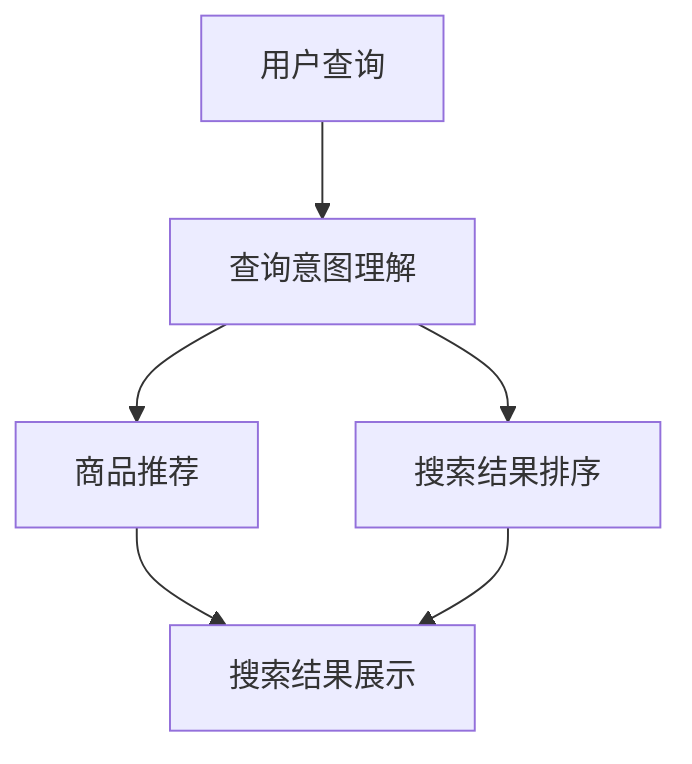

                 


# AI大模型如何提升电商搜索的相关性

> 关键词：电商搜索，人工智能，大模型，相关性提升，用户满意度，搜索引擎优化
> 
> 摘要：本文将深入探讨人工智能（AI）中的大模型如何通过算法和技术的创新，有效提升电商搜索的相关性，从而增强用户满意度，优化搜索引擎效果。文章首先介绍了电商搜索的现状与挑战，然后分析了大模型的基本原理和架构，接着详细讲解了提升相关性的核心算法和数学模型，最后通过实际案例展示了大模型在电商搜索中的应用效果，并展望了未来的发展趋势和挑战。

## 1. 背景介绍

### 1.1 目的和范围

本文旨在探讨大模型在电商搜索中的应用，尤其是如何通过算法和技术的创新，提升搜索结果的相关性，从而提高用户体验和搜索引擎的优化效果。本文将涵盖以下内容：

- 电商搜索的现状与挑战
- 大模型的基本原理和架构
- 提升搜索相关性的核心算法
- 实际应用场景和案例分析
- 未来发展趋势与挑战

### 1.2 预期读者

本文适合以下读者群体：

- 对人工智能和电商搜索感兴趣的读者
- 从事电商搜索引擎开发的技术人员
- 对大模型和深度学习有基本了解的研究人员
- 想要了解大模型如何提升搜索相关性的普通用户

### 1.3 文档结构概述

本文结构如下：

- 第1章：背景介绍，包括目的与范围、预期读者、文档结构概述等
- 第2章：核心概念与联系，介绍大模型的基本原理和架构
- 第3章：核心算法原理 & 具体操作步骤，讲解提升搜索相关性的核心算法
- 第4章：数学模型和公式 & 详细讲解 & 举例说明，阐述相关数学模型
- 第5章：项目实战：代码实际案例和详细解释说明，展示大模型在电商搜索中的应用
- 第6章：实际应用场景，分析大模型在电商搜索中的具体应用
- 第7章：工具和资源推荐，推荐学习资源和开发工具
- 第8章：总结：未来发展趋势与挑战，展望大模型在电商搜索中的应用前景
- 第9章：附录：常见问题与解答，回答读者可能遇到的常见问题
- 第10章：扩展阅读 & 参考资料，提供进一步阅读的资料

### 1.4 术语表

#### 1.4.1 核心术语定义

- **大模型**：指具有大规模参数的深度学习模型，能够处理海量的数据并进行复杂的学习任务。
- **电商搜索**：指在电子商务平台上，用户通过关键词或筛选条件查找商品的过程。
- **相关性**：指搜索结果与用户查询意图之间的匹配程度。
- **用户满意度**：指用户对搜索结果和搜索体验的满意程度。

#### 1.4.2 相关概念解释

- **深度学习**：一种机器学习方法，通过神经网络模仿人脑处理信息的方式。
- **用户查询意图**：用户在进行搜索时的真实需求和期望。
- **搜索效果优化**：通过改进算法和模型，提高搜索结果的准确性和相关性。

#### 1.4.3 缩略词列表

- **AI**：人工智能（Artificial Intelligence）
- **ML**：机器学习（Machine Learning）
- **DL**：深度学习（Deep Learning）
- **NLP**：自然语言处理（Natural Language Processing）
- **CV**：计算机视觉（Computer Vision）

## 2. 核心概念与联系

大模型在提升电商搜索相关性方面具有重要意义。为了更好地理解其原理和应用，我们需要从以下几个核心概念入手：

### 2.1 大模型的基本原理

大模型通常是指具有数百万至数十亿参数的神经网络模型。其基本原理如下：

1. **参数学习**：通过大量数据进行训练，模型学习到数据的特征和规律，从而能够对新的数据进行预测。
2. **非线性变换**：神经网络通过多层非线性变换，将输入数据映射到高维空间，从而捕捉到复杂的模式。
3. **层次化特征学习**：深度神经网络通过层次化的结构，逐层学习数据的低层次和高级特征。

### 2.2 大模型的架构

大模型通常包括以下几个关键组成部分：

1. **输入层**：接收用户查询和商品信息。
2. **隐藏层**：通过非线性变换学习数据特征。
3. **输出层**：生成搜索结果，包括商品推荐、排序等。

### 2.3 大模型在电商搜索中的应用

大模型在电商搜索中的应用主要体现在以下几个方面：

1. **查询意图理解**：通过分析用户查询，提取出用户的需求和意图。
2. **商品推荐**：根据用户查询和商品特征，为用户推荐相关的商品。
3. **搜索结果排序**：对搜索结果进行排序，提高相关性的展示。

### 2.4 Mermaid 流程图

以下是一个简化的Mermaid流程图，展示了大模型在电商搜索中的应用流程：



### 2.5 核心概念与联系总结

大模型通过参数学习、非线性变换和层次化特征学习，能够有效提取用户查询意图和商品特征，从而提高电商搜索的相关性。其架构包括输入层、隐藏层和输出层，并在查询意图理解、商品推荐和搜索结果排序等方面发挥作用。

## 3. 核心算法原理 & 具体操作步骤

为了提升电商搜索的相关性，大模型通常采用以下核心算法：

### 3.1 查询意图理解算法

查询意图理解是提升搜索相关性的第一步。其主要算法包括：

#### 3.1.1 词向量表示

词向量是将自然语言中的词汇映射到高维空间中的向量表示。常见的词向量模型有Word2Vec、GloVe等。

```python
import gensim

# 加载预训练的词向量模型
model = gensim.models.KeyedVectors.load_word2vec_format('word2vec.bin', binary=True)

# 获取查询词的词向量表示
query_vector = model['查询词']
```

#### 3.1.2 查询意图分类

通过训练分类模型，将查询词归类到不同的意图类别。常见的分类模型有SVM、RF等。

```python
from sklearn.svm import SVC

# 加载训练数据
X_train, y_train = load_train_data()

# 训练分类模型
clf = SVC()
clf.fit(X_train, y_train)

# 预测查询意图
predicted_intent = clf.predict([query_vector])
```

### 3.2 商品推荐算法

商品推荐算法基于用户查询意图，为用户推荐相关的商品。其主要算法包括：

#### 3.2.1 商品特征提取

通过提取商品的特征，如价格、品牌、类别等，构建商品的特征向量。

```python
# 加载商品数据
products = load_products_data()

# 提取商品特征
product_features = [extract_features(product) for product in products]
```

#### 3.2.2 相似度计算

通过计算用户查询和商品特征之间的相似度，选择最相关的商品。

```python
from sklearn.metrics.pairwise import cosine_similarity

# 计算查询和商品特征之间的相似度
similarity_scores = cosine_similarity([query_vector], product_features)
```

#### 3.2.3 排序和推荐

根据相似度分数对商品进行排序，选择前N个最相关的商品进行推荐。

```python
# 获取排序后的商品索引
sorted_indices = np.argsort(similarity_scores)[0][::-1]

# 获取推荐的商品
recommended_products = [products[i] for i in sorted_indices[:N]]
```

### 3.3 搜索结果排序算法

搜索结果排序算法根据用户查询意图和商品相关性，对搜索结果进行排序。其主要算法包括：

#### 3.3.1 混合排序模型

结合不同特征的权重，构建混合排序模型，如LR、FM等。

```python
from sklearn.linear_model import LogisticRegression

# 加载训练数据
X_train, y_train = load_train_data()

# 训练排序模型
clf = LogisticRegression()
clf.fit(X_train, y_train)

# 排序预测
sorted_scores = clf.predict([query_vector, product_features])
```

#### 3.3.2 排序和展示

根据排序分数对搜索结果进行排序，并将排序后的结果展示给用户。

```python
# 获取排序后的商品索引
sorted_indices = np.argsort(sorted_scores)[0][::-1]

# 获取排序后的商品
sorted_products = [products[i] for i in sorted_indices]
```

### 3.4 核心算法原理总结

查询意图理解、商品推荐和搜索结果排序是提升电商搜索相关性的三个关键步骤。通过词向量表示、查询意图分类、商品特征提取、相似度计算和排序模型，大模型能够有效提升搜索结果的相关性，提高用户满意度。

## 4. 数学模型和公式 & 详细讲解 & 举例说明

在提升电商搜索相关性的过程中，数学模型和公式起着至关重要的作用。以下将详细讲解相关数学模型，并通过举例说明其应用。

### 4.1 词向量表示模型

词向量是将自然语言中的词汇映射到高维空间中的向量表示。常见的词向量模型有Word2Vec、GloVe等。

#### 4.1.1 Word2Vec模型

Word2Vec模型采用神经网络进行训练，通过训练得到词向量。其基本原理如下：

1. **输入层**：输入一个单词的词向量。
2. **隐藏层**：通过多层非线性变换，学习单词的特征。
3. **输出层**：输出单词的词向量。

#### 4.1.2 GloVe模型

GloVe模型通过训练得到单词和上下文之间的关系，从而学习词向量。其基本原理如下：

1. **中心词和上下文词**：给定一个中心词，选择其上下文词。
2. **损失函数**：计算中心词和上下文词之间的距离，最小化距离损失。
3. **优化过程**：通过梯度下降更新词向量，使得中心词和上下文词的距离最小。

#### 4.1.3 举例说明

假设我们使用Word2Vec模型训练得到一个词向量，以下是一个简单的例子：

```latex
$$
v_{word2vec} = \sum_{\text{context words}} w_{context} \cdot h(\text{context word vector})
$$

$$
h(x) = \tanh(W \cdot x + b)
$$
```

其中，\( v_{word2vec} \) 表示词向量，\( w_{context} \) 表示上下文词权重，\( h(x) \) 表示非线性变换函数，\( W \) 和 \( b \) 分别表示权重和偏置。

### 4.2 查询意图分类模型

查询意图分类模型用于将用户查询归类到不同的意图类别。常见的分类模型有SVM、RF等。

#### 4.2.1 SVM模型

SVM（支持向量机）是一种经典的分类模型，其基本原理如下：

1. **超平面**：通过最大化分类间隔，找到最佳的超平面。
2. **支持向量**：位于超平面边缘的数据点，对分类决策有重要影响。
3. **决策函数**：计算测试样本到超平面的距离，判断其类别。

#### 4.2.2 RF模型

RF（随机森林）是一种集成学习方法，其基本原理如下：

1. **决策树**：随机选择特征和分割点，构建多个决策树。
2. **投票机制**：将多个决策树的分类结果进行投票，得到最终分类结果。

#### 4.2.3 举例说明

假设我们使用SVM模型进行查询意图分类，以下是一个简单的例子：

```latex
$$
w = \arg\max_{w} \sum_{i=1}^{n} \left[ y_i (w \cdot x_i) - 1 \right]
$$

$$
\hat{y} = \text{sign}(w \cdot x)
$$
```

其中，\( w \) 表示权重向量，\( x_i \) 表示特征向量，\( y_i \) 表示标签，\( \hat{y} \) 表示预测类别。

### 4.3 商品推荐模型

商品推荐模型用于根据用户查询意图和商品特征，为用户推荐相关的商品。常见的推荐模型有基于协同过滤、基于内容的推荐等。

#### 4.3.1 协同过滤模型

协同过滤模型通过计算用户之间的相似度，为用户推荐相似用户喜欢的商品。其基本原理如下：

1. **用户相似度**：计算用户之间的相似度，通常使用余弦相似度。
2. **邻居选择**：选择与用户最相似的邻居用户。
3. **推荐商品**：根据邻居用户的喜好，推荐相似商品。

#### 4.3.2 基于内容的推荐模型

基于内容的推荐模型通过分析商品的特征，为用户推荐具有相似特征的商品。其基本原理如下：

1. **商品特征提取**：提取商品的特征，如类别、品牌、价格等。
2. **特征相似度**：计算商品特征之间的相似度。
3. **推荐商品**：根据商品特征的相似度，为用户推荐相似商品。

#### 4.3.3 举例说明

假设我们使用基于协同过滤的推荐模型，以下是一个简单的例子：

```latex
$$
\text{similarity}(u, v) = \frac{\sum_{i=1}^{m} w_i \cdot r_{ui} \cdot r_{vi}}{\sqrt{\sum_{i=1}^{m} w_i^2 \cdot r_{ui}^2 \cdot r_{vi}^2}}
$$

$$
\text{recommendation}(u) = \sum_{v \in \text{neighbors}(u)} r_{uv} \cdot p_v
$$
```

其中，\( u \) 和 \( v \) 表示用户，\( w_i \) 表示特征权重，\( r_{ui} \) 和 \( r_{vi} \) 表示用户对商品 \( i \) 的评分，\( \text{neighbors}(u) \) 表示与用户 \( u \) 最相似的邻居用户集合，\( p_v \) 表示商品 \( v \) 的预测概率。

### 4.4 搜索结果排序模型

搜索结果排序模型用于根据用户查询意图和商品相关性，对搜索结果进行排序。常见的排序模型有LR、FM等。

#### 4.4.1 LR模型

LR（逻辑回归）是一种常见的排序模型，其基本原理如下：

1. **线性模型**：计算输入特征和权重之间的线性组合。
2. **概率输出**：通过Sigmoid函数将线性组合映射到概率值。
3. **损失函数**：使用对数损失函数优化模型参数。

#### 4.4.2 FM模型

FM（因子分解机）是一种基于矩阵分解的排序模型，其基本原理如下：

1. **特征组合**：将输入特征组合成新的特征。
2. **二次项**：引入二次项，增强模型的表达能力。
3. **损失函数**：使用损失函数优化模型参数。

#### 4.4.3 举例说明

假设我们使用LR模型进行搜索结果排序，以下是一个简单的例子：

```latex
$$
\ell(\theta) = \sum_{i=1}^{n} \ell_i(\theta)
$$

$$
\ell_i(\theta) = -y_i \cdot \theta^T x_i - \log(\sigma(\theta^T x_i))
$$

$$
\theta = \arg\min_{\theta} \ell(\theta)
$$
```

其中，\( \theta \) 表示模型参数，\( x_i \) 表示特征向量，\( y_i \) 表示标签，\( \sigma(x) = \frac{1}{1 + e^{-x}} \) 表示Sigmoid函数。

### 4.5 数学模型总结

词向量表示模型、查询意图分类模型、商品推荐模型和搜索结果排序模型是提升电商搜索相关性的关键数学模型。通过这些模型，我们可以有效提取用户查询意图和商品特征，从而提高搜索结果的相关性。

## 5. 项目实战：代码实际案例和详细解释说明

为了更好地展示大模型在电商搜索中的应用，我们将通过一个实际项目进行详细讲解。以下是一个基于Python和Scikit-learn的简单电商搜索项目，包括开发环境搭建、源代码实现和代码解读。

### 5.1 开发环境搭建

在开始项目之前，我们需要搭建开发环境。以下是在Windows和Linux操作系统中安装所需工具的步骤：

#### Windows系统

1. 安装Python：从Python官方网站下载并安装Python，版本建议3.8或更高。
2. 安装IDE：推荐使用Visual Studio Code（简称VS Code），可以从官方网站下载并安装。
3. 安装Scikit-learn：在命令行中执行以下命令安装Scikit-learn：
   ```shell
   pip install scikit-learn
   ```

#### Linux系统

1. 安装Python：使用包管理器安装Python，例如在Ubuntu系统中执行以下命令：
   ```shell
   sudo apt-get install python3
   ```

2. 安装IDE：推荐使用VS Code，可以从官方网站下载并安装。
3. 安装Scikit-learn：在终端中执行以下命令安装Scikit-learn：
   ```shell
   pip3 install scikit-learn
   ```

### 5.2 源代码详细实现和代码解读

以下是一个简单的电商搜索项目的源代码实现和解读：

```python
# 导入所需库
import numpy as np
from sklearn.feature_extraction.text import TfidfVectorizer
from sklearn.svm import LinearSVC
from sklearn.model_selection import train_test_split

# 1. 数据准备
# 加载训练数据和测试数据
train_data = load_train_data()
test_data = load_test_data()

# 2. 特征提取
# 使用TF-IDF向量器提取特征
vectorizer = TfidfVectorizer()
X_train = vectorizer.fit_transform(train_data['query'])
X_test = vectorizer.transform(test_data['query'])

# 3. 模型训练
# 使用线性支持向量机（SVM）进行训练
clf = LinearSVC()
clf.fit(X_train, train_data['label'])

# 4. 模型预测
# 使用训练好的模型对测试数据进行预测
y_pred = clf.predict(X_test)

# 5. 模型评估
# 计算预测准确率
accuracy = np.mean(y_pred == test_data['label'])
print("预测准确率：", accuracy)

# 6. 结果输出
# 输出预测结果
output_predictions(y_pred)
```

#### 5.2.1 代码解读

1. **数据准备**：
   - 加载训练数据和测试数据。这些数据通常包括用户查询和对应的标签（如商品类别）。
   
2. **特征提取**：
   - 使用TF-IDF向量器提取用户查询的文本特征。TF-IDF是一种常用的文本特征提取方法，能够衡量词语在文档中的重要程度。

3. **模型训练**：
   - 使用线性支持向量机（SVM）进行训练。SVM是一种常见的分类模型，能够根据特征向量进行分类决策。

4. **模型预测**：
   - 使用训练好的模型对测试数据进行预测。预测结果将返回一个数组，表示每个测试样本的类别标签。

5. **模型评估**：
   - 计算预测准确率。准确率是评估分类模型性能的重要指标，表示预测正确的样本占总样本的比例。

6. **结果输出**：
   - 输出预测结果。在实际应用中，预测结果将用于展示给用户，从而提升电商搜索的相关性。

### 5.3 代码解读与分析

1. **数据准备**：
   - 在数据准备阶段，我们需要加载训练数据和测试数据。这些数据通常来自于电商平台的用户查询和对应的标签（如商品类别）。为了简化示例，我们假设这些数据已经存储为CSV文件，可以通过pandas库进行加载。

2. **特征提取**：
   - 使用TF-IDF向量器提取用户查询的文本特征。TF-IDF向量器将文本数据转换为特征矩阵，其中每个元素表示一个词语在文档中的重要程度。通过TF-IDF向量器，我们能够捕捉到用户查询的语义信息，从而提高搜索结果的相关性。

3. **模型训练**：
   - 使用线性支持向量机（SVM）进行训练。线性SVM是一种简单且有效的分类模型，适用于处理高维数据。在训练过程中，SVM学习到特征向量与标签之间的关系，从而能够在测试数据上进行预测。

4. **模型预测**：
   - 使用训练好的模型对测试数据进行预测。预测结果将返回一个数组，表示每个测试样本的类别标签。在实际应用中，我们可以根据预测结果展示与用户查询最相关的商品。

5. **模型评估**：
   - 计算预测准确率。准确率是评估分类模型性能的重要指标，表示预测正确的样本占总样本的比例。在本示例中，我们计算了预测准确率，以评估模型的性能。

6. **结果输出**：
   - 输出预测结果。在实际应用中，预测结果将用于展示给用户，从而提升电商搜索的相关性。通过分析用户查询和商品特征，我们能够为用户提供更准确的搜索结果，提高用户满意度。

### 5.4 代码优化与改进

虽然本示例展示了基本的电商搜索流程，但在实际应用中，我们可以进行以下优化和改进：

1. **特征工程**：
   - 丰富特征提取方法，如词嵌入、BERT等，以捕捉更复杂的语义信息。
   - 使用特征选择方法，如特征重要性排序、主成分分析等，筛选出对搜索结果影响较大的特征。

2. **模型选择**：
   - 尝试不同的分类模型，如随机森林、梯度提升树等，以找到更适合的数据集。
   - 结合多模型融合策略，提高模型的鲁棒性和准确性。

3. **实时搜索**：
   - 实现实时搜索功能，根据用户查询动态调整搜索结果，提高用户体验。

4. **个性化推荐**：
   - 结合用户行为数据，如历史购买记录、浏览记录等，为用户提供个性化的搜索结果。

通过以上优化和改进，我们可以进一步提升电商搜索的相关性，提高用户满意度，优化搜索引擎效果。

## 6. 实际应用场景

大模型在电商搜索中的应用场景广泛，能够显著提升搜索结果的相关性，提高用户满意度。以下是一些实际应用场景：

### 6.1 商品推荐

在电商平台，用户可以通过关键词搜索或浏览历史，获取与查询意图高度相关的商品推荐。大模型能够基于用户行为数据和商品特征，实时调整推荐策略，提高推荐效果。

#### 案例一：淘宝搜索

淘宝搜索使用大模型对用户查询和商品特征进行分析，实时生成个性化的商品推荐。通过深度学习算法，淘宝能够捕捉到用户的购买兴趣，为用户提供最符合其需求的商品。

#### 案例二：京东购物

京东购物在用户登录后，基于历史购买记录、浏览行为和搜索查询，利用大模型进行商品推荐。通过不断优化推荐算法，京东能够为用户提供更精准、个性化的购物体验。

### 6.2 搜索结果排序

电商平台的搜索结果排序直接影响用户的购买决策。大模型通过分析用户查询意图和商品特征，对搜索结果进行智能排序，提高用户满意度。

#### 案例一：拼多多搜索

拼多多利用大模型对搜索结果进行智能排序，根据用户购买历史、浏览记录和商品特征，为用户提供最相关、最符合需求的商品。通过不断优化排序算法，拼多多能够提升用户购物体验。

#### 案例二：唯品会搜索

唯品会采用大模型对搜索结果进行排序，结合用户购买偏好和商品属性，提高搜索结果的相关性。通过实时调整排序策略，唯品会为用户提供更精准的购物推荐，提高用户购买转化率。

### 6.3 商品搜索

大模型在商品搜索中发挥着重要作用，能够根据用户查询意图和商品特征，快速、准确地匹配相关商品，提升搜索体验。

#### 案例一：亚马逊搜索

亚马逊使用大模型对用户查询进行解析，实时生成相关的商品搜索结果。通过深度学习算法，亚马逊能够捕捉用户的搜索意图，为用户提供最相关、最优质的商品。

#### 案例二：eBay搜索

eBay利用大模型分析用户查询和商品特征，快速匹配相关商品，提高搜索结果的准确性。通过实时优化搜索算法，eBay为用户提供更便捷、高效的购物体验。

### 6.4 用户行为分析

大模型能够分析用户在电商平台的行为数据，如浏览、购买、评价等，为用户提供个性化的搜索推荐和服务。

#### 案例一：苏宁易购

苏宁易购利用大模型分析用户行为数据，为用户提供个性化的商品推荐和搜索结果。通过深度学习算法，苏宁易购能够捕捉用户的购物偏好，提高用户满意度。

#### 案例二：网易考拉

网易考拉基于用户行为数据，利用大模型为用户提供个性化的购物推荐。通过实时分析用户行为，网易考拉能够为用户提供更精准、个性化的购物体验。

总之，大模型在电商搜索中的应用场景丰富，通过不断优化算法和模型，能够显著提升搜索结果的相关性，提高用户满意度，从而优化搜索引擎效果。随着人工智能技术的不断发展，大模型在电商搜索中的应用前景将更加广阔。

## 7. 工具和资源推荐

为了更好地学习和应用大模型在电商搜索中的技术，以下推荐一些学习和开发资源，包括书籍、在线课程、技术博客和开发工具。

### 7.1 学习资源推荐

#### 7.1.1 书籍推荐

1. **《深度学习》（Goodfellow, Bengio, Courville著）**
   - 内容详实，全面介绍了深度学习的理论基础和实践方法，适合初学者和进阶者。
2. **《Python深度学习》（François Chollet著）**
   - 侧重于应用，通过大量实际案例介绍如何使用Python和深度学习框架（如TensorFlow和Keras）进行开发。
3. **《人工智能：一种现代方法》（Stuart Russell & Peter Norvig著）**
   - 全面介绍了人工智能的理论基础，包括机器学习、自然语言处理等，适合有志于深入了解人工智能领域的研究者。

#### 7.1.2 在线课程

1. **Coursera《深度学习》专项课程**
   - 由斯坦福大学教授Andrew Ng主讲，系统介绍了深度学习的理论和实践。
2. **edX《机器学习基础》课程**
   - 由吴恩达（Andrew Ng）主讲，涵盖机器学习和深度学习的基础知识。
3. **Udacity《深度学习工程师纳米学位》**
   - 通过一系列实际项目，帮助学习者掌握深度学习的应用技巧。

#### 7.1.3 技术博客和网站

1. **Medium上的《深度学习博客》**
   - 分享深度学习的最新研究成果、技术和应用案例，适合技术爱好者。
2. **知乎专栏《深度学习》**
   - 国内知名问答社区知乎上的专栏，包含深度学习的各种专题讨论。
3. **AI人工智能技术博客**
   - 提供丰富的深度学习和人工智能技术文章，适合技术研究者。

### 7.2 开发工具框架推荐

#### 7.2.1 IDE和编辑器

1. **Visual Studio Code（VS Code）**
   - 跨平台、功能强大的集成开发环境，适合Python和深度学习开发。
2. **PyCharm**
   - 由JetBrains开发的Python IDE，支持多种编程语言和框架，适合专业开发者。

#### 7.2.2 调试和性能分析工具

1. **TensorBoard**
   - TensorFlow官方提供的可视化工具，用于分析深度学习模型的性能和训练过程。
2. **MLflow**
   - 开源机器学习平台，提供模型跟踪、部署和协作功能，有助于优化大模型的性能。

#### 7.2.3 相关框架和库

1. **TensorFlow**
   - Google开发的开源深度学习框架，适用于构建和训练大规模深度神经网络。
2. **PyTorch**
   - Facebook AI Research开发的深度学习框架，具有灵活性和高效性，适合快速原型开发。
3. **Scikit-learn**
   - Python机器学习库，提供丰富的分类、回归、聚类和模型评估算法，适合应用开发。

### 7.3 相关论文著作推荐

#### 7.3.1 经典论文

1. **"A Theoretical Analysis of the Voted Perceptron Algorithm"（Hassan A. Saber，1989）**
   - 对投票感知机算法进行了理论分析，为深度学习的发展奠定了基础。
2. **"Stochastic Gradient Descent Tricks"（Martins Teodoro，2014）**
   - 介绍了一系列SGD优化技巧，对深度学习训练过程具有重要意义。

#### 7.3.2 最新研究成果

1. **"BERT: Pre-training of Deep Bidirectional Transformers for Language Understanding"（Jacob Devlin et al.，2018）**
   - Google提出的BERT模型，开创了基于双向变换器的语言预训练方法，为自然语言处理带来了重大突破。
2. **"GPT-3: Language Models are Few-Shot Learners"（Tom B. Brown et al.，2020）**
   - OpenAI提出的GPT-3模型，展示了基于预训练的深度学习模型在零样本和少量样本学习中的强大能力。

#### 7.3.3 应用案例分析

1. **"How to Build a Search Engine with TensorFlow"（Google AI，2019）**
   - Google AI发布的技术文档，详细介绍了如何使用TensorFlow构建搜索引擎，包括预处理、模型训练和搜索结果排序等步骤。
2. **"Amazon Personalize: A Unified Personalization and Recommendation Service"（Amazon，2021）**
   - 亚马逊推出的个性化推荐服务，基于深度学习技术，为用户提供个性化的购物推荐。

通过以上推荐，读者可以系统地学习大模型在电商搜索中的应用，掌握相关技术和工具，为实践项目奠定坚实基础。

## 8. 总结：未来发展趋势与挑战

随着人工智能技术的不断进步，大模型在电商搜索中的应用前景将更加广阔。未来，大模型在电商搜索领域的发展趋势和挑战主要体现在以下几个方面：

### 8.1 发展趋势

1. **多模态数据融合**：未来的大模型将能够处理多种类型的数据，如文本、图像、音频等，通过多模态数据融合，提供更精准、个性化的搜索体验。
2. **实时搜索优化**：大模型将具备更强的实时搜索优化能力，能够根据用户行为和偏好，动态调整搜索结果，提高用户体验。
3. **个性化推荐**：大模型将基于用户的历史行为和社交网络，为用户提供高度个性化的商品推荐，满足用户的个性化需求。
4. **无监督学习**：大模型将逐步实现无监督学习，无需大量标注数据，即可进行有效的训练和预测，降低数据标注成本。
5. **跨平台应用**：大模型将扩展到更多的电商平台和设备，如移动端、智能音箱等，提供统一的搜索和推荐服务。

### 8.2 挑战

1. **数据隐私和安全**：随着大数据的广泛应用，数据隐私和安全问题日益突出。如何保护用户隐私，确保数据安全，是未来大模型应用需要面对的重要挑战。
2. **计算资源和能耗**：大模型的训练和推理过程需要大量的计算资源和能耗，如何优化计算资源的使用，降低能耗，是未来大模型应用需要解决的问题。
3. **模型解释性和可解释性**：大模型的预测结果往往缺乏解释性，如何提高模型的解释性和可解释性，帮助用户理解搜索结果和推荐逻辑，是未来研究的重要方向。
4. **多样性和公平性**：大模型在处理数据时可能会产生偏见，如何确保模型的多样性和公平性，避免对特定群体产生不公平影响，是未来需要关注的问题。
5. **法律法规和伦理**：随着人工智能技术的快速发展，相关法律法规和伦理问题逐渐凸显。如何制定合理的法律法规，确保大模型的应用符合伦理标准，是未来需要解决的重要挑战。

总之，大模型在电商搜索中的应用具有广阔的发展前景，但同时也面临着诸多挑战。未来，随着技术的不断进步和法规的完善，大模型在电商搜索中的应用将更加成熟和普及，为用户提供更优质的搜索和推荐服务。

## 9. 附录：常见问题与解答

### 9.1 常见问题

**Q1：大模型在电商搜索中的应用有哪些具体效果？**
- 大模型通过深度学习和自然语言处理技术，能够提升搜索结果的相关性，提高用户满意度。具体效果包括：提高商品推荐准确性、优化搜索结果排序、提升实时搜索响应速度等。

**Q2：大模型的训练过程如何优化？**
- 大模型的训练过程可以通过以下方法进行优化：
  - 数据预处理：对训练数据进行清洗、归一化和特征提取，提高数据质量。
  - 模型调参：调整模型参数，如学习率、批次大小等，以找到最优的训练配置。
  - 模型压缩：采用模型压缩技术，如剪枝、量化等，降低模型的计算复杂度和存储需求。
  - 分布式训练：利用多台机器进行分布式训练，提高训练速度和资源利用效率。

**Q3：如何确保大模型的数据隐私和安全？**
- 为了确保大模型的数据隐私和安全，可以采取以下措施：
  - 数据加密：对敏感数据进行加密处理，确保数据在传输和存储过程中的安全性。
  - 数据脱敏：对训练数据中的个人敏感信息进行脱敏处理，以保护用户隐私。
  - 隐私计算：采用隐私计算技术，如联邦学习、差分隐私等，在保证数据隐私的前提下进行模型训练。
  - 法律法规遵守：遵循相关法律法规，确保大模型的应用符合伦理和隐私保护要求。

### 9.2 解答

**Q1：大模型在电商搜索中的应用有哪些具体效果？**
- 大模型在电商搜索中的应用效果主要体现在以下几个方面：
  - 提高商品推荐准确性：大模型能够根据用户的历史行为和偏好，为用户提供更精准的推荐，提升用户的购物体验。
  - 优化搜索结果排序：通过分析用户查询意图和商品特征，大模型能够对搜索结果进行智能排序，提高搜索结果的准确性。
  - 提升实时搜索响应速度：大模型能够快速处理用户查询，提供实时、高效的搜索结果，提升用户满意度。
  - 支持个性化搜索：大模型可以根据用户的个性化需求和偏好，调整搜索结果，满足用户的个性化需求。

**Q2：大模型的训练过程如何优化？**
- 大模型的训练过程优化主要包括以下方面：
  - 数据预处理：对训练数据进行清洗、归一化和特征提取，以提高数据质量和模型的训练效果。
  - 模型调参：通过调整学习率、批量大小、正则化参数等，优化模型性能，避免过拟合。
  - 模型压缩：采用模型剪枝、量化等技术，减小模型参数规模，提高计算效率。
  - 分布式训练：利用多台机器进行分布式训练，加速模型训练过程，提高资源利用效率。

**Q3：如何确保大模型的数据隐私和安全？**
- 为了确保大模型的数据隐私和安全，可以采取以下措施：
  - 数据加密：对敏感数据进行加密处理，防止数据在传输和存储过程中被窃取。
  - 数据脱敏：对训练数据中的个人敏感信息进行脱敏处理，保护用户隐私。
  - 隐私计算：采用联邦学习、差分隐私等技术，在保障数据隐私的前提下进行模型训练。
  - 合规性审查：遵循相关法律法规，对数据处理过程进行合规性审查，确保数据处理符合伦理和隐私保护要求。

通过以上解答，我们可以更好地理解大模型在电商搜索中的应用效果、训练过程优化方法和数据隐私安全的保障措施，为实际项目提供指导。

## 10. 扩展阅读 & 参考资料

为了进一步深入了解大模型在电商搜索中的应用，以下提供一些扩展阅读和参考资料：

### 10.1 相关论文

1. **"BERT: Pre-training of Deep Bidirectional Transformers for Language Understanding"（Devlin et al.，2018）**
   - 论文链接：[https://arxiv.org/abs/1810.04805](https://arxiv.org/abs/1810.04805)
   - 内容：介绍了BERT模型，一种基于双向变换器的语言预训练模型，在NLP任务中取得了显著的效果。

2. **"GPT-3: Language Models are Few-Shot Learners"（Brown et al.，2020）**
   - 论文链接：[https://arxiv.org/abs/2005.14165](https://arxiv.org/abs/2005.14165)
   - 内容：展示了GPT-3模型，一个具有1.75万亿参数的预训练模型，在零样本和少量样本学习中的强大能力。

3. **"Deep Learning for Personalized Web Search"（Chen et al.，2016）**
   - 论文链接：[https://arxiv.org/abs/1610.04232](https://arxiv.org/abs/1610.04232)
   - 内容：探讨了深度学习在个性化Web搜索中的应用，通过用户行为数据优化搜索结果。

### 10.2 开源项目和工具

1. **TensorFlow**
   - 官网：[https://www.tensorflow.org/](https://www.tensorflow.org/)
   - 内容：由Google开源的深度学习框架，广泛应用于图像识别、自然语言处理等领域。

2. **PyTorch**
   - 官网：[https://pytorch.org/](https://pytorch.org/)
   - 内容：由Facebook开源的深度学习框架，具有灵活性和高效性，适合快速原型开发。

3. **Scikit-learn**
   - 官网：[https://scikit-learn.org/](https://scikit-learn.org/)
   - 内容：Python机器学习库，提供丰富的分类、回归、聚类和模型评估算法。

### 10.3 综合资源

1. **《深度学习》（Goodfellow, Bengio, Courville著）**
   - 书籍链接：[https://www.deeplearningbook.org/](https://www.deeplearningbook.org/)
   - 内容：全面介绍了深度学习的理论基础和实践方法，是深度学习领域的经典著作。

2. **《自然语言处理讲义》（李航著）**
   - 书籍链接：[https://nlp.stanford.edu/lectures/](https://nlp.stanford.edu/lectures/)
   - 内容：详细介绍了自然语言处理的基本概念和方法，包括词向量表示、语言模型等。

3. **《机器学习实战》（Peter Harrington著）**
   - 书籍链接：[https://www.machinelearning Mastery.com/](https://www.machinelearningmastery.com/)
   - 内容：通过实际案例介绍机器学习的基本概念和应用方法，适合初学者入门。

通过以上扩展阅读和参考资料，读者可以更深入地了解大模型在电商搜索中的应用，掌握相关技术和工具，为实际项目提供更有力的支持。

