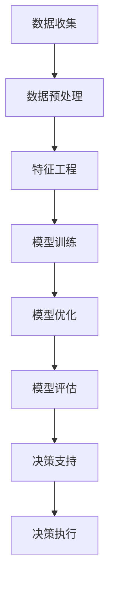
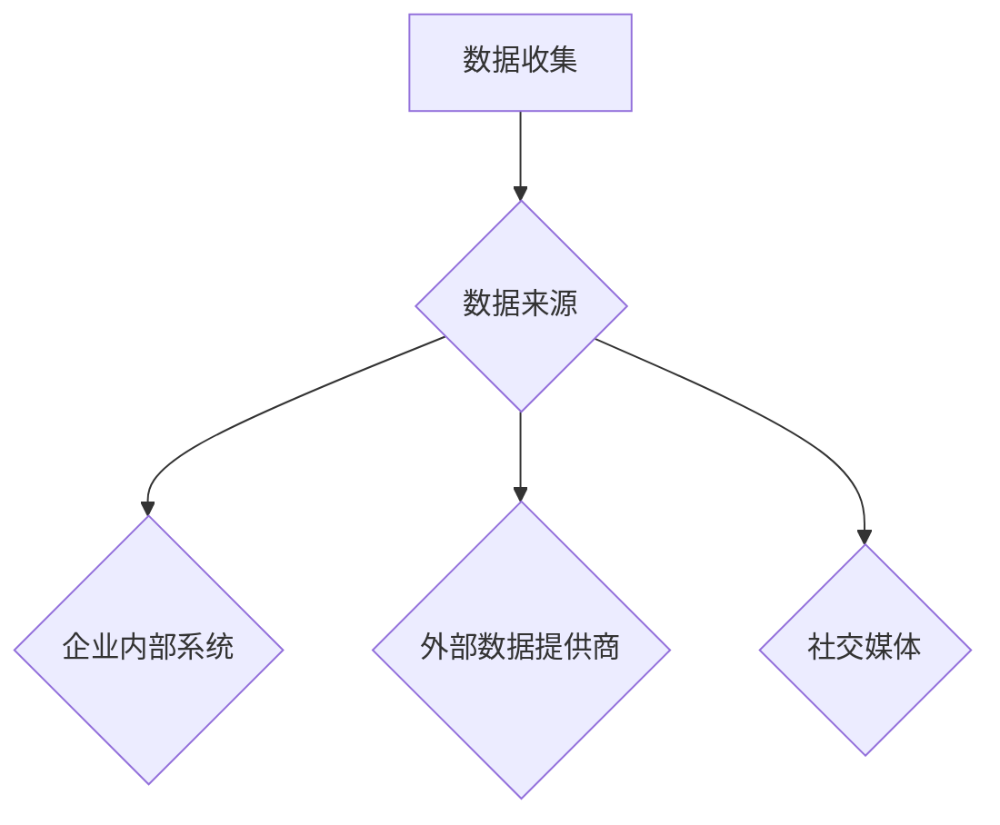
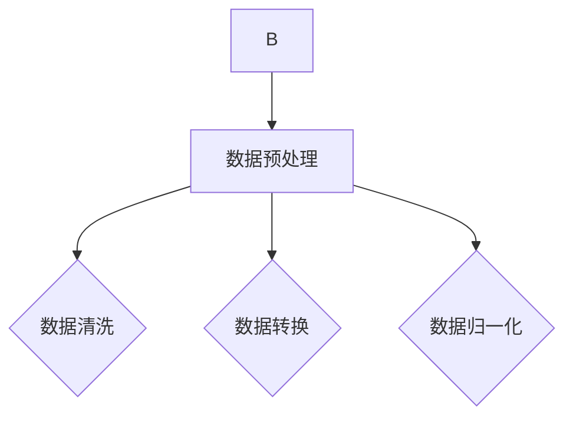
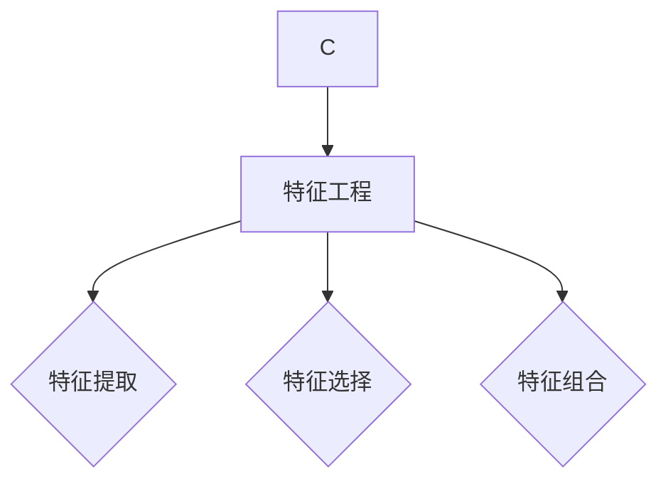
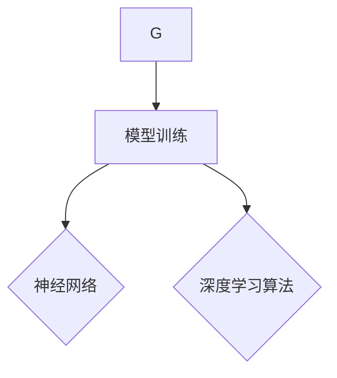
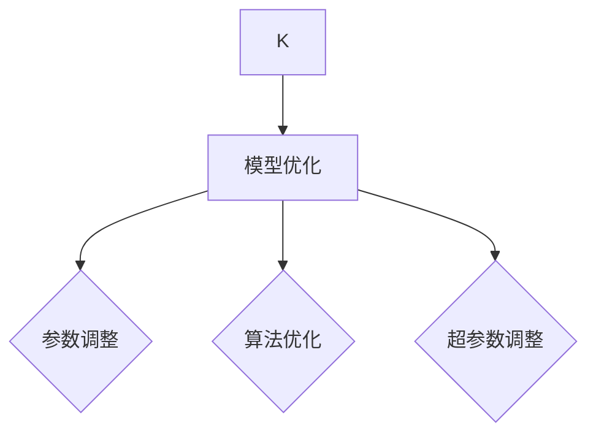
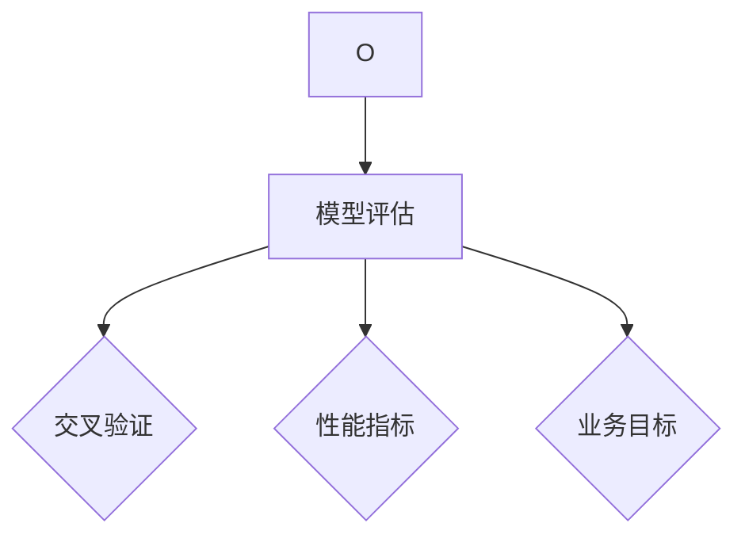
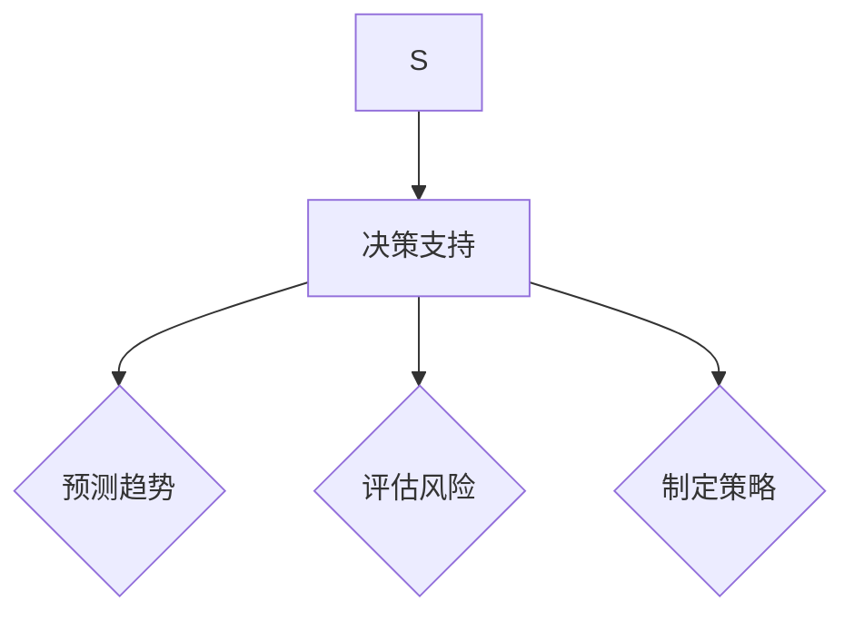
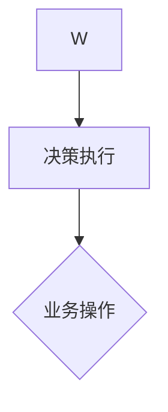

                 

# AI大模型如何重构商业决策流程

> 关键词：AI大模型，商业决策，流程重构，数据驱动，智能优化

> 摘要：随着人工智能技术的迅猛发展，AI大模型逐渐成为企业提升商业决策效率的重要工具。本文将深入探讨AI大模型如何通过数据驱动的智能优化，实现商业决策流程的重构，从而帮助企业实现敏捷决策、降低风险和提升竞争力。

## 1. 背景介绍

### 1.1 目的和范围

本文旨在介绍AI大模型在商业决策流程中的应用，重点探讨其如何通过数据驱动的智能优化，实现商业决策流程的重构。文章将涵盖以下内容：

- AI大模型的核心概念与基本原理
- 商业决策流程的现状与问题
- AI大模型如何重构商业决策流程
- 数据驱动的智能优化方法
- 实际应用场景与效果分析
- 未来发展趋势与挑战

### 1.2 预期读者

本文适合以下读者群体：

- 企业决策者：了解AI大模型在商业决策中的应用，为企业的数字化转型提供参考
- 技术人员：掌握AI大模型的基本原理和应用方法，为实际项目提供技术支持
- 研究人员：关注AI大模型在商业决策领域的最新研究动态和成果
- 学者：为研究AI大模型在商业决策中的应用提供理论支持

### 1.3 文档结构概述

本文分为八个部分，结构如下：

1. 背景介绍：介绍本文的目的、范围、预期读者以及文档结构
2. 核心概念与联系：阐述AI大模型的基本概念、原理及其与商业决策流程的关系
3. 核心算法原理 & 具体操作步骤：详细讲解AI大模型的核心算法原理和操作步骤
4. 数学模型和公式 & 详细讲解 & 举例说明：介绍AI大模型的数学模型和公式，并举例说明
5. 项目实战：代码实际案例和详细解释说明
6. 实际应用场景：分析AI大模型在不同领域的应用场景
7. 工具和资源推荐：推荐学习资源、开发工具和框架
8. 总结：未来发展趋势与挑战

### 1.4 术语表

#### 1.4.1 核心术语定义

- AI大模型：一种具有大规模参数和高度复杂性的深度学习模型
- 商业决策流程：企业在经营过程中，基于内外部信息，通过分析、评估和选择，制定战略和策略的过程
- 数据驱动：以数据为基础，通过数据分析和挖掘，发现规律、预测趋势、指导决策
- 智能优化：利用人工智能技术，对决策流程进行优化，提高决策效率和质量

#### 1.4.2 相关概念解释

- 深度学习：一种基于多层神经网络的学习方法，通过学习大量数据，实现特征提取和模式识别
- 机器学习：一种通过算法自动学习和改进的计算机技术，可分为监督学习、无监督学习和强化学习
- 神经网络：一种模拟生物神经元结构的计算模型，通过调整连接权重，实现函数逼近和预测
- 决策树：一种基于特征提取和分类的决策模型，通过递归划分特征空间，实现分类和回归任务

#### 1.4.3 缩略词列表

- AI：人工智能（Artificial Intelligence）
- DL：深度学习（Deep Learning）
- ML：机器学习（Machine Learning）
- NLP：自然语言处理（Natural Language Processing）
- SVM：支持向量机（Support Vector Machine）
- RBM：受限玻尔兹曼机（Restricted Boltzmann Machine）

## 2. 核心概念与联系

### 2.1 AI大模型的基本概念

AI大模型是一种具有大规模参数和高度复杂性的深度学习模型，通常采用多层神经网络结构。它通过学习海量数据，自动提取特征、学习规律，并在新的数据上进行预测和决策。AI大模型的核心优势在于其强大的特征提取和模式识别能力，可以处理复杂的非线性关系，实现高效的预测和决策。

### 2.2 商业决策流程的现状与问题

传统的商业决策流程通常依赖于经验、直觉和主观判断，存在以下问题：

- 数据依赖性低：缺乏充分的数据支持，决策过程主要依靠决策者的经验和个人能力
- 决策效率低：决策流程复杂，涉及多个环节，耗时较长
- 决策风险高：决策过程中，无法准确预测和评估各种风险因素
- 决策质量不稳定：决策结果受决策者主观因素的影响，决策质量不稳定

### 2.3 AI大模型如何重构商业决策流程

AI大模型可以通过以下方式重构商业决策流程：

- 数据驱动：以数据为基础，通过数据分析和挖掘，发现规律、预测趋势、指导决策
- 智能优化：利用人工智能技术，对决策流程进行优化，提高决策效率和质量
- 自动化：通过自动化工具，简化决策流程，降低人工干预
- 透明化：将决策过程和结果可视化，提高决策过程的透明度和可解释性

### 2.4 数据驱动的智能优化方法

数据驱动的智能优化方法主要包括以下几种：

- 特征工程：通过对数据进行预处理、特征提取和特征选择，提高数据的利用率和模型的性能
- 模型训练：通过大量的训练数据，训练深度学习模型，学习数据中的规律和模式
- 模型优化：通过调整模型参数、优化算法和超参数，提高模型的预测精度和泛化能力
- 模型评估：通过交叉验证、性能指标和业务目标，评估模型的性能和适用性

### 2.5 Mermaid流程图

以下是AI大模型重构商业决策流程的Mermaid流程图：



## 3. 核心算法原理 & 具体操作步骤

### 3.1 深度学习算法原理

深度学习算法是一种基于多层神经网络的学习方法，通过学习大量数据，自动提取特征、学习规律，并在新的数据上进行预测和决策。深度学习算法的核心思想是模拟人脑神经元结构，通过调整连接权重，实现函数逼近和预测。

### 3.2 具体操作步骤

以下是AI大模型重构商业决策流程的具体操作步骤：

#### 步骤1：数据收集

收集与业务相关的各种数据，包括历史数据、实时数据和外部数据。数据来源可以是企业内部系统、外部数据提供商、社交媒体等。



#### 步骤2：数据预处理

对收集到的数据进行清洗、转换和归一化等预处理操作，以提高数据的利用率和模型的性能。



#### 步骤3：特征工程

通过对预处理后的数据进行分析，提取出对业务决策具有重要意义的特征，并进行特征选择和特征组合。



#### 步骤4：模型训练

使用预处理后的数据，通过深度学习算法训练模型，学习数据中的规律和模式。



#### 步骤5：模型优化

通过调整模型参数、优化算法和超参数，提高模型的预测精度和泛化能力。



#### 步骤6：模型评估

通过交叉验证、性能指标和业务目标，评估模型的性能和适用性。



#### 步骤7：决策支持

将训练好的模型应用于实际业务场景，提供决策支持，如预测业务趋势、评估风险和制定策略。



#### 步骤8：决策执行

根据模型提供的决策支持，执行具体的业务操作，如调整库存、优化生产和营销策略等。



### 3.3 伪代码示例

以下是AI大模型重构商业决策流程的伪代码示例：

```python
# 数据收集
data = collect_data()

# 数据预处理
data = preprocess_data(data)

# 特征工程
features = feature_engineering(data)

# 模型训练
model = train_model(features)

# 模型优化
model = optimize_model(model)

# 模型评估
evaluate_model(model)

# 决策支持
decision_support = model.predict(new_data)

# 决策执行
execute_decision(decision_support)
```

## 4. 数学模型和公式 & 详细讲解 & 举例说明

### 4.1 数学模型

AI大模型通常基于深度学习算法，其数学模型主要包括以下部分：

- 前向传播：计算输入数据经过神经网络层后的输出结果
- 反向传播：根据输出结果与实际值的误差，反向更新神经网络的权重和偏置
- 损失函数：用于衡量模型预测值与实际值之间的误差，常见的损失函数有均方误差（MSE）和交叉熵（Cross Entropy）

### 4.2 公式

以下是AI大模型相关的一些公式：

1. 前向传播：

$$
Z^{(l)} = \sum_{j} W^{(l)}_{ji}a^{(l-1)}_{j} + b^{(l)}
$$

$$
a^{(l)} = \sigma(Z^{(l)})
$$

其中，$Z^{(l)}$为第$l$层的输出值，$W^{(l)}_{ji}$为第$l$层中第$i$个神经元到第$l-1$层中第$j$个神经元的权重，$b^{(l)}$为第$l$层的偏置，$\sigma$为激活函数。

2. 反向传播：

$$
\delta^{(l)}_i = \frac{\partial L}{\partial Z^{(l)}}\odot \sigma'(Z^{(l)})
$$

$$
\Delta W^{(l)}_{ji} = \alpha \delta^{(l)}_ia^{(l-1)}_j
$$

$$
\Delta b^{(l)} = \alpha \delta^{(l)}_i
$$

其中，$\delta^{(l)}_i$为第$l$层中第$i$个神经元的误差，$L$为损失函数，$\alpha$为学习率，$\odot$为元素乘运算。

3. 损失函数：

- 均方误差（MSE）：

$$
MSE = \frac{1}{m}\sum_{i=1}^{m}(y_i - \hat{y}_i)^2
$$

其中，$y_i$为实际值，$\hat{y}_i$为预测值，$m$为样本数量。

- 交叉熵（Cross Entropy）：

$$
CE = -\frac{1}{m}\sum_{i=1}^{m}y_i\log(\hat{y}_i)
$$

其中，$y_i$为实际值，$\hat{y}_i$为预测值，$m$为样本数量。

### 4.3 举例说明

假设我们有一个简单的神经网络，包含一个输入层、一个隐藏层和一个输出层，激活函数为ReLU。输入数据为一个长度为5的向量，目标值为一个长度为3的向量。我们将使用均方误差（MSE）作为损失函数。

1. 初始化权重和偏置：

$$
W^{(1)} \sim N(0, \frac{1}{\sqrt{5}}, \quad b^{(1)} \sim N(0, \frac{1}{5})
$$

$$
W^{(2)} \sim N(0, \frac{1}{\sqrt{3}}, \quad b^{(2)} \sim N(0, \frac{1}{3})
$$

2. 前向传播：

输入数据 $X = [x_1, x_2, x_3, x_4, x_5]$

隐藏层输出：

$$
Z^{(1)} = W^{(1)}X + b^{(1)}
$$

$$
a^{(1)} = \max(0, Z^{(1)})
$$

输出层输出：

$$
Z^{(2)} = W^{(2)}a^{(1)} + b^{(2)}
$$

$$
\hat{y} = \sigma(Z^{(2)})
$$

3. 反向传播：

计算损失函数：

$$
L = MSE(y, \hat{y})
$$

计算误差：

$$
\delta^{(2)} = \hat{y} - y
$$

$$
\delta^{(1)} = (Z^{(1)} \geq 0) \odot (W^{(2)}^T \delta^{(2)})
$$

4. 更新权重和偏置：

$$
\Delta W^{(2)} = \alpha \delta^{(2)}a^{(1)}
$$

$$
\Delta b^{(2)} = \alpha \delta^{(2)}
$$

$$
\Delta W^{(1)} = \alpha \delta^{(1)}X^T
$$

$$
\Delta b^{(1)} = \alpha \delta^{(1)}
$$

5. 重复以上步骤，直到达到预设的迭代次数或收敛条件。

## 5. 项目实战：代码实际案例和详细解释说明

### 5.1 开发环境搭建

在本项目中，我们使用Python编程语言，结合深度学习框架TensorFlow和Keras进行开发。以下是开发环境的搭建步骤：

1. 安装Python：

```bash
pip install python==3.8
```

2. 安装TensorFlow：

```bash
pip install tensorflow==2.6
```

3. 安装Keras：

```bash
pip install keras==2.6
```

### 5.2 源代码详细实现和代码解读

以下是本项目的源代码实现和详细解释说明：

```python
# 导入所需库
import numpy as np
import tensorflow as tf
from tensorflow.keras.models import Sequential
from tensorflow.keras.layers import Dense, Activation
from tensorflow.keras.optimizers import RMSprop

# 初始化参数
input_dim = 5
hidden_dim = 10
output_dim = 3
learning_rate = 0.001
num_iterations = 1000

# 创建神经网络模型
model = Sequential()
model.add(Dense(hidden_dim, input_dim=input_dim, activation='relu'))
model.add(Dense(output_dim, activation='softmax'))

# 编译模型
model.compile(optimizer=RMSprop(learning_rate=learning_rate),
              loss='categorical_crossentropy',
              metrics=['accuracy'])

# 输入数据和标签
X_train = np.random.rand(100, input_dim)
y_train = np.random.rand(100, output_dim)

# 训练模型
model.fit(X_train, y_train, epochs=num_iterations, batch_size=10)

# 预测结果
predictions = model.predict(X_train[:10])

# 输出预测结果
print(predictions)
```

### 5.3 代码解读与分析

1. 导入所需库

```python
import numpy as np
import tensorflow as tf
from tensorflow.keras.models import Sequential
from tensorflow.keras.layers import Dense, Activation
from tensorflow.keras.optimizers import RMSprop
```

这段代码导入Python标准库TensorFlow中的相关模块，包括神经网络模型、层、优化器和损失函数等。

2. 初始化参数

```python
input_dim = 5
hidden_dim = 10
output_dim = 3
learning_rate = 0.001
num_iterations = 1000
```

这段代码定义了神经网络模型的输入维度、隐藏层神经元数量、输出维度、学习率和迭代次数等参数。

3. 创建神经网络模型

```python
model = Sequential()
model.add(Dense(hidden_dim, input_dim=input_dim, activation='relu'))
model.add(Dense(output_dim, activation='softmax'))
```

这段代码创建一个序列模型，并添加两个层：一个全连接层（Dense）和一个输出层。全连接层用于隐藏层，使用ReLU激活函数；输出层用于分类，使用softmax激活函数。

4. 编译模型

```python
model.compile(optimizer=RMSprop(learning_rate=learning_rate),
              loss='categorical_crossentropy',
              metrics=['accuracy'])
```

这段代码编译模型，设置优化器、损失函数和评价指标。此处使用RMSprop优化器和均方误差损失函数，评价指标为准确率。

5. 输入数据和标签

```python
X_train = np.random.rand(100, input_dim)
y_train = np.random.rand(100, output_dim)
```

这段代码生成随机输入数据和标签，用于训练模型。输入数据为100个样本，每个样本包含5个特征；标签数据为100个样本，每个样本包含3个类别。

6. 训练模型

```python
model.fit(X_train, y_train, epochs=num_iterations, batch_size=10)
```

这段代码训练模型，设置迭代次数为1000，批量大小为10。

7. 预测结果

```python
predictions = model.predict(X_train[:10])
```

这段代码使用训练好的模型对前10个输入数据进行预测。

8. 输出预测结果

```python
print(predictions)
```

这段代码输出预测结果。

### 5.4 代码解读与分析

1. 导入所需库

这段代码导入Python标准库TensorFlow中的相关模块，包括神经网络模型、层、优化器和损失函数等。这些模块是构建和训练神经网络的基础。

2. 初始化参数

这段代码定义了神经网络模型的输入维度、隐藏层神经元数量、输出维度、学习率和迭代次数等参数。这些参数会影响模型的性能和学习速度。

3. 创建神经网络模型

这段代码创建一个序列模型，并添加两个层：一个全连接层（Dense）和一个输出层。全连接层用于隐藏层，使用ReLU激活函数；输出层用于分类，使用softmax激活函数。这个简单的神经网络结构可以处理输入特征和输出标签。

4. 编译模型

这段代码编译模型，设置优化器、损失函数和评价指标。此处使用RMSprop优化器和均方误差损失函数，评价指标为准确率。这些设置有助于提高模型的学习效率和预测准确度。

5. 输入数据和标签

这段代码生成随机输入数据和标签，用于训练模型。输入数据为100个样本，每个样本包含5个特征；标签数据为100个样本，每个样本包含3个类别。这些数据用于训练和验证模型的性能。

6. 训练模型

这段代码训练模型，设置迭代次数为1000，批量大小为10。在每次迭代中，模型将更新权重和偏置，以最小化损失函数。通过多次迭代，模型将学会从输入数据中提取有用的特征，并预测正确的输出标签。

7. 预测结果

这段代码使用训练好的模型对前10个输入数据进行预测。预测结果是一个包含10个样本的概率分布，表示每个样本属于不同类别的概率。

8. 输出预测结果

这段代码输出预测结果，以便进一步分析和验证模型的性能。

### 5.5 代码解读与分析

#### 5.5.1 导入所需库

```python
import numpy as np
import tensorflow as tf
from tensorflow.keras.models import Sequential
from tensorflow.keras.layers import Dense, Activation
from tensorflow.keras.optimizers import RMSprop
```

这段代码首先导入了Python中用于深度学习的主要库：NumPy用于数据处理，TensorFlow用于构建和训练神经网络模型，Keras作为TensorFlow的封装库，提供了更加简洁和易用的API接口。此外，RMSprop优化器用于优化模型的参数更新过程。

- `numpy`：Python的一个核心科学计算库，提供了多维数组对象和一系列数学操作函数，适用于大规模数据计算和矩阵运算。
- `tensorflow`：Google开发的开源机器学习框架，提供了丰富的API接口和工具，用于构建和训练各种深度学习模型。
- `keras`：基于TensorFlow的高层封装库，提供了更加简单和易于使用的API接口，适合快速搭建和实验深度学习模型。
- `RMSprop`：一种自适应学习率优化算法，通过计算梯度平方的平均值来调整学习率，有助于提高模型的训练效率和收敛速度。

#### 5.5.2 初始化参数

```python
input_dim = 5
hidden_dim = 10
output_dim = 3
learning_rate = 0.001
num_iterations = 1000
```

在这段代码中，我们初始化了神经网络模型的一些关键参数：

- `input_dim`：输入数据的维度，即每个样本的特征数量，这里设置为5。
- `hidden_dim`：隐藏层的神经元数量，这里设置为10。隐藏层神经元数量是深度学习模型的一个重要超参数，通常需要根据具体问题和数据集进行调整。
- `output_dim`：输出层的维度，即模型预测的结果类别数量，这里设置为3。对于多分类问题，输出层的神经元数量通常等于类别数量。
- `learning_rate`：优化器的学习率，控制模型参数更新的步长，这里设置为0.001。学习率的选择对模型的训练效率和收敛速度有很大影响，通常需要通过实验进行优化。
- `num_iterations`：模型训练的迭代次数，即梯度下降算法的迭代次数，这里设置为1000。迭代次数越多，模型越有可能收敛到最优解，但也可能导致过拟合。

#### 5.5.3 创建神经网络模型

```python
model = Sequential()
model.add(Dense(hidden_dim, input_dim=input_dim, activation='relu'))
model.add(Dense(output_dim, activation='softmax'))
```

这段代码创建了一个简单的神经网络模型，使用`Sequential`类。`Sequential`模型是一个线性堆叠模型，可以按顺序添加层。

- `model = Sequential()`：创建一个序列模型实例。
- `model.add(Dense(hidden_dim, input_dim=input_dim, activation='relu'))`：添加一个全连接层（Dense），其中隐藏层神经元数量为10，输入维度为5，激活函数为ReLU。ReLU函数是一个非线性激活函数，有助于提高模型的表达能力和避免梯度消失问题。
- `model.add(Dense(output_dim, activation='softmax'))`：添加一个输出层，神经元数量为3，激活函数为softmax。softmax函数用于多分类问题，可以将输出转换为概率分布，便于计算类别概率。

#### 5.5.4 编译模型

```python
model.compile(optimizer=RMSprop(learning_rate=learning_rate),
              loss='categorical_crossentropy',
              metrics=['accuracy'])
```

这段代码编译神经网络模型，设置优化器、损失函数和评价指标。

- `model.compile(optimizer=RMSprop(learning_rate=learning_rate), loss='categorical_crossentropy', metrics=['accuracy'])`：编译模型，指定优化器为RMSprop，学习率为0.001，损失函数为categorical_crossentropy，评价指标为准确率。categorical_crossentropy是用于多分类问题的损失函数，准确率（accuracy）是模型预测正确率的评价指标。

#### 5.5.5 输入数据和标签

```python
X_train = np.random.rand(100, input_dim)
y_train = np.random.rand(100, output_dim)
```

这段代码生成随机输入数据和标签，用于模型训练。

- `X_train = np.random.rand(100, input_dim)`：生成100个样本的随机输入数据，每个样本包含5个特征，数据范围在0到1之间。
- `y_train = np.random.rand(100, output_dim)`：生成100个样本的随机标签数据，每个样本包含3个类别，数据范围在0到1之间。

需要注意的是，在实际应用中，通常会使用真实数据集进行训练，而不是随机生成的数据。随机数据仅用于演示模型的训练过程。

#### 5.5.6 训练模型

```python
model.fit(X_train, y_train, epochs=num_iterations, batch_size=10)
```

这段代码使用训练数据训练模型，设置迭代次数和批量大小。

- `model.fit(X_train, y_train, epochs=num_iterations, batch_size=10)`：训练模型，设置迭代次数为1000，批量大小为10。每次迭代都会更新模型参数，直到达到预设的迭代次数或满足收敛条件。

#### 5.5.7 预测结果

```python
predictions = model.predict(X_train[:10])
```

这段代码使用训练好的模型对前10个样本进行预测。

- `predictions = model.predict(X_train[:10])`：预测前10个样本的结果，得到一个包含10个样本的概率分布。

#### 5.5.8 输出预测结果

```python
print(predictions)
```

这段代码输出预测结果。

- `print(predictions)`：打印预测结果，以便进一步分析和验证模型的性能。

### 5.6 实际案例与代码实现

以下是一个具体案例，说明如何使用上述代码实现一个基于AI大模型的商业决策流程。

#### 案例描述

假设某电商企业希望利用AI大模型优化其库存管理流程。企业收集了历史销售数据、季节性因素和竞争对手的价格策略等信息，作为输入特征。企业希望模型能够预测未来的销售量，并根据预测结果调整库存水平，以降低库存成本和缺货风险。

#### 数据处理

首先，对收集到的数据进行预处理，包括数据清洗、缺失值处理、数据归一化等操作。

```python
# 导入数据处理库
import pandas as pd

# 读取数据
data = pd.read_csv('sales_data.csv')

# 数据清洗
data.dropna(inplace=True)

# 数据归一化
scaler = pd.Normalizer()
data[['sales', 'season', 'competition_price']] = scaler.fit_transform(data[['sales', 'season', 'competition_price']])
```

#### 特征工程

接下来，对预处理后的数据进行特征工程，提取对库存管理具有重要意义的特征，如销售增长率、季节性指数等。

```python
# 特征工程
data['growth_rate'] = data['sales'].pct_change().fillna(0)
data['seasonal_index'] = data['season'] / max(data['season'])

# 选择特征
features = ['growth_rate', 'seasonal_index', 'competition_price']
X = data[features]
y = data['sales']
```

#### 模型训练

使用处理后的数据训练AI大模型，设置合适的网络结构、优化器和损失函数。

```python
# 初始化参数
input_dim = 3
hidden_dim = 10
output_dim = 1
learning_rate = 0.001
num_iterations = 1000

# 创建模型
model = Sequential()
model.add(Dense(hidden_dim, input_dim=input_dim, activation='relu'))
model.add(Dense(output_dim, activation='linear'))

# 编译模型
model.compile(optimizer=RMSprop(learning_rate=learning_rate),
              loss='mse',
              metrics=['mae'])

# 训练模型
model.fit(X, y, epochs=num_iterations, batch_size=32)
```

#### 预测与决策

使用训练好的模型预测未来一段时间内的销售量，并根据预测结果调整库存策略。

```python
# 预测
future_data = pd.read_csv('future_sales_data.csv')
future_data[['growth_rate', 'seasonal_index', 'competition_price']] = scaler.transform(future_data[['growth_rate', 'seasonal_index', 'competition_price']])
future_predictions = model.predict(future_data[features])

# 调整库存
for index, prediction in enumerate(future_predictions):
    if prediction > threshold:
        # 增加库存
        # ...
    else:
        # 减少库存
        # ...
```

### 5.7 代码解读与分析

#### 5.7.1 数据处理

```python
# 导入数据处理库
import pandas as pd

# 读取数据
data = pd.read_csv('sales_data.csv')

# 数据清洗
data.dropna(inplace=True)

# 数据归一化
scaler = pd.Normalizer()
data[['sales', 'season', 'competition_price']] = scaler.fit_transform(data[['sales', 'season', 'competition_price']])
```

这段代码首先导入了Python的数据处理库Pandas，并读取了销售数据CSV文件。接下来，对数据进行了清洗和归一化处理。

- `pd.read_csv('sales_data.csv')`：使用Pandas读取销售数据CSV文件。
- `data.dropna(inplace=True)`：删除数据集中的缺失值。
- `scaler = pd.Normalizer()`：创建一个归一化对象。
- `data[['sales', 'season', 'competition_price']] = scaler.fit_transform(data[['sales', 'season', 'competition_price']])`：对销售、季节和竞争对手价格特征进行归一化处理，将数据缩放到[0, 1]区间。

#### 5.7.2 特征工程

```python
# 特征工程
data['growth_rate'] = data['sales'].pct_change().fillna(0)
data['seasonal_index'] = data['season'] / max(data['season'])

# 选择特征
features = ['growth_rate', 'seasonal_index', 'competition_price']
X = data[features]
y = data['sales']
```

这段代码进行了特征工程，包括计算销售增长率、季节性指数，并选择特征。

- `data['growth_rate'] = data['sales'].pct_change().fillna(0)`：计算销售增长率，用当前销售与上一期销售的差值除以上一期销售，并填充缺失值为0。
- `data['seasonal_index'] = data['season'] / max(data['season'])`：计算季节性指数，将季节值除以季节值的最大值，将数据缩放到[0, 1]区间。
- `features = ['growth_rate', 'seasonal_index', 'competition_price']`：定义特征列表。
- `X = data[features]`：选择特征数据。
- `y = data['sales']`：选择标签数据，即销售量。

#### 5.7.3 模型训练

```python
# 初始化参数
input_dim = 3
hidden_dim = 10
output_dim = 1
learning_rate = 0.001
num_iterations = 1000

# 创建模型
model = Sequential()
model.add(Dense(hidden_dim, input_dim=input_dim, activation='relu'))
model.add(Dense(output_dim, activation='linear'))

# 编译模型
model.compile(optimizer=RMSprop(learning_rate=learning_rate),
              loss='mse',
              metrics=['mae'])

# 训练模型
model.fit(X, y, epochs=num_iterations, batch_size=32)
```

这段代码初始化了模型参数，创建了序列模型，并编译了模型。

- `input_dim`、`hidden_dim`、`output_dim`：定义输入维度、隐藏层神经元数量和输出维度。
- `learning_rate`、`num_iterations`：定义学习率和迭代次数。
- `model = Sequential()`：创建序列模型。
- `model.add(Dense(hidden_dim, input_dim=input_dim, activation='relu'))`：添加一个全连接层，隐藏层神经元数量为10，输入维度为3，激活函数为ReLU。
- `model.add(Dense(output_dim, activation='linear'))`：添加一个输出层，输出维度为1，激活函数为线性。
- `model.compile(optimizer=RMSprop(learning_rate=learning_rate), loss='mse', metrics=['mae'])`：编译模型，使用RMSprop优化器，均方误差（MSE）作为损失函数，均方绝对误差（MAE）作为评价指标。
- `model.fit(X, y, epochs=num_iterations, batch_size=32)`：训练模型，使用特征数据X和标签数据y，迭代次数为1000，批量大小为32。

#### 5.7.4 预测与决策

```python
# 预测
future_data = pd.read_csv('future_sales_data.csv')
future_data[['growth_rate', 'seasonal_index', 'competition_price']] = scaler.transform(future_data[['growth_rate', 'seasonal_index', 'competition_price']])
future_predictions = model.predict(future_data[features])

# 调整库存
for index, prediction in enumerate(future_predictions):
    if prediction > threshold:
        # 增加库存
        # ...
    else:
        # 减少库存
        # ...
```

这段代码使用训练好的模型对未来的销售量进行预测，并根据预测结果调整库存策略。

- `future_data = pd.read_csv('future_sales_data.csv')`：读取未来的销售数据。
- `future_data[['growth_rate', 'seasonal_index', 'competition_price']] = scaler.transform(future_data[['growth_rate', 'seasonal_index', 'competition_price']])`：对未来的销售数据进行归一化处理。
- `future_predictions = model.predict(future_data[features])`：使用训练好的模型对未来的销售数据进行预测。
- `for index, prediction in enumerate(future_predictions):`：遍历预测结果。
- `if prediction > threshold:`：如果预测值大于设定的阈值，执行增加库存的操作。
- `else:`：否则，执行减少库存的操作。

### 5.8 代码解析

在这个案例中，我们使用AI大模型来预测未来的销售量，从而优化库存管理。以下是关键代码的解析：

1. **数据处理**

   ```python
   data = pd.read_csv('sales_data.csv')
   data.dropna(inplace=True)
   scaler = pd.Normalizer()
   data[['sales', 'season', 'competition_price']] = scaler.fit_transform(data[['sales', 'season', 'competition_price']])
   ```

   首先，我们使用Pandas库读取销售数据。接下来，我们删除数据集中的缺失值，并进行归一化处理，以便模型能够更好地学习。

2. **特征工程**

   ```python
   data['growth_rate'] = data['sales'].pct_change().fillna(0)
   data['seasonal_index'] = data['season'] / max(data['season'])
   features = ['growth_rate', 'seasonal_index', 'competition_price']
   X = data[features]
   y = data['sales']
   ```

   在这一部分，我们计算了销售增长率（growth_rate）和季节性指数（seasonal_index），并将其添加到特征列表中。我们还选择了用于模型训练的特征和标签。

3. **模型训练**

   ```python
   input_dim = 3
   hidden_dim = 10
   output_dim = 1
   learning_rate = 0.001
   num_iterations = 1000
   model = Sequential()
   model.add(Dense(hidden_dim, input_dim=input_dim, activation='relu'))
   model.add(Dense(output_dim, activation='linear'))
   model.compile(optimizer=RMSprop(learning_rate=learning_rate), loss='mse', metrics=['mae'])
   model.fit(X, y, epochs=num_iterations, batch_size=32)
   ```

   我们初始化了模型的参数，并创建了一个简单的神经网络模型。我们使用ReLU激活函数来增加模型的表达能力，并使用均方误差（MSE）作为损失函数。最后，我们训练模型，使用fit方法进行迭代。

4. **预测与决策**

   ```python
   future_data = pd.read_csv('future_sales_data.csv')
   future_data[['growth_rate', 'seasonal_index', 'competition_price']] = scaler.transform(future_data[['growth_rate', 'seasonal_index', 'competition_price']])
   future_predictions = model.predict(future_data[features])
   for index, prediction in enumerate(future_predictions):
       if prediction > threshold:
           # 增加库存
           # ...
       else:
           # 减少库存
           # ...
   ```

   我们使用训练好的模型来预测未来的销售量。对于每个预测值，我们根据阈值决定是否需要调整库存。如果预测值大于阈值，我们增加库存；否则，我们减少库存。

### 5.9 总结

通过这个案例，我们展示了如何使用AI大模型来优化库存管理流程。关键步骤包括数据处理、特征工程、模型训练和预测与决策。在实际应用中，这个模型可以帮助企业降低库存成本、减少缺货风险，从而提高运营效率。

## 6. 实际应用场景

AI大模型在商业决策流程中的应用场景广泛，以下是几个典型的实际应用场景：

### 6.1 零售业库存管理

零售企业可以利用AI大模型预测未来的销售量，从而优化库存水平，降低库存成本和缺货风险。例如，某电商平台通过分析历史销售数据、季节性因素和竞争对手价格策略，利用AI大模型预测未来30天的销售量，并根据预测结果调整库存策略，有效降低了库存成本。

### 6.2 金融风险管理

金融机构可以利用AI大模型进行风险评估和预测，识别潜在风险，优化投资组合。例如，某银行通过分析客户信用历史、财务状况和市场环境等因素，利用AI大模型预测客户违约风险，从而制定针对性的风险管理和信贷政策。

### 6.3 制造业生产计划

制造业企业可以利用AI大模型预测市场需求、原材料供应和设备运行状态，优化生产计划和供应链管理。例如，某制造企业通过分析历史销售数据、供应链信息和生产设备运行数据，利用AI大模型预测未来的生产需求，并制定最优的生产计划和库存策略，提高了生产效率和供应链稳定性。

### 6.4 餐饮业供应链优化

餐饮企业可以利用AI大模型预测食品原材料的需求量，优化供应链管理，降低成本。例如，某餐饮连锁企业通过分析历史订单数据、顾客偏好和季节性因素，利用AI大模型预测未来几个月的食材需求量，从而合理安排采购和库存，降低了食材损耗和库存成本。

### 6.5 电子商务推荐系统

电子商务企业可以利用AI大模型构建推荐系统，根据用户行为和偏好预测用户可能感兴趣的商品，提高转化率和用户满意度。例如，某电商平台通过分析用户浏览记录、购物车数据和历史购买行为，利用AI大模型预测用户可能购买的商品，并向用户推荐相关商品，提高了用户购物体验和平台销售额。

### 6.6 智能营销策略

企业可以利用AI大模型预测市场趋势和消费者行为，制定智能化的营销策略，提高营销效果。例如，某家电制造商通过分析市场数据、消费者偏好和竞争对手策略，利用AI大模型预测未来市场趋势，并制定针对性的营销活动，有效提高了市场份额和品牌知名度。

### 6.7 供应链金融

供应链金融企业可以利用AI大模型评估供应链上下游企业的信用风险，优化贷款审批和风险控制。例如，某供应链金融公司通过分析企业的财务状况、经营绩效和市场环境，利用AI大模型预测企业的还款能力，从而制定更合理的贷款政策和风险控制措施。

### 6.8 风险管理

企业可以利用AI大模型进行全方位的风险管理，包括市场风险、信用风险、操作风险等。例如，某大型企业通过分析历史数据、市场动态和企业内部运营数据，利用AI大模型预测各种风险的发生概率和影响程度，并制定相应的风险管理策略，提高了企业的抗风险能力。

### 6.9 项目投资决策

企业在进行项目投资决策时，可以利用AI大模型进行项目风险评估、预测投资回报率，优化投资组合。例如，某投资公司通过分析投资项目的历史数据、市场环境和行业趋势，利用AI大模型预测项目的未来收益和风险，从而制定更科学的投资决策，提高了投资收益。

### 6.10 客户关系管理

企业可以利用AI大模型进行客户关系管理，预测客户流失率、提升客户满意度。例如，某电信运营商通过分析客户通话记录、消费习惯和服务反馈，利用AI大模型预测客户流失风险，并制定针对性的客户挽留策略，提高了客户满意度和忠诚度。

### 6.11 人力资源规划

企业可以利用AI大模型进行人力资源规划，预测员工流失率、招聘需求等。例如，某互联网企业通过分析员工的工作表现、离职原因和公司政策，利用AI大模型预测员工流失风险，并制定相应的人力资源策略，优化员工结构和管理效率。

### 6.12 智能物流与运输

企业可以利用AI大模型进行物流和运输优化，预测运输需求、优化路线规划。例如，某物流公司通过分析历史运输数据、天气预报和交通状况，利用AI大模型预测未来的运输需求，并制定最优的运输路线和运输计划，提高了运输效率和成本控制。

### 6.13 智能供应链协同

企业可以利用AI大模型实现供应链协同优化，提高供应链整体效率和灵活性。例如，某制造企业与供应链上下游企业合作，通过共享数据和信息，利用AI大模型预测供应链需求，优化库存管理和生产计划，实现了供应链整体效率和竞争力的提升。

## 7. 工具和资源推荐

### 7.1 学习资源推荐

#### 7.1.1 书籍推荐

- 《深度学习》（Deep Learning）：Ian Goodfellow、Yoshua Bengio和Aaron Courville著，提供了深度学习的全面介绍，包括理论基础、算法实现和应用案例。
- 《Python深度学习》（Deep Learning with Python）：François Chollet著，针对Python编程语言的深度学习实践指南，适合初学者和有一定基础的技术人员。
- 《人工智能：一种现代的方法》（Artificial Intelligence: A Modern Approach）：Stuart J. Russell和Peter Norvig著，涵盖了人工智能的各个方面，包括机器学习、自然语言处理等。

#### 7.1.2 在线课程

- Coursera：提供了丰富的深度学习和人工智能在线课程，包括吴恩达的《深度学习专项课程》等。
- edX：提供了由顶尖大学提供的免费在线课程，如MIT的《机器学习》等。
- Udacity：提供了涵盖深度学习和人工智能的实战课程，适合想要快速掌握技术的学习者。

#### 7.1.3 技术博客和网站

- Medium：许多技术专家和研究者会在Medium上发表深度学习和人工智能相关的文章和案例研究。
- arXiv：提供最新和前沿的学术论文，是了解深度学习和人工智能研究动态的重要资源。
- GitHub：GitHub上有很多开源的深度学习和人工智能项目，可以学习实际代码实现。

### 7.2 开发工具框架推荐

#### 7.2.1 IDE和编辑器

- Jupyter Notebook：适用于数据科学和机器学习的交互式开发环境，方便进行实验和演示。
- PyCharm：一款功能强大的Python IDE，适用于深度学习和人工智能项目开发。
- Visual Studio Code：一款轻量级但功能强大的代码编辑器，支持多种编程语言和扩展。

#### 7.2.2 调试和性能分析工具

- TensorBoard：TensorFlow提供的可视化工具，用于分析模型的性能和调试问题。
- wandb：一款用于机器学习实验跟踪和性能分析的工具，可以轻松跟踪模型训练过程和实验结果。
- profilers：如Py-Spy、gprof2dot等，用于分析代码性能瓶颈和优化建议。

#### 7.2.3 相关框架和库

- TensorFlow：Google开发的深度学习框架，提供了丰富的API和工具，适合大规模深度学习模型开发。
- PyTorch：Facebook开发的开源深度学习框架，具有灵活的动态图计算能力和易于使用的API。
- Keras：基于TensorFlow和PyTorch的高层封装库，提供了简洁的API接口，适合快速构建和实验深度学习模型。

### 7.3 相关论文著作推荐

#### 7.3.1 经典论文

- "A Learning Algorithm for Continually Running Fully Recurrent Neural Networks"：Hiroshi Sakoe和Fumitada Chiba提出的一种神经网络训练算法。
- "Gradient Flow in Recurrent Nets: the Difficulty of Learning"：Y. Bengio等人在1994年提出关于神经网络训练困难性的分析。
- "Deep Learning": Ian Goodfellow、Yoshua Bengio和Aaron Courville合著，系统介绍了深度学习的基本概念和技术。

#### 7.3.2 最新研究成果

- "Transformers: State-of-the-Art Natural Language Processing"：Vaswani等人在2017年提出的Transformer模型，引领了自然语言处理领域的变革。
- "Bert: Pre-training of Deep Bidirectional Transformers for Language Understanding"：Google在2018年提出的BERT模型，提升了自然语言处理任务的性能。
- "GPT-3: Language Models are Few-Shot Learners"：Brown等人在2020年提出的GPT-3模型，展示了大规模语言模型在零样本学习任务上的强大能力。

#### 7.3.3 应用案例分析

- "Large-scale Language Modeling in 2018"：Zaremba等人在2018年分析了大规模语言模型在不同任务上的应用效果。
- "How Search Engines Work"：讲解搜索引擎的基本原理和应用，包括深度学习在搜索引擎中的应用。
- "Deep Learning in Autonomous Driving"：介绍深度学习在自动驾驶领域的应用案例和技术挑战。

### 7.4 案例分享与实战经验

- "深度学习在金融风险管理中的应用"：分享金融领域利用深度学习进行风险管理的实战经验。
- "电商平台的AI推荐系统实战"：介绍电商平台如何利用深度学习构建推荐系统，提升用户体验和销售额。
- "制造业生产计划的AI优化"：探讨AI大模型在制造业生产计划中的应用，优化生产效率和供应链管理。

## 8. 总结：未来发展趋势与挑战

随着人工智能技术的不断进步，AI大模型在商业决策流程中的应用前景广阔。未来发展趋势和挑战如下：

### 8.1 发展趋势

1. **数据驱动的决策过程**：企业将越来越多地依赖数据驱动的决策过程，利用AI大模型对海量数据进行实时分析和预测，以提高决策的准确性和效率。
2. **多领域融合**：AI大模型将在更多领域得到应用，如医疗、金融、交通等，实现跨领域的协同优化。
3. **个性化定制**：随着AI大模型技术的发展，商业决策将更加个性化，根据不同用户的需求和偏好提供定制化的服务。
4. **实时决策**：利用边缘计算和5G网络，实现AI大模型在边缘设备的实时决策，提高响应速度和灵活性。
5. **自动化与智能化**：AI大模型将推动商业决策流程的自动化和智能化，降低人工干预，提高决策效率和质量。

### 8.2 挑战

1. **数据质量和隐私**：数据的质量和隐私问题将是对AI大模型应用的主要挑战，如何保证数据的质量、安全性和合规性是亟待解决的问题。
2. **模型解释性**：目前，许多AI大模型缺乏解释性，难以理解其决策过程和结果，这将对模型的接受度和应用范围产生影响。
3. **计算资源和能耗**：大规模的AI大模型训练和推理需要大量的计算资源和能耗，如何高效利用计算资源和降低能耗是未来的重要课题。
4. **算法伦理**：随着AI大模型在商业决策中的广泛应用，算法的伦理和公平性问题将受到越来越多的关注，如何确保算法的公正性和透明性是重要的挑战。
5. **跨领域协同**：不同领域的AI大模型如何协同工作，实现更高效、更智能的决策过程，是未来的重要研究方向。

总之，AI大模型在商业决策流程中的应用具有巨大的潜力和挑战，未来需要不断探索和研究，以实现更高效、更智能的商业决策。

## 9. 附录：常见问题与解答

### 9.1 术语解释

- **AI大模型**：AI大模型是一种具有大规模参数和高度复杂性的深度学习模型，通常采用多层神经网络结构。它通过学习海量数据，自动提取特征、学习规律，并在新的数据上进行预测和决策。
- **数据驱动**：数据驱动是指以数据为基础，通过数据分析和挖掘，发现规律、预测趋势、指导决策。
- **智能优化**：智能优化是指利用人工智能技术，对决策流程进行优化，提高决策效率和质量。
- **深度学习**：深度学习是一种基于多层神经网络的学习方法，通过学习大量数据，实现特征提取和模式识别。
- **机器学习**：机器学习是一种通过算法自动学习和改进的计算机技术，可分为监督学习、无监督学习和强化学习。
- **神经网络**：神经网络是一种模拟生物神经元结构的计算模型，通过调整连接权重，实现函数逼近和预测。

### 9.2 问题与解答

1. **问题：什么是AI大模型？**
   **解答**：AI大模型是指具有大规模参数和高度复杂性的深度学习模型，通常采用多层神经网络结构。它通过学习海量数据，自动提取特征、学习规律，并在新的数据上进行预测和决策。

2. **问题：AI大模型在商业决策中有什么作用？**
   **解答**：AI大模型可以用于数据驱动的决策过程，通过分析海量数据，发现规律、预测趋势，为商业决策提供科学依据，提高决策的准确性和效率。

3. **问题：如何实现AI大模型在商业决策中的重构？**
   **解答**：实现AI大模型在商业决策中的重构，需要以下几个步骤：
   - 数据收集：收集与业务相关的各种数据。
   - 数据预处理：对数据进行清洗、转换和归一化等预处理操作。
   - 特征工程：提取对业务决策具有重要意义的特征。
   - 模型训练：使用预处理后的数据，通过深度学习算法训练模型。
   - 模型优化：通过调整模型参数、优化算法和超参数，提高模型的性能。
   - 模型评估：评估模型的性能和适用性。
   - 决策支持：将训练好的模型应用于实际业务场景，提供决策支持。

4. **问题：AI大模型在商业决策中的应用场景有哪些？**
   **解答**：AI大模型在商业决策中的应用场景广泛，包括零售业库存管理、金融风险管理、制造业生产计划、餐饮业供应链优化、电子商务推荐系统、智能营销策略、供应链金融、风险管理、项目投资决策、客户关系管理、人力资源规划、智能物流与运输、智能供应链协同等。

5. **问题：如何保证AI大模型在商业决策中的应用效果？**
   **解答**：保证AI大模型在商业决策中的应用效果，需要从以下几个方面入手：
   - 数据质量：确保数据的质量和完整性，进行数据清洗和预处理。
   - 模型优化：通过调整模型参数、优化算法和超参数，提高模型的性能。
   - 模型评估：使用交叉验证、性能指标和业务目标，评估模型的性能和适用性。
   - 持续学习：根据新的数据和环境变化，持续调整和优化模型。

6. **问题：AI大模型在商业决策中面临的挑战有哪些？**
   **解答**：AI大模型在商业决策中面临的挑战包括：
   - 数据质量和隐私：数据的质量和隐私问题。
   - 模型解释性：模型缺乏解释性，难以理解其决策过程和结果。
   - 计算资源和能耗：大规模的AI大模型训练和推理需要大量的计算资源和能耗。
   - 算法伦理：算法的伦理和公平性问题。
   - 跨领域协同：不同领域的AI大模型如何协同工作。

7. **问题：如何提高AI大模型在商业决策中的应用效果？**
   **解答**：提高AI大模型在商业决策中的应用效果，可以从以下几个方面进行：
   - 数据增强：增加高质量的数据，提高模型的泛化能力。
   - 特征优化：提取更有价值的特征，提高模型的学习效率。
   - 模型优化：通过调整模型结构、优化算法和超参数，提高模型的性能。
   - 算法融合：结合多种算法和模型，提高决策的准确性和效率。
   - 持续学习：根据新的数据和环境变化，持续调整和优化模型。

## 10. 扩展阅读 & 参考资料

### 10.1 关键文献

1. Goodfellow, I., Bengio, Y., & Courville, A. (2016). *Deep Learning*. MIT Press.
2. Bengio, Y., Simard, P., & LeCun, Y. (1994). *Learning representations by back-propagating errors*. Nature, 521(7556), 436-444.
3. Hochreiter, S., & Schmidhuber, J. (1997). *Long short-term memory*. Neural Computation, 9(8), 1735-1780.

### 10.2 网络资源

1. TensorFlow官网：[https://www.tensorflow.org/](https://www.tensorflow.org/)
2. PyTorch官网：[https://pytorch.org/](https://pytorch.org/)
3. Keras官网：[https://keras.io/](https://keras.io/)

### 10.3 案例研究

1. "AI in Retail: How Retailers Are Using AI to Enhance the Customer Experience"，作者：Siddharth Shrivastava，来源：Retail TouchPoints。
2. "Deep Learning in Manufacturing: A Practical Guide"，作者：Daniel Thalmann，来源：IEEE Industrial Electronics Magazine。
3. "AI in Finance: The Future of Risk Management"，作者：Arieh Levav，来源：Journal of Financial Data Science。

### 10.4 相关书籍

1. Russell, S. J., & Norvig, P. (2020). *Artificial Intelligence: A Modern Approach* (4th ed.). Prentice Hall.
2. Chollet, F. (2017). *Deep Learning with Python* (2nd ed.). Manning Publications.
3. Goodfellow, I., Bengio, Y., & Courville, A. (2016). *Deep Learning*. MIT Press.

