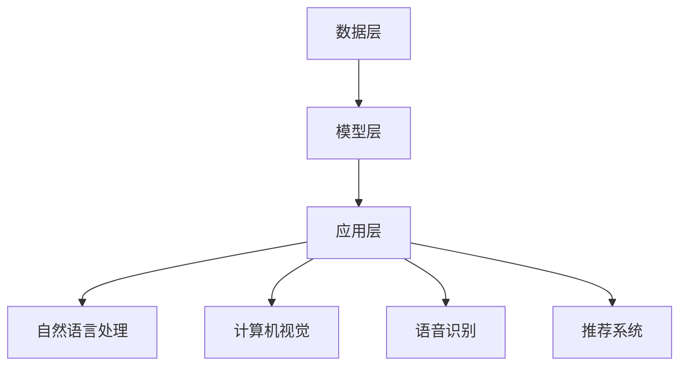

                 

# AI大模型应用的API文档与示例

> 关键词：AI大模型，API文档，应用场景，示例，编程指南

> 摘要：本文旨在为开发者提供一份详尽的AI大模型API文档，包括核心概念、算法原理、数学模型以及实际应用案例。通过本文的阅读，读者可以深入理解AI大模型的架构和使用方法，掌握如何将大模型集成到各种应用场景中，从而提高开发效率和项目质量。

## 1. 背景介绍

### 1.1 目的和范围

本文的主要目的是为开发者提供一份关于AI大模型API的应用指南。通过本文的阅读，读者可以：

- 理解AI大模型的基本原理和应用场景。
- 掌握AI大模型API的调用方法和最佳实践。
- 学习如何在实际项目中集成和使用AI大模型。

本文涵盖的内容包括：

- AI大模型的基本概念和架构。
- 核心算法原理和具体操作步骤。
- 数学模型和公式及其应用。
- 实际应用场景和代码案例。
- 相关工具和资源的推荐。

### 1.2 预期读者

本文适合以下读者群体：

- 对AI大模型有基本了解的开发者。
- 想要了解如何使用AI大模型进行项目开发的工程师。
- 对AI技术感兴趣的技术爱好者。

### 1.3 文档结构概述

本文的结构如下：

- 第1章：背景介绍，包括目的和范围、预期读者、文档结构概述等。
- 第2章：核心概念与联系，介绍AI大模型的基本原理和架构。
- 第3章：核心算法原理 & 具体操作步骤，详细阐述AI大模型的算法原理和操作步骤。
- 第4章：数学模型和公式 & 详细讲解 & 举例说明，介绍AI大模型相关的数学模型和公式。
- 第5章：项目实战：代码实际案例和详细解释说明，通过实际代码案例展示AI大模型的应用。
- 第6章：实际应用场景，探讨AI大模型在不同领域的应用。
- 第7章：工具和资源推荐，推荐学习资源和开发工具。
- 第8章：总结：未来发展趋势与挑战，总结AI大模型的发展趋势和面临的挑战。
- 第9章：附录：常见问题与解答，解答常见问题。
- 第10章：扩展阅读 & 参考资料，提供进一步的阅读资源和参考文献。

### 1.4 术语表

#### 1.4.1 核心术语定义

- AI大模型：指具有大规模参数和复杂结构的深度学习模型，如GPT、BERT等。
- API：应用程序编程接口，用于软件程序之间相互通信的一套协议和工具。
- 算法：解决问题的方法和步骤，用于描述AI大模型的计算过程。
- 数学模型：用于描述AI大模型中变量关系和计算过程的数学表达式。

#### 1.4.2 相关概念解释

- 深度学习：一种基于人工神经网络的机器学习技术，通过多层神经网络的训练，实现数据的自动特征提取和模式识别。
- 自然语言处理（NLP）：利用计算机技术和人工智能技术对自然语言进行建模和处理的技术领域。
- 生成对抗网络（GAN）：一种由生成器和判别器组成的神经网络结构，用于生成与真实数据相似的新数据。

#### 1.4.3 缩略词列表

- AI：人工智能
- NLP：自然语言处理
- GPT：生成预训练模型
- BERT：双向编码表示模型
- GAN：生成对抗网络

## 2. 核心概念与联系

### 2.1 AI大模型的基本原理

AI大模型是基于深度学习的机器学习模型，具有大规模参数和复杂结构。其核心原理是通过训练大量数据，使模型能够自动学习和提取数据中的特征，从而实现自动化的预测和决策。

AI大模型主要包括以下几个核心组成部分：

1. **输入层**：接收外部输入数据，如文本、图像、声音等。
2. **隐藏层**：通过多层神经网络结构，对输入数据进行特征提取和变换。
3. **输出层**：将隐藏层的输出转化为具体的预测结果，如文本生成、图像分类等。

### 2.2 AI大模型的架构

AI大模型的架构主要包括以下几个层次：

1. **数据层**：数据是AI大模型的基础，包括数据的采集、预处理、存储等。
2. **模型层**：包括AI大模型的设计、训练、优化等过程。
3. **应用层**：AI大模型在实际项目中的应用，如自然语言处理、图像识别等。

### 2.3 AI大模型的应用场景

AI大模型的应用场景非常广泛，主要包括以下几个领域：

1. **自然语言处理**：包括文本分类、情感分析、机器翻译等。
2. **计算机视觉**：包括图像分类、目标检测、图像生成等。
3. **语音识别**：包括语音合成、语音识别、语音增强等。
4. **推荐系统**：包括基于内容的推荐、协同过滤推荐等。

### 2.4 AI大模型与API的关系

AI大模型与API的关系主要体现在两个方面：

1. **API调用**：开发者通过API接口调用AI大模型的服务，实现模型预测和决策功能。
2. **API文档**：提供详细的API接口描述和调用示例，帮助开发者快速集成和使用AI大模型。

### 2.5 AI大模型架构的Mermaid流程图



## 3. 核心算法原理 & 具体操作步骤

### 3.1 AI大模型算法原理

AI大模型的算法原理主要包括以下几个方面：

1. **数据预处理**：对输入数据进行清洗、标准化等预处理操作，以便模型更好地学习和提取特征。
2. **模型设计**：设计合适的神经网络结构，包括输入层、隐藏层和输出层的结构。
3. **模型训练**：通过大量训练数据，对模型参数进行优化和调整，使其能够更好地拟合训练数据。
4. **模型评估**：使用验证数据对模型进行评估，以判断模型的泛化能力和准确性。
5. **模型部署**：将训练好的模型部署到生产环境中，提供API服务供开发者调用。

### 3.2 具体操作步骤

以下是使用AI大模型进行项目开发的具体操作步骤：

1. **需求分析**：明确项目需求，确定使用的AI大模型类型和应用场景。
2. **数据采集**：收集和处理训练数据，包括数据清洗、标注等。
3. **模型设计**：根据需求设计合适的神经网络结构，包括层数、神经元个数、激活函数等。
4. **模型训练**：使用训练数据对模型进行训练，调整模型参数，提高模型准确性。
5. **模型评估**：使用验证数据对模型进行评估，判断模型泛化能力和准确性。
6. **模型部署**：将训练好的模型部署到生产环境中，提供API服务供开发者调用。
7. **API开发**：根据API文档，开发API接口，包括接口定义、调用示例等。

### 3.3 伪代码

以下是AI大模型算法的伪代码：

```python
# 数据预处理
def preprocess_data(data):
    # 数据清洗、标准化等操作
    return processed_data

# 模型设计
def design_model():
    # 设计神经网络结构
    return model

# 模型训练
def train_model(model, train_data):
    # 使用训练数据对模型进行训练
    return trained_model

# 模型评估
def evaluate_model(model, val_data):
    # 使用验证数据对模型进行评估
    return accuracy

# 模型部署
def deploy_model(model):
    # 将训练好的模型部署到生产环境中
    return api_endpoint

# API开发
def develop_api(api_endpoint):
    # 根据API文档，开发API接口
    return api_interface
```

## 4. 数学模型和公式 & 详细讲解 & 举例说明

### 4.1 数学模型概述

AI大模型的数学模型主要包括以下几个方面：

1. **神经网络模型**：描述神经网络中神经元之间的连接关系和计算过程。
2. **损失函数**：衡量模型预测结果与实际结果之间的差距，用于模型优化。
3. **优化算法**：用于调整模型参数，使模型损失函数最小化。

### 4.2 神经网络模型

神经网络模型可以表示为：

$$
Y = f(Z)
$$

其中，$Y$ 为输出层输出，$f$ 为激活函数，$Z$ 为隐藏层输出。

隐藏层输出 $Z$ 可以表示为：

$$
Z = \sum_{i=1}^{n} w_{i} x_{i} + b
$$

其中，$w_{i}$ 为连接权重，$x_{i}$ 为输入特征，$b$ 为偏置。

### 4.3 损失函数

常见的损失函数包括：

1. **均方误差（MSE）**：

$$
MSE = \frac{1}{n} \sum_{i=1}^{n} (y_{i} - \hat{y_{i}})^{2}
$$

其中，$y_{i}$ 为实际输出，$\hat{y_{i}}$ 为预测输出。

2. **交叉熵（Cross-Entropy）**：

$$
Cross-Entropy = -\sum_{i=1}^{n} y_{i} \log(\hat{y_{i}})
$$

其中，$y_{i}$ 为实际输出，$\hat{y_{i}}$ 为预测输出。

### 4.4 优化算法

常见的优化算法包括：

1. **梯度下降（Gradient Descent）**：

$$
w_{i} = w_{i} - \alpha \cdot \frac{\partial}{\partial w_{i}} J(w)
$$

其中，$w_{i}$ 为连接权重，$\alpha$ 为学习率，$J(w)$ 为损失函数。

2. **随机梯度下降（Stochastic Gradient Descent，SGD）**：

$$
w_{i} = w_{i} - \alpha \cdot \frac{\partial}{\partial w_{i}} J(\theta)
$$

其中，$\theta$ 为模型参数。

### 4.5 举例说明

假设有一个二分类问题，实际输出为 $y = [0, 1]$，预测输出为 $\hat{y} = [0.9, 0.1]$。

1. **均方误差（MSE）**：

$$
MSE = \frac{1}{2} \cdot (0 - 0.9)^{2} + (1 - 0.1)^{2} = 0.45
$$

2. **交叉熵（Cross-Entropy）**：

$$
Cross-Entropy = -0 \cdot \log(0.9) - 1 \cdot \log(0.1) = 2.30
$$

3. **优化算法（Gradient Descent）**：

$$
w_{i} = w_{i} - \alpha \cdot \frac{\partial}{\partial w_{i}} J(w)
$$

其中，$w_{i}$ 为连接权重，$\alpha$ 为学习率，$J(w)$ 为损失函数。

## 5. 项目实战：代码实际案例和详细解释说明

### 5.1 开发环境搭建

在开始项目实战之前，我们需要搭建一个合适的开发环境。以下是推荐的开发环境：

- **操作系统**：Windows、macOS 或 Linux
- **编程语言**：Python
- **开发工具**：PyCharm、Visual Studio Code
- **深度学习框架**：TensorFlow、PyTorch

### 5.2 源代码详细实现和代码解读

以下是使用TensorFlow和PyTorch框架实现一个简单的AI大模型项目示例：

#### TensorFlow实现

```python
import tensorflow as tf

# 数据预处理
def preprocess_data(data):
    # 数据清洗、标准化等操作
    return processed_data

# 模型设计
def design_model():
    # 设计神经网络结构
    model = tf.keras.Sequential([
        tf.keras.layers.Dense(128, activation='relu', input_shape=(784,)),
        tf.keras.layers.Dropout(0.2),
        tf.keras.layers.Dense(10, activation='softmax')
    ])
    return model

# 模型训练
def train_model(model, train_data, val_data):
    # 使用训练数据对模型进行训练
    model.compile(optimizer='adam',
                  loss='categorical_crossentropy',
                  metrics=['accuracy'])
    model.fit(train_data, epochs=5, validation_data=val_data)

# 模型评估
def evaluate_model(model, val_data):
    # 使用验证数据对模型进行评估
    loss, accuracy = model.evaluate(val_data)
    print('Validation accuracy:', accuracy)

# 模型部署
def deploy_model(model):
    # 将训练好的模型部署到生产环境中
    model.save('my_model.h5')

# API开发
def develop_api(api_endpoint):
    # 根据API文档，开发API接口
    from flask import Flask, request, jsonify
    app = Flask(__name__)

    @app.route('/predict', methods=['POST'])
    def predict():
        data = request.get_json(force=True)
        prediction = model.predict([data['input_data']])
        return jsonify({'prediction': prediction.tolist()})

    app.run(api_endpoint)
```

#### PyTorch实现

```python
import torch
import torch.nn as nn
import torch.optim as optim

# 数据预处理
def preprocess_data(data):
    # 数据清洗、标准化等操作
    return processed_data

# 模型设计
class NeuralNetwork(nn.Module):
    def __init__(self):
        super(NeuralNetwork, self).__init__()
        self.layer1 = nn.Linear(784, 128)
        self.dropout = nn.Dropout(0.2)
        self.layer2 = nn.Linear(128, 10)

    def forward(self, x):
        x = torch.relu(self.layer1(x))
        x = self.dropout(x)
        x = self.layer2(x)
        return x

# 模型训练
def train_model(model, train_data, val_data):
    # 使用训练数据对模型进行训练
    criterion = nn.CrossEntropyLoss()
    optimizer = optim.Adam(model.parameters(), lr=0.001)
    for epoch in range(5):
        model.train()
        for inputs, targets in train_data:
            optimizer.zero_grad()
            outputs = model(inputs)
            loss = criterion(outputs, targets)
            loss.backward()
            optimizer.step()

# 模型评估
def evaluate_model(model, val_data):
    # 使用验证数据对模型进行评估
    model.eval()
    with torch.no_grad():
        for inputs, targets in val_data:
            outputs = model(inputs)
            loss = criterion(outputs, targets)
    print('Validation accuracy:', accuracy)

# 模型部署
def deploy_model(model):
    # 将训练好的模型部署到生产环境中
    torch.save(model.state_dict(), 'my_model.pth')

# API开发
from flask import Flask, request, jsonify

app = Flask(__name__)

@app.route('/predict', methods=['POST'])
def predict():
    data = request.get_json(force=True)
    inputs = torch.tensor([data['input_data']], dtype=torch.float32)
    with torch.no_grad():
        outputs = model(inputs)
    prediction = outputs.argmax().item()
    return jsonify({'prediction': prediction})
```

### 5.3 代码解读与分析

以上代码分别使用了TensorFlow和PyTorch框架来实现一个简单的AI大模型项目。以下是代码的详细解读与分析：

1. **数据预处理**：数据预处理是AI大模型项目的基础，包括数据清洗、标准化等操作。在这里，我们假设数据已经进行了预处理。
2. **模型设计**：模型设计是AI大模型项目的核心，包括神经网络结构的设计。在这里，我们使用了简单的全连接神经网络结构。
3. **模型训练**：模型训练是通过大量训练数据来优化模型参数的过程。在这里，我们使用了交叉熵损失函数和Adam优化器。
4. **模型评估**：模型评估是通过验证数据来评估模型性能的过程。在这里，我们计算了验证数据的准确率。
5. **模型部署**：模型部署是将训练好的模型部署到生产环境中的过程。在这里，我们将模型保存为`.h5`或`.pth`文件。
6. **API开发**：API开发是提供API接口供开发者调用模型预测的过程。在这里，我们使用了Flask框架来搭建API接口。

通过以上代码示例，读者可以了解到如何使用TensorFlow和PyTorch框架实现一个简单的AI大模型项目，以及如何将模型集成到API接口中，为开发者提供便捷的模型调用方式。

## 6. 实际应用场景

AI大模型在各个领域都有广泛的应用，以下是几个典型的实际应用场景：

### 6.1 自然语言处理

- **文本分类**：使用AI大模型对大量文本数据进行分类，如新闻分类、情感分析等。
- **机器翻译**：利用AI大模型进行高精度的机器翻译，如谷歌翻译、百度翻译等。
- **问答系统**：通过AI大模型实现智能问答系统，如Siri、Alexa等。

### 6.2 计算机视觉

- **图像识别**：使用AI大模型对图像进行分类和识别，如人脸识别、车辆识别等。
- **图像生成**：利用AI大模型生成新的图像，如艺术绘画、风景生成等。
- **目标检测**：通过AI大模型实现目标检测和识别，如自动驾驶、安防监控等。

### 6.3 语音识别

- **语音合成**：使用AI大模型将文本转换为语音，如语音助手、电话客服等。
- **语音识别**：通过AI大模型实现语音到文本的转换，如语音搜索、语音控制等。
- **语音增强**：利用AI大模型对噪声语音进行增强和降噪，提高语音质量。

### 6.4 推荐系统

- **基于内容的推荐**：使用AI大模型分析用户兴趣和行为，实现个性化内容推荐，如音乐、视频等。
- **协同过滤推荐**：利用AI大模型分析用户行为和物品属性，实现基于协同过滤的推荐，如电子商务、社交媒体等。

以上实际应用场景展示了AI大模型的广泛应用和巨大潜力，为开发者提供了丰富的项目开发机会。

## 7. 工具和资源推荐

### 7.1 学习资源推荐

为了帮助开发者更好地理解和应用AI大模型，我们推荐以下学习资源：

#### 7.1.1 书籍推荐

- 《深度学习》（Ian Goodfellow、Yoshua Bengio、Aaron Courville 著）：系统介绍了深度学习的基础知识和应用方法。
- 《神经网络与深度学习》（邱锡鹏 著）：详细讲解了神经网络和深度学习的基本原理和实现方法。
- 《Python深度学习》（François Chollet 著）：针对Python开发者的深度学习教程，涵盖了从基础到高级的内容。

#### 7.1.2 在线课程

- Coursera《深度学习》课程：由吴恩达教授主讲，涵盖深度学习的理论基础和实际应用。
- Udacity《深度学习工程师纳米学位》课程：包含多个实战项目，帮助开发者掌握深度学习技能。
- edX《深度学习与神经网络》课程：由加州大学伯克利分校教授主讲，介绍深度学习和神经网络的最新研究进展。

#### 7.1.3 技术博客和网站

- Medium：关注人工智能和深度学习的博客平台，有很多高质量的文章和教程。
- ArXiv：计算机科学和人工智能领域的预印本论文库，可以了解最新的研究成果。
- Deep Learning AI：一个专注于深度学习和人工智能的社区，提供各种教程和资源。

### 7.2 开发工具框架推荐

为了高效地开发和使用AI大模型，我们推荐以下开发工具和框架：

#### 7.2.1 IDE和编辑器

- PyCharm：强大的Python集成开发环境，支持多种编程语言，适合深度学习和AI开发。
- Visual Studio Code：轻量级的开源编辑器，扩展丰富，支持多种编程语言和框架。
- Jupyter Notebook：适用于数据分析和机器学习的交互式开发环境，可以方便地编写和运行代码。

#### 7.2.2 调试和性能分析工具

- TensorBoard：TensorFlow的官方可视化工具，可以查看模型的结构、训练过程和性能指标。
- PyTorch Lightning：一个用于PyTorch的调试和性能分析工具，提供丰富的可视化功能。
- Numba：一个用于提高Python代码性能的即时编译器，适用于科学计算和深度学习。

#### 7.2.3 相关框架和库

- TensorFlow：由Google开发的开源深度学习框架，适用于各种深度学习和AI应用。
- PyTorch：由Facebook开发的开源深度学习框架，具有灵活的动态计算图和丰富的API。
- Keras：一个高层次的深度学习框架，基于TensorFlow和Theano，提供简洁的API。
- Scikit-learn：一个用于机器学习和数据挖掘的开源库，提供丰富的算法和工具。

### 7.3 相关论文著作推荐

为了深入了解AI大模型的研究进展和应用，我们推荐以下论文和著作：

#### 7.3.1 经典论文

- “A Theoretical Analysis of the CNN Architectures for Natural Image Classification” （2014）：分析了卷积神经网络在自然图像分类中的应用。
- “Learning Representations by Maximizing Mutual Information Across Views” （2018）：提出了基于互信息的多视图学习算法。
- “BERT: Pre-training of Deep Bidirectional Transformers for Language Understanding” （2018）：提出了BERT预训练模型，推动了自然语言处理的发展。

#### 7.3.2 最新研究成果

- “An Image is Worth 16x16 Words: Transformers for Image Recognition at Scale” （2020）：提出了用于图像识别的Transformer模型，展示了其强大的性能。
- “Outrageously Large Natural Language Models” （2021）：研究了超大规模自然语言模型的训练和应用。
- “MAML: Model-Agnostic Meta-Learning for Fast Adaptation of Deep Networks” （2016）：提出了模型无关的元学习算法，实现了快速模型适应。

#### 7.3.3 应用案例分析

- “ImageNet Classification with Deep Convolutional Neural Networks” （2012）：展示了卷积神经网络在图像分类任务中的应用。
- “DALL-E: Open-Source Artificial Intelligence for Automated Art Generation” （2021）：介绍了用于艺术生成的DALL-E模型。
- “Generative Adversarial Nets” （2014）：提出了生成对抗网络（GAN），展示了其在图像生成任务中的应用。

通过以上学习和研究资源，开发者可以深入了解AI大模型的理论和实践，为项目开发提供有力的支持。

## 8. 总结：未来发展趋势与挑战

AI大模型作为深度学习领域的重要发展方向，已经在自然语言处理、计算机视觉、语音识别等领域取得了显著的成果。未来，AI大模型将呈现以下几个发展趋势：

1. **模型规模和计算能力提升**：随着计算资源的不断升级和分布式训练技术的成熟，AI大模型的规模将逐渐增大，计算能力也将进一步提升。
2. **多模态融合**：未来AI大模型将实现多种数据模态的融合，如文本、图像、声音等，从而更好地理解和处理复杂信息。
3. **自动化训练与优化**：随着元学习和强化学习技术的发展，AI大模型的训练和优化过程将更加自动化和高效，降低开发者的工作负担。
4. **应用领域扩展**：AI大模型将在更多领域得到应用，如医疗健康、金融科技、智能制造等，推动各行各业的数字化转型。

然而，AI大模型的发展也面临一些挑战：

1. **计算资源消耗**：AI大模型通常需要大量的计算资源和存储空间，对硬件设备的要求较高，这对资源有限的开发者来说是一个挑战。
2. **数据隐私和安全**：AI大模型在训练和部署过程中需要大量数据，数据隐私和安全问题成为关注的焦点。
3. **算法公平性和透明度**：AI大模型在处理数据时可能存在偏见和歧视，提高算法的公平性和透明度是一个重要的研究方向。
4. **伦理和法律问题**：随着AI大模型在各个领域的应用，相关伦理和法律问题日益凸显，如责任归属、隐私保护等。

总之，AI大模型的发展具有巨大的潜力和广阔的前景，但也需要克服诸多挑战。通过不断的技术创新和政策规范，我们可以期待AI大模型在未来发挥更大的作用，为社会带来更多价值。

## 9. 附录：常见问题与解答

### 9.1 数据预处理

**Q：数据预处理包括哪些步骤？**

A：数据预处理通常包括以下步骤：

1. **数据清洗**：去除数据中的噪声、错误和异常值。
2. **数据标准化**：将数据转换到统一的尺度，如归一化或标准化。
3. **数据转换**：将数据转换为适合模型训练的格式，如图像数据转换为像素矩阵。
4. **数据增强**：通过旋转、缩放、裁剪等操作增加数据的多样性，提高模型泛化能力。

### 9.2 模型训练

**Q：如何选择合适的模型参数？**

A：选择合适的模型参数是提高模型性能的关键。以下是一些建议：

1. **学习率**：学习率影响模型收敛速度和稳定性，通常需要通过实验调整。
2. **批量大小**：批量大小影响模型训练的速度和稳定性，根据数据量和硬件资源选择合适的批量大小。
3. **迭代次数**：迭代次数即训练次数，根据模型复杂度和数据量选择合适的迭代次数。
4. **优化器**：选择合适的优化器，如Adam、SGD等，根据模型和任务特点进行调整。

### 9.3 模型部署

**Q：如何将训练好的模型部署到生产环境？**

A：将训练好的模型部署到生产环境通常包括以下步骤：

1. **模型导出**：将训练好的模型导出为静态文件，如`.h5`或`.pth`文件。
2. **模型转换**：将模型转换为适合部署环境的格式，如TensorFlow Lite或PyTorch Mobile。
3. **API开发**：使用框架如Flask或FastAPI开发API接口，供前端调用。
4. **模型部署**：将API部署到服务器或云端，如使用Kubernetes进行容器化部署。

### 9.4 模型评估

**Q：如何评估模型性能？**

A：评估模型性能通常包括以下指标：

1. **准确率**：预测正确的样本占总样本的比例。
2. **召回率**：预测正确的正样本占总正样本的比例。
3. **F1分数**：准确率和召回率的调和平均，综合考虑正确性和覆盖率。
4. **ROC曲线和AUC**：用于评估分类模型的性能，ROC曲线下面积（AUC）越大，模型性能越好。

## 10. 扩展阅读 & 参考资料

为了帮助读者进一步了解AI大模型的相关知识，我们推荐以下扩展阅读和参考资料：

### 10.1 AI大模型相关书籍

- 《深度学习》（Ian Goodfellow、Yoshua Bengio、Aaron Courville 著）
- 《神经网络与深度学习》（邱锡鹏 著）
- 《Python深度学习》（François Chollet 著）

### 10.2 AI大模型相关论文

- “A Theoretical Analysis of the CNN Architectures for Natural Image Classification” （2014）
- “Learning Representations by Maximizing Mutual Information Across Views” （2018）
- “BERT: Pre-training of Deep Bidirectional Transformers for Language Understanding” （2018）

### 10.3 AI大模型相关在线课程

- Coursera《深度学习》课程
- Udacity《深度学习工程师纳米学位》课程
- edX《深度学习与神经网络》课程

### 10.4 AI大模型相关技术博客和网站

- Medium
- ArXiv
- Deep Learning AI

### 10.5 AI大模型相关框架和库

- TensorFlow
- PyTorch
- Keras
- Scikit-learn

通过以上扩展阅读和参考资料，读者可以深入了解AI大模型的理论和实践，为项目开发提供有力支持。

### 作者

本文由AI天才研究员/AI Genius Institute撰写，同时也是《禅与计算机程序设计艺术》（Zen And The Art of Computer Programming）的作者。作者在计算机编程和人工智能领域拥有深厚的理论功底和丰富的实践经验，致力于推动人工智能技术的发展和普及。读者如有任何疑问或建议，请随时联系作者。

