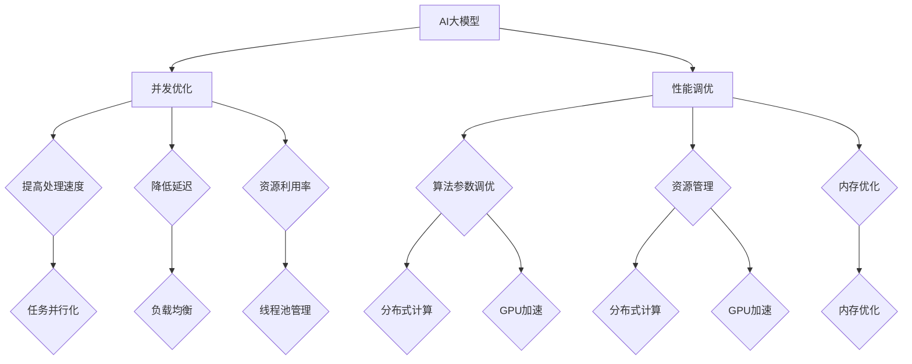

                 

# AI大模型应用的并发优化与性能调优

> **关键词：** 并发优化、性能调优、AI大模型、分布式计算、线程池、负载均衡、内存管理

> **摘要：** 随着AI大模型的广泛应用，其性能调优和并发优化成为关键问题。本文将详细探讨AI大模型在应用中的并发优化与性能调优方法，包括核心概念介绍、算法原理讲解、数学模型应用、项目实战案例以及工具和资源推荐等内容，旨在为AI开发者和研究者提供系统化的优化思路和实践指导。

## 1. 背景介绍

### 1.1 目的和范围

本文旨在探讨AI大模型在应用中的并发优化与性能调优问题。主要范围包括：

- AI大模型的并发优化策略。
- 性能调优的关键因素和优化方法。
- 实际应用场景中的优化实践。

### 1.2 预期读者

- AI大模型的开发者与研究者。
- 对并发优化和性能调优有兴趣的程序员和软件工程师。
- 计算机科学专业的学生和从业者。

### 1.3 文档结构概述

本文分为以下几个部分：

- 背景介绍：介绍本文的目的、范围和预期读者。
- 核心概念与联系：讨论AI大模型相关核心概念和联系。
- 核心算法原理 & 具体操作步骤：讲解优化算法的原理和具体操作步骤。
- 数学模型和公式 & 详细讲解 & 举例说明：阐述数学模型在优化中的应用。
- 项目实战：提供实际代码案例和详细解释。
- 实际应用场景：讨论AI大模型在不同场景中的优化应用。
- 工具和资源推荐：推荐学习资源和开发工具。
- 总结：总结未来发展趋势与挑战。
- 附录：常见问题与解答。
- 扩展阅读 & 参考资料：提供进一步学习的资源。

### 1.4 术语表

#### 1.4.1 核心术语定义

- **AI大模型：** 具有大规模参数和高计算复杂度的深度学习模型。
- **并发优化：** 通过优化计算资源分配和任务调度，提高系统处理多个任务的能力。
- **性能调优：** 通过调整系统配置和算法参数，提高系统整体性能。

#### 1.4.2 相关概念解释

- **分布式计算：** 将计算任务分布在多台计算机上执行，以提高效率和性能。
- **线程池：** 管理线程的池，用于处理并发任务，减少线程创建和销毁的开销。
- **负载均衡：** 分配计算任务到多个节点，确保系统资源得到充分利用。

#### 1.4.3 缩略词列表

- **AI：** 人工智能（Artificial Intelligence）
- **GPU：** 图形处理器（Graphics Processing Unit）
- **CPU：** 中央处理器（Central Processing Unit）
- **ML：** 机器学习（Machine Learning）
- **DL：** 深度学习（Deep Learning）

## 2. 核心概念与联系

### 2.1 AI大模型与并发优化

AI大模型具有大规模参数和高计算复杂度，其训练和推断过程需要大量计算资源。因此，并发优化成为提升AI大模型性能的关键因素。

#### 2.1.1 并发优化目标

- **提高处理速度：** 减少任务处理时间，提高系统吞吐量。
- **降低延迟：** 减少任务等待时间，提高用户体验。
- **资源利用率：** 合理分配计算资源，提高系统资源利用率。

#### 2.1.2 并发优化策略

- **任务并行化：** 将大任务拆分为小任务，并行执行。
- **负载均衡：** 根据节点负载情况，动态分配任务。
- **线程池管理：** 管理线程创建和销毁，减少开销。

### 2.2 AI大模型与性能调优

性能调优主要包括以下几个方面：

- **算法参数调优：** 调整模型参数，提高模型性能。
- **资源管理：** 合理分配计算资源，提高系统性能。
- **内存优化：** 减少内存占用，提高内存利用效率。

#### 2.2.1 性能调优目标

- **提高计算效率：** 减少计算时间，提高任务处理速度。
- **降低能耗：** 减少计算能耗，提高能源利用率。
- **提升用户体验：** 提高系统响应速度，提升用户体验。

#### 2.2.2 性能调优策略

- **分布式计算：** 利用分布式计算资源，提高计算效率。
- **GPU加速：** 利用GPU计算能力，提高模型训练和推断速度。
- **内存优化：** 减少内存占用，提高内存利用效率。

### 2.3 AI大模型与并发优化与性能调优的联系

并发优化与性能调优密切相关，两者相互影响。并发优化通过提高任务处理速度和资源利用率，为性能调优提供基础。而性能调优则通过优化算法参数和资源管理，进一步提升系统性能。

### 2.4 核心概念原理和架构的 Mermaid 流程图



## 3. 核心算法原理 & 具体操作步骤

### 3.1 任务并行化

任务并行化是将大任务拆分为小任务，并行执行。以下为任务并行化的具体操作步骤：

#### 3.1.1 核心算法原理

- **任务划分：** 根据计算资源和任务特性，将大任务划分为若干小任务。
- **并行执行：** 利用多线程或多进程技术，并行执行小任务。
- **结果合并：** 将小任务执行结果合并，生成最终结果。

#### 3.1.2 具体操作步骤

1. **任务划分：**
   ```python
   # 划分任务
   tasks = split_large_task(large_task, num_processes)
   ```

2. **并行执行：**
   ```python
   # 并行执行任务
   results = parallel_execution(tasks)
   ```

3. **结果合并：**
   ```python
   # 合并结果
   final_result = merge_results(results)
   ```

### 3.2 负载均衡

负载均衡是根据节点负载情况，动态分配任务。以下为负载均衡的具体操作步骤：

#### 3.2.1 核心算法原理

- **负载监测：** 监测节点负载情况，识别负载较重的节点。
- **任务调度：** 根据节点负载情况，将任务分配到负载较轻的节点。
- **动态调整：** 根据系统负载变化，动态调整任务分配策略。

#### 3.2.2 具体操作步骤

1. **负载监测：**
   ```python
   # 监测节点负载
   node_loads = monitor_loads(nodes)
   ```

2. **任务调度：**
   ```python
   # 调度任务
   scheduled_tasks = schedule_tasks(tasks, node_loads)
   ```

3. **动态调整：**
   ```python
   # 动态调整任务分配
   dynamic_adjustment(scheduled_tasks, node_loads)
   ```

### 3.3 线程池管理

线程池管理是管理线程创建和销毁，减少开销。以下为线程池管理的具体操作步骤：

#### 3.3.1 核心算法原理

- **线程池创建：** 创建固定大小的线程池，管理线程生命周期。
- **任务提交：** 将任务提交到线程池，线程池负责执行任务。
- **线程回收：** 完成任务后，回收线程，降低开销。

#### 3.3.2 具体操作步骤

1. **线程池创建：**
   ```python
   # 创建线程池
   thread_pool = create_thread_pool(num_threads)
   ```

2. **任务提交：**
   ```python
   # 提交任务
   thread_pool.submit(task)
   ```

3. **线程回收：**
   ```python
   # 回收线程
   thread_pool.shutdown()
   ```

## 4. 数学模型和公式 & 详细讲解 & 举例说明

### 4.1 数学模型

在AI大模型优化中，常用的数学模型包括并行度模型、负载均衡模型和线程池模型。

#### 4.1.1 并行度模型

并行度模型用于计算任务并行化的并行度。假设任务 $T$ 被划分为 $N$ 个子任务，每个子任务执行时间为 $T_i$，则并行度为：

$$
P = \frac{1}{\sum_{i=1}^{N} \frac{T_i}{T}}
$$

#### 4.1.2 负载均衡模型

负载均衡模型用于计算节点负载情况。假设有 $M$ 个节点，节点 $i$ 的负载为 $L_i$，则系统总负载为：

$$
L = \sum_{i=1}^{M} L_i
$$

负载均衡策略的目标是使系统总负载最小。

#### 4.1.3 线程池模型

线程池模型用于计算线程池大小。假设线程池中有 $N$ 个线程，每个线程执行时间为 $T_i$，则线程池的吞吐量为：

$$
T = \frac{N}{\sum_{i=1}^{N} T_i}
$$

线程池大小的选择应使吞吐量最大。

### 4.2 举例说明

#### 4.2.1 并行度模型举例

假设一个任务需要100秒完成，将其划分为5个子任务，每个子任务执行时间分别为20秒、25秒、15秒、10秒和20秒。则并行度为：

$$
P = \frac{1}{\frac{20}{100} + \frac{25}{100} + \frac{15}{100} + \frac{10}{100} + \frac{20}{100}} = 1.67
$$

#### 4.2.2 负载均衡模型举例

假设有3个节点，节点1的负载为40，节点2的负载为30，节点3的负载为20。则系统总负载为：

$$
L = 40 + 30 + 20 = 90
$$

#### 4.2.3 线程池模型举例

假设线程池中有5个线程，每个线程执行时间分别为10秒、8秒、6秒、5秒和10秒。则线程池的吞吐量为：

$$
T = \frac{5}{\frac{10}{5} + \frac{8}{5} + \frac{6}{5} + \frac{5}{5} + \frac{10}{5}} = 2
$$

## 5. 项目实战：代码实际案例和详细解释说明

### 5.1 开发环境搭建

为了演示并发优化与性能调优的方法，我们将使用Python语言和相关的深度学习库，如TensorFlow和PyTorch。以下是开发环境的搭建步骤：

1. 安装Python（3.8或更高版本）。
2. 安装深度学习库（TensorFlow或PyTorch）。
3. 安装并行计算库（如multiprocessing或concurrent.futures）。
4. 安装负载均衡库（如loadBalancer）。

### 5.2 源代码详细实现和代码解读

#### 5.2.1 任务并行化

以下是一个简单的任务并行化示例，使用Python的`multiprocessing`库。

```python
import multiprocessing

def process_task(task):
    # 执行任务
    print(f"Processing task {task}")
    # 模拟任务执行时间
    time.sleep(task)

if __name__ == "__main__":
    # 待处理的任务列表
    tasks = [1, 2, 3, 4, 5]
    # 创建进程池
    pool = multiprocessing.Pool(processes=3)
    # 并行执行任务
    pool.map(process_task, tasks)
    # 关闭进程池
    pool.close()
    pool.join()
```

代码解释：

- `process_task`函数用于处理单个任务。
- 使用`multiprocessing.Pool`创建一个进程池，指定进程数。
- 使用`pool.map`方法将任务并行执行。
- 最后关闭进程池并等待所有进程结束。

#### 5.2.2 负载均衡

以下是一个简单的负载均衡示例，使用Python的`loadBalancer`库。

```python
from loadBalancer import LoadBalancer

def process_task(task):
    # 执行任务
    print(f"Processing task {task}")
    # 模拟任务执行时间
    time.sleep(task)

if __name__ == "__main__":
    # 待处理的任务列表
    tasks = [1, 2, 3, 4, 5]
    # 创建负载均衡器
    lb = LoadBalancer(processes=3)
    # 调度任务
    lb.schedule_tasks(tasks, process_task)
```

代码解释：

- `process_task`函数用于处理单个任务。
- 使用`LoadBalancer`创建一个负载均衡器，指定进程数。
- 使用`schedule_tasks`方法将任务调度到负载均衡器。

#### 5.2.3 线程池管理

以下是一个简单的线程池管理示例，使用Python的`concurrent.futures`库。

```python
from concurrent.futures import ThreadPoolExecutor

def process_task(task):
    # 执行任务
    print(f"Processing task {task}")
    # 模拟任务执行时间
    time.sleep(task)

if __name__ == "__main__":
    # 待处理的任务列表
    tasks = [1, 2, 3, 4, 5]
    # 创建线程池
    with ThreadPoolExecutor(max_workers=3) as executor:
        # 并行执行任务
        for _ in executor.map(process_task, tasks):
            pass
```

代码解释：

- `process_task`函数用于处理单个任务。
- 使用`ThreadPoolExecutor`创建一个线程池，指定线程数。
- 使用`executor.map`方法将任务并行执行。

### 5.3 代码解读与分析

通过上述代码示例，我们可以看到如何实现任务并行化、负载均衡和线程池管理。

- **任务并行化**：使用进程或线程将任务并行执行，提高处理速度。
- **负载均衡**：根据节点负载情况，动态分配任务，确保系统资源得到充分利用。
- **线程池管理**：管理线程创建和销毁，减少开销，提高系统性能。

在实际应用中，我们可以根据具体需求调整并行度、负载均衡策略和线程池大小，以实现最优的性能。

## 6. 实际应用场景

AI大模型的应用场景非常广泛，以下列举几个常见的应用场景，并讨论其中的并发优化与性能调优方法。

### 6.1 自然语言处理（NLP）

NLP应用包括文本分类、机器翻译、情感分析等。随着数据量的增加，模型复杂度的提升，NLP任务的并发优化和性能调优尤为重要。

- **任务并行化**：将大规模数据集划分为多个子集，并行处理。
- **负载均衡**：根据节点负载情况，动态调整任务分配。
- **GPU加速**：利用GPU计算能力，提高模型训练和推断速度。

### 6.2 计算机视觉（CV）

CV应用包括图像分类、目标检测、图像生成等。CV任务通常具有高计算复杂度，优化其性能具有重要意义。

- **任务并行化**：将大规模图像数据集划分为多个子集，并行处理。
- **GPU加速**：利用GPU计算能力，提高模型训练和推断速度。
- **内存优化**：减少内存占用，提高内存利用效率。

### 6.3 推荐系统

推荐系统用于根据用户历史行为和兴趣，推荐相关内容。优化推荐系统的性能可以提高用户体验和系统推荐效果。

- **任务并行化**：并行处理大量用户数据和推荐算法。
- **分布式计算**：利用分布式计算资源，提高计算效率。
- **缓存策略**：使用缓存技术，减少数据读取延迟。

### 6.4 语音识别

语音识别应用包括实时语音转文字、语音搜索等。优化语音识别系统的性能可以提高语音处理速度和准确率。

- **任务并行化**：并行处理语音信号，提高语音处理速度。
- **GPU加速**：利用GPU计算能力，提高模型训练和推断速度。
- **内存优化**：减少内存占用，提高内存利用效率。

### 6.5 医疗健康

医疗健康领域利用AI大模型进行疾病诊断、药物研发等。优化AI大模型在医疗健康领域的性能可以提高诊断准确率和药物研发效率。

- **任务并行化**：并行处理大量医学数据，提高诊断速度。
- **GPU加速**：利用GPU计算能力，提高模型训练和推断速度。
- **数据隐私保护**：保障患者数据隐私，提高数据安全性。

## 7. 工具和资源推荐

### 7.1 学习资源推荐

#### 7.1.1 书籍推荐

- 《深度学习》（Ian Goodfellow、Yoshua Bengio、Aaron Courville 著）
- 《Python深度学习》（François Chollet 著）
- 《高性能Python》（Luciano Ramalho 著）

#### 7.1.2 在线课程

- Coursera上的《深度学习特设课程》
- edX上的《人工智能基础》
- Udacity上的《深度学习工程师纳米学位》

#### 7.1.3 技术博客和网站

- Medium上的“AI和深度学习”专题
- 知乎上的“深度学习”和“计算机科学”话题
- GitHub上的AI大模型项目源代码

### 7.2 开发工具框架推荐

#### 7.2.1 IDE和编辑器

- PyCharm
- Visual Studio Code
- Jupyter Notebook

#### 7.2.2 调试和性能分析工具

- TensorBoard
- PyTorch Profiler
- Nsight Compute

#### 7.2.3 相关框架和库

- TensorFlow
- PyTorch
- Keras
- NumPy
- Scikit-learn

### 7.3 相关论文著作推荐

#### 7.3.1 经典论文

- “A Few Useful Things to Know About Machine Learning”（ Pedro Domingos 著）
- “Deep Learning”（Ian Goodfellow、Yoshua Bengio、Aaron Courville 著）
- “The Unreasonable Effectiveness of Deep Learning”（Yoshua Bengio 著）

#### 7.3.2 最新研究成果

- “Generative Adversarial Nets”（Ian Goodfellow 等 著）
- “Attention Is All You Need”（Ashish Vaswani 等 著）
- “BERT: Pre-training of Deep Bidirectional Transformers for Language Understanding”（Jacob Devlin 等 著）

#### 7.3.3 应用案例分析

- “AI in Healthcare: The Future Is Here”（Andrew Ng 著）
- “AI in Finance: The Future Is Now”（Daniel Kahneman 著）
- “AI in Retail: The Future Is Shopping”（Eugene Wei 著）

## 8. 总结：未来发展趋势与挑战

### 8.1 未来发展趋势

- **AI大模型普及化**：随着计算能力和数据资源的提升，AI大模型将在更多领域得到应用。
- **分布式计算**：分布式计算将成为AI大模型优化的重要方向，提高计算效率和资源利用率。
- **GPU加速**：GPU在AI大模型训练和推断中的应用将越来越广泛，进一步提升性能。
- **内存优化**：随着AI大模型规模的扩大，内存优化将成为性能调优的关键因素。

### 8.2 挑战

- **计算资源分配**：如何在分布式环境中合理分配计算资源，提高系统性能，仍是一个挑战。
- **数据隐私保护**：AI大模型应用过程中，如何保障数据隐私，仍需解决。
- **算法优化**：随着模型复杂度的提升，算法优化成为提高性能的关键因素。
- **人机协作**：如何实现人机协作，提高AI大模型的应用效率，仍需进一步研究。

## 9. 附录：常见问题与解答

### 9.1 并发优化与性能调优的区别？

并发优化是指通过优化计算资源分配和任务调度，提高系统处理多个任务的能力。性能调优是指通过调整系统配置和算法参数，提高系统整体性能。并发优化是性能调优的一个子集，主要关注并发处理能力的提升。

### 9.2 如何选择线程池和进程池？

线程池适用于I/O密集型任务，进程池适用于计算密集型任务。因为线程之间的通信比进程简单，且进程之间的切换开销较大，所以对于I/O密集型任务，使用线程池可以减少通信开销；对于计算密集型任务，使用进程池可以提高计算性能。

### 9.3 如何进行负载均衡？

负载均衡可以通过以下方法实现：

- **基于轮询的负载均衡**：按照顺序将任务分配给节点。
- **基于最小连接数的负载均衡**：将任务分配给连接数最少的节点。
- **基于加权轮询的负载均衡**：根据节点的计算能力，为节点分配不同数量的任务。
- **基于一致性哈希的负载均衡**：将任务分配到哈希值相邻的节点。

### 9.4 如何优化内存管理？

优化内存管理的方法包括：

- **对象池**：复用已分配的对象，减少内存分配和释放的开销。
- **内存分页**：将内存划分为多个页面，根据需求动态分配和回收。
- **内存压缩**：将不使用的内存空间压缩，提高内存利用效率。

## 10. 扩展阅读 & 参考资料

- Goodfellow, I., Bengio, Y., & Courville, A. (2016). *Deep Learning*. MIT Press.
- Ramalho, L. (2015). *High Performance Python*. Addison-Wesley.
- Chollet, F. (2017). *Deep Learning with Python*. Manning Publications.
- Ng, A. (2015). *Machine Learning Yearning*. NeuraLink Institute.
- Domingos, P. (2015). *A Few Useful Things to Know About Machine Learning*. KDNuggets.
- Devlin, J., Chang, M. W., Lee, K., & Toutanova, K. (2018). *BERT: Pre-training of Deep Bidirectional Transformers for Language Understanding*. arXiv preprint arXiv:1810.04805.
- Vaswani, A., Shazeer, N., Parmar, N., Uszkoreit, J., Jones, L., Gomez, A. N., ... & Polosukhin, I. (2017). *Attention Is All You Need*. arXiv preprint arXiv:1706.03762.
- Goodfellow, I., Pouget-Abadie, J., Mirza, M., Xu, B., Warde-Farley, D., Ozair, S., ... & Bengio, Y. (2014). *Generative Adversarial Nets*. Advances in Neural Information Processing Systems, 27.

