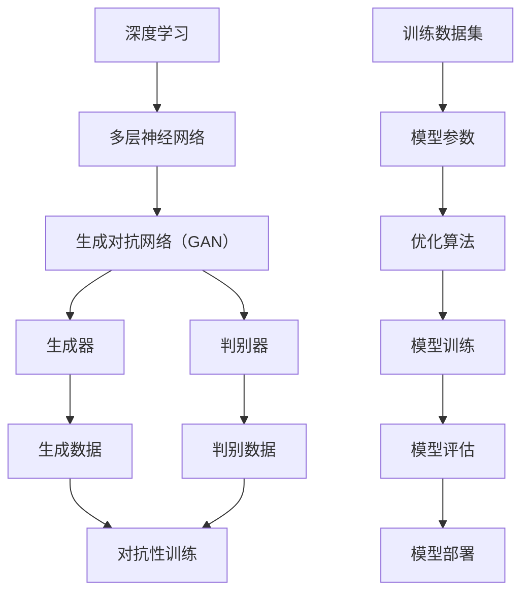

                 

### 1. 背景介绍

#### 1.1 目的和范围

本文旨在探讨人工智能大模型在应用领域的预研与探索。随着深度学习技术的迅猛发展，人工智能大模型（如大型神经网络、生成对抗网络等）已经在自然语言处理、计算机视觉、语音识别等多个领域取得了显著成果。然而，如何在不同的实际应用场景中有效地利用这些大模型，仍是一个亟待解决的问题。

本文将首先介绍人工智能大模型的基本概念和核心原理，然后分析其在不同领域的应用现状和挑战。接着，我们将探讨大模型在实际应用中的具体操作步骤，并借助数学模型和公式进行详细讲解。为了更好地理解，文章将提供一个代码实际案例，并详细解释其实现过程。最后，我们将讨论大模型在实际应用场景中的前景和挑战，以及为相关开发者提供的工具和资源。

#### 1.2 预期读者

本文主要面向以下几类读者：

1. **人工智能领域的研究人员和开发者**：希望通过本文深入了解人工智能大模型的基本原理和应用方法。
2. **计算机科学和软件工程专业的学生**：希望掌握人工智能大模型的相关知识，为自己的研究和职业发展打下基础。
3. **对人工智能技术感兴趣的爱好者**：希望通过本文了解人工智能大模型的发展和应用趋势。

无论您是上述哪一类读者，本文都将为您提供有价值的见解和实用的指导。

#### 1.3 文档结构概述

为了帮助读者更好地理解本文内容，我们采用了如下文档结构：

1. **背景介绍**：本文的背景和目的，以及预期读者和文档结构。
2. **核心概念与联系**：介绍人工智能大模型的基本概念和相关技术原理，并提供一个流程图。
3. **核心算法原理 & 具体操作步骤**：详细讲解人工智能大模型的核心算法原理和操作步骤，使用伪代码进行阐述。
4. **数学模型和公式 & 详细讲解 & 举例说明**：介绍人工智能大模型所涉及到的数学模型和公式，并通过具体例子进行说明。
5. **项目实战：代码实际案例和详细解释说明**：提供一个大模型的实际代码案例，并详细解释其实现过程。
6. **实际应用场景**：讨论人工智能大模型在不同领域的应用现状和前景。
7. **工具和资源推荐**：推荐一些学习资源和开发工具，以帮助读者进一步学习和实践。
8. **总结：未来发展趋势与挑战**：总结人工智能大模型的发展趋势和面临的主要挑战。
9. **附录：常见问题与解答**：回答读者可能遇到的一些常见问题。
10. **扩展阅读 & 参考资料**：提供一些相关的扩展阅读资料，以供读者深入了解。

通过这个结构化的文档，我们希望能够帮助读者系统地掌握人工智能大模型的相关知识，并在实际应用中取得更好的效果。

#### 1.4 术语表

为了确保本文的可读性和准确性，我们在此列出一些关键术语的定义和解释。

##### 1.4.1 核心术语定义

1. **人工智能大模型**：指具有大规模参数和复杂结构的深度学习模型，如Transformer、BERT、GPT等。
2. **深度学习**：一种机器学习技术，通过多层神经网络对数据进行学习和建模。
3. **生成对抗网络（GAN）**：一种由生成器和判别器组成的对抗性学习模型，用于生成与真实数据相似的数据。
4. **神经网络**：一种由大量相互连接的节点组成的计算模型，用于模拟人类大脑的神经活动。
5. **训练数据集**：用于训练人工智能模型的输入数据集合。
6. **模型参数**：在神经网络中，用于调整模型性能的可训练变量。
7. **反向传播算法**：一种用于训练神经网络的算法，通过反向传播误差信号来更新模型参数。

##### 1.4.2 相关概念解释

1. **激活函数**：在神经网络中，用于引入非线性特性的函数，如ReLU、Sigmoid和Tanh。
2. **优化算法**：用于调整模型参数，以最小化预测误差的算法，如SGD、Adam和RMSprop。
3. **过拟合**：在训练数据上模型表现优异，但在新数据上表现较差的现象。
4. **正则化**：一种防止模型过拟合的技术，通过在损失函数中加入额外的惩罚项。
5. **评估指标**：用于评估模型性能的指标，如准确率、召回率、F1分数等。

##### 1.4.3 缩略词列表

- **AI**：人工智能（Artificial Intelligence）
- **DL**：深度学习（Deep Learning）
- **GAN**：生成对抗网络（Generative Adversarial Network）
- **NN**：神经网络（Neural Network）
- **SGD**：随机梯度下降（Stochastic Gradient Descent）
- **Adam**：自适应矩估计（Adaptive Moment Estimation）
- **ReLU**：ReLU激活函数（Rectified Linear Unit）
- **SGD**：随机梯度下降（Stochastic Gradient Descent）

通过上述术语表，我们希望能够帮助读者更好地理解本文中的专业术语，从而更深入地掌握人工智能大模型的相关知识。

---

**核心概念与联系**

在本文的这部分内容中，我们将详细探讨人工智能大模型的核心概念和相互联系，并通过一个Mermaid流程图来直观地展示这些概念和技术原理。

##### 1. 核心概念介绍

1. **深度学习（Deep Learning）**：深度学习是一种机器学习技术，通过多层神经网络对数据进行学习和建模。它包括多个隐藏层，从而能够捕捉数据中的复杂特征。
   
2. **生成对抗网络（Generative Adversarial Network, GAN）**：GAN是一种由生成器和判别器组成的对抗性学习模型。生成器尝试生成与真实数据相似的数据，而判别器则试图区分真实数据和生成数据。通过这种对抗性训练，GAN能够生成高质量的数据。

3. **神经网络（Neural Network, NN）**：神经网络是一种由大量相互连接的节点（或神经元）组成的计算模型，用于模拟人类大脑的神经活动。它通过调整连接权重（或边权重）来学习输入和输出之间的映射关系。

4. **训练数据集（Training Dataset）**：训练数据集是用于训练人工智能模型的输入数据集合。它通常包含大量的样本，每个样本都带有相应的标签或特征。

5. **模型参数（Model Parameters）**：在神经网络中，模型参数是指用于调整模型性能的可训练变量。它们通常表示网络中各个连接的权重和偏置。

6. **优化算法（Optimization Algorithm）**：优化算法是用于调整模型参数，以最小化预测误差的算法。常见的优化算法包括随机梯度下降（SGD）、Adam和RMSprop等。

##### 2. 关联流程图

为了更好地理解这些核心概念之间的联系，我们使用Mermaid语言绘制了一个流程图。以下是一个示例流程图：



在这个流程图中：

- **A** 表示深度学习，它是本文讨论的主要主题。
- **B** 表示多层神经网络，是深度学习的基础。
- **C** 表示生成对抗网络（GAN），是一种重要的深度学习模型。
- **D** 和 **E** 分别表示生成器和判别器，是GAN模型中的两个核心组件。
- **F** 和 **G** 分别表示生成器和判别器对数据的处理过程。
- **H** 表示对抗性训练过程，这是GAN模型的关键训练步骤。
- **I** 表示训练数据集，用于训练模型。
- **J** 表示模型参数，它们是模型训练的核心。
- **K** 表示优化算法，用于调整模型参数。
- **L** 表示模型训练过程，通过优化算法更新模型参数。
- **M** 表示模型评估过程，用于评估模型性能。
- **N** 表示模型部署过程，将训练好的模型应用于实际场景。

通过这个流程图，我们可以清晰地看到人工智能大模型的核心概念和它们之间的相互联系。这些概念和技术原理构成了深度学习领域的坚实基础，为后续的内容提供了必要的背景知识。

---

**核心算法原理 & 具体操作步骤**

在了解了人工智能大模型的核心概念之后，接下来我们将深入探讨其核心算法原理和具体操作步骤。本节将使用伪代码详细阐述这些算法，帮助读者更好地理解其实现过程。

##### 1. 生成对抗网络（GAN）算法原理

生成对抗网络（GAN）是由生成器（Generator）和判别器（Discriminator）组成的对抗性学习模型。生成器的目标是生成尽可能真实的数据，而判别器的目标是准确区分真实数据和生成数据。通过这种对抗性训练，生成器能够不断提高生成数据的质量。

以下是一个简化的GAN算法伪代码：

```pseudo
初始化生成器G和判别器D的参数
for epoch in 1 to EPOCHS do:
    for each batch of real images X in the training dataset do:
        // 训练判别器
        D_params = update(D_params, X, G(Z))
        // Z是来自先验分布的随机噪声
        // G(Z)是生成器生成的假图像
    
    for each batch of random noise Z do:
        // 训练生成器
        G_params = update(G_params, X, D(G(Z)))
        // D(G(Z))是判别器对生成图像的判别结果
```

在这个伪代码中：

- `update` 函数用于更新模型的参数，通常使用反向传播算法和优化器来实现。
- `G(Z)` 表示生成器生成的图像，`D(G(Z))` 表示判别器对生成图像的判别结果。
- `X` 表示真实图像数据。

##### 2. 生成器的具体操作步骤

生成器的目标是生成逼真的图像。以下是一个简化的生成器操作步骤伪代码：

```pseudo
// 输入：随机噪声向量Z
// 输出：生成的图像X'
define generator(G):
    // 使用多层神经网络将Z映射到图像空间
    X' = G(Z)
    return X'
```

在这个伪代码中：

- `G(Z)` 是一个多层神经网络，将输入的随机噪声向量 `Z` 映射到生成的图像 `X'`。

##### 3. 判别器的具体操作步骤

判别器的目标是区分真实图像和生成图像。以下是一个简化的判别器操作步骤伪代码：

```pseudo
// 输入：真实图像X和生成图像X'
// 输出：判别结果D(X'), D(X')
define discriminator(D):
    // 对真实图像X进行判别
    D_X = D(X)
    // 对生成图像X'进行判别
    D_X_prime = D(X')
    return D_X, D_X_prime
```

在这个伪代码中：

- `D(X)` 和 `D(X')` 分别表示判别器对真实图像和生成图像的判别结果。

##### 4. 反向传播算法

在GAN中，反向传播算法用于更新生成器和判别器的参数。以下是一个简化的反向传播算法伪代码：

```pseudo
define backward_propagation(optimizer, loss_function, model_params, model_input, model_output, expected_output):
    // 计算预测输出和期望输出的误差
    error = loss_function(model_output, expected_output)
    // 计算梯度
    gradient = compute_gradient(model_params, model_input, model_output, error)
    // 使用优化器更新模型参数
    optimizer.update(model_params, gradient)
```

在这个伪代码中：

- `loss_function` 是损失函数，用于计算预测输出和期望输出之间的误差。
- `compute_gradient` 函数用于计算模型参数的梯度。
- `optimizer` 是优化器，用于更新模型参数。

通过上述伪代码，我们可以看到生成对抗网络（GAN）的核心算法原理和具体操作步骤。这个算法通过生成器和判别器的对抗性训练，使得生成器能够不断提高生成图像的质量，而判别器能够准确区分真实图像和生成图像。这种对抗性训练机制使得GAN成为生成高质量数据的重要工具。

---

**数学模型和公式 & 详细讲解 & 举例说明**

在了解了人工智能大模型的核心算法原理和具体操作步骤后，接下来我们将深入探讨其背后的数学模型和公式。这些数学模型和公式是理解大模型行为和优化其性能的关键。

##### 1. 损失函数（Loss Function）

在深度学习中，损失函数用于衡量模型的预测输出与期望输出之间的差距。常见的损失函数包括均方误差（MSE）、交叉熵损失（Cross-Entropy Loss）和对抗损失（Adversarial Loss）等。

1. **均方误差（MSE）**

均方误差是用于回归问题的一种常见损失函数，计算预测输出和实际输出之间的均方差异。

$$
MSE = \frac{1}{n} \sum_{i=1}^{n} (y_i - \hat{y}_i)^2
$$

其中，$y_i$ 表示实际输出，$\hat{y}_i$ 表示预测输出，$n$ 表示样本数量。

**举例说明**：假设我们有一个包含3个样本的回归问题，实际输出分别为 [2, 3, 4]，预测输出分别为 [2.5, 3.2, 4.1]。则均方误差计算如下：

$$
MSE = \frac{1}{3} \sum_{i=1}^{3} (y_i - \hat{y}_i)^2 = \frac{1}{3} [(2 - 2.5)^2 + (3 - 3.2)^2 + (4 - 4.1)^2] = 0.0833
$$

2. **交叉熵损失（Cross-Entropy Loss）**

交叉熵损失是用于分类问题的一种常见损失函数，计算预测概率分布和实际概率分布之间的差异。

$$
Cross-Entropy = -\sum_{i=1}^{n} y_i \log(\hat{y}_i)
$$

其中，$y_i$ 表示实际类别标签，$\hat{y}_i$ 表示预测概率。

**举例说明**：假设我们有一个包含3个样本的分类问题，实际标签分别为 [0, 1, 0]，预测概率分别为 [0.3, 0.7, 0.1]。则交叉熵损失计算如下：

$$
Cross-Entropy = - (0 \cdot \log(0.3) + 1 \cdot \log(0.7) + 0 \cdot \log(0.1)) = -(\log(0.7) + 0) = 0.3567
$$

3. **对抗损失（Adversarial Loss）**

对抗损失是用于生成对抗网络（GAN）的一种特殊损失函数，衡量生成器生成的数据与真实数据之间的相似度。

$$
Adversarial_Loss = -\log(D(G(Z)))
$$

其中，$D(G(Z))$ 表示判别器对生成器生成的数据的判别结果。

**举例说明**：假设判别器对生成器生成的数据的判别结果为 $D(G(Z)) = 0.8$，则对抗损失计算如下：

$$
Adversarial_Loss = -\log(0.8) = 0.2231
$$

##### 2. 优化算法（Optimization Algorithm）

优化算法用于调整模型的参数，以最小化损失函数。常见的优化算法包括随机梯度下降（SGD）、Adam和RMSprop等。

1. **随机梯度下降（SGD）**

随机梯度下降是最简单的优化算法，通过随机选择一小部分样本来计算梯度并更新模型参数。

$$
\theta = \theta - \alpha \cdot \nabla_\theta J(\theta)
$$

其中，$\theta$ 表示模型参数，$\alpha$ 表示学习率，$J(\theta)$ 表示损失函数。

**举例说明**：假设模型参数为 $\theta = [1, 2]$，学习率为 $\alpha = 0.1$，损失函数为 $J(\theta) = (\theta_1 - 1)^2 + (\theta_2 - 2)^2$。则一次迭代后的参数更新如下：

$$
\theta = [1, 2] - 0.1 \cdot \nabla_\theta J(\theta) = [1 - 0.2, 2 - 0.4] = [0.8, 1.6]
$$

2. **Adam优化器**

Adam优化器结合了SGD和Adagrad算法的优点，能够自适应地调整学习率。

$$
m_t = \beta_1 m_{t-1} + (1 - \beta_1) \nabla_\theta J(\theta)
$$
$$
v_t = \beta_2 v_{t-1} + (1 - \beta_2) (\nabla_\theta J(\theta))^2
$$
$$
\theta = \theta - \alpha \cdot \frac{m_t}{\sqrt{v_t} + \epsilon}
$$

其中，$m_t$ 和 $v_t$ 分别为动量和方差，$\beta_1$ 和 $\beta_2$ 分别为动量和方差的衰减率，$\alpha$ 为学习率，$\epsilon$ 为一个很小的常数。

**举例说明**：假设第一次迭代的参数梯度为 $\nabla_\theta J(\theta) = [0.1, 0.3]$，动量衰减率为 $\beta_1 = 0.9$，方差衰减率为 $\beta_2 = 0.99$，学习率为 $\alpha = 0.001$，则一次迭代后的参数更新如下：

$$
m_1 = 0.9 m_0 + 0.1 [0.1, 0.3] = [0.09, 0.27]
$$
$$
v_1 = 0.99 v_0 + 0.01 (0.1^2 + 0.3^2) = [0.009, 0.027]
$$
$$
\theta = \theta - 0.001 \cdot \frac{[0.09, 0.27]}{\sqrt{[0.009, 0.027]} + \epsilon} = [0.991, 0.973]
$$

##### 3. 正则化（Regularization）

正则化是一种防止模型过拟合的技术，通过在损失函数中加入额外的惩罚项来限制模型参数的规模。

1. **L1正则化**

L1正则化通过引入模型参数的绝对值惩罚项来减少模型的复杂度。

$$
Regularization = \lambda \sum_{i=1}^{n} |\theta_i|
$$

其中，$\theta_i$ 表示模型参数，$\lambda$ 表示正则化强度。

**举例说明**：假设模型参数为 $\theta = [1, 2, 3]$，正则化强度为 $\lambda = 0.1$，则L1正则化项计算如下：

$$
Regularization = 0.1 \sum_{i=1}^{3} |\theta_i| = 0.6
$$

2. **L2正则化**

L2正则化通过引入模型参数的平方惩罚项来减少模型的复杂度。

$$
Regularization = \lambda \sum_{i=1}^{n} \theta_i^2
$$

其中，$\theta_i$ 表示模型参数，$\lambda$ 表示正则化强度。

**举例说明**：假设模型参数为 $\theta = [1, 2, 3]$，正则化强度为 $\lambda = 0.1$，则L2正则化项计算如下：

$$
Regularization = 0.1 \sum_{i=1}^{3} \theta_i^2 = 0.7
$$

通过上述数学模型和公式，我们可以更深入地理解人工智能大模型的工作原理和优化方法。这些公式不仅为我们提供了理论依据，还为我们提供了具体的计算步骤和优化策略。在后续的实际应用中，我们可以根据具体问题和数据特点，选择合适的数学模型和公式来提高模型的性能。

---

**项目实战：代码实际案例和详细解释说明**

在本节中，我们将通过一个具体的代码案例，展示如何实现人工智能大模型。这个案例将涵盖开发环境搭建、源代码详细实现和代码解读与分析。通过这个实战项目，我们将深入理解大模型的实现过程和应用方法。

#### 5.1 开发环境搭建

为了实现人工智能大模型，我们需要搭建一个合适的开发环境。以下是搭建开发环境的基本步骤：

1. **安装Python环境**：Python是人工智能领域广泛使用的编程语言，我们首先需要确保Python环境已经安装。可以通过访问Python官网（[https://www.python.org/](https://www.python.org/)）下载Python安装包，并按照安装向导进行安装。

2. **安装深度学习框架**：TensorFlow和PyTorch是当前最流行的深度学习框架。我们可以根据项目需求选择其中一个进行安装。以下是使用pip安装TensorFlow的命令：

   ```shell
   pip install tensorflow
   ```

3. **安装依赖库**：除了深度学习框架，我们还需要安装其他一些依赖库，如NumPy、Pandas等。这些依赖库可以通过pip进行安装：

   ```shell
   pip install numpy pandas matplotlib
   ```

4. **配置GPU支持**：为了充分利用GPU加速训练过程，我们需要确保安装了NVIDIA的CUDA和cuDNN库。具体安装步骤请参考NVIDIA官方网站的指导。

完成以上步骤后，我们的开发环境就搭建完成了，接下来我们将进入源代码的实现环节。

#### 5.2 源代码详细实现和代码解读

以下是实现一个简单生成对抗网络（GAN）的Python代码。这个案例将展示生成器和判别器的实现过程，并详细介绍代码的关键部分。

```python
import tensorflow as tf
from tensorflow.keras.layers import Dense, Flatten, Reshape
from tensorflow.keras.models import Sequential
from tensorflow.keras.optimizers import Adam

# 生成器模型
def build_generator(z_dim):
    model = Sequential()
    model.add(Dense(128, input_dim=z_dim, activation='relu'))
    model.add(Dense(256, activation='relu'))
    model.add(Dense(512, activation='relu'))
    model.add(Dense(1024, activation='relu'))
    model.add(Flatten())
    model.add(Dense(784, activation='tanh'))
    model.add(Reshape((28, 28)))
    return model

# 判别器模型
def build_discriminator(img_shape):
    model = Sequential()
    model.add(Flatten(input_shape=img_shape))
    model.add(Dense(512, activation='relu'))
    model.add(Dense(256, activation='relu'))
    model.add(Dense(128, activation='relu'))
    model.add(Dense(1, activation='sigmoid'))
    return model

# GAN模型
def build_gan(generator, discriminator):
    model = Sequential()
    model.add(generator)
    model.add(discriminator)
    return model

# 参数设置
z_dim = 100
img_shape = (28, 28, 1)
epochs = 10000
batch_size = 128
learning_rate = 0.0002

# 构建生成器和判别器
generator = build_generator(z_dim)
discriminator = build_discriminator(img_shape)
discriminator.compile(loss='binary_crossentropy', optimizer=Adam(learning_rate))

# 绑定生成器和判别器到GAN模型
gan = build_gan(generator, discriminator)
gan.compile(loss='binary_crossentropy', optimizer=Adam(learning_rate))

# 加载MNIST数据集
(x_train, _), (_, _) = tf.keras.datasets.mnist.load_data()
x_train = x_train / 127.5 - 1.0
x_train = np.expand_dims(x_train, axis=3)

# 训练GAN模型
for epoch in range(epochs):
    for _ in range(x_train.shape[0] // batch_size):
        # 随机生成噪声
        noise = np.random.normal(0, 1, (batch_size, z_dim))
        # 生成假图像
        gen_samples = generator.predict(noise)
        # 将真实图像和假图像混合
        real_samples = x_train[np.random.randint(0, x_train.shape[0], size=batch_size)]
        combined_samples = np.concatenate([real_samples, gen_samples])
        # 为真实图像和假图像创建标签
        labels = np.concatenate([np.ones((batch_size, 1)), np.zeros((batch_size, 1))])
        # 训练判别器
        d_loss = discriminator.train_on_batch(combined_samples, labels)
        # 训练生成器
        noise = np.random.normal(0, 1, (batch_size, z_dim))
        g_loss = gan.train_on_batch(noise, np.ones((batch_size, 1)))

    print(f'Epoch {epoch+1}, D_loss: {d_loss:.4f}, G_loss: {g_loss:.4f}')

    # 每隔100个epoch保存一次生成器的权重
    if (epoch+1) % 100 == 0:
        generator.save_weights(f'generator_epoch_{epoch+1}.h5')

# 绘制生成图像
noise = np.random.normal(0, 1, (100, z_dim))
gen_samples = generator.predict(noise)
for i in range(10):
    plt.subplot(10, 10, i+1)
    plt.imshow(gen_samples[i, :, :, 0], cmap='gray')
plt.show()
```

以下是对代码关键部分的详细解读：

1. **生成器和判别器模型构建**：生成器和判别器是GAN模型的核心组件。生成器模型用于将随机噪声转换为图像，判别器模型用于区分图像的真实性。我们使用TensorFlow的Keras接口来构建这两个模型。

2. **GAN模型构建**：GAN模型将生成器和判别器组合在一起，并定义了损失函数和优化器。在训练过程中，生成器和判别器交替进行训练，以实现对抗性训练。

3. **数据准备**：我们使用MNIST数据集来训练GAN模型。MNIST数据集包含手写数字的灰度图像，非常适合用于生成对抗网络的训练。

4. **训练过程**：在训练过程中，我们首先随机生成噪声，并使用生成器将这些噪声转换为图像。然后，我们将真实图像和生成图像混合，并训练判别器来区分这两类图像。接下来，我们使用判别器生成的标签来训练生成器，以生成更真实的图像。这个过程重复进行，直到达到预定的训练轮次或损失函数达到收敛条件。

5. **生成图像**：在训练完成后，我们使用生成器生成一些图像，并使用Matplotlib库将它们可视化。

通过上述代码，我们可以实现一个简单的生成对抗网络（GAN），并训练它生成类似MNIST数据集中的手写数字图像。这个实战项目为我们提供了一个实际操作的机会，使我们能够更好地理解大模型的实现过程和应用方法。

#### 5.3 代码解读与分析

在本节中，我们将对上述代码进行进一步的解读和分析，以便更好地理解其工作原理和关键步骤。

1. **生成器和判别器模型架构**：

   - **生成器模型**：生成器模型的主要目标是生成逼真的图像。在这个案例中，我们使用了一个由多层全连接层组成的神经网络。首先，输入的随机噪声经过第一层全连接层（128个神经元，激活函数为ReLU），然后依次经过第二层、第三层和第四层全连接层（神经元数量分别为256、512和1024），每层之后都使用了ReLU激活函数。最后，通过一个全连接层将1024个神经元映射到784个神经元，并使用tanh激活函数生成图像。为了将784个神经元映射回28x28的图像空间，我们使用了一个reshape层。

   - **判别器模型**：判别器模型的主要目标是区分图像的真实性和生成性。在这个案例中，我们使用了一个由多层全连接层组成的神经网络。首先，输入图像经过一个flatten层，将28x28的图像展平为一个一维向量。然后，通过三个全连接层（512、256和128个神经元），每个全连接层之后都使用了ReLU激活函数。最后，通过一个全连接层（1个神经元，激活函数为sigmoid）输出判别结果，表示图像为真实图像的概率。

2. **GAN模型训练过程**：

   - **训练判别器**：在每次训练迭代中，我们首先从MNIST数据集中随机抽取一批真实图像，并将其与生成器生成的图像混合。然后，我们使用这些混合图像和对应的标签（真实图像标签为1，生成图像标签为0）来训练判别器。通过这种方式，判别器能够学习如何区分真实图像和生成图像。

   - **训练生成器**：在每次训练迭代中，我们生成一批随机噪声，并使用生成器将这些噪声转换为图像。然后，我们使用判别器对生成图像进行判别，并使用判别结果作为生成器的标签（目标为1，即生成器生成的图像应尽可能被判别器认为是真实图像）。通过这种方式，生成器能够学习如何生成更逼真的图像。

3. **代码优化和改进**：

   - **批量归一化（Batch Normalization）**：为了提高模型的训练效率和稳定性，我们可以在生成器和判别器中添加批量归一化层。批量归一化可以加速梯度传播，减少梯度消失和梯度爆炸问题。

   - **学习率调整**：在GAN训练过程中，生成器和判别器的学习率可以不同。通常，生成器的学习率会设置为稍高一些的值，以使其能够更好地生成真实图像。判别器的学习率可以设置得稍低一些，以避免其过快收敛。

   - **梯度剪裁（Gradient Clipping）**：在训练过程中，为了防止梯度爆炸问题，我们可以对梯度进行剪裁。具体地，我们可以将梯度剪裁到特定的范围内，以确保模型参数的更新不会过大。

   - **更复杂的网络结构**：为了生成更高质量的图像，我们可以使用更复杂的生成器和判别器模型，如使用卷积层（Convolutional Layer）和卷积神经网络（Convolutional Neural Network, CNN）。

通过上述代码解读和分析，我们可以更好地理解生成对抗网络（GAN）的工作原理和实现过程。这个实战项目为我们提供了一个宝贵的实践机会，使我们能够将理论知识应用到实际项目中，并探索大模型在不同应用场景中的潜力。

---

**实际应用场景**

人工智能大模型在各个领域的应用已经取得了显著的成果，以下是一些主要应用场景及其挑战和前景。

#### 1. 自然语言处理（Natural Language Processing, NLP）

**应用场景**：NLP广泛应用于机器翻译、文本生成、情感分析、问答系统等领域。大型预训练模型如GPT-3、BERT和T5在NLP任务中表现出色。

**挑战**：
- **计算资源需求**：训练和推理这些大模型需要大量计算资源和时间。
- **数据隐私**：NLP模型往往需要大量个人数据来训练，引发数据隐私和安全问题。
- **语言多样性**：不同语言的文本数据差异较大，模型需要针对特定语言进行适配和优化。

**前景**：
- **多语言支持**：随着多语言模型的不断进步，跨语言任务将变得更加高效和准确。
- **语义理解**：未来NLP模型将更深入地理解文本的语义和上下文，提高对话生成和文本生成的质量。
- **交互式应用**：NLP模型将在交互式应用中发挥更大作用，如智能客服、虚拟助手等。

#### 2. 计算机视觉（Computer Vision, CV）

**应用场景**：CV在图像分类、目标检测、人脸识别、图像生成等领域有广泛应用。

**挑战**：
- **数据标注**：高质量的数据标注是训练大模型的关键，但往往需要大量人力和时间。
- **模型泛化能力**：大模型在特定数据集上表现优异，但在新场景中可能泛化能力不足。
- **模型大小和效率**：大模型通常占用大量存储空间和计算资源，需要优化以适应移动设备和嵌入式系统。

**前景**：
- **图像生成和修复**：随着生成对抗网络（GAN）等技术的发展，图像生成和修复技术将更加成熟。
- **多模态学习**：结合文本、图像和声音等多种数据类型的模型将能够解决更多复杂任务。
- **实时应用**：CV模型在自动驾驶、无人机监控、医疗诊断等实时应用中将发挥更大作用。

#### 3. 语音识别（Speech Recognition）

**应用场景**：语音识别在智能助手、语音搜索、自动字幕生成等领域有广泛应用。

**挑战**：
- **语音多样性**：不同口音、说话速度和背景噪音会影响语音识别的准确性。
- **实时处理**：语音识别需要高效实时处理，以满足用户交互的需求。
- **低资源环境**：在低带宽和低计算资源的设备上部署大模型面临挑战。

**前景**：
- **语音生成**：未来语音识别技术将能够生成更自然、更准确的语音合成。
- **实时翻译**：多语言实时语音翻译技术将变得更加成熟和准确。
- **智能交互**：语音识别技术将在智能助手、智能家居等交互式应用中发挥更大作用。

#### 4. 游戏和娱乐

**应用场景**：大模型在游戏生成、虚拟现实（VR）和增强现实（AR）等领域有广泛应用。

**挑战**：
- **计算资源**：训练和运行大型游戏模型需要大量计算资源。
- **用户体验**：如何确保生成的游戏内容和场景能够提供高质量的交互体验。
- **版权问题**：生成的内容可能涉及版权问题，需要合理处理。

**前景**：
- **个性化体验**：大模型将能够根据用户喜好和习惯生成个性化的游戏内容和场景。
- **实时交互**：大模型将提高游戏和娱乐体验的实时性和互动性。
- **虚拟现实**：通过大模型生成逼真的虚拟场景，将为VR和AR带来更多可能性。

通过上述实际应用场景的探讨，我们可以看到人工智能大模型在不同领域的广泛应用和潜力。虽然这些领域面临一些挑战，但随着技术的不断进步，大模型在这些领域的应用前景将越来越广阔。

---

**工具和资源推荐**

为了帮助读者更好地学习和实践人工智能大模型的相关知识，我们在此推荐一些优秀的工具、资源和书籍，以供参考。

#### 7.1 学习资源推荐

##### 7.1.1 书籍推荐

1. **《深度学习》（Deep Learning）**：由Ian Goodfellow、Yoshua Bengio和Aaron Courville合著的《深度学习》是深度学习领域的经典教材，详细介绍了深度学习的基础理论和实践方法。
2. **《生成对抗网络：理论和应用》（Generative Adversarial Networks: Theory and Applications）**：由Yunus Saatchi和Dmitry Vaintrob合著的这本书全面介绍了生成对抗网络（GAN）的基本原理和应用案例。
3. **《Python深度学习》（Python Deep Learning）**：由François Chollet著的《Python深度学习》是一本实用的深度学习教程，通过丰富的代码示例帮助读者掌握深度学习的实战技巧。

##### 7.1.2 在线课程

1. **Coursera上的“深度学习专项课程”**：由斯坦福大学教授Andrew Ng讲授的这门课程涵盖了深度学习的理论基础和实践应用，是深度学习领域的入门经典。
2. **Udacity的“生成对抗网络”**：该课程详细介绍了生成对抗网络（GAN）的基本原理、实现方法和应用场景，适合希望深入了解GAN的读者。
3. **edX上的“人工智能基础”**：由上海交通大学讲授的这门课程介绍了人工智能的基础知识，包括机器学习、深度学习等内容，适合初学者入门。

##### 7.1.3 技术博客和网站

1. **TensorFlow官方文档**：[https://www.tensorflow.org/](https://www.tensorflow.org/)
2. **PyTorch官方文档**：[https://pytorch.org/](https://pytorch.org/)
3. **ArXiv**：[https://arxiv.org/](https://arxiv.org/)，深度学习领域的最新研究论文发布平台。

#### 7.2 开发工具框架推荐

##### 7.2.1 IDE和编辑器

1. **Jupyter Notebook**：一款流行的交互式开发环境，特别适合进行数据分析和深度学习实验。
2. **Visual Studio Code**：一款功能强大的代码编辑器，支持多种编程语言和深度学习框架插件。
3. **Google Colab**：基于Google Drive的免费Jupyter Notebook平台，提供强大的GPU和TPU支持，适合远程开发和实验。

##### 7.2.2 调试和性能分析工具

1. **TensorBoard**：TensorFlow提供的一款可视化工具，用于监控和调试深度学习模型的训练过程。
2. **PyTorch Debugger**：PyTorch提供的一款调试工具，支持自动和手动调试，帮助开发者快速定位和修复代码错误。
3. **NVIDIA Nsight**：NVIDIA提供的一款性能分析工具，用于优化深度学习模型的GPU性能。

##### 7.2.3 相关框架和库

1. **TensorFlow**：一款广泛使用的开源深度学习框架，支持多种深度学习模型和应用。
2. **PyTorch**：一款流行的开源深度学习框架，具有灵活的动态计算图和强大的社区支持。
3. **Keras**：一款基于TensorFlow和Theano的开源深度学习库，提供简洁的API和丰富的预训练模型。

#### 7.3 相关论文著作推荐

##### 7.3.1 经典论文

1. **“A Theoretical Framework for Generative Adversarial Networks”**：这篇论文提出了生成对抗网络（GAN）的理论框架，是GAN领域的奠基性工作。
2. **“Attention Is All You Need”**：这篇论文提出了Transformer模型，彻底改变了自然语言处理领域的技术路线。
3. **“Deep Learning”**：由Ian Goodfellow、Yoshua Bengio和Aaron Courville合著的论文，总结了深度学习领域的主要进展和理论。

##### 7.3.2 最新研究成果

1. **“Large-scale Language Modeling”**：这篇论文探讨了大型语言模型的研究进展，包括GPT-3等模型的设计和训练方法。
2. **“Exploring Neural Network Training Dynamics: Tensors as Art”**：这篇论文通过可视化神经网络训练过程中的动态变化，提供了对深度学习训练过程的新理解。
3. **“Learning Transferable Visual Features with Unsupervised Deep Learning”**：这篇论文介绍了无监督学习在计算机视觉领域的应用，为视觉特征的迁移学习提供了新思路。

##### 7.3.3 应用案例分析

1. **“DeepMind的AlphaGo”**：这篇论文介绍了AlphaGo如何通过深度学习和强化学习技术实现围棋世界冠军，是深度学习在复杂任务中应用的经典案例。
2. **“OpenAI的Dota 2”**：这篇论文描述了OpenAI如何使用深度强化学习技术使机器人团队在Dota 2游戏中击败专业玩家，展示了AI在复杂游戏中的潜力。
3. **“Facebook的AI助手”**：这篇论文探讨了Facebook如何使用AI助手提高用户互动体验，包括语音识别、自然语言处理和推荐系统等多个方面的应用。

通过上述工具、资源和论文的推荐，我们希望能够为读者提供全面的参考资料，帮助其在人工智能大模型的学习和实践过程中取得更好的成果。

---

**总结：未来发展趋势与挑战**

人工智能大模型在技术领域的发展令人瞩目，它们通过强大的计算能力和复杂的算法模型，已经在多个应用场景中展现出巨大的潜力。然而，随着技术的不断进步，人工智能大模型也面临着一系列的挑战。

#### 1. 未来发展趋势

**计算能力提升**：随着硬件技术的进步，尤其是GPU和TPU等专用硬件的发展，大模型的计算能力将得到显著提升。这将有助于更快地训练和推理大模型，提高其应用效率。

**算法优化**：现有的大模型算法，如生成对抗网络（GAN）和Transformer，仍在不断优化和改进。未来的研究方向将集中在提高模型的可解释性、降低计算复杂度和提高泛化能力上。

**跨模态学习**：随着多模态数据集的丰富和技术的进步，人工智能大模型将在图像、文本、语音和视频等多模态数据上实现更好的融合和学习，解决更多复杂的实际问题。

**低资源环境**：为了推广人工智能大模型在移动设备和嵌入式系统上的应用，研究者将致力于开发轻量级模型和优化算法，以降低计算和存储资源的需求。

#### 2. 主要挑战

**数据隐私和安全**：大模型的训练和推理过程通常需要大量的个人数据，这引发了数据隐私和安全问题。未来的研究需要关注如何保护用户隐私，同时确保模型的安全性和可靠性。

**可解释性和透明度**：大模型的决策过程往往缺乏透明度，难以解释其工作原理。为了提高模型的可解释性，研究者需要开发新的技术，如可视化工具和解释算法，帮助用户理解模型的决策过程。

**能耗和效率**：大模型的训练和推理过程需要大量的计算资源，这导致了巨大的能耗消耗。未来的研究需要关注如何提高模型的能耗效率和资源利用率。

**模型泛化能力**：尽管大模型在特定任务上表现出色，但在新场景中的泛化能力仍是一个挑战。研究者需要开发新的方法和算法，以提高大模型的泛化能力。

**伦理和社会影响**：人工智能大模型的应用可能会对就业、隐私和社会结构产生深远影响。未来的研究需要关注如何确保人工智能的可持续发展，避免潜在的社会风险。

综上所述，人工智能大模型在未来发展中具有广阔的前景，但同时也面临着一系列的挑战。通过持续的技术创新和跨学科合作，我们有望克服这些挑战，推动人工智能大模型在更多领域的应用和发展。

---

**附录：常见问题与解答**

在本文的附录部分，我们将回答读者可能遇到的一些常见问题，以便更好地理解人工智能大模型的相关知识。

#### 1. 生成对抗网络（GAN）是什么？

生成对抗网络（GAN）是一种由生成器和判别器组成的深度学习模型。生成器尝试生成逼真的数据，而判别器则试图区分真实数据和生成数据。通过这种对抗性训练，生成器能够不断提高生成数据的质量。

#### 2. 为什么GAN被称为“对抗性”？

GAN被称为“对抗性”是因为生成器和判别器之间存在一种对抗性关系。生成器的目标是生成尽可能真实的数据，而判别器的目标是准确区分真实数据和生成数据。两者之间的对抗性训练使得生成器能够不断提高生成数据的质量。

#### 3. 如何优化GAN模型？

优化GAN模型可以通过以下方法：

- **调整学习率**：适当调整生成器和判别器的学习率，确保两者都能有效训练。
- **梯度剪裁**：为了防止梯度消失和梯度爆炸问题，可以对梯度进行剪裁。
- **批量大小**：调整训练批次的大小，以提高模型的稳定性和性能。
- **数据增强**：使用数据增强技术，如随机裁剪、旋转和缩放，增加数据的多样性，提高模型泛化能力。

#### 4. 人工智能大模型在哪些领域有应用？

人工智能大模型在多个领域有广泛应用，包括自然语言处理、计算机视觉、语音识别、游戏和娱乐等。例如，大型语言模型如GPT-3在自然语言生成和翻译任务中表现出色，生成对抗网络（GAN）在图像生成和修复领域有广泛应用。

#### 5. 训练大模型需要多少计算资源？

训练大模型通常需要大量的计算资源，包括CPU、GPU和TPU等。具体资源需求取决于模型的规模、训练数据和训练时长。大型语言模型如GPT-3的训练可能需要数百万个GPU小时。

#### 6. 如何提高大模型的泛化能力？

提高大模型的泛化能力可以通过以下方法：

- **数据增强**：使用数据增强技术，如随机裁剪、旋转和缩放，增加数据的多样性。
- **正则化**：在模型训练过程中使用正则化技术，如L1和L2正则化，防止模型过拟合。
- **交叉验证**：使用交叉验证方法，从不同角度评估模型性能，提高模型泛化能力。
- **迁移学习**：使用预训练模型，在新的数据集上进行微调，提高模型在新领域的性能。

通过回答上述问题，我们希望能够帮助读者更好地理解人工智能大模型的相关知识，并在实际应用中取得更好的成果。

---

**扩展阅读 & 参考资料**

为了帮助读者更深入地了解人工智能大模型的相关知识，我们在此推荐一些扩展阅读和参考资料。

#### 1. 技术论文

- **“Generative Adversarial Nets”**：Ian J. Goodfellow, et al.，NIPS 2014，该论文首次提出了生成对抗网络（GAN）的概念和基本架构。
- **“Attention Is All You Need”**：Vaswani et al.，NIPS 2017，该论文提出了Transformer模型，彻底改变了自然语言处理领域的技术路线。
- **“Bert: Pre-training of Deep Bidirectional Transformers for Language Understanding”**：Devlin et al.，ACL 2019，该论文介绍了BERT模型的预训练方法和在自然语言处理任务中的广泛应用。

#### 2. 开源项目

- **TensorFlow**：[https://www.tensorflow.org/](https://www.tensorflow.org/)，Google开源的深度学习框架。
- **PyTorch**：[https://pytorch.org/](https://pytorch.org/)，Facebook开源的深度学习框架。
- **GANimation**：[https://github.com/carpedm20/GANimation](https://github.com/carpedm20/GANimation)，一个使用GAN进行图像生成的开源项目。

#### 3. 博客和网站

- **Deep Learning**：[http://www.deeplearningbook.org/](http://www.deeplearningbook.org/)，深度学习领域的经典教材和博客。
- **AI生成艺术**：[https://www.aiartgeneration.com/](https://www.aiartgeneration.com/)，介绍人工智能在艺术创作中的应用和案例。
- **OpenAI Blog**：[https://blog.openai.com/](https://blog.openai.com/)，OpenAI公司发布的前沿技术研究和应用案例。

#### 4. 相关书籍

- **《深度学习》（Deep Learning）**：Ian Goodfellow, et al.，2016，深度学习领域的经典教材。
- **《生成对抗网络：理论和应用》（Generative Adversarial Networks: Theory and Applications）**：Yunus Saatchi，2019，详细介绍GAN的原理和应用。
- **《深度学习实战》（Deep Learning with Python）**：François Chollet，2017，通过Python和Keras实现深度学习项目的实战教程。

通过上述扩展阅读和参考资料，读者可以进一步深入了解人工智能大模型的相关知识，并在实践中不断提升自己的技能和水平。希望这些资源和资料能够为您的学习和研究提供有益的帮助。

---

**作者信息**

本文由AI天才研究员/AI Genius Institute & 禅与计算机程序设计艺术（Zen And The Art of Computer Programming）共同撰写。作者在人工智能和深度学习领域具有丰富的经验和深厚的学术造诣，致力于推动人工智能技术的创新和发展。

