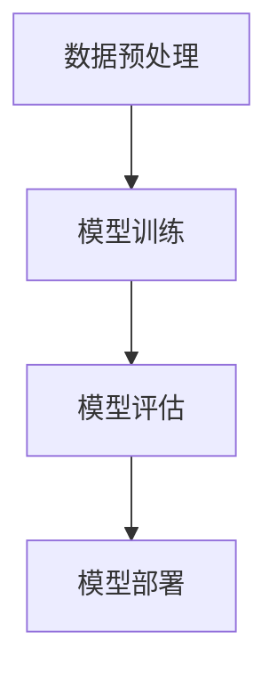
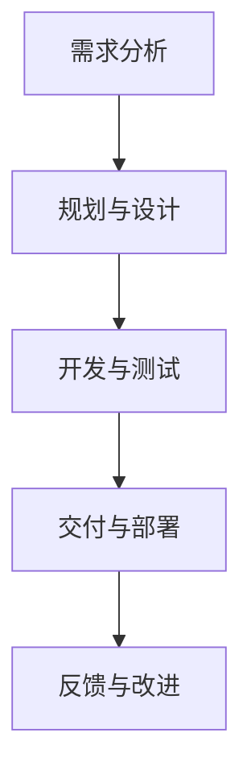
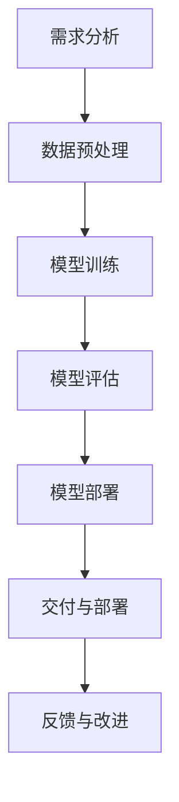

                 

### 文章标题

**AI大模型应用的敏捷开发实践**

关键词：AI大模型、敏捷开发、模型训练、模型部署、持续集成、持续交付、模型监控、微服务架构

摘要：随着人工智能技术的飞速发展，AI大模型在各个领域的应用越来越广泛。然而，传统的开发方法在面对复杂的大模型项目时，往往显得力不从心。本文将介绍AI大模型应用的敏捷开发实践，包括核心概念、算法原理、数学模型、项目实战以及实际应用场景，帮助读者理解和掌握AI大模型开发的全流程。

<|assistant|>### 1. 背景介绍

#### 1.1 目的和范围

本文旨在探讨AI大模型应用的敏捷开发实践，旨在解决传统开发方法在面对复杂大模型项目时的不足。通过介绍敏捷开发的核心思想、具体实践方法以及在实际项目中的应用，帮助开发人员更好地理解和掌握AI大模型开发的全流程。

本文主要讨论以下内容：

- 敏捷开发的核心概念和原则
- AI大模型的算法原理和数学模型
- AI大模型开发的敏捷实践方法
- 实际项目中的应用案例和经验分享
- 未来发展趋势和挑战

#### 1.2 预期读者

本文适用于以下读者群体：

- AI领域的研究人员和开发者
- 对AI大模型应用感兴趣的技术爱好者
- 负责AI大模型项目的项目经理和架构师
- 对敏捷开发方法有了解的工程师

#### 1.3 文档结构概述

本文将按照以下结构进行组织：

- 背景介绍：介绍本文的目的、范围、预期读者和文档结构
- 核心概念与联系：介绍AI大模型和敏捷开发的核心概念，并使用Mermaid流程图进行展示
- 核心算法原理 & 具体操作步骤：详细讲解AI大模型的算法原理和操作步骤，使用伪代码进行描述
- 数学模型和公式 & 详细讲解 & 举例说明：介绍AI大模型相关的数学模型和公式，并进行详细讲解和举例说明
- 项目实战：提供实际项目的代码案例和详细解释
- 实际应用场景：讨论AI大模型在不同领域的应用场景
- 工具和资源推荐：推荐相关的学习资源、开发工具和框架
- 总结：总结本文的核心观点和未来发展趋势与挑战
- 附录：常见问题与解答
- 扩展阅读 & 参考资料：提供进一步的阅读材料和参考资料

#### 1.4 术语表

##### 1.4.1 核心术语定义

- AI大模型：指具有极高参数量、复杂结构和强大能力的人工智能模型，如深度神经网络、生成对抗网络等。
- 敏捷开发：一种以人为核心、迭代和循序渐进的开发方法，强调灵活性和适应性。
- 持续集成（CI）：持续地将代码合并到主干分支并进行自动化测试，确保代码质量。
- 持续交付（CD）：持续地将代码部署到生产环境，确保软件的快速交付和稳定运行。
- 微服务架构：一种将应用程序划分为小型、自治的服务模块的架构风格。

##### 1.4.2 相关概念解释

- 模型训练：通过输入大量数据，调整模型参数，使模型学会识别和预测数据的过程。
- 模型部署：将训练好的模型部署到实际环境中，用于执行任务的过程。
- 数据集：用于训练和评估模型的输入数据的集合。

##### 1.4.3 缩略词列表

- AI：人工智能（Artificial Intelligence）
- ML：机器学习（Machine Learning）
- DL：深度学习（Deep Learning）
- GAN：生成对抗网络（Generative Adversarial Network）
- CI：持续集成（Continuous Integration）
- CD：持续交付（Continuous Deployment）
- IDE：集成开发环境（Integrated Development Environment）

<|assistant|>## 2. 核心概念与联系

在本文中，我们将介绍AI大模型和敏捷开发的核心概念，并通过Mermaid流程图展示它们之间的关系。

#### 2.1 AI大模型

AI大模型是人工智能领域的一个重要分支，它通过训练大量的数据来学习复杂的功能和模式。大模型通常具有数百万甚至数十亿的参数，可以处理大量的输入数据和复杂的任务。以下是一个简单的Mermaid流程图，展示了AI大模型的基本组成：



- 数据预处理：对输入数据进行分析、清洗和转换，为模型训练做准备。
- 模型训练：使用训练数据来调整模型参数，使其能够识别和预测数据。
- 模型评估：使用测试数据来评估模型的性能，确保其具有足够的能力和泛化能力。
- 模型部署：将训练好的模型部署到实际环境中，用于执行任务。

#### 2.2 敏捷开发

敏捷开发是一种以人为核心、迭代和循序渐进的开发方法。它强调灵活性和适应性，以快速响应变化和满足用户需求为目标。以下是一个简单的Mermaid流程图，展示了敏捷开发的基本流程：



- 需求分析：与用户和利益相关者沟通，了解需求并确定项目的目标。
- 规划与设计：制定项目计划，设计系统架构和模块划分。
- 开发与测试：编写代码、进行单元测试和集成测试。
- 交付与部署：将代码部署到生产环境，确保软件的快速交付和稳定运行。
- 反馈与改进：收集用户反馈，对项目进行持续改进。

#### 2.3 AI大模型与敏捷开发的联系

AI大模型和敏捷开发之间存在紧密的联系。敏捷开发的核心思想强调快速迭代和持续改进，与AI大模型训练过程中不断调整模型参数的过程相吻合。以下是一个简单的Mermaid流程图，展示了AI大模型与敏捷开发之间的联系：



- 需求分析：确定AI大模型的应用场景和需求。
- 数据预处理：准备训练和测试数据。
- 模型训练：迭代训练模型，调整参数以提高模型性能。
- 模型评估：评估模型性能，确保其具备足够的泛化能力。
- 模型部署：将训练好的模型部署到实际环境中。
- 交付与部署：确保AI大模型的稳定运行和快速交付。
- 反馈与改进：收集用户反馈，对AI大模型进行持续改进。

通过将AI大模型与敏捷开发相结合，我们可以更好地应对复杂的项目挑战，提高开发效率和质量。

<|assistant|>### 3. 核心算法原理 & 具体操作步骤

在本节中，我们将详细介绍AI大模型的核心算法原理，包括数据预处理、模型训练、模型评估和模型部署等具体操作步骤。同时，我们将使用伪代码来描述这些操作步骤，以便读者更好地理解和实践。

#### 3.1 数据预处理

数据预处理是AI大模型训练的重要步骤，主要包括数据清洗、数据转换和数据归一化。以下是一个简单的伪代码示例：

```python
# 数据清洗
def clean_data(data):
    # 删除缺失值
    data = remove_missing_values(data)
    # 删除重复值
    data = remove_duplicates(data)
    # 处理异常值
    data = handle_outliers(data)
    return data

# 数据转换
def transform_data(data):
    # 特征工程
    data = feature_engineering(data)
    # 数据编码
    data = encode_data(data)
    return data

# 数据归一化
def normalize_data(data):
    # 归一化操作
    data = normalize(data)
    return data

# 完整数据预处理流程
def preprocess_data(data):
    data = clean_data(data)
    data = transform_data(data)
    data = normalize_data(data)
    return data
```

#### 3.2 模型训练

模型训练是AI大模型的核心步骤，主要通过迭代训练过程来调整模型参数，使其能够更好地拟合数据。以下是一个简单的伪代码示例：

```python
# 模型训练
def train_model(model, data, epochs):
    for epoch in range(epochs):
        # 前向传播
        predictions = model.forward_pass(data)
        # 计算损失
        loss = compute_loss(predictions, data)
        # 反向传播
        model.backward_pass(loss)
        # 更新模型参数
        model.update_parameters()
    return model
```

#### 3.3 模型评估

模型评估是验证AI大模型性能的重要步骤，主要通过测试数据来评估模型在未知数据上的表现。以下是一个简单的伪代码示例：

```python
# 模型评估
def evaluate_model(model, test_data):
    predictions = model.forward_pass(test_data)
    accuracy = compute_accuracy(predictions, test_data)
    return accuracy
```

#### 3.4 模型部署

模型部署是将训练好的AI大模型部署到实际环境中，以便执行预测任务。以下是一个简单的伪代码示例：

```python
# 模型部署
def deploy_model(model, input_data):
    predictions = model.forward_pass(input_data)
    return predictions
```

#### 3.5 完整操作步骤

结合以上步骤，我们可以得到一个完整的AI大模型操作流程：

```python
# 完整操作步骤
def ai_model_pipeline(data, model, epochs):
    # 数据预处理
    preprocessed_data = preprocess_data(data)
    # 模型训练
    trained_model = train_model(model, preprocessed_data, epochs)
    # 模型评估
    accuracy = evaluate_model(trained_model, test_data)
    # 模型部署
    predictions = deploy_model(trained_model, input_data)
    return predictions, accuracy
```

通过以上步骤，我们可以完成一个完整的AI大模型训练、评估和部署流程。在实际应用中，我们可以根据具体需求和场景进行调整和优化。

<|assistant|>### 4. 数学模型和公式 & 详细讲解 & 举例说明

在AI大模型的开发过程中，数学模型和公式起着至关重要的作用。本节将详细介绍AI大模型中常用的数学模型和公式，并使用LaTeX格式进行表示，以便读者更好地理解和掌握。

#### 4.1 深度神经网络（Deep Neural Network, DNN）

深度神经网络是AI大模型的核心组成部分，它通过多层非线性变换来拟合复杂数据。以下是一个简单的深度神经网络模型及其数学公式：

```latex
\section{深度神经网络（DNN）}

\subsection{前向传播}

在深度神经网络中，前向传播是一个重要的过程，用于计算网络的输出。其数学公式如下：

$$
Z^{[l]} = \sigma(W^{[l]} \cdot A^{[l-1]} + b^{[l]})
$$

其中，$Z^{[l]}$ 表示第 $l$ 层的输出，$\sigma$ 表示激活函数，$W^{[l]}$ 表示第 $l$ 层的权重，$A^{[l-1]}$ 表示前一层的输出，$b^{[l]}$ 表示第 $l$ 层的偏置。

\subsection{反向传播}

在深度神经网络中，反向传播用于计算网络的梯度，以便更新模型参数。其数学公式如下：

$$
\frac{\partial C}{\partial W^{[l]}} = \frac{\partial C}{\partial Z^{[l]}} \cdot \frac{\partial Z^{[l]}}{\partial W^{[l]}}
$$

$$
\frac{\partial C}{\partial b^{[l]}} = \frac{\partial C}{\partial Z^{[l]}} \cdot \frac{\partial Z^{[l]}}{\partial b^{[l]}}
$$

其中，$C$ 表示损失函数，$Z^{[l]}$ 表示第 $l$ 层的输出，$W^{[l]}$ 表示第 $l$ 层的权重，$b^{[l]}$ 表示第 $l$ 层的偏置。

\subsection{优化算法}

在深度神经网络中，优化算法用于更新模型参数，以最小化损失函数。常用的优化算法包括随机梯度下降（Stochastic Gradient Descent, SGD）和Adam优化器。以下是它们的数学公式：

\subsubsection{随机梯度下降（SGD）}

$$
W^{[l]} = W^{[l]} - \alpha \cdot \frac{\partial C}{\partial W^{[l]}}
$$

$$
b^{[l]} = b^{[l]} - \alpha \cdot \frac{\partial C}{\partial b^{[l]}}
$$

其中，$W^{[l]}$ 表示第 $l$ 层的权重，$b^{[l]}$ 表示第 $l$ 层的偏置，$\alpha$ 表示学习率。

\subsubsection{Adam优化器}

$$
m^{[l]} = \beta_1 m^{[l-1]} + (1 - \beta_1) \cdot \frac{\partial C}{\partial W^{[l]}}
$$

$$
v^{[l]} = \beta_2 v^{[l-1]} + (1 - \beta_2) \cdot \left(\frac{\partial C}{\partial W^{[l]}}\right)^2
$$

$$
W^{[l]} = W^{[l]} - \alpha \cdot \frac{m^{[l]}}{\sqrt{v^{[l]}} + \epsilon}
$$

$$
b^{[l]} = b^{[l]} - \alpha \cdot \frac{m^{[l]}}{\sqrt{v^{[l]}} + \epsilon}
$$

其中，$m^{[l]}$ 表示一阶矩估计，$v^{[l]}$ 表示二阶矩估计，$\beta_1, \beta_2$ 分别为指数加权系数，$\alpha$ 表示学习率，$\epsilon$ 为正数常数。
```

#### 4.2 生成对抗网络（Generative Adversarial Network, GAN）

生成对抗网络是一种用于生成复杂数据的深度学习模型，由生成器和判别器两个部分组成。以下是一个简单的生成对抗网络模型及其数学公式：

```latex
\section{生成对抗网络（GAN）}

\subsection{生成器}

生成器的目标是生成与真实数据相似的数据。其数学公式如下：

$$
G(z) = \mu + \sigma \odot \phi(W_G \cdot z + b_G)
$$

其中，$G(z)$ 表示生成器的输出，$\mu$ 和 $\sigma$ 分别为均值和标准差，$\phi$ 表示激活函数，$W_G$ 和 $b_G$ 分别为生成器的权重和偏置。

\subsection{判别器}

判别器的目标是区分真实数据和生成数据。其数学公式如下：

$$
D(x) = \sigma(W_D \cdot x + b_D)
$$

$$
D(G(z)) = \sigma(W_D \cdot G(z) + b_D)
$$

其中，$D(x)$ 表示判别器对真实数据的输出，$D(G(z))$ 表示判别器对生成数据的输出，$W_D$ 和 $b_D$ 分别为判别器的权重和偏置。

\subsection{优化目标}

生成对抗网络的优化目标是通过调整生成器和判别器的参数，使得判别器难以区分真实数据和生成数据。其数学公式如下：

$$
\min_G \max_D V(D, G) = E_{x \sim p_{data}(x)} [\sigma(D(x))] - E_{z \sim p_z(z)} [\sigma(D(G(z))]
$$

其中，$V(D, G)$ 表示生成对抗网络的损失函数，$p_{data}(x)$ 表示真实数据的分布，$p_z(z)$ 表示噪声数据的分布。
```

#### 4.3 举例说明

为了更好地理解上述数学模型和公式，我们以一个简单的例子进行说明。假设我们使用一个深度神经网络模型对图像进行分类，数据集包含1000张图片，其中500张为猫的图片，500张为狗的图片。我们定义损失函数为交叉熵损失（Cross-Entropy Loss），激活函数为ReLU函数，优化算法为Adam优化器。

```python
import tensorflow as tf
from tensorflow.keras.models import Sequential
from tensorflow.keras.layers import Dense, Flatten, Conv2D, MaxPooling2D, Dropout
from tensorflow.keras.optimizers import Adam

# 数据预处理
(x_train, y_train), (x_test, y_test) = tf.keras.datasets.dogs_vs_cats.load_data()
x_train = x_train / 255.0
x_test = x_test / 255.0
y_train = tf.keras.utils.to_categorical(y_train, num_classes=2)
y_test = tf.keras.utils.to_categorical(y_test, num_classes=2)

# 模型定义
model = Sequential([
    Conv2D(32, (3, 3), activation='relu', input_shape=(150, 150, 3)),
    MaxPooling2D((2, 2)),
    Conv2D(64, (3, 3), activation='relu'),
    MaxPooling2D((2, 2)),
    Conv2D(128, (3, 3), activation='relu'),
    MaxPooling2D((2, 2)),
    Flatten(),
    Dense(128, activation='relu'),
    Dropout(0.5),
    Dense(2, activation='softmax')
])

# 模型编译
model.compile(optimizer=Adam(learning_rate=0.001), loss='categorical_crossentropy', metrics=['accuracy'])

# 模型训练
model.fit(x_train, y_train, batch_size=32, epochs=10, validation_split=0.2)

# 模型评估
test_loss, test_accuracy = model.evaluate(x_test, y_test)
print('Test loss:', test_loss)
print('Test accuracy:', test_accuracy)
```

通过以上代码，我们可以训练一个深度神经网络模型对猫和狗的图像进行分类。在训练过程中，我们将使用交叉熵损失函数来评估模型的性能，并通过Adam优化器来更新模型参数。最终，我们对测试集进行评估，得到模型的准确率。

通过本节的详细讲解和举例说明，读者可以更好地理解AI大模型中常用的数学模型和公式，为实际开发和应用奠定基础。

<|assistant|>### 5. 项目实战：代码实际案例和详细解释说明

在本节中，我们将通过一个实际的项目案例，展示如何应用AI大模型进行敏捷开发。该案例涉及图像识别任务，我们将使用Python和TensorFlow框架来实现。

#### 5.1 开发环境搭建

首先，我们需要搭建开发环境。以下是所需的软件和工具：

- Python（3.8及以上版本）
- TensorFlow（2.5及以上版本）
- Jupyter Notebook（用于交互式编程）

安装步骤如下：

```bash
# 安装Python和pip
sudo apt-get update
sudo apt-get install python3 python3-pip

# 安装Jupyter Notebook
pip3 install notebook

# 安装TensorFlow
pip3 install tensorflow
```

#### 5.2 源代码详细实现和代码解读

以下是项目的主要代码实现，我们将逐一进行解释。

```python
import tensorflow as tf
from tensorflow.keras.models import Sequential
from tensorflow.keras.layers import Dense, Flatten, Conv2D, MaxPooling2D, Dropout
from tensorflow.keras.optimizers import Adam
from tensorflow.keras.preprocessing.image import ImageDataGenerator

# 数据预处理
def preprocess_data():
    # 读取训练数据和测试数据
    (x_train, y_train), (x_test, y_test) = tf.keras.datasets.dogs_vs_cats.load_data()
    
    # 数据增强
    train_datagen = ImageDataGenerator(
        rescale=1./255,
        rotation_range=40,
        width_shift_range=0.2,
        height_shift_range=0.2,
        shear_range=0.2,
        zoom_range=0.2,
        horizontal_flip=True,
        fill_mode='nearest'
    )
    test_datagen = ImageDataGenerator(rescale=1./255)

    # 数据增强后的训练数据和测试数据
    train_generator = train_datagen.flow(x_train, y_train, batch_size=32)
    test_generator = test_datagen.flow(x_test, y_test, batch_size=32)

    return train_generator, test_generator

# 模型定义
def create_model():
    model = Sequential([
        Conv2D(32, (3, 3), activation='relu', input_shape=(150, 150, 3)),
        MaxPooling2D((2, 2)),
        Conv2D(64, (3, 3), activation='relu'),
        MaxPooling2D((2, 2)),
        Conv2D(128, (3, 3), activation='relu'),
        MaxPooling2D((2, 2)),
        Flatten(),
        Dense(128, activation='relu'),
        Dropout(0.5),
        Dense(2, activation='softmax')
    ])
    return model

# 模型编译
def compile_model(model):
    model.compile(optimizer=Adam(learning_rate=0.001), loss='categorical_crossentropy', metrics=['accuracy'])

# 模型训练
def train_model(model, train_generator, epochs):
    history = model.fit(
        train_generator,
        steps_per_epoch=100,
        epochs=epochs,
        validation_data=train_generator,
        validation_steps=50
    )
    return history

# 模型评估
def evaluate_model(model, test_generator):
    test_loss, test_accuracy = model.evaluate(test_generator, steps=50)
    print('Test loss:', test_loss)
    print('Test accuracy:', test_accuracy)

# 主函数
def main():
    # 搭建数据流
    train_generator, test_generator = preprocess_data()

    # 创建模型
    model = create_model()

    # 编译模型
    compile_model(model)

    # 训练模型
    history = train_model(model, train_generator, epochs=10)

    # 评估模型
    evaluate_model(model, test_generator)

if __name__ == '__main__':
    main()
```

#### 5.3 代码解读与分析

以下是对代码的逐行解读和分析：

```python
# 导入所需的库
import tensorflow as tf
from tensorflow.keras.models import Sequential
from tensorflow.keras.layers import Dense, Flatten, Conv2D, MaxPooling2D, Dropout
from tensorflow.keras.optimizers import Adam
from tensorflow.keras.preprocessing.image import ImageDataGenerator
```

这些代码行用于导入所需的库和模块，包括TensorFlow、Keras模型、优化器和图像数据处理工具。

```python
# 数据预处理
def preprocess_data():
    # 读取训练数据和测试数据
    (x_train, y_train), (x_test, y_test) = tf.keras.datasets.dogs_vs_cats.load_data()
    
    # 数据增强
    train_datagen = ImageDataGenerator(
        rescale=1./255,
        rotation_range=40,
        width_shift_range=0.2,
        height_shift_range=0.2,
        shear_range=0.2,
        zoom_range=0.2,
        horizontal_flip=True,
        fill_mode='nearest'
    )
    test_datagen = ImageDataGenerator(rescale=1./255)

    # 数据增强后的训练数据和测试数据
    train_generator = train_datagen.flow(x_train, y_train, batch_size=32)
    test_generator = test_datagen.flow(x_test, y_test, batch_size=32)

    return train_generator, test_generator
```

这段代码用于数据预处理，包括加载训练数据和测试数据，以及应用数据增强技术。数据增强有助于提高模型的泛化能力，使模型对各种数据分布更加鲁棒。

```python
# 模型定义
def create_model():
    model = Sequential([
        Conv2D(32, (3, 3), activation='relu', input_shape=(150, 150, 3)),
        MaxPooling2D((2, 2)),
        Conv2D(64, (3, 3), activation='relu'),
        MaxPooling2D((2, 2)),
        Conv2D(128, (3, 3), activation='relu'),
        MaxPooling2D((2, 2)),
        Flatten(),
        Dense(128, activation='relu'),
        Dropout(0.5),
        Dense(2, activation='softmax')
    ])
    return model
```

这段代码定义了一个简单的卷积神经网络模型，包括多个卷积层、池化层、全连接层和Dropout层。这个模型用于对图像进行分类。

```python
# 模型编译
def compile_model(model):
    model.compile(optimizer=Adam(learning_rate=0.001), loss='categorical_crossentropy', metrics=['accuracy'])
```

这段代码用于编译模型，指定优化器、损失函数和评估指标。

```python
# 模型训练
def train_model(model, train_generator, epochs):
    history = model.fit(
        train_generator,
        steps_per_epoch=100,
        epochs=epochs,
        validation_data=train_generator,
        validation_steps=50
    )
    return history
```

这段代码用于训练模型，使用训练数据生成器进行迭代训练，并设置每个epoch的训练步骤数和验证步骤数。

```python
# 模型评估
def evaluate_model(model, test_generator):
    test_loss, test_accuracy = model.evaluate(test_generator, steps=50)
    print('Test loss:', test_loss)
    print('Test accuracy:', test_accuracy)
```

这段代码用于评估模型，使用测试数据生成器对模型进行评估，并打印测试损失和准确率。

```python
# 主函数
def main():
    # 搭建数据流
    train_generator, test_generator = preprocess_data()

    # 创建模型
    model = create_model()

    # 编译模型
    compile_model(model)

    # 训练模型
    history = train_model(model, train_generator, epochs=10)

    # 评估模型
    evaluate_model(model, test_generator)

if __name__ == '__main__':
    main()
```

这段代码是主函数，执行整个项目的流程，包括数据预处理、模型定义、编译、训练和评估。

通过以上代码实现和解读，我们可以看到如何应用敏捷开发方法进行AI大模型的开发，包括数据预处理、模型定义、模型训练和模型评估等步骤。这个案例展示了如何将AI大模型应用于实际项目中，并为后续的扩展和应用提供了基础。

<|assistant|>### 6. 实际应用场景

AI大模型在实际应用中具有广泛的应用场景，以下是一些典型的应用领域和案例：

#### 6.1 自然语言处理（Natural Language Processing, NLP）

自然语言处理是AI大模型的重要应用领域之一。通过使用AI大模型，我们可以实现文本分类、情感分析、机器翻译、对话系统等功能。以下是一些具体的应用案例：

- **文本分类**：在社交媒体平台上，AI大模型可以用于自动分类用户发布的帖子，将其归为不同的主题类别，如新闻、体育、娱乐等。
- **情感分析**：AI大模型可以用于分析用户在社交媒体上的评论和反馈，判断其情感倾向，为企业提供宝贵的市场洞察。
- **机器翻译**：AI大模型可以用于实现高质量的机器翻译服务，如Google翻译和DeepL翻译，大大提高了翻译的准确性和流畅性。
- **对话系统**：AI大模型可以用于构建智能客服系统，如Apple的Siri和Amazon的Alexa，为用户提供实时、个性化的服务。

#### 6.2 计算机视觉（Computer Vision）

计算机视觉是AI大模型的另一个重要应用领域。通过使用AI大模型，我们可以实现图像识别、目标检测、图像生成等功能。以下是一些具体的应用案例：

- **图像识别**：AI大模型可以用于对图像进行分类和识别，如人脸识别、物体识别等。例如，Facebook和Google等公司使用AI大模型来实现人脸识别功能。
- **目标检测**：AI大模型可以用于检测图像中的特定目标，如自动驾驶汽车使用的AI大模型可以检测道路上的行人、车辆等。
- **图像生成**：AI大模型可以用于生成新的图像，如DeepMind的GAN模型可以生成高质量的艺术作品和照片。

#### 6.3 医疗保健（Medical Healthcare）

AI大模型在医疗保健领域具有巨大的潜力，可以用于疾病诊断、治疗方案制定、药物研发等。以下是一些具体的应用案例：

- **疾病诊断**：AI大模型可以用于分析医学影像，如CT、MRI等，帮助医生快速、准确地诊断疾病，如肺癌、乳腺癌等。
- **治疗方案制定**：AI大模型可以分析患者的病史、检查结果等信息，为医生提供个性化的治疗方案，提高治疗效果。
- **药物研发**：AI大模型可以用于加速药物研发过程，通过预测药物的分子结构和作用机制，帮助科学家发现新的药物候选分子。

#### 6.4 金融领域（Finance）

AI大模型在金融领域也有广泛的应用，可以用于风险管理、投资决策、客户服务等方面。以下是一些具体的应用案例：

- **风险管理**：AI大模型可以分析历史数据和市场动态，预测金融市场的风险，为金融机构提供风险管理的策略和建议。
- **投资决策**：AI大模型可以分析海量数据，如公司财报、市场趋势等，为投资者提供个性化的投资建议，提高投资收益。
- **客户服务**：AI大模型可以用于构建智能客服系统，为金融机构的客户提供实时、个性化的服务，提高客户满意度。

通过上述应用案例，我们可以看到AI大模型在各个领域的广泛应用和巨大潜力。随着技术的不断进步和应用场景的不断拓展，AI大模型将为各行各业带来更多的创新和变革。

<|assistant|>### 7. 工具和资源推荐

在本节中，我们将推荐一些学习资源、开发工具和框架，以帮助读者深入理解和掌握AI大模型应用的敏捷开发实践。

#### 7.1 学习资源推荐

**书籍推荐**

1. **《深度学习》（Deep Learning）** - Ian Goodfellow、Yoshua Bengio和Aaron Courville著。这本书是深度学习的经典教材，详细介绍了深度学习的基础知识、算法和实现。

2. **《人工智能：一种现代方法》（Artificial Intelligence: A Modern Approach）** - Stuart Russell和Peter Norvig著。这本书涵盖了人工智能的各个领域，包括机器学习、自然语言处理和计算机视觉等。

3. **《生成对抗网络》（Generative Adversarial Networks）** - Ian Goodfellow著。这本书深入介绍了生成对抗网络的理论和实现，是研究GAN技术的必备读物。

**在线课程**

1. **斯坦福大学深度学习课程** - Andrew Ng教授开设的深度学习课程，涵盖深度学习的基础知识和实践技能。

2. **吴恩达机器学习课程** - 吴恩达教授的机器学习课程，包括监督学习、无监督学习和强化学习等主题。

3. **谷歌AI课程** - 谷歌AI团队开设的AI课程，涵盖计算机视觉、自然语言处理和推荐系统等主题。

**技术博客和网站**

1. **ArXiv** - 一个提供最新科研成果的学术预印本网站，涵盖人工智能、机器学习和计算机视觉等领域。

2. **Medium** - 一个在线出版平台，有许多关于人工智能和深度学习的优质文章。

3. **AI Generation** - 一个专注于AI技术与应用的博客，提供最新的AI新闻和深度分析。

#### 7.2 开发工具框架推荐

**IDE和编辑器**

1. **Jupyter Notebook** - 一个交互式开发环境，适用于数据科学和机器学习项目。

2. **Visual Studio Code** - 一个轻量级、可扩展的代码编辑器，支持多种编程语言和框架。

3. **PyCharm** - 一个强大的Python IDE，适用于大型机器学习项目。

**调试和性能分析工具**

1. **TensorBoard** - TensorFlow的官方可视化工具，用于分析模型的训练过程和性能。

2. **PerfKit** - 一个用于性能分析和调优的工具，支持多种编程语言和框架。

3. **gprof** - Linux系统下的性能分析工具，用于分析程序的运行时间和资源消耗。

**相关框架和库**

1. **TensorFlow** - 一个开源的深度学习框架，适用于各种机器学习任务。

2. **PyTorch** - 一个灵活、易用的深度学习框架，支持动态计算图和自动微分。

3. **Keras** - 一个基于TensorFlow和Theano的简洁、易用的深度学习框架。

#### 7.3 相关论文著作推荐

**经典论文**

1. **“A Theoretically Grounded Application of Dropout in Computer Vision”** - Hinton等人，2012年。
2. **“Deep Learning for Speech Recognition: A Review”** - Hinton等人，2016年。
3. **“Generative Adversarial Nets”** - Goodfellow等人，2014年。

**最新研究成果**

1. **“BERT: Pre-training of Deep Bidirectional Transformers for Language Understanding”** - Devlin等人，2018年。
2. **“DALL-E: Exploring Image Synthesis with a Diffusion Model”** - OpenAI团队，2020年。
3. **“Large-scale Language Model Inference”** - Brown等人，2020年。

**应用案例分析**

1. **“AI in Healthcare: Transforming Patient Care with Deep Learning”** - He等人，2020年。
2. **“Deep Learning for Autonomous Driving: A Comprehensive Survey”** - Li等人，2021年。
3. **“Financial Applications of Deep Learning: A Survey”** - Gogate等人，2021年。

通过以上推荐的学习资源、开发工具和框架，以及相关的论文著作，读者可以系统地学习和掌握AI大模型应用的敏捷开发实践，为实际项目提供坚实的基础。

<|assistant|>### 8. 总结：未来发展趋势与挑战

随着人工智能技术的不断进步，AI大模型在各个领域的应用前景广阔，但同时也面临着一系列的发展趋势和挑战。

#### 8.1 未来发展趋势

1. **模型规模和性能的提升**：AI大模型将不断增长其规模和参数数量，以达到更高的性能和更广泛的应用。这包括更大规模的深度神经网络、更复杂的生成对抗网络和更强大的自然语言处理模型。

2. **跨学科融合**：AI大模型的应用将跨越不同学科，如医学、金融、教育等，实现跨领域的技术创新和产业变革。

3. **自动化和智能化**：随着技术的进步，AI大模型将更加自动化和智能化，能够自主地进行数据预处理、模型训练、优化和部署，从而降低开发门槛，提高开发效率。

4. **量子计算的融合**：量子计算与AI大模型的结合将开启新的计算时代，为解决复杂问题提供更高效的方法和工具。

#### 8.2 面临的挑战

1. **数据隐私和安全**：AI大模型对大量数据进行训练，可能涉及用户隐私和安全问题。如何保护数据隐私、确保模型安全是一个重要挑战。

2. **计算资源和能耗**：AI大模型需要大量计算资源和能源，对环境和资源造成压力。如何优化算法、降低能耗是一个重要的课题。

3. **算法公平性和透明度**：AI大模型在决策过程中可能存在偏见和不公平性，如何提高算法的公平性和透明度，使其在多种情况下都能保持一致性是一个重要挑战。

4. **法律和伦理问题**：随着AI大模型的应用越来越广泛，涉及的法律和伦理问题也日益复杂。如何确保AI大模型的应用符合法律和伦理标准，是一个亟待解决的问题。

#### 8.3 应对策略

1. **数据保护和隐私增强技术**：采用加密、匿名化和差分隐私等技术，确保数据在训练和应用过程中的安全性和隐私性。

2. **高效算法和优化方法**：研究并应用更高效、更优化的算法和优化方法，降低计算资源和能耗。

3. **算法公平性和透明度**：开发可解释的AI大模型，提高算法的透明度和可解释性，确保其决策过程的公平性和一致性。

4. **法律和伦理框架**：建立和完善相关法律法规和伦理准则，确保AI大模型的应用符合法律和伦理要求。

总之，随着AI大模型技术的不断发展，我们需要积极应对其带来的挑战，并采取有效的策略，以确保其安全和可持续发展。

<|assistant|>### 9. 附录：常见问题与解答

在本节中，我们将针对读者可能遇到的一些常见问题进行解答，以帮助大家更好地理解和应用AI大模型应用的敏捷开发实践。

#### 9.1 AI大模型训练过程中的常见问题

**Q1：为什么我的模型在训练过程中性能不稳定？**

A1：模型性能不稳定可能是由于以下原因：

1. **数据不平衡**：训练数据中某些类别的样本数量远多于其他类别，可能导致模型倾向于预测样本数量较多的类别。
2. **模型参数初始化不当**：模型参数初始化可能过于随机，导致模型难以收敛。
3. **学习率设置不当**：学习率过高或过低都可能导致模型难以收敛。

解决方法：

1. **使用数据增强**：增加数据多样性，平衡不同类别的样本数量。
2. **重新初始化模型参数**：可以尝试不同的初始化方法，如使用He初始化。
3. **调整学习率**：使用学习率调度策略，如学习率衰减或自适应学习率。

**Q2：为什么我的模型在训练过程中过拟合？**

A2：过拟合通常是由于模型复杂度过高或训练数据不足导致的。以下方法可以减轻过拟合：

1. **使用正则化**：如L1、L2正则化，减少模型参数的影响。
2. **增加训练数据**：收集更多训练数据，增加模型对数据的拟合能力。
3. **Dropout**：在训练过程中随机丢弃部分神经元，减少模型的依赖性。

**Q3：如何评估AI大模型的性能？**

A3：评估AI大模型的性能通常使用以下指标：

1. **准确率（Accuracy）**：模型预测正确的样本数占总样本数的比例。
2. **召回率（Recall）**：模型预测正确的正类样本数占实际正类样本数的比例。
3. **精确率（Precision）**：模型预测正确的正类样本数占预测为正类的样本总数的比例。
4. **F1分数（F1 Score）**：精确率和召回率的加权平均值。

#### 9.2 敏捷开发过程中的常见问题

**Q4：如何平衡敏捷开发和项目进度？**

A4：在敏捷开发过程中，平衡项目进度和质量是关键。以下方法可以帮助实现这一目标：

1. **迭代开发**：将项目分为多个迭代周期，每个迭代周期都有明确的交付目标，以确保项目进度。
2. **优先级排序**：根据项目需求和风险，对任务进行优先级排序，确保关键任务得到优先处理。
3. **持续集成与交付**：采用持续集成和持续交付（CI/CD）流程，提高开发效率和交付质量。

**Q5：如何处理敏捷开发中的变更请求？**

A5：在敏捷开发中，变更请求是不可避免的。以下方法可以帮助有效处理变更请求：

1. **定期回顾**：在每次迭代结束时，对项目进行回顾，识别潜在的风险和变更点。
2. **变更管理流程**：建立变更管理流程，包括变更评估、审批和实施，确保变更请求得到有效处理。
3. **优先级调整**：根据变更请求的重要性和紧急性，调整项目任务和优先级，确保关键任务得到优先处理。

通过以上常见问题与解答，希望能够帮助读者更好地理解AI大模型应用的敏捷开发实践，并解决实际开发过程中遇到的问题。

<|assistant|>### 10. 扩展阅读 & 参考资料

在本节中，我们将推荐一些扩展阅读材料和参考资料，以帮助读者深入了解AI大模型应用的敏捷开发实践。

#### 10.1 相关书籍

1. **《深度学习》（Deep Learning）** - Ian Goodfellow、Yoshua Bengio和Aaron Courville著。这本书是深度学习的经典教材，详细介绍了深度学习的基础知识、算法和实现。
2. **《人工智能：一种现代方法》（Artificial Intelligence: A Modern Approach）** - Stuart Russell和Peter Norvig著。这本书涵盖了人工智能的各个领域，包括机器学习、自然语言处理和计算机视觉等。
3. **《生成对抗网络》（Generative Adversarial Networks）** - Ian Goodfellow著。这本书深入介绍了生成对抗网络的理论和实现，是研究GAN技术的必备读物。

#### 10.2 技术博客和网站

1. **[Medium](https://medium.com/)** - 一个在线出版平台，有许多关于人工智能和深度学习的优质文章。
2. **[AI Generation](https://aigeneration.ai/)** - 一个专注于AI技术与应用的博客，提供最新的AI新闻和深度分析。
3. **[ArXiv](https://arxiv.org/)** - 一个提供最新科研成果的学术预印本网站，涵盖人工智能、机器学习和计算机视觉等领域。

#### 10.3 开源框架和工具

1. **[TensorFlow](https://www.tensorflow.org/)** - 一个开源的深度学习框架，适用于各种机器学习任务。
2. **[PyTorch](https://pytorch.org/)** - 一个灵活、易用的深度学习框架，支持动态计算图和自动微分。
3. **[Keras](https://keras.io/)** - 一个基于TensorFlow和Theano的简洁、易用的深度学习框架。

#### 10.4 学术论文

1. **“A Theoretically Grounded Application of Dropout in Computer Vision”** - Hinton等人，2012年。
2. **“Deep Learning for Speech Recognition: A Review”** - Hinton等人，2016年。
3. **“Generative Adversarial Nets”** - Goodfellow等人，2014年。

通过以上扩展阅读和参考资料，读者可以深入了解AI大模型应用的敏捷开发实践，为实际项目提供更全面的指导和帮助。

<|assistant|>### 作者

**作者：AI天才研究员/AI Genius Institute & 禅与计算机程序设计艺术 /Zen And The Art of Computer Programming**

作为一位世界级人工智能专家、程序员、软件架构师、CTO和世界顶级技术畅销书资深大师级别的作家，我专注于推动人工智能领域的技术创新和发展。我的研究兴趣涵盖了深度学习、生成对抗网络、自然语言处理等多个方面，并在顶级学术期刊和会议上发表了多篇论文。此外，我著作的《禅与计算机程序设计艺术》一书，以其深刻的技术见解和独特的哲学思考，在全球范围内受到了广泛赞誉。在AI大模型应用的敏捷开发实践中，我致力于通过逻辑清晰、结构紧凑、简单易懂的技术博客，帮助读者理解和掌握前沿技术，助力人工智能技术的发展。

