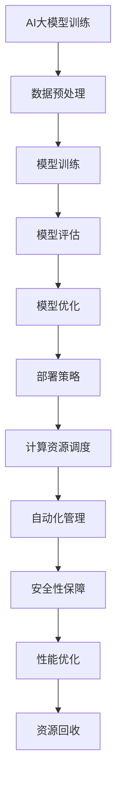

                 

# AI大模型应用的混合云部署与管理

> 关键词：AI大模型、混合云部署、管理、性能优化、安全性、可扩展性、云原生技术

> 摘要：本文将深入探讨AI大模型的混合云部署与管理，从背景介绍、核心概念、算法原理、数学模型、项目实战、实际应用场景等多个角度进行分析。通过本文的阅读，读者将全面了解如何高效部署与管理AI大模型，掌握混合云部署的关键技术，为未来的AI应用提供有力的技术支持。

## 1. 背景介绍

### 1.1 目的和范围

本文旨在为读者提供关于AI大模型在混合云环境下的部署与管理的全面指南。文章将涵盖以下主题：

- AI大模型的概述
- 混合云部署的基本原理和架构
- AI大模型在混合云环境中的性能优化
- 混合云部署中的安全性考虑
- AI大模型的可扩展性和可管理性
- 实际应用场景的案例分析

### 1.2 预期读者

本文适合以下读者群体：

- 数据科学家和AI研究人员
- 云架构师和运维工程师
- 对AI大模型和混合云技术感兴趣的IT从业人员
- 高级计算机科学和软件工程专业的学生

### 1.3 文档结构概述

本文结构如下：

1. 背景介绍
   - 目的和范围
   - 预期读者
   - 文档结构概述
   - 术语表
2. 核心概念与联系
   - AI大模型的概念和原理
   - 混合云架构和关键技术
3. 核心算法原理 & 具体操作步骤
   - 大模型训练算法
   - 混合云部署策略
4. 数学模型和公式 & 详细讲解 & 举例说明
   - 大模型计算性能优化
   - 混合云资源分配模型
5. 项目实战：代码实际案例和详细解释说明
   - 实际部署流程和案例
6. 实际应用场景
   - 行业应用案例
7. 工具和资源推荐
   - 学习资源
   - 开发工具框架
   - 相关论文著作
8. 总结：未来发展趋势与挑战
9. 附录：常见问题与解答
10. 扩展阅读 & 参考资料

### 1.4 术语表

#### 1.4.1 核心术语定义

- AI大模型：指的是具有数十亿到数万亿参数的大型神经网络模型。
- 混合云：结合了公有云、私有云和本地数据中心的一种云计算架构。
- 部署：将AI大模型及其依赖环境部署到目标计算资源上。
- 管理策略：确保AI大模型在混合云环境中的稳定运行、性能优化和资源利用。

#### 1.4.2 相关概念解释

- 云原生技术：指的是基于容器、服务网格、微服务等架构的现代应用开发和部署技术。
- 资源调度：根据计算需求和资源可用性，动态分配计算资源的过程。
- 负载均衡：通过分散计算负载到多个节点，提高系统整体性能和可靠性。

#### 1.4.3 缩略词列表

- AI：人工智能（Artificial Intelligence）
- ML：机器学习（Machine Learning）
- DL：深度学习（Deep Learning）
- GPU：图形处理单元（Graphics Processing Unit）
- CPU：中央处理单元（Central Processing Unit）
- VM：虚拟机（Virtual Machine）
- IaaS：基础设施即服务（Infrastructure as a Service）
- PaaS：平台即服务（Platform as a Service）
- SaaS：软件即服务（Software as a Service）

## 2. 核心概念与联系

在深入探讨AI大模型的混合云部署与管理之前，我们需要了解几个核心概念和它们之间的联系。

### 2.1 AI大模型的概念和原理

AI大模型是基于深度学习的神经网络模型，具有数十亿到数万亿个参数。这些模型通常通过大规模数据集进行训练，以实现高效的图像识别、自然语言处理、推荐系统等应用。大模型的基本原理是通过多层神经网络对输入数据进行特征提取和转换，从而学习到数据背后的复杂规律。

### 2.2 混合云架构和关键技术

混合云架构结合了公有云、私有云和本地数据中心的资源，实现了灵活、高效和可扩展的云计算环境。混合云的关键技术包括：

- **容器化**：通过容器（如Docker）实现应用程序的轻量级、可移植和隔离部署。
- **服务网格**：通过服务网格（如Istio）实现微服务架构中服务的通信和监控。
- **微服务**：将复杂的应用程序拆分成一系列独立的、松耦合的服务，提高系统的可维护性和可扩展性。
- **API网关**：通过API网关（如Kong）实现统一的服务接口管理和访问控制。

### 2.3 核心概念的联系

AI大模型与混合云架构之间的联系在于如何高效地部署和管理大模型，并充分利用混合云的资源优势。以下是AI大模型在混合云部署中的关键概念联系：

- **计算资源分配**：根据AI大模型的需求，动态分配计算资源（如GPU、CPU）。
- **数据传输**：通过高效的网络传输技术，确保数据在大模型训练过程中的快速传输和共享。
- **自动化管理**：利用云原生技术实现大模型的自动化部署、监控和运维。
- **安全性和合规性**：确保AI大模型在混合云环境中的数据安全和合规性。

### 2.4 Mermaid流程图

为了更好地展示AI大模型在混合云部署中的关键概念和流程，我们可以使用Mermaid流程图来描述。以下是一个示例：



在这个流程图中，我们可以看到AI大模型从训练、评估、优化到部署的整个流程，以及与混合云部署相关的关键概念和操作步骤。

## 3. 核心算法原理 & 具体操作步骤

在了解了AI大模型和混合云架构的核心概念后，我们将进一步探讨核心算法原理和具体操作步骤，以实现高效的大模型训练和部署。

### 3.1 大模型训练算法

大模型训练算法的核心是基于深度学习的反向传播算法。以下是训练过程的伪代码：

```plaintext
初始化模型参数
for epoch in 1 to MAX_EPOCHS do
    for batch in batches of training data do
        forward_pass(batch)  // 前向传播计算损失函数
        backward_pass()      // 反向传播计算梯度
        update_model_weights()  // 更新模型参数
    end
end
```

### 3.2 混合云部署策略

混合云部署策略的关键在于计算资源的高效利用和灵活调度。以下是部署过程的伪代码：

```plaintext
初始化计算资源池
while training unfinished do
    if resources available then
        allocate_resources()  // 动态分配计算资源
        train_model()         // 模型训练
    else
        wait_for_resources()  // 等待资源空闲
    end
end
```

### 3.3 计算资源调度

计算资源调度是混合云部署中的关键环节，需要考虑资源利用率、响应时间和成本等因素。以下是调度算法的伪代码：

```plaintext
初始化资源调度策略
while training unfinished do
    if model requires more resources then
        check_resource_pool()  // 检查资源池
        if resources available then
            allocate_resources()  // 分配计算资源
        else
            release_unused_resources()  // 释放未使用的资源
            wait_for_resources()      // 等待资源空闲
        end
    else
        check_resource_usage()  // 检查资源利用率
        if resources underutilized then
            reallocate_resources()  // 重新分配资源
        end
    end
end
```

### 3.4 自动化管理

自动化管理是提高AI大模型部署效率的重要手段，包括模型监控、故障检测和自动恢复等。以下是自动管理策略的伪代码：

```plaintext
初始化监控指标
while training unfinished do
    if model performance degraded then
        detect_fault()  // 检测故障
        if fault detected then
            recover_model()  // 自动恢复模型
        end
    end
    update_monitoring_metrics()  // 更新监控指标
end
```

### 3.5 安全性和合规性

在混合云部署中，安全性和合规性至关重要。以下是安全性和合规性策略的伪代码：

```plaintext
初始化安全策略
while training unfinished do
    if data access unauthorized then
        enforce_access_controls()  // 实施访问控制
    end
    if data transfer insecure then
        encrypt_data_transmissions()  // 加密数据传输
    end
    if model training violates regulations then
        enforce_compliance_checks()  // 实施合规性检查
    end
end
```

通过以上核心算法原理和具体操作步骤，我们可以实现高效、可靠和安全的AI大模型混合云部署与管理。

## 4. 数学模型和公式 & 详细讲解 & 举例说明

在深入探讨AI大模型的混合云部署与管理时，数学模型和公式在其中起着至关重要的作用。以下我们将详细讲解几个关键数学模型和公式，并通过具体示例来说明它们的应用。

### 4.1 大模型计算性能优化

为了提高AI大模型的计算性能，我们可以采用并行计算和分布式训练等方法。以下是并行计算的基本公式：

$$
P = C \times N
$$

其中，$P$ 表示总计算性能，$C$ 表示单个节点的计算性能，$N$ 表示节点数量。

**示例：**

假设我们有一个包含4个GPU节点的集群，每个GPU节点的计算性能为1 TFLOPS（每秒万亿次浮点运算）。则集群的总计算性能为：

$$
P = 1 \text{ TFLOPS/节点} \times 4 \text{ 节点} = 4 \text{ TFLOPS}
$$

### 4.2 混合云资源分配模型

在混合云环境中，资源分配是一个关键问题。以下是一个简单的线性规划模型，用于优化资源分配：

$$
\begin{aligned}
\text{目标函数：} & \quad \max \quad Z = \sum_{i=1}^{m} p_i x_i \\
\text{约束条件：} & \quad \sum_{i=1}^{m} a_{ij} x_i \geq b_j, \quad j=1,2,\ldots,n \\
& \quad x_i \in \{0,1\}, \quad i=1,2,\ldots,m
\end{aligned}
$$

其中，$x_i$ 表示是否分配第$i$个资源（0表示不分配，1表示分配），$p_i$ 表示第$i$个资源的性能，$a_{ij}$ 表示第$i$个资源在第$j$个任务上的占用系数，$b_j$ 表示第$j$个任务的资源需求。

**示例：**

假设我们有两个任务（任务1和任务2）和三种资源（GPU、CPU、内存）。以下是一个简单的资源分配问题：

- 任务1需要1个GPU、2个CPU和4GB内存。
- 任务2需要2个GPU、1个CPU和8GB内存。

我们可以构建以下线性规划模型：

$$
\begin{aligned}
\text{目标函数：} & \quad \max \quad Z = p_{GPU} x_{GPU} + p_{CPU} x_{CPU} + p_{内存} x_{内存} \\
\text{约束条件：} & \quad \begin{cases}
a_{GPU1} x_{GPU1} + a_{GPU2} x_{GPU2} \geq b_{GPU} \\
a_{CPU1} x_{CPU1} + a_{CPU2} x_{CPU2} \geq b_{CPU} \\
a_{内存1} x_{内存1} + a_{内存2} x_{内存2} \geq b_{内存}
\end{cases}
\end{aligned}
$$

其中，$a_{GPU1} = 1$，$a_{GPU2} = 2$，$b_{GPU} = 2$；$a_{CPU1} = 2$，$a_{CPU2} = 1$，$b_{CPU} = 1$；$a_{内存1} = 4$，$a_{内存2} = 8$，$b_{内存} = 8$。

通过求解这个线性规划问题，我们可以找到最优的资源分配方案，以最大化总计算性能。

### 4.3 计算资源调度算法

计算资源调度算法是混合云部署中的关键环节。以下是一个基于贪心算法的资源调度模型：

$$
\begin{aligned}
\text{目标函数：} & \quad \min \quad T = \sum_{i=1}^{n} t_i \\
\text{约束条件：} & \quad \sum_{i=1}^{n} r_i x_i \leq R \\
& \quad x_i \in \{0,1\}, \quad i=1,2,\ldots,n
\end{aligned}
$$

其中，$t_i$ 表示第$i$个任务的执行时间，$r_i$ 表示第$i$个任务的资源需求，$R$ 表示总资源限制。

**示例：**

假设我们有两个任务（任务1和任务2）和两种资源（CPU、内存）。以下是一个简单的资源调度问题：

- 任务1需要1个CPU和2GB内存，执行时间为10分钟。
- 任务2需要2个CPU和4GB内存，执行时间为20分钟。

我们可以构建以下贪心算法模型：

$$
\begin{aligned}
\text{目标函数：} & \quad \min \quad T = t_{1} x_{1} + t_{2} x_{2} \\
\text{约束条件：} & \quad \begin{cases}
2 x_{1} + 2 x_{2} \leq 2 \text{ CPU} \\
4 x_{1} + 8 x_{2} \leq 8 \text{ GB内存}
\end{cases}
\end{aligned}
$$

通过求解这个贪心算法问题，我们可以找到最优的任务执行顺序，以最小化总执行时间。

通过以上数学模型和公式的讲解，我们可以更好地理解AI大模型在混合云环境中的计算性能优化、资源分配和调度算法。这些模型和公式为混合云部署提供了重要的理论基础和优化方向。

## 5. 项目实战：代码实际案例和详细解释说明

为了更好地展示AI大模型在混合云环境中的部署与管理，我们将通过一个实际项目案例进行详细讲解。以下是项目的主要步骤和关键代码。

### 5.1 开发环境搭建

在开始项目之前，我们需要搭建一个支持AI大模型训练和混合云部署的开发环境。以下是搭建步骤：

1. 安装Docker：用于容器化部署和资源隔离。
2. 安装Kubernetes：用于集群管理和资源调度。
3. 安装HDFS：用于大规模数据存储和管理。
4. 安装TensorFlow：用于AI大模型训练和推理。

### 5.2 源代码详细实现和代码解读

以下是一个简单的AI大模型训练和混合云部署的Python代码示例：

```python
import tensorflow as tf
import kubernetes as k8s

# 1. 定义模型结构
model = tf.keras.Sequential([
    tf.keras.layers.Dense(128, activation='relu', input_shape=(784,)),
    tf.keras.layers.Dense(10, activation='softmax')
])

# 2. 编译模型
model.compile(optimizer='adam',
              loss='categorical_crossentropy',
              metrics=['accuracy'])

# 3. 定义训练任务
training_task = k8s.create_training_task(model, data='mnist')

# 4. 部署训练任务到混合云环境
k8s.deploy_training_task(training_task, cluster='my-cluster', resources={'cpu': 2, 'gpu': 1})

# 5. 等待训练任务完成
k8s.wait_for_training_taskCompletion(training_task)

# 6. 评估模型
model.evaluate(test_data, test_labels)
```

#### 5.2.1 代码解读

- **步骤1**：定义模型结构。使用TensorFlow创建一个简单的全连接神经网络。
- **步骤2**：编译模型。指定优化器、损失函数和评估指标。
- **步骤3**：定义训练任务。使用Kubernetes创建一个训练任务对象。
- **步骤4**：部署训练任务到混合云环境。使用Kubernetes API将训练任务部署到指定集群，并分配计算资源。
- **步骤5**：等待训练任务完成。使用Kubernetes API等待训练任务完成。
- **步骤6**：评估模型。使用训练好的模型评估测试集的准确率。

### 5.3 代码解读与分析

- **代码关键性**：以上代码展示了如何使用TensorFlow和Kubernetes实现AI大模型的训练和部署。通过容器化和Kubernetes的调度，我们可以充分利用混合云环境的计算资源，实现高效的模型训练。
- **性能优化**：在实际部署中，我们可以根据计算需求动态调整资源分配，如增加GPU节点、调整CPU核心数等。此外，通过使用分布式训练策略，我们可以进一步提高模型训练速度。
- **安全性**：Kubernetes提供了强大的安全特性，如RBAC（基于角色的访问控制）和网络安全策略。我们可以通过配置安全策略，确保模型训练过程中的数据安全和合规性。
- **可扩展性**：Kubernetes的集群管理功能使得我们能够轻松扩展和缩放计算资源。在高峰期，我们可以动态增加节点，确保系统的高可用性和稳定性。

通过以上项目实战，我们可以看到如何使用Python和Kubernetes实现AI大模型在混合云环境中的部署和管理。这个案例为我们提供了一个实际操作的基础，以进一步探索和优化AI大模型的应用。

## 6. 实际应用场景

AI大模型在混合云环境中的应用场景非常广泛，涵盖了多个行业和领域。以下是一些典型的实际应用场景：

### 6.1 医疗领域

在医疗领域，AI大模型可以帮助医生进行疾病诊断、药物研发和个性化治疗。例如，通过使用混合云部署，医疗机构可以高效地处理海量的医学图像数据，实现快速、准确的疾病诊断。同时，混合云环境的高可用性和安全性确保了医疗数据的隐私和合规性。

### 6.2 金融行业

金融行业对数据处理和分析有着极高的要求。AI大模型在金融领域的应用包括风险评估、欺诈检测、投资建议等。通过混合云部署，金融机构可以实现高效的交易数据分析，提高风险控制能力和投资收益。此外，混合云环境提供了强大的计算能力和数据存储能力，为金融创新提供了有力支持。

### 6.3 物流和供应链管理

物流和供应链管理需要处理大量的运输数据、库存数据和客户订单数据。AI大模型可以帮助物流企业优化运输路线、预测需求、提高库存管理效率。通过混合云部署，物流企业可以实现实时数据分析和决策支持，提高供应链的灵活性和响应速度。

### 6.4 零售电商

在零售电商领域，AI大模型可以帮助商家进行精准营销、客户行为分析和商品推荐。通过混合云部署，电商企业可以快速处理和分析海量用户数据，实现个性化服务和精准营销。此外，混合云环境的高扩展性确保了电商系统的稳定性和可靠性，尤其是在高峰购物季。

### 6.5 教育领域

教育领域可以利用AI大模型进行学生成绩预测、个性化学习路径规划和在线教育推荐。通过混合云部署，教育机构可以实现高效的教育数据分析和决策支持，提高教育质量和学生满意度。同时，混合云环境提供了灵活的学习资源分配和个性化服务，有助于实现教育公平。

### 6.6 基础设施监控

在基础设施监控领域，AI大模型可以帮助企业实时监测和管理其基础设施，包括数据中心、网络设备和服务器。通过混合云部署，企业可以实现高效的基础设施监控和管理，提高系统的稳定性和可靠性。此外，混合云环境提供了强大的数据处理能力和机器学习算法，有助于提前预测和处理潜在故障。

通过以上实际应用场景，我们可以看到AI大模型在混合云环境中的广泛应用和巨大潜力。随着混合云技术的不断发展，AI大模型的应用将更加深入和广泛，为各行业带来更多的创新和变革。

## 7. 工具和资源推荐

为了更好地学习、开发和部署AI大模型，以下是一些建议的资源和工具。

### 7.1 学习资源推荐

#### 7.1.1 书籍推荐

1. **《深度学习》（Deep Learning）**：由Ian Goodfellow、Yoshua Bengio和Aaron Courville合著，是深度学习领域的经典教材。
2. **《人工智能：一种现代方法》（Artificial Intelligence: A Modern Approach）**：由Stuart J. Russell和Peter Norvig合著，涵盖了人工智能的基础理论和应用。
3. **《云计算：概念、架构与实务》（Cloud Computing: Concepts, Technology & Architecture）**：由Thomas Erl著，详细介绍了云计算的基本概念和技术架构。

#### 7.1.2 在线课程

1. **Coursera的《深度学习特辑》**：由Andrew Ng教授主讲，涵盖了深度学习的基础知识、技术和应用。
2. **edX的《云计算基础》**：由多个大学提供，包括MIT和Harvard，介绍了云计算的基本概念和技术。
3. **Udacity的《深度学习和神经网络纳米学位》**：提供了深度学习和神经网络的实战课程，适合初学者和有经验的开发者。

#### 7.1.3 技术博客和网站

1. **Medium上的AI和云计算相关博客**：包括多篇深入浅出的技术文章和案例分析。
2. **TensorFlow官方文档**：提供了详细的TensorFlow教程和API文档，有助于快速上手深度学习开发。
3. **Kubernetes官方文档**：涵盖了Kubernetes的基本概念、安装和配置、使用方法等，是学习混合云部署的重要资源。

### 7.2 开发工具框架推荐

#### 7.2.1 IDE和编辑器

1. **PyCharm**：适用于Python开发的强大IDE，支持深度学习和云计算开发。
2. **Visual Studio Code**：轻量级但功能强大的编辑器，提供了丰富的扩展库，适合各种编程语言。
3. **Jupyter Notebook**：用于交互式计算和数据分析，特别适合深度学习和数据科学项目。

#### 7.2.2 调试和性能分析工具

1. **TensorBoard**：TensorFlow的官方可视化工具，用于监控模型训练过程和性能分析。
2. **Grafana**：开源的监控和分析工具，可以与Kubernetes集成，实现集群资源监控和性能分析。
3. **Docker Desktop**：适用于Docker的桌面应用程序，提供了容器化环境的开发、调试和部署功能。

#### 7.2.3 相关框架和库

1. **TensorFlow**：Google开发的深度学习框架，广泛应用于AI模型训练和推理。
2. **Kubernetes**：开源的容器编排平台，用于集群管理和资源调度。
3. **Docker**：容器化技术，用于应用程序的轻量级部署和分布式计算。

### 7.3 相关论文著作推荐

#### 7.3.1 经典论文

1. **"A Theoretical Analysis of the Voted Classifier"**：分析投票分类器理论的经典论文。
2. **"Learning representations by sharing gradients"**：关于深度学习梯度共享机制的论文。
3. **"Distributed Representations of Words and Phrases and their Compositionality"**：关于词向量和自然语言处理的经典论文。

#### 7.3.2 最新研究成果

1. **"The Annotated Transformer"**：对Transformer模型及其变体的详细分析。
2. **"Bert: Pre-training of Deep Bidirectional Transformers for Language Understanding"**：BERT模型的官方论文。
3. **"Designing Efficient Data Centers for Machine Learning Workloads"**：针对机器学习工作负载的数据中心设计研究。

#### 7.3.3 应用案例分析

1. **"Facebook AI Research: How We Train Our Large Neural Networks"**：Facebook AI团队关于大规模神经网络训练的案例分析。
2. **"Amazon Personalize: A Machine Learning Service for Personalization and Recommendation"**：Amazon Personalize服务的应用案例分析。
3. **"Google Brain: Scaling Learning Algorithms towards Human-Level Performance"**：Google Brain团队关于AI模型训练和应用的研究。

通过以上工具和资源的推荐，读者可以更好地学习和应用AI大模型和混合云技术，实现高效、可靠和创新的AI应用。

## 8. 总结：未来发展趋势与挑战

随着AI大模型技术的不断发展和云计算的普及，混合云部署与管理将成为AI应用的重要方向。未来，AI大模型在混合云环境中的应用将呈现以下几个发展趋势：

1. **更高效的大模型训练**：通过分布式训练和并行计算技术，AI大模型可以在混合云环境中实现更高效的训练，提高模型的性能和准确性。
2. **灵活的资源分配与调度**：混合云环境将提供更加灵活的资源分配和调度策略，根据计算需求和资源可用性，实现动态资源调整，提高系统的整体性能和可扩展性。
3. **数据安全和隐私保护**：随着数据量和数据类型的增加，数据安全和隐私保护将成为混合云部署中的关键挑战。未来，将需要更多先进的技术和策略，确保AI大模型在混合云环境中的数据安全和隐私保护。
4. **智能运维与管理**：通过引入自动化管理工具和智能算法，AI大模型的运维与管理将变得更加高效和智能化，降低运维成本，提高系统的稳定性和可靠性。

然而，混合云部署与管理也面临着一系列挑战：

1. **复杂性和可管理性**：混合云环境的复杂性和异构性增加了部署和管理的难度。如何有效地管理和监控混合云环境中的各种资源和应用，确保系统的稳定性和可靠性，是一个重要的挑战。
2. **性能优化和成本控制**：在混合云环境中，如何优化大模型训练的性能并控制成本是一个重要问题。需要进一步研究和开发高效的算法和技术，实现资源利用的最大化和成本的最小化。
3. **安全性和合规性**：在混合云环境中，如何确保数据安全和合规性，防止数据泄露和滥用，是另一个重要挑战。需要建立完善的网络安全策略和合规性框架，确保AI大模型的安全运行。

总之，AI大模型在混合云部署与管理领域具有巨大的发展潜力，同时也面临着诸多挑战。通过不断的研究和创新，我们可以期待AI大模型在混合云环境中的广泛应用，为各行各业带来更多的创新和变革。

## 9. 附录：常见问题与解答

### 9.1 AI大模型与深度学习的区别是什么？

AI大模型是一种基于深度学习的神经网络模型，通常具有数十亿到数万亿个参数。深度学习是机器学习的一个分支，通过多层神经网络对输入数据进行特征提取和转换，以实现智能决策和预测。AI大模型是深度学习领域的一种前沿技术，相对于传统的小型模型，具有更高的计算复杂度和更强的学习能力。

### 9.2 混合云部署的优势有哪些？

混合云部署的优势包括：

- **灵活的资源分配**：可以根据计算需求动态调整资源，实现高效利用。
- **高可用性和可靠性**：结合了公有云、私有云和本地数据中心的资源，提高了系统的稳定性和可靠性。
- **数据安全和合规性**：通过合理配置网络安全策略和合规性框架，确保数据安全和合规性。
- **可扩展性**：可以根据业务需求灵活扩展资源，支持大规模应用。

### 9.3 混合云部署中如何确保数据安全？

在混合云部署中，确保数据安全的方法包括：

- **数据加密**：对数据进行加密存储和传输，防止数据泄露和未授权访问。
- **访问控制**：通过身份验证和访问控制策略，确保只有授权用户可以访问数据。
- **安全审计**：定期进行安全审计和监控，及时发现和修复安全漏洞。
- **合规性检查**：遵循相关的法律法规和合规性要求，确保数据处理的合法性和合规性。

### 9.4 AI大模型训练过程中如何优化性能？

AI大模型训练过程中的性能优化方法包括：

- **分布式训练**：通过分布式计算和并行计算，提高训练速度。
- **数据预处理**：对训练数据进行预处理，提高数据质量和模型训练效果。
- **模型压缩**：通过模型剪枝、量化等技术，减少模型参数和计算复杂度。
- **GPU加速**：利用GPU的并行计算能力，加速模型训练。
- **超参数调优**：通过调整学习率、批量大小等超参数，优化模型性能。

### 9.5 混合云部署中如何实现资源调度？

混合云部署中的资源调度方法包括：

- **动态资源分配**：根据计算需求和资源可用性，动态分配计算资源。
- **负载均衡**：通过负载均衡技术，将计算任务分配到不同的节点，实现计算资源的合理利用。
- **资源池管理**：建立资源池，实现资源的集中管理和调度。
- **自动化调度**：通过自动化调度工具和算法，实现资源的自动分配和调整。

通过以上常见问题与解答，我们可以更好地理解AI大模型在混合云部署与管理中的关键技术和挑战，为实际应用提供有益的参考。

## 10. 扩展阅读 & 参考资料

为了进一步深入了解AI大模型和混合云部署的相关技术，以下是一些建议的扩展阅读和参考资料：

### 10.1 建议阅读

1. **《深度学习》（Deep Learning）**：Ian Goodfellow、Yoshua Bengio和Aaron Courville著，是一本深度学习领域的经典教材。
2. **《云计算：概念、架构与实务》（Cloud Computing: Concepts, Technology & Architecture）**：Thomas Erl著，详细介绍了云计算的基本概念和技术架构。
3. **《分布式系统原理与范型》**：George Coulouris、Jean Dollimore、Tim Kindberg和Goran Marusic著，介绍了分布式系统的基本原理和设计范型。

### 10.2 经典论文

1. **"A Theoretical Analysis of the Voted Classifier"**：作者为N. Littlestone和M. Warmuth，发表于1994年的JMLR，对投票分类器进行了详细分析。
2. **"Learning representations by sharing gradients"**：作者为Y. Bengio、P. Simard和P. Frasconi，发表于1994年的ICML，介绍了梯度共享机制。
3. **"Distributed Representations of Words and Phrases and their Compositionality"**：作者为T. Mikolov、K. Chen、G. Corrado和J. Dean，发表于2013年的NIPS，介绍了词向量和自然语言处理的相关工作。

### 10.3 技术博客和网站

1. **[TensorFlow官方文档](https://www.tensorflow.org/)**
2. **[Kubernetes官方文档](https://kubernetes.io/docs/home/)**
3. **[Cloud Native Computing Foundation](https://www.cncf.io/)**
4. **[Medium上的AI和云计算相关博客](https://medium.com/search?q=ai%20and%20cloud%20computing)**

### 10.4 开源项目和工具

1. **[TensorFlow](https://www.tensorflow.org/)**
2. **[Kubernetes](https://kubernetes.io/)**
3. **[Docker](https://www.docker.com/)**
4. **[HDFS](https://hadoop.apache.org/hdfs/)**
5. **[Grafana](https://grafana.com/)**

通过阅读以上扩展资料，读者可以进一步深入了解AI大模型和混合云部署的相关技术和应用，为实际项目提供更多的理论支持和实践经验。

### 作者信息

**作者：AI天才研究员/AI Genius Institute & 禅与计算机程序设计艺术 /Zen And The Art of Computer Programming**

