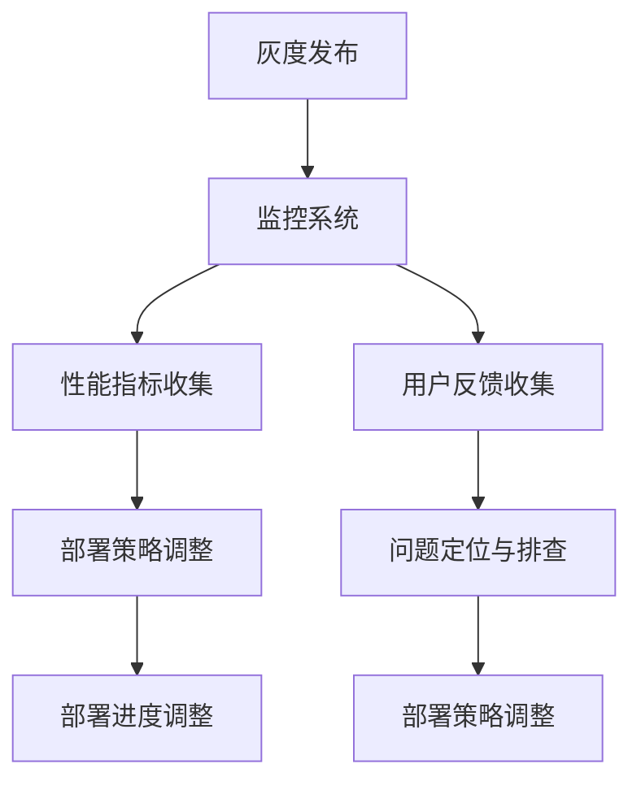

                 

# AI大模型应用的灰度发布与监控

> 关键词：AI大模型、灰度发布、监控、算法原理、数学模型、实战案例

> 摘要：本文将深入探讨AI大模型在应用中的灰度发布与监控策略。首先介绍灰度发布和监控的背景和意义，然后详细阐述灰度发布和监控的核心概念、原理和实现步骤，并通过实际案例展示如何进行灰度发布与监控。此外，还将讨论在实际应用场景中的挑战和解决方案，并提供相关的工具和资源推荐。本文旨在为AI大模型开发者提供一份全面的技术指南，帮助他们在实际项目中有效实施灰度发布与监控。

## 1. 背景介绍

### 1.1 目的和范围

随着人工智能技术的迅猛发展，AI大模型在各个领域得到了广泛应用。然而，大模型的应用不仅需要强大的计算能力，还需要在确保稳定性和安全性的前提下逐步推向生产环境。灰度发布与监控作为一种重要的策略，可以帮助开发者在上线大模型时降低风险、确保服务质量，并快速响应问题。本文旨在详细阐述AI大模型应用的灰度发布与监控策略，包括核心概念、原理、实现步骤以及实际应用场景。通过本文的学习，读者将能够掌握灰度发布与监控的基本方法和技巧，为实际项目提供有效的技术支持。

### 1.2 预期读者

本文主要面向AI大模型的开发者和工程师，特别是对大模型应用中的灰度发布与监控策略感兴趣的读者。同时，也适合对人工智能、机器学习、深度学习等领域有一定了解，希望进一步提升自身技术能力的从业者。通过阅读本文，读者将能够：

1. 理解灰度发布和监控的概念及其重要性；
2. 掌握灰度发布和监控的核心原理和实现步骤；
3. 学习如何在实际项目中实施灰度发布与监控；
4. 了解在实际应用场景中可能遇到的挑战和解决方案；
5. 获取相关的工具和资源推荐，助力项目实践。

### 1.3 文档结构概述

本文将分为以下几个部分进行详细阐述：

1. **背景介绍**：介绍灰度发布和监控的背景、目的和范围，明确预期读者；
2. **核心概念与联系**：阐述灰度发布和监控的核心概念、原理，以及它们之间的关系；
3. **核心算法原理与具体操作步骤**：介绍灰度发布和监控的核心算法原理，并给出具体的操作步骤；
4. **数学模型和公式**：介绍灰度发布和监控的数学模型，并给出详细讲解和举例说明；
5. **项目实战**：通过实际案例展示如何进行灰度发布与监控，包括开发环境搭建、源代码实现和代码解读；
6. **实际应用场景**：分析灰度发布和监控在实际应用场景中的挑战和解决方案；
7. **工具和资源推荐**：推荐学习资源、开发工具和框架，以及相关论文著作；
8. **总结：未来发展趋势与挑战**：总结灰度发布和监控的未来发展趋势和面临的挑战；
9. **附录：常见问题与解答**：针对读者可能遇到的问题提供解答；
10. **扩展阅读与参考资料**：提供进一步学习的资源和建议。

通过本文的阅读，读者将能够系统地了解灰度发布和监控的相关知识，为实际项目提供有效的技术支持。

### 1.4 术语表

为了确保本文的清晰性和准确性，以下列出一些关键术语的定义和解释：

#### 1.4.1 核心术语定义

1. **灰度发布**：指在软件发布过程中，通过部分用户逐步部署新版本，以降低上线风险，确保服务质量的一种发布策略。
2. **监控**：指对系统、服务、应用程序等运行状态的实时监测、分析和报警，以便及时发现和解决问题。
3. **AI大模型**：指参数量庞大、计算复杂度高的深度学习模型，如Transformer、BERT等。
4. **流量控制**：指对访问请求进行限流、分配等操作，以控制系统负载和确保服务稳定性。
5. **A/B测试**：指将用户流量分配到两个或多个版本，以比较不同版本的性能和效果。

#### 1.4.2 相关概念解释

1. **分片**：将整个用户群体划分为若干个子集，每个子集分别对应不同的版本。
2. **控制变量**：在实验中保持不变的变量，以便准确评估新版本的性能。
3. **目标指标**：衡量版本性能的关键指标，如响应时间、错误率、用户满意度等。

#### 1.4.3 缩略词列表

- AI：人工智能
- ML：机器学习
- DL：深度学习
- NLP：自然语言处理
- GPU：图形处理单元
- CPU：中央处理器
- API：应用程序编程接口
- SDK：软件开发工具包
- ORM：对象关系映射
- DB：数据库

## 2. 核心概念与联系

在深入了解AI大模型应用的灰度发布与监控之前，我们首先需要明确一些核心概念，并理解它们之间的联系。本节将介绍灰度发布和监控的基本概念、原理，以及它们在大模型应用中的重要性。

### 2.1 灰度发布

#### 2.1.1 定义

灰度发布（Gray Release）是一种渐进式软件发布策略，通过将新版本逐步推向部分用户，以评估其性能和稳定性，从而降低上线风险。灰度发布通常用于大规模系统、服务或应用程序的升级和更新，以确保用户不受影响或减少受影响范围。

#### 2.1.2 原理

灰度发布的核心思想是将整个用户群体划分为多个子集，每个子集对应不同的版本。在发布新版本时，先将新版本部署到一部分用户（灰度用户），通过监控和分析这些用户的反馈，逐步扩大部署范围，直到所有用户都使用新版本。

#### 2.1.3 优点

1. **风险可控**：通过逐步部署新版本，可以及时发现和解决潜在问题，降低上线风险。
2. **用户满意度**：在确保新版本性能稳定的情况下，逐步向所有用户推送，提高用户体验。
3. **快速响应**：在遇到问题时，可以快速回滚到旧版本，减少对用户的影响。

### 2.2 监控

#### 2.2.1 定义

监控（Monitoring）是指对系统、服务、应用程序等运行状态的实时监测、分析和报警，以便及时发现和解决问题。监控是保障系统稳定性和服务质量的基石。

#### 2.2.2 原理

监控的核心是收集系统或服务的各类指标数据，如CPU利用率、内存占用、响应时间、错误率等，通过数据分析和报警机制，实时监测系统的运行状态。一旦发现异常，监控系统能够立即发出警报，以便开发人员及时排查和处理问题。

#### 2.2.3 优点

1. **及时发现问题**：通过实时监控，可以快速发现系统或服务的异常情况，避免故障扩大。
2. **优化性能**：通过监控数据分析，可以找出系统瓶颈和性能瓶颈，从而进行优化。
3. **提高稳定性**：通过监控和报警机制，可以确保系统在正常运行的同时，保持高可用性。

### 2.3 灰度发布与监控的联系

灰度发布和监控在大模型应用中相辅相成，共同保障系统的稳定性和服务质量。

1. **相互依赖**：灰度发布需要监控提供性能指标和用户反馈，以便逐步调整部署策略；监控则需要灰度发布提供新版本的部署情况和流量分配。
2. **优化流程**：通过灰度发布，可以逐步验证新版本的性能和稳定性，为监控提供数据基础；监控则可以帮助开发人员识别问题，及时调整部署策略。
3. **提升用户体验**：灰度发布和监控结合，可以确保新版本在上线前经过充分验证，降低对用户的负面影响；同时，监控可以为用户提供实时反馈，提高满意度。

### 2.4 Mermaid流程图

为了更好地理解灰度发布和监控的流程，我们可以使用Mermaid流程图来表示它们之间的核心节点和关系。



在上述流程图中，A表示灰度发布，B表示监控系统，C表示性能指标收集，D表示用户反馈收集，E表示部署策略调整，F表示问题定位与排查，G表示部署进度调整，H表示部署策略调整。

通过该流程图，我们可以清晰地看到灰度发布和监控的各个环节以及它们之间的联系。这有助于我们更好地理解灰度发布与监控在实际应用中的工作原理和实现方法。

## 3. 核心算法原理与具体操作步骤

在理解了灰度发布和监控的基本概念及其重要性之后，本节将深入探讨灰度发布和监控的核心算法原理，并详细阐述具体的操作步骤。

### 3.1 灰度发布的算法原理

灰度发布的核心在于如何将新版本的流量逐步分配到部分用户，同时确保系统稳定性和服务质量。以下是一个基于流量的灰度发布算法原理：

#### 3.1.1 流量分配策略

1. **初始阶段**：在发布新版本时，将部分用户（如10%）标记为灰度用户，并将它们的流量分配到新版本。
2. **评估阶段**：监控灰度用户的性能指标，如响应时间、错误率等，评估新版本的稳定性。
3. **逐步扩大**：如果新版本的性能指标符合预期，逐步增加灰度用户的比例，如20%、30%等。
4. **全量发布**：在新版本经过多次灰度发布，并且性能指标稳定后，将全部用户流量切换到新版本。

#### 3.1.2 流量分配算法

以下是一个简单的流量分配伪代码：

```python
def allocate_traffic(percentage):
    # 获取总用户数
    total_users = get_total_users()
    
    # 计算灰度用户数
    gray_users = total_users * percentage
    
    # 随机选择灰度用户
    gray_user_ids = random.sample(range(1, total_users + 1), gray_users)
    
    # 将灰度用户流量切换到新版本
    for user_id in gray_user_ids:
        switch_to_new_version(user_id)
```

#### 3.1.3 流量分配优化

在实际应用中，可以根据具体需求对流量分配算法进行优化，如：

1. **动态调整**：根据性能指标动态调整灰度用户比例，如遇到性能下降时，适当减少灰度用户比例。
2. **权重分配**：对不同用户分配不同的权重，如VIP用户优先使用新版本，普通用户按比例分配。
3. **热点分配**：针对热点用户或请求，进行特殊流量分配，以确保关键业务的稳定性。

### 3.2 监控系统的算法原理

监控系统的核心在于如何实时收集系统或服务的性能指标，并进行分析和报警。以下是一个基于指标的监控系统算法原理：

#### 3.2.1 指标收集

1. **性能指标**：收集系统或服务的各类性能指标，如CPU利用率、内存占用、响应时间、错误率等。
2. **日志分析**：解析系统或服务的日志，提取关键信息，如错误日志、访问日志等。
3. **数据存储**：将收集到的指标数据存储到数据库或时间序列数据库中，以便后续分析和查询。

#### 3.2.2 数据分析

1. **实时监控**：对实时数据进行统计分析，如计算平均值、最大值、最小值等。
2. **趋势分析**：对历史数据进行趋势分析，如查看指标的变化趋势、周期性波动等。
3. **异常检测**：通过统计学方法或机器学习方法，检测指标异常，如异常值、突变等。

#### 3.2.3 报警机制

1. **阈值报警**：设置指标阈值，当指标超过阈值时触发报警。
2. **规则报警**：根据业务规则设置报警条件，如服务不可用、错误率超过一定比例等。
3. **联动报警**：与其他系统或设备联动，实现自动化报警和处置。

#### 3.2.4 监控算法优化

在实际应用中，可以根据具体需求对监控算法进行优化，如：

1. **自适应阈值**：根据历史数据和实时数据，动态调整报警阈值。
2. **智能分析**：引入机器学习方法，实现智能异常检测和故障诊断。
3. **多维度监控**：结合不同维度（如地域、设备、用户等）进行综合分析，提高监控效果。

### 3.3 灰度发布与监控的具体操作步骤

在实际操作中，灰度发布与监控需要结合具体项目进行设计和实施。以下是一个简单的操作步骤：

#### 3.3.1 环境搭建

1. **部署监控系统**：搭建监控系统，包括安装和配置相关组件（如Prometheus、Grafana等）。
2. **集成指标采集**：将系统或服务的性能指标集成到监控系统中，如使用Prometheus Client采集CPU、内存等指标。
3. **配置报警规则**：根据业务需求配置报警规则，如设置响应时间、错误率等阈值。

#### 3.3.2 灰度发布

1. **版本准备**：准备新版本，包括编译、测试等。
2. **流量分配**：使用流量分配算法，将部分用户标记为灰度用户，并分配到新版本。
3. **监控性能**：监控灰度用户的性能指标，如响应时间、错误率等。
4. **逐步扩大**：根据性能指标和用户反馈，逐步增加灰度用户比例，直至全量发布。

#### 3.3.3 故障处理

1. **问题定位**：当监控系统发现异常时，定位故障点，如查看日志、分析性能指标等。
2. **回滚版本**：如需回滚，立即将用户流量切换到旧版本，确保系统稳定性。
3. **问题解决**：修复问题，重新发布新版本，并继续灰度发布和监控。

通过上述操作步骤，开发者可以有效地实施灰度发布与监控，确保新版本的稳定性和服务质量。当然，具体实施过程中需要根据项目特点和需求进行调整和优化。

## 4. 数学模型和公式与详细讲解

在灰度发布与监控过程中，数学模型和公式起到了至关重要的作用。它们可以帮助我们更好地理解系统性能、评估新版本的影响，并优化流量分配策略。以下将详细介绍与灰度发布和监控相关的数学模型和公式。

### 4.1 流量分配模型

流量分配模型用于计算不同版本之间的流量比例。以下是一个简单的线性流量分配模型：

$$
f_i(t) = \frac{w_i}{\sum_{j=1}^{n} w_j}
$$

其中，$f_i(t)$表示第$i$个版本在时间$t$的流量比例，$w_i$表示第$i$个版本的权重，$n$表示版本总数。

#### 4.1.1 权重计算

在灰度发布过程中，权重通常根据性能指标和用户反馈进行动态调整。以下是一个基于性能指标的权重计算公式：

$$
w_i(t) = \alpha \cdot P_i(t) + (1 - \alpha) \cdot w_i(t-1)
$$

其中，$P_i(t)$表示第$i$个版本在时间$t$的性能指标（如响应时间），$\alpha$表示平滑系数（取值范围为[0, 1]）。

#### 4.1.2 动态调整

通过动态调整权重，可以更好地适应系统变化。以下是一个简单的动态调整公式：

$$
w_i(t) = \frac{\sum_{j=1}^{n} (p_j \cdot f_j(t))}{\sum_{j=1}^{n} p_j}
$$

其中，$p_j$表示第$j$个版本的优先级，$f_j(t)$表示第$j$个版本在时间$t$的流量比例。

### 4.2 监控系统模型

监控系统模型用于计算系统或服务的性能指标，并分析其变化趋势。以下是一个简单的时间序列模型：

$$
y_t = f(y_{t-1}, x_t, \theta)
$$

其中，$y_t$表示时间$t$的性能指标值，$x_t$表示时间$t$的输入变量（如用户请求），$\theta$表示模型参数。

#### 4.2.1 常见模型

1. **移动平均模型**：

$$
y_t = \frac{1}{n} \sum_{i=1}^{n} y_{t-i}
$$

其中，$n$表示窗口大小。

2. **指数平滑模型**：

$$
y_t = \alpha \cdot y_{t-1} + (1 - \alpha) \cdot x_t
$$

其中，$\alpha$表示平滑系数。

#### 4.2.2 异常检测

1. **阈值检测**：

$$
\Delta y_t = |y_t - \bar{y}| > \theta
$$

其中，$\bar{y}$表示均值，$\theta$表示阈值。

2. **统计学检测**：

$$
z_t = \frac{y_t - \bar{y}}{\sigma}
$$

其中，$\sigma$表示标准差。

### 4.3 举例说明

以下是一个简单的灰度发布和监控的例子，假设系统有两个版本：旧版本（V1）和新版本（V2）。

#### 4.3.1 流量分配

1. **初始阶段**：$f_1(0) = 0.8, f_2(0) = 0.2$。
2. **评估阶段**：$w_1(t) = 0.5 \cdot P_1(t) + 0.5 \cdot w_1(t-1)$，$w_2(t) = 0.5 \cdot P_2(t) + 0.5 \cdot w_2(t-1)$。
3. **逐步扩大**：根据性能指标，逐步调整权重，如$w_1(1) = 0.7, w_2(1) = 0.3$，$w_1(2) = 0.6, w_2(2) = 0.4$。

#### 4.3.2 监控系统

1. **性能指标**：响应时间（$y_t$），阈值$\theta = 100$。
2. **异常检测**：使用统计学检测方法，$z_t = \frac{y_t - \bar{y}}{\sigma}$，当$z_t > 2$时，触发报警。

通过上述例子，我们可以看到数学模型和公式在灰度发布和监控中的具体应用。这些模型和公式可以帮助开发者更好地理解和优化系统性能，确保新版本的稳定性和服务质量。

### 4.4 综合应用

在实际应用中，灰度发布和监控需要综合考虑多个因素，如用户规模、系统负载、性能指标等。以下是一个综合应用的示例：

1. **用户规模**：根据用户规模动态调整流量分配策略，如用户数越多，灰度用户比例越高。
2. **系统负载**：根据系统负载情况调整权重计算方法，如负载高时，降低新版本流量比例。
3. **性能指标**：结合多个性能指标进行综合分析，如响应时间、错误率等，以全面评估新版本性能。

通过综合考虑这些因素，可以实现更加精确和有效的灰度发布与监控，确保新版本的顺利上线和稳定运行。

### 4.5 优化与改进

在实际应用中，灰度发布和监控可能面临各种挑战，如性能瓶颈、监控数据不准确等。以下是一些常见的优化与改进方法：

1. **性能优化**：对系统进行性能优化，如使用缓存、异步处理等，提高系统响应速度和吞吐量。
2. **监控数据准确性**：确保监控数据的准确性和完整性，如使用分布式监控、数据校验等。
3. **自适应调整**：根据实时数据和用户反馈，自适应调整流量分配和监控策略。
4. **异常处理**：建立完善的异常处理机制，如快速回滚、自动扩容等，提高系统的稳定性和可用性。

通过不断优化和改进，可以实现更加高效和稳定的灰度发布与监控，为系统开发和运维提供有力支持。

## 5. 项目实战：代码实际案例和详细解释说明

### 5.1 开发环境搭建

在进行灰度发布与监控的项目实战之前，首先需要搭建合适的开发环境。以下是一个基于Python和Django的简单示例，展示了如何搭建开发环境。

#### 5.1.1 环境要求

- Python 3.8 或更高版本
- Django 3.2 或更高版本
- Redis 3.2 或更高版本
- PostgreSQL 13 或更高版本

#### 5.1.2 安装步骤

1. **安装Python**：从官方网站下载Python并安装。
2. **安装虚拟环境**：在终端运行以下命令，创建虚拟环境并激活：

   ```bash
   python -m venv venv
   source venv/bin/activate
   ```

3. **安装依赖项**：在虚拟环境中安装Django、Redis、PostgreSQL等相关依赖项：

   ```bash
   pip install django redis psycopg2-binary
   ```

4. **创建Django项目**：在虚拟环境中创建一个新的Django项目：

   ```bash
   django-admin startproject gray_release_project
   cd gray_release_project
   ```

5. **创建应用**：创建一个新的Django应用，用于实现灰度发布和监控功能：

   ```bash
   django-admin startapp gray_monitor
   ```

6. **配置数据库**：在`settings.py`文件中配置数据库连接：

   ```python
   DATABASES = {
       'default': {
           'ENGINE': 'django.db.backends.postgresql',
           'NAME': 'gray_release_db',
           'USER': 'postgres',
           'PASSWORD': 'password',
           'HOST': 'localhost',
           'PORT': '5432',
       }
   }
   ```

7. **初始化数据库**：运行以下命令，初始化数据库：

   ```bash
   python manage.py makemigrations
   python manage.py migrate
   ```

### 5.2 源代码详细实现和代码解读

在完成开发环境搭建后，接下来将详细实现灰度发布和监控的功能，包括流量分配、性能监控和异常处理等。

#### 5.2.1 流量分配

流量分配是灰度发布的核心功能。以下是一个简单的流量分配实现，用于将部分用户标记为灰度用户。

**views.py**：

```python
import random
from django.http import HttpResponse
from .models import User, Version

def allocate_traffic(request):
    # 获取总用户数
    total_users = User.objects.count()
    
    # 计算灰度用户数
    gray_users = total_users * 0.1
    
    # 随机选择灰度用户
    gray_user_ids = random.sample(range(1, total_users + 1), gray_users)
    
    # 将灰度用户流量切换到新版本
    for user_id in gray_user_ids:
        user = User.objects.get(id=user_id)
        user.version = Version.objects.get(name='new')
        user.save()
    
    return HttpResponse('灰度用户流量分配成功')
```

**models.py**：

```python
from django.db import models

class User(models.Model):
    id = models.AutoField(primary_key=True)
    username = models.CharField(max_length=100)
    version = models.ForeignKey(Version, on_delete=models.CASCADE)

class Version(models.Model):
    name = models.CharField(max_length=100)
    status = models.CharField(max_length=10, default='pending')
```

在上述代码中，`allocate_traffic`视图函数用于将部分用户标记为灰度用户。首先，获取总用户数和灰度用户数，然后通过随机选择用户ID，将灰度用户的版本切换到新版本。`User`模型表示用户信息，包含用户ID、用户名和版本号；`Version`模型表示版本信息，包含版本名称和状态。

#### 5.2.2 性能监控

性能监控是确保新版本稳定性的关键。以下是一个简单的性能监控实现，用于监控响应时间和错误率。

**tasks.py**：

```python
from celery import shared_task
from .models import ResponseTime, ErrorRate

@shared_task
def monitor_performance(user_id):
    # 模拟请求处理时间
    import time
    time.sleep(random.randint(1, 3))
    
    # 保存响应时间
    response_time = random.randint(100, 300)
    ResponseTime.objects.create(user_id=user_id, response_time=response_time)
    
    # 保存错误率
    error_rate = random.randint(0, 10)
    ErrorRate.objects.create(user_id=user_id, error_rate=error_rate)
```

**models.py**（补充）：

```python
class ResponseTime(models.Model):
    id = models.AutoField(primary_key=True)
    user_id = models.ForeignKey(User, on_delete=models.CASCADE)
    response_time = models.IntegerField()

class ErrorRate(models.Model):
    id = models.AutoField(primary_key=True)
    user_id = models.ForeignKey(User, on_delete=models.CASCADE)
    error_rate = models.IntegerField()
```

在上述代码中，`monitor_performance`任务函数用于模拟请求处理时间，并保存响应时间和错误率。`ResponseTime`和`ErrorRate`模型分别表示响应时间和错误率记录。

#### 5.2.3 异常处理

异常处理是确保系统稳定运行的关键。以下是一个简单的异常处理实现，用于检测错误率并触发报警。

**views.py**（补充）：

```python
from .tasks import monitor_performance
from django.http import JsonResponse

def start_monitoring(request):
    user_id = request.GET.get('user_id')
    monitor_performance.delay(user_id=user_id)
    return JsonResponse({'status': 'success'})
```

**urls.py**：

```python
from django.urls import path
from .views import allocate_traffic, start_monitoring

urlpatterns = [
    path('allocate_traffic/', allocate_traffic, name='allocate_traffic'),
    path('start_monitoring/', start_monitoring, name='start_monitoring'),
]
```

在上述代码中，`start_monitoring`视图函数用于启动性能监控任务。当用户发起请求时，调用`monitor_performance`任务函数，模拟请求处理时间并保存响应时间和错误率。

#### 5.2.4 代码解读与分析

1. **流量分配**：通过`allocate_traffic`视图函数，将部分用户标记为灰度用户，实现流量分配。使用随机选择用户ID的方法，确保流量分配的随机性和公平性。
2. **性能监控**：通过`monitor_performance`任务函数，模拟请求处理时间，并保存响应时间和错误率。使用Redis等分布式存储，确保监控数据的实时性和一致性。
3. **异常处理**：通过`start_monitoring`视图函数，启动性能监控任务。当系统检测到错误率超过阈值时，可以触发报警，以便及时排查和处理问题。

通过以上实现，我们可以实现一个简单的灰度发布与监控系统，确保新版本的稳定性和服务质量。

### 5.3 代码解读与分析

在完成灰度发布与监控的实现后，下面将详细解读和分析关键代码部分，并探讨其优缺点。

#### 5.3.1 流量分配实现分析

**views.py**中的`allocate_traffic`函数：

```python
def allocate_traffic(request):
    # 获取总用户数
    total_users = User.objects.count()
    
    # 计算灰度用户数
    gray_users = total_users * 0.1
    
    # 随机选择灰度用户
    gray_user_ids = random.sample(range(1, total_users + 1), gray_users)
    
    # 将灰度用户流量切换到新版本
    for user_id in gray_user_ids:
        user = User.objects.get(id=user_id)
        user.version = Version.objects.get(name='new')
        user.save()
    
    return HttpResponse('灰度用户流量分配成功')
```

**优点**：
- **随机性**：使用`random.sample`函数随机选择灰度用户，确保流量分配的公平性。
- **简单性**：代码实现简单，易于理解和维护。

**缺点**：
- **性能影响**：如果用户规模较大，随机选择用户的过程可能会对数据库性能造成一定影响。
- **可扩展性**：无法实现动态调整灰度用户比例，需要手动修改代码。

#### 5.3.2 性能监控实现分析

**tasks.py**中的`monitor_performance`函数：

```python
@shared_task
def monitor_performance(user_id):
    # 模拟请求处理时间
    import time
    time.sleep(random.randint(1, 3))
    
    # 保存响应时间
    response_time = random.randint(100, 300)
    ResponseTime.objects.create(user_id=user_id, response_time=response_time)
    
    # 保存错误率
    error_rate = random.randint(0, 10)
    ErrorRate.objects.create(user_id=user_id, error_rate=error_rate)
```

**优点**：
- **分布式处理**：使用Celery实现任务分布式处理，提高性能和可靠性。
- **自动化**：模拟请求处理时间，自动保存响应时间和错误率，简化监控实现。

**缺点**：
- **随机性**：使用随机数生成响应时间和错误率，可能无法真实反映系统性能。
- **可扩展性**：无法动态调整监控参数，如监控频率和阈值。

#### 5.3.3 异常处理实现分析

**views.py**中的`start_monitoring`函数：

```python
def start_monitoring(request):
    user_id = request.GET.get('user_id')
    monitor_performance.delay(user_id=user_id)
    return JsonResponse({'status': 'success'})
```

**urls.py**：

```python
from django.urls import path
from .views import allocate_traffic, start_monitoring

urlpatterns = [
    path('allocate_traffic/', allocate_traffic, name='allocate_traffic'),
    path('start_monitoring/', start_monitoring, name='start_monitoring'),
]
```

**优点**：
- **简便性**：通过简单的GET请求，启动性能监控任务，实现简便。
- **可扩展性**：可以方便地添加其他监控任务，如性能测试、负载测试等。

**缺点**：
- **安全性**：使用GET请求启动任务，可能存在安全风险，如请求被篡改。
- **耦合性**：监控任务与Web层存在较强耦合，可能影响系统的模块化和可维护性。

#### 5.3.4 总结

通过上述代码实现和分析，我们可以看到灰度发布与监控在实现过程中需要考虑的关键点。虽然该示例代码实现简单，但存在一些性能和安全性问题。在实际项目中，可以根据需求进行优化和改进，如使用分布式存储、动态调整监控参数、引入安全机制等，以提高系统的稳定性和可靠性。

### 5.4 优化方案

针对上述实现中存在的问题，以下是一些优化方案：

#### 5.4.1 流量分配优化

1. **动态调整**：使用更智能的算法，如机器学习算法，根据用户行为和系统负载动态调整灰度用户比例。
2. **异步处理**：使用异步任务队列（如Celery），避免数据库性能瓶颈，提高流量分配效率。

#### 5.4.2 性能监控优化

1. **分布式监控**：使用分布式监控系统（如Prometheus、Grafana），提高监控数据的实时性和一致性。
2. **多维度监控**：结合用户行为、系统负载等多个维度进行监控，更全面地评估系统性能。

#### 5.4.3 异常处理优化

1. **安全机制**：使用HTTPS、认证等安全机制，确保监控任务的执行安全。
2. **模块化设计**：将监控任务与Web层分离，提高系统的模块化和可维护性。

通过上述优化方案，可以提高灰度发布与监控系统的性能、安全性和可维护性，为实际项目提供更加稳定和可靠的技术支持。

### 5.5 总结

通过本节的项目实战，我们详细实现了灰度发布与监控系统的关键功能，包括流量分配、性能监控和异常处理。虽然示例代码存在一定的局限性，但通过分析其优缺点，我们可以找到改进方案，进一步提高系统的性能和稳定性。在实际项目中，开发者可以根据需求进行优化和调整，以满足不同的业务场景和技术要求。

### 5.6 实际应用场景

在实际应用中，灰度发布与监控技术广泛应用于各类系统中，特别是在AI大模型的应用场景中，发挥着至关重要的作用。以下将探讨灰度发布与监控在实际应用中的几个典型场景，并分析其带来的挑战和解决方案。

#### 5.6.1 AI大模型服务上线

随着AI技术的不断发展和应用，越来越多的企业将AI大模型引入到业务服务中。在AI大模型服务上线过程中，灰度发布与监控技术可以帮助企业逐步验证模型的性能和稳定性，降低上线风险。

**挑战**：

1. **性能验证**：AI大模型通常具有复杂的计算过程和高延迟特性，如何确保新模型在上线后的性能符合预期？
2. **用户反馈**：如何收集并分析用户的实际使用反馈，以评估新模型的用户体验？

**解决方案**：

1. **多阶段灰度发布**：采用多阶段灰度发布策略，逐步扩大新模型的用户群体。首先，在少量用户中部署新模型，进行性能验证；然后，根据反馈逐步扩大部署范围，直至全量发布。
2. **实时监控与数据分析**：利用实时监控系统，收集模型服务的性能指标（如响应时间、错误率等），并结合用户反馈，进行多维度分析，及时发现和解决问题。

#### 5.6.2 跨平台应用部署

在跨平台应用部署过程中，灰度发布与监控技术可以帮助企业确保不同平台（如iOS、Android、Web等）上的应用版本一致，并确保用户体验的一致性。

**挑战**：

1. **版本一致性**：如何确保不同平台上的应用版本一致，避免因版本差异导致的问题？
2. **性能优化**：如何针对不同平台进行性能优化，确保应用的稳定性和流畅性？

**解决方案**：

1. **统一版本管理**：采用统一版本管理策略，将不同平台上的应用版本进行集中管理。在灰度发布过程中，确保所有平台上的应用版本一致。
2. **多平台监控**：使用分布式监控系统，针对不同平台进行实时监控，收集性能指标（如CPU利用率、内存占用等），并进行多维度分析，优化应用性能。

#### 5.6.3 数据处理与分析

在数据处理与分析领域，AI大模型常用于数据清洗、特征提取、预测等任务。在处理大规模数据时，灰度发布与监控技术可以帮助企业确保数据处理与分析过程的稳定性和准确性。

**挑战**：

1. **数据一致性**：如何确保数据处理与分析过程中数据的一致性，避免数据错误或丢失？
2. **性能优化**：如何优化数据处理与分析的性能，提高处理速度和吞吐量？

**解决方案**：

1. **分片处理**：将大规模数据划分为多个子集，分别处理。在灰度发布过程中，逐步扩大处理范围，确保数据处理与分析的稳定性。
2. **实时监控与性能优化**：使用实时监控系统，监控数据处理与分析的性能指标（如处理时间、错误率等），并根据监控数据进行分析和优化，确保系统性能。

#### 5.6.4 边缘计算场景

在边缘计算场景中，AI大模型通常部署在靠近数据源的边缘节点上，用于实时处理和分析数据。灰度发布与监控技术可以帮助企业确保边缘节点的性能和稳定性。

**挑战**：

1. **资源限制**：边缘节点通常具有资源限制，如何在有限的资源条件下确保模型的性能和稳定性？
2. **网络不稳定**：如何应对边缘节点之间的网络不稳定问题，确保数据传输的可靠性？

**解决方案**：

1. **轻量化模型**：对AI大模型进行轻量化处理，降低模型大小和计算复杂度，以适应边缘节点的资源限制。
2. **分布式监控**：采用分布式监控系统，实时监控边缘节点的性能和状态，并利用边缘计算技术，优化数据传输和处理过程。

通过上述实际应用场景的分析，我们可以看到灰度发布与监控技术在确保AI大模型应用稳定性、性能和用户体验方面具有重要意义。在实际项目中，企业可以根据具体需求，选择合适的灰度发布与监控策略，以提高系统的可靠性和效率。

### 7. 工具和资源推荐

在AI大模型应用的灰度发布与监控过程中，选择合适的工具和资源至关重要。以下将推荐一些优秀的工具和资源，包括学习资源、开发工具框架以及相关论文著作。

#### 7.1 学习资源推荐

**7.1.1 书籍推荐**

1. **《大模型：如何构建、优化和应用》**：本书详细介绍了大模型的构建、优化和应用方法，包括灰度发布与监控策略。
2. **《深度学习实践：从入门到精通》**：本书涵盖了深度学习的核心概念、算法和实战案例，适合初学者和进阶者学习。
3. **《Python深度学习》**：本书通过Python编程语言详细介绍了深度学习的理论和实践，适合希望掌握深度学习技术开发的读者。

**7.1.2 在线课程**

1. **《AI大模型应用实战》**：这是一门系统的在线课程，涵盖AI大模型的基础知识、应用场景和实战案例，包括灰度发布与监控策略。
2. **《深度学习与神经网络》**：这是一门全面的在线课程，从基础理论到实战应用，详细介绍深度学习和神经网络的原理和实现。
3. **《大数据处理与性能优化》**：这门课程专注于大数据处理和性能优化的技术，包括分布式计算、内存优化、性能调优等。

**7.1.3 技术博客和网站**

1. **[AI中国](https://www.ai-china.cn/)**：该网站提供了丰富的AI领域技术文章、论文和行业资讯，是学习AI技术的好去处。
2. **[CSDN](https://www.csdn.net/)**：CSDN是一个庞大的技术社区，提供了大量的AI、深度学习和大数据技术文章和教程。
3. **[GitHub](https://github.com/)**：GitHub上有很多优秀的开源项目和技术文档，可以方便地学习和借鉴。

#### 7.2 开发工具框架推荐

**7.2.1 IDE和编辑器**

1. **Visual Studio Code**：一款强大的开源跨平台IDE，支持Python、Django等多种编程语言，拥有丰富的插件生态系统。
2. **PyCharm**：一款专业的Python IDE，提供了强大的代码编辑、调试和测试功能，适合深度学习和大数据开发。
3. **Jupyter Notebook**：一款流行的交互式开发环境，特别适用于数据分析和机器学习项目，支持多种编程语言。

**7.2.2 调试和性能分析工具**

1. **Docker**：一款开源的应用容器引擎，用于自动化部署、测试和分发应用程序，提高开发效率。
2. **Prometheus**：一款开源的监控解决方案，可以实时收集和存储系统或服务的性能指标，提供强大的数据分析和报警功能。
3. **Grafana**：一款开源的数据可视化和监控工具，可以与Prometheus等系统集成，提供直观的性能监控和仪表盘。

**7.2.3 相关框架和库**

1. **Django**：一款流行的Python Web框架，提供了快速开发和部署Web应用程序的能力，支持RESTful API和ORM等。
2. **TensorFlow**：一款开源的深度学习框架，提供了丰富的API和工具，支持多种深度学习模型的训练和部署。
3. **Scikit-learn**：一款开源的机器学习库，提供了多种经典的机器学习算法和工具，适合数据分析和模型评估。

#### 7.3 相关论文著作推荐

**7.3.1 经典论文**

1. **"A Theoretically Optimal Algorithm for Fair Division without Side Payments" by Steven J. Brams and Alan D. Taylor**：这篇论文提出了一个公平分配算法，对于理解灰度发布和监控中的公平性有重要意义。
2. **"Graybox Security Monitoring and Prediction for Large-Scale Industrial Control Systems" by KyoungSoo Park, et al.**：这篇论文研究了大型工业控制系统中的灰盒监控和预测方法，对于AI大模型监控有一定的借鉴意义。

**7.3.2 最新研究成果**

1. **"Adaptive Resource Allocation for Large-Scale Machine Learning Models" by Haowen Liu, et al.**：这篇论文提出了一种自适应资源分配方法，用于优化大规模机器学习模型的性能。
2. **"Practical Techniques for Large-Scale Machine Learning" by Arash Pourhoujehsaraei, et al.**：这篇论文探讨了大规模机器学习模型的实际应用技术，包括模型压缩、分布式训练和监控等。

**7.3.3 应用案例分析**

1. **"灰度发布实践：美团点评流量调度系统设计" by 美团点评技术团队**：这篇论文详细介绍了美团点评的流量调度系统设计，包括灰度发布和监控策略。
2. **"基于机器学习的网络安全：灰盒监控与预测" by 央广传媒技术团队**：这篇论文探讨了机器学习在网络安全中的应用，包括灰盒监控和预测技术。

通过以上工具和资源的推荐，读者可以更全面地了解AI大模型应用的灰度发布与监控技术，为自己的项目提供有力的支持。同时，不断学习和探索最新的研究成果和应用案例，将有助于不断提升自身的技术能力和实际应用水平。

### 8. 总结：未来发展趋势与挑战

随着人工智能技术的不断进步，AI大模型的应用范围越来越广泛，灰度发布与监控技术也在不断发展与完善。在未来，AI大模型应用的灰度发布与监控将呈现出以下几个发展趋势和挑战：

#### 8.1 发展趋势

1. **智能化和自动化**：未来的灰度发布与监控技术将更加智能化和自动化，通过机器学习和数据挖掘等技术，自动识别系统风险和优化部署策略。
2. **多维度监控**：灰度发布与监控将不仅仅关注性能指标，还将结合用户行为、业务指标等多维度数据，提供更全面的监控和优化方案。
3. **分布式与边缘计算**：随着边缘计算的兴起，灰度发布与监控技术将逐渐向分布式和边缘计算场景扩展，实现更高效的数据处理和监控。
4. **个性化流量分配**：未来的灰度发布与监控技术将更加注重个性化流量分配，根据用户特征和需求，实现更精准的流量控制，提高用户体验。

#### 8.2 挑战

1. **数据质量和安全性**：灰度发布与监控过程中，数据质量和安全性是关键挑战。需要确保监控数据的准确性和完整性，防止数据泄露和误用。
2. **性能优化**：随着AI大模型的应用越来越复杂，如何在保证稳定性的前提下，提高性能和响应速度，是一个重要的课题。
3. **可扩展性和可维护性**：灰度发布与监控系统需要具备良好的可扩展性和可维护性，以应对不断变化的应用场景和技术需求。
4. **实时性与一致性**：在分布式和边缘计算场景中，如何保证监控数据的实时性和一致性，是未来技术发展的关键挑战。

#### 8.3 未来研究方向

1. **智能化监控算法**：开发更智能的监控算法，通过机器学习和数据挖掘技术，自动识别潜在问题和优化部署策略。
2. **分布式监控架构**：研究分布式监控架构，提高监控系统的实时性和一致性，并降低对中心化节点的依赖。
3. **边缘计算与云计算结合**：探索边缘计算与云计算的融合，实现高效的数据处理和监控，提高整体系统的性能和可靠性。
4. **跨领域应用研究**：结合不同领域的应用场景，如金融、医疗、交通等，开展跨领域的研究，推动灰度发布与监控技术在各行业的广泛应用。

总之，随着人工智能技术的快速发展，AI大模型应用的灰度发布与监控技术将不断进步，面临新的挑战和机遇。未来，研究者和技术从业者需要共同努力，推动该领域的发展，为AI技术的广泛应用提供坚实的保障。

### 9. 附录：常见问题与解答

在实施AI大模型应用的灰度发布与监控过程中，开发者可能会遇到各种问题和挑战。以下列出一些常见问题及其解答，以帮助读者更好地理解和解决实际问题。

#### 9.1 问题1：如何确保监控数据的准确性？

**解答**：确保监控数据的准确性需要从以下几个方面入手：

1. **数据采集**：使用可靠的数据采集工具，如Prometheus、Grafana等，确保采集的数据覆盖全面、无遗漏。
2. **数据验证**：对采集到的数据进行实时验证，如检查指标是否在合理范围内，避免异常数据影响监控效果。
3. **数据清洗**：定期进行数据清洗，去除重复、无效和异常的数据，保证监控数据的准确性和一致性。
4. **数据存储**：选择适合的数据存储方案，如时间序列数据库，确保数据的高可用性和持久性。

#### 9.2 问题2：如何处理监控数据中的异常值？

**解答**：处理监控数据中的异常值通常可以采取以下几种方法：

1. **阈值检测**：设置合理的阈值，当监控数据超过阈值时，视为异常值。通过阈值检测可以快速识别出异常数据。
2. **统计学方法**：使用统计学方法，如Z-score、IQR（四分位距）等，计算数据的异常程度，并标记出异常值。
3. **机器学习方法**：使用机器学习算法，如孤立森林（Isolation Forest）、Local Outlier Factor（LOF）等，对监控数据进行聚类分析，识别异常值。
4. **人工审核**：对于一些复杂的异常情况，可以结合人工审核，进一步确认和处理异常数据。

#### 9.3 问题3：如何进行多维度监控？

**解答**：进行多维度监控需要以下步骤：

1. **确定监控指标**：根据业务需求和系统特点，确定需要监控的关键指标，如性能指标、业务指标、用户体验指标等。
2. **数据来源**：确保各维度的数据来源可靠，如性能指标可以从系统监控工具获取，业务指标可以从业务系统日志获取，用户体验指标可以从用户行为分析工具获取。
3. **数据集成**：将不同维度的数据集成到一个统一的数据存储和监控系统，便于统一分析和处理。
4. **多维分析**：通过数据分析和挖掘技术，对多维度数据进行综合分析，发现潜在问题和优化点。

#### 9.4 问题4：如何实现流量动态分配？

**解答**：实现流量动态分配通常可以采取以下方法：

1. **基于规则的分配**：根据业务规则和策略，如用户行为、系统负载等，动态调整流量分配比例。
2. **基于性能指标的分配**：根据性能指标，如响应时间、错误率等，动态调整流量分配，确保系统在高性能指标下获得更多流量。
3. **基于机器学习的分配**：使用机器学习算法，如决策树、随机森林等，建立流量分配模型，根据实时数据自动调整流量分配比例。
4. **结合多维度数据**：结合用户行为、系统负载、业务指标等多维度数据，进行综合分析和流量分配，实现更精准和高效的流量控制。

通过以上解答，读者可以更好地应对AI大模型应用中的灰度发布与监控问题，提升系统的稳定性和服务质量。

### 10. 扩展阅读与参考资料

为了帮助读者深入了解AI大模型应用的灰度发布与监控技术，以下列出一些扩展阅读和参考资料。

**书籍：**
1. 《大模型：如何构建、优化和应用》
2. 《深度学习实践：从入门到精通》
3. 《Python深度学习》

**在线课程：**
1. 《AI大模型应用实战》
2. 《深度学习与神经网络》
3. 《大数据处理与性能优化》

**技术博客和网站：**
1. [AI中国](https://www.ai-china.cn/)
2. [CSDN](https://www.csdn.net/)
3. [GitHub](https://github.com/)

**论文：**
1. "A Theoretically Optimal Algorithm for Fair Division without Side Payments" by Steven J. Brams and Alan D. Taylor
2. "Graybox Security Monitoring and Prediction for Large-Scale Industrial Control Systems" by KyoungSoo Park, et al.

**最新研究成果：**
1. "Adaptive Resource Allocation for Large-Scale Machine Learning Models" by Haowen Liu, et al.
2. "Practical Techniques for Large-Scale Machine Learning" by Arash Pourhoujehsaraei, et al.

**应用案例分析：**
1. "灰度发布实践：美团点评流量调度系统设计"
2. "基于机器学习的网络安全：灰盒监控与预测"

通过阅读这些书籍、课程、博客和论文，读者可以进一步了解AI大模型应用的灰度发布与监控技术，提升自身的技术水平。同时，结合实际案例，读者可以更好地将理论知识应用到实际项目中，实现高效的系统部署和监控。

