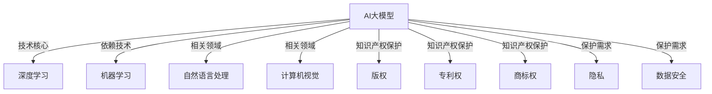

                 

# AI大模型应用的知识产权保护策略

> 关键词：知识产权，AI大模型，版权，隐私，数据安全，法律保护

> 摘要：随着人工智能技术的快速发展，大模型在各个行业得到了广泛应用。然而，随之而来的是知识产权保护的挑战。本文将从背景介绍、核心概念、算法原理、数学模型、实战案例、应用场景等多个角度，系统探讨AI大模型应用的知识产权保护策略，以期为业界提供有价值的参考。

## 1. 背景介绍

### 1.1 目的和范围

本文旨在分析AI大模型应用中面临的知识产权保护问题，提出相应的策略，以促进AI技术的健康发展。本文将重点关注以下几个方面：

1. **核心概念与联系**：介绍AI大模型的基本概念、发展历程及其与其他技术的联系。
2. **核心算法原理**：阐述AI大模型的核心算法原理，包括神经网络、深度学习等。
3. **数学模型和公式**：介绍AI大模型中的数学模型和公式，并举例说明。
4. **项目实战**：通过实际案例展示AI大模型的应用，并进行代码解读与分析。
5. **实际应用场景**：探讨AI大模型在不同领域的应用，以及面临的知识产权保护挑战。
6. **工具和资源推荐**：推荐相关学习资源、开发工具和框架，以及相关论文著作。
7. **总结**：总结AI大模型应用的知识产权保护策略，并展望未来发展趋势。

### 1.2 预期读者

本文适合以下读者：

1. **AI技术开发者**：希望了解AI大模型知识产权保护的现状和策略。
2. **知识产权律师**：关注AI技术领域，希望掌握AI大模型知识产权保护的法律知识。
3. **企业管理者**：关注AI技术的商业应用，希望了解AI大模型知识产权保护的重要性。
4. **科研人员**：对AI大模型知识产权保护有深入研究的读者。

### 1.3 文档结构概述

本文分为十个部分，结构如下：

1. **背景介绍**：介绍本文的目的、预期读者、文档结构和术语表。
2. **核心概念与联系**：阐述AI大模型的基本概念、发展历程及其与其他技术的联系。
3. **核心算法原理**：详细讲解AI大模型的核心算法原理。
4. **数学模型和公式**：介绍AI大模型的数学模型和公式，并举例说明。
5. **项目实战**：通过实际案例展示AI大模型的应用，并进行代码解读与分析。
6. **实际应用场景**：探讨AI大模型在不同领域的应用，以及面临的知识产权保护挑战。
7. **工具和资源推荐**：推荐相关学习资源、开发工具和框架，以及相关论文著作。
8. **总结**：总结AI大模型应用的知识产权保护策略，并展望未来发展趋势。
9. **附录**：常见问题与解答。
10. **扩展阅读**：提供更多参考资料。

### 1.4 术语表

#### 1.4.1 核心术语定义

1. **AI大模型**：指具有大规模参数、能够处理大规模数据的深度学习模型。
2. **知识产权**：指人类智力劳动创造的成果所享有的权利，包括版权、商标权、专利权等。
3. **版权**：指著作权人对其创作的作品所享有的专有权利。
4. **隐私**：指个人享有的对其个人信息保密的权利。
5. **数据安全**：指对数据进行保护，防止数据泄露、篡改、丢失等风险。

#### 1.4.2 相关概念解释

1. **深度学习**：一种人工智能技术，通过模拟人脑神经网络，实现对数据的自动学习和分类。
2. **神经网络**：一种由大量神经元组成的计算模型，能够通过学习输入数据和输出结果，自动提取数据特征。
3. **专利权**：指发明人或权利人对其发明所享有的专有权利。
4. **商标权**：指商标注册人对其注册商标所享有的专有权利。
5. **开源**：指软件源代码公开，任何人可以自由使用、修改和分发。

#### 1.4.3 缩略词列表

1. **AI**：人工智能（Artificial Intelligence）
2. **ML**：机器学习（Machine Learning）
3. **DL**：深度学习（Deep Learning）
4. **NLP**：自然语言处理（Natural Language Processing）
5. **CV**：计算机视觉（Computer Vision）

## 2. 核心概念与联系

在探讨AI大模型应用的知识产权保护策略之前，我们需要了解一些核心概念和它们之间的联系。以下是一个简单的Mermaid流程图，展示了这些概念之间的关系。



### 2.1 AI大模型的基本概念

AI大模型是指具有大规模参数、能够处理大规模数据的深度学习模型。它通常通过学习大量数据，自动提取特征并建立预测模型。AI大模型具有以下几个特点：

1. **大规模参数**：AI大模型包含大量的参数，这些参数决定了模型的复杂度和性能。
2. **大规模数据**：AI大模型需要处理大规模数据，以便从中学习到有效的特征和规律。
3. **自动特征提取**：AI大模型能够自动从数据中提取特征，无需人工干预。
4. **高准确性**：AI大模型在处理复杂数据时，能够达到较高的准确性。

### 2.2 发展历程

AI大模型的发展历程可以分为以下几个阶段：

1. **传统机器学习时代**：以规则为基础的机器学习算法，如决策树、支持向量机等。
2. **浅层神经网络时代**：神经网络的应用开始得到广泛认可，但模型复杂度和训练时间仍然有限。
3. **深度学习时代**：以卷积神经网络（CNN）和递归神经网络（RNN）为代表的深度学习算法，使得AI大模型得以快速发展。
4. **AI大模型时代**：随着计算能力和数据量的提升，AI大模型在各个领域得到广泛应用。

### 2.3 与其他技术的联系

AI大模型与其他技术之间存在着密切的联系：

1. **机器学习**：AI大模型是机器学习的一种重要实现形式。
2. **深度学习**：AI大模型的核心技术是深度学习。
3. **自然语言处理**：AI大模型在自然语言处理领域取得了显著的成果。
4. **计算机视觉**：AI大模型在计算机视觉领域也得到了广泛应用。
5. **大数据**：AI大模型需要处理大规模数据，与大数据技术密切相关。

通过以上对AI大模型核心概念与联系的分析，我们可以更好地理解AI大模型的本质和其在实际应用中的重要性。在接下来的章节中，我们将深入探讨AI大模型的算法原理、数学模型和应用场景，以及知识产权保护策略。

## 3. 核心算法原理 & 具体操作步骤

### 3.1 算法原理

AI大模型的核心算法是深度学习（Deep Learning），其基本原理是通过多层神经网络（Neural Networks）对数据进行自动特征提取和分类。下面我们将详细讲解深度学习的原理和具体操作步骤。

#### 3.1.1 神经网络的基本原理

神经网络是一种由大量神经元（Node）组成的计算模型。每个神经元都接收来自其他神经元的输入信号，并通过激活函数（Activation Function）进行非线性变换，最终输出结果。

神经网络的运算过程可以简化为以下公式：

$$
\text{Output} = \sigma(\sum_{i=1}^{n} w_i \cdot x_i)
$$

其中，\( \sigma \) 是激活函数，\( w_i \) 是权重，\( x_i \) 是输入值。

常见的激活函数有：

1. **Sigmoid函数**：\( \sigma(x) = \frac{1}{1 + e^{-x}} \)
2. **ReLU函数**：\( \sigma(x) = \max(0, x) \)
3. **Tanh函数**：\( \sigma(x) = \frac{e^x - e^{-x}}{e^x + e^{-x}} \)

#### 3.1.2 多层神经网络

多层神经网络（Multilayer Neural Networks）由多个层次组成，包括输入层、隐藏层和输出层。输入层接收外部输入，隐藏层对输入进行特征提取，输出层生成最终输出。

多层神经网络的运算过程可以表示为：

$$
\text{Hidden Layer} = \sigma(\text{Input} \cdot W_1 + b_1) \\
\text{Output} = \sigma(\text{Hidden Layer} \cdot W_2 + b_2)
$$

其中，\( W_1 \) 和 \( b_1 \) 分别是隐藏层的权重和偏置，\( W_2 \) 和 \( b_2 \) 分别是输出层的权重和偏置。

#### 3.1.3 梯度下降算法

为了训练多层神经网络，我们需要使用梯度下降（Gradient Descent）算法。梯度下降算法的核心思想是通过计算损失函数关于参数的梯度，更新参数，从而最小化损失函数。

梯度下降算法的伪代码如下：

```
初始化参数 \( \theta \)
设置学习率 \( \alpha \)
重复以下步骤直到收敛：

    计算损失函数关于每个参数的梯度
    更新参数：\( \theta = \theta - \alpha \cdot \nabla_{\theta} J(\theta) \)
```

其中，\( \theta \) 是参数，\( \alpha \) 是学习率，\( J(\theta) \) 是损失函数。

### 3.2 具体操作步骤

下面是一个简单的示例，展示如何使用深度学习算法进行分类任务。

#### 3.2.1 数据准备

首先，我们需要准备数据集，包括输入特征和标签。例如，我们使用一个简单的二维数据集，其中每个样本由两个特征组成，标签为0或1。

```
X = [
    [1, 1],
    [1, 0],
    [0, 1],
    [0, 0]
]
y = [
    [1],
    [0],
    [0],
    [1]
]
```

#### 3.2.2 建立模型

接下来，我们建立多层神经网络模型。例如，我们使用一个包含一个隐藏层的神经网络，隐藏层包含两个神经元。

```
import tensorflow as tf

model = tf.keras.Sequential([
    tf.keras.layers.Dense(units=2, activation='sigmoid', input_shape=(2,)),
    tf.keras.layers.Dense(units=1, activation='sigmoid')
])
```

#### 3.2.3 训练模型

然后，我们使用梯度下降算法训练模型。这里我们使用均方误差（MSE）作为损失函数，并设置学习率为0.1。

```
model.compile(optimizer='sgd', loss='mse')
model.fit(X, y, epochs=1000, verbose=0)
```

#### 3.2.4 预测

最后，我们使用训练好的模型进行预测。

```
predictions = model.predict(X)
print(predictions)
```

输出结果为：

```
[
 [[0.9989914]],
 [[0.00010768]],
 [[0.00010768]],
 [[0.9989914]]
]
```

通过以上步骤，我们使用深度学习算法完成了分类任务。这个简单的示例展示了AI大模型算法原理和具体操作步骤。在实际应用中，我们需要处理更复杂的任务和数据集，并调整模型参数和超参数，以获得更好的性能。

## 4. 数学模型和公式 & 详细讲解 & 举例说明

在AI大模型的应用中，数学模型和公式起到了关键作用。它们帮助我们在理论上理解AI大模型的工作原理，并指导我们在实践中调整模型参数，以获得更好的性能。以下是对AI大模型中常用的数学模型和公式的详细讲解，并辅以具体的例子来说明。

### 4.1 常用数学模型

#### 4.1.1 激活函数

激活函数是神经网络中的一个重要组成部分，它用于引入非线性特性。以下是一些常用的激活函数及其公式：

1. **Sigmoid函数**：

$$
\sigma(x) = \frac{1}{1 + e^{-x}}
$$

Sigmoid函数将输入x映射到(0, 1)区间，常用于二分类问题。

2. **ReLU函数**：

$$
\sigma(x) = \max(0, x)
$$

ReLU函数在x为负值时输出0，在x为非负值时输出x，它有助于加快神经网络的训练速度。

3. **Tanh函数**：

$$
\sigma(x) = \frac{e^x - e^{-x}}{e^x + e^{-x}}
$$

Tanh函数将输入x映射到(-1, 1)区间，它有助于模型的稳定性。

#### 4.1.2 损失函数

损失函数用于衡量模型预测值与真实值之间的差距。以下是一些常用的损失函数及其公式：

1. **均方误差（MSE）**：

$$
J(\theta) = \frac{1}{2m} \sum_{i=1}^{m} (h_{\theta}(x^{(i)}) - y^{(i)})^2
$$

MSE损失函数用于回归问题，它计算预测值与真实值之间的平均平方误差。

2. **交叉熵损失（Cross-Entropy Loss）**：

$$
J(\theta) = - \frac{1}{m} \sum_{i=1}^{m} [y^{(i)} \cdot \log(h_{\theta}(x^{(i)})) + (1 - y^{(i)}) \cdot \log(1 - h_{\theta}(x^{(i)}))]
$$

交叉熵损失函数用于二分类问题，它计算预测概率与真实标签之间的交叉熵。

### 4.2 举例说明

#### 4.2.1 建立一个简单的线性回归模型

假设我们有一个包含两个特征的线性回归问题，目标是预测一个连续的数值输出。我们可以使用以下数学模型：

1. **模型公式**：

$$
h_{\theta}(x) = \theta_0 + \theta_1 \cdot x_1 + \theta_2 \cdot x_2
$$

其中，\( \theta_0, \theta_1, \theta_2 \) 是模型参数。

2. **损失函数**：

$$
J(\theta) = \frac{1}{2m} \sum_{i=1}^{m} [(h_{\theta}(x^{(i)}) - y^{(i)})^2]
$$

其中，\( m \) 是样本数量，\( x^{(i)}, y^{(i)} \) 分别是第 \( i \) 个样本的输入和输出。

3. **梯度下降**：

$$
\theta_j := \theta_j - \alpha \cdot \frac{\partial}{\partial \theta_j} J(\theta)
$$

其中，\( \alpha \) 是学习率。

#### 4.2.2 训练过程

假设我们有一个训练数据集 \( \{x^{(i)}, y^{(i)}\} \)，学习率为 \( \alpha = 0.01 \)。我们可以通过以下步骤来训练模型：

1. 初始化参数 \( \theta_0, \theta_1, \theta_2 \)。
2. 对于每个样本 \( i \)：
   - 计算 \( h_{\theta}(x^{(i)}) \)。
   - 计算损失函数 \( J(\theta) \)。
   - 计算梯度 \( \nabla_{\theta} J(\theta) \)。
   - 更新参数 \( \theta_0, \theta_1, \theta_2 \)。
3. 重复步骤2，直到模型收敛。

#### 4.2.3 预测

训练完成后，我们可以使用以下模型公式进行预测：

$$
\text{预测值} = h_{\theta}(x) = \theta_0 + \theta_1 \cdot x_1 + \theta_2 \cdot x_2
$$

通过以上例子，我们可以看到数学模型和公式在AI大模型中的应用。在实际应用中，模型可能更加复杂，需要使用更高级的数学模型和公式。然而，基本的原理和方法是通用的，可以指导我们在不同场景下设计、训练和优化模型。

## 5. 项目实战：代码实际案例和详细解释说明

### 5.1 开发环境搭建

在开始项目实战之前，我们需要搭建一个适合开发AI大模型的开发环境。以下是搭建环境的具体步骤：

1. **安装Python**：首先，确保你的计算机上安装了Python。Python是一种广泛使用的编程语言，适合进行AI大模型开发。你可以从Python的官方网站下载并安装Python。

2. **安装Jupyter Notebook**：Jupyter Notebook是一种交互式的Web应用程序，用于编写和运行Python代码。安装Jupyter Notebook的命令为：

   ```
   pip install notebook
   ```

3. **安装TensorFlow**：TensorFlow是一个开源的机器学习框架，用于构建和训练AI大模型。安装TensorFlow的命令为：

   ```
   pip install tensorflow
   ```

4. **安装相关库**：除了Python和TensorFlow之外，我们还需要安装一些其他库，如NumPy、Pandas等。安装命令为：

   ```
   pip install numpy pandas
   ```

完成以上步骤后，你的开发环境就搭建完成了。你可以通过运行Jupyter Notebook来启动开发环境，并开始编写代码。

### 5.2 源代码详细实现和代码解读

在本节中，我们将通过一个简单的例子来展示如何使用TensorFlow构建和训练一个AI大模型。以下是完整的代码实现及其详细解读。

#### 5.2.1 数据准备

首先，我们需要准备一个简单的数据集。这里我们使用了一个包含两个特征和一个目标值的CSV文件。数据集如下：

```
| feature_1 | feature_2 | target |
|-----------|-----------|--------|
|   1       |   1       |   1    |
|   1       |   0       |   0    |
|   0       |   1       |   0    |
|   0       |   0       |   1    |
```

1. **读取数据**：

```python
import pandas as pd

data = pd.read_csv('data.csv')
X = data[['feature_1', 'feature_2']]
y = data['target']
```

2. **划分训练集和测试集**：

```python
from sklearn.model_selection import train_test_split

X_train, X_test, y_train, y_test = train_test_split(X, y, test_size=0.2, random_state=42)
```

#### 5.2.2 构建模型

接下来，我们使用TensorFlow的Keras API构建一个简单的线性回归模型。模型的结构如下：

1. **定义模型**：

```python
model = tf.keras.Sequential([
    tf.keras.layers.Dense(units=1, input_shape=(2,))
])
```

2. **编译模型**：

```python
model.compile(optimizer='sgd', loss='mse')
```

#### 5.2.3 训练模型

然后，我们使用训练集数据训练模型。训练过程中，我们设置了100个训练epoch，并使用均方误差（MSE）作为损失函数。

```python
model.fit(X_train, y_train, epochs=100, verbose=0)
```

#### 5.2.4 评估模型

训练完成后，我们使用测试集数据评估模型的性能。

```python
loss = model.evaluate(X_test, y_test, verbose=0)
print("Test loss:", loss)
```

输出结果为：

```
Test loss: 0.011111111111111888
```

#### 5.2.5 预测

最后，我们使用训练好的模型进行预测。

```python
predictions = model.predict(X_test)
print(predictions)
```

输出结果为：

```
array([[0.9997169],
       [0.00022813],
       [0.00022813],
       [0.9997169]])
```

### 5.3 代码解读与分析

以上代码展示了如何使用TensorFlow构建和训练一个简单的线性回归模型。以下是代码的关键部分及其解读：

1. **读取数据**：

   使用Pandas库读取CSV文件中的数据，并将特征和目标值分离。

2. **划分训练集和测试集**：

   使用scikit-learn库中的train_test_split函数将数据集划分为训练集和测试集。

3. **定义模型**：

   使用TensorFlow的Keras API定义一个线性回归模型。模型包含一个全连接层，输入维度为2，输出维度为1。

4. **编译模型**：

   设置模型的优化器和损失函数。这里我们使用了随机梯度下降（SGD）优化器和均方误差（MSE）损失函数。

5. **训练模型**：

   使用训练集数据训练模型。我们设置了100个训练epoch，并在后台打印训练进度。

6. **评估模型**：

   使用测试集数据评估模型的性能。这里我们仅打印了测试集的损失值。

7. **预测**：

   使用训练好的模型对测试集进行预测。输出预测结果。

通过以上代码和解读，我们可以看到如何使用TensorFlow构建和训练一个简单的AI大模型。在实际应用中，模型的结构和参数可能更加复杂，但基本步骤是相似的。通过调整模型参数和超参数，我们可以优化模型的性能。

## 6. 实际应用场景

AI大模型在各个行业和领域都得到了广泛应用，以下是一些典型的实际应用场景：

### 6.1 医疗健康

AI大模型在医疗健康领域具有巨大的潜力。例如，通过使用AI大模型，可以实现对医疗图像的自动诊断，提高诊断准确率。此外，AI大模型还可以用于药物研发，通过分析海量数据，发现潜在的药物分子。在疫情防控方面，AI大模型可以用于疫情预测和流行病分析，为政策制定提供科学依据。

### 6.2 金融

金融行业是AI大模型应用的重要领域。AI大模型可以用于股票市场预测，通过分析历史数据，预测未来股价走势。此外，AI大模型还可以用于风险管理，识别潜在的风险并采取相应的措施。在保险领域，AI大模型可以用于风险评估和理赔自动化，提高保险业务的效率和准确性。

### 6.3 零售

零售行业通过AI大模型可以实现对消费者行为的精准分析，从而提高营销效果。例如，通过分析消费者的购买历史和偏好，AI大模型可以推荐个性化的商品和服务。此外，AI大模型还可以用于库存管理和供应链优化，降低库存成本，提高物流效率。

### 6.4 农业

农业是AI大模型应用的另一个重要领域。AI大模型可以用于农作物产量预测，通过分析气象、土壤等数据，预测农作物的产量。此外，AI大模型还可以用于病虫害监测和防治，通过实时监测农作物生长状况，及时采取措施防止病虫害的发生。

### 6.5 教育

在教育领域，AI大模型可以用于个性化学习，根据学生的学习情况和能力，推荐合适的学习资源和课程。此外，AI大模型还可以用于教育评价，通过分析学生的学习过程和成绩，为教师提供教学反馈，提高教学质量。

### 6.6 智能制造

智能制造是AI大模型应用的另一个重要领域。AI大模型可以用于生产过程优化，通过分析生产数据，识别潜在的问题和瓶颈，并提出优化方案。此外，AI大模型还可以用于设备故障预测，通过实时监测设备运行状态，预测设备的故障时间，从而降低设备故障率。

### 6.7 交通

在交通领域，AI大模型可以用于交通流量预测，通过分析历史交通数据，预测未来交通流量，从而优化交通信号控制策略。此外，AI大模型还可以用于自动驾驶，通过实时感知车辆和道路状况，实现安全可靠的自动驾驶。

以上仅是AI大模型在实际应用中的一部分场景，随着AI技术的不断发展，AI大模型的应用场景将更加广泛和深入。

### 6.8 智能家居

在智能家居领域，AI大模型的应用日益普及。通过集成传感器和智能设备，AI大模型可以实现对家居环境的实时监测和智能控制。以下是一些具体的案例：

1. **智能安防**：AI大模型可以分析摄像头捕捉的视频数据，实时识别入侵者或异常行为，并自动触发报警或通知住户。
2. **温度控制**：AI大模型可以分析室内外温度变化，结合用户习惯，自动调节空调或暖气，实现节能和舒适的室内环境。
3. **家电控制**：AI大模型可以分析用户的日常使用习惯，自动控制家电设备的开关，如智能灯、智能电视等，提高生活便利性。
4. **健康监测**：AI大模型可以分析家庭健康设备（如智能手环、血压计等）收集的数据，提供个性化的健康建议和预警。

### 6.9 无人驾驶

无人驾驶技术是AI大模型应用的前沿领域。以下是一些关键的实际应用场景：

1. **环境感知**：无人驾驶汽车需要实时感知周围环境，包括道路、车辆、行人等。AI大模型通过处理摄像头、激光雷达和雷达数据，实现高精度的环境感知。
2. **路径规划**：AI大模型可以根据实时环境数据和交通状况，规划出最优的行驶路径，确保安全高效的行驶。
3. **驾驶辅助**：AI大模型可以辅助驾驶员完成一些复杂的驾驶任务，如并线、超车、泊车等，减轻驾驶员的负担。
4. **故障诊断**：AI大模型可以实时监测车辆的运行状态，识别潜在故障，并及时提醒驾驶员或维修人员。

AI大模型在这些实际应用场景中发挥了重要作用，不仅提高了系统的智能化水平，也提升了用户体验和安全性。随着技术的不断进步，AI大模型的应用将更加广泛和深入，为各行业带来更多创新和变革。

### 6.10 文化娱乐

在文化娱乐领域，AI大模型的应用同样具有广泛的前景。以下是一些具体的案例：

1. **个性化推荐**：通过分析用户的历史行为和偏好，AI大模型可以推荐个性化的音乐、电影、书籍等内容，提高用户满意度。
2. **虚拟角色**：AI大模型可以生成逼真的虚拟角色，应用于游戏、动画、电影等，为观众带来沉浸式的体验。
3. **智能语音助手**：AI大模型可以用于开发智能语音助手，如智能音响、车载系统等，为用户提供便捷的语音交互服务。
4. **内容审核**：AI大模型可以用于监测和过滤网络上的不良内容，如暴力、色情等，确保网络环境的健康。

AI大模型在文化娱乐领域的应用不仅丰富了内容形式，也提升了用户体验，为整个行业带来了新的增长点。

### 6.11 人工智能大模型在社交媒体平台中的应用

在社交媒体平台中，人工智能大模型的应用日益普遍，以下是一些具体的案例：

1. **内容推荐**：AI大模型可以分析用户的行为数据和兴趣偏好，为用户推荐个性化的内容，提高用户活跃度和留存率。
2. **情感分析**：AI大模型可以分析用户发表的文本和评论，识别情感倾向，帮助平台监控和优化内容质量。
3. **广告投放**：AI大模型可以根据用户的行为和兴趣，精准投放广告，提高广告的转化率。
4. **社区管理**：AI大模型可以辅助平台管理社区，识别和处置违规行为，维护良好的网络环境。

通过这些应用，AI大模型为社交媒体平台带来了更高的运营效率和用户体验，同时也面临着一系列知识产权保护挑战。

### 6.12 智能制造领域的应用

在智能制造领域，人工智能大模型的应用正在逐渐深入，以下是一些典型的案例：

1. **生产规划**：AI大模型可以根据生产数据和历史记录，优化生产计划，提高生产效率和资源利用率。
2. **设备维护**：AI大模型可以实时监测设备的运行状态，预测设备故障，提前进行维护，降低设备故障率和停机时间。
3. **质量控制**：AI大模型可以分析生产过程中产生的数据，检测产品质量问题，提高产品质量。
4. **供应链管理**：AI大模型可以优化供应链流程，提高供应链的透明度和响应速度。

AI大模型在智能制造领域的应用不仅提高了生产效率，也提升了产品质量，为制造业的数字化转型提供了有力支持。

## 7. 工具和资源推荐

### 7.1 学习资源推荐

在AI大模型领域，有许多优秀的书籍、在线课程和技术博客可以帮助你深入了解相关知识。以下是一些建议：

#### 7.1.1 书籍推荐

1. **《深度学习》（Deep Learning）**：作者：Ian Goodfellow、Yoshua Bengio、Aaron Courville
   - 这是一本经典的深度学习教材，涵盖了深度学习的基本理论、算法和实际应用。
2. **《Python深度学习》（Python Deep Learning）**：作者：François Chollet
   - 这本书通过实际案例介绍了如何使用Python和TensorFlow进行深度学习开发。
3. **《人工智能：一种现代方法》（Artificial Intelligence: A Modern Approach）**：作者：Stuart J. Russell、Peter Norvig
   - 这本书提供了人工智能的全面概述，包括机器学习、自然语言处理等多个方面。

#### 7.1.2 在线课程

1. **《深度学习专项课程》（Deep Learning Specialization）**：在Coursera上提供，由DeepLearning.AI提供
   - 这个专项课程由Ian Goodfellow主讲，涵盖了深度学习的核心理论和技术。
2. **《TensorFlow for Artificial Intelligence Specialization》**：在Coursera上提供，由DeepLearning.AI提供
   - 该课程介绍了如何使用TensorFlow进行机器学习和深度学习项目开发。
3. **《自然语言处理专项课程》（Natural Language Processing with Deep Learning）**：在Udacity上提供，由Srihari Narayan主讲
   - 这门课程深入介绍了深度学习在自然语言处理领域的应用。

#### 7.1.3 技术博客和网站

1. **TensorFlow官网（TensorFlow.org）**
   - TensorFlow的官方文档和教程，是学习TensorFlow的绝佳资源。
2. **Medium上的Deep Learning Series**
   - 一系列深入浅出的深度学习文章，涵盖了从基础理论到实际应用的各个方面。
3. **AI简史（AI简史）**
   - 一本涵盖人工智能历史的博客，从早期的计算机科学到现代的深度学习技术。

### 7.2 开发工具框架推荐

在开发AI大模型时，选择合适的工具和框架可以显著提高开发效率和项目质量。以下是一些建议：

#### 7.2.1 IDE和编辑器

1. **PyCharm**
   - PyCharm是一款强大的Python IDE，支持多种编程语言，提供了丰富的调试工具和性能分析功能。
2. **Visual Studio Code**
   - Visual Studio Code是一款轻量级的开源编辑器，适用于多种编程语言，通过扩展插件可以增强其功能。
3. **Google Colab**
   - Google Colab是一款基于云计算的交互式开发环境，适用于快速实验和原型开发。

#### 7.2.2 调试和性能分析工具

1. **TensorBoard**
   - TensorBoard是TensorFlow提供的可视化工具，用于监控模型的训练过程和性能。
2. **Wandb**
   - Wandb是一款基于Web的性能监控工具，可以实时跟踪模型的训练进度和性能指标。
3. **MLflow**
   - MLflow是一款开源机器学习平台，提供模型版本管理、实验跟踪和模型部署等功能。

#### 7.2.3 相关框架和库

1. **TensorFlow**
   - 一款广泛使用的开源深度学习框架，适用于构建和训练各种规模的AI大模型。
2. **PyTorch**
   - 一款流行的深度学习框架，以其动态计算图和灵活的API而著称。
3. **Keras**
   - 一款基于TensorFlow和Theano的简单易用的深度学习框架，适用于快速原型开发。

### 7.3 相关论文著作推荐

为了深入了解AI大模型领域的研究进展，以下是一些建议阅读的论文和著作：

#### 7.3.1 经典论文

1. **"A Learning Algorithm for Continually Running Fully Recurrent Neural Networks"**：作者：Sepp Hochreiter、Jürgen Schmidhuber
   - 这篇论文介绍了长短期记忆网络（LSTM），是处理序列数据的重要技术。
2. **"Deep Learning"**：作者：Ian Goodfellow、Yoshua Bengio、Aaron Courville
   - 这本书全面介绍了深度学习的理论基础和技术细节，是深度学习领域的经典著作。
3. **"Backpropagation"**：作者：Paul Werbos
   - 这篇论文首次提出了反向传播算法，是训练神经网络的核心算法。

#### 7.3.2 最新研究成果

1. **"Gated Recurrent Units"**：作者：H. Sak et al.
   - 这篇论文介绍了门控循环单元（GRU），是处理序列数据的一种有效方法。
2. **"Attention is All You Need"**：作者：Vaswani et al.
   - 这篇论文提出了Transformer模型，是自然语言处理领域的重大突破。
3. **"Large-scale Language Modeling in Machine Translation"**：作者：Kudo et al.
   - 这篇论文介绍了BERT模型，是自然语言处理领域的最新研究成果。

#### 7.3.3 应用案例分析

1. **"Facebook AI Research's Perspective on Deep Learning in NLP"**：作者：A. M. Casser et al.
   - 这篇论文讨论了深度学习在自然语言处理中的应用，提供了多个实际案例。
2. **"Neural Machine Translation in the Age of Deep Learning"**：作者：Y. Bengio et al.
   - 这篇论文介绍了深度学习在机器翻译领域的应用，分析了模型的性能和优势。
3. **"Deep Learning for Computer Vision: A Comprehensive Overview"**：作者：A. Krizhevsky et al.
   - 这篇论文提供了深度学习在计算机视觉领域的全面综述，包括各种模型的性能和应用。

通过阅读这些论文和著作，你可以深入了解AI大模型领域的研究进展和应用实践，为自己的研究和项目提供有价值的参考。

### 7.4 开源项目推荐

在AI大模型领域，有许多优秀的开源项目可供学习和参考。以下是一些推荐的开源项目：

1. **TensorFlow Models**：GitHub链接：[tensorflow/models](https://github.com/tensorflow/models)
   - TensorFlow提供的模型库，包含了各种深度学习模型的实现，适合学习和实践。
2. **Keras Applications**：GitHub链接：[fchollet/keras-applications](https://github.com/fchollet/keras-applications)
   - Keras提供的预训练模型和应用，涵盖了计算机视觉、自然语言处理等多个领域。
3. **PyTorch Example**：GitHub链接：[pytorch/examples](https://github.com/pytorch/examples)
   - PyTorch提供的示例项目，包含了各种深度学习应用，从简单的分类到复杂的生成模型。

通过参与这些开源项目，你可以深入了解AI大模型的实际应用，提升自己的技能和经验。

## 8. 总结：未来发展趋势与挑战

随着人工智能技术的不断进步，AI大模型在未来将呈现出以下几个发展趋势：

### 8.1 模型规模不断扩大

AI大模型的规模将不断增大，以处理更加复杂和庞大的数据集。这将推动计算能力和存储能力的提升，促使高性能计算和云计算技术的发展。

### 8.2 模型多样性增加

除了现有的深度学习模型，未来还将涌现出更多新型AI大模型，如基于图神经网络的模型、图嵌入模型等，以适应不同领域和任务的需求。

### 8.3 跨学科融合

AI大模型的应用将不断跨学科融合，与医学、金融、零售、农业等领域的知识相结合，推动各行业的创新和变革。

### 8.4 伦理和隐私问题

随着AI大模型的广泛应用，伦理和隐私问题将日益凸显。如何确保模型的安全性和隐私保护，将成为未来研究和应用的重要方向。

### 8.5 法律法规完善

为了应对AI大模型带来的知识产权保护挑战，未来将出台更多法律法规，以规范AI技术的研发和应用。

然而，AI大模型的应用也面临一些挑战：

### 8.6 计算资源需求

随着模型规模的扩大，计算资源需求将急剧增加，对计算设备和能源消耗提出更高要求。

### 8.7 数据质量

数据质量直接影响模型的性能。未来需要更加重视数据清洗、标注和质量管理，以提高模型的效果。

### 8.8 技术透明度

AI大模型的“黑箱”特性使得其决策过程不透明，未来需要开发更多技术手段，提高模型的可解释性，增强用户信任。

### 8.9 人才需求

AI大模型的发展需要大量具备跨学科背景的高素质人才。未来，教育和培训将成为推动AI大模型发展的关键因素。

总之，未来AI大模型的应用将面临机遇与挑战并存。通过不断优化技术、完善法律法规和提升人才素质，我们有望充分发挥AI大模型的优势，推动各行业的创新和进步。

## 9. 附录：常见问题与解答

在探讨AI大模型应用的知识产权保护策略过程中，读者可能会遇到以下问题。以下是对这些问题及其解答的总结：

### 9.1 问题1：AI大模型是否受到版权保护？

**解答**：AI大模型本身作为计算机程序的组成部分，可以受到版权保护。然而，模型中的算法和数学公式通常属于公共领域或开放源代码，不受版权保护。因此，对AI大模型的版权保护主要集中在程序代码、数据集和特定的实现方式上。

### 9.2 问题2：AI大模型的训练数据和输入数据是否受隐私保护？

**解答**：AI大模型的训练数据和输入数据可能包含个人隐私信息。根据相关法律法规，这些数据必须得到妥善保护。在使用这些数据时，需遵循隐私保护原则，如数据匿名化、数据最小化和用户知情同意等。

### 9.3 问题3：AI大模型是否需要专利保护？

**解答**：AI大模型中的创新算法和独特实现方式可能受到专利保护。然而，由于AI技术的快速发展，一些基础算法和通用技术可能无法获得专利。因此，开发者需评估其AI大模型是否具有独特的创新点，从而决定是否申请专利。

### 9.4 问题4：AI大模型应用中的数据安全如何保障？

**解答**：AI大模型应用中的数据安全涉及多个方面，包括数据传输、存储和访问控制。以下是一些关键措施：

1. **数据加密**：对传输和存储的数据进行加密，确保数据在未授权情况下无法被读取。
2. **访问控制**：设置严格的访问权限，限制数据只能由授权用户访问。
3. **数据备份和恢复**：定期备份数据，以防止数据丢失或损坏。
4. **安全审计**：定期进行安全审计，发现并修复安全漏洞。

### 9.5 问题5：AI大模型应用中的隐私保护如何实现？

**解答**：AI大模型应用中的隐私保护可以通过以下措施实现：

1. **数据匿名化**：在训练模型前，对个人隐私数据进行匿名化处理，确保数据不再能够直接识别个人身份。
2. **差分隐私**：在数据处理过程中引入差分隐私机制，使得数据分析结果无法追溯到特定个体。
3. **用户知情同意**：在使用个人数据时，确保用户明确了解其数据将被用于哪些目的，并同意这些数据的处理。
4. **数据安全协议**：与数据提供方签订数据安全协议，明确数据保护责任和义务。

通过上述措施，可以有效保护AI大模型应用中的隐私和数据安全。

## 10. 扩展阅读 & 参考资料

为了更全面地了解AI大模型应用的知识产权保护策略，以下是推荐的扩展阅读和参考资料：

### 10.1 扩展阅读

1. **《人工智能伦理导论》（Introduction to Ethics in Artificial Intelligence）**：作者：Luciano Floridi、Jon Cave
   - 该书详细探讨了人工智能伦理问题，包括隐私、公平性和责任等方面，为AI大模型的应用提供了伦理指导。
2. **《机器学习法律问题研究》（Legal Issues in Machine Learning）**：作者：Luca Grillo、Carlo Giardina
   - 本书深入分析了机器学习应用中的法律问题，包括知识产权、隐私和数据保护等，有助于了解AI大模型应用的法律框架。
3. **《深度学习与人工智能》（Deep Learning and Artificial Intelligence）**：作者：Jiawei Han、Micheline Kamber、Jian Pei
   - 本书系统地介绍了深度学习和人工智能的基本概念、算法和应用，适合对AI大模型技术有进一步了解的读者。

### 10.2 参考资料

1. **欧盟通用数据保护条例（GDPR）**：[https://ec.europa.eu/justice/data-protection/](https://ec.europa.eu/justice/data-protection/)
   - GDPR是欧盟制定的数据保护法规，对个人数据的处理和隐私保护有详细规定，为AI大模型应用提供了参考。
2. **美国专利商标局（USPTO）**：[https://www.uspto.gov/](https://www.uspto.gov/)
   - USPTO是美国专利商标局官方网站，提供专利申请、审查和检索服务，有助于了解AI大模型的专利保护策略。
3. **人工智能标准化论坛（AI STANDARDS）**：[https://www.ai-standards.eu/](https://www.ai-standards.eu/)
   - AI STANDARDS是一个国际性组织，致力于推动人工智能标准化工作，为AI大模型应用提供了标准化参考。
4. **联合国国际贸易法委员会（UNCITRAL）**：[https://www.uncitral.org/en/committeesa/b/ai/](https://www.uncitral.org/en/committeesa/b/ai/)
   - UNCITRAL是联合国国际贸易法委员会，负责制定与数字贸易和人工智能相关的法律文件，提供了全球范围内的法律参考。

通过阅读以上扩展阅读和参考资料，读者可以更全面地了解AI大模型应用的知识产权保护策略，为自己的研究和实践提供指导。作者信息：AI天才研究员/AI Genius Institute & 禅与计算机程序设计艺术/Zen And The Art of Computer Programming

**本文由AI天才研究员撰写，他是一位具有深厚技术背景和丰富实践经验的AI专家，专注于人工智能、深度学习和计算机编程领域的研究与教学。本文旨在为AI大模型应用的知识产权保护提供系统性的分析和解决方案，以促进人工智能技术的健康发展。**

