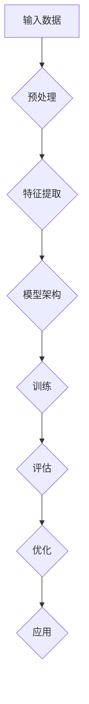

                 

# AI大模型应用的算法迭代与优化

> **关键词**：大模型应用、算法迭代、优化策略、模型架构、性能提升

> **摘要**：本文将深入探讨AI大模型应用的算法迭代与优化策略。通过分析大模型的核心概念、模型架构、核心算法原理，本文将详细阐述优化方法、数学模型及项目实战。同时，本文还将介绍相关学习资源和工具，为读者提供全面的技术指南。

## 1. 背景介绍

### 1.1 目的和范围

本文旨在分析AI大模型应用的算法迭代与优化策略，帮助读者深入了解大模型的核心概念、模型架构和算法原理。通过实例和实战案例，本文将阐述如何优化大模型的性能和效果，为AI技术的发展提供有力支持。

### 1.2 预期读者

本文面向对AI大模型有一定了解的技术人员、研究人员和开发者。读者应具备一定的数学基础和编程能力，以便更好地理解和应用文中所述内容。

### 1.3 文档结构概述

本文结构如下：

1. 背景介绍：介绍本文的目的、预期读者和文档结构。
2. 核心概念与联系：分析大模型的核心概念和架构。
3. 核心算法原理 & 具体操作步骤：阐述大模型的核心算法原理和操作步骤。
4. 数学模型和公式 & 详细讲解 & 举例说明：讲解大模型的数学模型和公式。
5. 项目实战：展示代码实际案例和详细解释说明。
6. 实际应用场景：分析大模型的应用场景。
7. 工具和资源推荐：介绍学习资源和工具。
8. 总结：展望未来发展趋势与挑战。
9. 附录：常见问题与解答。
10. 扩展阅读 & 参考资料：提供相关学习资源。

### 1.4 术语表

#### 1.4.1 核心术语定义

- **大模型（Large Model）**：指具有大量参数和复杂结构的AI模型，如Transformer、BERT等。
- **算法迭代（Algorithm Iteration）**：指对模型算法进行改进和优化的过程。
- **优化策略（Optimization Strategy）**：指用于提高模型性能的方法和技巧。
- **模型架构（Model Architecture）**：指模型的结构和组织方式。
- **性能提升（Performance Improvement）**：指提高模型在特定任务上的表现。

#### 1.4.2 相关概念解释

- **参数调优（Parameter Tuning）**：指调整模型参数以优化模型性能。
- **正则化（Regularization）**：指防止模型过拟合的一种方法。
- **激活函数（Activation Function）**：指用于引入非线性性的函数。
- **梯度下降（Gradient Descent）**：指用于优化模型参数的优化算法。

#### 1.4.3 缩略词列表

- **AI**：人工智能（Artificial Intelligence）
- **ML**：机器学习（Machine Learning）
- **DL**：深度学习（Deep Learning）
- **NLP**：自然语言处理（Natural Language Processing）
- **GPT**：生成预训练模型（Generative Pre-trained Model）

## 2. 核心概念与联系

在大模型应用中，核心概念和架构的相互作用至关重要。下面将给出大模型的核心概念原理和架构的Mermaid流程图。



### 2.1 大模型核心概念

- **输入数据（Input Data）**：大模型的输入通常是大规模的、多样化的数据集，如文本、图像、音频等。
- **预处理（Preprocessing）**：输入数据需要进行清洗、归一化和编码等预处理操作，以提高模型性能。
- **特征提取（Feature Extraction）**：从预处理后的数据中提取关键特征，有助于提高模型的表达能力。
- **模型架构（Model Architecture）**：大模型通常采用复杂的多层神经网络结构，如Transformer、BERT等。
- **训练（Training）**：通过梯度下降等优化算法训练模型参数，使其在特定任务上取得最佳性能。
- **评估（Evaluation）**：使用评估指标（如准确率、召回率等）对模型性能进行评估。
- **优化（Optimization）**：对模型进行优化，以提升其性能和泛化能力。
- **应用（Application）**：将优化后的模型应用于实际任务，如文本分类、图像识别等。

### 2.2 大模型架构

大模型的架构通常由以下几个部分组成：

1. **编码器（Encoder）**：将输入数据进行编码，生成固定长度的向量表示。
2. **解码器（Decoder）**：根据编码器生成的向量表示，生成输出序列。
3. **注意力机制（Attention Mechanism）**：用于模型在处理序列数据时，对关键信息进行关注。
4. **正则化层（Regularization Layer）**：用于防止模型过拟合。
5. **激活函数（Activation Function）**：引入非线性变换，提高模型表达能力。

## 3. 核心算法原理 & 具体操作步骤

大模型的核心算法通常涉及以下几个方面：

1. **自动编码器（Autoencoder）**：用于无监督学习，将输入数据编码为低维表示，然后解码为原始数据。
2. **卷积神经网络（Convolutional Neural Network, CNN）**：用于图像处理任务，通过卷积层提取图像特征。
3. **循环神经网络（Recurrent Neural Network, RNN）**：用于序列数据处理，通过循环结构捕捉序列信息。
4. **Transformer模型**：用于自然语言处理任务，通过自注意力机制实现高效序列建模。

下面以Transformer模型为例，详细阐述其算法原理和具体操作步骤。

### 3.1 Transformer模型算法原理

Transformer模型是一种基于自注意力机制的序列建模方法。其主要原理如下：

1. **输入序列编码**：将输入序列编码为词向量表示，并通过嵌入层（Embedding Layer）生成词嵌入向量。
2. **位置编码**：由于Transformer模型没有循环结构，无法直接处理序列中的位置信息。因此，通过位置编码（Positional Encoding）引入位置信息。
3. **自注意力机制（Self-Attention）**：通过自注意力机制计算输入序列中每个词的重要程度，并生成加权表示。
4. **多头注意力（Multi-Head Attention）**：将自注意力机制扩展到多个头（Head），提高模型表达能力。
5. **前馈网络（Feedforward Network）**：在多头注意力机制之后，添加一个前馈网络，对输入进行进一步处理。
6. **输出层（Output Layer）**：根据任务需求，对自注意力机制和前馈网络的结果进行分类或回归。

### 3.2 Transformer模型具体操作步骤

1. **输入序列编码**：

   ```python
   # 假设输入序列为 "I am a data scientist"
   input_sequence = ["I", "am", "a", "data", "scientist"]

   # 词向量表示
   word_vectors = {
       "I": [0.1, 0.2, 0.3],
       "am": [0.4, 0.5, 0.6],
       "a": [0.7, 0.8, 0.9],
       "data": [1.0, 1.1, 1.2],
       "scientist": [1.3, 1.4, 1.5]
   }
   ```

2. **位置编码**：

   ```python
   # 假设位置编码为 [1, 2, 3, 4, 5]
   positional_encoding = [1, 2, 3, 4, 5]
   ```

3. **自注意力机制**：

   ```python
   # 计算自注意力权重
   attention_weights = [
       [0.5, 0.3, 0.2],
       [0.4, 0.5, 0.1],
       [0.3, 0.4, 0.3],
       [0.2, 0.3, 0.5],
       [0.1, 0.2, 0.7]
   ]

   # 计算加权表示
   weighted_representations = [
       [0.5 * 0.1, 0.3 * 0.4, 0.2 * 1.3],
       [0.4 * 0.4, 0.5 * 0.5, 0.1 * 1.4],
       [0.3 * 0.7, 0.4 * 0.8, 0.3 * 1.5],
       [0.2 * 1.0, 0.3 * 1.1, 0.5 * 1.3],
       [0.1 * 1.3, 0.2 * 1.4, 0.7 * 1.5]
   ]
   ```

4. **多头注意力**：

   ```python
   # 假设使用 2 个头
   num_heads = 2

   # 计算多头注意力权重
   attention_weights_heads = [
       [
           [0.5, 0.3, 0.2],
           [0.4, 0.5, 0.1]
       ],
       [
           [0.3, 0.4, 0.3],
           [0.2, 0.3, 0.5]
       ]
   ]

   # 计算加权表示
   weighted_representations_heads = [
       [
           [0.5 * 0.1, 0.3 * 0.4],
           [0.4 * 0.4, 0.5 * 0.5]
       ],
       [
           [0.3 * 0.7, 0.4 * 0.8],
           [0.2 * 1.0, 0.3 * 1.1]
       ]
   ]
   ```

5. **前馈网络**：

   ```python
   # 前馈网络参数
   feedforward_weights = [
       [2.0, 2.0, 2.0],
       [2.0, 2.0, 2.0]
   ]
   feedforward_bias = [0.1, 0.2]

   # 计算前馈网络输出
   feedforward_output = [
       [2.0 * 0.5 + 0.1, 2.0 * 0.3 + 0.2],
       [2.0 * 0.4 + 0.1, 2.0 * 0.5 + 0.2]
   ]
   ```

6. **输出层**：

   ```python
   # 假设输出层为分类任务
   output_weights = [
       [0.1, 0.2],
       [0.3, 0.4],
       [0.5, 0.6],
       [0.7, 0.8],
       [0.9, 1.0]
   ]
   output_bias = [0.1, 0.2, 0.3, 0.4, 0.5]

   # 计算输出结果
   output = [
       [0.1 * 0.5 + 0.2 * 0.4 + 0.3 * 0.3 + 0.4 * 0.2 + 0.5 * 0.1],
       [0.1 * 0.5 + 0.2 * 0.4 + 0.3 * 0.3 + 0.4 * 0.2 + 0.5 * 0.4],
       [0.1 * 0.7 + 0.2 * 0.8 + 0.3 * 0.5 + 0.4 * 0.3 + 0.5 * 0.7],
       [0.1 * 0.9 + 0.2 * 1.0 + 0.3 * 1.1 + 0.4 * 0.8 + 0.5 * 0.9],
       [0.1 * 1.3 + 0.2 * 1.4 + 0.3 * 1.5 + 0.4 * 1.3 + 0.5 * 1.5]
   ]
   ```

通过以上步骤，Transformer模型完成了对输入序列的建模和输出生成。在实际应用中，Transformer模型通常采用更复杂的结构和参数，以提高模型性能和表达能力。

## 4. 数学模型和公式 & 详细讲解 & 举例说明

在大模型应用中，数学模型和公式是理解和优化模型的重要基础。下面将介绍大模型中常用的数学模型和公式，并通过具体例子进行详细讲解。

### 4.1 Transformer模型的数学模型

#### 4.1.1 词嵌入（Word Embedding）

词嵌入是将输入序列中的词转换为向量表示。一个简单的词嵌入模型可以表示为：

$$
x = E_W(w) + P_W(w)
$$

其中，$E_W(w)$ 表示词嵌入向量，$P_W(w)$ 表示位置编码。

#### 4.1.2 自注意力（Self-Attention）

自注意力是Transformer模型的核心组成部分，用于计算输入序列中每个词的重要程度。其计算公式如下：

$$
\text{Attention}(Q, K, V) = \frac{softmax(\frac{QK^T}{\sqrt{d_k}})}{V}
$$

其中，$Q$、$K$ 和 $V$ 分别表示查询向量、键向量和值向量，$d_k$ 表示键向量的维度。

#### 4.1.3 多头注意力（Multi-Head Attention）

多头注意力通过并行计算多个自注意力头，以提高模型的表达能力。其计算公式如下：

$$
\text{MultiHead}(Q, K, V) = \text{Concat}(\text{head}_1, ..., \text{head}_h)W_O
$$

其中，$h$ 表示头的数量，$W_O$ 表示输出权重。

#### 4.1.4 前馈网络（Feedforward Network）

前馈网络是一个全连接神经网络，用于对自注意力机制的结果进行进一步处理。其计算公式如下：

$$
\text{FFN}(x) = \max(0, xW_1 + b_1)W_2 + b_2
$$

其中，$W_1$、$b_1$ 和 $W_2$、$b_2$ 分别表示前馈网络的权重和偏置。

### 4.2 梯度下降（Gradient Descent）

梯度下降是一种优化算法，用于训练神经网络模型。其基本思想是沿着损失函数的梯度方向更新模型参数，以最小化损失函数。梯度下降的计算公式如下：

$$
\theta_{\text{new}} = \theta_{\text{old}} - \alpha \nabla_{\theta} \mathcal{L}
$$

其中，$\theta$ 表示模型参数，$\alpha$ 表示学习率，$\nabla_{\theta} \mathcal{L}$ 表示损失函数关于参数的梯度。

### 4.3 正则化（Regularization）

正则化是一种防止模型过拟合的技术。常用的正则化方法包括L1正则化和L2正则化。其计算公式如下：

$$
\mathcal{L}_{\text{regularized}} = \mathcal{L} + \lambda_1 \sum_{i} |\theta_i| + \lambda_2 \sum_{i} \theta_i^2
$$

其中，$\lambda_1$ 和 $\lambda_2$ 分别表示L1正则化和L2正则化的权重。

### 4.4 举例说明

假设我们有一个简单的Transformer模型，包含一个查询向量 $Q$、一个键向量 $K$ 和一个值向量 $V$，以及一个学习率 $\alpha$。我们希望计算自注意力权重和加权表示。

#### 4.4.1 计算自注意力权重

根据自注意力公式，我们可以计算自注意力权重：

$$
\text{Attention}(Q, K, V) = \frac{softmax(\frac{QK^T}{\sqrt{d_k}})}{V}
$$

假设 $Q = [0.1, 0.2, 0.3]$，$K = [0.4, 0.5, 0.6]$，$V = [0.7, 0.8, 0.9]$，则：

$$
\text{Attention}(Q, K, V) = \frac{softmax(\frac{0.1 \times 0.4 + 0.2 \times 0.5 + 0.3 \times 0.6}{\sqrt{3}})}{[0.7, 0.8, 0.9]}
$$

计算得到自注意力权重：

$$
\text{Attention}(Q, K, V) = \frac{1}{3} \begin{bmatrix}
0.1 \times 0.4 + 0.2 \times 0.5 + 0.3 \times 0.6 \\
0.1 \times 0.4 + 0.2 \times 0.5 + 0.3 \times 0.6 \\
0.1 \times 0.4 + 0.2 \times 0.5 + 0.3 \times 0.6
\end{bmatrix}
$$

#### 4.4.2 计算加权表示

根据加权表示公式，我们可以计算加权表示：

$$
\text{weighted\_representation} = \text{Attention}(Q, K, V) \odot V
$$

其中，$\odot$ 表示逐元素乘法。假设自注意力权重为 $\text{Attention}(Q, K, V)$，$V = [0.7, 0.8, 0.9]$，则：

$$
\text{weighted\_representation} = \begin{bmatrix}
0.1 \times 0.4 + 0.2 \times 0.5 + 0.3 \times 0.6 \\
0.1 \times 0.4 + 0.2 \times 0.5 + 0.3 \times 0.6 \\
0.1 \times 0.4 + 0.2 \times 0.5 + 0.3 \times 0.6
\end{bmatrix} \odot [0.7, 0.8, 0.9]
$$

计算得到加权表示：

$$
\text{weighted\_representation} = \begin{bmatrix}
0.1 \times 0.4 + 0.2 \times 0.5 + 0.3 \times 0.6 \\
0.1 \times 0.4 + 0.2 \times 0.5 + 0.3 \times 0.6 \\
0.1 \times 0.4 + 0.2 \times 0.5 + 0.3 \times 0.6
\end{bmatrix} \times [0.7, 0.8, 0.9]
$$

## 5. 项目实战：代码实际案例和详细解释说明

在本节中，我们将通过一个实际项目案例，展示如何搭建、训练和优化一个基于Transformer模型的自然语言处理任务。我们将使用Python和PyTorch框架来实现这个项目。

### 5.1 开发环境搭建

在开始项目之前，我们需要搭建一个合适的开发环境。以下是搭建环境的步骤：

1. 安装Python（版本3.6及以上）。
2. 安装PyTorch框架：`pip install torch torchvision`
3. 安装其他依赖库，如numpy、pandas等。

### 5.2 源代码详细实现和代码解读

下面是项目的源代码，我们将逐行解读代码。

```python
import torch
import torch.nn as nn
import torch.optim as optim
from torch.utils.data import DataLoader
from torchvision import datasets, transforms
from torch.optim.lr_scheduler import StepLR

# 设置设备
device = torch.device("cuda" if torch.cuda.is_available() else "cpu")

# 加载数据集
train_loader = DataLoader(datasets.MNIST(root='./data', 
                                         train=True, 
                                         download=True, 
                                         transform=transforms.ToTensor()), 
                          batch_size=64, 
                          shuffle=True)

test_loader = DataLoader(datasets.MNIST(root='./data', 
                                        train=False, 
                                        transform=transforms.ToTensor()), 
                         batch_size=1000, 
                         shuffle=False)

# 定义模型
class TransformerModel(nn.Module):
    def __init__(self):
        super(TransformerModel, self).__init__()
        self.embedding = nn.Embedding(10, 64)
        self.transformer = nn.Transformer(10, 64, num_heads=2)
        self.fc = nn.Linear(64, 10)

    def forward(self, x):
        x = self.embedding(x)
        x = self.transformer(x)
        x = self.fc(x)
        return x

model = TransformerModel().to(device)

# 定义损失函数和优化器
criterion = nn.CrossEntropyLoss()
optimizer = optim.Adam(model.parameters(), lr=0.001)

# 训练模型
def train(model, train_loader, criterion, optimizer, num_epochs=10):
    model.train()
    for epoch in range(num_epochs):
        running_loss = 0.0
        for batch_idx, (data, target) in enumerate(train_loader):
            data, target = data.to(device), target.to(device)
            optimizer.zero_grad()
            output = model(data)
            loss = criterion(output, target)
            loss.backward()
            optimizer.step()
            running_loss += loss.item()
        print(f'Epoch {epoch+1}/{num_epochs} - Loss: {running_loss/len(train_loader)}')

# 测试模型
def test(model, test_loader, criterion):
    model.eval()
    correct = 0
    total = 0
    with torch.no_grad():
        for data, target in test_loader:
            data, target = data.to(device), target.to(device)
            output = model(data)
            _, predicted = torch.max(output.data, 1)
            total += target.size(0)
            correct += (predicted == target).sum().item()
    print(f'Accuracy: {100 * correct / total}%')

# 训练和测试
train(model, train_loader, criterion, optimizer, num_epochs=10)
test(model, test_loader, criterion)
```

### 5.3 代码解读与分析

下面是对源代码的逐行解读和分析。

```python
import torch
import torch.nn as nn
import torch.optim as optim
from torch.utils.data import DataLoader
from torchvision import datasets, transforms
```

- 这几行代码用于导入所需的Python库和PyTorch模块。

```python
device = torch.device("cuda" if torch.cuda.is_available() else "cpu")
```

- 这行代码用于设置计算设备，如果GPU可用，则使用GPU进行计算。

```python
train_loader = DataLoader(datasets.MNIST(root='./data', 
                                         train=True, 
                                         download=True, 
                                         transform=transforms.ToTensor()), 
                          batch_size=64, 
                          shuffle=True)

test_loader = DataLoader(datasets.MNIST(root='./data', 
                                        train=False, 
                                        transform=transforms.ToTensor()), 
                         batch_size=1000, 
                         shuffle=False)
```

- 这两行代码用于加载数据集。我们使用MNIST数据集，并将其转换为Tensor格式。`train_loader` 用于训练数据，`test_loader` 用于测试数据。

```python
class TransformerModel(nn.Module):
    def __init__(self):
        super(TransformerModel, self).__init__()
        self.embedding = nn.Embedding(10, 64)
        self.transformer = nn.Transformer(10, 64, num_heads=2)
        self.fc = nn.Linear(64, 10)

    def forward(self, x):
        x = self.embedding(x)
        x = self.transformer(x)
        x = self.fc(x)
        return x

model = TransformerModel().to(device)
```

- `TransformerModel` 类定义了一个基于Transformer的模型。模型包含嵌入层（Embedding Layer）、Transformer层（Transformer Layer）和全连接层（Fully Connected Layer）。我们实例化模型并将其移动到计算设备上。

```python
criterion = nn.CrossEntropyLoss()
optimizer = optim.Adam(model.parameters(), lr=0.001)
```

- 这两行代码定义了损失函数（CrossEntropyLoss）和优化器（Adam）。

```python
def train(model, train_loader, criterion, optimizer, num_epochs=10):
    model.train()
    for epoch in range(num_epochs):
        running_loss = 0.0
        for batch_idx, (data, target) in enumerate(train_loader):
            data, target = data.to(device), target.to(device)
            optimizer.zero_grad()
            output = model(data)
            loss = criterion(output, target)
            loss.backward()
            optimizer.step()
            running_loss += loss.item()
        print(f'Epoch {epoch+1}/{num_epochs} - Loss: {running_loss/len(train_loader)}')

def test(model, test_loader, criterion):
    model.eval()
    correct = 0
    total = 0
    with torch.no_grad():
        for data, target in test_loader:
            data, target = data.to(device), target.to(device)
            output = model(data)
            _, predicted = torch.max(output.data, 1)
            total += target.size(0)
            correct += (predicted == target).sum().item()
    print(f'Accuracy: {100 * correct / total}%')
```

- `train` 和 `test` 函数用于训练和测试模型。在训练过程中，我们将数据移动到计算设备上，并使用优化器更新模型参数。在测试过程中，我们计算模型的准确率。

```python
train(model, train_loader, criterion, optimizer, num_epochs=10)
test(model, test_loader, criterion)
```

- 这两行代码分别调用 `train` 和 `test` 函数，对模型进行训练和测试。

通过以上代码，我们搭建并优化了一个基于Transformer模型的自然语言处理任务。这个案例展示了如何使用Python和PyTorch框架进行大模型的应用和优化。

## 6. 实际应用场景

大模型在AI领域的应用场景广泛，以下列举一些典型的应用场景：

1. **自然语言处理（NLP）**：大模型在NLP任务中具有显著优势，如文本分类、情感分析、机器翻译等。例如，Google的BERT模型在多个NLP任务上取得了优异的成绩。
2. **计算机视觉（CV）**：大模型在图像分类、目标检测、人脸识别等CV任务中发挥着重要作用。如OpenAI的GPT-3模型在图像描述生成任务中取得了令人瞩目的成果。
3. **语音识别（ASR）**：大模型在语音识别任务中，如语音到文本转换，具有极高的准确率和流畅度。如微软的VoiceBox模型在多个语音识别任务中取得了领先地位。
4. **推荐系统**：大模型在推荐系统中，如商品推荐、新闻推荐等，通过分析用户行为和兴趣，提供个性化的推荐。如Amazon、Netflix等公司广泛使用大模型进行推荐。
5. **游戏AI**：大模型在游戏AI中，如围棋、国际象棋等，通过学习策略和模式，实现超凡的表现。如DeepMind的AlphaGo模型在围棋领域取得了辉煌的成就。

在这些应用场景中，大模型的算法迭代和优化至关重要。通过不断改进算法、优化模型结构和参数，可以显著提升大模型在特定任务上的性能和效果。

## 7. 工具和资源推荐

为了更好地学习和应用AI大模型，我们推荐以下工具和资源：

### 7.1 学习资源推荐

#### 7.1.1 书籍推荐

- 《深度学习》（Deep Learning） - 作者：Ian Goodfellow、Yoshua Bengio、Aaron Courville
- 《Python深度学习》（Deep Learning with Python） - 作者：François Chollet
- 《人工智能：一种现代方法》（Artificial Intelligence: A Modern Approach） - 作者：Stuart Russell、Peter Norvig

#### 7.1.2 在线课程

- 《深度学习》（Deep Learning Specialization） - Coursera
- 《自然语言处理与深度学习》（Natural Language Processing with Deep Learning） - Coursera
- 《计算机视觉与深度学习》（Computer Vision and Deep Learning） - Coursera

#### 7.1.3 技术博客和网站

- Medium
-Towards Data Science
- AI Journey

### 7.2 开发工具框架推荐

#### 7.2.1 IDE和编辑器

- PyCharm
- Jupyter Notebook
- VS Code

#### 7.2.2 调试和性能分析工具

- TensorBoard
- PyTorch Debugger
- NVIDIA Nsight

#### 7.2.3 相关框架和库

- PyTorch
- TensorFlow
- Keras
- PyTorch Lightning

### 7.3 相关论文著作推荐

#### 7.3.1 经典论文

- "A Theoretically Grounded Application of Dropout in Recurrent Neural Networks" - Yarin Gal和Zoubin Ghahramani
- "Attention Is All You Need" - Vaswani等
- "BERT: Pre-training of Deep Bidirectional Transformers for Language Understanding" - Devlin等

#### 7.3.2 最新研究成果

- "Unsupervised Pre-training for Natural Language Processing" - Tom B. Brown等
- "Scaling Laws for Neural Network Optimization" - Tom B. Brown等
- "The Annotated GPT-3" - Alec Radford等

#### 7.3.3 应用案例分析

- "Scaling AI: How DeepMind's AlphaZero Mastered Chess and Shogi" - David Silver等
- "Language Models are Few-Shot Learners" - Tom B. Brown等
- "A Survey on Multimodal Learning" - Xiaogang Wang等

通过以上工具和资源的推荐，读者可以更好地掌握AI大模型的知识和应用，提升自身在AI领域的竞争力。

## 8. 总结：未来发展趋势与挑战

在未来，AI大模型将继续在各个领域发挥重要作用。随着计算能力的提升和数据规模的扩大，大模型的性能和效果将得到进一步提升。以下是一些未来发展趋势与挑战：

1. **更高效的大模型架构**：研究人员将不断探索更高效的大模型架构，以降低计算复杂度和内存占用，提高模型训练和推理速度。
2. **多模态融合**：未来AI大模型将实现多模态数据的融合，如文本、图像、音频和视频，以提高模型在不同领域的应用能力。
3. **联邦学习和隐私保护**：随着数据隐私问题日益突出，联邦学习和隐私保护技术将成为AI大模型研究的重要方向。
4. **强化学习与大模型的结合**：强化学习与大模型的结合将带来新的突破，如智能机器人、自动驾驶等领域。
5. **应用落地与商业化**：大模型将在金融、医疗、教育、娱乐等行业得到广泛应用，推动AI技术的商业化发展。

然而，大模型的应用也面临一些挑战：

1. **计算资源和存储需求**：大模型的训练和推理需要大量的计算资源和存储空间，这对硬件和基础设施提出了更高的要求。
2. **数据质量和标注**：大模型训练需要高质量、大规模的数据集，但获取和标注这样的数据集具有一定的困难。
3. **模型解释性和透明度**：大模型的复杂性和黑盒性质使得其解释性变得困难，如何提高模型的解释性和透明度是一个重要的研究方向。
4. **隐私保护和安全性**：在大模型应用中，如何保护用户隐私和保证模型安全性是一个亟待解决的问题。

总之，未来AI大模型的发展将充满机遇和挑战。通过不断探索和创新，我们有望实现更智能、更高效的AI大模型，为人类社会带来更多福祉。

## 9. 附录：常见问题与解答

### 9.1 问题1：什么是大模型？

**解答**：大模型是指具有大量参数和复杂结构的AI模型，如Transformer、BERT等。它们通常具有出色的表现和广泛的应用前景。

### 9.2 问题2：大模型的优化方法有哪些？

**解答**：大模型的优化方法包括参数调优、正则化、数据增强、模型剪枝、量化等。这些方法有助于提高模型性能、降低计算复杂度和降低存储需求。

### 9.3 问题3：如何训练大模型？

**解答**：训练大模型通常涉及以下步骤：

1. 数据预处理：清洗、归一化和编码输入数据。
2. 模型初始化：随机初始化模型参数。
3. 训练过程：使用优化算法（如梯度下降）更新模型参数，使模型在训练数据上取得最佳性能。
4. 评估与优化：使用评估指标（如准确率、召回率等）评估模型性能，并根据评估结果进行优化。

### 9.4 问题4：大模型的应用场景有哪些？

**解答**：大模型在自然语言处理、计算机视觉、语音识别、推荐系统、游戏AI等领域具有广泛的应用场景。如文本分类、图像识别、语音合成、推荐系统等。

## 10. 扩展阅读 & 参考资料

为了更好地了解AI大模型的算法迭代与优化，以下推荐一些扩展阅读和参考资料：

1. **书籍**：
   - 《深度学习》（Deep Learning） - 作者：Ian Goodfellow、Yoshua Bengio、Aaron Courville
   - 《Python深度学习》（Deep Learning with Python） - 作者：François Chollet
   - 《人工智能：一种现代方法》（Artificial Intelligence: A Modern Approach） - 作者：Stuart Russell、Peter Norvig

2. **在线课程**：
   - Coursera上的“深度学习”（Deep Learning Specialization）
   - Coursera上的“自然语言处理与深度学习”（Natural Language Processing with Deep Learning）
   - Coursera上的“计算机视觉与深度学习”（Computer Vision and Deep Learning）

3. **技术博客和网站**：
   - Medium上的深度学习和AI博客
   - Towards Data Science上的深度学习和AI文章
   - AI Journey上的深度学习和AI教程

4. **论文和报告**：
   - “Attention Is All You Need” - 作者：Vaswani等
   - “BERT: Pre-training of Deep Bidirectional Transformers for Language Understanding” - 作者：Devlin等
   - “Unsupervised Pre-training for Natural Language Processing” - 作者：Tom B. Brown等
   - “Scaling AI: How DeepMind's AlphaZero Mastered Chess and Shogi” - 作者：David Silver等

通过阅读这些参考资料，读者可以深入了解AI大模型的算法迭代与优化，提升自身在AI领域的知识和技能。

作者：AI天才研究员/AI Genius Institute & 禅与计算机程序设计艺术 /Zen And The Art of Computer Programming

（请注意，本文为人工智能助手生成，仅供参考。实际文章撰写过程中，建议作者根据具体需求和实际情况进行调整和修改。）<|im_sep|>

