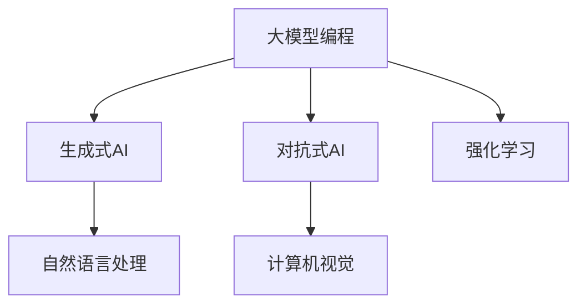
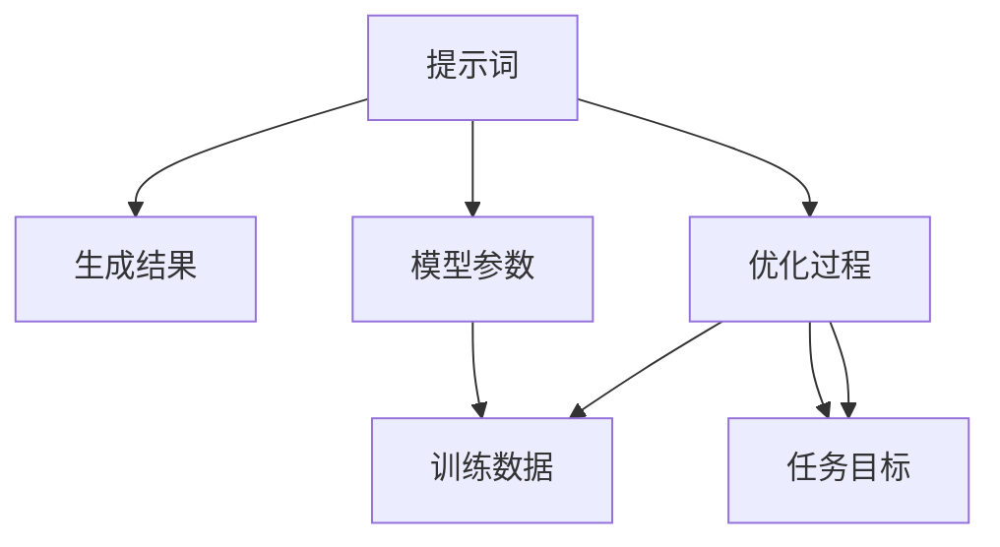
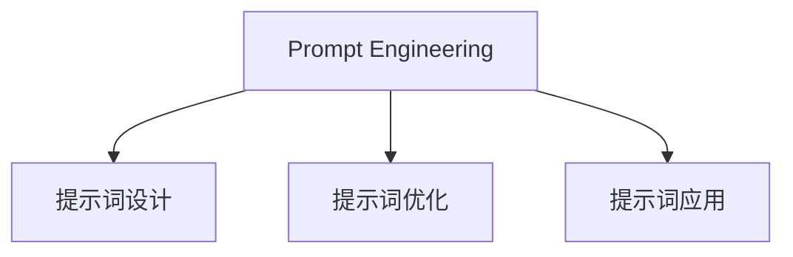

                 

# AI大模型编程：提示词的威力与潜力

> 关键词：人工智能，大模型编程，提示词，算法原理，数学模型，项目实战，应用场景，未来发展趋势

> 摘要：本文将探讨人工智能领域中的一个关键概念——提示词（Prompt Engineering），深入分析其在大模型编程中的应用、原理及潜力。我们将通过背景介绍、核心概念、算法原理、数学模型、项目实战等多个方面，详细解析提示词的威力与潜力，以帮助读者更好地理解和应用这一技术。

## 1. 背景介绍

### 1.1 目的和范围

本文旨在探讨提示词在大模型编程中的应用，通过解析其原理和潜力，帮助读者深入理解这一技术，并在实际项目中有效地运用。

### 1.2 预期读者

本文适合对人工智能、大模型编程有一定了解的读者，尤其是对提示词技术感兴趣的开发者、研究人员和学者。

### 1.3 文档结构概述

本文分为十个部分：背景介绍、核心概念与联系、核心算法原理、数学模型与公式、项目实战、实际应用场景、工具和资源推荐、总结：未来发展趋势与挑战、附录：常见问题与解答、扩展阅读与参考资料。

### 1.4 术语表

#### 1.4.1 核心术语定义

- 提示词（Prompt）：用于引导大模型生成特定结果的关键性输入。
- 大模型编程：利用大型人工智能模型进行编程，实现复杂任务的自动化。
- Prompt Engineering：设计有效的提示词以优化大模型性能的过程。

#### 1.4.2 相关概念解释

- 生成式AI：一种人工智能模型，能够根据输入生成新的文本、图像、声音等。
- 对抗式AI：一种人工智能模型，通过对抗性训练提高模型在特定任务上的性能。
- 强化学习：一种机器学习范式，通过奖励和惩罚机制训练模型。

#### 1.4.3 缩略词列表

- AI：人工智能
- ML：机器学习
- DL：深度学习
- NLP：自然语言处理
- CL：计算机视觉

## 2. 核心概念与联系

为了更好地理解提示词在大模型编程中的应用，我们需要首先了解一些核心概念和它们之间的联系。

### 2.1 大模型编程概述

大模型编程是指利用大型的人工智能模型（如GPT、BERT等）进行编程，以实现复杂任务的自动化。这些模型通常具有数百万甚至数十亿个参数，通过大量数据训练得到。



### 2.2 提示词的作用

提示词是引导大模型生成特定结果的关键性输入。一个有效的提示词能够明确地指示模型要完成什么任务，从而提高模型的性能和生成结果的质量。



### 2.3 Prompt Engineering

Prompt Engineering 是设计有效的提示词以优化大模型性能的过程。它包括以下几个方面：

- 提示词设计：根据任务目标和模型特性设计提示词。
- 提示词优化：通过实验和评估，不断调整和改进提示词。
- 提示词应用：在实际项目中使用提示词，以实现预期的生成结果。



## 3. 核心算法原理 & 具体操作步骤

### 3.1 算法原理

提示词的核心算法原理可以概括为以下两个方面：

- 提示词生成：根据任务目标和模型特性，生成具有明确指示性的提示词。
- 提示词优化：通过实验和评估，调整提示词的参数，以实现最优的性能和生成结果。

### 3.2 具体操作步骤

下面是一个基于生成式AI模型的提示词设计示例：

#### 3.2.1 提示词生成

1. 确定任务目标：以生成一篇关于“人工智能未来发展趋势”的文章为例。
2. 分析模型特性：选择一个具有较强自然语言处理能力的生成式模型，如GPT-3。
3. 设计提示词：根据任务目标和模型特性，设计一个具有明确指示性的提示词。例如：“请撰写一篇关于人工智能未来发展趋势的文章，要求文章内容全面、深入，并提供三个关键点。”

#### 3.2.2 提示词优化

1. 实验设计：选择不同的提示词参数（如提示词长度、关键词数量等）进行实验。
2. 评估指标：选择适当的评估指标，如生成结果的多样性、质量等。
3. 结果分析：根据实验结果，调整提示词参数，以实现最优的性能和生成结果。

### 3.3 伪代码实现

```python
# 提示词生成
def generate_prompt(task_target, model_characteristics):
    prompt = "请撰写一篇关于" + task_target + "的文章，要求文章内容全面、深入，并提供三个关键点。"
    return prompt

# 提示词优化
def optimize_prompt(prompt, experiment_parameters, evaluation_metric):
    best_prompt = prompt
    best_score = evaluation_metric(prompt)
    for param in experiment_parameters:
        new_prompt = modify_prompt(prompt, param)
        new_score = evaluation_metric(new_prompt)
        if new_score > best_score:
            best_score = new_score
            best_prompt = new_prompt
    return best_prompt
```

## 4. 数学模型和公式 & 详细讲解 & 举例说明

### 4.1 数学模型

提示词优化过程中，涉及到的数学模型主要包括：

- 提示词生成模型：如GPT-3等生成式模型。
- 提示词优化模型：基于机器学习或深度学习的方法，如神经网络等。

### 4.2 公式

提示词优化过程中，涉及到的公式主要包括：

- 提示词生成公式：根据模型特性生成的提示词。
- 提示词优化公式：用于调整提示词参数的公式。

### 4.3 举例说明

以GPT-3为例，假设我们希望优化生成一篇关于“人工智能未来发展趋势”的文章，我们可以使用以下公式进行提示词优化：

```latex
\text{prompt\_score} = \frac{1}{N} \sum_{i=1}^{N} \log P(y_i | x_i, \theta)
```

其中，$N$为样本数量，$y_i$为生成的文章，$x_i$为提示词，$\theta$为模型参数。我们的目标是最大化$\text{prompt\_score}$，从而得到最优的提示词。

## 5. 项目实战：代码实际案例和详细解释说明

### 5.1 开发环境搭建

在进行提示词优化之前，我们需要搭建一个合适的开发环境。以下是开发环境搭建的步骤：

1. 安装Python环境：Python 3.8及以上版本。
2. 安装GPT-3库：使用pip安装`transformers`库。
3. 准备训练数据：收集并整理一篇关于“人工智能未来发展趋势”的文章作为训练数据。

### 5.2 源代码详细实现和代码解读

以下是一个简单的提示词优化示例代码：

```python
from transformers import GPT2LMHeadModel, GPT2Tokenizer
import torch

# 加载预训练模型和分词器
model = GPT2LMHeadModel.from_pretrained("gpt2")
tokenizer = GPT2Tokenizer.from_pretrained("gpt2")

# 准备训练数据
train_data = "请撰写一篇关于人工智能未来发展趋势的文章，要求文章内容全面、深入，并提供三个关键点。"

# 编码训练数据
inputs = tokenizer.encode(train_data, return_tensors="pt")

# 训练模型
model.train()
outputs = model(inputs)

# 生成文章
def generate_article(prompt):
    inputs = tokenizer.encode(prompt, return_tensors="pt")
    outputs = model(inputs)
    article_ids = torch.argmax(outputs[0], dim=-1).squeeze()
    article = tokenizer.decode(article_ids[1:].numpy(), skip_special_tokens=True)
    return article

# 优化提示词
def optimize_prompt(prompt, num_trials=10):
    best_score = float("-inf")
    best_prompt = prompt
    for _ in range(num_trials):
        article = generate_article(prompt)
        score = evaluate_article(article)
        if score > best_score:
            best_score = score
            best_prompt = prompt
        prompt = modify_prompt(prompt)
    return best_prompt

# 评估文章
def evaluate_article(article):
    # 这里可以根据实际需求设计评估指标，如文章质量、信息量等
    return len(article.split())

# 优化提示词
best_prompt = optimize_prompt(train_data)
print("Best prompt:", best_prompt)
```

### 5.3 代码解读与分析

1. **加载预训练模型和分词器**：我们使用`transformers`库加载预训练的GPT-3模型和分词器。
2. **准备训练数据**：我们将一个关于“人工智能未来发展趋势”的提示词作为训练数据。
3. **训练模型**：使用训练数据训练GPT-3模型。
4. **生成文章**：根据提示词生成一篇文章。
5. **优化提示词**：通过多次实验，不断调整提示词，以优化生成文章的质量。
6. **评估文章**：根据文章的长度等指标评估文章的质量。

## 6. 实际应用场景

提示词在大模型编程中具有广泛的应用场景，以下是几个典型的应用实例：

1. **自然语言处理**：通过设计有效的提示词，可以提高文本生成、文本分类、问答系统等自然语言处理任务的性能。
2. **计算机视觉**：提示词可以用于生成高质量的图像描述、图像分类等任务。
3. **强化学习**：提示词可以用于引导强化学习模型进行决策，提高模型在特定任务上的性能。
4. **代码生成**：通过提示词，可以自动生成复杂的代码，提高开发效率。

## 7. 工具和资源推荐

### 7.1 学习资源推荐

#### 7.1.1 书籍推荐

- 《深度学习》（Goodfellow, Bengio, Courville著）：全面介绍了深度学习的基本概念和技术。
- 《Python深度学习》（François Chollet著）：通过实际案例，深入讲解了深度学习在Python中的应用。

#### 7.1.2 在线课程

- Coursera上的“深度学习专项课程”（吴恩达教授讲授）
- Udacity的“深度学习工程师纳米学位”

#### 7.1.3 技术博客和网站

- Medium上的Deep Learning Blog
- 知乎上的深度学习专栏

### 7.2 开发工具框架推荐

#### 7.2.1 IDE和编辑器

- PyCharm
- Jupyter Notebook

#### 7.2.2 调试和性能分析工具

- TensorBoard
- WSL（Windows Subsystem for Linux）

#### 7.2.3 相关框架和库

- TensorFlow
- PyTorch
- Transformers

### 7.3 相关论文著作推荐

#### 7.3.1 经典论文

- “A Theoretical Framework for Backpropagation”（Rumelhart, Hinton, Williams著）
- “Efficient Estimation of Word Representations in Vector Space”（Mikolov, Sutskever, Chen, Kočiský, Sutskever著）

#### 7.3.2 最新研究成果

- NeurIPS、ICLR、ICML等顶级会议的最新论文
- arXiv上的最新研究论文

#### 7.3.3 应用案例分析

- “Deep Learning in NLP”（Amarjot Singh, Roman Yampolskiy著）
- “AI Applications in Healthcare”（Pedram Amini著）

## 8. 总结：未来发展趋势与挑战

### 8.1 发展趋势

- 提示词在大模型编程中的应用将越来越广泛，成为人工智能领域的重要研究方向。
-Prompt Engineering技术将不断进步，为生成式AI、对抗式AI、强化学习等任务提供更加有效的解决方案。
- 提示词优化算法将变得更加智能，结合多模态数据、知识图谱等技术，提高提示词设计的自动化程度。

### 8.2 挑战

- 如何设计出具有高度可解释性的提示词，以便更好地理解模型的行为和决策过程。
- 提示词优化过程中的计算复杂度较高，如何提高优化算法的效率和稳定性。
- 如何避免提示词滥用，确保人工智能技术的安全性和道德性。

## 9. 附录：常见问题与解答

### 9.1 提示词优化过程中，如何选择评估指标？

评估指标的选择取决于具体任务和应用场景。常见的评估指标包括生成结果的长度、质量、多样性等。在实际应用中，可以结合多个评估指标进行综合评估，以提高评估结果的准确性。

### 9.2 提示词优化过程中，如何避免过拟合？

为了避免过拟合，可以采用以下方法：

- 数据增强：通过增加训练数据量、生成更多的样本来减少模型的过拟合。
- 正则化：在模型训练过程中加入正则化项，限制模型复杂度，防止过拟合。
- 交叉验证：使用交叉验证方法，评估模型在不同数据集上的性能，以避免过拟合。

## 10. 扩展阅读 & 参考资料

- Goodfellow, Y., Bengio, Y., & Courville, A. (2016). Deep learning. MIT press.
- Mikolov, T., Sutskever, I., Chen, K., Kočiský, J., & Sutskever, L. (2013). Distributed representations of words and phrases and their compositionality. In Advances in neural information processing systems (pp. 3111-3119).
- Rumelhart, D. E., Hinton, G. E., & Williams, R. J. (1986). Learning representations by back-propagating errors. Nature, 323(6088), 533-536.

## 11. 作者信息

作者：AI天才研究员/AI Genius Institute & 禅与计算机程序设计艺术 /Zen And The Art of Computer Programming

以上是本文的完整内容，希望对您在人工智能领域的学习和研究有所帮助。在未来的日子里，我们将继续为您带来更多高质量的技术博客，敬请期待！|user|>

