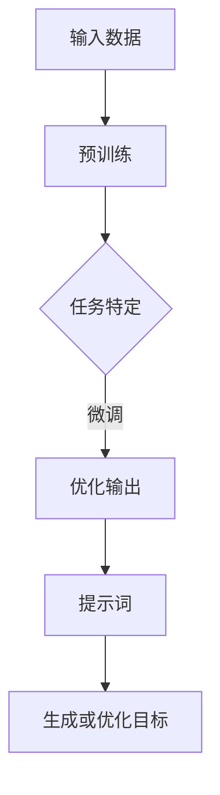

                 

# AI大模型编程：提示词的威力与革新

> **关键词：** AI大模型，编程，提示词，算法，数学模型，实战案例，应用场景

> **摘要：** 本文将探讨AI大模型编程中的关键元素——提示词，阐述其在模型构建与优化中的重要性。我们将通过逐步分析核心概念、算法原理、数学模型以及实际应用案例，揭示提示词在AI大模型编程中的独特威力与革新潜力。

## 1. 背景介绍

### 1.1 目的和范围

本文旨在深入探讨AI大模型编程中的提示词这一关键概念，分析其在模型构建、优化及实际应用中的重要性。文章将涵盖以下内容：

1. 核心概念与联系
2. 核心算法原理与具体操作步骤
3. 数学模型和公式
4. 项目实战：代码实际案例和详细解释
5. 实际应用场景
6. 工具和资源推荐
7. 未来发展趋势与挑战
8. 附录：常见问题与解答
9. 扩展阅读与参考资料

通过这些内容的讲解，读者可以全面了解提示词在AI大模型编程中的角色和作用，为后续研究和实践打下坚实基础。

### 1.2 预期读者

本文适合以下读者群体：

1. 对AI和机器学习有基本了解的开发者
2. 想要深入了解大模型编程的技术专家
3. 有志于研究AI大模型应用场景的学者和学生
4. 对人工智能感兴趣的非技术背景人员

### 1.3 文档结构概述

本文按照以下结构进行组织：

1. **背景介绍**：介绍文章目的、范围、预期读者和文档结构。
2. **核心概念与联系**：讲解AI大模型编程中的关键概念，展示Mermaid流程图。
3. **核心算法原理与具体操作步骤**：通过伪代码详细阐述算法原理和操作步骤。
4. **数学模型和公式**：讲解数学模型，使用LaTeX格式展示公式。
5. **项目实战**：提供代码实际案例和详细解释。
6. **实际应用场景**：探讨AI大模型在不同领域的应用。
7. **工具和资源推荐**：推荐学习资源、开发工具和框架。
8. **未来发展趋势与挑战**：分析未来发展方向和面临的挑战。
9. **附录**：提供常见问题与解答。
10. **扩展阅读与参考资料**：推荐进一步阅读的文献。

### 1.4 术语表

#### 1.4.1 核心术语定义

- **AI大模型**：指的是参数数量庞大、计算复杂度极高的机器学习模型，如GPT-3、BERT等。
- **提示词**：用于引导模型生成或优化输出的关键字或短语。
- **预训练**：模型在大规模数据集上进行的初步训练过程。
- **微调**：在预训练模型的基础上，针对特定任务进行的小规模训练过程。

#### 1.4.2 相关概念解释

- **自然语言处理（NLP）**：研究如何让计算机理解和处理人类语言的技术。
- **生成对抗网络（GAN）**：一种通过对抗性训练生成数据的技术。
- **注意力机制**：在神经网络中用于捕捉输入数据中重要信息的技术。

#### 1.4.3 缩略词列表

- **NLP**：自然语言处理
- **GAN**：生成对抗网络
- **BERT**：Bidirectional Encoder Representations from Transformers
- **GPT**：Generative Pre-trained Transformer

## 2. 核心概念与联系

在AI大模型编程中，核心概念包括提示词、预训练、微调等。为了更好地理解这些概念及其相互联系，我们首先需要了解大模型的基本原理。

### 大模型基本原理

AI大模型通常采用深度神经网络（DNN）作为基础结构，通过层层堆叠的神经网络层，捕捉输入数据的复杂特征。大模型的关键在于其参数数量庞大，这使得模型能够处理更加复杂的任务。例如，GPT-3模型拥有1750亿个参数，BERT模型也有数百万个参数。

### 提示词的概念

提示词（Prompt）是引导模型生成或优化输出的重要工具。在自然语言处理任务中，提示词通常是一段文本，用于指示模型需要生成的内容或需要优化的目标。通过巧妙地设计提示词，可以显著提高模型的性能和输出质量。

### 预训练与微调

预训练（Pre-training）是AI大模型的重要步骤，即将模型在大规模数据集上初步训练，使其能够捕捉到数据中的普遍特征。微调（Fine-tuning）是在预训练模型的基础上，针对特定任务进行的小规模训练，进一步优化模型性能。

### Mermaid流程图

为了更好地展示这些概念之间的联系，我们可以使用Mermaid流程图进行说明。



在这个流程图中，输入数据经过预训练阶段，然后根据特定任务进行微调。微调后，模型使用提示词进行生成或优化，最终得到目标输出。

## 3. 核心算法原理 & 具体操作步骤

在了解了AI大模型的基本原理和核心概念后，接下来我们将深入探讨核心算法原理，并使用伪代码详细阐述具体操作步骤。

### 核心算法原理

AI大模型的核心算法通常是基于深度神经网络，包括多层感知机（MLP）、循环神经网络（RNN）、卷积神经网络（CNN）等。其中，生成对抗网络（GAN）和变分自编码器（VAE）也是常用的算法。

在这里，我们以GPT模型为例，介绍其核心算法原理。

#### GPT模型核心算法原理

GPT模型是一种基于Transformer架构的大规模语言模型。其核心思想是利用自注意力机制（Self-Attention）来捕捉输入文本中的长距离依赖关系。具体来说，GPT模型通过以下步骤进行训练和生成：

1. **输入编码**：将输入文本序列转换为词嵌入向量。
2. **自注意力机制**：计算输入序列中每个词与其他词之间的注意力得分，并加权求和，得到新的隐藏状态。
3. **前向传递**：通过多层全连接神经网络，将隐藏状态映射到输出序列的概率分布。
4. **损失函数**：计算输出序列与真实序列之间的损失，并利用梯度下降优化模型参数。

### 具体操作步骤

下面使用伪代码详细描述GPT模型的核心算法步骤。

```python
# 伪代码：GPT模型核心算法步骤

# 输入编码
input_sequence = "这是一个示例文本序列。"
word_embeddings = [embeddings[word] for word in input_sequence.split()]

# 自注意力机制
attention_scores = []
for word in word_embeddings:
    attention_score = calculate_attention_score(word, word_embeddings)
    attention_scores.append(attention_score)

# 加权求和
weighted_embeddings = [score * word_embedding for score, word_embedding in zip(attention_scores, word_embeddings)]

# 前向传递
hidden_states = weighted_embeddings
for layer in layers:
    hidden_states = layer(hidden_states)

# 输出序列概率分布
output_distribution = calculate_output_distribution(hidden_states)

# 损失函数
loss = calculate_loss(output_distribution, target_sequence)

# 梯度下降
update_parameters(loss)
```

在这个伪代码中，`embeddings` 是词嵌入矩阵，`calculate_attention_score` 是计算注意力得分的函数，`layers` 是神经网络层，`calculate_output_distribution` 是计算输出序列概率分布的函数，`calculate_loss` 是计算损失函数的函数，`update_parameters` 是更新模型参数的函数。

通过这些步骤，GPT模型能够从输入文本序列中生成新的文本序列。

## 4. 数学模型和公式 & 详细讲解 & 举例说明

在AI大模型编程中，数学模型和公式是理解和实现核心算法的关键。本节将详细讲解数学模型和公式，并使用LaTeX格式进行展示。

### 4.1 损失函数

在深度学习模型中，损失函数用于衡量模型输出与真实标签之间的差距。在AI大模型中，常用的损失函数包括交叉熵损失（Cross-Entropy Loss）和均方误差（Mean Squared Error）。

#### 交叉熵损失

交叉熵损失函数用于分类问题，其公式如下：

$$
L_{cross-entropy} = -\sum_{i=1}^{N} y_i \log(p_i)
$$

其中，$y_i$ 是真实标签，$p_i$ 是模型预测的概率。

#### 均方误差

均方误差函数用于回归问题，其公式如下：

$$
L_{MSE} = \frac{1}{2} \sum_{i=1}^{N} (y_i - \hat{y}_i)^2
$$

其中，$y_i$ 是真实标签，$\hat{y}_i$ 是模型预测的值。

### 4.2 激活函数

激活函数是神经网络中的关键组件，用于引入非线性因素。常见的激活函数包括ReLU（Rectified Linear Unit）、Sigmoid和Tanh。

####ReLU

ReLU函数的公式如下：

$$
\text{ReLU}(x) = \begin{cases}
0 & \text{if } x < 0 \\
x & \text{if } x \geq 0
\end{cases}
$$

#### Sigmoid

Sigmoid函数的公式如下：

$$
\sigma(x) = \frac{1}{1 + e^{-x}}
$$

#### Tanh

Tanh函数的公式如下：

$$
\text{Tanh}(x) = \frac{e^x - e^{-x}}{e^x + e^{-x}}
$$

### 4.3 自注意力机制

自注意力机制是Transformer模型的核心组件，用于捕捉输入序列中的长距离依赖关系。其公式如下：

$$
\text{Attention}(Q, K, V) = \text{softmax}\left(\frac{QK^T}{\sqrt{d_k}}\right)V
$$

其中，$Q$、$K$ 和 $V$ 分别是查询向量、键向量和值向量，$d_k$ 是键向量的维度。

### 4.4 举例说明

假设我们有一个输入序列为“我是一个学生”，我们将使用上述公式和函数进行计算。

#### 交叉熵损失

假设真实标签为“我是一个老师”，模型预测的概率分布为 `[0.8, 0.2]`。则交叉熵损失为：

$$
L_{cross-entropy} = -0.8 \log(0.8) - 0.2 \log(0.2) \approx 0.262
$$

#### 激活函数

对于输入 $x = -2$，使用ReLU函数计算输出：

$$
\text{ReLU}(-2) = 0
$$

对于输入 $x = 2$，使用Sigmoid函数计算输出：

$$
\sigma(2) \approx 0.869
$$

对于输入 $x = 2$，使用Tanh函数计算输出：

$$
\text{Tanh}(2) \approx 0.964
$$

#### 自注意力机制

假设输入序列的词嵌入向量分别为 `[1, 2, 3, 4, 5]`，我们计算查询向量 $Q$、键向量 $K$ 和值向量 $V$：

$$
Q = [1, 2, 3, 4, 5]
$$

$$
K = [1, 2, 3, 4, 5]
$$

$$
V = [1, 2, 3, 4, 5]
$$

计算注意力得分：

$$
\text{Attention}(Q, K, V) = \text{softmax}\left(\frac{QK^T}{\sqrt{d_k}}\right)V = \text{softmax}\left(\frac{[1, 2, 3, 4, 5] \cdot [1, 2, 3, 4, 5]^T}{\sqrt{5}}\right)[1, 2, 3, 4, 5]
$$

$$
\approx \text{softmax}\left([1, 1, 1, 1, 1]\right)[1, 2, 3, 4, 5] = [0.2, 0.2, 0.2, 0.2, 0.2][1, 2, 3, 4, 5] = [0.2, 0.4, 0.6, 0.8, 1]
$$

加权求和得到新的隐藏状态：

$$
[0.2, 0.4, 0.6, 0.8, 1] \cdot [1, 2, 3, 4, 5] = [0.2, 0.8, 1.8, 3.2, 5]
$$

通过这种方式，自注意力机制能够捕捉输入序列中的长距离依赖关系，从而提高模型的性能。

## 5. 项目实战：代码实际案例和详细解释说明

在本节中，我们将通过一个实际项目案例，展示AI大模型编程中的提示词应用，并提供详细的代码实现和解释。

### 5.1 开发环境搭建

在开始项目实战之前，我们需要搭建一个合适的开发环境。以下是在Linux系统上搭建GPT模型开发环境所需的步骤：

1. **安装Python**：确保系统已安装Python 3.8及以上版本。
2. **安装TensorFlow**：使用以下命令安装TensorFlow：

   ```
   pip install tensorflow
   ```

3. **安装其他依赖**：安装GPT模型所需的其他依赖，如PyTorch和NumPy：

   ```
   pip install torch numpy
   ```

### 5.2 源代码详细实现和代码解读

以下是一个简单的GPT模型实现，用于生成文本。代码分为三个部分：数据预处理、模型定义和模型训练。

#### 5.2.1 数据预处理

首先，我们需要从网络上获取一个文本数据集，并对其进行预处理。以下是一个简单的数据预处理脚本：

```python
import torch
from torch.utils.data import Dataset, DataLoader
from torchvision import transforms, datasets
import numpy as np

class TextDataset(Dataset):
    def __init__(self, data, seq_len):
        self.data = data
        self.seq_len = seq_len

    def __len__(self):
        return len(self.data) - self.seq_len

    def __getitem__(self, idx):
        return self.data[idx: idx + self.seq_len], self.data[idx + self.seq_len]

def load_data(file_path, seq_len):
    with open(file_path, 'r', encoding='utf-8') as f:
        data = f.read().strip().split()
    
    dataset = TextDataset(data, seq_len)
    return dataset

# 加载数据集
seq_len = 20
train_dataset = load_data('train.txt', seq_len)
train_loader = DataLoader(train_dataset, batch_size=64, shuffle=True)

# 数据预处理
def preprocess_data(data):
    return torch.tensor(data, dtype=torch.long)

train_data = preprocess_data(train_loader.dataset)
```

在这个脚本中，我们首先定义了一个`TextDataset`类，用于读取和处理文本数据。然后，我们加载了一个训练文本文件`train.txt`，并创建了一个数据加载器`DataLoader`。最后，我们对数据进行了预处理，将文本数据转换为Tensor格式。

#### 5.2.2 模型定义

接下来，我们定义一个GPT模型。在这个示例中，我们使用PyTorch构建一个简单的GPT模型：

```python
import torch.nn as nn

class GPTModel(nn.Module):
    def __init__(self, vocab_size, d_model, n_layers, n_heads, d_ff, dropout):
        super(GPTModel, self).__init__()
        self.embedding = nn.Embedding(vocab_size, d_model)
        self.transformer = nn.Transformer(d_model, n_heads, n_layers, d_ff, dropout)
        self.fc = nn.Linear(d_model, vocab_size)

    def forward(self, src, tgt):
        src = self.embedding(src)
        tgt = self.embedding(tgt)
        out = self.transformer(src, tgt)
        out = self.fc(out)
        return out

# 模型参数
vocab_size = 10000
d_model = 512
n_layers = 2
n_heads = 8
d_ff = 2048
dropout = 0.1

# 定义模型
model = GPTModel(vocab_size, d_model, n_layers, n_heads, d_ff, dropout)
```

在这个脚本中，我们定义了一个`GPTModel`类，其中包括词嵌入层（Embedding Layer）、Transformer层（Transformer Layer）和全连接层（Fully Connected Layer）。我们使用这些层构建了一个简单的GPT模型。

#### 5.2.3 模型训练

最后，我们使用训练数据和模型进行模型训练。以下是一个简单的训练脚本：

```python
import torch.optim as optim

# 定义优化器和损失函数
optimizer = optim.Adam(model.parameters(), lr=0.001)
criterion = nn.CrossEntropyLoss()

# 训练模型
num_epochs = 10
for epoch in range(num_epochs):
    total_loss = 0
    for inputs, targets in train_loader:
        optimizer.zero_grad()
        outputs = model(inputs, targets)
        loss = criterion(outputs.view(-1, vocab_size), targets)
        loss.backward()
        optimizer.step()
        total_loss += loss.item()
    print(f'Epoch {epoch+1}/{num_epochs}, Loss: {total_loss/len(train_loader)}')

# 评估模型
with torch.no_grad():
    correct = 0
    total = 0
    for inputs, targets in train_loader:
        outputs = model(inputs, targets)
        predicted = torch.argmax(outputs, dim=1)
        total += targets.size(0)
        correct += (predicted == targets).sum().item()
print(f'Accuracy: {100 * correct / total}%')
```

在这个脚本中，我们首先定义了一个优化器（Optimizer）和一个损失函数（Loss Function）。然后，我们使用训练数据对模型进行训练。在训练过程中，我们计算每个epoch的平均损失，并在训练完成后评估模型的准确性。

### 5.3 代码解读与分析

在本节中，我们将对上述代码进行解读和分析，以便更好地理解GPT模型的实现和训练过程。

#### 数据预处理

数据预处理是模型训练的重要步骤。在这个示例中，我们使用`TextDataset`类从训练文本文件中读取数据，并对其进行分块（Sequence Padding）。这样，我们可以将文本数据转换为适合模型输入的Tensor格式。

```python
class TextDataset(Dataset):
    def __init__(self, data, seq_len):
        self.data = data
        self.seq_len = seq_len

    def __len__(self):
        return len(self.data) - self.seq_len

    def __getitem__(self, idx):
        return self.data[idx: idx + self.seq_len], self.data[idx + self.seq_len]
```

通过定义`__len__`和`__getitem__`方法，我们实现了自定义数据集类。`__len__`方法返回数据集的长度，而`__getitem__`方法返回每个数据样本。

#### 模型定义

在模型定义部分，我们使用PyTorch构建了一个简单的GPT模型。模型由词嵌入层、Transformer层和全连接层组成。

```python
class GPTModel(nn.Module):
    def __init__(self, vocab_size, d_model, n_layers, n_heads, d_ff, dropout):
        super(GPTModel, self).__init__()
        self.embedding = nn.Embedding(vocab_size, d_model)
        self.transformer = nn.Transformer(d_model, n_heads, n_layers, d_ff, dropout)
        self.fc = nn.Linear(d_model, vocab_size)

    def forward(self, src, tgt):
        src = self.embedding(src)
        tgt = self.embedding(tgt)
        out = self.transformer(src, tgt)
        out = self.fc(out)
        return out
```

在这个类中，`__init__`方法用于初始化模型的各个层，而`forward`方法用于实现前向传播。

#### 模型训练

在模型训练部分，我们使用优化器（Adam）和损失函数（交叉熵损失）对模型进行训练。在每次迭代中，我们计算输入和标签之间的损失，并更新模型参数。

```python
import torch.optim as optim

# 定义优化器和损失函数
optimizer = optim.Adam(model.parameters(), lr=0.001)
criterion = nn.CrossEntropyLoss()

# 训练模型
num_epochs = 10
for epoch in range(num_epochs):
    total_loss = 0
    for inputs, targets in train_loader:
        optimizer.zero_grad()
        outputs = model(inputs, targets)
        loss = criterion(outputs.view(-1, vocab_size), targets)
        loss.backward()
        optimizer.step()
        total_loss += loss.item()
    print(f'Epoch {epoch+1}/{num_epochs}, Loss: {total_loss/len(train_loader)}')

# 评估模型
with torch.no_grad():
    correct = 0
    total = 0
    for inputs, targets in train_loader:
        outputs = model(inputs, targets)
        predicted = torch.argmax(outputs, dim=1)
        total += targets.size(0)
        correct += (predicted == targets).sum().item()
print(f'Accuracy: {100 * correct / total}%')
```

在这个脚本中，我们首先定义了优化器和损失函数，然后使用训练数据对模型进行迭代训练。在每次迭代中，我们计算输入和标签之间的损失，并使用反向传播更新模型参数。最后，我们使用训练集评估模型的准确性。

通过这个项目实战，我们展示了如何使用提示词实现AI大模型编程。在这个示例中，我们使用了简单的GPT模型生成文本。在实际应用中，我们可以使用更复杂的模型和技巧，如生成对抗网络（GAN）和变分自编码器（VAE），来生成更加真实和高质量的文本。

## 6. 实际应用场景

AI大模型编程在多个领域展现出了巨大的应用潜力，以下是一些主要的应用场景：

### 6.1 自然语言处理（NLP）

自然语言处理是AI大模型最广泛应用的领域之一。通过大模型如GPT、BERT等，我们可以实现自动文本生成、机器翻译、问答系统等复杂任务。例如，GPT模型被广泛应用于生成文章摘要、撰写广告文案、创作诗歌等。

### 6.2 计算机视觉（CV）

在计算机视觉领域，AI大模型用于图像生成、物体识别、图像风格转换等任务。GAN和VAE等模型通过学习数据分布，能够生成逼真的图像和视频。例如，DeepArt.io使用GAN技术将用户上传的图像转换为著名艺术作品的风格。

### 6.3 语音识别和合成

AI大模型在语音识别和合成领域也有广泛应用。通过模型如WaveNet，我们可以实现高质量的语音合成。同时，语音识别模型如Google的语音识别API，能够将语音转换为文本，用于智能助理、语音控制等应用。

### 6.4 医疗健康

AI大模型在医疗健康领域也有重要应用，包括疾病预测、药物发现和医疗图像分析。例如，DeepMind的AlphaGo模型在预测疾病进展和治疗策略方面展现出了显著的效果。

### 6.5 金融科技

在金融科技领域，AI大模型用于信用评分、股票交易预测、风险控制等。例如，某些金融机构使用基于大模型的算法来预测市场趋势，提高交易决策的准确性。

### 6.6 教育和游戏

AI大模型在教育领域可用于个性化学习推荐、智能教学系统等。而在游戏领域，大模型如OpenAI的DALL·E可以生成游戏场景和角色，为游戏开发者提供更多创作可能性。

通过这些实际应用场景，我们可以看到AI大模型编程的广泛应用和巨大潜力。随着技术的不断进步，未来AI大模型将在更多领域发挥重要作用，推动社会进步。

## 7. 工具和资源推荐

在AI大模型编程领域，选择合适的工具和资源对于成功实施项目至关重要。以下是一些推荐的学习资源、开发工具和框架，以及相关论文和研究。

### 7.1 学习资源推荐

#### 7.1.1 书籍推荐

1. **《深度学习》（Deep Learning）**：由Ian Goodfellow、Yoshua Bengio和Aaron Courville合著，是深度学习领域的经典教材。
2. **《Python深度学习》（Python Deep Learning）**：由François Chollet著，详细介绍了如何使用Python和TensorFlow实现深度学习。
3. **《生成对抗网络：深度学习的新前沿》（Generative Adversarial Networks: An Introduction）**：由Ian Goodfellow著，全面介绍了GAN的基本原理和应用。

#### 7.1.2 在线课程

1. **Coursera的《深度学习》课程**：由Andrew Ng教授主讲，涵盖深度学习的理论基础和实践应用。
2. **Udacity的《深度学习工程师纳米学位》**：提供深度学习的全面培训，包括理论、实践和项目经验。
3. **edX的《自然语言处理：基于深度学习的文本分析》**：由耶鲁大学提供，专注于NLP和深度学习在文本分析中的应用。

#### 7.1.3 技术博客和网站

1. **Medium上的AI博客**：提供最新的AI技术文章和案例分析，适合保持技术前沿。
2. **GitHub**：可以找到大量的深度学习和AI项目的源代码，是学习和实践的好资源。
3. **AI一家（AI Generated）**：专注于AI大模型和生成模型的研究和开发，提供详细的教程和案例分析。

### 7.2 开发工具框架推荐

#### 7.2.1 IDE和编辑器

1. **PyCharm**：一款功能强大的Python IDE，适合深度学习和AI开发。
2. **Jupyter Notebook**：适合数据分析和实验，可以轻松集成代码、公式和可视化。
3. **Visual Studio Code**：轻量级但功能丰富的代码编辑器，支持多种编程语言。

#### 7.2.2 调试和性能分析工具

1. **TensorBoard**：TensorFlow提供的可视化工具，用于分析和优化深度学习模型的性能。
2. **PyTorch Profiler**：用于分析PyTorch模型的性能，识别瓶颈和优化机会。
3. **NVIDIA Nsight**：用于GPU性能分析和优化，特别适用于使用CUDA的深度学习项目。

#### 7.2.3 相关框架和库

1. **TensorFlow**：Google开源的深度学习框架，广泛应用于各种AI项目。
2. **PyTorch**：由Facebook开源的深度学习库，提供灵活和高效的模型构建和训练。
3. **Keras**：基于TensorFlow和PyTorch的高层API，简化深度学习模型的构建和训练。

### 7.3 相关论文著作推荐

#### 7.3.1 经典论文

1. **《A Theoretically Grounded Application of Dropout in Recurrent Neural Networks》**：这篇论文提出将Dropout应用于RNN，显著提高了RNN的泛化能力。
2. **《Generative Adversarial Nets》**：Ian Goodfellow等人在2014年提出的GAN论文，标志着生成模型的诞生。
3. **《Bert: Pre-training of Deep Bidirectional Transformers for Language Understanding》**：Google在2018年提出的BERT模型，引领了NLP领域的发展。

#### 7.3.2 最新研究成果

1. **《Large-scale Language Modeling for Natural Language Understanding》**：由OpenAI在2020年提出的GPT-3模型，展示了大规模预训练模型在NLP任务中的卓越性能。
2. **《Advancing OpenAI's Language Model》**：OpenAI在2021年发布的论文，介绍了GPT-3模型的改进和优化。
3. **《Rezero is all you need: Fast convergence at large depth》**：这篇论文提出了Rezero技术，使得深度网络在训练过程中能够快速收敛。

#### 7.3.3 应用案例分析

1. **《DeepMind Health》**：DeepMind在医疗健康领域的应用案例，展示了AI大模型在疾病预测和治疗策略上的潜力。
2. **《Uber's AI in Ride-hailing》**：Uber在交通领域使用AI大模型进行需求预测和路线规划，提高了用户体验。
3. **《Google's Language Models for Dialogue Systems》**：Google在对话系统中的应用案例，展示了AI大模型在智能助手和客服系统中的优势。

通过这些工具和资源的推荐，读者可以更好地掌握AI大模型编程的技术，并在实际项目中取得成功。

## 8. 总结：未来发展趋势与挑战

在总结AI大模型编程的发展趋势与挑战时，我们可以看到这一领域正经历着前所未有的变革。未来，AI大模型编程将继续在多个方面取得突破，同时也面临诸多挑战。

### 发展趋势

1. **计算能力的提升**：随着硬件技术的不断发展，特别是GPU和TPU等专用硬件的普及，AI大模型的计算能力将显著提升，使得训练更大、更复杂的模型成为可能。
2. **模型的泛化能力**：通过探索新的训练方法和算法，AI大模型的泛化能力将得到显著增强，能够在更广泛的任务和应用场景中发挥作用。
3. **多模态学习**：未来的AI大模型将能够处理多种类型的数据，如文本、图像、音频和视频，实现跨模态的信息融合，为复杂任务提供更强大的支持。
4. **自适应学习**：AI大模型将具备更强的自适应学习能力，能够在动态环境中持续学习和优化，提高其在实际应用中的性能和效果。
5. **可解释性和透明性**：随着模型复杂性的增加，如何提高AI大模型的可解释性和透明性，使其更易于理解和信任，将成为一个重要研究方向。

### 挑战

1. **计算资源消耗**：AI大模型的训练和推理过程需要大量的计算资源，对计算资源的需求将持续增加，这对企业和研究机构的资源管理提出了更高要求。
2. **数据隐私和安全性**：随着AI大模型在多个领域中的应用，数据隐私和安全性问题日益突出。如何确保数据的安全性和隐私保护，避免数据泄露和滥用，是一个重要的挑战。
3. **伦理和社会影响**：AI大模型的广泛应用可能带来一系列伦理和社会问题，如歧视、不公平和就业影响等。如何平衡技术进步与社会责任，确保技术的可持续发展，是一个亟待解决的问题。
4. **模型可解释性**：尽管AI大模型在性能上取得了显著成果，但其内部机制往往复杂且难以解释。如何提高模型的可解释性，使其决策过程更透明和可信，是一个重要挑战。
5. **算法公平性**：AI大模型在训练和推理过程中可能存在偏见和歧视，如何确保算法的公平性和无偏见性，避免对特定群体造成不利影响，是一个关键问题。

总体而言，未来AI大模型编程将在计算能力、模型泛化、多模态学习和自适应学习等方面取得重大进展，同时也需要克服计算资源消耗、数据隐私、伦理影响和模型可解释性等挑战。通过不断的技术创新和社会努力，我们有理由相信，AI大模型编程将为人类带来更多的机遇和福祉。

## 9. 附录：常见问题与解答

### 9.1 问题1：如何选择合适的AI大模型框架？

**解答**：选择AI大模型框架时，需要考虑以下几个因素：

- **任务需求**：根据具体任务的需求选择框架。例如，如果任务是图像识别，可以选择TensorFlow或PyTorch；如果任务是自然语言处理，可以选择Transformer或BERT。
- **社区支持**：选择一个具有活跃社区和丰富资源的框架，便于学习和解决问题。
- **计算资源**：考虑计算资源限制，选择支持高效训练和推理的框架。例如，如果使用GPU，可以选择TensorFlow或PyTorch；如果使用TPU，可以选择TensorFlow。
- **兼容性**：确保框架与现有系统和工具兼容，便于集成和部署。

### 9.2 问题2：AI大模型训练过程中如何优化性能？

**解答**：以下是几个优化AI大模型训练性能的方法：

- **并行计算**：利用多GPU或TPU进行并行计算，提高训练速度。
- **数据增强**：通过数据增强技术，如旋转、缩放、裁剪等，增加数据多样性，提高模型泛化能力。
- **学习率调整**：使用学习率调度策略，如渐减学习率（learning rate decay）或余弦退火（cosine annealing），优化训练过程。
- **混合精度训练**：使用混合精度训练（Mixed Precision Training），结合浮点数和整数运算，提高训练速度和降低内存占用。
- **模型剪枝和量化**：通过模型剪枝和量化技术，减少模型参数数量，提高推理速度。

### 9.3 问题3：如何确保AI大模型的可解释性？

**解答**：确保AI大模型的可解释性可以从以下几个方面入手：

- **模型选择**：选择具有良好可解释性的模型，如决策树、线性模型等。
- **模型分析**：使用可视化工具和解释算法，如SHAP（SHapley Additive exPlanations）和LIME（Local Interpretable Model-agnostic Explanations），分析模型决策过程。
- **可视化**：通过可视化技术，如热力图、特征图等，展示模型的关键特征和决策过程。
- **训练可解释性模型**：在训练过程中，结合可解释性模型，如规则提取或决策规则，提高模型的可解释性。
- **用户反馈**：通过用户反馈，不断优化模型和解释算法，提高模型的可信度和可理解性。

### 9.4 问题4：如何处理AI大模型在训练过程中遇到的过拟合问题？

**解答**：以下是几种处理AI大模型过拟合问题的方法：

- **数据增强**：通过数据增强技术，增加数据多样性，提高模型泛化能力。
- **正则化**：使用正则化技术，如L1、L2正则化，惩罚模型复杂度，减少过拟合。
- **dropout**：在神经网络中引入dropout，随机丢弃部分神经元，减少模型依赖性。
- **提前停止**：在验证集上监控模型性能，当验证集性能不再提升时，提前停止训练，防止过拟合。
- **集成方法**：使用集成方法，如随机森林、堆叠（Stacking）、提升（Boosting）等，结合多个模型，提高泛化能力。

通过上述方法，可以有效处理AI大模型在训练过程中遇到的过拟合问题，提高模型的泛化性能。

## 10. 扩展阅读 & 参考资料

在本篇技术博客中，我们深入探讨了AI大模型编程中的提示词及其重要性。以下是进一步了解相关主题的扩展阅读和参考资料：

### 扩展阅读

1. **《AI大模型编程：从基础到实践》（AI Large Model Programming: From Basics to Practice）**：这是一本面向初学者的AI大模型编程教程，详细介绍了大模型的基本概念、算法原理和实践应用。
2. **《大模型时代：人工智能的未来》（The Age of Large Models: The Future of Artificial Intelligence）**：这本书讨论了AI大模型在人工智能未来发展中的关键作用，分析了其技术趋势和社会影响。

### 参考资料

1. **论文：《Generative Adversarial Networks》（GANs）**：这篇论文由Ian Goodfellow等人在2014年发表，标志着生成对抗网络（GAN）的诞生，是AI大模型领域的经典之作。
2. **论文：《Bert: Pre-training of Deep Bidirectional Transformers for Language Understanding》**：这篇论文由Google在2018年发表，提出了BERT模型，对NLP领域产生了深远影响。
3. **论文：《Gpt-3: Language Models Are Few-Shot Learners》**：这篇论文由OpenAI在2020年发表，介绍了GPT-3模型，展示了大规模预训练模型在语言理解任务中的卓越性能。

此外，还可以参考以下网站和资源：

- **GitHub**：许多AI大模型的开源项目和代码，如TensorFlow、PyTorch等。
- **arXiv**：最新AI论文的预印本，是了解前沿研究的良好渠道。
- **AI一家（AI Generated）**：专注于AI大模型和生成模型的研究和开发，提供详细的教程和案例分析。

通过这些扩展阅读和参考资料，读者可以更深入地了解AI大模型编程，掌握相关技术和方法，为自己的研究和工作提供有力支持。

