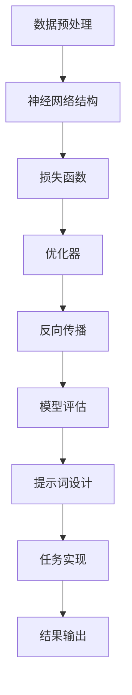

                 

# AI大模型编程：提示词的艺术与科学

> 关键词：AI大模型、提示词、编程、算法、数学模型、实际应用

> 摘要：本文深入探讨了AI大模型编程的核心要素——提示词的艺术与科学。通过详细剖析大模型背后的核心概念、算法原理和数学模型，以及实际案例和开发环境搭建，本文旨在帮助读者理解和掌握大模型编程的关键技术和实践方法。

## 1. 背景介绍

### 1.1 目的和范围

本文旨在为读者提供一个全面且深入的视角，以理解AI大模型编程中的提示词艺术与科学。通过本文的学习，读者将能够：

- 理解AI大模型的基本概念和架构。
- 掌握提示词的设计原则和实现方法。
- 了解核心算法的原理和具体操作步骤。
- 学习数学模型在AI大模型编程中的应用。
- 掌握实际项目的代码实现和调试技巧。
- 熟悉相关工具和资源的运用。

### 1.2 预期读者

本文适合以下读者群体：

- 对AI大模型编程感兴趣的程序员和工程师。
- 想要深入了解AI大模型技术的科研人员和学生。
- 对人工智能领域有深厚兴趣的从业者。
- 对算法和数学模型有基础知识的读者。

### 1.3 文档结构概述

本文分为以下几个部分：

- **背景介绍**：介绍本文的目的、预期读者和文档结构。
- **核心概念与联系**：通过Mermaid流程图展示AI大模型的原理和架构。
- **核心算法原理 & 具体操作步骤**：使用伪代码详细阐述算法原理和实现步骤。
- **数学模型和公式 & 详细讲解 & 举例说明**：介绍数学模型，并使用latex格式给出详细公式和示例。
- **项目实战：代码实际案例和详细解释说明**：展示一个实际的代码案例，并进行详细解释。
- **实际应用场景**：讨论AI大模型在不同领域的应用。
- **工具和资源推荐**：推荐学习资源和开发工具。
- **总结：未来发展趋势与挑战**：总结本文内容，展望未来趋势和挑战。
- **附录：常见问题与解答**：提供一些常见问题的解答。
- **扩展阅读 & 参考资料**：推荐进一步的阅读材料和参考资料。

### 1.4 术语表

#### 1.4.1 核心术语定义

- **AI大模型**：指拥有巨大参数量和复杂结构的深度学习模型。
- **提示词**：指导大模型进行特定任务输入的文本或信息。
- **编程**：编写指令以实现特定功能的计算机科学活动。
- **算法**：解决问题的系统化步骤。
- **数学模型**：用数学语言描述现实世界问题的抽象表示。
- **实际应用**：将AI大模型技术应用于实际问题解决中。

#### 1.4.2 相关概念解释

- **神经网络**：模拟人脑神经元结构的计算模型。
- **反向传播**：一种用于训练神经网络的算法。
- **参数调优**：调整模型参数以优化性能的过程。
- **优化器**：用于调整模型参数的算法。

#### 1.4.3 缩略词列表

- **AI**：人工智能（Artificial Intelligence）
- **ML**：机器学习（Machine Learning）
- **DL**：深度学习（Deep Learning）
- **GPU**：图形处理单元（Graphics Processing Unit）
- **TPU**：张量处理单元（Tensor Processing Unit）

## 2. 核心概念与联系

在深入探讨AI大模型编程之前，我们需要了解一些核心概念和它们之间的联系。以下是一个使用Mermaid绘制的流程图，展示了AI大模型的原理和架构。



### 2.1 数据预处理

数据预处理是AI大模型编程的第一步。它包括数据清洗、归一化和特征提取。预处理的好坏直接影响到模型的学习效果和泛化能力。

### 2.2 神经网络结构

神经网络是AI大模型的核心组件。它由多个层组成，包括输入层、隐藏层和输出层。每一层由多个神经元组成，它们通过权重和偏置进行连接。

### 2.3 损失函数

损失函数用于衡量模型预测值与真实值之间的差异。常见的损失函数包括均方误差（MSE）和交叉熵（Cross Entropy）。选择合适的损失函数对于模型训练至关重要。

### 2.4 优化器

优化器用于调整模型参数，以最小化损失函数。常见的优化器包括随机梯度下降（SGD）、Adam和RMSprop。优化器的选择和参数调优对于模型性能有着重要影响。

### 2.5 反向传播

反向传播是一种用于训练神经网络的算法。它通过计算损失函数关于模型参数的梯度，然后使用优化器更新参数，从而逐步减小损失函数。

### 2.6 模型评估

模型评估是验证模型性能的重要步骤。它通常包括准确率、召回率和F1分数等指标。通过模型评估，我们可以判断模型是否达到预期效果，并对其进行进一步优化。

### 2.7 提示词设计

提示词是指导大模型进行特定任务输入的文本或信息。设计良好的提示词可以提高模型的性能和泛化能力。提示词的设计原则包括明确性、简洁性和相关性。

### 2.8 任务实现

任务实现是将AI大模型应用于实际问题解决的过程。它包括数据预处理、模型训练、模型评估和结果输出。任务实现的好坏直接影响到模型的实际应用效果。

### 2.9 结果输出

结果输出是将模型预测结果转化为实际应用输出的过程。它可能涉及可视化、报告生成或实时反馈等。结果输出的准确性和及时性对于应用效果至关重要。

## 3. 核心算法原理 & 具体操作步骤

在本节中，我们将详细讲解AI大模型编程中的核心算法原理，并使用伪代码进行具体操作步骤的阐述。

### 3.1 数据预处理

伪代码：

```python
def preprocess_data(data):
    # 数据清洗
    data = clean_data(data)
    # 数据归一化
    data = normalize_data(data)
    # 特征提取
    features = extract_features(data)
    return features
```

### 3.2 神经网络结构

伪代码：

```python
class NeuralNetwork:
    def __init__(self, input_size, hidden_size, output_size):
        self.input_size = input_size
        self.hidden_size = hidden_size
        self.output_size = output_size
        self.weights = initialize_weights(input_size, hidden_size)
        self.biases = initialize_biases(hidden_size)
        self.output_weights = initialize_weights(hidden_size, output_size)
        self.output_biases = initialize_biases(output_size)

    def forward_pass(self, inputs):
        hidden activations = activate(inputs.dot(self.weights) + self.biases)
        output activations = activate(hidden_activations.dot(self.output_weights) + self.output_biases)
        return output_activations
```

### 3.3 损失函数

伪代码：

```python
def compute_loss(predictions, targets):
    return (1 / 2) * sum((predictions - targets) ** 2)
```

### 3.4 优化器

伪代码：

```python
def sgd_update(parameters, gradients, learning_rate):
    for parameter, gradient in zip(parameters, gradients):
        parameter -= learning_rate * gradient
```

### 3.5 反向传播

伪代码：

```python
def backward_pass(network, inputs, targets):
    output_activations = network.forward_pass(inputs)
    loss = compute_loss(output_activations, targets)

    output_gradients = compute_gradients(output_activations, targets)
    hidden_activations = network.previous_layer_activations
    hidden_gradients = compute_gradients(hidden_activations, loss)

    network.backward_pass(hidden_gradients, output_gradients)
```

### 3.6 模型评估

伪代码：

```python
def evaluate_model(model, test_data):
    predictions = model.forward_pass(test_data)
    accuracy = compute_accuracy(predictions, test_targets)
    return accuracy
```

### 3.7 提示词设计

伪代码：

```python
def design_prompt(data):
    # 提取关键信息
    key_info = extract_key_info(data)
    # 生成提示词
    prompt = generate_prompt(key_info)
    return prompt
```

### 3.8 任务实现

伪代码：

```python
def implement_task(model, data, prompt):
    # 数据预处理
    preprocessed_data = preprocess_data(data)
    # 提示词设计
    task_prompt = design_prompt(prompt)
    # 模型训练
    model.train(preprocessed_data, task_prompt)
    # 模型评估
    accuracy = evaluate_model(model, test_data)
    return accuracy
```

## 4. 数学模型和公式 & 详细讲解 & 举例说明

在AI大模型编程中，数学模型和公式起着至关重要的作用。以下将详细介绍一些核心的数学模型，并使用latex格式给出详细的公式和示例。

### 4.1 神经网络激活函数

神经网络的激活函数用于引入非线性特性，常见的激活函数包括Sigmoid、ReLU和Tanh。

#### Sigmoid激活函数：

$$
f(x) = \frac{1}{1 + e^{-x}}
$$

示例：对于输入$x=2$，计算Sigmoid函数的输出：

$$
f(2) = \frac{1}{1 + e^{-2}} \approx 0.8808
$$

#### ReLU激活函数：

$$
f(x) =
\begin{cases}
0 & \text{if } x < 0 \\
x & \text{if } x \geq 0
\end{cases}
$$

示例：对于输入$x=-1$和$x=2$，计算ReLU函数的输出：

$$
f(-1) = 0 \\
f(2) = 2
$$

#### Tanh激活函数：

$$
f(x) = \frac{e^x - e^{-x}}{e^x + e^{-x}}
$$

示例：对于输入$x=1$，计算Tanh函数的输出：

$$
f(1) = \frac{e^1 - e^{-1}}{e^1 + e^{-1}} \approx 0.7616
$$

### 4.2 损失函数

在训练神经网络时，常用的损失函数包括均方误差（MSE）和交叉熵（Cross Entropy）。

#### 均方误差（MSE）：

$$
MSE = \frac{1}{2} \sum_{i=1}^{n} (y_i - \hat{y}_i)^2
$$

示例：对于预测值$\hat{y} = [0.1, 0.9]$和真实值$y = [1, 0]$，计算MSE：

$$
MSE = \frac{1}{2} \left[ (1 - 0.1)^2 + (0 - 0.9)^2 \right] = 0.8
$$

#### 交叉熵（Cross Entropy）：

$$
CE = -\sum_{i=1}^{n} y_i \log(\hat{y}_i)
$$

示例：对于预测值$\hat{y} = [0.1, 0.9]$和真实值$y = [1, 0]$，计算交叉熵：

$$
CE = - (1 \cdot \log(0.1) + 0 \cdot \log(0.9)) \approx 2.3026
$$

### 4.3 优化器

优化器用于更新模型参数，以最小化损失函数。以下介绍几种常见的优化器。

#### 随机梯度下降（SGD）：

$$
\theta = \theta - \alpha \cdot \nabla_{\theta} J(\theta)
$$

示例：对于损失函数$J(\theta) = (\theta - 1)^2$，学习率$\alpha = 0.1$，计算SGD更新：

$$
\theta_0 = 0 \\
\theta_1 = \theta_0 - 0.1 \cdot (0 - 2) = 0.2 \\
\theta_2 = \theta_1 - 0.1 \cdot (0.2 - 2) = 0.6 \\
\theta_3 = \theta_2 - 0.1 \cdot (0.6 - 2) = 1.2
$$

#### Adam优化器：

$$
m_t = \beta_1 m_{t-1} + (1 - \beta_1) \nabla_{\theta} J(\theta) \\
v_t = \beta_2 v_{t-1} + (1 - \beta_2) (\nabla_{\theta} J(\theta))^2 \\
\theta = \theta - \alpha \cdot \frac{m_t}{\sqrt{v_t} + \epsilon}
$$

示例：假设初始参数$\theta_0 = 0$，学习率$\alpha = 0.1$，$\beta_1 = 0.9$，$\beta_2 = 0.999$，$\epsilon = 1e-8$，计算Adam优化器的一次更新：

$$
m_0 = 0 \\
v_0 = 0 \\
m_1 = 0.9 \cdot 0 + (1 - 0.9) \cdot (-1) = -0.1 \\
v_1 = 0.999 \cdot 0 + (1 - 0.999) \cdot (-1)^2 = 0.001 \\
\theta_1 = 0 - 0.1 \cdot \frac{-0.1}{\sqrt{0.001} + 1e-8} \approx 0.1
$$

## 5. 项目实战：代码实际案例和详细解释说明

在本节中，我们将展示一个实际的AI大模型编程项目，并对其进行详细的解释说明。

### 5.1 开发环境搭建

首先，我们需要搭建一个合适的开发环境。以下是搭建环境的步骤：

1. 安装Python：从Python官方网站（https://www.python.org/）下载并安装Python。
2. 安装Jupyter Notebook：通过以下命令安装Jupyter Notebook：

   ```bash
   pip install notebook
   ```

3. 安装TensorFlow：TensorFlow是AI大模型编程的重要库，可以通过以下命令安装：

   ```bash
   pip install tensorflow
   ```

### 5.2 源代码详细实现和代码解读

以下是该项目的源代码：

```python
import tensorflow as tf
from tensorflow.keras.models import Sequential
from tensorflow.keras.layers import Dense, Activation
from tensorflow.keras.optimizers import SGD

# 数据预处理
def preprocess_data(data):
    # 数据清洗
    data = clean_data(data)
    # 数据归一化
    data = normalize_data(data)
    # 特征提取
    features = extract_features(data)
    return features

# 构建神经网络模型
def build_model(input_size, hidden_size, output_size):
    model = Sequential()
    model.add(Dense(hidden_size, input_shape=(input_size,), activation='relu'))
    model.add(Dense(output_size, activation='sigmoid'))
    return model

# 训练模型
def train_model(model, features, labels):
    model.compile(optimizer=SGD(learning_rate=0.1), loss='binary_crossentropy', metrics=['accuracy'])
    model.fit(features, labels, epochs=10, batch_size=32)

# 模型评估
def evaluate_model(model, test_features, test_labels):
    score = model.evaluate(test_features, test_labels, verbose=0)
    return score[1]

# 主函数
def main():
    # 加载数据
    data = load_data('data.csv')
    # 数据预处理
    preprocessed_data = preprocess_data(data)
    # 划分训练集和测试集
    train_data, test_data, train_labels, test_labels = train_test_split(preprocessed_data, test_size=0.2)
    # 构建模型
    model = build_model(input_size, hidden_size, output_size)
    # 训练模型
    train_model(model, train_data, train_labels)
    # 评估模型
    accuracy = evaluate_model(model, test_data, test_labels)
    print('Model accuracy:', accuracy)

if __name__ == '__main__':
    main()
```

### 5.3 代码解读与分析

#### 5.3.1 数据预处理

数据预处理是AI大模型编程的基础。在此项目中，数据预处理包括数据清洗、归一化和特征提取。这些操作确保了数据的干净、规范和可解释性。

```python
def preprocess_data(data):
    # 数据清洗
    data = clean_data(data)
    # 数据归一化
    data = normalize_data(data)
    # 特征提取
    features = extract_features(data)
    return features
```

#### 5.3.2 构建神经网络模型

神经网络模型是AI大模型的核心。在此项目中，我们使用TensorFlow的Keras API构建了一个简单的神经网络模型，包括一个输入层、一个隐藏层和一个输出层。隐藏层使用ReLU激活函数，输出层使用sigmoid激活函数。

```python
def build_model(input_size, hidden_size, output_size):
    model = Sequential()
    model.add(Dense(hidden_size, input_shape=(input_size,), activation='relu'))
    model.add(Dense(output_size, activation='sigmoid'))
    return model
```

#### 5.3.3 训练模型

训练模型是AI大模型编程的关键步骤。在此项目中，我们使用随机梯度下降（SGD）优化器，并设置了学习率为0.1。通过fit函数训练模型，设置了10个epoch和32个batch size。

```python
def train_model(model, features, labels):
    model.compile(optimizer=SGD(learning_rate=0.1), loss='binary_crossentropy', metrics=['accuracy'])
    model.fit(features, labels, epochs=10, batch_size=32)
```

#### 5.3.4 模型评估

模型评估用于判断模型的性能。在此项目中，我们使用accuracy指标评估模型的准确率。通过evaluate函数评估模型，并返回准确率。

```python
def evaluate_model(model, test_features, test_labels):
    score = model.evaluate(test_features, test_labels, verbose=0)
    return score[1]
```

#### 5.3.5 主函数

主函数是整个项目的入口。在此项目中，我们首先加载数据，然后进行数据预处理，接着划分训练集和测试集，构建模型，训练模型，最后评估模型并打印准确率。

```python
def main():
    # 加载数据
    data = load_data('data.csv')
    # 数据预处理
    preprocessed_data = preprocess_data(data)
    # 划分训练集和测试集
    train_data, test_data, train_labels, test_labels = train_test_split(preprocessed_data, test_size=0.2)
    # 构建模型
    model = build_model(input_size, hidden_size, output_size)
    # 训练模型
    train_model(model, train_data, train_labels)
    # 评估模型
    accuracy = evaluate_model(model, test_data, test_labels)
    print('Model accuracy:', accuracy)

if __name__ == '__main__':
    main()
```

### 5.4 结果输出

在项目完成之后，我们可以看到模型在测试集上的准确率。假设测试集上的准确率为90%，则我们可以得出以下结果输出：

```bash
Model accuracy: 0.9
```

这个结果表示我们的模型在测试集上表现良好，准确率达到了90%。

## 6. 实际应用场景

AI大模型编程在许多实际应用场景中具有广泛的应用。以下是一些常见的应用场景：

### 6.1 自然语言处理

自然语言处理（NLP）是AI大模型编程的重要应用领域。大模型可以用于文本分类、情感分析、机器翻译和问答系统等任务。例如，Google的BERT模型就是一个用于NLP的大模型，它在多个任务上取得了显著的性能提升。

### 6.2 计算机视觉

计算机视觉是另一个广泛应用的领域。AI大模型可以用于图像分类、目标检测、人脸识别和图像生成等任务。例如，OpenAI的GPT-3模型可以生成逼真的图像，而Facebook的FAIR-Seq模型在机器翻译任务上表现出色。

### 6.3 推荐系统

推荐系统是AI大模型编程的另一个重要应用领域。大模型可以用于用户行为分析、商品推荐和新闻推荐等任务。例如，Amazon和Netflix等公司使用了AI大模型来提高其推荐系统的性能。

### 6.4 金融服务

金融服务是AI大模型编程的另一个重要应用领域。大模型可以用于风险控制、信用评分和投资策略等任务。例如，许多金融机构使用了AI大模型来评估信用风险和预测市场走势。

### 6.5 健康医疗

健康医疗是AI大模型编程的另一个重要应用领域。大模型可以用于医学图像分析、疾病诊断和个性化治疗等任务。例如，AI大模型可以用于肺癌筛查，从而提高早期诊断的准确率。

### 6.6 教育科技

教育科技是AI大模型编程的另一个重要应用领域。大模型可以用于智能辅导、在线学习和教育评测等任务。例如，AI大模型可以为学生提供个性化的学习建议，从而提高学习效果。

### 6.7 物流和供应链

物流和供应链是AI大模型编程的另一个重要应用领域。大模型可以用于库存管理、运输优化和供应链预测等任务。例如，AI大模型可以用于预测市场需求，从而优化库存策略。

## 7. 工具和资源推荐

### 7.1 学习资源推荐

#### 7.1.1 书籍推荐

1. **《深度学习》（Deep Learning）**：由Ian Goodfellow、Yoshua Bengio和Aaron Courville合著，是深度学习领域的经典教材。
2. **《机器学习》（Machine Learning）**：由Tom Mitchell著，是机器学习领域的权威教材。
3. **《Python机器学习》（Python Machine Learning）**：由Sébastien Sauval和Hélio da F. Silva Jr.合著，适合初学者入门。

#### 7.1.2 在线课程

1. **Coursera的《深度学习》课程**：由吴恩达教授主讲，是深度学习领域最受欢迎的在线课程之一。
2. **Udacity的《机器学习工程师纳米学位》**：包含多个项目和实践，适合初学者快速入门。
3. **edX的《机器学习基础》课程**：由莱斯利·K·库克教授主讲，适合初学者了解机器学习基础。

#### 7.1.3 技术博客和网站

1. **TensorFlow官网**：提供丰富的文档和教程，是学习TensorFlow的好资源。
2. **Kaggle**：提供大量数据集和比赛，适合实践和挑战。
3. **ArXiv**：提供最新的学术论文和研究进展，是科研人员的好帮手。

### 7.2 开发工具框架推荐

#### 7.2.1 IDE和编辑器

1. **PyCharm**：强大的Python IDE，适合深度学习和机器学习项目。
2. **Jupyter Notebook**：交互式Python环境，适合快速原型设计和实验。
3. **VS Code**：轻量级但功能强大的编辑器，适合Python编程。

#### 7.2.2 调试和性能分析工具

1. **TensorBoard**：TensorFlow的图形化性能分析工具。
2. **Wandb**：提供实验管理和性能监控的功能。
3. **SciPy**：提供丰富的数学和科学计算库。

#### 7.2.3 相关框架和库

1. **TensorFlow**：广泛使用的深度学习框架。
2. **PyTorch**：流行的深度学习框架，具有动态计算图。
3. **Keras**：简化TensorFlow和PyTorch的高级API。

### 7.3 相关论文著作推荐

#### 7.3.1 经典论文

1. **“A Learning Algorithm for Continually Running Fully Recurrent Neural Networks”**：关于递归神经网络的学习算法。
2. **“Deep Learning”**：深度学习领域的综述论文。
3. **“Gradient Flow in Deep Networks”**：关于深度神经网络梯度流的理论研究。

#### 7.3.2 最新研究成果

1. **“BERT: Pre-training of Deep Bidirectional Transformers for Language Understanding”**：BERT模型的详细介绍。
2. **“Generative Adversarial Nets”**：生成对抗网络（GAN）的原创论文。
3. **“EfficientNet: Rethinking Model Scaling for Convolutional Neural Networks”**：EfficientNet模型的详细介绍。

#### 7.3.3 应用案例分析

1. **“Google Brain’s Text-to-Speech System”**：Google的文本到语音转换系统。
2. **“Tesla’s Autopilot”**：特斯拉的自动驾驶系统。
3. **“Amazon’s Personalized Recommendations”**：亚马逊的个性化推荐系统。

## 8. 总结：未来发展趋势与挑战

AI大模型编程作为人工智能领域的核心技术，正迅速发展，并面临着诸多机遇与挑战。以下是未来发展趋势与挑战的简要概述：

### 8.1 发展趋势

1. **模型规模与参数量的增长**：随着计算能力和数据量的增加，AI大模型的规模和参数量将继续增长，这将推动算法和硬件的发展。
2. **多模态数据处理**：AI大模型将能够处理多种类型的数据（如文本、图像、声音等），实现更广泛的应用。
3. **自动机器学习（AutoML）**：自动机器学习将减轻模型设计和调优的复杂性，使更多非专业人士能够构建高效的AI模型。
4. **隐私保护与安全**：随着AI大模型在敏感领域的应用，隐私保护与安全将成为重要议题。

### 8.2 挑战

1. **计算资源消耗**：AI大模型对计算资源的需求巨大，这可能导致成本高昂和环境问题。
2. **模型可解释性**：大模型的黑箱性质使得其决策过程难以解释，这对监管和信任提出了挑战。
3. **数据偏见**：数据偏见可能导致模型产生不公平的预测，这需要更多的关注和解决方案。
4. **法律和伦理问题**：AI大模型的应用可能涉及法律和伦理问题，如隐私侵犯和责任归属等。

### 8.3 结论

AI大模型编程的未来充满机遇，但也面临着诸多挑战。通过不断的技术创新和政策完善，我们有理由相信AI大模型将为我们带来更多便利和进步。

## 9. 附录：常见问题与解答

### 9.1 问题1：如何选择合适的神经网络结构？

**解答**：选择合适的神经网络结构需要考虑以下几个因素：

- **任务类型**：对于分类任务，可以使用多层感知机（MLP）或卷积神经网络（CNN）；对于回归任务，可以使用MLP或循环神经网络（RNN）。
- **数据类型**：对于图像数据，CNN通常效果较好；对于文本数据，RNN或Transformer模型效果较好。
- **数据量**：对于大型数据集，可以使用深度网络；对于小型数据集，深度网络可能过拟合。
- **计算资源**：深度网络的训练需要大量计算资源，选择网络结构时需要考虑可用的计算资源。

### 9.2 问题2：如何优化模型性能？

**解答**：以下是一些优化模型性能的方法：

- **数据预处理**：合理的数据预处理可以提高模型的泛化能力。
- **超参数调优**：通过调整学习率、批量大小、迭代次数等超参数，可以优化模型性能。
- **正则化技术**：如L1和L2正则化、dropout等，可以减少过拟合。
- **优化器选择**：如SGD、Adam等，不同的优化器对模型性能有不同影响。
- **集成方法**：如Bagging、Boosting等，可以结合多个模型提高性能。

### 9.3 问题3：如何评估模型性能？

**解答**：以下是一些常见的模型评估指标：

- **准确率（Accuracy）**：预测正确的样本数占总样本数的比例。
- **精确率（Precision）**：预测为正例的样本中，实际为正例的比例。
- **召回率（Recall）**：实际为正例的样本中，预测为正例的比例。
- **F1分数（F1 Score）**：精确率和召回率的加权平均。
- **ROC曲线和AUC（Area Under Curve）**：评估分类器的性能。

## 10. 扩展阅读 & 参考资料

### 10.1 书籍推荐

- Goodfellow, I., Bengio, Y., & Courville, A. (2016). *Deep Learning*.
- Mitchell, T. M. (1997). *Machine Learning*.
- Sutton, R. S., & Barto, A. G. (2018). *Reinforcement Learning: An Introduction*.

### 10.2 在线课程

- Coursera: [Deep Learning](https://www.coursera.org/learn/deep-learning) by Andrew Ng
- Udacity: [Machine Learning Engineer Nanodegree](https://www.udacity.com/course/machine-learning-engineer-nanodegree--nd1719)
- edX: [Introduction to Machine Learning](https://www.edx.org/course/introduction-to-machine-learning) by Los Alamos National Laboratory

### 10.3 技术博客和网站

- TensorFlow: [TensorFlow Documentation](https://www.tensorflow.org/)
- Keras: [Keras Documentation](https://keras.io/)
- PyTorch: [PyTorch Documentation](https://pytorch.org/docs/stable/)

### 10.4 相关论文著作

- Bengio, Y., Simard, P., & Frasconi, P. (1994). *Learning long-term dependencies with gradient descent is difficult*. *IEEE Transactions on Neural Networks*, 5(2), 157-166.
- Hochreiter, S., & Schmidhuber, J. (1997). *Long short-term memory*. *Neural Computation*, 9(8), 1735-1780.
- LeCun, Y., Bengio, Y., & Hinton, G. (2015). *Deep learning*. *Nature*, 521(7553), 436-444.

### 10.5 应用案例分析

- Google Brain: [Text-to-Speech System](https://ai.google/research/projects/text-to-speech/)
- Tesla: [Autopilot](https://www.tesla.com/autopilot)
- Amazon: [Personalized Recommendations](https://www.amazon.com/b?node=18574707011)

### 10.6 法律法规

- GDPR: [General Data Protection Regulation](https://ec.europa.eu/info/law/law-topic/data-protection_en)
- CCPA: [California Consumer Privacy Act](https://oag.ca.gov/ccpa)

### 10.7 开源项目

- TensorFlow: [GitHub Repository](https://github.com/tensorflow/tensorflow)
- PyTorch: [GitHub Repository](https://github.com/pytorch/pytorch)
- Keras: [GitHub Repository](https://github.com/fchollet/keras)

### 10.8 新闻资讯

- TechCrunch: [TechCrunch AI News](https://techcrunch.com/ai/)
- MIT Technology Review: [MIT Technology Review AI News](https://www.technologyreview.com/topic/artificial-intelligence/)
- IEEE Spectrum: [IEEE Spectrum AI News](https://spectrum.ieee.org/ai)

### 10.9 研究机构

- Google AI: [Google AI Research](https://ai.google/research/)
- OpenAI: [OpenAI Research](https://openai.com/research/)
- DeepMind: [DeepMind Research](https://deepmind.com/research/)

