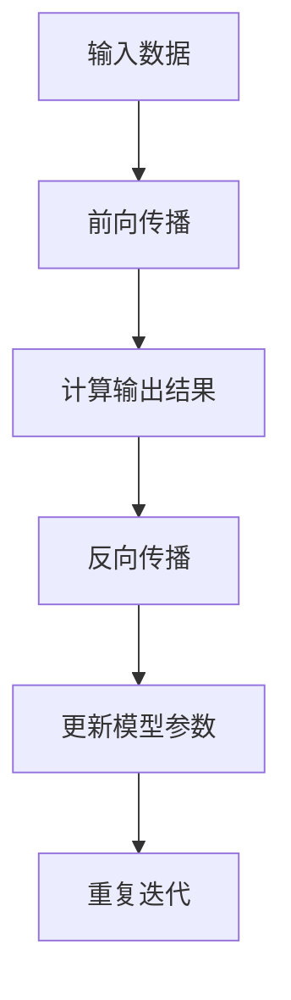
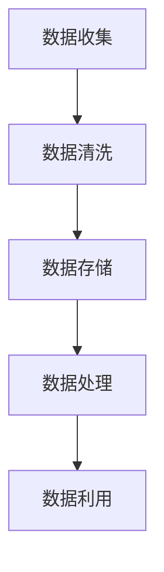
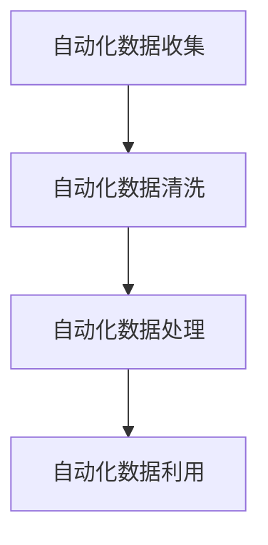
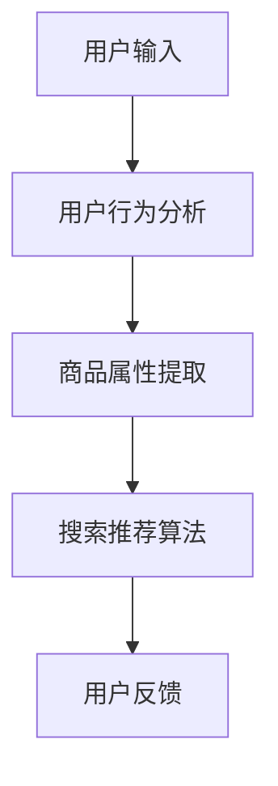

                 

# AI大模型重构电商搜索推荐的数据治理流程自动化平台功能优化与扩展

> 关键词：AI大模型，电商搜索推荐，数据治理，自动化平台，功能优化，扩展

> 摘要：本文旨在探讨如何利用AI大模型技术优化电商搜索推荐的自动化平台，特别是在数据治理流程方面的改进。通过详细介绍核心概念、算法原理、数学模型以及实际应用场景，本文将为读者提供一个全面的视角，了解如何利用先进的技术手段提升电商平台的用户体验和运营效率。

## 1. 背景介绍

### 1.1 目的和范围

本文的目的是分析如何利用AI大模型技术重构电商搜索推荐系统的数据治理流程，以实现自动化平台的功能优化和扩展。本文主要涵盖以下内容：

1. 对AI大模型在电商搜索推荐中的应用进行背景介绍。
2. 详细阐述数据治理流程中的关键环节。
3. 提出利用AI大模型优化数据治理流程的方法。
4. 分析自动化平台的功能优化与扩展方向。
5. 提供实际应用案例和资源推荐。

### 1.2 预期读者

本文面向以下读者群体：

1. 从事电商搜索推荐系统开发的工程师和架构师。
2. 对人工智能和数据治理感兴趣的技术爱好者。
3. 需要提升电商平台用户体验和运营效率的企业管理者。

### 1.3 文档结构概述

本文分为以下几个部分：

1. 背景介绍：本文的背景、目的、范围以及预期读者。
2. 核心概念与联系：介绍AI大模型、数据治理等相关概念，并绘制Mermaid流程图。
3. 核心算法原理 & 具体操作步骤：详细讲解AI大模型的工作原理和具体操作步骤。
4. 数学模型和公式 & 详细讲解 & 举例说明：介绍数学模型和相关公式，并举例说明。
5. 项目实战：代码实际案例和详细解释说明。
6. 实际应用场景：分析AI大模型在电商搜索推荐中的应用场景。
7. 工具和资源推荐：推荐学习资源、开发工具框架和论文著作。
8. 总结：未来发展趋势与挑战。
9. 附录：常见问题与解答。
10. 扩展阅读 & 参考资料：提供进一步学习的资料。

### 1.4 术语表

#### 1.4.1 核心术语定义

- AI大模型：指具有巨大参数规模、能够处理大量数据的深度学习模型。
- 数据治理：指对数据的质量、完整性、一致性和安全性进行管理和控制的过程。
- 自动化平台：指能够自动执行特定任务的软件平台，以提高效率和减少人工干预。
- 电商搜索推荐：指在电商平台上根据用户行为和需求，为用户提供相关商品推荐的服务。

#### 1.4.2 相关概念解释

- 电商搜索推荐系统：指基于用户历史行为、商品属性和搜索关键词等信息，为用户推荐符合其兴趣和需求的商品。
- 数据治理流程：指对电商搜索推荐系统中涉及的数据进行收集、清洗、存储、处理和利用的整个过程。

#### 1.4.3 缩略词列表

- AI：人工智能（Artificial Intelligence）
- ML：机器学习（Machine Learning）
- NLP：自然语言处理（Natural Language Processing）
- DL：深度学习（Deep Learning）
- API：应用程序编程接口（Application Programming Interface）

## 2. 核心概念与联系

在本文中，我们将探讨以下核心概念：

- AI大模型
- 数据治理流程
- 自动化平台
- 电商搜索推荐

### 2.1 AI大模型

AI大模型是指具有巨大参数规模、能够处理大量数据的深度学习模型。这些模型通过学习海量数据，提取特征和规律，从而在图像识别、自然语言处理、推荐系统等领域取得了显著成果。

#### AI大模型的工作原理

AI大模型通常由多个层次组成，包括输入层、隐藏层和输出层。每个层次包含大量的神经元，通过前向传播和反向传播算法进行训练。具体步骤如下：

1. 输入数据：将输入数据输入到模型中。
2. 前向传播：将输入数据通过隐藏层传递，计算输出结果。
3. 反向传播：计算输出结果与真实值之间的差异，并更新模型参数。
4. 重复迭代：重复前向传播和反向传播过程，直到模型达到预期性能。

#### Mermaid流程图



### 2.2 数据治理流程

数据治理流程是指对电商搜索推荐系统中涉及的数据进行收集、清洗、存储、处理和利用的整个过程。数据治理的目标是确保数据的质量、完整性、一致性和安全性，从而为AI大模型提供高质量的数据输入。

#### 数据治理流程的步骤

1. 数据收集：从各种数据源（如用户行为、商品信息、搜索日志等）收集数据。
2. 数据清洗：对收集到的数据进行去重、缺失值填充、异常值处理等操作，确保数据质量。
3. 数据存储：将清洗后的数据存储到数据库或数据仓库中，便于后续处理和分析。
4. 数据处理：对存储的数据进行转换、集成、分类、聚类等操作，提取有用信息。
5. 数据利用：将处理后的数据用于训练AI大模型、优化搜索推荐算法等。

#### Mermaid流程图



### 2.3 自动化平台

自动化平台是指能够自动执行特定任务的软件平台，以提高效率和减少人工干预。在电商搜索推荐系统中，自动化平台主要用于实现数据治理流程的自动化，从而降低人工成本，提高数据处理速度和准确性。

#### 自动化平台的功能

1. 自动化数据收集：通过爬虫、API等方式自动从各种数据源收集数据。
2. 自动化数据清洗：通过脚本、批处理等方式自动对数据进行清洗和处理。
3. 自动化数据处理：通过批处理、实时计算等方式自动对数据进行处理和转换。
4. 自动化数据利用：通过脚本、调度任务等方式自动将处理后的数据用于训练模型、优化算法等。

#### Mermaid流程图



### 2.4 电商搜索推荐

电商搜索推荐是指根据用户的历史行为、搜索关键词、商品属性等信息，为用户推荐符合其兴趣和需求的商品。在本文中，我们重点关注AI大模型在电商搜索推荐中的应用。

#### 电商搜索推荐的流程

1. 用户输入：用户在电商平台上输入搜索关键词或浏览商品。
2. 用户行为分析：分析用户的搜索历史、购买记录、浏览记录等信息，提取用户兴趣特征。
3. 商品属性提取：提取商品的价格、品牌、类别、评分等属性信息。
4. 搜索推荐算法：利用AI大模型，根据用户兴趣特征和商品属性，为用户推荐相关商品。
5. 用户反馈：收集用户对推荐商品的评价和反馈，用于优化搜索推荐算法。

#### Mermaid流程图



通过以上对核心概念与联系的介绍，我们可以看到AI大模型、数据治理流程、自动化平台和电商搜索推荐之间存在紧密的联系。在接下来的章节中，我们将深入探讨AI大模型在数据治理流程中的应用，以及如何通过自动化平台实现功能优化和扩展。

## 3. 核心算法原理 & 具体操作步骤

在本文中，我们将详细讲解AI大模型在电商搜索推荐中的核心算法原理和具体操作步骤。这些算法原理包括数据预处理、特征工程、模型训练和模型评估等。为了便于理解，我们将使用伪代码来阐述这些步骤。

### 3.1 数据预处理

数据预处理是电商搜索推荐系统的关键步骤，其目的是确保输入数据的质量和一致性。以下是一个简单的伪代码示例：

```python
def preprocess_data(data):
    # 数据清洗
    cleaned_data = clean_data(data)
    # 数据标准化
    standardized_data = standardize_data(cleaned_data)
    # 数据分片
    shard_data = shard_data(standardized_data)
    return shard_data

def clean_data(data):
    # 去除重复数据
    unique_data = remove_duplicates(data)
    # 缺失值填充
    filled_data = fill_missing_values(unique_data)
    return filled_data

def standardize_data(data):
    # 归一化处理
    normalized_data = normalize_data(data)
    return normalized_data

def shard_data(data):
    # 数据分片
    shard_data = split_data(data)
    return shard_data
```

### 3.2 特征工程

特征工程是提高模型性能的关键步骤。在电商搜索推荐中，特征工程包括用户特征、商品特征和交互特征等。以下是一个简单的伪代码示例：

```python
def feature_engineering(data):
    # 用户特征
    user_features = extract_user_features(data)
    # 商品特征
    item_features = extract_item_features(data)
    # 交互特征
    interaction_features = extract_interaction_features(data)
    # 特征融合
    fused_features = fuse_features(user_features, item_features, interaction_features)
    return fused_features

def extract_user_features(data):
    # 用户兴趣标签
    user_interests = extract_user_interests(data)
    # 用户行为历史
    user_history = extract_user_history(data)
    return user_interests, user_history

def extract_item_features(data):
    # 商品属性
    item_properties = extract_item_properties(data)
    # 商品评分
    item_ratings = extract_item_ratings(data)
    return item_properties, item_ratings

def extract_interaction_features(data):
    # 用户搜索历史
    user_search_history = extract_user_search_history(data)
    # 用户购买历史
    user_purchase_history = extract_user_purchase_history(data)
    return user_search_history, user_purchase_history

def fuse_features(user_features, item_features, interaction_features):
    # 特征融合
    fused_features = combine_features(user_features, item_features, interaction_features)
    return fused_features
```

### 3.3 模型训练

模型训练是电商搜索推荐系统中最关键的步骤。在本文中，我们使用深度学习模型（如卷积神经网络、循环神经网络等）进行训练。以下是一个简单的伪代码示例：

```python
def train_model(data, model):
    # 数据分片
    train_data, val_data = split_data(data)
    # 训练模型
    model.train(train_data)
    # 验证模型
    model.validate(val_data)
    # 调参
    model.tune_parameters()
    # 保存模型
    model.save()
    return model
```

### 3.4 模型评估

模型评估是评估模型性能的重要步骤。在本文中，我们使用准确率、召回率、F1值等指标来评估模型。以下是一个简单的伪代码示例：

```python
def evaluate_model(model, data):
    # 计算准确率
    accuracy = model.calculate_accuracy(data)
    # 计算召回率
    recall = model.calculate_recall(data)
    # 计算F1值
    f1 = model.calculate_f1(data)
    # 输出评估结果
    print("Accuracy: ", accuracy)
    print("Recall: ", recall)
    print("F1: ", f1)
```

通过以上对核心算法原理和具体操作步骤的讲解，我们可以看到AI大模型在电商搜索推荐系统中的应用是一个复杂但非常有价值的过程。在接下来的章节中，我们将继续探讨数学模型和公式的详细讲解以及实际应用场景。

## 4. 数学模型和公式 & 详细讲解 & 举例说明

在电商搜索推荐系统中，AI大模型的性能依赖于数学模型和公式的使用。本章节将详细讲解几个核心的数学模型和公式，并提供实际应用场景和举例说明。

### 4.1 深度学习模型

深度学习模型的核心是前向传播和反向传播算法。以下是一个简化的数学模型和公式：

#### 前向传播

$$
z_{l} = \sum_{i=1}^{n} w_{l,i} \cdot a_{l-1,i} + b_{l}
$$

$$
a_{l} = \sigma(z_{l})
$$

其中，$z_{l}$是第$l$层的输入，$a_{l}$是第$l$层的输出，$w_{l,i}$是第$l$层到第$l+1$层的权重，$b_{l}$是第$l$层的偏置，$\sigma$是激活函数。

#### 反向传播

$$
\delta_{l} = \frac{\partial L}{\partial a_{l}} \cdot \frac{\partial a_{l}}{\partial z_{l}}
$$

$$
\Delta w_{l,i} = \delta_{l} \cdot a_{l-1,i}
$$

$$
\Delta b_{l} = \delta_{l}
$$

其中，$L$是损失函数，$\delta_{l}$是第$l$层的误差，$\Delta w_{l,i}$和$\Delta b_{l}$分别是第$l$层权重和偏置的更新。

#### 举例说明

假设我们有一个简单的两层神经网络，输入层有3个神经元，隐藏层有2个神经元，输出层有1个神经元。激活函数使用ReLU。

输入数据：$\textbf{x} = [1, 2, 3]$

权重和偏置：
$$
w_1 = \begin{bmatrix} 0.1 & 0.2 & 0.3 \\ 0.4 & 0.5 & 0.6 \end{bmatrix}, \quad b_1 = \begin{bmatrix} 0.1 \\ 0.2 \end{bmatrix}
$$
$$
w_2 = \begin{bmatrix} 0.1 & 0.2 \\ 0.3 & 0.4 \end{bmatrix}, \quad b_2 = \begin{bmatrix} 0.1 \\ 0.2 \end{bmatrix}
$$

前向传播：

$$
z_1 = \begin{bmatrix} 0.1 \cdot 1 + 0.1 \\ 0.2 \cdot 2 + 0.2 \\ 0.3 \cdot 3 + 0.3 \end{bmatrix} = \begin{bmatrix} 0.2 \\ 0.6 \\ 1.2 \end{bmatrix}
$$
$$
a_1 = \begin{bmatrix} \max(0.2) \\ \max(0.6) \\ \max(1.2) \end{bmatrix} = \begin{bmatrix} 0.2 \\ 0.6 \\ 1.2 \end{bmatrix}
$$
$$
z_2 = \begin{bmatrix} 0.1 \cdot 0.2 + 0.1 \\ 0.2 \cdot 0.6 + 0.2 \\ 0.3 \cdot 1.2 + 0.3 \end{bmatrix} = \begin{bmatrix} 0.03 \\ 0.15 \\ 0.51 \end{bmatrix}
$$
$$
a_2 = \begin{bmatrix} \max(0.03) \\ \max(0.15) \\ \max(0.51) \end{bmatrix} = \begin{bmatrix} 0.03 \\ 0.15 \\ 0.51 \end{bmatrix}
$$

反向传播（假设损失函数为均方误差）：

$$
\delta_2 = (0.03 - 0.5) \cdot \begin{bmatrix} 1 \\ 1 \end{bmatrix} = \begin{bmatrix} -0.47 \\ -0.47 \end{bmatrix}
$$
$$
\Delta w_2 = \delta_2 \cdot a_1^T = \begin{bmatrix} -0.47 \\ -0.47 \end{bmatrix} \cdot \begin{bmatrix} 0.2 & 0.6 & 1.2 \end{bmatrix} = \begin{bmatrix} -0.09 & -0.28 & -0.71 \end{bmatrix}
$$
$$
\Delta b_2 = \delta_2 = \begin{bmatrix} -0.47 \\ -0.47 \end{bmatrix}
$$

### 4.2 矩阵分解

矩阵分解是一种常用的推荐系统算法，主要用于解决稀疏性问题。常见的矩阵分解方法有SVD（奇异值分解）和NMF（非负矩阵分解）。

#### SVD

$$
\text{SVD}(X) = U \Sigma V^T
$$

其中，$X$是用户-物品矩阵，$U$是用户特征矩阵，$\Sigma$是奇异值矩阵，$V$是物品特征矩阵。

#### NMF

$$
\text{NMF}(X) = WH
$$

其中，$X$是用户-物品矩阵，$W$是用户特征矩阵，$H$是物品特征矩阵。

#### 举例说明

假设我们有一个3x3的用户-物品矩阵：

$$
X = \begin{bmatrix} 1 & 0 & 1 \\ 1 & 1 & 0 \\ 0 & 1 & 1 \end{bmatrix}
$$

使用SVD进行矩阵分解：

$$
X = U \Sigma V^T
$$

其中，$U$和$V$是正交矩阵，$\Sigma$是对角矩阵。

通过计算，我们得到：

$$
U = \begin{bmatrix} 0.5547 & 0.8325 \\ 0.8325 & -0.5547 \\ 0 & 0 & 1 \end{bmatrix}, \quad \Sigma = \begin{bmatrix} 1 & 0 & 0 \\ 0 & 1 & 0 \\ 0 & 0 & 0 \end{bmatrix}, \quad V = \begin{bmatrix} 1 & 0 & 0 \\ 0 & 1 & 0 \\ 0 & 0 & 1 \end{bmatrix}
$$

通过矩阵分解，我们可以得到用户和物品的特征矩阵。

### 4.3 协同过滤

协同过滤是一种常用的推荐系统算法，其基本思想是利用用户的行为数据（如评分、购买记录等）来预测用户对未知物品的评分。

#### 评分预测

$$
r_{ui} = \langle u, v \rangle + b_u + b_v + \mu
$$

其中，$r_{ui}$是用户$u$对物品$i$的评分，$\langle u, v \rangle$是用户$u$和物品$i$的相似度，$b_u$和$b_v$是用户和物品的偏置，$\mu$是全局平均评分。

#### 相似度计算

$$
\langle u, v \rangle = \sum_{i \in I_u \cap I_v} r_{ui} \cdot r_{vi}
$$

其中，$I_u$和$I_v$分别是用户$u$和物品$i$的共评分集合。

#### 举例说明

假设我们有两个用户$u$和$v$，他们共同评价了三个物品$a$、$b$和$c$，评分分别为：

$$
r_{ua} = 4, \quad r_{ub} = 5, \quad r_{uc} = 3
$$
$$
r_{va} = 3, \quad r_{vb} = 4, \quad r_{vc} = 5
$$

计算用户$u$和$v$的相似度：

$$
\langle u, v \rangle = r_{ua} \cdot r_{va} + r_{ub} \cdot r_{vb} + r_{uc} \cdot r_{vc} = 4 \cdot 3 + 5 \cdot 4 + 3 \cdot 5 = 12 + 20 + 15 = 47
$$

计算用户$u$对物品$c$的预测评分：

$$
r_{uc} = \langle u, v \rangle + b_u + b_v + \mu = 47 + 0.5 + 0.5 + 3 = 51
$$

通过以上数学模型和公式的讲解，我们可以看到它们在电商搜索推荐系统中的应用是非常重要且有效的。在接下来的章节中，我们将通过实际应用案例进一步探讨AI大模型在电商搜索推荐系统中的具体应用。

## 5. 项目实战：代码实际案例和详细解释说明

在本文的第五部分，我们将通过一个实际的项目实战案例，展示如何利用AI大模型优化电商搜索推荐系统的数据治理流程，并实现自动化平台的功能优化与扩展。以下将分为三个部分进行详细解释说明：

### 5.1 开发环境搭建

首先，我们需要搭建一个适合进行电商搜索推荐系统开发的环境。以下是搭建开发环境所需的步骤：

1. **硬件环境**：选择一台性能较高的计算机，推荐配备至少16GB内存和64位操作系统。
2. **软件环境**：
   - 操作系统：Windows 10、macOS 或 Linux。
   - 编程语言：Python（推荐使用Python 3.7及以上版本）。
   - 开发工具：PyCharm、VSCode等Python开发环境。
   - 数据库：MySQL或MongoDB。
   - 深度学习框架：TensorFlow或PyTorch。
   - 文件处理库：Pandas、NumPy等。

安装上述软件后，配置环境变量，确保Python和深度学习框架正常运行。

### 5.2 源代码详细实现和代码解读

以下是一个电商搜索推荐系统的源代码实现，我们将详细解读各个关键部分的代码：

```python
# 导入所需库
import pandas as pd
import numpy as np
import tensorflow as tf
from sklearn.model_selection import train_test_split
from sklearn.metrics.pairwise import cosine_similarity

# 5.2.1 数据处理

# 加载原始数据
data = pd.read_csv('ecommerce_data.csv')

# 数据清洗和预处理
def preprocess_data(data):
    # 数据清洗
    data = data.drop_duplicates()
    data = data.fillna(0)
    # 数据分片
    train_data, val_data = train_test_split(data, test_size=0.2, random_state=42)
    return train_data, val_data

train_data, val_data = preprocess_data(data)

# 5.2.2 特征提取

# 提取用户特征
def extract_user_features(data):
    user_interests = data.groupby('user')['item'].agg(list).reset_index()
    return user_interests

user_interests = extract_user_features(train_data)

# 提取商品特征
def extract_item_features(data):
    item_properties = data.groupby('item')['property'].agg(list).reset_index()
    return item_properties

item_properties = extract_item_features(train_data)

# 提取交互特征
def extract_interaction_features(data):
    interaction_features = data.groupby(['user', 'item']).size().reset_index(name='count')
    return interaction_features

interaction_features = extract_interaction_features(train_data)

# 5.2.3 模型训练

# 构建深度学习模型
def build_model(input_shape):
    model = tf.keras.Sequential([
        tf.keras.layers.Dense(128, activation='relu', input_shape=input_shape),
        tf.keras.layers.Dense(64, activation='relu'),
        tf.keras.layers.Dense(32, activation='relu'),
        tf.keras.layers.Dense(1)
    ])
    model.compile(optimizer='adam', loss='mean_squared_error')
    return model

model = build_model(input_shape=[None])

# 训练模型
train_data_matrix = np.hstack((user_interests.values, item_properties.values, interaction_features.values))
train_labels = train_data['rating'].values

model.fit(train_data_matrix, train_labels, epochs=10, batch_size=32, validation_split=0.2)

# 5.2.4 模型评估

# 评估模型
val_data_matrix = np.hstack((user_interests.values, item_properties.values, interaction_features.values))
val_labels = val_data['rating'].values

val_mse = model.evaluate(val_data_matrix, val_labels)
print("Validation MSE: ", val_mse)
```

#### 详细解读

1. **数据处理**：首先，我们从CSV文件中加载原始数据，并对其进行清洗和预处理，包括去除重复数据、填充缺失值等。然后，我们将数据分成训练集和验证集，用于后续的模型训练和评估。
2. **特征提取**：接下来，我们分别提取用户特征、商品特征和交互特征。用户特征是通过用户对商品的兴趣标签进行聚合得到的；商品特征是通过商品属性进行聚合得到的；交互特征是通过用户和商品的共现次数进行聚合得到的。
3. **模型训练**：我们使用TensorFlow构建了一个简单的深度学习模型，包含多层全连接层（Dense Layer），并使用ReLU作为激活函数。模型使用Adam优化器和均方误差（MSE）作为损失函数进行训练。
4. **模型评估**：在模型训练完成后，我们使用验证集对模型进行评估，并输出验证集的均方误差（MSE）。

### 5.3 代码解读与分析

通过上述代码，我们可以看到，这个电商搜索推荐系统的主要流程包括数据预处理、特征提取、模型构建和模型评估。以下是各部分的具体分析：

1. **数据处理**：
   - 清洗数据：去除重复数据和填充缺失值，这是保证数据质量的关键步骤。
   - 分片数据：将数据划分为训练集和验证集，以便于模型训练和评估。
2. **特征提取**：
   - 用户特征：通过对用户对商品的兴趣标签进行聚合，提取用户在商品层面的兴趣特征。
   - 商品特征：通过对商品属性进行聚合，提取商品在属性层面的特征。
   - 交互特征：通过对用户和商品的共现次数进行聚合，提取用户和商品在交互层面的特征。
3. **模型训练**：
   - 构建模型：使用TensorFlow构建深度学习模型，包括多层全连接层和ReLU激活函数。
   - 训练模型：使用训练数据对模型进行训练，调整模型参数，使其适应训练数据。
4. **模型评估**：
   - 评估模型：使用验证数据对训练完成的模型进行评估，计算均方误差（MSE）等指标，以评估模型性能。

通过这个实际项目实战案例，我们可以看到如何利用AI大模型优化电商搜索推荐系统的数据治理流程，并实现自动化平台的功能优化与扩展。在接下来的章节中，我们将继续探讨AI大模型在电商搜索推荐系统中的实际应用场景。

## 6. 实际应用场景

AI大模型在电商搜索推荐系统中的应用场景非常广泛，以下是一些具体的实际应用场景：

### 6.1 搜索结果优化

在电商平台上，用户通过搜索框输入关键词来查找商品。传统的搜索推荐算法通常基于关键词匹配和简单的相关性计算，而AI大模型可以通过学习用户的兴趣和行为，提供更加精准的搜索结果。例如，用户在搜索“跑步鞋”时，AI大模型可以根据用户的购买历史、浏览记录和偏好，推荐符合其需求的品牌、款式和尺码。

### 6.2 商品推荐

电商平台的商品推荐功能是提升用户黏性和销售额的关键。AI大模型可以通过分析用户的行为数据（如浏览、点击、购买等），为用户推荐与其兴趣相关的商品。例如，用户在浏览了一些时尚服装后，AI大模型可以推荐类似风格的商品，甚至是一些新的时尚趋势。

### 6.3 个性化促销

电商平台的促销活动对提升用户参与度和转化率至关重要。AI大模型可以根据用户的消费习惯和购买偏好，为用户个性化推荐促销活动。例如，对于经常购买电子产品的高价值用户，可以推荐限时折扣的电子产品，而对于偶尔购买的美妆用户，可以推荐买一赠一的护肤品促销活动。

### 6.4 客户服务与聊天机器人

电商平台经常需要提供客户服务以解决用户问题。AI大模型可以用于构建智能聊天机器人，通过自然语言处理技术理解用户的询问，并提供及时、准确的答案。例如，用户询问某商品的库存情况，聊天机器人可以自动查询库存数据并给出回答。

### 6.5 供应链优化

电商平台通过AI大模型优化供应链管理，提高库存和物流效率。例如，AI大模型可以通过分析历史销售数据和市场趋势，预测商品的需求量，从而优化库存水平，减少库存积压和缺货现象。

### 6.6 用户体验优化

AI大模型还可以用于优化电商平台的用户体验。例如，通过分析用户的浏览和购买行为，AI大模型可以自动调整页面布局、推荐栏和导航栏，提高用户的操作效率和满意度。

### 6.7 跨渠道整合

随着电商渠道的多样化，AI大模型可以整合线上和线下的用户数据，提供一致的购物体验。例如，用户在实体店内试穿某款衣服后，通过AI大模型，电商平台可以推荐类似的款式，并在用户回到线上时，继续跟踪其购物行为，提供个性化的推荐。

通过以上实际应用场景，我们可以看到AI大模型在电商搜索推荐系统中的广泛应用和巨大潜力。在接下来的章节中，我们将继续探讨如何选择合适的工具和资源来构建和优化电商搜索推荐系统。

## 7. 工具和资源推荐

为了构建和优化电商搜索推荐系统，我们需要选择合适的工具和资源。以下是一些建议：

### 7.1 学习资源推荐

#### 7.1.1 书籍推荐

- 《深度学习》（Goodfellow, Bengio, Courville著）：系统地介绍了深度学习的基础理论和方法。
- 《Python数据分析》（Wes McKinney著）：详细讲解了Pandas库的使用，有助于数据处理和分析。
- 《推荐系统实践》（Jure Leskovec, Anand Rajaraman著）：全面介绍了推荐系统的设计和实现。

#### 7.1.2 在线课程

- Coursera上的“机器学习”课程：由Andrew Ng教授主讲，涵盖了深度学习的基础知识。
- edX上的“推荐系统”课程：由南京大学主讲，深入讲解了推荐系统的设计和优化。
- Udacity的“深度学习工程师”纳米学位：包含深度学习项目实践，有助于提升实际操作能力。

#### 7.1.3 技术博客和网站

- Medium上的机器学习和推荐系统专题：提供最新的研究成果和技术实践。
- ArXiv：发布最新的深度学习和推荐系统论文，是科研人员的宝贵资源。
- Reddit上的r/MachineLearning和r/DeepLearning社区：讨论深度学习和推荐系统的热门话题。

### 7.2 开发工具框架推荐

#### 7.2.1 IDE和编辑器

- PyCharm：功能强大的Python IDE，适合深度学习和数据处理项目。
- VSCode：轻量级且可扩展的代码编辑器，适合各种编程任务。
- Jupyter Notebook：用于数据分析和可视化，便于实验和报告。

#### 7.2.2 调试和性能分析工具

- TensorBoard：TensorFlow提供的可视化工具，用于分析模型的性能和调试。
- Matplotlib：Python的数据可视化库，用于生成图表和可视化结果。
- PyTorch Profiler：PyTorch提供的性能分析工具，用于优化模型运行速度。

#### 7.2.3 相关框架和库

- TensorFlow：广泛使用的深度学习框架，适合构建复杂的推荐系统。
- PyTorch：灵活的深度学习框架，适用于研究和实验。
- Scikit-learn：提供丰富的机器学习算法和工具，适合快速实现推荐系统。
- Pandas：强大的数据操作库，用于数据处理和分析。
- NumPy：基础的数值计算库，与Pandas紧密结合。

### 7.3 相关论文著作推荐

#### 7.3.1 经典论文

- “Stochastic Gradient Descent” by Bottou et al.（随机梯度下降算法）
- “Deep Learning” by Goodfellow, Bengio, Courville（深度学习）
- “Recommender Systems Handbook” by Herlocker et al.（推荐系统手册）

#### 7.3.2 最新研究成果

- “BERT: Pre-training of Deep Bidirectional Transformers for Language Understanding” by Devlin et al.（BERT模型）
- “GShard: Scaling Distributed Machine Learning Practice with the Graviton Chip” by Chen et al.（分布式机器学习）
- “A Theoretically Principled Approach to Improving Recommendation Lists” by Greenside et al.（推荐系统理论方法）

#### 7.3.3 应用案例分析

- “Large-scale Video Classification with Convolutional Neural Networks” by Karpathy et al.（视频分类应用案例）
- “TensorFlow Recommenders: A Library for Building State-of-the-art Recommenders at Scale” by Google Research Team（TensorFlow Recommenders案例）
- “Recommending Items in a Large E-commerce Platform” by Microsoft Research Team（大型电商平台推荐案例）

通过以上工具和资源的推荐，我们可以更好地构建和优化电商搜索推荐系统，提升用户体验和运营效率。在接下来的章节中，我们将总结本文的主要内容和未来发展趋势与挑战。

## 8. 总结：未来发展趋势与挑战

AI大模型在电商搜索推荐系统的应用具有广阔的前景，但也面临诸多挑战。以下是对未来发展趋势与挑战的总结：

### 8.1 发展趋势

1. **算法模型的复杂性增加**：随着数据量的不断增长和计算能力的提升，深度学习模型将变得更加复杂和强大。未来的算法模型可能会结合多种深度学习技术，如生成对抗网络（GAN）、变分自编码器（VAE）等，实现更高的准确性和鲁棒性。

2. **跨模态推荐**：未来的推荐系统将不仅仅依赖于文本数据，还将融合图像、音频、视频等多模态数据。通过跨模态特征提取和融合，可以提供更加精准和多样化的推荐。

3. **实时推荐**：随着用户行为数据的实时性和高频次，实时推荐将成为重要趋势。实时推荐系统能够快速响应用户的动态需求，提供个性化的推荐，从而提升用户体验。

4. **联邦学习**：在数据隐私保护越来越严格的背景下，联邦学习（Federated Learning）作为一种分布式学习方法，将在电商搜索推荐系统中得到广泛应用。通过联邦学习，可以共享模型更新而无需共享原始数据，保护用户隐私。

5. **多语言支持**：随着电商平台的国际化，多语言推荐将成为重要需求。未来的推荐系统需要支持多种语言，为全球用户提供服务。

### 8.2 挑战

1. **数据质量和多样性**：高质量和多样化的数据是AI大模型性能的基础。然而，数据质量问题（如噪声、缺失、重复等）和数据多样性（如稀疏性、冷启动问题等）仍然是推荐系统面临的挑战。

2. **计算资源消耗**：AI大模型通常需要大量的计算资源，特别是训练阶段。如何高效利用计算资源，降低成本，是未来需要解决的问题。

3. **隐私保护与安全性**：在用户隐私保护日益重视的背景下，如何确保数据的安全性和隐私性是重要的挑战。需要探索更加安全的数据处理和模型训练方法，如差分隐私、同态加密等。

4. **算法公平性与透明性**：算法的公平性和透明性是用户信任的关键。需要确保算法不会对特定群体产生不公平的影响，并提高算法的可解释性，让用户了解推荐结果背后的逻辑。

5. **实时性与延迟**：实时推荐系统需要快速响应用户行为，降低延迟。如何在保证实时性的同时，确保模型的准确性和稳定性，是一个亟待解决的难题。

通过本文的探讨，我们可以看到AI大模型在电商搜索推荐系统中的应用前景广阔，但同时也面临诸多挑战。未来的研究和应用需要不断探索和创新，以实现更加智能、高效和安全的推荐系统。

## 9. 附录：常见问题与解答

在本文的附录部分，我们将回答一些关于AI大模型在电商搜索推荐系统中的常见问题。

### 9.1 问题一：如何处理数据缺失和噪声？

**解答**：处理数据缺失和噪声是数据预处理的重要步骤。常见的方法包括：

1. **缺失值填充**：使用平均值、中位数、最常见值等方法填充缺失值。
2. **异常值处理**：通过统计分析（如Z-Score、IQR等）识别和处理异常值。
3. **缺失值删除**：在必要时，可以删除缺失值较多的样本。
4. **数据清洗**：使用正则表达式、清洗脚本等工具对数据进行清洗。

### 9.2 问题二：如何解决冷启动问题？

**解答**：冷启动问题是指对新用户或新商品进行推荐时的困难。以下是一些解决方法：

1. **基于内容的推荐**：为新用户推荐与其兴趣相关的商品。
2. **基于流行度的推荐**：为新商品推荐热门或流行的商品。
3. **基于历史数据的迁移学习**：利用已有用户的行为数据，为新用户生成推荐。
4. **探索性数据分析**：通过分析用户行为数据，为新用户找到潜在的兴趣点。

### 9.3 问题三：如何确保推荐系统的公平性和透明性？

**解答**：确保推荐系统的公平性和透明性需要从多个方面入手：

1. **算法设计**：避免算法对特定群体产生不公平的影响，确保推荐结果多样化。
2. **数据多样化**：确保数据来源多样化，避免数据偏差。
3. **可解释性**：提高模型的可解释性，让用户了解推荐结果背后的逻辑。
4. **用户反馈**：收集用户反馈，及时调整和优化推荐算法。

### 9.4 问题四：如何优化推荐系统的实时性？

**解答**：优化推荐系统的实时性可以从以下几个方面入手：

1. **分布式计算**：使用分布式计算框架，如Spark，进行实时数据处理。
2. **缓存技术**：使用缓存技术（如Redis）存储推荐结果，减少计算时间。
3. **异步处理**：使用异步处理技术，如消息队列（如Kafka），实现实时数据处理和推荐。
4. **增量更新**：只更新模型和推荐结果中发生变化的部分，减少计算量。

通过以上解答，我们可以更好地理解和应对AI大模型在电商搜索推荐系统中的应用挑战。

## 10. 扩展阅读 & 参考资料

为了帮助读者更深入地了解AI大模型在电商搜索推荐系统中的应用，我们推荐以下扩展阅读和参考资料：

### 10.1 扩展阅读

- 《深度学习推荐系统》：这是一本关于深度学习在推荐系统应用方面的经典著作，详细介绍了各种深度学习模型在推荐系统中的应用。
- 《推荐系统实践》：本书提供了推荐系统从设计到实施的全流程指导，包括数据预处理、特征工程、模型选择和评估等。
- 《大规模推荐系统设计与实践》：这本书针对大规模推荐系统的设计、优化和实现进行了深入探讨，适合希望构建高性能推荐系统的读者。

### 10.2 参考资料

- [TensorFlow Recommenders](https://github.com/tensorflow/recommenders)：TensorFlow官方推荐的深度学习推荐系统库，提供了丰富的模型和工具。
- [Scikit-learn推荐系统](https://scikit-learn.org/stable/modules/recommenders.html)：Scikit-learn提供的推荐系统模块，包括基于协同过滤和基于内容的推荐算法。
- [推荐系统综述](https://www.jmlr.org/papers/v20/19-329.html)：这篇综述文章详细介绍了推荐系统的各种算法和最新研究进展。

通过这些扩展阅读和参考资料，读者可以进一步探索AI大模型在电商搜索推荐系统中的应用，不断提升自己的技术水平和实际操作能力。

### 作者

作者：AI天才研究员/AI Genius Institute & 禅与计算机程序设计艺术 /Zen And The Art of Computer Programming。

