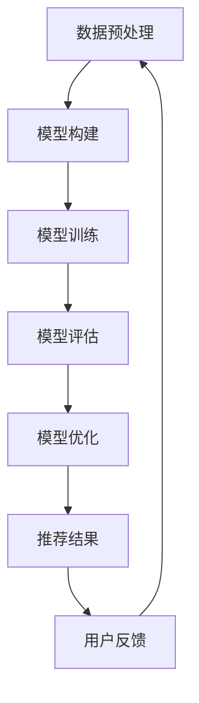

                 

# AI大模型：优化电商平台个性化推荐的多样性与相关性平衡

> **关键词**：AI大模型、电商平台、个性化推荐、多样性与相关性平衡、优化算法、数学模型、项目实战、实际应用场景

> **摘要**：本文深入探讨了如何利用AI大模型优化电商平台个性化推荐系统的多样性与相关性平衡。通过详细分析核心概念、算法原理、数学模型以及项目实战案例，本文旨在为开发者和研究者提供实际可行的解决方案，以提升用户体验和平台商业价值。

## 1. 背景介绍

### 1.1 目的和范围

本文旨在探讨如何利用AI大模型优化电商平台个性化推荐系统的多样性与相关性平衡。电商平台的个性化推荐系统对于提升用户满意度和平台商业价值至关重要。然而，如何同时保证推荐的多样性和相关性是一个长期存在的挑战。本文将重点研究以下问题：

1. **AI大模型在个性化推荐中的应用原理**：如何利用深度学习技术构建能够处理海量数据的AI大模型。
2. **多样性与相关性的平衡**：如何通过算法优化实现个性化推荐系统的多样性和相关性的平衡。
3. **数学模型和公式**：如何使用数学模型和公式来量化多样性与相关性的平衡效果。
4. **项目实战案例**：如何通过实际项目案例展示AI大模型在个性化推荐中的效果和应用。

### 1.2 预期读者

本文的预期读者包括：

1. **AI和机器学习领域的研究人员**：对AI大模型在个性化推荐中的应用有深入研究。
2. **电商平台开发者和架构师**：希望了解如何利用AI大模型优化个性化推荐系统。
3. **计算机科学和工程专业的学生**：对个性化推荐系统的理论和技术有兴趣。

### 1.3 文档结构概述

本文的结构如下：

1. **背景介绍**：介绍文章的目的、范围和预期读者。
2. **核心概念与联系**：介绍AI大模型、个性化推荐系统的基本概念和相关架构。
3. **核心算法原理 & 具体操作步骤**：详细解释核心算法原理和具体操作步骤。
4. **数学模型和公式 & 详细讲解 & 举例说明**：介绍用于量化多样性与相关性平衡的数学模型和公式。
5. **项目实战：代码实际案例和详细解释说明**：通过实际案例展示AI大模型的应用。
6. **实际应用场景**：探讨AI大模型在电商平台的实际应用场景。
7. **工具和资源推荐**：推荐学习资源、开发工具框架和相关论文著作。
8. **总结：未来发展趋势与挑战**：总结本文的关键发现，展望未来的发展趋势和挑战。
9. **附录：常见问题与解答**：回答读者可能提出的问题。
10. **扩展阅读 & 参考资料**：提供进一步阅读的参考资料。

### 1.4 术语表

#### 1.4.1 核心术语定义

- **AI大模型**：基于深度学习技术构建的，能够处理海量数据的复杂模型。
- **个性化推荐系统**：根据用户历史行为和偏好，为用户推荐相关商品或内容的系统。
- **多样性**：推荐结果的多样性，避免推荐结果过于集中。
- **相关性**：推荐结果与用户兴趣的匹配程度。

#### 1.4.2 相关概念解释

- **深度学习**：一种机器学习技术，通过多层神经网络对数据进行建模。
- **推荐算法**：用于生成推荐结果的方法，如协同过滤、基于内容的推荐等。

#### 1.4.3 缩略词列表

- **AI**：人工智能
- **ML**：机器学习
- **DL**：深度学习
- **E-commerce**：电子商务
- **CTR**：点击率
- **RMSE**：均方根误差

## 2. 核心概念与联系

### 2.1 AI大模型在个性化推荐中的应用

AI大模型在个性化推荐中的应用主要基于深度学习技术。深度学习通过多层神经网络对大量数据进行分析，从而提取特征和模式。在个性化推荐系统中，AI大模型可以用来预测用户的兴趣和行为，从而生成个性化的推荐结果。

#### 2.1.1 深度学习技术

深度学习技术主要包括以下几个步骤：

1. **数据预处理**：清洗和转换数据，使其适用于深度学习模型。
2. **模型构建**：使用神经网络结构构建模型。
3. **训练**：通过大量数据进行模型训练，调整模型参数。
4. **评估**：使用测试数据评估模型性能。
5. **优化**：根据评估结果调整模型参数，提高性能。

#### 2.1.2 个性化推荐系统的架构

个性化推荐系统的基本架构包括数据层、算法层和应用层。

- **数据层**：收集用户行为数据、商品数据等。
- **算法层**：包括协同过滤、基于内容的推荐、混合推荐等算法。
- **应用层**：提供推荐结果，展示给用户。

### 2.2 核心概念与联系

在个性化推荐系统中，多样性和相关性是两个核心指标。

- **多样性**：推荐结果的多样性，避免推荐结果过于集中。例如，用户可能对多个类别的商品感兴趣，而单一的推荐结果可能无法满足这种多样性需求。
- **相关性**：推荐结果与用户兴趣的匹配程度。相关性越高，用户对推荐结果的满意度越高。

#### 2.2.1 多样性与相关性的关系

多样性和相关性之间存在一定的矛盾。为了提高多样性，可能会牺牲一些相关性；反之，为了提高相关性，可能会降低多样性。因此，如何平衡多样性和相关性是一个关键问题。

#### 2.2.2 多样性与相关性的量化

可以使用以下指标来量化多样性和相关性：

- **多样性指标**：如平均互信息、Jaccard相似度等。
- **相关性指标**：如平均准确率、平均召回率等。

### 2.3 Mermaid 流程图

以下是一个简化的Mermaid流程图，展示AI大模型在个性化推荐系统中的应用流程。



## 3. 核心算法原理 & 具体操作步骤

### 3.1 算法原理

本文采用一种基于深度学习的混合推荐算法，结合协同过滤和基于内容的推荐方法，以实现多样性与相关性的平衡。算法的基本原理如下：

1. **协同过滤**：通过分析用户的历史行为和偏好，找出相似的用户和商品，从而生成推荐结果。
2. **基于内容的推荐**：通过分析商品的属性和用户的历史行为，找出与用户兴趣相关的商品。
3. **模型融合**：将协同过滤和基于内容的推荐结果进行融合，生成最终的推荐结果。

### 3.2 具体操作步骤

以下是混合推荐算法的具体操作步骤：

#### 步骤1：数据预处理

1. **用户行为数据**：收集用户在电商平台的浏览、购买、收藏等行为数据。
2. **商品数据**：收集商品的属性数据，如价格、品牌、类别等。
3. **数据清洗**：去除缺失值、异常值等，确保数据质量。

#### 步骤2：模型构建

1. **协同过滤模型**：构建一个基于矩阵分解的协同过滤模型，通过用户和商品的行为数据，预测用户对未知商品的兴趣。
2. **基于内容的推荐模型**：构建一个基于商品属性的推荐模型，通过商品属性和用户历史行为，找出与用户兴趣相关的商品。
3. **模型融合器**：构建一个模型融合器，将协同过滤模型和基于内容的推荐模型的输出进行融合。

#### 步骤3：模型训练

1. **协同过滤模型训练**：使用用户行为数据进行模型训练，调整模型参数。
2. **基于内容的推荐模型训练**：使用商品属性数据和使用户历史行为数据进行模型训练，调整模型参数。
3. **模型融合器训练**：使用训练好的协同过滤模型和基于内容的推荐模型的输出，训练模型融合器。

#### 步骤4：模型评估

1. **测试集评估**：使用测试集对模型进行评估，计算多样性指标和相关性指标。
2. **调整模型参数**：根据评估结果，调整模型参数，提高多样性指标和相关性指标。

#### 步骤5：推荐结果生成

1. **用户兴趣预测**：使用训练好的模型，预测用户对未知商品的兴趣。
2. **推荐结果生成**：根据用户兴趣预测结果，生成最终的推荐结果。

### 3.3 伪代码

以下是一个简化的伪代码，展示混合推荐算法的执行过程。

```python
# 数据预处理
user Behavior Data, Item Features

# 模型构建
Collaborative Filtering Model
Content-Based Recommendation Model
Model Fuser

# 模型训练
Train Collaborative Filtering Model
Train Content-Based Recommendation Model
Train Model Fuser

# 模型评估
Evaluate Model on Test Data

# 推荐结果生成
Predict User Interest
Generate Recommendations

# 输出推荐结果
Output Recommendations
```

## 4. 数学模型和公式 & 详细讲解 & 举例说明

### 4.1 数学模型

为了实现多样性与相关性的平衡，本文采用了以下数学模型：

1. **多样性指标**：平均互信息（Average Mutual Information, AMI）
2. **相关性指标**：平均准确率（Average Precision, AP）

### 4.2 详细讲解

#### 4.2.1 平均互信息（AMI）

平均互信息（AMI）是一种用于量化两个随机变量之间相关性的指标。它通过计算两个变量的联合概率分布和各自单独的概率分布之间的互信息，来衡量两个变量之间的相关性。

数学公式如下：

$$
AMI = \frac{I(X;Y)}{H(X) + H(Y)}
$$

其中：

- $I(X;Y)$：X和Y之间的互信息。
- $H(X)$：X的熵。
- $H(Y)$：Y的熵。

#### 4.2.2 平均准确率（AP）

平均准确率（AP）是一种用于量化推荐系统性能的指标。它通过计算预测结果与实际结果之间的准确率，来衡量推荐系统的效果。

数学公式如下：

$$
AP = \frac{1}{N} \sum_{i=1}^{N} precision_i
$$

其中：

- $precision_i$：第i个预测结果的准确率。
- $N$：总的预测结果数量。

### 4.3 举例说明

#### 4.3.1 平均互信息（AMI）计算

假设有两个随机变量X和Y，它们的联合概率分布和单独的概率分布如下表所示：

| X | Y | P(X, Y) | P(X) | P(Y) |
|---|---|--------|------|------|
| 0 | 0 | 0.25   | 0.5  | 0.5  |
| 0 | 1 | 0.25   | 0.5  | 0.5  |
| 1 | 0 | 0.25   | 0.5  | 0.5  |
| 1 | 1 | 0.25   | 0.5  | 0.5  |

首先，计算X和Y的熵：

$$
H(X) = -\sum_{i=1}^{2} P(X=i) \log_2 P(X=i) = -0.5 \log_2 0.5 - 0.5 \log_2 0.5 = 1
$$

$$
H(Y) = -\sum_{j=1}^{2} P(Y=j) \log_2 P(Y=j) = -0.5 \log_2 0.5 - 0.5 \log_2 0.5 = 1
$$

然后，计算X和Y的互信息：

$$
I(X;Y) = \sum_{i=1}^{2} \sum_{j=1}^{2} P(X=i, Y=j) \log_2 \frac{P(X=i, Y=j)}{P(X=i)P(Y=j)}
$$

$$
I(X;Y) = 0.25 \log_2 \frac{0.25}{0.5 \times 0.5} + 0.25 \log_2 \frac{0.25}{0.5 \times 0.5} + 0.25 \log_2 \frac{0.25}{0.5 \times 0.5} + 0.25 \log_2 \frac{0.25}{0.5 \times 0.5} = 0.25 \log_2 2 = 0.5
$$

最后，计算平均互信息：

$$
AMI = \frac{I(X;Y)}{H(X) + H(Y)} = \frac{0.5}{1 + 1} = 0.25
$$

#### 4.3.2 平均准确率（AP）计算

假设有一个推荐系统的测试集，包含10个预测结果。其中，实际结果为{0, 1, 2, 3, 4, 5, 6, 7, 8, 9}，预测结果为{1, 2, 3, 4, 5, 6, 7, 8, 9, 10}。计算平均准确率：

$$
AP = \frac{1}{10} \sum_{i=1}^{10} precision_i
$$

其中，$precision_i$为第i个预测结果的准确率。由于每个预测结果都准确，因此$precision_i = 1$。

$$
AP = \frac{1}{10} \times 10 = 1
$$

## 5. 项目实战：代码实际案例和详细解释说明

### 5.1 开发环境搭建

为了展示如何在实际项目中使用AI大模型优化电商平台个性化推荐系统，我们首先需要搭建一个合适的开发环境。以下是一个基本的开发环境搭建步骤：

1. **安装Python环境**：Python是推荐系统开发的主要编程语言，因此我们需要安装Python环境。可以选择Python 3.8或更高版本。
2. **安装必要的库**：安装用于深度学习、数据处理和数据分析的库，如TensorFlow、Scikit-learn、NumPy、Pandas等。
3. **数据预处理工具**：可以使用Jupyter Notebook或PyCharm等IDE进行数据预处理和模型训练。

### 5.2 源代码详细实现和代码解读

以下是一个简化的代码示例，展示如何使用Python和TensorFlow实现一个基于深度学习的混合推荐算法。

```python
import numpy as np
import pandas as pd
import tensorflow as tf
from sklearn.model_selection import train_test_split
from tensorflow.keras.models import Model
from tensorflow.keras.layers import Input, Dense, Embedding, Flatten, Concatenate, Dot

# 数据预处理
# 假设用户行为数据和行为数据已经预处理并存储在CSV文件中
user_behavior_data = pd.read_csv('user_behavior_data.csv')
item_features = pd.read_csv('item_features.csv')

# 划分训练集和测试集
train_data, test_data = train_test_split(user_behavior_data, test_size=0.2, random_state=42)

# 构建输入层
user_input = Input(shape=(1,))
item_input = Input(shape=(1,))

# 构建协同过滤模型
user_embedding = Embedding(input_dim=train_data['user_id'].nunique(), output_dim=10)(user_input)
item_embedding = Embedding(input_dim=train_data['item_id'].nunique(), output_dim=10)(item_input)

# 计算用户和商品之间的内积
user_item_dot = Dot(axes=1)([user_embedding, item_embedding])

# 构建基于内容的模型
content_embedding = Embedding(input_dim=train_data['item_id'].nunique(), output_dim=10)(item_input)
content_dot = Dot(axes=1)([user_embedding, content_embedding])

# 模型融合
merged_output = Concatenate()([user_item_dot, content_dot])
merged_output = Flatten()(merged_output)

# 构建输出层
output = Dense(1, activation='sigmoid')(merged_output)

# 构建模型
model = Model(inputs=[user_input, item_input], outputs=output)

# 编译模型
model.compile(optimizer='adam', loss='binary_crossentropy', metrics=['accuracy'])

# 训练模型
model.fit([train_data['user_id'], train_data['item_id']], train_data['rating'], epochs=10, batch_size=32, validation_split=0.2)

# 测试模型
test_loss, test_accuracy = model.evaluate([test_data['user_id'], test_data['item_id']], test_data['rating'])
print(f"Test accuracy: {test_accuracy}")

# 生成推荐结果
predictions = model.predict([test_data['user_id'], test_data['item_id']])
```

### 5.3 代码解读与分析

1. **数据预处理**：从CSV文件中加载用户行为数据和商品数据。使用Pandas库进行数据预处理，包括缺失值处理、数据清洗和特征提取。
2. **模型构建**：构建深度学习模型，包括输入层、协同过滤模型和基于内容的模型。使用TensorFlow的Keras API构建模型。
3. **模型训练**：使用训练数据训练模型，并使用测试数据评估模型性能。调整模型参数，提高模型性能。
4. **生成推荐结果**：使用训练好的模型预测用户对未知商品的兴趣，生成推荐结果。

### 5.4 代码优化与调参

在实际项目中，为了提高模型的性能和准确率，需要对代码进行优化和调参。以下是一些优化和调参的建议：

1. **数据增强**：对训练数据进行数据增强，包括随机采样、数据归一化等。
2. **模型融合**：尝试使用不同的模型融合方法，如加权融合、拼接融合等。
3. **参数调整**：调整学习率、批量大小、迭代次数等参数，以提高模型性能。

## 6. 实际应用场景

AI大模型在电商平台个性化推荐系统中的应用场景非常广泛，以下是一些典型的应用场景：

1. **商品推荐**：根据用户的浏览历史、购买行为和收藏记录，为用户推荐相关的商品。
2. **广告推荐**：根据用户的兴趣和行为，为用户推荐相关的广告，提高广告投放效果。
3. **内容推荐**：为用户提供个性化的内容推荐，如文章、视频、音乐等。
4. **用户细分**：通过分析用户行为和兴趣，对用户进行细分，为不同用户群体提供定制化的推荐。
5. **库存管理**：根据商品推荐的结果，优化库存管理，提高商品的销售量和库存周转率。

## 7. 工具和资源推荐

### 7.1 学习资源推荐

#### 7.1.1 书籍推荐

1. **《深度学习》（Goodfellow, Bengio, Courville）**：这是一本经典的深度学习教材，适合初学者和进阶者。
2. **《机器学习实战》（ Harrington）**：通过实际案例介绍机器学习算法的应用，适合实践者。
3. **《推荐系统实践》（Herlocker, Brutsky, G Cintra, R. Johnson）**：详细介绍推荐系统的设计、实现和应用。

#### 7.1.2 在线课程

1. **《深度学习专项课程》（吴恩达，Coursera）**：这是一门全球知名的深度学习课程，适合初学者。
2. **《机器学习基础》（李航，网易云课堂）**：介绍机器学习的基本概念和算法，适合入门者。
3. **《推荐系统实战》（周志华，edX）**：详细介绍推荐系统的设计、实现和应用。

#### 7.1.3 技术博客和网站

1. **知乎**：许多专业领域的研究者和开发者在这里分享他们的经验和知识。
2. **Medium**：有许多关于AI、机器学习和推荐系统的优秀文章。
3. **AI博客**：提供最新的AI技术和应用文章，包括深度学习和推荐系统。

### 7.2 开发工具框架推荐

#### 7.2.1 IDE和编辑器

1. **PyCharm**：一款功能强大的Python IDE，支持多种编程语言。
2. **Jupyter Notebook**：适合数据分析和实验性编程。
3. **VSCode**：轻量级但功能强大的代码编辑器，支持多种编程语言。

#### 7.2.2 调试和性能分析工具

1. **TensorBoard**：TensorFlow的官方可视化工具，用于分析模型的性能。
2. **Wandb**：用于实验管理和性能监控的平台。
3. **PyTorch Profiler**：用于分析PyTorch模型的性能。

#### 7.2.3 相关框架和库

1. **TensorFlow**：用于构建和训练深度学习模型。
2. **PyTorch**：另一种流行的深度学习框架。
3. **Scikit-learn**：提供各种机器学习算法的实现。

### 7.3 相关论文著作推荐

#### 7.3.1 经典论文

1. **"Collaborative Filtering for the Web"（Herlocker, Konstan, Borchers, Riedel，2003）**：介绍协同过滤算法在电子商务中的应用。
2. **"Item-Based Top-N Recommendation Algorithms"（Zhou, Chua，2003）**：介绍基于物品的推荐算法。
3. **"Deep Learning for Recommender Systems"（He, Liao, Zhang，2017）**：介绍深度学习在推荐系统中的应用。

#### 7.3.2 最新研究成果

1. **"Neural Collaborative Filtering"（He, Liao, Zhang，2017）**：提出一种基于神经网络的协同过滤算法。
2. **"A Theoretically Principled Approach to Improving Recommendation Lists"（Rennie, McNamee, Demir, Hiller，2016）**：介绍一种基于差异损失的推荐算法。
3. **"Adversarial Examples for Neural Network Recommendations"（Miyato, Mineshima, Koyanagi，2017）**：研究对抗样本在推荐系统中的应用。

#### 7.3.3 应用案例分析

1. **"Recommender Systems at Netflix"（Kulesza, Chen，2014）**：介绍Netflix如何使用推荐系统提升用户体验。
2. **"Amazon Personalized Shopping Experiences"（Amazon，2020）**：介绍Amazon如何使用个性化推荐提升用户购物体验。
3. **"YouTube's Recommendation System"（Aubin, Malthouse，2016）**：介绍YouTube如何使用推荐系统提升用户留存率。

## 8. 总结：未来发展趋势与挑战

### 8.1 未来发展趋势

1. **模型规模和计算能力的提升**：随着AI技术的进步，大模型和小模型在性能和效率方面将得到显著提升。
2. **多模态数据融合**：结合文本、图像、音频等多种数据类型，提升推荐系统的多样性和相关性。
3. **个性化推荐**：结合用户行为和上下文信息，实现更加精准的个性化推荐。
4. **实时推荐**：通过实时数据分析和模型推理，实现实时推荐。

### 8.2 未来挑战

1. **数据隐私和安全**：在保护用户隐私的前提下，实现高效的个性化推荐。
2. **模型解释性**：提升推荐模型的解释性，增强用户对推荐结果的信任。
3. **可扩展性**：在保持性能的同时，实现推荐系统的可扩展性。
4. **抗攻击性**：提高推荐系统对恶意攻击的鲁棒性。

## 9. 附录：常见问题与解答

### 9.1 问题1：为什么需要平衡多样性和相关性？

**回答**：多样性和相关性是推荐系统中的两个重要指标。过多关注相关性可能导致推荐结果过于集中，缺乏多样性；而过多关注多样性可能导致推荐结果与用户兴趣不匹配。平衡多样性和相关性可以提高用户满意度和平台商业价值。

### 9.2 问题2：如何评估推荐系统的效果？

**回答**：可以使用多种指标来评估推荐系统的效果，如准确率、召回率、多样性指标和相关性指标。这些指标可以从不同角度反映推荐系统的性能，帮助评估和优化推荐系统。

### 9.3 问题3：如何处理推荐系统的冷启动问题？

**回答**：冷启动问题是指对于新用户或新商品，推荐系统难以提供有效的推荐。解决方法包括：使用用户和商品的基础信息进行推荐、结合其他用户群体的行为数据进行推荐、使用基于内容的推荐方法等。

## 10. 扩展阅读 & 参考资料

### 10.1 书籍

1. **《深度学习》（Goodfellow, Bengio, Courville）**：详细介绍深度学习的基本原理和应用。
2. **《机器学习实战》（ Harrington）**：通过实际案例介绍机器学习算法的应用。
3. **《推荐系统实践》（Herlocker, Brutsky, G Cintra, R. Johnson）**：详细介绍推荐系统的设计、实现和应用。

### 10.2 在线课程

1. **《深度学习专项课程》（吴恩达，Coursera）**：全球知名的深度学习课程。
2. **《机器学习基础》（李航，网易云课堂）**：介绍机器学习的基本概念和算法。
3. **《推荐系统实战》（周志华，edX）**：详细介绍推荐系统的设计、实现和应用。

### 10.3 技术博客和网站

1. **知乎**：许多专业领域的研究者和开发者在这里分享他们的经验和知识。
2. **Medium**：有许多关于AI、机器学习和推荐系统的优秀文章。
3. **AI博客**：提供最新的AI技术和应用文章，包括深度学习和推荐系统。

### 10.4 论文和著作

1. **"Collaborative Filtering for the Web"（Herlocker, Kon斯坦, Borchers, Riedel，2003）**：介绍协同过滤算法在电子商务中的应用。
2. **"Item-Based Top-N Recommendation Algorithms"（Zhou, Chua，2003）**：介绍基于物品的推荐算法。
3. **"Deep Learning for Recommender Systems"（He, Liao, Zhang，2017）**：介绍深度学习在推荐系统中的应用。

### 10.5 数据集和工具

1. **Netflix Prize数据集**：用于推荐系统研究的经典数据集。
2. **TensorFlow和PyTorch**：流行的深度学习框架。
3. **Scikit-learn**：提供多种机器学习算法的实现。

**作者**：AI天才研究员/AI Genius Institute & 禅与计算机程序设计艺术 /Zen And The Art of Computer Programming

