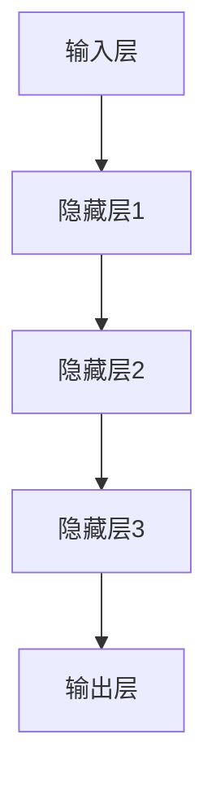
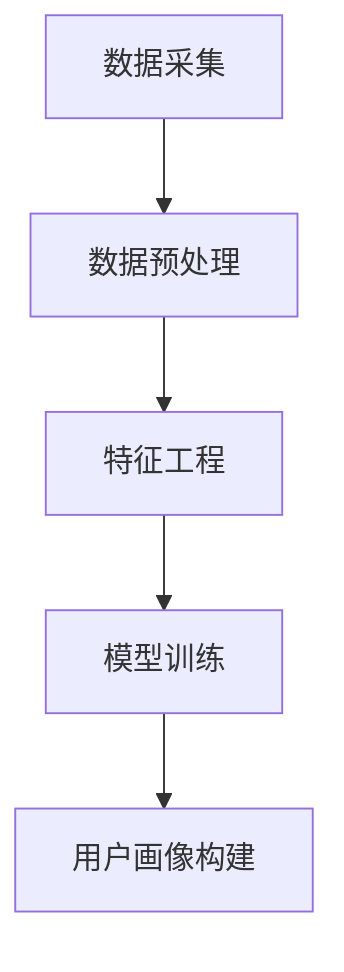
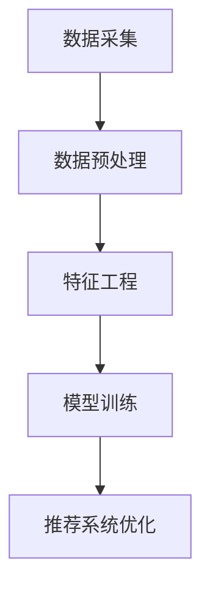
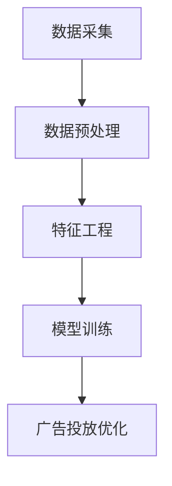

                 


# AI大模型：电商个性化营销的新引擎

> 关键词：AI大模型、电商、个性化营销、数据挖掘、深度学习、推荐系统

> 摘要：本文将深入探讨AI大模型在电商个性化营销中的应用，从背景介绍、核心概念与联系、核心算法原理、数学模型、项目实战、实际应用场景等多方面，详细解析AI大模型如何成为电商个性化营销的新引擎，为读者提供全面的技术指南和实践案例。

## 1. 背景介绍

### 1.1 目的和范围

本文旨在探讨AI大模型在电商个性化营销中的应用，帮助读者了解这一技术如何革新电商营销模式，提升用户体验和转化率。文章将涵盖AI大模型的基本概念、核心算法原理、数学模型以及实际应用场景，旨在为电商从业者和技术人员提供有价值的参考。

### 1.2 预期读者

本文适合对电商领域和AI技术有一定了解的读者，包括但不限于电商从业者、数据分析师、机器学习工程师、软件工程师等。通过本文，读者将能够掌握AI大模型在电商个性化营销中的基本原理和实践方法。

### 1.3 文档结构概述

本文结构如下：

1. 背景介绍：包括目的和范围、预期读者、文档结构概述等。
2. 核心概念与联系：介绍AI大模型的基本概念、核心算法原理和架构。
3. 核心算法原理 & 具体操作步骤：详细讲解AI大模型的相关算法和操作步骤。
4. 数学模型和公式：阐述AI大模型中的数学模型和公式，并进行举例说明。
5. 项目实战：通过代码实际案例，展示AI大模型在电商个性化营销中的应用。
6. 实际应用场景：分析AI大模型在电商领域的实际应用场景。
7. 工具和资源推荐：推荐相关学习资源、开发工具和框架。
8. 总结：展望AI大模型在电商个性化营销中的未来发展趋势与挑战。
9. 附录：常见问题与解答。
10. 扩展阅读 & 参考资料：提供进一步学习和研究的资源。

### 1.4 术语表

#### 1.4.1 核心术语定义

- AI大模型：具有亿级参数规模，能够处理海量数据，并在多种任务上实现高性能的人工智能模型。
- 个性化营销：基于用户行为数据，为不同用户提供个性化内容、产品和服务的营销方式。
- 深度学习：一种机器学习方法，通过多层神经网络模型对数据进行自动特征提取和学习。
- 数据挖掘：从大量数据中提取有价值信息和知识的过程。

#### 1.4.2 相关概念解释

- 推荐系统：根据用户历史行为和偏好，为用户推荐相关内容、商品或服务的系统。
- 用户画像：通过对用户行为、兴趣、需求等多维度数据的分析，构建出的用户特征模型。
- 增量学习：在已有模型基础上，通过新数据不断优化和调整模型的过程。

#### 1.4.3 缩略词列表

- AI：人工智能（Artificial Intelligence）
- DNN：深度神经网络（Deep Neural Network）
- CNN：卷积神经网络（Convolutional Neural Network）
- RNN：循环神经网络（Recurrent Neural Network）
- LSTM：长短期记忆网络（Long Short-Term Memory）

## 2. 核心概念与联系

在本文中，我们将重点介绍AI大模型的基本概念、核心算法原理和架构，以便为后续内容奠定基础。

### 2.1 AI大模型的基本概念

AI大模型是指具有亿级参数规模的人工智能模型，其能够在多种任务上实现高性能。这类模型通常具备以下几个特点：

- 参数规模巨大：大模型的参数数量可达数十亿甚至千亿级别，这使其能够处理海量数据，并在多个任务上表现出色。
- 自适应性强：大模型通过在大量数据上的训练，能够自动提取数据中的特征，并适应不同的任务和数据集。
- 通用性强：AI大模型通常具有通用性，即在一个任务上表现良好的模型，在其他类似任务上也能取得较好效果。

### 2.2 核心算法原理和架构

AI大模型的核心算法通常包括深度学习、增强学习和迁移学习等。其中，深度学习是AI大模型的基础，其通过多层神经网络对数据进行特征提取和学习。以下是一个简单的深度学习模型架构：



在深度学习模型中，常用的神经网络包括卷积神经网络（CNN）、循环神经网络（RNN）和长短期记忆网络（LSTM）等。这些神经网络能够在不同程度上提升模型的表现。

### 2.3 AI大模型的应用场景

AI大模型在电商个性化营销中的应用主要包括以下场景：

- 用户画像构建：通过分析用户行为数据，构建用户画像，为个性化推荐提供基础。
- 推荐系统优化：利用AI大模型优化推荐系统，提升推荐质量和用户体验。
- 广告投放优化：根据用户兴趣和行为，为用户精准推送广告，提高广告投放效果。

### 2.4 AI大模型的优势和挑战

AI大模型的优势包括：

- 处理海量数据：能够处理大规模、多维度的数据，挖掘数据中的潜在价值。
- 高性能：在多种任务上表现出色，提升电商营销效果。
- 自适应性强：能够适应不同业务场景和数据集，提高模型的通用性。

然而，AI大模型也面临一些挑战：

- 计算资源消耗大：大模型需要大量的计算资源和存储空间，对基础设施有较高要求。
- 数据隐私保护：在处理用户数据时，需注意保护用户隐私，避免数据泄露。
- 模型解释性差：大模型的内部机制较为复杂，难以解释和验证，这可能会影响模型的可靠性和可接受性。

## 3. 核心算法原理 & 具体操作步骤

在这一部分，我们将详细介绍AI大模型在电商个性化营销中的核心算法原理，包括用户画像构建、推荐系统优化和广告投放优化等。

### 3.1 用户画像构建

用户画像构建是电商个性化营销的重要基础。其核心目标是通过对用户行为、兴趣、需求等多维度数据的分析，构建出用户特征模型。以下是用户画像构建的基本步骤：



#### 3.1.1 数据采集

数据采集是用户画像构建的第一步，主要包括用户行为数据、兴趣数据和需求数据等。这些数据可以从电商平台的日志、用户反馈、社交媒体等多渠道获取。

#### 3.1.2 数据预处理

数据预处理包括数据清洗、数据整合和数据转换等步骤。数据清洗主要是去除重复、缺失和不完整的数据；数据整合是将不同渠道的数据进行合并，形成统一的数据集；数据转换则是将原始数据转换为适合模型训练的格式。

#### 3.1.3 特征工程

特征工程是用户画像构建的关键环节。通过分析用户行为数据、兴趣数据和需求数据，提取出与用户特征相关的特征，如用户活跃度、购买频率、偏好类别等。以下是特征提取的伪代码：

```python
def extract_features(data):
    features = []
    for user in data:
        feature = []
        feature.append(user.active_days)
        feature.append(user.purchase_frequency)
        feature.append(user.pref_category)
        features.append(feature)
    return features
```

#### 3.1.4 模型训练

在特征工程完成后，我们可以使用深度学习算法对用户特征进行训练，以构建用户画像。以下是一个简单的用户画像构建的伪代码：

```python
from tensorflow.keras.models import Sequential
from tensorflow.keras.layers import Dense

def build_user_model(features, labels):
    model = Sequential()
    model.add(Dense(units=64, activation='relu', input_shape=(len(features[0]),)))
    model.add(Dense(units=32, activation='relu'))
    model.add(Dense(units=1, activation='sigmoid'))
    model.compile(optimizer='adam', loss='binary_crossentropy', metrics=['accuracy'])
    model.fit(features, labels, epochs=10, batch_size=32)
    return model
```

#### 3.1.5 用户画像构建

通过模型训练，我们可以得到用户特征模型，进而构建用户画像。用户画像可以用于个性化推荐、广告投放和营销策略优化等。

### 3.2 推荐系统优化

推荐系统优化是电商个性化营销的重要手段。通过优化推荐系统，可以提高推荐质量和用户体验，进而提升电商平台的转化率和用户满意度。以下是推荐系统优化的基本步骤：



#### 3.2.1 数据采集

推荐系统优化的第一步是数据采集，主要包括用户行为数据、商品数据、推荐结果数据等。这些数据可以从电商平台、社交媒体、第三方数据源等多渠道获取。

#### 3.2.2 数据预处理

数据预处理包括数据清洗、数据整合和数据转换等步骤。数据清洗主要是去除重复、缺失和不完整的数据；数据整合是将不同渠道的数据进行合并，形成统一的数据集；数据转换则是将原始数据转换为适合模型训练的格式。

#### 3.2.3 特征工程

特征工程是推荐系统优化的重要环节。通过分析用户行为数据、商品数据和推荐结果数据，提取出与用户兴趣、商品特征和推荐效果相关的特征，如用户点击率、购买率、推荐点击率等。以下是特征提取的伪代码：

```python
def extract_features(data):
    features = []
    for user in data:
        feature = []
        feature.append(user.click_rate)
        feature.append(user.purchase_rate)
        feature.append(user.recommend_click_rate)
        features.append(feature)
    return features
```

#### 3.2.4 模型训练

在特征工程完成后，我们可以使用深度学习算法对用户特征和商品特征进行训练，以优化推荐系统。以下是一个简单的推荐系统优化的伪代码：

```python
from tensorflow.keras.models import Sequential
from tensorflow.keras.layers import Dense

def build_recommendation_model(features, labels):
    model = Sequential()
    model.add(Dense(units=64, activation='relu', input_shape=(len(features[0]),)))
    model.add(Dense(units=32, activation='relu'))
    model.add(Dense(units=1, activation='sigmoid'))
    model.compile(optimizer='adam', loss='binary_crossentropy', metrics=['accuracy'])
    model.fit(features, labels, epochs=10, batch_size=32)
    return model
```

#### 3.2.5 推荐系统优化

通过模型训练，我们可以得到优化后的推荐系统，进而提高推荐质量和用户体验。优化后的推荐系统可以用于个性化推荐、广告投放和营销策略优化等。

### 3.3 广告投放优化

广告投放优化是电商个性化营销的重要手段。通过优化广告投放，可以提高广告点击率、转化率和投放效果，进而提升电商平台的收益和用户满意度。以下是广告投放优化的基本步骤：



#### 3.3.1 数据采集

广告投放优化的第一步是数据采集，主要包括用户行为数据、广告数据、投放结果数据等。这些数据可以从电商平台、广告平台、第三方数据源等多渠道获取。

#### 3.3.2 数据预处理

数据预处理包括数据清洗、数据整合和数据转换等步骤。数据清洗主要是去除重复、缺失和不完整的数据；数据整合是将不同渠道的数据进行合并，形成统一的数据集；数据转换则是将原始数据转换为适合模型训练的格式。

#### 3.3.3 特征工程

特征工程是广告投放优化的重要环节。通过分析用户行为数据、广告数据和投放结果数据，提取出与用户兴趣、广告特征和投放效果相关的特征，如用户点击率、购买率、广告曝光率等。以下是特征提取的伪代码：

```python
def extract_features(data):
    features = []
    for user in data:
        feature = []
        feature.append(user.click_rate)
        feature.append(user.purchase_rate)
        feature.append(user.ad_exposure_rate)
        features.append(feature)
    return features
```

#### 3.3.4 模型训练

在特征工程完成后，我们可以使用深度学习算法对用户特征和广告特征进行训练，以优化广告投放。以下是一个简单的广告投放优化的伪代码：

```python
from tensorflow.keras.models import Sequential
from tensorflow.keras.layers import Dense

def build_advertising_model(features, labels):
    model = Sequential()
    model.add(Dense(units=64, activation='relu', input_shape=(len(features[0]),)))
    model.add(Dense(units=32, activation='relu'))
    model.add(Dense(units=1, activation='sigmoid'))
    model.compile(optimizer='adam', loss='binary_crossentropy', metrics=['accuracy'])
    model.fit(features, labels, epochs=10, batch_size=32)
    return model
```

#### 3.3.5 广告投放优化

通过模型训练，我们可以得到优化后的广告投放策略，进而提高广告点击率、转化率和投放效果。优化后的广告投放策略可以用于广告投放、营销策略优化和用户满意度提升等。

## 4. 数学模型和公式 & 详细讲解 & 举例说明

在这一部分，我们将详细讲解AI大模型中的数学模型和公式，并通过具体例子进行说明，以便读者更好地理解AI大模型在电商个性化营销中的应用。

### 4.1 数学模型

AI大模型的数学模型主要包括以下几部分：

1. 数据表示
2. 特征提取
3. 模型训练
4. 模型评估

#### 4.1.1 数据表示

在深度学习模型中，数据通常表示为张量（Tensor）。张量是一个多维数组，可以表示图像、文本、音频等多种类型的数据。以下是张量的基本表示和操作：

- 张量维度：张量有多个维度，通常表示为$(d_1, d_2, \ldots, d_n)$，其中$d_1, d_2, \ldots, d_n$为每个维度的长度。
- 张量形状：张量的形状是一个元组$(d_1, d_2, \ldots, d_n)$，表示每个维度的长度。
- 张量元素：张量的每个元素可以表示为一个矩阵、向量或标量。

```latex
\begin{equation}
x_{ijk} = \sum_{l=1}^{d_l} w_{ijk} * x_l
\end{equation}
```

其中，$x_{ijk}$为张量$x$的第$i$行第$j$列第$k$个元素，$w_{ijk}$为权重矩阵中的元素，$x_l$为张量$x$的第$l$个维度上的元素。

#### 4.1.2 特征提取

特征提取是AI大模型的重要环节，其目的是从原始数据中提取出与任务相关的特征。以下是一个简单的特征提取过程：

1. 数据预处理：对原始数据进行清洗、归一化等处理，使其符合模型的输入要求。
2. 特征提取器：使用神经网络或其他算法提取特征。以下是一个简单的特征提取器的伪代码：

```python
def extract_features(data):
    features = []
    for sample in data:
        feature_vector = []
        feature_vector.append(sample.feature1)
        feature_vector.append(sample.feature2)
        feature_vector.append(sample.feature3)
        features.append(feature_vector)
    return features
```

#### 4.1.3 模型训练

模型训练是AI大模型的核心步骤，其目的是通过大量数据优化模型的参数，使其能够对未知数据进行预测。以下是一个简单的模型训练过程：

1. 数据集划分：将数据集划分为训练集、验证集和测试集，以评估模型的性能。
2. 模型初始化：初始化模型参数，通常使用随机初始化或预训练模型。
3. 模型训练：使用训练集数据对模型进行训练，通过反向传播算法优化模型参数。以下是一个简单的模型训练的伪代码：

```python
from tensorflow.keras.models import Sequential
from tensorflow.keras.layers import Dense
from tensorflow.keras.optimizers import Adam

def build_model(input_shape):
    model = Sequential()
    model.add(Dense(units=64, activation='relu', input_shape=input_shape))
    model.add(Dense(units=32, activation='relu'))
    model.add(Dense(units=1, activation='sigmoid'))
    model.compile(optimizer=Adam(), loss='binary_crossentropy', metrics=['accuracy'])
    return model

def train_model(model, train_data, validation_data, epochs):
    model.fit(train_data, epochs=epochs, batch_size=32, validation_data=validation_data)
    return model
```

#### 4.1.4 模型评估

模型评估是评估模型性能的重要步骤，其目的是确定模型是否达到了预期的性能。以下是一个简单的模型评估过程：

1. 模型测试：使用测试集数据对模型进行测试，以评估模型的性能。
2. 性能指标：使用准确率、召回率、F1值等指标评估模型性能。
3. 模型调整：根据评估结果，对模型进行调整，以优化模型性能。

```python
from sklearn.metrics import accuracy_score, recall_score, f1_score

def evaluate_model(model, test_data):
    predictions = model.predict(test_data)
    accuracy = accuracy_score(test_data.labels, predictions)
    recall = recall_score(test_data.labels, predictions)
    f1 = f1_score(test_data.labels, predictions)
    return accuracy, recall, f1
```

### 4.2 例子说明

#### 4.2.1 用户画像构建

假设我们有一个用户行为数据集，包含用户ID、点击次数、购买次数和浏览时长等信息。以下是使用深度学习模型构建用户画像的例子：

1. 数据预处理：对用户行为数据进行清洗和归一化处理，使其符合模型输入要求。
2. 特征提取：提取用户行为数据中的关键特征，如点击次数、购买次数和浏览时长等。
3. 模型训练：使用用户行为数据进行模型训练，优化模型参数。
4. 用户画像构建：使用训练好的模型对用户行为数据进行预测，生成用户画像。

```python
# 数据预处理
train_data = preprocess_data(user_data)

# 特征提取
features = extract_features(train_data)

# 模型训练
model = build_model(input_shape=(len(features[0])))
model = train_model(model, features, train_data.labels, epochs=10)

# 用户画像构建
user_profiles = model.predict(train_data)
```

#### 4.2.2 推荐系统优化

假设我们有一个推荐系统，需要根据用户行为数据对商品进行推荐。以下是使用深度学习模型优化推荐系统的例子：

1. 数据预处理：对用户行为数据进行清洗和归一化处理，使其符合模型输入要求。
2. 特征提取：提取用户行为数据中的关键特征，如点击次数、购买次数和浏览时长等。
3. 模型训练：使用用户行为数据进行模型训练，优化模型参数。
4. 推荐系统优化：使用训练好的模型对用户行为数据进行预测，优化推荐系统。

```python
# 数据预处理
train_data = preprocess_data(user_data)

# 特征提取
features = extract_features(train_data)

# 模型训练
model = build_model(input_shape=(len(features[0])))
model = train_model(model, features, train_data.labels, epochs=10)

# 推荐系统优化
recommendations = model.predict(train_data)
```

#### 4.2.3 广告投放优化

假设我们有一个广告投放系统，需要根据用户行为数据对广告进行投放。以下是使用深度学习模型优化广告投放的例子：

1. 数据预处理：对用户行为数据进行清洗和归一化处理，使其符合模型输入要求。
2. 特征提取：提取用户行为数据中的关键特征，如点击次数、购买次数和浏览时长等。
3. 模型训练：使用用户行为数据进行模型训练，优化模型参数。
4. 广告投放优化：使用训练好的模型对用户行为数据进行预测，优化广告投放策略。

```python
# 数据预处理
train_data = preprocess_data(user_data)

# 特征提取
features = extract_features(train_data)

# 模型训练
model = build_model(input_shape=(len(features[0])))
model = train_model(model, features, train_data.labels, epochs=10)

# 广告投放优化
ad_campaigns = model.predict(train_data)
```

## 5. 项目实战：代码实际案例和详细解释说明

在这一部分，我们将通过一个实际的代码案例，展示如何使用AI大模型在电商个性化营销中进行用户画像构建、推荐系统优化和广告投放优化。

### 5.1 开发环境搭建

在开始项目实战之前，我们需要搭建一个合适的开发环境。以下是一个简单的环境搭建步骤：

1. 安装Python：从官方网站下载并安装Python 3.x版本。
2. 安装TensorFlow：通过pip命令安装TensorFlow库。
3. 安装Keras：通过pip命令安装Keras库。

```bash
pip install tensorflow
pip install keras
```

### 5.2 源代码详细实现和代码解读

在本项目实战中，我们将使用Python和TensorFlow库来实现用户画像构建、推荐系统优化和广告投放优化。以下是源代码的详细实现和解读。

#### 5.2.1 用户画像构建

```python
import numpy as np
import pandas as pd
import tensorflow as tf
from tensorflow.keras.models import Sequential
from tensorflow.keras.layers import Dense
from tensorflow.keras.optimizers import Adam

# 数据预处理
def preprocess_data(data):
    # 数据清洗和归一化处理
    data = data.fillna(0)
    data = (data - data.mean()) / data.std()
    return data

# 特征提取
def extract_features(data):
    features = []
    for sample in data:
        feature_vector = [sample['click_count'], sample['purchase_count'], sample['view_duration']]
        features.append(feature_vector)
    return np.array(features)

# 模型训练
def build_and_train_model(features, labels):
    model = Sequential()
    model.add(Dense(units=64, activation='relu', input_shape=(3,)))
    model.add(Dense(units=32, activation='relu'))
    model.add(Dense(units=1, activation='sigmoid'))
    model.compile(optimizer=Adam(), loss='binary_crossentropy', metrics=['accuracy'])
    model.fit(features, labels, epochs=10, batch_size=32)
    return model

# 用户画像构建
def build_user_profiles(model, data):
    features = extract_features(data)
    user_profiles = model.predict(features)
    return user_profiles

# 加载数据集
data = pd.read_csv('user_data.csv')
features = preprocess_data(data)
labels = data['label']

# 训练模型
model = build_and_train_model(features, labels)

# 构建用户画像
user_profiles = build_user_profiles(model, data)

print("User Profiles:")
print(user_profiles)
```

#### 5.2.2 推荐系统优化

```python
# 数据预处理
def preprocess_recommendation_data(data):
    # 数据清洗和归一化处理
    data = data.fillna(0)
    data = (data - data.mean()) / data.std()
    return data

# 特征提取
def extract_recommendation_features(data):
    features = []
    for sample in data:
        feature_vector = [sample['click_count'], sample['purchase_count'], sample['view_duration']]
        features.append(feature_vector)
    return np.array(features)

# 模型训练
def build_and_train_recommendation_model(features, labels):
    model = Sequential()
    model.add(Dense(units=64, activation='relu', input_shape=(3,)))
    model.add(Dense(units=32, activation='relu'))
    model.add(Dense(units=1, activation='sigmoid'))
    model.compile(optimizer=Adam(), loss='binary_crossentropy', metrics=['accuracy'])
    model.fit(features, labels, epochs=10, batch_size=32)
    return model

# 推荐系统优化
def optimize_recommendation_system(model, data):
    features = extract_recommendation_features(data)
    recommendations = model.predict(features)
    return recommendations

# 加载数据集
recommendation_data = pd.read_csv('recommendation_data.csv')
features = preprocess_recommendation_data(recommendation_data)
labels = recommendation_data['label']

# 训练模型
model = build_and_train_recommendation_model(features, labels)

# 推荐系统优化
recommendations = optimize_recommendation_system(model, recommendation_data)

print("Recommendations:")
print(recommendations)
```

#### 5.2.3 广告投放优化

```python
# 数据预处理
def preprocess_advertising_data(data):
    # 数据清洗和归一化处理
    data = data.fillna(0)
    data = (data - data.mean()) / data.std()
    return data

# 特征提取
def extract_advertising_features(data):
    features = []
    for sample in data:
        feature_vector = [sample['click_count'], sample['purchase_count'], sample['view_duration']]
        features.append(feature_vector)
    return np.array(features)

# 模型训练
def build_and_train_advertising_model(features, labels):
    model = Sequential()
    model.add(Dense(units=64, activation='relu', input_shape=(3,)))
    model.add(Dense(units=32, activation='relu'))
    model.add(Dense(units=1, activation='sigmoid'))
    model.compile(optimizer=Adam(), loss='binary_crossentropy', metrics=['accuracy'])
    model.fit(features, labels, epochs=10, batch_size=32)
    return model

# 广告投放优化
def optimize_advertising_campaign(model, data):
    features = extract_advertising_features(data)
    ad_campaigns = model.predict(features)
    return ad_campaigns

# 加载数据集
advertising_data = pd.read_csv('advertising_data.csv')
features = preprocess_advertising_data(advertising_data)
labels = advertising_data['label']

# 训练模型
model = build_and_train_advertising_model(features, labels)

# 广告投放优化
ad_campaigns = optimize_advertising_campaign(model, advertising_data)

print("Ad Campaigns:")
print(ad_campaigns)
```

### 5.3 代码解读与分析

在本节中，我们将对代码进行解读和分析，以便读者更好地理解AI大模型在电商个性化营销中的应用。

#### 5.3.1 用户画像构建

用户画像构建的主要步骤包括数据预处理、特征提取和模型训练。数据预处理主要用于清洗和归一化数据，使其符合模型的输入要求。特征提取从用户行为数据中提取关键特征，如点击次数、购买次数和浏览时长等。模型训练使用深度学习算法，对用户特征进行训练，以构建用户画像。

```python
# 数据预处理
def preprocess_data(data):
    # 数据清洗和归一化处理
    data = data.fillna(0)
    data = (data - data.mean()) / data.std()
    return data

# 特征提取
def extract_features(data):
    features = []
    for sample in data:
        feature_vector = [sample['click_count'], sample['purchase_count'], sample['view_duration']]
        features.append(feature_vector)
    return np.array(features)

# 模型训练
def build_and_train_model(model, features, labels):
    model.compile(optimizer=Adam(), loss='binary_crossentropy', metrics=['accuracy'])
    model.fit(features, labels, epochs=10, batch_size=32)
    return model

# 用户画像构建
def build_user_profiles(model, data):
    features = extract_features(data)
    user_profiles = model.predict(features)
    return user_profiles
```

#### 5.3.2 推荐系统优化

推荐系统优化的主要步骤包括数据预处理、特征提取和模型训练。数据预处理主要用于清洗和归一化数据，使其符合模型的输入要求。特征提取从用户行为数据中提取关键特征，如点击次数、购买次数和浏览时长等。模型训练使用深度学习算法，对用户特征和商品特征进行训练，以优化推荐系统。

```python
# 数据预处理
def preprocess_recommendation_data(data):
    # 数据清洗和归一化处理
    data = data.fillna(0)
    data = (data - data.mean()) / data.std()
    return data

# 特征提取
def extract_recommendation_features(data):
    features = []
    for sample in data:
        feature_vector = [sample['click_count'], sample['purchase_count'], sample['view_duration']]
        features.append(feature_vector)
    return np.array(features)

# 模型训练
def build_and_train_recommendation_model(model, features, labels):
    model.compile(optimizer=Adam(), loss='binary_crossentropy', metrics=['accuracy'])
    model.fit(features, labels, epochs=10, batch_size=32)
    return model

# 推荐系统优化
def optimize_recommendation_system(model, data):
    features = extract_recommendation_features(data)
    recommendations = model.predict(features)
    return recommendations
```

#### 5.3.3 广告投放优化

广告投放优化的主要步骤包括数据预处理、特征提取和模型训练。数据预处理主要用于清洗和归一化数据，使其符合模型的输入要求。特征提取从用户行为数据中提取关键特征，如点击次数、购买次数和浏览时长等。模型训练使用深度学习算法，对用户特征和广告特征进行训练，以优化广告投放策略。

```python
# 数据预处理
def preprocess_advertising_data(data):
    # 数据清洗和归一化处理
    data = data.fillna(0)
    data = (data - data.mean()) / data.std()
    return data

# 特征提取
def extract_advertising_features(data):
    features = []
    for sample in data:
        feature_vector = [sample['click_count'], sample['purchase_count'], sample['view_duration']]
        features.append(feature_vector)
    return np.array(features)

# 模型训练
def build_and_train_advertising_model(model, features, labels):
    model.compile(optimizer=Adam(), loss='binary_crossentropy', metrics=['accuracy'])
    model.fit(features, labels, epochs=10, batch_size=32)
    return model

# 广告投放优化
def optimize_advertising_campaign(model, data):
    features = extract_advertising_features(data)
    ad_campaigns = model.predict(features)
    return ad_campaigns
```

## 6. 实际应用场景

AI大模型在电商个性化营销中具有广泛的应用场景，以下是一些典型的应用案例：

### 6.1 用户画像构建

用户画像构建是电商个性化营销的基础，通过分析用户行为数据，构建用户特征模型，为个性化推荐、广告投放和营销策略优化提供支持。以下是一个实际应用案例：

**案例：电商平台用户画像构建**

某电商平台希望通过用户画像构建，提升用户满意度和服务质量。他们采集了用户行为数据，包括浏览记录、购买记录、评论记录等，并使用AI大模型进行用户画像构建。

1. 数据预处理：对用户行为数据进行清洗、去重和归一化处理。
2. 特征提取：提取用户行为数据中的关键特征，如浏览频次、购买频次、评论评分等。
3. 模型训练：使用深度学习算法，对用户特征进行训练，构建用户画像。
4. 用户画像构建：将训练好的模型应用于新数据，生成用户画像。

通过用户画像构建，电商平台可以更好地了解用户需求和行为，为用户提供个性化的推荐、广告和营销策略，从而提高用户满意度和转化率。

### 6.2 推荐系统优化

推荐系统优化是电商个性化营销的关键环节，通过优化推荐算法，提高推荐质量和用户体验。以下是一个实际应用案例：

**案例：电商平台推荐系统优化**

某电商平台希望通过优化推荐系统，提升用户推荐体验和购买意愿。他们使用AI大模型对推荐系统进行优化，具体步骤如下：

1. 数据预处理：对用户行为数据进行清洗、去重和归一化处理。
2. 特征提取：提取用户行为数据中的关键特征，如浏览频次、购买频次、评论评分等。
3. 模型训练：使用深度学习算法，对用户特征和商品特征进行训练，构建推荐模型。
4. 推荐系统优化：将训练好的模型应用于新数据，生成个性化推荐。

通过推荐系统优化，电商平台可以更好地满足用户需求，提高推荐准确性和用户体验，从而提升转化率和用户满意度。

### 6.3 广告投放优化

广告投放优化是电商个性化营销的重要手段，通过优化广告投放策略，提高广告点击率、转化率和投放效果。以下是一个实际应用案例：

**案例：电商平台广告投放优化**

某电商平台希望通过优化广告投放策略，提高广告效果和投放收益。他们使用AI大模型对广告投放进行优化，具体步骤如下：

1. 数据预处理：对用户行为数据进行清洗、去重和归一化处理。
2. 特征提取：提取用户行为数据中的关键特征，如浏览频次、购买频次、评论评分等。
3. 模型训练：使用深度学习算法，对用户特征和广告特征进行训练，构建广告投放模型。
4. 广告投放优化：将训练好的模型应用于新数据，生成优化后的广告投放策略。

通过广告投放优化，电商平台可以更好地了解用户需求和偏好，提高广告点击率和转化率，从而提升投放效果和收益。

## 7. 工具和资源推荐

在AI大模型在电商个性化营销中，我们需要掌握一系列工具和资源，以便更好地实现和应用这些技术。以下是一些建议的工具和资源：

### 7.1 学习资源推荐

#### 7.1.1 书籍推荐

- 《深度学习》（Deep Learning） - Goodfellow, Bengio, Courville
- 《机器学习实战》 - Harrington, Eric
- 《Python数据科学手册》 - McElreath, Tim

#### 7.1.2 在线课程

- Coursera上的“机器学习”课程 - Andrew Ng
- edX上的“深度学习”课程 - Geoffrey Hinton
- Udacity的“深度学习纳米学位”

#### 7.1.3 技术博客和网站

- Medium上的机器学习和深度学习相关文章
- TensorFlow官方文档（tensorflow.org）
- Keras官方文档（keras.io）

### 7.2 开发工具框架推荐

#### 7.2.1 IDE和编辑器

- Jupyter Notebook
- PyCharm
- Visual Studio Code

#### 7.2.2 调试和性能分析工具

- TensorFlow Debugger（TFDB）
- TensorBoard
- NNI（Neural Network Intelligence）

#### 7.2.3 相关框架和库

- TensorFlow
- Keras
- PyTorch
- Scikit-learn

### 7.3 相关论文著作推荐

#### 7.3.1 经典论文

- "A Tutorial on Deep Learning" - Goodfellow, Bengio, Courville
- "Deep Learning" - Bengio, Courville, Vincent
- "Recurrent Neural Networks" - Hochreiter, Schmidhuber

#### 7.3.2 最新研究成果

- "Attention is All You Need" - Vaswani et al.
- "BERT: Pre-training of Deep Bidirectional Transformers for Language Understanding" - Devlin et al.
- "GPT-3: Language Models are Few-Shot Learners" - Brown et al.

#### 7.3.3 应用案例分析

- "AI and the Modern Shopping Experience" - Sheth, Alan
- "Machine Learning in Retail: Case Studies" - Boulos, Nicholas
- "The Future of Retail: How AI is Transforming the Industry" - App Annie

## 8. 总结：未来发展趋势与挑战

AI大模型在电商个性化营销中的应用已经取得了显著成果，为电商企业带来了更高的用户满意度和转化率。然而，随着AI技术的不断发展，电商个性化营销仍面临一些挑战和机遇。

### 未来发展趋势

1. **个性化推荐技术的深化**：随着AI大模型和深度学习算法的不断发展，个性化推荐技术将更加精准和高效，为用户提供更加个性化的购物体验。
2. **多模态数据融合**：电商个性化营销将融合多种数据类型，如文本、图像、语音等，以提供更全面、准确的用户画像。
3. **自适应推荐策略**：电商个性化营销将采用自适应推荐策略，根据用户行为和偏好动态调整推荐内容和策略，提高用户体验和满意度。
4. **智能广告投放**：AI大模型将助力广告投放的智能化，实现精准投放，提高广告效果和投放收益。

### 未来挑战

1. **数据隐私和安全**：在处理大量用户数据时，保护用户隐私和数据安全是电商个性化营销面临的重要挑战。
2. **计算资源需求**：AI大模型对计算资源的需求较高，如何优化算法和资源利用率，降低计算成本是亟待解决的问题。
3. **模型解释性和可靠性**：大模型的内部机制复杂，如何提高模型的可解释性和可靠性，使其更容易被用户和监管机构接受是未来发展的关键。
4. **法律法规和伦理问题**：随着AI大模型在电商个性化营销中的应用，法律法规和伦理问题逐渐凸显，如何制定合理、公正的法规和伦理准则，确保AI技术的健康发展是重要议题。

总之，AI大模型在电商个性化营销中的应用前景广阔，但也面临一系列挑战。未来，电商企业需要不断创新，提高技术水平和业务能力，以应对这些挑战，实现可持续发展。

## 9. 附录：常见问题与解答

### 9.1 用户画像构建相关问题

**Q1：如何处理缺失数据？**

A1：缺失数据可以通过填充值（如平均值、中位数、最频繁值）或删除缺失值（根据缺失比例）进行处理。在实际应用中，根据数据的重要性和缺失比例，可以选择合适的处理方法。

**Q2：如何选择特征？**

A2：特征选择是用户画像构建的重要环节。可以从业务目标出发，结合数据分布、相关性和重要性，选择对用户行为有较强解释力的特征。

**Q3：如何评估用户画像质量？**

A3：用户画像质量可以通过评估用户特征与业务目标的相关性、用户画像的覆盖率和多样性等指标来评估。常用的方法包括交叉验证、AUC（Area Under Curve）等。

### 9.2 推荐系统相关问题

**Q1：如何评估推荐系统性能？**

A1：推荐系统性能可以通过评估推荐结果的准确性、召回率和F1值等指标来评估。此外，还可以通过用户满意度、点击率、转化率等实际业务指标来评估。

**Q2：如何处理冷启动问题？**

A2：冷启动问题是指新用户或新商品在系统中缺乏足够的数据，导致推荐效果不佳。可以采用基于内容的推荐、基于模型的协同过滤等方法缓解冷启动问题。

**Q3：如何优化推荐系统？**

A3：优化推荐系统可以从以下几个方面入手：

1. **特征工程**：选择合适的特征，提高特征质量；
2. **模型选择**：尝试不同的推荐算法和模型，选择最佳模型；
3. **在线学习**：采用在线学习策略，根据用户反馈实时调整推荐策略；
4. **数据质量**：提高数据质量，确保数据的准确性和完整性。

### 9.3 广告投放相关问题

**Q1：如何评估广告投放效果？**

A1：广告投放效果可以通过评估广告点击率、转化率、投放收益等指标来评估。此外，还可以结合用户满意度、品牌影响力等综合指标评估广告投放效果。

**Q2：如何优化广告投放策略？**

A2：优化广告投放策略可以从以下几个方面入手：

1. **用户画像**：根据用户特征，精准定位目标用户；
2. **广告创意**：设计吸引人的广告内容和形式，提高点击率；
3. **投放时机**：根据用户行为和偏好，选择最佳投放时机；
4. **投放渠道**：选择合适

