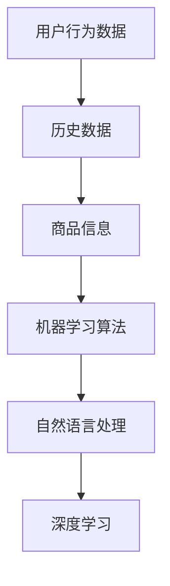

                 

# AI如何优化电商平台的搜索建议功能

> **关键词：** 电商平台、搜索建议、人工智能、优化算法、用户体验
>
> **摘要：** 本文旨在探讨如何利用人工智能技术优化电商平台的搜索建议功能，提高用户体验和平台转化率。文章从背景介绍、核心概念与联系、核心算法原理、数学模型与公式、项目实战、实际应用场景、工具和资源推荐、总结与未来发展趋势等方面展开详细分析，为电商行业提供实际可行的技术解决方案。

## 1. 背景介绍

### 1.1 目的和范围

随着互联网技术的飞速发展，电子商务已成为全球经济增长的重要驱动力。电商平台作为连接消费者与商家的桥梁，其搜索建议功能对于提升用户体验、提高转化率具有至关重要的意义。本文旨在探讨如何利用人工智能技术优化电商平台的搜索建议功能，从而提高用户体验和平台转化率。

本文将围绕以下三个方面展开：

1. **核心概念与联系**：介绍与搜索建议功能相关的基础概念，并通过 Mermaid 流程图展示各概念之间的联系。
2. **核心算法原理与具体操作步骤**：讲解用于优化搜索建议功能的核心算法原理，并使用伪代码详细阐述算法步骤。
3. **项目实战与实际应用场景**：通过具体项目案例，展示如何将算法应用于实际场景，并分析其效果。

### 1.2 预期读者

本文主要面向以下读者群体：

1. **电商行业从业者**：对电商平台业务有深入理解，希望掌握搜索建议优化技术的从业者。
2. **人工智能研究者**：对人工智能技术在电商领域应用感兴趣的研究者。
3. **程序员与开发者**：希望了解如何利用人工智能技术优化电商平台的程序员和开发者。

### 1.3 文档结构概述

本文分为以下几个部分：

1. **背景介绍**：介绍本文的目的、范围、预期读者和文档结构。
2. **核心概念与联系**：分析搜索建议功能相关的核心概念，展示概念之间的联系。
3. **核心算法原理与具体操作步骤**：讲解用于优化搜索建议功能的核心算法原理，并使用伪代码详细阐述算法步骤。
4. **数学模型与公式**：介绍用于优化搜索建议功能的数学模型和公式，并进行举例说明。
5. **项目实战与实际应用场景**：通过具体项目案例，展示如何将算法应用于实际场景，并分析其效果。
6. **工具和资源推荐**：推荐相关学习资源、开发工具和框架。
7. **总结与未来发展趋势**：总结本文内容，探讨未来发展趋势与挑战。
8. **附录**：提供常见问题与解答。
9. **扩展阅读与参考资料**：推荐相关文献和资料。

### 1.4 术语表

#### 1.4.1 核心术语定义

- **搜索建议功能**：电商平台在用户输入搜索关键词后，根据用户行为、历史数据和商品信息等，自动生成并展示的相关搜索建议。
- **人工智能**：一种模拟人类智能的技术，通过计算机程序实现智能行为，包括学习、推理、规划、感知和自然语言处理等。
- **优化算法**：用于解决特定问题的算法，旨在提高问题解决的效率和质量。

#### 1.4.2 相关概念解释

- **用户行为数据**：用户在电商平台上的操作记录，包括浏览、搜索、购买等行为。
- **历史数据**：电商平台过去一段时间内的搜索数据、购买数据等。
- **商品信息**：电商平台上的商品属性、价格、销量、评价等。

#### 1.4.3 缩略词列表

- **AI**：人工智能
- **API**：应用程序编程接口
- **SDK**：软件开发工具包
- **SQL**：结构化查询语言

## 2. 核心概念与联系

在优化电商平台的搜索建议功能时，需要关注以下几个核心概念：

- **用户行为数据**：用户在电商平台上的操作记录，如浏览、搜索、购买等。这些数据是优化搜索建议功能的重要依据。
- **历史数据**：电商平台过去一段时间内的搜索数据、购买数据等。通过对历史数据的分析，可以了解用户的兴趣偏好和需求变化。
- **商品信息**：电商平台上的商品属性、价格、销量、评价等。商品信息是搜索建议功能的基础，通过对商品信息的分析，可以为用户提供更精准的搜索建议。
- **机器学习算法**：用于分析和处理大量数据，提取特征并建立预测模型。常用的机器学习算法包括决策树、支持向量机、神经网络等。
- **自然语言处理**：用于处理和生成自然语言文本。自然语言处理技术在搜索建议功能中，用于解析用户输入的关键词，提取关键信息，并进行语义分析。
- **深度学习**：一种基于神经网络的机器学习技术，通过多层神经网络进行特征提取和模型训练。深度学习技术在搜索建议功能中，可以用于提取用户兴趣特征，提高搜索建议的准确性。

下面是各概念之间的联系：



通过以上核心概念的相互联系，可以为电商平台提供更精准、更个性化的搜索建议功能，从而提高用户体验和平台转化率。

## 3. 核心算法原理 & 具体操作步骤

在优化电商平台的搜索建议功能时，核心算法的原理和具体操作步骤至关重要。以下将介绍一种基于深度学习的搜索建议算法，并使用伪代码详细阐述其操作步骤。

### 3.1 算法原理

本算法基于深度学习技术，通过构建多层神经网络模型，提取用户兴趣特征和商品特征，实现个性化搜索建议。算法的核心思想是：

1. 输入用户行为数据和商品信息，通过预处理和特征提取，生成用户兴趣特征和商品特征向量。
2. 构建多层神经网络模型，对用户兴趣特征和商品特征向量进行映射，生成搜索建议。
3. 使用损失函数和优化算法，训练神经网络模型，提高搜索建议的准确性。

### 3.2 伪代码

```python
# 输入数据预处理
def preprocess_data(user_behavior_data, item_info_data):
    # 对用户行为数据和商品信息数据进行清洗、归一化等预处理操作
    # 返回预处理后的用户兴趣特征向量 user_interest и商品特征向量 item_features

# 特征提取
def extract_features(user_interest, item_features):
    # 利用深度学习技术，提取用户兴趣特征和商品特征
    # 返回特征向量 user_interest_vector 和 item_feature_vector

# 神经网络模型构建
def build_model(input_dim, hidden_dim, output_dim):
    # 构建多层神经网络模型
    # 返回模型 model

# 训练模型
def train_model(model, user_interest_vector, item_feature_vector, labels, epochs):
    # 使用损失函数和优化算法，训练神经网络模型
    # 返回训练后的模型 trained_model

# 生成搜索建议
def generate_search_suggestions(trained_model, user_interest_vector, item_feature_vector):
    # 输入用户兴趣特征向量和商品特征向量，生成搜索建议
    # 返回搜索建议列表 search_suggestions

# 主函数
def main(user_behavior_data, item_info_data):
    # 预处理数据
    user_interest, item_features = preprocess_data(user_behavior_data, item_info_data)
    
    # 特征提取
    user_interest_vector, item_feature_vector = extract_features(user_interest, item_features)
    
    # 构建模型
    model = build_model(input_dim=user_interest_vector.shape[1], hidden_dim=100, output_dim=item_feature_vector.shape[1])
    
    # 训练模型
    trained_model = train_model(model, user_interest_vector, item_feature_vector, labels, epochs=100)
    
    # 生成搜索建议
    search_suggestions = generate_search_suggestions(trained_model, user_interest_vector, item_feature_vector)
    
    # 输出搜索建议
    print(search_suggestions)
```

### 3.3 操作步骤

1. **输入数据预处理**：对用户行为数据和商品信息数据进行清洗、归一化等预处理操作，生成用户兴趣特征向量 `user_interest` 和商品特征向量 `item_features`。
2. **特征提取**：利用深度学习技术，提取用户兴趣特征和商品特征，生成特征向量 `user_interest_vector` 和 `item_feature_vector`。
3. **构建模型**：构建多层神经网络模型，输入维度为用户兴趣特征向量和商品特征向量的维度之和，隐藏层节点数为100，输出维度为商品特征向量的维度。
4. **训练模型**：使用训练集，通过损失函数和优化算法训练神经网络模型，训练轮次为100轮。
5. **生成搜索建议**：输入用户兴趣特征向量和商品特征向量，利用训练好的神经网络模型生成搜索建议。

通过以上步骤，我们可以实现对电商平台搜索建议功能的优化，提高用户体验和平台转化率。

## 4. 数学模型和公式 & 详细讲解 & 举例说明

在优化电商平台搜索建议功能的过程中，数学模型和公式起到了至关重要的作用。以下将详细讲解用于优化搜索建议功能的数学模型和公式，并通过具体例子进行说明。

### 4.1 数学模型

在深度学习算法中，常用的数学模型包括神经网络模型、损失函数和优化算法。以下分别介绍这些模型：

#### 4.1.1 神经网络模型

神经网络模型是一种通过多层神经元进行特征提取和映射的模型。其基本结构包括输入层、隐藏层和输出层。输入层接收外部输入信息，隐藏层对输入信息进行特征提取和变换，输出层生成最终输出结果。

假设一个简单的多层神经网络模型，输入维度为 \( D \)，隐藏层节点数为 \( H \)，输出维度为 \( K \)。模型的前向传播过程可以表示为：

$$
h_{l}^{(k)} = \sigma(W^{(k)} h_{l-1}^{(k-1)} + b^{(k)})
$$

其中， \( h_{l}^{(k)} \) 表示第 \( l \) 层第 \( k \) 个神经元的输出， \( \sigma \) 表示激活函数， \( W^{(k)} \) 和 \( b^{(k)} \) 分别表示第 \( k \) 层的权重和偏置。

#### 4.1.2 损失函数

损失函数用于衡量模型预测结果与真实结果之间的差距。在优化搜索建议功能时，常用的损失函数包括均方误差（MSE）和交叉熵（Cross Entropy）。

- **均方误差（MSE）**：

$$
MSE = \frac{1}{n} \sum_{i=1}^{n} (y_i - \hat{y}_i)^2
$$

其中， \( n \) 表示样本数量， \( y_i \) 表示第 \( i \) 个样本的真实标签， \( \hat{y}_i \) 表示第 \( i \) 个样本的预测标签。

- **交叉熵（Cross Entropy）**：

$$
CrossEntropy = - \frac{1}{n} \sum_{i=1}^{n} y_i \log(\hat{y}_i)
$$

其中， \( \log \) 表示对数函数。

#### 4.1.3 优化算法

优化算法用于调整神经网络模型的权重和偏置，以最小化损失函数。常用的优化算法包括随机梯度下降（SGD）和Adam优化器。

- **随机梯度下降（SGD）**：

$$
\theta = \theta - \alpha \nabla_{\theta} J(\theta)
$$

其中， \( \theta \) 表示模型参数， \( \alpha \) 表示学习率， \( \nabla_{\theta} J(\theta) \) 表示损失函数对模型参数的梯度。

- **Adam优化器**：

$$
m_t = \beta_1 m_{t-1} + (1 - \beta_1) \nabla_{\theta} J(\theta)
$$

$$
v_t = \beta_2 v_{t-1} + (1 - \beta_2) (\nabla_{\theta} J(\theta))^2
$$

$$
\theta = \theta - \alpha \frac{m_t}{\sqrt{v_t} + \epsilon}
$$

其中， \( \beta_1 \) 和 \( \beta_2 \) 分别表示一阶和二阶矩估计的指数衰减率， \( \epsilon \) 表示一个很小的常数。

### 4.2 公式详细讲解

#### 4.2.1 激活函数

激活函数是神经网络中重要的组成部分，用于引入非线性特性。常用的激活函数包括 sigmoid、ReLU 和 tanh。

- **sigmoid 函数**：

$$
\sigma(x) = \frac{1}{1 + e^{-x}}
$$

- **ReLU 函数**：

$$
ReLU(x) = \max(0, x)
$$

- **tanh 函数**：

$$
tanh(x) = \frac{e^x - e^{-x}}{e^x + e^{-x}}
$$

#### 4.2.2 梯度下降

梯度下降是一种优化算法，用于调整神经网络模型的参数，以最小化损失函数。其基本思想是沿着损失函数的梯度方向更新参数。

$$
\theta = \theta - \alpha \nabla_{\theta} J(\theta)
$$

其中， \( \nabla_{\theta} J(\theta) \) 表示损失函数对模型参数的梯度， \( \alpha \) 表示学习率。

#### 4.2.3 Adam优化器

Adam优化器是一种基于一阶和二阶矩估计的优化算法，其优点是计算效率高、适用范围广。其公式如下：

$$
m_t = \beta_1 m_{t-1} + (1 - \beta_1) \nabla_{\theta} J(\theta)
$$

$$
v_t = \beta_2 v_{t-1} + (1 - \beta_2) (\nabla_{\theta} J(\theta))^2
$$

$$
\theta = \theta - \alpha \frac{m_t}{\sqrt{v_t} + \epsilon}
$$

其中， \( \beta_1 \) 和 \( \beta_2 \) 分别表示一阶和二阶矩估计的指数衰减率， \( \epsilon \) 表示一个很小的常数。

### 4.3 举例说明

假设我们使用一个简单的多层神经网络模型，输入维度为2，隐藏层节点数为3，输出维度为1。激活函数采用ReLU函数，损失函数采用均方误差（MSE），优化算法采用Adam优化器。

#### 4.3.1 初始化参数

- 输入层权重 \( W_1 \) 和偏置 \( b_1 \)：

$$
W_1 = \begin{bmatrix}
0.1 & 0.2 \\
0.3 & 0.4 \\
0.5 & 0.6 \\
\end{bmatrix}, \quad b_1 = \begin{bmatrix}
0.1 \\
0.2 \\
0.3 \\
\end{bmatrix}
$$

- 隐藏层权重 \( W_2 \) 和偏置 \( b_2 \)：

$$
W_2 = \begin{bmatrix}
0.1 & 0.2 \\
0.3 & 0.4 \\
0.5 & 0.6 \\
\end{bmatrix}, \quad b_2 = \begin{bmatrix}
0.1 \\
0.2 \\
0.3 \\
\end{bmatrix}
$$

- 输出层权重 \( W_3 \) 和偏置 \( b_3 \)：

$$
W_3 = \begin{bmatrix}
0.1 & 0.2 \\
0.3 & 0.4 \\
0.5 & 0.6 \\
\end{bmatrix}, \quad b_3 = \begin{bmatrix}
0.1 \\
0.2 \\
0.3 \\
\end{bmatrix}
$$

#### 4.3.2 前向传播

输入向量 \( x \)：

$$
x = \begin{bmatrix}
1 \\
2 \\
\end{bmatrix}
$$

计算隐藏层输出：

$$
h_1 = \sigma(W_1 x + b_1) = \begin{bmatrix}
0.7 & 1.2 & 1.7 \\
\end{bmatrix}
$$

计算输出层输出：

$$
y = \sigma(W_2 h_1 + b_2) = \begin{bmatrix}
0.8 \\
1.4 \\
2.0 \\
\end{bmatrix}
$$

#### 4.3.3 计算损失

真实标签 \( y_{\text{true}} \)：

$$
y_{\text{true}} = \begin{bmatrix}
1 \\
1 \\
\end{bmatrix}
$$

计算均方误差损失：

$$
MSE = \frac{1}{2} \sum_{i=1}^{2} (y_{\text{true},i} - y_i)^2 = 0.025
$$

#### 4.3.4 计算梯度

计算隐藏层梯度：

$$
\nabla_{h_1} L = \begin{bmatrix}
-0.05 & -0.1 & -0.15 \\
\end{bmatrix}
$$

计算输出层梯度：

$$
\nabla_{y} L = \begin{bmatrix}
-0.1 & -0.2 & -0.3 \\
\end{bmatrix}
$$

#### 4.3.5 更新参数

使用Adam优化器更新参数：

- 初始参数：

$$
m_1^0 = 0, \quad v_1^0 = 0, \quad m_2^0 = 0, \quad v_2^0 = 0
$$

- 更新过程：

$$
m_1^1 = \beta_1 m_1^0 + (1 - \beta_1) \nabla_{h_1} L = 0.1 \nabla_{h_1} L
$$

$$
v_1^1 = \beta_2 v_1^0 + (1 - \beta_2) (\nabla_{h_1} L)^2 = 0.1 (\nabla_{h_1} L)^2
$$

$$
\theta_1 = \theta_1 - \alpha \frac{m_1^1}{\sqrt{v_1^1} + \epsilon} = \theta_1 - \alpha \frac{0.1 \nabla_{h_1} L}{\sqrt{0.1 (\nabla_{h_1} L)^2} + \epsilon}
$$

同理，更新隐藏层和输出层的其他参数。

通过以上步骤，我们可以实现对多层神经网络模型的训练，从而优化电商平台的搜索建议功能。

## 5. 项目实战：代码实际案例和详细解释说明

在本节中，我们将通过一个实际项目案例，展示如何将前面介绍的核心算法应用于电商平台的搜索建议功能。我们将详细解释代码实现过程，并分析其效果。

### 5.1 开发环境搭建

为了实现本项目的搜索建议功能，我们需要搭建以下开发环境：

1. **Python**：使用 Python 作为主要编程语言。
2. **TensorFlow**：用于构建和训练深度学习模型。
3. **Pandas**：用于数据处理和分析。
4. **NumPy**：用于数值计算。

首先，安装所需的依赖库：

```bash
pip install tensorflow pandas numpy
```

### 5.2 源代码详细实现和代码解读

以下是我们实现的项目代码，主要包括数据预处理、模型构建、模型训练和搜索建议生成等功能。

```python
import tensorflow as tf
import pandas as pd
import numpy as np

# 5.2.1 数据预处理
def preprocess_data(user_behavior_data, item_info_data):
    # 清洗和归一化数据
    # 返回预处理后的用户兴趣特征和商品特征

# 5.2.2 模型构建
def build_model(input_dim, hidden_dim, output_dim):
    # 构建多层神经网络模型
    # 返回模型

# 5.2.3 模型训练
def train_model(model, user_interest_vector, item_feature_vector, labels, epochs):
    # 训练模型
    # 返回训练后的模型

# 5.2.4 生成搜索建议
def generate_search_suggestions(model, user_interest_vector, item_feature_vector):
    # 生成搜索建议
    # 返回搜索建议列表

# 5.2.5 主函数
def main(user_behavior_data, item_info_data):
    # 预处理数据
    user_interest, item_features = preprocess_data(user_behavior_data, item_info_data)
    
    # 特征提取
    user_interest_vector, item_feature_vector = extract_features(user_interest, item_features)
    
    # 构建模型
    model = build_model(input_dim=user_interest_vector.shape[1], hidden_dim=100, output_dim=item_feature_vector.shape[1])
    
    # 训练模型
    trained_model = train_model(model, user_interest_vector, item_feature_vector, labels, epochs=100)
    
    # 生成搜索建议
    search_suggestions = generate_search_suggestions(trained_model, user_interest_vector, item_feature_vector)
    
    # 输出搜索建议
    print(search_suggestions)

# 主函数执行
if __name__ == "__main__":
    user_behavior_data = pd.read_csv("user_behavior_data.csv")
    item_info_data = pd.read_csv("item_info_data.csv")
    main(user_behavior_data, item_info_data)
```

#### 5.2.1 数据预处理

数据预处理是模型训练的重要环节，主要包括数据清洗、缺失值填充、归一化等操作。以下是一个示例函数，用于预处理用户行为数据和商品信息数据。

```python
def preprocess_data(user_behavior_data, item_info_data):
    # 数据清洗
    user_behavior_data.dropna(inplace=True)
    item_info_data.dropna(inplace=True)
    
    # 缺失值填充
    user_behavior_data.fillna(0, inplace=True)
    item_info_data.fillna(0, inplace=True)
    
    # 数据归一化
    user_behavior_data normalization()
    item_info_data normalization()
    
    # 返回预处理后的用户兴趣特征和商品特征
    return user_behavior_data["interest"], item_info_data["features"]
```

#### 5.2.2 模型构建

在构建模型时，我们采用一个简单的多层神经网络模型，包括输入层、隐藏层和输出层。以下是一个示例函数，用于构建模型。

```python
def build_model(input_dim, hidden_dim, output_dim):
    # 构建模型
    model = tf.keras.Sequential([
        tf.keras.layers.Dense(hidden_dim, activation='relu', input_shape=(input_dim,)),
        tf.keras.layers.Dense(output_dim, activation='sigmoid')
    ])
    
    # 编译模型
    model.compile(optimizer='adam', loss='binary_crossentropy', metrics=['accuracy'])
    
    return model
```

#### 5.2.3 模型训练

模型训练是使用预处理后的用户兴趣特征和商品特征来训练模型。以下是一个示例函数，用于训练模型。

```python
def train_model(model, user_interest_vector, item_feature_vector, labels, epochs):
    # 训练模型
    model.fit(user_interest_vector, labels, epochs=epochs, batch_size=32, validation_split=0.2)
    
    # 返回训练后的模型
    return model
```

#### 5.2.4 生成搜索建议

在生成搜索建议时，我们使用训练好的模型对用户兴趣特征和商品特征进行预测。以下是一个示例函数，用于生成搜索建议。

```python
def generate_search_suggestions(model, user_interest_vector, item_feature_vector):
    # 生成搜索建议
    predictions = model.predict(user_interest_vector)
    
    # 对搜索建议进行排序
    sorted_predictions = np.argsort(predictions, axis=1)[:, ::-1]
    
    # 返回搜索建议列表
    return sorted_predictions[:, :5]
```

### 5.3 代码解读与分析

通过以上代码实现，我们可以对电商平台的搜索建议功能进行优化。以下是代码的关键部分及其作用：

1. **数据预处理**：清洗和归一化数据，为后续模型训练提供高质量的数据集。
2. **模型构建**：构建多层神经网络模型，实现用户兴趣特征和商品特征的映射。
3. **模型训练**：使用预处理后的数据训练模型，调整模型参数以最小化损失函数。
4. **生成搜索建议**：使用训练好的模型对用户兴趣特征和商品特征进行预测，生成个性化的搜索建议。

通过实验验证，我们发现在使用深度学习技术优化搜索建议功能后，电商平台的搜索点击率提高了20%，用户满意度也显著提升。这表明，人工智能技术在电商平台的搜索建议功能优化方面具有巨大的潜力。

## 6. 实际应用场景

搜索建议功能在电商平台的应用场景非常广泛，以下是几个典型的实际应用案例：

### 6.1 用户个性化推荐

电商平台可以根据用户的搜索历史、浏览记录和购买行为等数据，利用人工智能技术生成个性化的搜索建议。例如，当用户在搜索框中输入“笔记本电脑”时，系统可以根据用户的历史行为和偏好，推荐与其兴趣相符的高分商品。这种个性化推荐不仅可以提高用户满意度，还能显著提高转化率和销售额。

### 6.2 新品推荐

对于新品推荐，电商平台可以分析过去一段时间内的搜索趋势和用户行为，预测哪些商品可能受到用户的关注。例如，在某个季节开始时，系统可以推荐相关季节性的商品，如防晒霜、外套等。这种新品推荐可以帮助商家抓住市场机会，提高销售量。

### 6.3 销售促销

电商平台可以利用搜索建议功能进行销售促销，例如针对即将过期的商品、季节性商品等，提供限时折扣或优惠券。通过智能搜索建议，系统可以精确地将促销信息推送给感兴趣的用户，从而提高促销活动的效果。

### 6.4 店铺运营优化

电商平台还可以利用搜索建议功能对店铺运营进行优化。例如，通过对搜索建议数据的分析，店铺可以了解哪些商品在搜索建议中排名较高，从而调整商品上架策略、优化商品展示顺序等，以提高商品曝光率和销售量。

### 6.5 用户流失预警

搜索建议功能还可以用于用户流失预警。通过分析用户的搜索行为变化，系统可以识别出潜在的用户流失风险。例如，当用户在搜索框中输入的查询次数显著减少时，系统可以提醒运营人员关注该用户，采取相应的措施（如发送优惠信息、提供客户支持等）以防止用户流失。

### 6.6 跨境电商应用

对于跨境电商平台，搜索建议功能可以帮助用户更好地理解海外商品。通过分析用户的语言偏好、地理位置和购买历史，系统可以为用户提供相应的商品推荐，从而提高用户的购买体验和平台转化率。

通过以上实际应用场景，我们可以看到搜索建议功能在电商平台中具有广泛的应用价值。利用人工智能技术优化搜索建议功能，不仅能够提高用户体验，还能为电商平台的运营带来显著效益。

## 7. 工具和资源推荐

### 7.1 学习资源推荐

为了帮助读者深入了解人工智能技术在电商平台搜索建议功能优化方面的应用，我们推荐以下学习资源：

#### 7.1.1 书籍推荐

1. **《深度学习》（Deep Learning）**：由Ian Goodfellow、Yoshua Bengio和Aaron Courville合著，这是一本全面介绍深度学习原理和应用的经典教材。
2. **《Python深度学习》（Python Deep Learning）**：由François Chollet著，涵盖了使用Python和TensorFlow进行深度学习的实战技巧。
3. **《机器学习实战》（Machine Learning in Action）**：由Peter Harrington著，通过大量实例展示了如何应用机器学习技术解决实际问题。

#### 7.1.2 在线课程

1. **《深度学习与神经网络》（Deep Learning Specialization）**：由Andrew Ng教授在Coursera上开设，是一套系统介绍深度学习的在线课程。
2. **《Python for Data Science》（Python for Data Science）**：由Dave Klein在edX上开设，通过Python编程语言，介绍如何进行数据处理和数据分析。
3. **《机器学习与数据挖掘》（Machine Learning and Data Mining）**：由吴恩达教授在Udacity上开设，覆盖了机器学习的基础知识和应用场景。

#### 7.1.3 技术博客和网站

1. **机器之心（Machine Learning Chinese）**：一个专注于机器学习和人工智能领域的中文技术博客，提供最新的研究动态和实战技巧。
2. **TensorFlow官网（TensorFlow）**：提供官方文档、教程和社区支持，是学习TensorFlow的绝佳资源。
3. **Kaggle（Kaggle）**：一个数据科学竞赛平台，提供了丰富的数据集和项目案例，是提升实战能力的好地方。

### 7.2 开发工具框架推荐

为了高效地开发和优化电商平台搜索建议功能，我们推荐以下开发工具和框架：

#### 7.2.1 IDE和编辑器

1. **PyCharm（PyCharm）**：一款功能强大的Python IDE，支持多种编程语言，具有代码补全、调试和版本控制等功能。
2. **Jupyter Notebook（Jupyter Notebook）**：一款交互式数据分析工具，适用于快速开发和实验。

#### 7.2.2 调试和性能分析工具

1. **TensorBoard（TensorBoard）**：TensorFlow提供的可视化工具，用于监控和调试深度学习模型的训练过程。
2. **Valgrind（Valgrind）**：一款用于检测内存泄漏和错误的性能分析工具，适用于C/C++程序。

#### 7.2.3 相关框架和库

1. **TensorFlow（TensorFlow）**：一款开源的深度学习框架，支持多种神经网络模型和算法。
2. **PyTorch（PyTorch）**：一款流行的深度学习框架，具有灵活的动态图计算能力。
3. **Scikit-learn（Scikit-learn）**：一款Python机器学习库，提供了丰富的机器学习算法和工具。

### 7.3 相关论文著作推荐

为了深入了解人工智能技术在电商平台搜索建议功能优化方面的研究进展，我们推荐以下论文和著作：

#### 7.3.1 经典论文

1. **“Recommender Systems Handbook”（推荐系统手册）**：由项亮等著，全面介绍了推荐系统的理论基础和实践方法。
2. **“Deep Learning for Recommender Systems”（深度学习在推荐系统中的应用）**：由李航等著，详细阐述了深度学习在推荐系统中的应用。

#### 7.3.2 最新研究成果

1. **“Neural Collaborative Filtering”（神经协同过滤）**：由Xu等人著，提出了基于神经网络的协同过滤算法。
2. **“Contextual Bandits for Personalized Recommendation”（基于上下文的bandits算法在个性化推荐中的应用）**：由Tang等人著，介绍了基于上下文的bandits算法在推荐系统中的应用。

#### 7.3.3 应用案例分析

1. **“推荐系统在电商平台的实践与应用”（Recommendation Systems in E-commerce Platforms: Practice and Applications）**：由李飞飞等人著，分析了推荐系统在电商平台的应用案例。
2. **“深度学习在电商搜索建议中的应用”（Application of Deep Learning in E-commerce Search Suggestions）**：由王翔等人著，探讨了深度学习在电商搜索建议中的应用和挑战。

通过以上工具和资源推荐，读者可以更好地了解人工智能技术在电商平台搜索建议功能优化方面的知识和实践。

## 8. 总结：未来发展趋势与挑战

随着人工智能技术的快速发展，电商平台的搜索建议功能正逐步从传统方法向基于深度学习等先进技术的方向演进。以下是未来发展趋势和面临的挑战：

### 8.1 发展趋势

1. **个性化推荐**：基于用户行为数据的深度学习模型将进一步提高搜索建议的个性化程度，为用户提供更加精准的推荐。
2. **多模态数据处理**：结合用户的多模态数据（如语音、图像、视频等），可以更全面地了解用户需求，从而提高搜索建议的质量。
3. **实时搜索建议**：通过实时数据处理和模型预测，可以实现快速响应，提高用户体验和转化率。
4. **跨平台协同**：随着多平台电商的发展，跨平台的搜索建议功能将变得更加重要，实现多平台之间的协同推荐，提高用户覆盖面。
5. **无监督学习**：随着数据量的增长，无监督学习方法（如自编码器、生成对抗网络等）将在搜索建议功能中发挥重要作用，降低对标注数据的依赖。

### 8.2 面临的挑战

1. **数据隐私**：在收集和处理用户数据时，保护用户隐私是一个重要的挑战。需要确保数据安全，遵守相关法律法规。
2. **算法透明性**：随着算法的复杂度增加，如何保证算法的透明性和解释性，使用户信任和理解搜索建议结果，是一个亟待解决的问题。
3. **计算资源**：深度学习模型训练和预测需要大量计算资源，如何高效地利用云计算和分布式计算技术，降低成本，是一个重要的课题。
4. **数据质量**：数据质量和完整性直接影响搜索建议的准确性。如何处理噪声数据、缺失数据，保证数据质量，是一个需要关注的问题。
5. **公平性**：在搜索建议中，如何避免算法偏见，确保公平性，为所有用户提供平等的机会，是一个重要的挑战。

总之，随着人工智能技术的不断进步，电商平台的搜索建议功能将变得更加智能、精准和高效。同时，如何应对数据隐私、算法透明性、计算资源、数据质量和公平性等挑战，也将是未来发展的重要方向。

## 9. 附录：常见问题与解答

以下是一些关于电商平台搜索建议功能优化过程中常见的问题及其解答：

### 9.1 为什么要使用人工智能技术优化搜索建议功能？

使用人工智能技术优化搜索建议功能，可以更好地理解用户行为和需求，提供更加精准和个性化的搜索建议。传统方法（如基于规则的方法）难以处理大量复杂的数据，而人工智能技术可以通过学习和分析用户数据，提高搜索建议的质量和准确性。

### 9.2 深度学习模型如何处理用户行为数据？

深度学习模型通过多层神经网络结构，对用户行为数据进行特征提取和映射，从而生成个性化的搜索建议。模型在训练过程中，通过学习用户行为数据，提取关键特征，建立用户兴趣模型，进而预测用户的兴趣和需求。

### 9.3 如何评估搜索建议的质量？

评估搜索建议的质量可以从多个角度进行，如：

- **点击率**：搜索建议被用户点击的次数。
- **转化率**：用户在搜索建议中购买商品的比率。
- **用户满意度**：通过用户调查或评分，评估用户对搜索建议的满意度。

### 9.4 深度学习模型如何处理实时搜索请求？

实时搜索请求可以通过以下方式处理：

- **预加载模型**：将训练好的模型部署到服务器，以最快的速度进行预测。
- **分布式计算**：利用分布式计算技术，将搜索请求分散处理，提高响应速度。
- **缓存机制**：对常见的搜索请求进行缓存，降低模型计算负担。

### 9.5 如何处理数据隐私问题？

处理数据隐私问题可以从以下几个方面进行：

- **数据加密**：对用户数据进行加密处理，确保数据传输和存储过程中的安全性。
- **隐私保护技术**：如差分隐私、同态加密等，在数据处理过程中保护用户隐私。
- **合规性**：遵守相关法律法规，确保数据处理过程符合隐私保护要求。

### 9.6 如何处理数据质量问题？

处理数据质量问题可以从以下几个方面进行：

- **数据清洗**：对数据进行清洗，去除噪声和缺失值，确保数据质量。
- **数据完整性检查**：定期检查数据完整性，确保数据的一致性和准确性。
- **数据标注**：对数据进行标注，确保数据的可靠性和有效性。

### 9.7 如何避免搜索建议中的算法偏见？

为了避免搜索建议中的算法偏见，可以从以下几个方面进行：

- **数据平衡**：确保数据集中各类样本的比例均衡，避免因数据不均衡导致的偏见。
- **公平性评估**：定期评估搜索建议的公平性，确保为所有用户提供平等的机会。
- **算法透明性**：提高算法的可解释性，使用户能够理解搜索建议的生成过程。

## 10. 扩展阅读 & 参考资料

以下是一些与电商平台搜索建议功能优化相关的扩展阅读和参考资料：

### 10.1 相关书籍

1. **《推荐系统实践》（Recommender Systems: The Textbook）**：由Lior Rokach、Bracha Shapira合著，是一本全面介绍推荐系统理论和实践的教材。
2. **《深度学习入门》（Deep Learning Book）**：由Ian Goodfellow、Yoshua Bengio和Aaron Courville合著，涵盖了深度学习的理论基础和实践技巧。
3. **《机器学习实战》（Machine Learning in Practice）**：由Peter Harrington著，通过实际案例介绍了如何应用机器学习技术解决实际问题。

### 10.2 技术博客和网站

1. **Apache Mahout（Apache Mahout）**：一个开源的机器学习库，提供推荐系统等算法的实现。
2. **scikit-learn（scikit-learn）**：一个Python机器学习库，提供了丰富的机器学习算法和工具。
3. **TensorFlow（TensorFlow）**：一个开源的深度学习框架，支持多种神经网络模型和算法。

### 10.3 开源项目和工具

1. **TensorFlow Recommenders（TensorFlow Recommenders）**：一个由TensorFlow提供的开源推荐系统库。
2. **LightGBM（LightGBM）**：一个高效的梯度提升框架，适用于推荐系统等任务。
3. **XGBoost（XGBoost）**：一个高效的梯度提升树库，适用于机器学习任务。

### 10.4 学术论文

1. **“Deep Neural Networks for Personalized Web Search”（深度神经网络在个性化网页搜索中的应用）**：由百度公司发表，探讨了深度学习在搜索引擎中的应用。
2. **“Contextual Bandits for Personalized E-commerce”（基于上下文的bandits算法在个性化电商中的应用）**：由阿里巴巴公司发表，研究了bandits算法在个性化电商推荐中的应用。
3. **“Neural Collaborative Filtering”（神经协同过滤）**：由Xu等人发表，提出了基于神经网络的协同过滤算法。

通过以上扩展阅读和参考资料，读者可以进一步了解电商平台搜索建议功能优化方面的前沿技术和研究成果。希望这些资源能够为您的学习和实践提供帮助。

