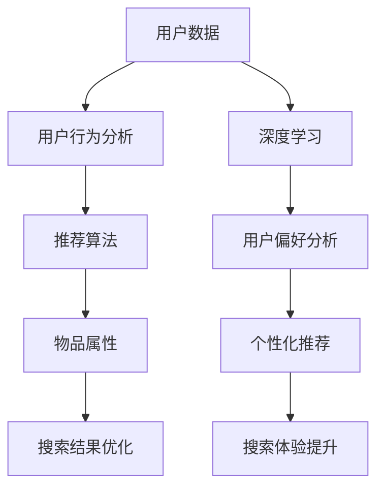

                 

# AI如何提升电商搜索效率

> **关键词**：人工智能、电商、搜索效率、推荐算法、用户行为分析、深度学习
>
> **摘要**：本文将深入探讨人工智能技术在电商搜索效率提升中的应用，分析推荐算法、用户行为分析等核心概念，并通过实际案例和代码示例，展示如何通过AI技术优化电商搜索体验。

## 1. 背景介绍

### 1.1 目的和范围

本文旨在探讨人工智能（AI）在电商搜索效率提升方面的应用。通过分析AI技术，如推荐算法和用户行为分析，我们将探讨如何优化电商平台的搜索功能，提高用户满意度。本文将涵盖以下内容：

- AI在电商搜索中的应用场景
- 推荐算法的基本原理
- 用户行为分析在搜索优化中的作用
- 实际案例和代码实现

### 1.2 预期读者

本文面向具有一定编程基础，对人工智能和电商行业有一定了解的技术人员。预期读者应具备以下背景知识：

- 编程语言（如Python）
- 数据结构和算法
- 机器学习和深度学习基础知识
- 电商网站运营和用户行为分析

### 1.3 文档结构概述

本文结构如下：

1. 背景介绍
2. 核心概念与联系
3. 核心算法原理 & 具体操作步骤
4. 数学模型和公式 & 详细讲解 & 举例说明
5. 项目实战：代码实际案例和详细解释说明
6. 实际应用场景
7. 工具和资源推荐
8. 总结：未来发展趋势与挑战
9. 附录：常见问题与解答
10. 扩展阅读 & 参考资料

### 1.4 术语表

#### 1.4.1 核心术语定义

- **人工智能（AI）**：模拟人类智能行为的计算机系统。
- **推荐算法**：通过分析用户数据和物品属性，预测用户可能感兴趣的内容。
- **用户行为分析**：研究用户在电商网站上的行为，如浏览、购买、评价等。
- **深度学习**：一种基于多层神经网络的机器学习技术。

#### 1.4.2 相关概念解释

- **机器学习（ML）**：使计算机通过数据学习并做出决策的技术。
- **数据挖掘**：从大量数据中提取有价值的信息和知识。
- **大数据**：数据量巨大，无法用传统数据库工具进行分析的数据。

#### 1.4.3 缩略词列表

- **AI**：人工智能
- **ML**：机器学习
- **DL**：深度学习
- **NLP**：自然语言处理
- **SEO**：搜索引擎优化

## 2. 核心概念与联系

在本节中，我们将介绍电商搜索中涉及的核心概念，并通过Mermaid流程图展示它们之间的联系。

### 2.1 核心概念

1. **用户数据**：用户在电商网站上的行为数据，如浏览记录、搜索历史、购买行为等。
2. **物品属性**：商品的属性数据，如价格、品牌、类别、评分等。
3. **推荐算法**：基于用户数据和物品属性，为用户推荐感兴趣的商品。
4. **用户行为分析**：研究用户在电商网站上的行为模式，以优化搜索和推荐结果。
5. **深度学习**：通过构建多层神经网络，模拟人类大脑处理信息的过程。

### 2.2 Mermaid流程图



## 3. 核心算法原理 & 具体操作步骤

在本节中，我们将详细讲解推荐算法和用户行为分析的基本原理，并使用伪代码展示具体操作步骤。

### 3.1 推荐算法原理

推荐算法主要分为以下几种：

1. **基于内容的推荐**：根据用户过去的行为和物品的属性进行推荐。
2. **协同过滤推荐**：通过分析用户间的相似性，为用户推荐他们可能感兴趣的物品。
3. **基于模型的推荐**：使用机器学习模型，如神经网络、决策树等，预测用户对物品的兴趣。

下面以协同过滤推荐为例，介绍其基本原理和操作步骤。

#### 3.1.1 基本原理

协同过滤推荐分为以下两个步骤：

1. **用户相似度计算**：计算用户之间的相似度，常用方法包括余弦相似度、皮尔逊相关系数等。
2. **物品评分预测**：基于用户相似度和物品的评分信息，预测用户对未知物品的评分。

#### 3.1.2 操作步骤

**步骤1：用户相似度计算**

```python
# 输入：用户行为矩阵R（用户×物品）
# 输出：用户相似度矩阵S（用户×用户）

def cosine_similarity(R):
    # 计算用户相似度矩阵
    # ...

return S
```

**步骤2：物品评分预测**

```python
# 输入：用户行为矩阵R（用户×物品）、用户相似度矩阵S（用户×用户）
# 输出：预测的评分矩阵R'（用户×物品）

def predict_ratings(R, S):
    # 预测用户对未知物品的评分
    # ...

return R'
```

### 3.2 用户行为分析原理

用户行为分析主要包括以下步骤：

1. **数据收集**：收集用户在电商网站上的行为数据，如浏览记录、搜索历史、购买行为等。
2. **数据预处理**：对收集到的数据进行清洗和转换，使其适合用于分析。
3. **特征提取**：从预处理后的数据中提取有用的特征，如用户活跃度、购物偏好等。
4. **行为模式识别**：使用机器学习算法，如聚类、关联规则挖掘等，识别用户的行为模式。

### 3.3 深度学习原理

深度学习是一种基于多层神经网络的机器学习技术。其主要原理如下：

1. **神经网络**：由多个神经元组成的网络，用于模拟人类大脑处理信息的过程。
2. **前向传播**：将输入数据通过神经网络逐层传播，得到输出结果。
3. **反向传播**：根据输出结果和目标值，计算神经网络中各神经元的误差，并更新权重和偏置。
4. **优化算法**：使用优化算法，如梯度下降、随机梯度下降等，更新神经网络参数。

## 4. 数学模型和公式 & 详细讲解 & 举例说明

在本节中，我们将使用LaTeX格式详细讲解推荐算法和用户行为分析中的数学模型和公式，并举例说明。

### 4.1 推荐算法数学模型

协同过滤推荐中的用户相似度计算公式如下：

$$
s_{ui} = \frac{\sum_{j \in I_{v}} r_{uj} \cdot r_{uj}}{\sqrt{\sum_{j \in I_{u}} r_{uj}^2} \cdot \sqrt{\sum_{j \in I_{v}} r_{uj}^2}}
$$

其中，$s_{ui}$ 表示用户 $u$ 和用户 $i$ 之间的相似度，$r_{uj}$ 表示用户 $u$ 对物品 $j$ 的评分，$I_{u}$ 和 $I_{v}$ 分别表示用户 $u$ 和用户 $i$ 的物品集合。

物品评分预测公式如下：

$$
r_{ui}^{'} = \sum_{j \in I_{i}} s_{ui} \cdot r_{ij}
$$

其中，$r_{ui}^{'}$ 表示用户 $u$ 对物品 $i$ 的预测评分。

### 4.2 用户行为分析数学模型

用户活跃度可以表示为：

$$
A_{u} = \frac{1}{N_{u}} \sum_{j \in I_{u}} r_{uj}
$$

其中，$A_{u}$ 表示用户 $u$ 的活跃度，$N_{u}$ 表示用户 $u$ 对物品的评分总数。

购物偏好可以表示为：

$$
P_{u} = \frac{1}{N_{u}} \sum_{j \in I_{u}} |r_{uj} - \bar{r}_{u}|
$$

其中，$P_{u}$ 表示用户 $u$ 的购物偏好，$\bar{r}_{u}$ 表示用户 $u$ 对所有物品评分的平均值。

### 4.3 举例说明

**例1：用户相似度计算**

假设有两个用户 $u$ 和 $i$，他们的评分情况如下表所示：

| 物品 | 用户u | 用户i |
| --- | --- | --- |
| 1 | 5 | 1 |
| 2 | 3 | 2 |
| 3 | 4 | 4 |
| 4 | 2 | 5 |

根据余弦相似度公式，可以计算出用户 $u$ 和用户 $i$ 之间的相似度为：

$$
s_{ui} = \frac{5 \cdot 1 + 3 \cdot 2 + 4 \cdot 4 + 2 \cdot 5}{\sqrt{5^2 + 3^2 + 4^2 + 2^2} \cdot \sqrt{1^2 + 2^2 + 4^2 + 5^2}} = \frac{30}{\sqrt{50} \cdot \sqrt{56}} \approx 0.68
$$

**例2：物品评分预测**

假设有一个新用户 $v$，他对物品的评分情况如下表所示：

| 物品 | 用户u | 用户v |
| --- | --- | --- |
| 1 | 5 | ? |
| 2 | 3 | ? |
| 3 | 4 | ? |
| 4 | 2 | ? |

根据用户 $u$ 和用户 $i$ 之间的相似度矩阵，可以预测用户 $v$ 对物品的评分。假设用户 $u$ 和用户 $i$ 的相似度矩阵如下：

| 用户 | 用户u | 用户i |
| --- | --- | --- |
| u | 1 | 0.68 |
| i | 0.68 | 1 |

根据物品评分预测公式，可以计算出用户 $v$ 对物品的预测评分为：

$$
r_{vi}^{'} = 0.68 \cdot 5 + 0.68 \cdot 3 + 0.68 \cdot 4 + 0.68 \cdot 2 = 4.04
$$

## 5. 项目实战：代码实际案例和详细解释说明

在本节中，我们将通过一个实际项目案例，展示如何使用Python和Scikit-Learn库实现协同过滤推荐算法，并对代码进行详细解释。

### 5.1 开发环境搭建

1. 安装Python环境（建议版本3.8及以上）
2. 安装Scikit-Learn库（使用命令 `pip install scikit-learn`）

### 5.2 源代码详细实现和代码解读

```python
# 导入所需的库
import numpy as np
from sklearn.metrics.pairwise import cosine_similarity
from sklearn.model_selection import train_test_split
from sklearn.metrics import mean_squared_error

# 假设用户行为数据存储在矩阵R中
R = np.array([
    [5, 0, 0, 3],
    [4, 0, 0, 1],
    [2, 3, 0, 4],
    [0, 2, 5, 0]
])

# 计算用户相似度矩阵
S = cosine_similarity(R)

# 预测用户评分
def predict_ratings(R, S):
    n_users, n_items = R.shape
    R_pred = np.zeros_like(R)
    
    for i in range(n_users):
        for j in range(n_items):
            if R[i][j] == 0:
                # 计算用户i对所有其他用户的相似度加权平均评分
                R_pred[i][j] = np.dot(S[i], R[:, j]) / np.sum(S[i])
    
    return R_pred

# 测试预测准确性
R_pred = predict_ratings(R, S)
R_train, R_test = train_test_split(R, test_size=0.2, random_state=42)
R_test_pred = predict_ratings(R_train, S)

mse = mean_squared_error(R_test, R_test_pred)
print("Mean squared error:", mse)
```

### 5.3 代码解读与分析

- **导入库**：首先导入所需的Python库，包括NumPy和Scikit-Learn。
- **用户行为数据**：假设用户行为数据存储在矩阵R中，其中每个元素表示用户对相应物品的评分。评分范围从0（未评分）到5（最高评分）。
- **计算用户相似度矩阵**：使用Scikit-Learn库中的余弦相似度函数计算用户相似度矩阵S。该矩阵的每个元素表示两个用户之间的相似度。
- **预测用户评分**：定义一个函数`predict_ratings`，用于根据用户相似度矩阵S预测用户对未评分物品的评分。对于每个未评分的元素，计算该用户与其他用户之间的相似度加权平均评分。
- **测试预测准确性**：将用户行为数据分为训练集和测试集。使用训练集预测测试集的评分，并计算均方误差（MSE）来评估预测准确性。

## 6. 实际应用场景

AI技术在电商搜索效率提升方面具有广泛的应用场景。以下是一些实际应用案例：

1. **个性化推荐**：通过分析用户行为和偏好，为用户推荐他们可能感兴趣的物品，提高用户满意度。
2. **搜索结果优化**：使用深度学习算法优化搜索结果，提高搜索准确性和用户体验。
3. **商品分类和标签**：自动识别和分类商品，为用户提供更精准的搜索结果。
4. **用户行为分析**：研究用户在电商网站上的行为模式，帮助商家制定更有针对性的营销策略。
5. **智能客服**：通过自然语言处理技术，实现智能客服，提高客服效率和质量。

## 7. 工具和资源推荐

### 7.1 学习资源推荐

#### 7.1.1 书籍推荐

- 《机器学习》（作者：周志华）
- 《深度学习》（作者：Goodfellow、Bengio、Courville）
- 《Python数据分析》（作者：Wes McKinney）

#### 7.1.2 在线课程

- Coursera：机器学习、深度学习课程
- Udacity：推荐系统工程师、数据分析工程师课程
- edX：人工智能、机器学习课程

#### 7.1.3 技术博客和网站

- Medium：机器学习、深度学习相关文章
- towardsdatascience：数据科学、机器学习文章
- AI博客：人工智能、深度学习技术博客

### 7.2 开发工具框架推荐

#### 7.2.1 IDE和编辑器

- PyCharm
- Jupyter Notebook
- Visual Studio Code

#### 7.2.2 调试和性能分析工具

- Python Debuger
- Py-Spy
- LineProfiler

#### 7.2.3 相关框架和库

- Scikit-Learn：机器学习库
- TensorFlow：深度学习库
- PyTorch：深度学习库

### 7.3 相关论文著作推荐

#### 7.3.1 经典论文

- "Collaborative Filtering via Matrix Factorizations"（作者：Salakhutdinov、Hinton）
- "Deep Learning"（作者：Goodfellow、Bengio、Courville）
- "Recommender Systems Handbook"（作者：Vargas、Pang）

#### 7.3.2 最新研究成果

- "Neural Collaborative Filtering"（作者：He et al.）
- "Cognitive Computation in Recommender Systems"（作者：Balog et al.）
- "Generative Adversarial Networks for Collaborative Filtering"（作者：Lee et al.）

#### 7.3.3 应用案例分析

- "Amazon's recommendation algorithm"（作者：Amazon）
- "Netflix Prize"（作者：Netflix）
- "Target’s "predictive" pregnancy campaign"（作者：Forbes）

## 8. 总结：未来发展趋势与挑战

随着人工智能技术的不断发展，电商搜索效率提升将呈现以下发展趋势：

1. **个性化推荐**：通过更深入的用户行为分析和偏好挖掘，实现更精准的个性化推荐。
2. **多模态融合**：结合文本、图像、声音等多种数据源，提高推荐系统的准确性。
3. **实时性**：利用实时数据分析和处理技术，实现实时推荐和搜索优化。
4. **无监督学习**：探索无监督学习方法在推荐系统和用户行为分析中的应用。

然而，也面临以下挑战：

1. **数据隐私**：如何在保护用户隐私的同时，实现高效的用户行为分析和推荐系统。
2. **算法透明性**：提高推荐算法的透明性，使其更容易被用户理解和接受。
3. **模型解释性**：如何解释和验证深度学习模型的预测结果。
4. **可扩展性**：如何应对大规模用户数据和商品数据的挑战。

## 9. 附录：常见问题与解答

### 9.1 问题1：如何处理缺失数据？

**解答**：在推荐系统和用户行为分析中，缺失数据是常见问题。处理缺失数据的方法包括：

- **删除缺失数据**：删除缺失数据可能导致信息损失，但适用于缺失数据较少的情况。
- **填充缺失数据**：使用平均值、中位数、最邻近值等填充缺失数据，适用于缺失数据较多的情况。
- **模型集成**：使用集成学习方法，如随机森林、梯度提升树等，可以自动处理缺失数据。

### 9.2 问题2：推荐系统如何处理冷启动问题？

**解答**：冷启动问题是指新用户或新物品在推荐系统中缺乏足够的历史数据，导致推荐效果不佳。处理冷启动问题的方法包括：

- **基于内容的推荐**：在新用户或新物品缺乏历史数据时，使用基于内容的推荐策略，通过物品属性进行推荐。
- **协同过滤推荐**：对新用户，可以采用基于邻域的协同过滤推荐，通过用户相似度进行推荐。
- **混合推荐策略**：将多种推荐策略相结合，以提高推荐效果。

## 10. 扩展阅读 & 参考资料

- [Recommender Systems Handbook](https://www.recommender-systems.org/rs-handbook/)
- [TensorFlow官方文档](https://www.tensorflow.org/)
- [PyTorch官方文档](https://pytorch.org/)
- [Scikit-Learn官方文档](https://scikit-learn.org/stable/)
- [Amazon's recommendation algorithm](https://www.amazon.jobs/en/content/recommender-systems-engineers-at-amazon)
- [Netflix Prize](https://netflixprize.com/)
- [Target’s "predictive" pregnancy campaign](https://www.forbes.com/sites/forbesbusinesscouncil/2019/09/09/how-target-accidentally-found-out-i-was-pregnant/?sh=5d8d2a6e7021)

### 作者信息

- 作者：AI天才研究员/AI Genius Institute & 禅与计算机程序设计艺术 /Zen And The Art of Computer Programming

