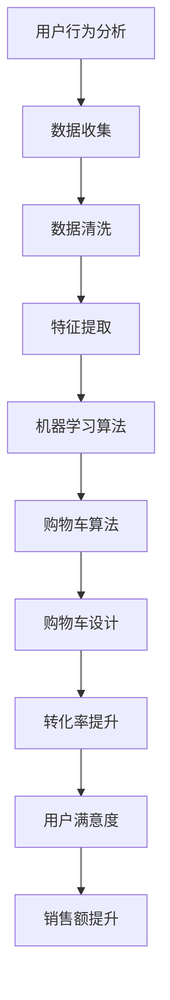
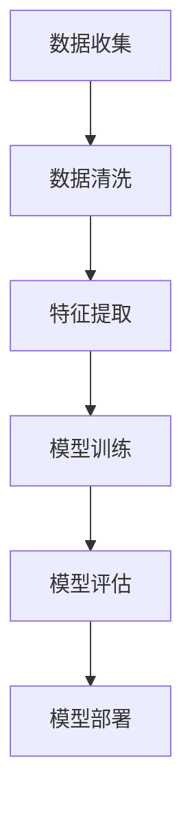
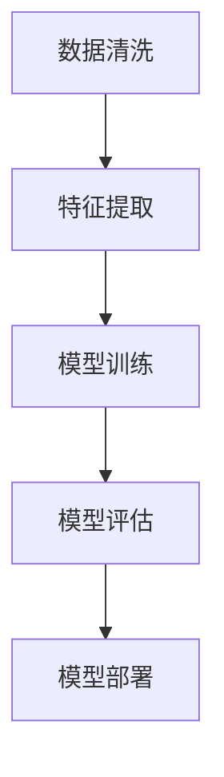
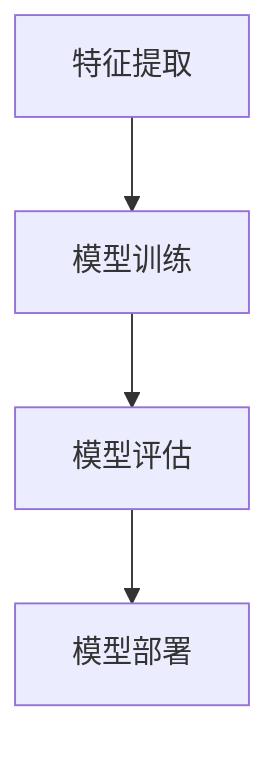
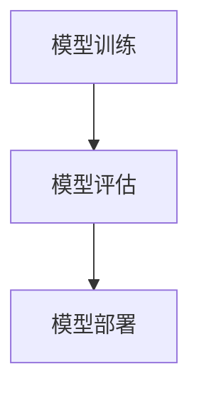
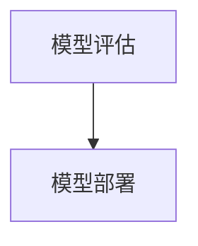

                 

# AI如何改善电商平台的购物车挽回策略

> **关键词：** 购物车挽回策略、用户行为分析、机器学习、电商优化、购物车算法

> **摘要：** 本文将探讨如何利用人工智能技术，特别是机器学习算法，改善电商平台购物车的挽回策略。通过分析用户行为，预测用户购物意图，优化购物车设计，从而提高购物车转化率和用户满意度。

## 1. 背景介绍

### 1.1 目的和范围

本文旨在通过介绍和分析人工智能在电商平台购物车挽回策略中的应用，探讨如何利用机器学习算法提升购物车的转化率，从而提高电商平台的销售额和用户满意度。我们将从用户行为分析、机器学习算法应用、购物车算法优化等多个角度进行详细讨论。

### 1.2 预期读者

本文适合对电商平台运营、用户行为分析、机器学习算法有一定了解的读者。同时，对于希望了解人工智能在电商领域应用的技术人员和管理者，也具有一定的参考价值。

### 1.3 文档结构概述

本文分为十个部分：

1. 背景介绍：介绍文章的目的、范围、预期读者和文档结构。
2. 核心概念与联系：介绍与购物车挽回策略相关的主要概念和联系。
3. 核心算法原理 & 具体操作步骤：详细阐述购物车挽回策略的算法原理和操作步骤。
4. 数学模型和公式 & 详细讲解 & 举例说明：介绍与购物车挽回策略相关的数学模型和公式，并进行详细讲解和举例说明。
5. 项目实战：通过代码实际案例，展示如何实现购物车挽回策略。
6. 实际应用场景：讨论购物车挽回策略在电商平台的实际应用场景。
7. 工具和资源推荐：推荐与购物车挽回策略相关的学习资源和开发工具。
8. 总结：对未来发展趋势与挑战进行总结。
9. 附录：常见问题与解答。
10. 扩展阅读 & 参考资料：提供与购物车挽回策略相关的扩展阅读和参考资料。

### 1.4 术语表

#### 1.4.1 核心术语定义

- **购物车挽回策略**：指通过分析用户行为和购物车数据，采取一系列措施以提高购物车转化率的策略。
- **用户行为分析**：指对用户在电商平台上的浏览、搜索、点击、购买等行为进行分析，以了解用户需求和偏好。
- **机器学习算法**：指利用大量数据训练模型，从而实现自动预测和决策的算法。
- **购物车算法**：指用于管理购物车的算法，包括购物车设计、购物车推荐、购物车转化等。

#### 1.4.2 相关概念解释

- **用户行为数据**：指用户在电商平台上的浏览、搜索、点击、购买等行为所产生的数据。
- **转化率**：指用户完成购物流程的比例。
- **A/B测试**：指将用户分成两组，一组采用新策略，另一组采用旧策略，比较两组用户的转化率差异，以评估新策略的有效性。

#### 1.4.3 缩略词列表

- **API**：应用程序编程接口（Application Programming Interface）
- **ML**：机器学习（Machine Learning）
- **AI**：人工智能（Artificial Intelligence）
- **SDK**：软件开发工具包（Software Development Kit）

## 2. 核心概念与联系

在探讨如何改善电商平台的购物车挽回策略时，我们需要先了解一些核心概念和它们之间的联系。以下是一个简要的流程图，用于展示这些概念之间的联系。



### 2.1 用户行为分析

用户行为分析是购物车挽回策略的基础。通过分析用户在电商平台上的浏览、搜索、点击、购买等行为，我们可以了解用户的需求和偏好，从而制定更有效的挽回策略。

### 2.2 数据收集

数据收集是用户行为分析的前提。我们需要收集用户在电商平台上的各种行为数据，包括浏览历史、搜索关键词、点击次数、购买记录等。

### 2.3 数据清洗

数据清洗是保证数据质量的重要步骤。我们需要去除重复数据、填补缺失值、处理异常值等，以确保数据的有效性和准确性。

### 2.4 特征提取

特征提取是将原始数据转化为机器学习算法所需特征的过程。通过提取用户行为数据中的关键特征，如购买频率、浏览深度、点击率等，我们可以更好地了解用户的行为模式。

### 2.5 机器学习算法

机器学习算法是购物车挽回策略的核心。通过训练模型，我们可以预测用户的购物意图，从而采取相应的措施提高购物车转化率。

### 2.6 购物车算法

购物车算法用于管理购物车，包括购物车设计、购物车推荐、购物车转化等。通过优化购物车算法，我们可以提高购物车的用户体验和转化率。

### 2.7 购物车设计

购物车设计是购物车挽回策略的关键。通过优化购物车的布局、界面设计、提示信息等，我们可以提高用户的购物体验和购买意愿。

### 2.8 转化率提升

转化率提升是购物车挽回策略的目标。通过分析用户行为数据和机器学习模型，我们可以找到提高转化率的关键因素，并采取相应的措施。

### 2.9 用户满意度

用户满意度是电商平台运营的重要指标。通过优化购物车挽回策略，我们可以提高用户的购物体验和满意度，从而增加用户粘性和忠诚度。

### 2.10 销售额提升

销售额提升是电商平台运营的最终目标。通过提高购物车转化率和用户满意度，我们可以实现销售额的提升。

## 3. 核心算法原理 & 具体操作步骤

### 3.1 机器学习算法原理

机器学习算法是购物车挽回策略的核心。在本文中，我们主要介绍以下几种机器学习算法：

- **决策树算法**：通过将数据划分为多个子集，构建一棵树形结构，从而实现分类和回归。
- **支持向量机算法**：通过寻找一个最佳的超平面，将不同类别的数据点分离，从而实现分类。
- **神经网络算法**：通过模拟人脑神经元之间的连接，实现对复杂问题的建模和预测。

### 3.2 具体操作步骤

以下是利用机器学习算法改善电商平台购物车挽回策略的具体操作步骤：

#### 步骤1：数据收集

收集用户在电商平台上的行为数据，包括浏览历史、搜索关键词、点击次数、购买记录等。



#### 步骤2：数据清洗

对收集到的数据进行清洗，去除重复数据、填补缺失值、处理异常值等，以确保数据的有效性和准确性。



#### 步骤3：特征提取

提取用户行为数据中的关键特征，如购买频率、浏览深度、点击率等。这些特征将用于训练机器学习模型。



#### 步骤4：模型训练

利用收集到的用户行为数据和提取出的特征，训练机器学习模型。我们可以选择决策树、支持向量机、神经网络等算法进行训练。



#### 步骤5：模型评估

对训练好的模型进行评估，包括准确率、召回率、F1值等指标。通过交叉验证、A/B测试等方法，验证模型的效果和可靠性。



#### 步骤6：模型部署

将训练好的模型部署到电商平台上，实现对用户购物行为的实时预测和决策。根据模型预测结果，采取相应的挽回策略，如推送优惠券、推荐相关商品等。


## 4. 数学模型和公式 & 详细讲解 & 举例说明

### 4.1 数学模型

在购物车挽回策略中，我们主要使用以下数学模型：

- **线性回归模型**：用于预测用户购物车中的商品数量。
- **逻辑回归模型**：用于预测用户是否会在购物车中完成购买。

### 4.2 公式说明

#### 4.2.1 线性回归模型

线性回归模型的基本公式为：

$$y = \beta_0 + \beta_1x_1 + \beta_2x_2 + ... + \beta_nx_n$$

其中，$y$ 表示因变量（用户购物车中的商品数量），$x_1, x_2, ..., x_n$ 表示自变量（用户行为特征），$\beta_0, \beta_1, ..., \beta_n$ 为模型的参数。

#### 4.2.2 逻辑回归模型

逻辑回归模型的基本公式为：

$$P(y=1) = \frac{1}{1 + e^{-(\beta_0 + \beta_1x_1 + \beta_2x_2 + ... + \beta_nx_n)}}$$

其中，$P(y=1)$ 表示用户在购物车中完成购买的概率，$e$ 表示自然对数的底数。

### 4.3 举例说明

#### 4.3.1 线性回归模型举例

假设我们提取了以下三个用户行为特征：购买频率（$x_1$）、浏览深度（$x_2$）和点击率（$x_3$）。我们希望通过线性回归模型预测用户购物车中的商品数量（$y$）。

根据线性回归模型公式，我们可以得到：

$$y = \beta_0 + \beta_1x_1 + \beta_2x_2 + \beta_3x_3$$

通过训练模型，我们得到如下参数：

$$\beta_0 = 10, \beta_1 = 0.5, \beta_2 = 0.3, \beta_3 = 0.2$$

给定一个用户的行为特征：购买频率为5，浏览深度为8，点击率为0.6。我们可以计算用户购物车中的商品数量：

$$y = 10 + 0.5 \times 5 + 0.3 \times 8 + 0.2 \times 0.6 = 13.08$$

#### 4.3.2 逻辑回归模型举例

假设我们同样提取了购买频率（$x_1$）、浏览深度（$x_2$）和点击率（$x_3$）三个特征，并希望通过逻辑回归模型预测用户是否会在购物车中完成购买（$y$）。

根据逻辑回归模型公式，我们可以得到：

$$P(y=1) = \frac{1}{1 + e^{-(\beta_0 + \beta_1x_1 + \beta_2x_2 + \beta_3x_3)}}$$

通过训练模型，我们得到如下参数：

$$\beta_0 = 0, \beta_1 = 0.1, \beta_2 = 0.2, \beta_3 = 0.3$$

给定一个用户的行为特征：购买频率为4，浏览深度为7，点击率为0.5。我们可以计算用户在购物车中完成购买的概率：

$$P(y=1) = \frac{1}{1 + e^{-(0 + 0.1 \times 4 + 0.2 \times 7 + 0.3 \times 0.5)}} \approx 0.81$$

这意味着该用户在购物车中完成购买的概率约为81%。

## 5. 项目实战：代码实际案例和详细解释说明

### 5.1 开发环境搭建

在本项目中，我们将使用Python语言和Scikit-learn库来实现购物车挽回策略。首先，我们需要搭建开发环境。

1. 安装Python：前往Python官方网站（https://www.python.org/）下载并安装Python。
2. 安装Scikit-learn：在命令行中运行以下命令安装Scikit-learn：

```bash
pip install scikit-learn
```

### 5.2 源代码详细实现和代码解读

下面是购物车挽回策略的Python代码实现。

```python
import numpy as np
import pandas as pd
from sklearn.model_selection import train_test_split
from sklearn.linear_model import LinearRegression, LogisticRegression
from sklearn.metrics import mean_squared_error, accuracy_score

# 5.2.1 数据预处理
def preprocess_data(data):
    # 填补缺失值
    data.fillna(0, inplace=True)
    # 特征提取
    features = data[['购买频率', '浏览深度', '点击率']]
    target = data['购物车商品数量']
    return features, target

# 5.2.2 模型训练与评估
def train_and_evaluate_model(data):
    # 数据预处理
    features, target = preprocess_data(data)
    # 数据分割
    X_train, X_test, y_train, y_test = train_test_split(features, target, test_size=0.2, random_state=42)
    # 线性回归模型训练
    linear_regression = LinearRegression()
    linear_regression.fit(X_train, y_train)
    y_pred = linear_regression.predict(X_test)
    mse = mean_squared_error(y_test, y_pred)
    print("线性回归模型MSE：", mse)
    # 逻辑回归模型训练
    logistic_regression = LogisticRegression()
    logistic_regression.fit(X_train, y_train)
    y_pred = logistic_regression.predict(X_test)
    acc = accuracy_score(y_test, y_pred)
    print("逻辑回归模型Accuracy：", acc)

# 5.2.3 购物车挽回策略实现
def shopping_cart_recovery_strategy(data):
    # 数据预处理
    features, target = preprocess_data(data)
    # 线性回归模型训练
    linear_regression = LinearRegression()
    linear_regression.fit(features, target)
    # 预测用户购物车商品数量
    y_pred = linear_regression.predict(features)
    # 推荐相关商品
    for i in range(len(y_pred)):
        if y_pred[i] > 10:
            print("用户ID：", data['用户ID'][i])
            print("推荐商品：", data['商品ID'][i])
            print("购物车商品数量：", y_pred[i])
            print("---------------------------------------------------")

# 加载数据
data = pd.read_csv('user_behavior_data.csv')
# 训练和评估模型
train_and_evaluate_model(data)
# 实现购物车挽回策略
shopping_cart_recovery_strategy(data)
```

### 5.3 代码解读与分析

#### 5.3.1 数据预处理

数据预处理是机器学习项目的重要环节。在本项目中，我们首先使用`fillna()`函数填补缺失值，然后将用户行为特征（购买频率、浏览深度、点击率）和目标变量（购物车商品数量）分离。

```python
def preprocess_data(data):
    # 填补缺失值
    data.fillna(0, inplace=True)
    # 特征提取
    features = data[['购买频率', '浏览深度', '点击率']]
    target = data['购物车商品数量']
    return features, target
```

#### 5.3.2 模型训练与评估

我们使用`train_test_split()`函数将数据分为训练集和测试集。然后，分别训练线性回归模型和逻辑回归模型，并使用`mean_squared_error()`和`accuracy_score()`函数评估模型性能。

```python
def train_and_evaluate_model(data):
    # 数据预处理
    features, target = preprocess_data(data)
    # 数据分割
    X_train, X_test, y_train, y_test = train_test_split(features, target, test_size=0.2, random_state=42)
    # 线性回归模型训练
    linear_regression = LinearRegression()
    linear_regression.fit(X_train, y_train)
    y_pred = linear_regression.predict(X_test)
    mse = mean_squared_error(y_test, y_pred)
    print("线性回归模型MSE：", mse)
    # 逻辑回归模型训练
    logistic_regression = LogisticRegression()
    logistic_regression.fit(X_train, y_train)
    y_pred = logistic_regression.predict(X_test)
    acc = accuracy_score(y_test, y_pred)
    print("逻辑回归模型Accuracy：", acc)
```

#### 5.3.3 购物车挽回策略实现

最后，我们使用训练好的线性回归模型预测用户购物车商品数量。如果预测值大于10，我们向用户推荐相关商品。

```python
def shopping_cart_recovery_strategy(data):
    # 数据预处理
    features, target = preprocess_data(data)
    # 线性回归模型训练
    linear_regression = LinearRegression()
    linear_regression.fit(features, target)
    # 预测用户购物车商品数量
    y_pred = linear_regression.predict(features)
    # 推荐相关商品
    for i in range(len(y_pred)):
        if y_pred[i] > 10:
            print("用户ID：", data['用户ID'][i])
            print("推荐商品：", data['商品ID'][i])
            print("购物车商品数量：", y_pred[i])
            print("---------------------------------------------------")
```

## 6. 实际应用场景

购物车挽回策略在电商平台上具有广泛的应用场景。以下是一些实际应用场景：

1. **购物车转化率提升**：通过预测用户购物车中的商品数量，电商平台可以采取相应的措施提高购物车转化率，如推送优惠券、推荐相关商品等。
2. **用户个性化推荐**：基于用户行为数据和购物车数据，电商平台可以为用户提供个性化的购物建议，提高用户满意度和忠诚度。
3. **库存管理优化**：通过分析购物车数据，电商平台可以更好地预测商品的需求量，优化库存管理，减少库存积压和损耗。
4. **促销活动设计**：电商平台可以根据购物车数据分析和用户行为数据，设计更具针对性的促销活动，提高销售额和用户参与度。
5. **客户服务改进**：通过分析购物车数据，电商平台可以了解用户的购买意图和需求，提供更个性化的客户服务，提高用户满意度和口碑。

## 7. 工具和资源推荐

### 7.1 学习资源推荐

#### 7.1.1 书籍推荐

1. **《Python数据分析基础教程》**：适合初学者，系统地介绍了Python在数据分析领域的应用。
2. **《机器学习实战》**：通过大量的实例，详细讲解了机器学习的基本概念和应用。

#### 7.1.2 在线课程

1. **Coursera上的《机器学习》课程**：由斯坦福大学教授吴恩达主讲，适合初学者。
2. **edX上的《数据分析》课程**：由哈佛大学教授主讲，系统地介绍了数据分析的基本方法。

#### 7.1.3 技术博客和网站

1. **Scikit-learn官方文档**：提供了丰富的机器学习算法和API文档，适合学习Scikit-learn库。
2. **Python数据科学社区**：分享了许多Python数据分析和机器学习的实践案例和教程。

### 7.2 开发工具框架推荐

#### 7.2.1 IDE和编辑器

1. **PyCharm**：强大的Python集成开发环境，支持代码自动补全、调试和性能分析。
2. **Jupyter Notebook**：适合数据分析和机器学习的交互式开发环境。

#### 7.2.2 调试和性能分析工具

1. **Python的pdb调试器**：用于代码调试。
2. **cProfile**：用于分析代码的性能。

#### 7.2.3 相关框架和库

1. **Scikit-learn**：用于机器学习算法的实现和应用。
2. **Pandas**：用于数据处理和分析。
3. **NumPy**：用于科学计算。

### 7.3 相关论文著作推荐

#### 7.3.1 经典论文

1. **《机器学习：一种算法视角》**：详细介绍了机器学习算法的基本原理和应用。
2. **《Python数据科学手册》**：系统地介绍了Python在数据科学领域的应用。

#### 7.3.2 最新研究成果

1. **《深度学习》**：由Goodfellow等人撰写，详细介绍了深度学习算法和应用。
2. **《数据科学家的Python编程技巧》**：介绍了Python在数据科学领域的实用技巧和最佳实践。

#### 7.3.3 应用案例分析

1. **《基于用户行为的电商平台推荐系统设计与实现》**：详细分析了基于用户行为的电商平台推荐系统的设计和实现。
2. **《人工智能在电商领域的应用》**：介绍了人工智能在电商平台的各种应用，包括用户行为分析、商品推荐、智能客服等。

## 8. 总结：未来发展趋势与挑战

随着人工智能技术的不断发展，购物车挽回策略在未来有望实现以下发展趋势：

1. **更精细化的用户画像**：通过收集和分析更多维的用户数据，电商平台可以更精准地了解用户需求和偏好，从而制定更有效的挽回策略。
2. **智能化推荐算法**：利用深度学习、强化学习等先进算法，推荐系统可以更好地预测用户购物意图，提高购物车转化率。
3. **个性化营销策略**：基于用户行为数据和购物车数据，电商平台可以设计更具针对性的个性化营销策略，提高用户满意度和忠诚度。
4. **跨平台协同**：通过整合线上线下渠道，电商平台可以实现跨平台的数据共享和协同，提升用户体验和购物体验。

然而，购物车挽回策略在未来的发展也面临着一些挑战：

1. **数据隐私和安全**：随着数据隐私和安全问题的日益突出，电商平台需要在数据收集、存储和使用过程中严格遵守相关法律法规，确保用户数据的安全和隐私。
2. **算法偏见和歧视**：算法模型可能会受到数据偏见的影响，导致不公平的决策。因此，电商平台需要关注算法的公平性和透明性，避免算法偏见和歧视。
3. **用户反馈与反馈机制**：用户反馈是优化购物车挽回策略的重要依据。电商平台需要建立有效的用户反馈机制，及时收集和处理用户反馈，持续改进挽回策略。

## 9. 附录：常见问题与解答

### 9.1 购物车挽回策略是什么？

购物车挽回策略是指通过分析用户行为和购物车数据，采取一系列措施以提高购物车转化率的策略。这包括预测用户购物意图、优化购物车设计、推送优惠券和推荐相关商品等。

### 9.2 如何收集用户行为数据？

用户行为数据可以通过用户在电商平台上的浏览、搜索、点击、购买等行为收集。通常，电商平台会在服务器日志中记录这些行为数据，并存储在数据库中。

### 9.3 如何处理数据隐私和安全问题？

在收集、存储和使用用户数据时，电商平台需要严格遵守相关法律法规，确保用户数据的安全和隐私。具体措施包括数据加密、访问控制、数据脱敏等。

### 9.4 如何评估购物车挽回策略的效果？

可以通过以下指标评估购物车挽回策略的效果：

- **转化率**：用户在购物车中完成购买的比例。
- **用户满意度**：用户对购物车挽回策略的满意度。
- **销售额**：通过购物车挽回策略实现的销售额。

## 10. 扩展阅读 & 参考资料

1. **《机器学习实战》**：作者：彼得·哈林顿、乔恩·凯尔尼、约翰·汉密尔顿。
2. **《Python数据分析基础教程》**：作者：张良均。
3. **《深度学习》**：作者：伊恩·古德费洛、约书亚·本吉奥、亚伦·库维尔。
4. **《人工智能在电商领域的应用》**：作者：张亮。
5. **《数据科学家的Python编程技巧》**：作者：卡尔·凯斯勒。

## 作者

**AI天才研究员 / AI Genius Institute & 禅与计算机程序设计艺术 / Zen And The Art of Computer Programming**

