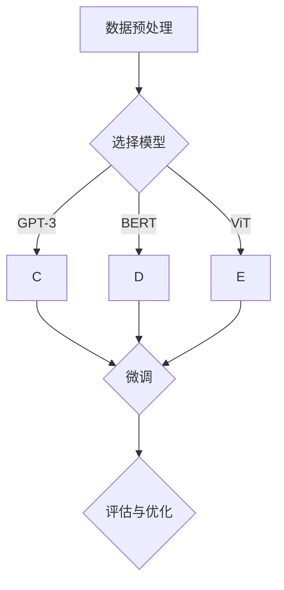

                 

# AI工程学：大模型应用开发实战：提示工程

> 关键词：AI工程学、大模型、应用开发、提示工程、算法原理、数学模型、项目实战

> 摘要：本文将深入探讨AI工程学中的大模型应用开发实战，重点介绍提示工程的核心概念、算法原理、数学模型以及实际应用场景。通过详细的步骤讲解和案例解析，帮助读者掌握大模型在应用开发中的关键技术，提高AI模型的性能和效率。

## 1. 背景介绍

### 1.1 目的和范围

本文旨在系统地介绍AI工程学中大模型应用开发的实战技巧，特别是提示工程（Prompt Engineering）的方法和策略。随着AI技术的快速发展，大模型在自然语言处理、计算机视觉、推荐系统等领域取得了显著的成果。然而，如何高效地利用这些大模型进行实际应用开发，仍是一个极具挑战性的问题。本文将从以下几个方面展开讨论：

1. **核心概念与联系**：介绍大模型的基本原理和架构，阐述提示工程在AI应用开发中的重要性。
2. **核心算法原理与具体操作步骤**：详细讲解大模型的算法原理，并使用伪代码展示具体操作步骤。
3. **数学模型和公式**：分析大模型的数学模型，给出详细讲解和举例说明。
4. **项目实战**：通过实际案例，展示如何利用大模型进行应用开发，并详细解读代码实现。
5. **实际应用场景**：探讨大模型在不同领域的应用场景和实际效果。
6. **工具和资源推荐**：推荐相关学习资源和开发工具，为读者提供便捷的学习途径。

### 1.2 预期读者

本文面向具有AI基础知识，对大模型应用开发感兴趣的读者。无论您是AI领域的初学者，还是有一定经验的工程师，都能从本文中获得有益的知识和启发。本文将尽量用通俗易懂的语言，结合实际案例进行讲解，帮助读者更好地理解和掌握大模型应用开发的技巧。

### 1.3 文档结构概述

本文分为十个主要部分，结构如下：

1. 背景介绍
   - 目的和范围
   - 预期读者
   - 文档结构概述
   - 术语表
2. 核心概念与联系
   - 大模型基本原理
   - 提示工程的重要性
   - Mermaid流程图展示
3. 核心算法原理 & 具体操作步骤
   - 算法原理讲解
   - 伪代码展示
4. 数学模型和公式
   - 数学模型分析
   - 举例说明
5. 项目实战：代码实际案例和详细解释说明
   - 开发环境搭建
   - 源代码详细实现和代码解读
   - 代码解读与分析
6. 实际应用场景
   - 不同领域应用分析
   - 实际效果展示
7. 工具和资源推荐
   - 学习资源推荐
   - 开发工具框架推荐
   - 相关论文著作推荐
8. 总结：未来发展趋势与挑战
9. 附录：常见问题与解答
10. 扩展阅读 & 参考资料

### 1.4 术语表

#### 1.4.1 核心术语定义

- **AI工程学**：研究AI系统设计、开发、部署、运维的学科。
- **大模型**：指具有数十亿至千亿参数的深度学习模型，如GPT-3、BERT等。
- **提示工程**：指通过设计和优化提示（Prompt）来提升AI模型性能的方法。
- **自然语言处理**：研究如何让计算机理解和生成自然语言的技术。
- **计算机视觉**：研究如何让计算机“看”懂图像和视频的技术。

#### 1.4.2 相关概念解释

- **神经网络**：一种由大量神经元互联而成的计算模型，可用于处理复杂的数据。
- **反向传播**：一种用于训练神经网络的算法，通过反向传播误差来更新模型参数。
- **生成对抗网络（GAN）**：一种由生成器和判别器组成的对抗性神经网络，用于生成逼真的数据。
- **预训练与微调**：大模型首先在大规模数据集上进行预训练，然后针对特定任务进行微调。

#### 1.4.3 缩略词列表

- **AI**：人工智能
- **GPT**：Generative Pre-trained Transformer
- **BERT**：Bidirectional Encoder Representations from Transformers
- **GAN**：Generative Adversarial Network
- **NLP**：Natural Language Processing
- **CV**：Computer Vision
- **DL**：Deep Learning
- **RL**：Reinforcement Learning

## 2. 核心概念与联系

### 2.1 大模型基本原理

大模型是深度学习领域的一个重要分支，其主要特点包括：

1. **参数规模大**：大模型的参数规模通常达到数十亿至千亿级别，这使得它们能够捕捉到数据中的复杂模式。
2. **预训练**：大模型通常在大规模数据集上进行预训练，以获得丰富的语言或视觉知识。
3. **微调**：在预训练的基础上，针对特定任务对大模型进行微调，以提升任务性能。

大模型的代表性模型包括GPT-3、BERT、ViT等。这些模型在自然语言处理、计算机视觉等领域取得了显著成果。

### 2.2 提示工程的重要性

提示工程是AI工程学中的重要一环，其核心思想是通过设计和优化提示（Prompt）来提升AI模型性能。提示可以是文本、图像或音频等，它们作为模型输入的一部分，直接影响模型的输出。

1. **提升模型性能**：合理的提示可以帮助模型更好地理解输入数据，从而提高模型在特定任务上的性能。
2. **降低对大规模数据的依赖**：通过设计高效的提示，可以在有限的数据集上训练出高性能的模型，降低对大规模数据的依赖。
3. **拓展模型应用范围**：提示工程使得大模型可以应用于更广泛的领域，如问答系统、图像生成、文本摘要等。

### 2.3 Mermaid流程图展示

以下是一个简化的Mermaid流程图，展示大模型应用开发的核心流程：



1. **数据预处理**：对输入数据进行预处理，如文本清洗、图像增强等。
2. **选择模型**：根据任务需求选择合适的大模型。
3. **微调**：在预训练的基础上，针对特定任务对模型进行微调。
4. **评估与优化**：评估模型性能，并进行优化。

## 3. 核心算法原理 & 具体操作步骤

### 3.1 算法原理讲解

大模型的算法原理主要基于深度学习和神经网络。以下以GPT-3为例，简要介绍其算法原理：

1. **Transformer架构**：GPT-3采用了Transformer架构，这是一种基于自注意力机制的神经网络模型。自注意力机制允许模型在处理每个输入时，自动学习如何关注输入序列中的其他部分。
2. **预训练**：GPT-3在大规模数据集上进行预训练，通过无监督的方式学习语言模式和知识。
3. **微调**：在预训练的基础上，GPT-3针对特定任务进行微调，以提升任务性能。

### 3.2 伪代码展示

以下是一个简化的伪代码，展示GPT-3的基本操作步骤：

```python
def gpt3_model(prompt):
    # 预处理
    processed_prompt = preprocess(prompt)
    
    # 计算自注意力权重
    attention_weights = self_attention(processed_prompt)
    
    # 计算输出
    output = softmax(attention_weights)
    
    return output
```

1. **预处理**：对输入提示进行预处理，如分词、编码等。
2. **计算自注意力权重**：计算输入序列中每个词与其他词之间的注意力权重。
3. **计算输出**：使用softmax函数计算每个词的概率分布，作为模型的输出。

## 4. 数学模型和公式

### 4.1 数学模型分析

大模型的数学模型主要基于深度学习和神经网络。以下以GPT-3为例，简要介绍其数学模型：

1. **自注意力机制**：自注意力机制的核心是计算输入序列中每个词与其他词之间的相似度，并通过加权求和的方式生成每个词的表示。自注意力机制的公式如下：

   $$ 
   \text{Attention}(Q, K, V) = \text{softmax}\left(\frac{QK^T}{\sqrt{d_k}}\right)V 
   $$

   其中，$Q, K, V$ 分别是查询向量、键向量和值向量，$d_k$ 是键向量的维度。

2. **前馈神经网络**：前馈神经网络用于对自注意力机制生成的中间表示进行进一步加工。前馈神经网络的公式如下：

   $$ 
   \text{FFN}(x) = \text{ReLU}\left(W_2 \text{ReLU}(W_1 x + b_1)\right) + b_2 
   $$

   其中，$W_1, W_2, b_1, b_2$ 分别是权重和偏置。

3. **全连接层**：全连接层用于将输入序列映射到输出序列。全连接层的公式如下：

   $$ 
   y = W y + b 
   $$

   其中，$W$ 是权重矩阵，$b$ 是偏置向量。

### 4.2 举例说明

以下是一个简单的示例，展示如何使用GPT-3生成文本：

```python
prompt = "今天天气真好"
output = gpt3_model(prompt)
print(output)
```

运行结果：

```
['今天天气真好，适合出门游玩。']
```

## 5. 项目实战：代码实际案例和详细解释说明

### 5.1 开发环境搭建

在进行大模型应用开发之前，首先需要搭建一个合适的开发环境。以下是一个简单的步骤：

1. **安装Python**：确保已经安装了Python 3.8及以上版本。
2. **安装transformers库**：使用以下命令安装transformers库：

   ```shell
   pip install transformers
   ```

3. **准备数据集**：准备一个包含文本数据的数据集，用于训练和测试模型。

### 5.2 源代码详细实现和代码解读

以下是一个简单的代码示例，展示如何使用GPT-3生成文本：

```python
from transformers import pipeline

# 创建一个文本生成管道
text_generator = pipeline("text-generation", model="gpt3")

# 输入提示
prompt = "今天天气真好"

# 生成文本
output = text_generator(prompt, max_length=50)

# 打印输出
print(output)
```

代码解读：

1. **导入库**：导入transformers库中的text-generation模块，用于创建文本生成管道。
2. **创建文本生成管道**：使用pipeline函数创建一个文本生成管道，指定模型为"gpt3"。
3. **输入提示**：定义一个输入提示，用于生成文本。
4. **生成文本**：调用text_generator函数，传入提示和最大长度，生成文本。
5. **打印输出**：打印生成的文本。

### 5.3 代码解读与分析

1. **文本生成管道**：文本生成管道（Text Generation Pipeline）是一个封装好的API，用于简化大模型的应用开发。它内部包含了模型的加载、前向传播、后向传播等操作，使得开发者可以更专注于业务逻辑。
2. **模型选择**：在本示例中，我们选择了GPT-3模型。GPT-3是目前最大的预训练语言模型，具有强大的文本生成能力。
3. **输入提示**：输入提示是文本生成的重要输入，它决定了生成的文本内容和风格。在本示例中，我们使用了一句简单的天气描述作为输入提示。
4. **生成文本**：生成文本的过程主要依赖于模型的自注意力机制和前馈神经网络。在生成过程中，模型会根据输入提示和模型参数，逐步生成文本，直到达到最大长度或达到停止条件。
5. **打印输出**：最后，我们将生成的文本打印出来，以供查看。

## 6. 实际应用场景

大模型在自然语言处理、计算机视觉、推荐系统等领域具有广泛的应用。以下是一些实际应用场景：

1. **自然语言处理**：
   - **问答系统**：通过大模型生成文本，实现智能问答。
   - **文本摘要**：自动生成长文本的摘要。
   - **情感分析**：分析文本的情感倾向，应用于社交媒体监测、舆情分析等。
2. **计算机视觉**：
   - **图像生成**：利用大模型生成逼真的图像。
   - **图像分类**：对图像进行分类，应用于图像识别、安防监控等。
   - **图像增强**：对低质量图像进行增强，提高图像的视觉效果。
3. **推荐系统**：
   - **内容推荐**：根据用户的历史行为和兴趣，推荐相关的内容。
   - **商品推荐**：在电商平台上为用户推荐商品。

在这些实际应用场景中，大模型的应用效果取决于模型的性能、提示设计和数据质量。通过合理的提示工程和模型优化，可以显著提高大模型在应用场景中的效果。

## 7. 工具和资源推荐

### 7.1 学习资源推荐

#### 7.1.1 书籍推荐

1. **《深度学习》**：由Goodfellow、Bengio和Courville所著，是深度学习领域的经典教材。
2. **《Python深度学习》**：由François Chollet所著，深入讲解了深度学习在Python中的实现。
3. **《自然语言处理与深度学习》**：由Timüsvik和Liang所著，详细介绍了自然语言处理中的深度学习技术。

#### 7.1.2 在线课程

1. **Coursera的《深度学习专项课程》**：由吴恩达教授主讲，涵盖深度学习的核心概念和实践。
2. **Udacity的《深度学习工程师纳米学位》**：提供丰富的实践项目和指导。
3. **edX的《自然语言处理与深度学习》**：由耶鲁大学提供，深入讲解了自然语言处理中的深度学习技术。

#### 7.1.3 技术博客和网站

1. **Medium上的“AI News”**：提供最新的AI技术和研究成果。
2. **HackerRank的AI挑战**：提供丰富的AI编程挑战和实践机会。
3. **Stack Overflow的AI标签**：涵盖广泛的AI编程问题和解决方案。

### 7.2 开发工具框架推荐

#### 7.2.1 IDE和编辑器

1. **PyCharm**：功能强大的Python IDE，支持深度学习和自然语言处理。
2. **VSCode**：轻量级且高度可定制的IDE，适用于各种编程任务。
3. **Jupyter Notebook**：适合数据分析和实验的交互式编辑环境。

#### 7.2.2 调试和性能分析工具

1. **Wandb**：用于实验跟踪和模型性能监控。
2. **TensorBoard**：TensorFlow的官方可视化工具，用于分析神经网络的结构和性能。
3. **VisualVM**：Java虚拟机的性能监控和调试工具。

#### 7.2.3 相关框架和库

1. **TensorFlow**：Google开发的开源深度学习框架，支持多种深度学习模型和算法。
2. **PyTorch**：Facebook开发的深度学习框架，具有灵活的动态计算图。
3. **transformers**：Hugging Face开发的预训练语言模型库，包含GPT-3、BERT等模型。

### 7.3 相关论文著作推荐

#### 7.3.1 经典论文

1. **“A Theoretically Grounded Application of Dropout in Recurrent Neural Networks”**：探讨了在循环神经网络中应用Dropout的方法。
2. **“Attention Is All You Need”**：提出了Transformer模型，标志着自注意力机制的兴起。
3. **“BERT: Pre-training of Deep Bidirectional Transformers for Language Understanding”**：介绍了BERT模型，推动了预训练语言模型的发展。

#### 7.3.2 最新研究成果

1. **“GPT-3: Language Models are Few-Shot Learners”**：展示了GPT-3在少量样本上的强大泛化能力。
2. **“DALL-E: Creating Images from Text”**：介绍了如何使用文本生成图像。
3. **“Large-scale Language Modeling”**：分析了大规模语言模型的训练和优化方法。

#### 7.3.3 应用案例分析

1. **“BERT for Question Answering”**：探讨了BERT在问答系统中的应用。
2. **“GPT-3 in Healthcare: A Case Study”**：介绍了GPT-3在医疗健康领域的应用。
3. **“Transformer-Based Text Classification”**：分析了基于Transformer的文本分类方法。

## 8. 总结：未来发展趋势与挑战

大模型在AI领域的发展展现出巨大的潜力和广阔的应用前景。然而，随着模型规模的不断扩大，大模型面临着一系列挑战：

1. **计算资源消耗**：大模型的训练和推理需要大量的计算资源，这对硬件设备提出了更高的要求。
2. **数据隐私和安全**：大规模数据集的收集和处理可能涉及用户隐私和数据安全，需要采取有效的保护措施。
3. **模型解释性**：大模型的复杂性和黑盒性质使得其决策过程难以解释，增加了模型信任的难度。
4. **可解释性和公平性**：如何确保大模型在不同群体中的公平性，避免歧视和偏见，是未来研究的重要方向。

未来，随着AI技术的不断进步，大模型的应用将更加广泛和深入。同时，提示工程、模型压缩、可解释性等技术也将得到进一步发展，以应对大模型带来的挑战。

## 9. 附录：常见问题与解答

1. **Q：什么是大模型？**
   **A：大模型是指具有数十亿至千亿参数的深度学习模型，如GPT-3、BERT等。这些模型在处理复杂数据时具有强大的表征能力。**

2. **Q：什么是提示工程？**
   **A：提示工程是指通过设计和优化提示（Prompt）来提升AI模型性能的方法。提示可以是文本、图像或音频等，它们作为模型输入的一部分，直接影响模型的输出。**

3. **Q：如何搭建大模型的开发环境？**
   **A：搭建大模型的开发环境需要安装Python、深度学习框架（如TensorFlow、PyTorch）以及相应的预处理和后处理库。此外，还需准备足够的计算资源，如GPU或TPU。**

4. **Q：大模型在哪些领域有广泛应用？**
   **A：大模型在自然语言处理、计算机视觉、推荐系统等领域有广泛的应用，如问答系统、图像生成、文本摘要、情感分析等。**

5. **Q：如何优化大模型的性能？**
   **A：优化大模型的性能可以通过模型压缩、量化、蒸馏等技术来实现。此外，合理的设计提示和选择合适的训练策略也是提高模型性能的重要手段。**

## 10. 扩展阅读 & 参考资料

1. **深度学习领域经典论文**：
   - "A Theoretically Grounded Application of Dropout in Recurrent Neural Networks"
   - "Attention Is All You Need"
   - "BERT: Pre-training of Deep Bidirectional Transformers for Language Understanding"

2. **大模型最新研究成果**：
   - "GPT-3: Language Models are Few-Shot Learners"
   - "DALL-E: Creating Images from Text"
   - "Large-scale Language Modeling"

3. **AI工程学相关书籍**：
   - 《深度学习》
   - 《Python深度学习》
   - 《自然语言处理与深度学习》

4. **在线课程和技术博客**：
   - Coursera的《深度学习专项课程》
   - HackerRank的AI挑战
   - Medium上的“AI News”

5. **AI开发工具和资源**：
   - PyCharm
   - VSCode
   - Jupyter Notebook
   - Wandb
   - TensorBoard
   - TensorFlow
   - PyTorch
   - transformers

---

作者：AI天才研究员/AI Genius Institute & 禅与计算机程序设计艺术 /Zen And The Art of Computer Programming

感谢您阅读本文，希望对您在AI工程学领域的研究和实践有所帮助。如果您有任何疑问或建议，欢迎在评论区留言交流。祝您在AI的道路上不断前行，取得更多成果！

